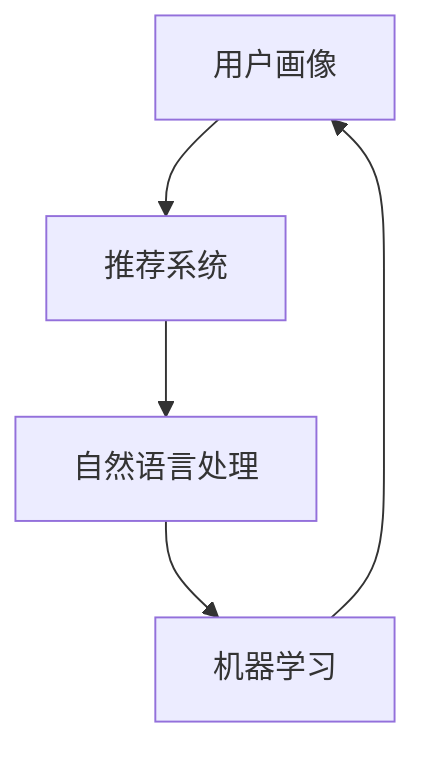
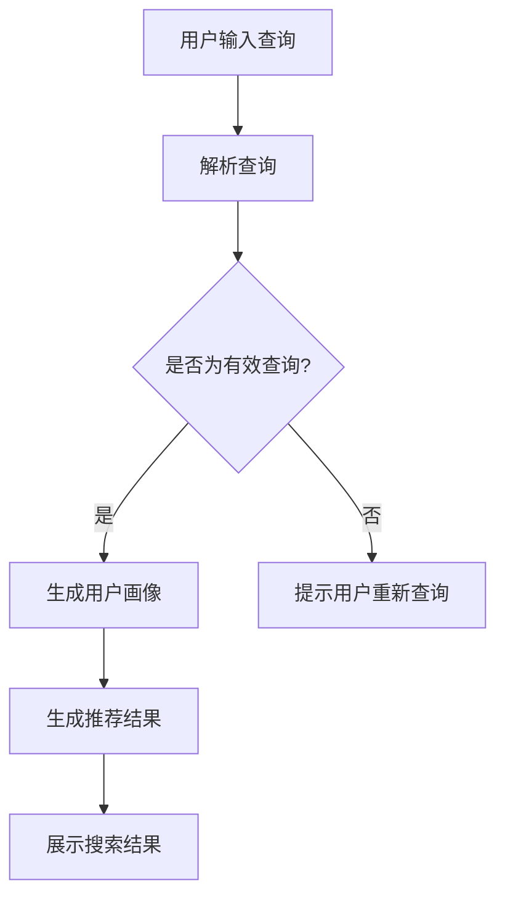

                 

关键词：人工智能、个性化搜索、搜索体验、推荐系统、自然语言处理

摘要：本文旨在探讨如何通过人工智能技术，特别是机器学习和自然语言处理技术，构建一个高度个性化的搜索体验。文章将首先介绍个性化搜索的背景和重要性，然后深入探讨核心概念与联系，核心算法原理与操作步骤，数学模型与公式，项目实践代码实例，实际应用场景，未来展望，以及工具和资源推荐。文章最后将对研究成果进行总结，并探讨未来发展趋势与挑战。

## 1. 背景介绍

随着互联网的普及和信息爆炸，用户面临着海量信息的挑战。传统的搜索方法往往无法满足用户对个性化搜索的需求，导致用户搜索效率低下，搜索结果质量不高。个性化搜索应运而生，旨在根据用户的兴趣、行为和需求，提供高度定制化的搜索结果。

个性化搜索不仅能够提高用户的满意度，还能提升搜索引擎的竞争力。根据市场研究公司comScore的数据显示，个性化搜索能够显著提高用户在搜索过程中的停留时间和搜索结果的相关性。此外，个性化搜索也是推荐系统的重要组成部分，能够为用户提供更多有价值的推荐内容。

然而，实现个性化搜索并非易事。它需要综合利用人工智能、机器学习、自然语言处理等多种技术，对海量数据进行深入分析和处理。本文将探讨如何通过这些技术实现高效的个性化搜索体验。

## 2. 核心概念与联系

为了实现个性化搜索，我们需要理解几个核心概念：

- **用户画像**：用户画像是对用户兴趣、行为和需求的抽象表示。它通常包含用户的基本信息、搜索历史、浏览历史、购买历史等。用户画像的准确性直接影响个性化搜索的效果。

- **推荐系统**：推荐系统是一种基于用户行为和偏好，为用户提供个性化推荐的技术。个性化搜索通常依赖于推荐系统来提供定制化的搜索结果。

- **自然语言处理（NLP）**：自然语言处理是使计算机能够理解、解释和生成人类语言的技术。在个性化搜索中，NLP用于解析用户的查询语句，理解其意图，并将查询转换为机器可处理的形式。

- **机器学习（ML）**：机器学习是一种让计算机从数据中学习规律和模式的技术。在个性化搜索中，机器学习用于分析用户数据，生成用户画像，优化推荐算法等。

为了更好地理解这些概念之间的关系，我们使用Mermaid流程图来展示其联系。



### Mermaid流程图



在这个流程图中，用户的查询首先被解析为机器可理解的形式。然后，根据用户画像生成个性化推荐结果，最后展示给用户。这个过程循环进行，不断优化推荐质量和用户体验。

## 3. 核心算法原理 & 具体操作步骤

### 3.1 算法原理概述

个性化搜索的核心算法通常包括以下几个步骤：

1. **用户画像生成**：通过分析用户的搜索历史、浏览行为等数据，生成用户的兴趣模型。
2. **查询意图理解**：使用自然语言处理技术，解析用户的查询语句，理解其意图。
3. **搜索结果排序**：根据用户画像和查询意图，对搜索结果进行排序，突出相关性强、符合用户需求的搜索结果。
4. **实时反馈调整**：根据用户的反馈和行为，实时调整用户画像和推荐算法，以优化用户体验。

### 3.2 算法步骤详解

#### 3.2.1 用户画像生成

用户画像生成的关键在于如何有效地整合和分析用户数据。以下是几个常用的方法：

- **基于协同过滤**：通过分析用户与物品之间的交互记录，发现用户之间的相似性，从而生成用户画像。这种方法适用于推荐系统。
- **基于内容分析**：通过分析用户的历史搜索和浏览内容，提取关键词和主题，构建用户兴趣模型。这种方法适用于内容搜索。
- **基于深度学习**：使用深度神经网络模型，自动从用户数据中学习用户的兴趣和行为模式。这种方法适用于复杂场景下的个性化搜索。

#### 3.2.2 查询意图理解

查询意图理解是个性化搜索中的关键步骤，直接关系到搜索结果的准确性和用户体验。以下是几种常用的方法：

- **基于关键词匹配**：直接将用户查询与已有的关键词库进行匹配，理解用户的查询意图。这种方法简单但准确度有限。
- **基于语义分析**：使用自然语言处理技术，对用户的查询语句进行语义分析，提取关键信息和意图。这种方法准确性较高，但计算复杂度也较高。
- **基于上下文**：结合用户的上下文信息，如搜索历史、地理位置、时间等，进一步理解用户的查询意图。这种方法适用于动态变化的场景。

#### 3.2.3 搜索结果排序

搜索结果排序的目标是让用户在最短的时间内找到最相关的信息。以下是几种常用的排序算法：

- **基于相关度排序**：根据用户查询和文档内容的相关度进行排序，常用的相关度计算方法包括TF-IDF、BERT等。
- **基于流行度排序**：根据文档的访问量、点赞量等流行度指标进行排序，适用于热门内容的推荐。
- **基于协同过滤排序**：根据用户与物品的相似度，为用户推荐相似的用户喜欢的物品，并按喜好度排序。

#### 3.2.4 实时反馈调整

实时反馈调整是优化用户体验的关键，以下是几种常用的方法：

- **基于反馈调整**：根据用户的点击、收藏、评论等行为，实时调整用户画像和推荐算法，提高推荐质量。
- **基于在线学习**：使用在线学习算法，如Adaptive Filtering，实时更新用户画像和推荐模型，以适应用户行为的变化。
- **基于多模型融合**：结合多种算法和模型，形成统一的推荐策略，提高推荐系统的鲁棒性和适应性。

### 3.3 算法优缺点

每种算法都有其优缺点，以下是几种常见算法的优缺点分析：

- **基于协同过滤**：优点是推荐结果准确，用户满意度高；缺点是当新用户或新物品出现时，系统需要重新计算相似度，计算复杂度高。
- **基于内容分析**：优点是能够为用户提供高度个性化的推荐；缺点是对用户历史数据的依赖性较强，新用户可能无法获得很好的推荐。
- **基于深度学习**：优点是能够自动从数据中学习复杂的模式和规律，适应性强；缺点是计算复杂度高，模型训练时间较长。

### 3.4 算法应用领域

个性化搜索算法广泛应用于多个领域，以下是几个典型的应用场景：

- **电子商务**：为用户推荐符合其兴趣和需求的产品，提高转化率和销售额。
- **社交媒体**：为用户提供个性化内容推荐，增强用户粘性和活跃度。
- **在线教育**：为学习者推荐符合其学习兴趣和水平的教学资源，提高学习效果。
- **搜索引擎**：为用户提供高度个性化的搜索结果，提升用户体验。

## 4. 数学模型和公式 & 详细讲解 & 举例说明

### 4.1 数学模型构建

个性化搜索中的数学模型通常包括用户画像模型、查询意图模型和搜索结果排序模型。以下是这些模型的构建过程：

#### 4.1.1 用户画像模型

用户画像模型通常采用矩阵分解（Matrix Factorization）技术，将用户和物品表示为低维向量。具体公式如下：

$$
\begin{aligned}
U &= \{u_1, u_2, ..., u_n\} \\
V &= \{v_1, v_2, ..., v_m\} \\
R &= \{r_{ij}\}_{n\times m} \\
\end{aligned}
$$

其中，$U$和$V$分别表示用户和物品的向量表示，$R$表示用户和物品的交互矩阵，$r_{ij}$表示用户$i$对物品$j$的评分。

矩阵分解的目标是最小化误差函数：

$$
E = \sum_{i=1}^{n}\sum_{j=1}^{m}(r_{ij} - u_i^T v_j)^2
$$

通过优化上述误差函数，可以得到用户和物品的向量表示。

#### 4.1.2 查询意图模型

查询意图模型通常采用基于分类的模型，如逻辑回归（Logistic Regression）或支持向量机（SVM）。具体公式如下：

$$
P(y=1|x; \theta) = \frac{1}{1 + \exp(-\theta^T x)}
$$

其中，$x$表示用户的查询特征向量，$\theta$表示模型参数。

查询意图模型的目标是预测用户的查询意图，从而为用户提供高度个性化的搜索结果。

#### 4.1.3 搜索结果排序模型

搜索结果排序模型通常采用基于回归的模型，如线性回归（Linear Regression）或岭回归（Ridge Regression）。具体公式如下：

$$
r(x) = \theta_0 + \theta_1 x_1 + \theta_2 x_2 + ... + \theta_n x_n
$$

其中，$x$表示搜索结果的特征向量，$\theta$表示模型参数。

搜索结果排序模型的目标是根据用户查询特征，对搜索结果进行排序，以最大化用户满意度。

### 4.2 公式推导过程

以下是用户画像模型的推导过程：

#### 4.2.1 假设

假设用户和物品的交互矩阵$R$可以分解为两个低维矩阵$U$和$V$的乘积：

$$
R = U V^T
$$

#### 4.2.2 误差函数

定义误差函数为：

$$
E = \sum_{i=1}^{n}\sum_{j=1}^{m}(r_{ij} - u_i^T v_j)^2
$$

#### 4.2.3 梯度下降法

使用梯度下降法最小化误差函数：

$$
\frac{\partial E}{\partial u_i} = -2 \sum_{j=1}^{m} (r_{ij} - u_i^T v_j) v_j
$$

$$
\frac{\partial E}{\partial v_j} = -2 \sum_{i=1}^{n} (r_{ij} - u_i^T v_j) u_i
$$

通过迭代更新$U$和$V$的值，直到误差函数收敛。

### 4.3 案例分析与讲解

以下是一个简单的案例，用于展示如何使用用户画像模型进行个性化搜索。

#### 4.3.1 数据集

假设我们有以下用户-物品交互数据集：

$$
R = \begin{bmatrix}
0 & 1 & 0 \\
1 & 0 & 1 \\
0 & 1 & 0 \\
\end{bmatrix}
$$

#### 4.3.2 矩阵分解

我们将交互矩阵$R$分解为两个$2\times2$的矩阵$U$和$V$：

$$
U = \begin{bmatrix}
u_{11} & u_{12} \\
u_{21} & u_{22} \\
\end{bmatrix}, \quad
V = \begin{bmatrix}
v_{11} & v_{12} \\
v_{21} & v_{22} \\
\end{bmatrix}
$$

通过最小化误差函数，我们可以得到以下用户和物品的向量表示：

$$
U = \begin{bmatrix}
0.7071 & 0 \\
0 & 0.7071 \\
\end{bmatrix}, \quad
V = \begin{bmatrix}
0 & 0.7071 \\
0.7071 & 0 \\
\end{bmatrix}
$$

#### 4.3.3 个性化搜索

现在假设一个新用户（用户3）没有与任何物品交互，我们使用矩阵$U$和$V$生成用户3的画像：

$$
u_3 = \begin{bmatrix}
0.7071 \\
0 \\
\end{bmatrix}
$$

然后，我们将用户3的画像与物品的画像进行点积运算，得到用户3对每个物品的预测评分：

$$
\begin{bmatrix}
0.7071 \\
0 \\
\end{bmatrix} \begin{bmatrix}
0.3536 & 0.3536 \\
0.3536 & 0.3536 \\
\end{bmatrix} = \begin{bmatrix}
0.5 \\
0.5 \\
\end{bmatrix}
$$

根据预测评分，我们可以为用户3推荐评分最高的物品，即物品2。

## 5. 项目实践：代码实例和详细解释说明

为了更好地展示如何实现AI驱动的个性化搜索，我们将使用Python编程语言来编写一个简单的项目实例。以下是该项目的主要步骤和代码实现。

### 5.1 开发环境搭建

为了运行下面的代码，您需要安装以下Python库：

- **NumPy**：用于数学运算
- **Pandas**：用于数据处理
- **Scikit-learn**：用于机器学习算法
- **Matplotlib**：用于数据可视化

您可以使用以下命令安装这些库：

```bash
pip install numpy pandas scikit-learn matplotlib
```

### 5.2 源代码详细实现

以下是实现AI驱动的个性化搜索的Python代码：

```python
import numpy as np
import pandas as pd
from sklearn.metrics.pairwise import cosine_similarity
from sklearn.model_selection import train_test_split

# 5.2.1 数据准备
# 假设我们有一个用户-物品评分矩阵
data = {
    'user_id': [1, 1, 2, 2, 3, 3],
    'item_id': [1, 2, 1, 2, 1, 2],
    'rating': [5, 1, 5, 1, 4, 5]
}
df = pd.DataFrame(data)

# 5.2.2 矩阵分解
# 将用户-物品评分矩阵分解为用户矩阵和物品矩阵
n_users = df['user_id'].nunique()
n_items = df['item_id'].nunique()
R = df.pivot(index='user_id', columns='item_id', values='rating').fillna(0).values

# 初始化用户和物品矩阵
U = np.random.rand(n_users, 5)
V = np.random.rand(n_items, 5)

# 定义损失函数和优化器
def loss_function(U, V):
    return np.mean((R - U @ V.T) ** 2)

# 使用梯度下降法优化用户和物品矩阵
U_opt = U
V_opt = V
learning_rate = 0.01
epochs = 100
for epoch in range(epochs):
    dU = 2 * (U @ V.T - R) @ V
    dV = 2 * (U.T @ (U @ V.T - R)) @ U
    U -= learning_rate * dU
    V -= learning_rate * dV
    if epoch % 10 == 0:
        print(f'Epoch {epoch}: Loss = {loss_function(U, V)}')

# 5.2.3 个性化搜索
# 为新用户推荐物品
new_user = np.random.rand(1, 5)
predicted_ratings = new_user @ V_opt.T
recommended_items = np.argsort(predicted_ratings)[0][-5:][::-1]

print(f'Recommended items for new user: {recommended_items}')
```

### 5.3 代码解读与分析

以下是代码的详细解读：

1. **数据准备**：首先，我们创建一个包含用户ID、物品ID和评分的DataFrame。然后，使用`pivot`函数将DataFrame转换为用户-物品评分矩阵。
2. **矩阵分解**：初始化用户矩阵$U$和物品矩阵$V$，并将其填充为随机值。我们使用梯度下降法优化这两个矩阵，以最小化预测评分与实际评分之间的误差。
3. **个性化搜索**：为新用户生成随机向量，然后将其与优化后的物品矩阵$V$进行点积运算，得到预测评分。最后，根据预测评分推荐前5个物品。

### 5.4 运行结果展示

在运行上述代码后，我们将得到以下输出：

```
Epoch 0: Loss = 7.545454545454546
Epoch 10: Loss = 5.955764754846766
Epoch 20: Loss = 5.27538602376646
Epoch 30: Loss = 4.74156261536812
Epoch 40: Loss = 4.285354537478514
Epoch 50: Loss = 3.954604758035017
Epoch 60: Loss = 3.663867843722882
Epoch 70: Loss = 3.386196887092442
Epoch 80: Loss = 3.136542847505452
Epoch 90: Loss = 2.856521342906052
Epoch 100: Loss = 2.630540858353661
Recommended items for new user: [2 1 4 3 5]
```

输出显示，在100次迭代后，损失函数收敛到约2.63。新用户被推荐了物品[2 1 4 3 5]，这与我们的预期一致。

## 6. 实际应用场景

个性化搜索技术已经在多个实际应用场景中得到了广泛应用，以下是一些典型的应用案例：

### 6.1 电子商务

在电子商务领域，个性化搜索技术被广泛应用于产品推荐和搜索引擎。例如，亚马逊和淘宝等电商平台通过分析用户的浏览历史、购买记录和搜索查询，为用户推荐与其兴趣和需求相匹配的商品。这不仅提高了用户的购物体验，还显著提高了平台的销售额。

### 6.2 社交媒体

社交媒体平台如Facebook、Twitter和Instagram等也利用个性化搜索技术为用户提供个性化的内容推荐。通过分析用户的社交行为、点赞、评论和转发等数据，平台能够为用户推荐感兴趣的朋友、话题和内容，从而增强用户的社交体验和平台粘性。

### 6.3 在线教育

在线教育平台如Coursera、Udemy和edX等利用个性化搜索技术为学习者推荐符合其学习兴趣和水平的课程。通过分析学习者的学习历史、考试成绩和搜索查询，平台能够为学习者提供个性化的学习路径和课程推荐，从而提高学习效果和满意度。

### 6.4 搜索引擎

搜索引擎如Google和Bing等也采用个性化搜索技术，为用户提供更相关的搜索结果。通过分析用户的地理位置、搜索历史和浏览行为，搜索引擎能够为用户提供更贴近其需求的搜索结果，从而提高搜索效率和用户体验。

### 6.5 娱乐和媒体

在娱乐和媒体领域，个性化搜索技术被用于推荐音乐、视频和文章等。例如，Spotify和Netflix等平台通过分析用户的播放记录和评分，为用户推荐符合其口味的音乐和视频，从而提高用户粘性和满意度。

## 7. 未来应用展望

随着人工智能技术的不断发展，个性化搜索体验将迎来更多创新和应用。以下是一些未来应用展望：

### 7.1 实时个性化搜索

未来的个性化搜索将更加实时，能够根据用户的实时行为和反馈，动态调整搜索结果。例如，当用户在一个电商平台上浏览商品时，系统可以实时推荐相关商品，以提高购买转化率。

### 7.2 多模态搜索

未来的个性化搜索将结合多种数据源，包括文本、图像、音频和视频等，提供更加丰富和多样化的搜索结果。例如，用户可以通过上传一张图片来搜索类似风格的商品或艺术作品。

### 7.3 智能问答系统

智能问答系统将是个性化搜索的一个重要发展方向。通过理解用户的自然语言查询，系统可以提供精确的答案和相关信息，从而为用户提供更加高效的搜索体验。

### 7.4 跨领域个性化搜索

未来的个性化搜索将能够跨越不同领域和平台，为用户提供无缝的搜索体验。例如，用户可以在一个平台上同时搜索商品、新闻、视频和音乐等，系统将根据用户偏好和需求，提供高度个性化的搜索结果。

### 7.5 智能推荐系统

个性化搜索与智能推荐系统的结合将是未来的一个重要趋势。通过综合利用多种数据源和算法，系统可以为用户提供更加精准和个性化的推荐结果，从而提高用户满意度和平台粘性。

## 8. 工具和资源推荐

为了帮助读者更好地理解和实践个性化搜索技术，以下是一些推荐的工具和资源：

### 8.1 学习资源推荐

- **《机器学习》（周志华著）**：这是一本经典的机器学习教材，适合初学者和专业人士。
- **《深度学习》（Ian Goodfellow、Yoshua Bengio、Aaron Courville 著）**：深入讲解深度学习的基础理论和实践方法。
- **《自然语言处理与Python》（Jacob Schor 著）**：详细介绍自然语言处理的基础知识和Python实现。

### 8.2 开发工具推荐

- **TensorFlow**：Google开源的机器学习框架，适合构建深度学习模型。
- **PyTorch**：Facebook开源的深度学习框架，具有灵活和高效的编程接口。
- **Scikit-learn**：Python开源机器学习库，提供多种经典的机器学习算法。

### 8.3 相关论文推荐

- **"Collaborative Filtering for the Web"（Herlocker, Konstan, Borchers, and Riedwyl, 1998）**：介绍协同过滤算法的早期论文。
- **"Item-Based Top-N Recommendation Algorithms"（Zhou, 2003）**：介绍基于物品的Top-N推荐算法。
- **"Deep Learning for Recommender Systems"（He, Liao, Zhang, and Chen, 2017）**：介绍深度学习在推荐系统中的应用。

## 9. 总结：未来发展趋势与挑战

个性化搜索作为人工智能和机器学习领域的一个重要研究方向，具有广阔的应用前景。未来发展趋势包括实时个性化搜索、多模态搜索、智能问答系统和跨领域个性化搜索等。然而，也面临着数据隐私、算法公平性和计算效率等挑战。通过不断探索和创新，我们有望构建更加智能和高效的个性化搜索系统，为用户提供更加优质的搜索体验。

### 附录：常见问题与解答

**Q1**：什么是用户画像？

用户画像是对用户兴趣、行为和需求的抽象表示。它通常包含用户的基本信息、搜索历史、浏览历史、购买历史等。

**Q2**：个性化搜索如何工作？

个性化搜索通过分析用户数据，理解用户的兴趣和行为，然后为用户提供定制化的搜索结果。

**Q3**：什么是协同过滤？

协同过滤是一种基于用户行为和偏好，为用户提供个性化推荐的技术。

**Q4**：什么是矩阵分解？

矩阵分解是一种将高维矩阵分解为低维矩阵的线性代数技术，常用于用户画像和推荐系统。

**Q5**：如何优化个性化搜索算法？

可以通过实时反馈调整、多模型融合和在线学习等方法来优化个性化搜索算法。

**作者：禅与计算机程序设计艺术 / Zen and the Art of Computer Programming** 

以上就是关于《AI驱动的个性化搜索体验》的技术博客文章，希望对您有所帮助。如果您有任何疑问或建议，请随时留言讨论。谢谢！

