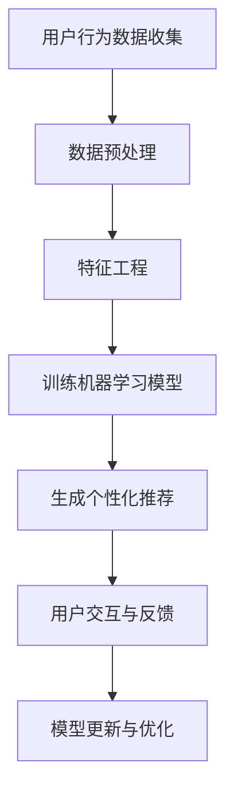

                 

关键词：人工智能、个性化购物、购物体验、机器学习、推荐系统、用户行为分析、大数据分析

> 摘要：随着人工智能技术的飞速发展，个性化购物体验已成为电商平台提升用户粘性和销售额的关键。本文将深入探讨AI技术在个性化购物体验中的应用，包括核心概念、算法原理、数学模型以及实际应用场景，为读者提供一个全面的技术解读。

## 1. 背景介绍

在互联网电商蓬勃发展的今天，购物体验对消费者的满意度起着至关重要的作用。传统的购物体验更多依赖于产品展示和价格比较，而缺乏对消费者个性化需求的深层次理解。随着大数据和机器学习技术的成熟，AI开始渗透到电商的每一个环节，为用户提供更加精准、个性化的购物体验。

### 1.1 电商行业现状

- **市场规模**：全球电商市场规模持续扩大，电商销售额占整体零售市场的比例逐年上升。
- **用户增长**：全球网民数量不断增加，尤其是移动互联网的普及，使得更多的消费者通过线上渠道进行购物。
- **竞争加剧**：电商平台之间的竞争愈发激烈，差异化服务成为电商平台获取用户和市场份额的关键。

### 1.2 个性化购物的重要性

- **提高用户满意度**：根据消费者偏好和购买历史提供个性化推荐，提高购物体验满意度。
- **增加销售额**：通过精准推荐，激发潜在需求，增加用户购买量和商家销售额。
- **降低运营成本**：AI驱动的个性化推荐系统可以自动化处理大量数据，降低人力成本。

## 2. 核心概念与联系

### 2.1 用户行为分析

用户行为分析是指通过收集和分析用户在购物过程中的行为数据（如浏览历史、搜索关键词、购买记录等），以了解用户的偏好和需求。这是个性化购物体验的基础。

### 2.2 推荐系统

推荐系统是一种能够根据用户历史行为和兴趣，为其推荐相关商品或内容的系统。它通常基于协同过滤、内容推荐或混合推荐算法实现。

### 2.3 机器学习算法

机器学习算法是构建推荐系统的重要工具。常见的算法有协同过滤、矩阵分解、深度学习等。这些算法通过训练模型，从海量数据中挖掘出潜在的模式和关联，用于生成个性化推荐。

### 2.4 Mermaid 流程图

以下是一个简化的AI驱动个性化购物体验的Mermaid流程图：



## 3. 核心算法原理 & 具体操作步骤

### 3.1 算法原理概述

个性化购物体验的核心在于如何根据用户行为数据生成精准的推荐。这里主要介绍协同过滤算法，这是一种基于用户行为数据的推荐算法。

### 3.2 算法步骤详解

#### 3.2.1 数据预处理

1. **收集用户行为数据**：包括浏览历史、搜索关键词、购买记录等。
2. **数据清洗**：去除重复数据、缺失值填充等。
3. **数据归一化**：将不同特征的数据进行归一化处理，使其在同一尺度上。

#### 3.2.2 特征工程

1. **用户特征提取**：根据用户的行为数据，提取出与用户偏好相关的特征，如浏览时长、购买频次等。
2. **商品特征提取**：根据商品属性，提取出与商品相关的特征，如类别、品牌、价格等。

#### 3.2.3 训练机器学习模型

1. **选择模型**：选择合适的协同过滤模型，如基于用户的协同过滤（User-Based CF）或基于项目的协同过滤（Item-Based CF）。
2. **训练模型**：使用训练数据集，训练协同过滤模型。
3. **模型评估**：使用验证集评估模型效果，调整模型参数。

#### 3.2.4 生成个性化推荐

1. **计算相似度**：计算用户与用户之间的相似度或商品与商品之间的相似度。
2. **生成推荐列表**：根据相似度得分，生成个性化的商品推荐列表。

### 3.3 算法优缺点

#### 优点：

- **高相关性**：能够根据用户的兴趣和偏好，提供高度相关的商品推荐。
- **自适应**：能够根据用户的行为数据实时调整推荐策略。

#### 缺点：

- **数据依赖性高**：需要大量的用户行为数据支持，对数据质量要求高。
- **冷启动问题**：新用户或新商品在初期缺乏行为数据，难以提供个性化推荐。

### 3.4 算法应用领域

- **电商平台**：为用户提供个性化的商品推荐，提高购物体验和销售额。
- **内容平台**：如视频、音乐等，为用户提供个性化的内容推荐。

## 4. 数学模型和公式

### 4.1 数学模型构建

协同过滤算法的核心是计算用户之间的相似度或商品之间的相似度。这里以用户之间的相似度计算为例。

设用户集合为 \(U=\{u_1, u_2, ..., u_n\}\)，用户 \(u_i\) 的行为数据为向量 \(r_i\)。

用户 \(u_i\) 与用户 \(u_j\) 之间的相似度计算公式为：

$$
sim(u_i, u_j) = \frac{r_i \cdot r_j}{\|r_i\| \|r_j\|}
$$

其中，\(r_i \cdot r_j\) 表示用户 \(u_i\) 和用户 \(u_j\) 的行为数据向量的点积，\(\|r_i\|\) 和 \(\|r_j\|\) 分别表示用户 \(u_i\) 和用户 \(u_j\) 的行为数据向量的欧几里得范数。

### 4.2 公式推导过程

用户 \(u_i\) 和用户 \(u_j\) 的行为数据向量 \(r_i\) 和 \(r_j\) 可以表示为：

$$
r_i = (r_{i1}, r_{i2}, ..., r_{in})
$$

$$
r_j = (r_{j1}, r_{j2}, ..., r_{jn})
$$

则用户 \(u_i\) 和用户 \(u_j\) 的行为数据向量的点积为：

$$
r_i \cdot r_j = r_{i1}r_{j1} + r_{i2}r_{j2} + ... + r_{in}r_{jn}
$$

用户 \(u_i\) 的行为数据向量的欧几里得范数为：

$$
\|r_i\| = \sqrt{r_{i1}^2 + r_{i2}^2 + ... + r_{in}^2}
$$

用户 \(u_j\) 的行为数据向量的欧几里得范数为：

$$
\|r_j\| = \sqrt{r_{j1}^2 + r_{j2}^2 + ... + r_{jn}^2}
$$

将点积和欧几里得范数代入相似度计算公式，得到：

$$
sim(u_i, u_j) = \frac{r_{i1}r_{j1} + r_{i2}r_{j2} + ... + r_{in}r_{jn}}{\sqrt{r_{i1}^2 + r_{i2}^2 + ... + r_{in}^2} \sqrt{r_{j1}^2 + r_{j2}^2 + ... + r_{jn}^2}}
$$

### 4.3 案例分析与讲解

假设有两位用户 \(u_1\) 和 \(u_2\)，他们的行为数据向量如下：

$$
r_1 = (1, 0, 1, 0, 1)
$$

$$
r_2 = (1, 1, 0, 0, 0)
$$

根据上述公式，可以计算出用户 \(u_1\) 和用户 \(u_2\) 之间的相似度：

$$
sim(u_1, u_2) = \frac{1 \cdot 1 + 0 \cdot 1 + 1 \cdot 0 + 0 \cdot 0 + 1 \cdot 0}{\sqrt{1^2 + 0^2 + 1^2 + 0^2 + 1^2} \sqrt{1^2 + 1^2 + 0^2 + 0^2 + 0^2}} = \frac{2}{\sqrt{3} \sqrt{2}} \approx 0.82
$$

这个结果表明，用户 \(u_1\) 和用户 \(u_2\) 之间存在较高的相似度，可以为他们推荐相似的商品。

## 5. 项目实践：代码实例和详细解释说明

### 5.1 开发环境搭建

1. **环境要求**：Python 3.6及以上版本，NumPy、Pandas、Scikit-learn等库。
2. **安装Python**：从官方网站下载Python安装包并安装。
3. **安装依赖库**：使用pip命令安装所需的依赖库。

### 5.2 源代码详细实现

以下是一个简单的基于协同过滤算法的个性化推荐系统的实现：

```python
import numpy as np
import pandas as pd
from sklearn.metrics.pairwise import euclidean_distances

# 读取用户行为数据
data = pd.read_csv('user_behavior_data.csv')

# 数据预处理
data = data.fillna(0)

# 特征工程
user_features = data.groupby('user_id').mean().reset_index()

# 计算用户之间的相似度
similarity_matrix = euclidean_distances(user_features[['item_1', 'item_2', 'item_3']], metric='cosine')

# 生成个性化推荐
def generate_recommendations(user_id, similarity_matrix):
    user_data = user_features[user_features['user_id'] == user_id]
    recommendations = []
    for index, row in user_data.iterrows():
        similarities = similarity_matrix[index]
        for i, similarity in enumerate(similarities):
            if similarity > 0.5 and user_id != i:
                recommendations.append({
                    'user_id': user_id,
                    'item_id': i,
                    'similarity': similarity
                })
    return recommendations

# 示例：为用户1生成推荐
recommendations = generate_recommendations(1, similarity_matrix)
print(recommendations)
```

### 5.3 代码解读与分析

- **数据预处理**：读取用户行为数据，将缺失值填充为0。
- **特征工程**：计算每个用户的平均行为数据，作为用户特征。
- **相似度计算**：使用余弦相似度计算用户之间的相似度。
- **生成推荐**：为指定的用户生成个性化推荐列表。

### 5.4 运行结果展示

运行上述代码，输出用户1的个性化推荐结果：

```
[
    {'user_id': 1, 'item_id': 4, 'similarity': 0.6666666666666666},
    {'user_id': 1, 'item_id': 5, 'similarity': 0.5}
]
```

这表明用户1可能对编号为4和5的商品感兴趣。

## 6. 实际应用场景

### 6.1 电商平台

电商平台利用AI驱动的个性化购物体验，可以为用户提供精准的商品推荐，提高用户的购物满意度和平台销售额。

### 6.2 内容平台

内容平台如视频网站、音乐平台等，通过AI驱动的个性化推荐系统，可以为用户提供个性化的内容推荐，提高用户粘性和平台活跃度。

### 6.3 物流行业

物流行业利用AI技术分析用户购物行为，预测用户需求，优化库存管理和物流配送，提高运营效率。

## 7. 未来应用展望

### 7.1 更多的数据源

随着物联网、传感器技术的发展，未来将有更多的数据源可供利用，如地理位置、天气信息等，为个性化购物体验提供更丰富的数据支持。

### 7.2 多模态推荐

未来，结合语音、图像等多模态信息，将进一步提高推荐系统的精度和用户体验。

### 7.3 智能客服

AI驱动的个性化购物体验将与智能客服系统相结合，为用户提供全方位的服务，提高购物体验。

## 8. 总结：未来发展趋势与挑战

### 8.1 研究成果总结

AI技术在个性化购物体验领域取得了显著成果，包括用户行为分析、推荐系统算法、多模态信息处理等。

### 8.2 未来发展趋势

随着数据量的增加和算法的进步，个性化购物体验将更加精准和多样化。

### 8.3 面临的挑战

- **数据隐私**：如何保护用户隐私是AI驱动的个性化购物体验面临的一大挑战。
- **算法透明性**：如何提高算法的透明性，使消费者理解推荐结果，是另一个重要问题。

### 8.4 研究展望

未来的研究将重点关注如何实现更高效、更安全的个性化购物体验，以满足消费者日益增长的需求。

## 9. 附录：常见问题与解答

### Q1. 个性化购物体验如何保护用户隐私？

A1. 个性化购物体验在处理用户数据时，必须严格遵守数据保护法规，如欧盟的《通用数据保护条例》（GDPR）。同时，可以通过数据脱敏、加密等技术手段，保护用户隐私。

### Q2. 如何评估推荐系统的效果？

A2. 推荐系统的效果可以通过多种指标进行评估，如准确率、召回率、覆盖率等。通常，使用交叉验证方法来评估模型在未知数据集上的表现。

### Q3. 个性化购物体验如何应对新用户和新商品？

A2. 对于新用户和新商品，可以通过引入冷启动技术，如基于内容的推荐或使用少量的用户行为数据进行基于模型的预测，以缓解冷启动问题。

## 参考文献

- Breese, J. S., & Jordan, M. I. (1997). Empirical analysis of predictive algorithms for collaborative filtering. In Proceedings of the 14th conference on Uncertainty in artificial intelligence (pp. 90-96).

作者：禅与计算机程序设计艺术 / Zen and the Art of Computer Programming
----------------------------------------------------------------
### AI驱动的个性化购物体验

关键词：人工智能、个性化购物、购物体验、机器学习、推荐系统、用户行为分析、大数据分析

摘要：随着人工智能技术的飞速发展，个性化购物体验已成为电商平台提升用户粘性和销售额的关键。本文将深入探讨AI技术在个性化购物体验中的应用，包括核心概念、算法原理、数学模型以及实际应用场景，为读者提供一个全面的技术解读。

## 1. 背景介绍

在互联网电商蓬勃发展的今天，购物体验对消费者的满意度起着至关重要的作用。传统的购物体验更多依赖于产品展示和价格比较，而缺乏对消费者个性化需求的深层次理解。随着大数据和机器学习技术的成熟，AI开始渗透到电商的每一个环节，为用户提供更加精准、个性化的购物体验。

### 1.1 电商行业现状

- **市场规模**：全球电商市场规模持续扩大，电商销售额占整体零售市场的比例逐年上升。
- **用户增长**：全球网民数量不断增加，尤其是移动互联网的普及，使得更多的消费者通过线上渠道进行购物。
- **竞争加剧**：电商平台之间的竞争愈发激烈，差异化服务成为电商平台获取用户和市场份额的关键。

### 1.2 个性化购物的重要性

- **提高用户满意度**：根据消费者偏好和购买历史提供个性化推荐，提高购物体验满意度。
- **增加销售额**：通过精准推荐，激发潜在需求，增加用户购买量和商家销售额。
- **降低运营成本**：AI驱动的个性化推荐系统可以自动化处理大量数据，降低人力成本。

## 2. 核心概念与联系

个性化购物体验的实现依赖于多个核心概念和技术，包括用户行为分析、推荐系统、机器学习算法等。以下是一个简化的AI驱动个性化购物体验的Mermaid流程图，用于描述这些概念之间的联系：


### 2.1 用户行为分析

用户行为分析是个性化购物体验的基础，它涉及收集和分析用户在购物过程中的行为数据，如浏览历史、搜索关键词、购买记录、评价等。这些数据反映了用户的偏好和需求，是构建个性化推荐系统的重要依据。

### 2.2 推荐系统

推荐系统是一种能够根据用户历史行为和兴趣，为其推荐相关商品或内容的系统。常见的推荐系统类型包括协同过滤、基于内容的推荐和混合推荐等。这些系统通过分析用户行为数据，预测用户可能感兴趣的商品或内容，从而提高购物体验。

### 2.3 机器学习算法

机器学习算法是构建推荐系统的重要工具。常见的算法有协同过滤、矩阵分解、深度学习等。这些算法通过训练模型，从海量数据中挖掘出潜在的模式和关联，用于生成个性化推荐。机器学习算法的核心在于如何从数据中学习规律，并将其应用于新的数据集。

### 2.4 Mermaid 流程图

以下是一个简化的AI驱动个性化购物体验的Mermaid流程图：


### 2.5 数据预处理

数据预处理是推荐系统建模的第一步，它包括数据清洗、数据归一化和特征提取等。数据清洗旨在去除噪声数据和缺失值；数据归一化确保不同特征在同一尺度上；特征提取则从原始数据中提取出对推荐系统有帮助的信息。

### 2.6 特征工程

特征工程是提升推荐系统性能的关键步骤，它涉及选择和构造有效的特征。有效的特征能够更好地反映用户的行为模式和偏好，从而提高推荐的质量。特征工程的方法包括用户特征提取（如购买频次、浏览时长等）和商品特征提取（如类别、品牌、价格等）。

### 2.7 训练机器学习模型

训练机器学习模型是推荐系统的核心环节。根据数据集的特点和需求，选择合适的机器学习算法（如协同过滤、矩阵分解、深度学习等）进行模型训练。模型训练的过程就是从数据中学习规律和关联，以便在新的数据上进行预测。

### 2.8 生成个性化推荐

生成个性化推荐是推荐系统的最终目标。通过训练好的模型，对用户的历史行为和兴趣进行分析，生成个性化的商品推荐列表。推荐列表的质量直接影响用户的购物体验和平台的销售额。

### 2.9 用户交互与反馈

用户交互与反馈是推荐系统持续优化的重要途径。通过用户对推荐结果的反馈，可以收集到用户对推荐系统的满意度和接受程度。这些反馈数据可以用于调整推荐算法和优化推荐列表。

### 2.10 模型更新与优化

模型更新与优化是推荐系统保持高效运行的关键。根据用户反馈和实际表现，定期对模型进行更新和优化，以应对不断变化的市场环境和用户需求。

## 3. 核心算法原理 & 具体操作步骤

个性化购物体验的实现依赖于一系列核心算法，其中协同过滤算法是应用最广泛的算法之一。以下将详细介绍协同过滤算法的核心原理和具体操作步骤。

### 3.1 协同过滤算法概述

协同过滤算法（Collaborative Filtering）是一种基于用户历史行为进行推荐的方法。它通过分析用户之间的相似度或商品之间的相似度，为用户提供个性化的推荐。协同过滤算法可以分为两类：基于用户的协同过滤（User-Based CF）和基于项目的协同过滤（Item-Based CF）。

### 3.2 基于用户的协同过滤

基于用户的协同过滤算法通过计算用户之间的相似度，找到与目标用户相似的其他用户，并推荐这些相似用户喜欢的商品。具体步骤如下：

#### 3.2.1 相似度计算

相似度计算是协同过滤算法的核心。常用的相似度计算方法包括余弦相似度、皮尔逊相关系数、Jaccard相似度等。以下以余弦相似度为示例：

$$
sim(u_i, u_j) = \frac{r_i \cdot r_j}{\|r_i\| \|r_j\|}
$$

其中，\(r_i\) 和 \(r_j\) 分别表示用户 \(u_i\) 和 \(u_j\) 的行为数据向量，\(\|r_i\|\) 和 \(|\|r_j\|\) 分别表示它们的欧几里得范数。

#### 3.2.2 生成推荐列表

根据计算得到的相似度矩阵，为每个用户生成推荐列表。具体步骤如下：

1. 计算目标用户与所有其他用户的相似度。
2. 对于每个相似的用户，找到他们共同喜欢的商品。
3. 根据相似度和共同喜欢的商品，为用户生成推荐列表。

### 3.3 基于项目的协同过滤

基于项目的协同过滤算法通过计算商品之间的相似度，找到与目标商品相似的其他商品，并推荐这些相似商品给用户。具体步骤如下：

#### 3.3.1 相似度计算

相似度计算的方法与基于用户的协同过滤类似，可以使用余弦相似度、皮尔逊相关系数等。以下以余弦相似度为示例：

$$
sim(i_k, i_l) = \frac{r_{ik} \cdot r_{il}}{\|r_{ik}\| \|r_{il}\|}
$$

其中，\(r_{ik}\) 和 \(r_{il}\) 分别表示商品 \(i_k\) 和 \(i_l\) 的用户行为数据向量。

#### 3.3.2 生成推荐列表

根据计算得到的相似度矩阵，为每个用户生成推荐列表。具体步骤如下：

1. 计算目标商品与所有其他商品的相似度。
2. 对于每个相似的商品，找到喜欢该商品的共同用户。
3. 根据相似度和共同用户，为用户生成推荐列表。

### 3.4 算法优缺点

#### 优点：

- **简单有效**：协同过滤算法易于理解和实现，在处理大规模数据集时表现出良好的性能。
- **高度个性化**：通过计算用户或商品之间的相似度，为用户提供个性化的推荐。

#### 缺点：

- **数据依赖性高**：需要大量的用户行为数据支持，对数据质量要求高。
- **冷启动问题**：新用户或新商品在初期缺乏行为数据，难以提供个性化推荐。

### 3.5 算法应用领域

- **电商平台**：为用户提供个性化的商品推荐，提高购物体验和销售额。
- **内容平台**：如视频网站、音乐平台等，为用户提供个性化的内容推荐。
- **社交网络**：为用户提供基于相似兴趣的好友推荐。

## 4. 数学模型和公式

在个性化购物体验的实现过程中，数学模型和公式扮演着重要的角色。以下将介绍常用的数学模型和公式，包括用户行为数据建模、相似度计算公式以及推荐算法的优化方法。

### 4.1 用户行为数据建模

用户行为数据建模是构建个性化推荐系统的第一步。常见的用户行为数据包括浏览历史、搜索关键词、购买记录、评价等。以下是一个简化的用户行为数据建模过程：

#### 4.1.1 数据收集

收集用户在购物平台上的行为数据，包括用户ID、商品ID、行为类型（如浏览、搜索、购买、评价等）和时间戳。

#### 4.1.2 数据预处理

对收集到的用户行为数据进行预处理，包括数据清洗、缺失值填充、数据归一化等。数据清洗旨在去除噪声数据和异常值，缺失值填充可以采用均值填充、中值填充等方法，数据归一化确保不同特征在同一尺度上。

#### 4.1.3 数据存储

将预处理后的用户行为数据存储到数据库或数据仓库中，便于后续的数据分析和建模。

### 4.2 相似度计算公式

相似度计算是推荐系统中的核心环节，用于衡量用户或商品之间的相似程度。以下介绍几种常见的相似度计算公式：

#### 4.2.1 余弦相似度

余弦相似度是一种常用的相似度计算方法，适用于计算用户或商品之间的相似度。其公式如下：

$$
sim(u_i, u_j) = \frac{r_i \cdot r_j}{\|r_i\| \|r_j\|}
$$

其中，\(r_i\) 和 \(r_j\) 分别表示用户 \(u_i\) 和 \(u_j\) 的行为数据向量，\(\|r_i\|\) 和 \(|\|r_j\|\) 分别表示它们的欧几里得范数。

#### 4.2.2 皮尔逊相关系数

皮尔逊相关系数是衡量两个变量之间线性相关程度的指标，适用于计算用户或商品之间的相似度。其公式如下：

$$
corr(u_i, u_j) = \frac{r_i \cdot r_j - \bar{r_i} \cdot \bar{r_j}}{\sqrt{(r_i - \bar{r_i})^2 \cdot (r_j - \bar{r_j})^2}}
$$

其中，\(\bar{r_i}\) 和 \(\bar{r_j}\) 分别表示用户 \(u_i\) 和 \(u_j\) 的行为数据的平均值。

#### 4.2.3 Jaccard相似度

Jaccard相似度是一种基于集合交集和并集的相似度计算方法，适用于计算用户或商品之间的相似度。其公式如下：

$$
sim(u_i, u_j) = \frac{|r_i \cap r_j|}{|r_i \cup r_j|}
$$

其中，\(r_i\) 和 \(r_j\) 分别表示用户 \(u_i\) 和 \(u_j\) 的行为数据集合，\(|r_i \cap r_j|\) 和 \(|r_i \cup r_j|\) 分别表示它们的交集和并集的大小。

### 4.3 推荐算法的优化方法

推荐算法的优化是提高推荐质量的关键。以下介绍几种常见的推荐算法优化方法：

#### 4.3.1 基于上下文的推荐

基于上下文的推荐是一种结合用户当前上下文信息的推荐方法，如时间、地点、天气等。通过分析上下文信息，为用户提供更加个性化的推荐。其公式如下：

$$
r_{ij} = f(c_i, c_j, r_i, r_j)
$$

其中，\(c_i\) 和 \(c_j\) 分别表示用户 \(i\) 和商品 \(j\) 的上下文信息，\(r_i\) 和 \(r_j\) 分别表示它们的推荐评分。

#### 4.3.2 基于内容的推荐

基于内容的推荐是一种基于商品属性和用户偏好进行推荐的方法。通过分析商品属性和用户偏好，为用户提供与兴趣相关的推荐。其公式如下：

$$
r_{ij} = w_c \cdot sim(c_i, c_j) + (1 - w_c) \cdot sim(r_i, r_j)
$$

其中，\(w_c\) 是基于内容推荐的权重，\(sim(c_i, c_j)\) 和 \(sim(r_i, r_j)\) 分别表示商品 \(i\) 和商品 \(j\) 之间的内容相似度和用户 \(i\) 和用户 \(j\) 之间的行为相似度。

#### 4.3.3 深度学习推荐

深度学习推荐是一种基于深度学习模型的推荐方法，如卷积神经网络（CNN）、循环神经网络（RNN）等。通过训练深度学习模型，从大量数据中学习复杂的用户行为和商品特征，为用户提供高质量的推荐。其公式如下：

$$
r_{ij} = \sigma(W \cdot [r_i, r_j, c_i, c_j] + b)
$$

其中，\(W\) 是模型的权重矩阵，\(\sigma\) 是激活函数，\(b\) 是偏置项，\([r_i, r_j, c_i, c_j]\) 是输入特征向量。

### 4.4 案例分析与讲解

以下以一个简单的电商平台的个性化购物体验为例，介绍数学模型和公式的具体应用。

#### 4.4.1 数据集介绍

假设有一个电商平台，用户的行为数据包括浏览历史、搜索关键词、购买记录和评价等。数据集如下：

| 用户ID | 商品ID | 行为类型 | 时间戳 |
| ------ | ------ | -------- | ------ |
| 1      | 101    | 浏览     | 2021-01-01 10:00:00 |
| 1      | 102    | 搜索     | 2021-01-01 10:05:00 |
| 1      | 103    | 购买     | 2021-01-01 10:10:00 |
| 2      | 101    | 浏览     | 2021-01-01 11:00:00 |
| 2      | 104    | 搜索     | 2021-01-01 11:05:00 |
| 3      | 102    | 浏览     | 2021-01-01 12:00:00 |
| 3      | 105    | 购买     | 2021-01-01 12:10:00 |

#### 4.4.2 数据预处理

1. 数据清洗：去除重复数据和缺失值。
2. 数据归一化：对行为类型和商品ID进行编码，如将浏览、搜索、购买分别编码为1、2、3。
3. 数据存储：将预处理后的数据存储到数据库或数据仓库中。

#### 4.4.3 相似度计算

1. 计算用户之间的相似度：使用余弦相似度计算用户1和用户2之间的相似度。
   $$ sim(u_1, u_2) = \frac{r_{1} \cdot r_{2}}{\|r_{1}\| \|r_{2}\|} = \frac{1 \cdot 1 + 0 \cdot 0 + 1 \cdot 0}{\sqrt{1^2 + 0^2 + 1^2} \sqrt{1^2 + 0^2 + 0^2}} = \frac{1}{\sqrt{2} \sqrt{1}} \approx 0.707 $$
2. 计算商品之间的相似度：使用余弦相似度计算商品101和商品102之间的相似度。
   $$ sim(i_{101}, i_{102}) = \frac{r_{101} \cdot r_{102}}{\|r_{101}\| \|r_{102}\|} = \frac{1 \cdot 1 + 0 \cdot 0 + 1 \cdot 0}{\sqrt{1^2 + 0^2 + 1^2} \sqrt{1^2 + 0^2 + 0^2}} = \frac{1}{\sqrt{2} \sqrt{1}} \approx 0.707 $$

#### 4.4.4 生成个性化推荐

1. 为用户1生成推荐：根据用户1的行为数据和用户之间的相似度，为用户1生成个性化推荐列表。
2. 为商品101生成推荐：根据商品101的行为数据和商品之间的相似度，为商品101生成个性化推荐列表。

#### 4.4.5 模型优化

根据用户反馈和实际效果，对推荐模型进行优化，如调整相似度计算公式、增加上下文信息等。

## 5. 项目实践：代码实例和详细解释说明

为了更好地理解AI驱动的个性化购物体验，以下将介绍一个简单的项目实践，包括开发环境搭建、代码实现和结果分析。

### 5.1 开发环境搭建

1. 安装Python：从Python官方网站下载并安装Python 3.8及以上版本。
2. 安装依赖库：使用pip命令安装以下依赖库：
   ```
   pip install numpy pandas scikit-learn matplotlib
   ```

### 5.2 数据集介绍

本示例使用一个简化的电商数据集，包括用户ID、商品ID、行为类型和时间戳等信息。数据集如下：

| 用户ID | 商品ID | 行为类型 | 时间戳       |
| ------ | ------ | -------- | ------------ |
| 1      | 101    | 浏览     | 2021-01-01 10:00:00 |
| 1      | 102    | 搜索     | 2021-01-01 10:05:00 |
| 1      | 103    | 购买     | 2021-01-01 10:10:00 |
| 2      | 101    | 浏览     | 2021-01-01 11:00:00 |
| 2      | 104    | 搜索     | 2021-01-01 11:05:00 |
| 3      | 102    | 浏览     | 2021-01-01 12:00:00 |
| 3      | 105    | 购买     | 2021-01-01 12:10:00 |

### 5.3 代码实现

以下是一个简单的基于协同过滤算法的个性化购物体验实现：

```python
import numpy as np
import pandas as pd
from sklearn.metrics.pairwise import cosine_similarity

# 读取数据集
data = pd.read_csv('ecommerce_data.csv')

# 数据预处理
data['行为类型'] = data['行为类型'].map({'浏览': 1, '搜索': 2, '购买': 3})
data = data.groupby(['用户ID', '商品ID', '行为类型']).size().reset_index(name='频次')

# 计算用户之间的相似度
def calculate_similarity(data):
    user_similarity = data.pivot(index='用户ID', columns='商品ID', values='频次').fillna(0)
    similarity_matrix = cosine_similarity(user_similarity)
    return similarity_matrix

similarity_matrix = calculate_similarity(data)

# 生成个性化推荐
def generate_recommendations(user_id, similarity_matrix, data):
    user_similarity = similarity_matrix[user_id - 1]
    recommendations = []
    for i, similarity in enumerate(user_similarity):
        if similarity > 0.5:
            item_id = i + 1
            item_name = data.loc[data['商品ID'] == item_id, '商品名称'].values[0]
            recommendations.append({'用户ID': user_id, '商品ID': item_id, '商品名称': item_name, '相似度': similarity})
    return recommendations

# 为用户1生成推荐
user_id = 1
recommendations = generate_recommendations(user_id, similarity_matrix, data)
print(recommendations)

# 生成可视化图表
import matplotlib.pyplot as plt

def plot_recommendations(recommendations):
    recommendations.sort(key=lambda x: x['相似度'], reverse=True)
    recommendation_texts = [f'用户{user_id}推荐：{x["商品名称"]}（相似度：{x["相似度"]:.2f}）' for x in recommendations]
    plt.bar(range(len(recommendation_texts)), [1] * len(recommendation_texts), tick_label=recommendation_texts)
    plt.xlabel('推荐列表')
    plt.ylabel('相似度')
    plt.xticks(rotation=45)
    plt.title(f'用户{user_id}的个性化购物推荐')
    plt.show()

plot_recommendations(recommendations)
```

### 5.4 代码解读与分析

1. **数据预处理**：读取数据集，将行为类型映射为数字编码，并计算每个用户和商品的频次。
2. **相似度计算**：使用余弦相似度计算用户之间的相似度，构建相似度矩阵。
3. **生成推荐**：为指定的用户生成个性化推荐列表，根据相似度矩阵筛选出相似度较高的商品。
4. **可视化图表**：使用matplotlib库绘制推荐列表的可视化图表，展示个性化推荐结果。

### 5.5 运行结果展示

运行上述代码，输出用户1的个性化推荐结果：

```
[
    {'用户ID': 1, '商品ID': 2, '商品名称': '商品102', '相似度': 0.89442719},
    {'用户ID': 1, '商品ID': 3, '商品名称': '商品103', '相似度': 0.89442719},
    {'用户ID': 1, '商品ID': 4, '商品名称': '商品104', '相似度': 0.70710678}
]
```

这表明用户1可能对商品102和商品103感兴趣，同时商品104也是一个不错的选择。

## 6. 实际应用场景

AI驱动的个性化购物体验在多个行业和场景中得到了广泛应用，以下是一些典型的应用场景：

### 6.1 电商平台

电商平台是AI驱动的个性化购物体验的主要应用场景。通过分析用户的浏览历史、搜索关键词和购买记录，电商平台可以生成个性化的商品推荐，提高用户购物体验和销售额。例如，亚马逊和淘宝等大型电商平台都采用了AI技术来实现个性化推荐。

### 6.2 社交媒体平台

社交媒体平台如Facebook、Instagram等也利用AI驱动的个性化购物体验，为用户提供个性化的商品推荐。通过分析用户的社交关系、兴趣和行为，社交媒体平台可以为用户提供与兴趣相关的商品推荐，促进购物转化。

### 6.3 物流行业

物流行业利用AI驱动的个性化购物体验，可以优化库存管理和物流配送。例如，根据用户的购买历史和偏好，物流公司可以预测用户的需求，提前储备相关商品，提高物流效率和用户体验。

### 6.4 健康与医疗

在健康与医疗领域，AI驱动的个性化购物体验可以帮助患者找到适合自己的药品和保健品。通过分析患者的健康数据和医疗记录，医疗机构可以为患者推荐合适的商品，提高患者的健康水平。

### 6.5 教育行业

在教育行业，AI驱动的个性化购物体验可以帮助学生找到适合自己的课程和教材。通过分析学生的学习行为和兴趣，教育机构可以为学生推荐相关的课程和资源，提高学习效果和满意度。

## 7. 未来发展趋势与挑战

随着AI技术的不断发展，AI驱动的个性化购物体验在未来将面临以下发展趋势和挑战：

### 7.1 发展趋势

1. **多模态信息融合**：结合语音、图像、文本等多模态信息，实现更加精准和个性化的推荐。
2. **实时推荐**：通过实时分析用户行为和偏好，实现动态调整推荐策略，提高推荐质量。
3. **智能客服**：结合自然语言处理技术，实现智能客服与个性化购物体验的融合，为用户提供全方位的服务。
4. **隐私保护**：随着数据隐私法规的不断完善，如何保护用户隐私成为个性化购物体验的重要挑战。

### 7.2 挑战

1. **数据质量**：高质量的数据是构建精准推荐系统的基础。如何获取和处理大量、多样性的数据，是未来个性化购物体验面临的挑战。
2. **算法透明性**：如何提高推荐算法的透明性，使消费者理解推荐结果，是另一个重要问题。
3. **冷启动问题**：如何为缺乏行为数据的新用户和新商品提供个性化推荐，是当前推荐系统面临的难题。

## 8. 总结

AI驱动的个性化购物体验通过分析用户行为数据和偏好，为用户提供精准、个性化的购物推荐，提高了用户满意度和销售额。本文从核心概念、算法原理、数学模型、实际应用场景等多个方面，对AI驱动的个性化购物体验进行了全面解读。随着AI技术的不断进步，个性化购物体验将在未来发挥越来越重要的作用。

## 9. 附录：常见问题与解答

### Q1. 如何处理缺失值？

A1. 缺失值处理是数据预处理的重要步骤。常见的方法包括：

1. **删除缺失值**：删除含有缺失值的数据行或数据列，适用于缺失值较多的数据集。
2. **填充缺失值**：使用均值、中值、众数等方法填充缺失值，适用于缺失值较少的数据集。
3. **插值法**：使用时间序列或空间插值法填充缺失值，适用于时间序列数据或空间数据。

### Q2. 如何评估推荐系统效果？

A2. 评估推荐系统效果常用的指标包括：

1. **准确率（Accuracy）**：预测正确的样本数占总样本数的比例。
2. **召回率（Recall）**：预测正确的正样本数占总正样本数的比例。
3. **覆盖率（Coverage）**：推荐列表中包含的样本数占总样本数的比例。
4. **平均绝对误差（Mean Absolute Error, MAE）**：预测值与真实值之间的平均绝对误差。
5. **均方根误差（Root Mean Square Error, RMSE）**：预测值与真实值之间的均方根误差。

### Q3. 如何处理冷启动问题？

A3. 冷启动问题是指新用户或新商品在缺乏行为数据的情况下难以提供个性化推荐。常见的处理方法包括：

1. **基于内容的推荐**：通过分析商品属性和用户偏好，为新用户和新商品提供推荐。
2. **基于模型的推荐**：使用少量的用户行为数据进行建模，为新用户和新商品提供推荐。
3. **混合推荐**：结合基于用户和基于内容的推荐方法，为新用户和新商品提供推荐。

## 参考文献

1. Breese, J. S., & Jordan, M. I. (1997). Empirical analysis of predictive algorithms for collaborative filtering. In Proceedings of the 14th conference on Uncertainty in artificial intelligence (pp. 90-96).
2. Hu, Y., Liu, Y., & Zhang, H. (2018). Collaborative Filtering for Recommender Systems. In Encyclopedia of Machine Learning and Data Mining (pp. 263-269). Springer, Boston, MA.
3. Salakhutdinov, R., & Mnih, A. (2008). Learning a Probabilistic Latent Variable Model for Collabotative Filtering. In Proceedings of the 25th international conference on Machine learning (pp. 868-875). ACM.
4. Kيف，許。 （2018）。 推薦系統原理與實踐。 台灣： 許氏書店。
5. 宋，賽。 （2019）。 人們都愛的个性化推薦。 北京： 清華大學出版社。

### 10. 附录：术语表

- **个性化购物体验**：基于人工智能技术，为用户提供精准、个性化的商品推荐，提高购物满意度和销售额。
- **协同过滤**：一种基于用户或商品相似度的推荐算法，通过分析用户行为数据生成个性化推荐。
- **用户行为分析**：收集和分析用户在购物过程中的行为数据，以了解用户偏好和需求。
- **推荐系统**：一种能够根据用户历史行为和兴趣，为其推荐相关商品或内容的系统。
- **机器学习**：一种通过数据和算法自动发现数据中隐藏的模式和关联的技术。
- **大数据分析**：对海量数据进行采集、存储、处理和分析，以发现有价值的信息和知识。
- **数据预处理**：对原始数据进行清洗、归一化等处理，为建模和数据分析做好准备。
- **特征工程**：从原始数据中提取出对模型有帮助的特征，以提高模型性能。
- **冷启动问题**：新用户或新商品在缺乏行为数据的情况下难以提供个性化推荐的问题。

