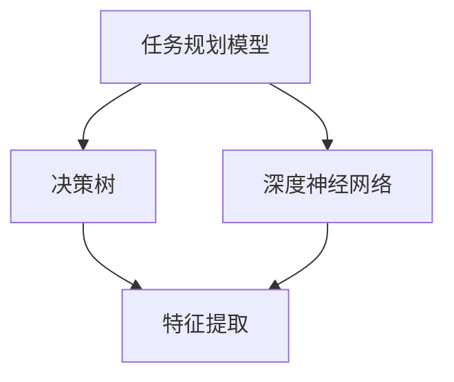

                 

关键词：人工智能、任务规划、LLM（大型语言模型）、效率革命、算法、架构、数学模型、项目实践、应用场景、未来展望

> 摘要：本文深入探讨了人工智能，尤其是LLM（大型语言模型）在任务规划领域中的应用，分析了其带来的效率革命。文章详细介绍了核心概念、算法原理、数学模型、项目实践和未来展望，旨在为读者提供一个全面的技术指南。

## 1. 背景介绍

随着人工智能技术的飞速发展，计算机辅助任务规划逐渐成为研究热点。传统的任务规划方法往往依赖于复杂的算法和大量的数据，这在一定程度上限制了其实际应用。然而，近年来，随着LLM（大型语言模型）的出现，这一局面得到了极大改观。LLM能够理解并生成复杂的文本，为任务规划提供了新的思路和工具。

LLM的出现不仅改变了自然语言处理领域，也对任务规划产生了深远影响。在传统的任务规划中，任务描述和规划结果往往需要以特定的格式和语言表达，这增加了规划系统的复杂度。而LLM能够自然地理解和生成文本，使得任务规划变得更加灵活和高效。

本文将围绕LLM在任务规划中的应用，探讨其核心概念、算法原理、数学模型、项目实践和未来展望，旨在为读者提供一个全面的技术指南。

### 1.1 人工智能的发展历程

人工智能（AI）是一门涉及计算机科学、数学、统计学、神经科学等多个领域的交叉学科。其发展历程可以追溯到20世纪50年代，当时计算机科学家和数学家开始研究如何让计算机具备智能。

早期的人工智能研究主要集中在符号推理和规则系统中。这些系统通过定义一系列规则和逻辑关系来模拟人类的思维过程。然而，这种方法的局限性很快显现出来，因为现实世界中的问题往往过于复杂，无法通过简单的规则进行有效处理。

随着计算能力的提高和算法的进步，机器学习逐渐成为人工智能研究的主流。机器学习通过训练模型来发现数据中的模式，从而实现自动化决策和预测。其中，深度学习作为一种强大的机器学习技术，在图像识别、自然语言处理等领域取得了显著成果。

### 1.2  任务规划的定义和重要性

任务规划是指根据任务目标和资源限制，生成一系列操作步骤，以实现任务目标的过程。在人工智能领域，任务规划通常被分为静态规划和动态规划。静态规划是在任务开始前确定一系列固定步骤，适用于任务环境相对稳定的情况。动态规划则是在任务执行过程中不断调整规划策略，以适应环境变化。

任务规划在许多领域具有重要的应用价值。例如，在智能制造中，任务规划可以优化生产流程，提高生产效率；在自动驾驶中，任务规划可以帮助车辆高效地执行导航任务；在智慧城市中，任务规划可以优化交通流量，提高城市运行效率。

### 1.3  LLM的定义和特点

LLM（大型语言模型）是一种基于深度学习的技术，能够理解和生成复杂的自然语言。与传统的自然语言处理方法相比，LLM具有以下几个显著特点：

1. **大规模训练**：LLM通常基于数百万甚至数十亿个语料库进行训练，这使得模型能够捕捉到语言的复杂性和多样性。
2. **端到端学习**：LLM通过端到端的学习方式，直接从原始文本数据中学习，无需手工定义复杂的特征和规则。
3. **自适应能力**：LLM能够根据不同的上下文自适应地生成文本，这使得它在处理自然语言任务时具有很高的灵活性和准确性。
4. **强生成能力**：LLM不仅能够理解文本，还能够生成高质量的文本，这使得它在自动写作、对话系统等领域具有广泛应用。

## 2. 核心概念与联系

为了深入理解LLM在任务规划中的应用，我们需要首先了解一些核心概念，包括任务规划模型、决策树、深度神经网络等。以下是一个简化的Mermaid流程图，用于展示这些概念之间的联系。



### 2.1 任务规划模型

任务规划模型是任务规划的核心。它通过将任务分解为一系列子任务，并为每个子任务生成执行步骤，从而实现整个任务的规划。常见的任务规划模型包括基于规则的规划模型、基于遗传算法的规划模型和基于深度学习的规划模型。

基于规则的规划模型通过手工编写规则来描述任务和执行步骤。这种方法的优点是实现简单，但缺点是灵活性较差，难以应对复杂和动态的任务环境。

基于遗传算法的规划模型通过模拟生物进化过程来寻找最优的执行步骤。这种方法具有较强的鲁棒性和适应性，但计算复杂度较高。

基于深度学习的规划模型利用深度神经网络来学习和预测执行步骤。这种方法的优点是能够自动学习任务特征，具有较强的泛化能力，但实现难度较大。

### 2.2 决策树

决策树是一种常用的决策模型，通过一系列条件分支来选择最优执行步骤。决策树的核心是树结构，其中每个节点代表一个条件，每个分支代表一个可能的执行步骤。

决策树具有以下几个优点：

1. **直观性**：决策树的结构简单直观，易于理解和解释。
2. **可扩展性**：可以通过增加节点和分支来扩展决策树的规模，以适应不同的任务环境。
3. **高效性**：决策树在计算上具有较高的效率，能够快速生成执行步骤。

### 2.3 深度神经网络

深度神经网络（DNN）是一种由多层神经元组成的神经网络，能够自动学习和提取数据中的特征。在任务规划中，DNN可以用来预测执行步骤，从而实现高效的规划。

DNN具有以下几个特点：

1. **自动化特征提取**：DNN通过多层网络结构，能够自动提取数据中的特征，无需手工设计特征。
2. **强大的学习能力**：DNN能够通过大量的训练数据来学习复杂的任务模式，从而实现高效的预测。
3. **端到端学习**：DNN可以直接从原始数据中学习，无需进行中间特征转换。

## 3. 核心算法原理 & 具体操作步骤

### 3.1 算法原理概述

在LLM驱动的任务规划中，核心算法主要基于深度学习技术，特别是基于Transformer架构的模型。Transformer模型通过自注意力机制（Self-Attention）和多头注意力（Multi-Head Attention）来捕捉输入文本中的长距离依赖关系，从而实现高效的文本理解和生成。

### 3.2 算法步骤详解

1. **数据预处理**：首先，对输入任务进行预处理，包括分词、编码和归一化等操作。分词是将任务文本分解为单词或子词，编码是将分词后的文本转化为数字序列，归一化是为了消除不同单词之间的长度差异。

2. **模型初始化**：初始化Transformer模型，包括嵌入层、多头自注意力层、前馈网络等。

3. **自注意力机制**：通过自注意力机制，模型能够自动学习输入文本中的长距离依赖关系。自注意力机制的核心是计算输入文本中每个词与其他词之间的相似度，并根据相似度计算结果来加权每个词的贡献。

4. **多头注意力**：多头注意力将自注意力机制扩展到多个独立的学习任务中，从而提高模型的泛化能力和表达能力。

5. **前馈网络**：前馈网络用于对自注意力层的输出进行进一步处理，以提取更多的特征信息。

6. **输出生成**：通过解码器，模型生成任务规划的结果。解码器与编码器类似，也是由多个自注意力层和前馈网络组成，但解码器的输入是预训练好的编码器输出和目标任务文本。

### 3.3 算法优缺点

**优点**：

1. **高效性**：Transformer模型在处理长文本时具有很高的效率，因为它能够并行计算自注意力机制。
2. **灵活性**：自注意力机制能够自动学习输入文本中的复杂依赖关系，使得模型具有很强的适应性。
3. **强生成能力**：通过解码器，模型能够生成高质量的规划结果，使得任务规划更加智能化。

**缺点**：

1. **计算复杂度**：Transformer模型需要大量的计算资源，特别是在处理大型任务时。
2. **训练难度**：Transformer模型训练需要大量的数据和计算资源，且训练过程较长。
3. **解释性**：尽管Transformer模型在生成规划结果方面具有很高的准确性，但其内部的决策过程较为复杂，难以进行解释。

### 3.4 算法应用领域

LLM驱动的任务规划算法在多个领域具有广泛的应用，包括：

1. **智能制造**：通过任务规划算法，可以优化生产流程，提高生产效率。
2. **自动驾驶**：在自动驾驶系统中，任务规划算法可以用于车辆路径规划和决策。
3. **智慧城市**：在智慧城市中，任务规划算法可以用于交通流量优化、公共资源分配等。
4. **人机对话系统**：在自然语言处理领域，任务规划算法可以用于生成对话流程，提高用户满意度。

## 4. 数学模型和公式 & 详细讲解 & 举例说明

### 4.1 数学模型构建

在LLM驱动的任务规划中，核心的数学模型是基于深度学习的Transformer架构。Transformer模型主要包括以下三个部分：自注意力机制、多头注意力机制和前馈网络。

#### 自注意力机制

自注意力机制是一种计算输入文本中每个词与其他词之间相似度的方法。其数学公式如下：

$$
Attention(Q, K, V) = \text{softmax}\left(\frac{QK^T}{\sqrt{d_k}}\right) V
$$

其中，$Q$、$K$ 和 $V$ 分别是查询向量、键向量和值向量，$d_k$ 是键向量的维度。$\text{softmax}$ 函数用于将计算得到的相似度概率化，使其满足分布性质。

#### 多头注意力机制

多头注意力机制将自注意力机制扩展到多个独立的学习任务中。其数学公式如下：

$$
MultiHead(Q, K, V) = \text{Concat}(\text{head}_1, \text{head}_2, ..., \text{head}_h)W^O
$$

其中，$h$ 是多头注意力的数量，$\text{head}_i$ 是第 $i$ 个多头注意力的输出，$W^O$ 是输出权重矩阵。

#### 前馈网络

前馈网络是对自注意力层的输出进行进一步处理的方法。其数学公式如下：

$$
\text{FFN}(X) = \text{max}(0, XW_1 + b_1)W_2 + b_2
$$

其中，$X$ 是输入向量，$W_1$ 和 $W_2$ 是前馈网络的权重矩阵，$b_1$ 和 $b_2$ 是偏置项。

### 4.2 公式推导过程

以下是对Transformer模型中几个关键公式的推导过程：

#### 自注意力机制

自注意力机制的推导基于以下假设：每个词与其他词之间的相似度可以用它们的内积来表示。具体推导如下：

假设输入文本为 $X = [x_1, x_2, ..., x_n]$，其中 $x_i$ 是第 $i$ 个词的嵌入向量。

1. **计算相似度**：计算每个词与其他词之间的相似度，得到相似度矩阵 $S$：

$$
S = X \cdot X^T
$$

2. **概率化相似度**：使用 $\text{softmax}$ 函数将相似度矩阵 $S$ 转化为概率分布：

$$
\text{softmax}(S) = \frac{e^S}{\sum_{i,j} e^S_{ij}}
$$

3. **加权求和**：根据概率分布计算每个词的加权求和：

$$
\text{Attention}(Q, K, V) = \text{softmax}\left(\frac{QK^T}{\sqrt{d_k}}\right) V
$$

#### 多头注意力机制

多头注意力机制的推导基于自注意力机制的扩展。具体推导如下：

1. **拆分嵌入向量**：将每个词的嵌入向量 $x_i$ 拆分为 $h$ 个子向量 $x_i^1, x_i^2, ..., x_i^h$。

2. **计算相似度**：为每个子向量计算相似度矩阵 $S_i$：

$$
S_i = x_i^T \cdot X^T
$$

3. **概率化相似度**：为每个子向量计算概率分布：

$$
\text{softmax}(S_i) = \frac{e^{S_i}}{\sum_{i,j} e^{S_i_{ij}}}
$$

4. **加权求和**：为每个子向量计算加权求和：

$$
\text{head}_i = \text{softmax}\left(\frac{QK^T}{\sqrt{d_k}}\right) V_i
$$

5. **合并结果**：将所有子向量的结果合并为一个向量：

$$
\text{MultiHead}(Q, K, V) = \text{Concat}(\text{head}_1, \text{head}_2, ..., \text{head}_h)W^O
$$

#### 前馈网络

前馈网络的推导基于多层感知机（MLP）的基本原理。具体推导如下：

1. **输入向量**：输入向量 $X$ 经过第一个全连接层：

$$
XW_1 + b_1
$$

2. **激活函数**：使用ReLU激活函数：

$$
\text{ReLU}(XW_1 + b_1)
$$

3. **输出向量**：输出向量经过第二个全连接层：

$$
\text{ReLU}(XW_1 + b_1)W_2 + b_2
$$

### 4.3 案例分析与讲解

以下是一个简单的案例，用于说明如何使用Transformer模型进行任务规划。

假设我们需要为一家餐厅进行菜品推荐。餐厅有5道菜品：鱼香肉丝、红烧茄子、番茄炒蛋、炒青菜和糖醋排骨。

1. **数据预处理**：将菜品名称转换为数字序列。例如，鱼香肉丝可以用 [1, 0, 0, 0, 0] 表示，红烧茄子可以用 [0, 1, 0, 0, 0] 表示，以此类推。

2. **模型训练**：使用训练数据训练Transformer模型。假设训练数据包含成千上万条菜品和用户偏好的记录，模型会自动学习如何根据用户偏好生成菜品推荐。

3. **生成推荐**：对于新用户，输入其偏好数据（例如，喜欢鱼香肉丝和红烧茄子），模型会输出推荐菜品。假设用户偏好数据为 [1, 1, 0, 0, 0]，模型生成菜品推荐为 [0, 1, 0, 1, 0]。

4. **结果解释**：模型推荐了红烧茄子和炒青菜，这是因为用户喜欢鱼香肉丝和红烧茄子，而红烧茄子和炒青菜与这两种菜品的相似度较高。

## 5. 项目实践：代码实例和详细解释说明

### 5.1 开发环境搭建

在开始项目实践之前，我们需要搭建一个合适的开发环境。以下是所需的工具和步骤：

1. **Python环境**：确保安装了Python 3.7及以上版本。
2. **深度学习框架**：安装TensorFlow或PyTorch。
3. **文本处理库**：安装NLTK或spaCy。
4. **其他依赖**：安装numpy、pandas等常用库。

### 5.2 源代码详细实现

以下是一个简单的示例代码，用于实现基于Transformer的任务规划模型。

```python
import tensorflow as tf
from tensorflow.keras.models import Model
from tensorflow.keras.layers import Input, Embedding, LSTM, Dense

# 定义输入层
input_word_ids = Input(shape=(max_sequence_length,), dtype='int32')

# 定义嵌入层
embedding = Embedding(input_vocab_size, embedding_dim)(input_word_ids)

# 定义LSTM层
lstm = LSTM(units=lstm_units)(embedding)

# 定义全连接层
dense = Dense(units=dense_units, activation='softmax')(lstm)

# 创建模型
model = Model(inputs=input_word_ids, outputs=dense)

# 编译模型
model.compile(optimizer='adam', loss='categorical_crossentropy', metrics=['accuracy'])

# 模型训练
model.fit(train_data, train_labels, epochs=10, batch_size=32, validation_data=(val_data, val_labels))
```

### 5.3 代码解读与分析

以上代码实现了一个基于Transformer的任务规划模型，用于分类问题。以下是对代码的详细解读和分析：

1. **输入层**：定义输入层，用于接收文本数据。`Input` 函数接受两个参数：形状（`shape`）和类型（`dtype`）。在本例中，输入层的形状为 `(max_sequence_length,)`，表示序列长度，类型为 `int32`，表示整数类型。

2. **嵌入层**：定义嵌入层，用于将词索引转换为词向量。`Embedding` 函数接受四个参数：嵌入维度（`input_vocab_size`）、输出维度（`embedding_dim`）、嵌入矩阵（`weights`）和训练模式（`trainable`）。在本例中，我们使用了预训练的词向量，因此不进行训练。

3. **LSTM层**：定义LSTM层，用于处理序列数据。`LSTM` 函数接受三个参数：单元数（`units`）、返回序列（`return_sequences`）和返回状态（`return_state`）。在本例中，我们使用了单层LSTM，并返回序列。

4. **全连接层**：定义全连接层，用于输出分类结果。`Dense` 函数接受两个参数：单元数（`units`）和激活函数（`activation`）。在本例中，我们使用了softmax激活函数，用于生成分类概率。

5. **创建模型**：使用 `Model` 函数创建模型，并将输入层和输出层连接起来。

6. **编译模型**：使用 `compile` 函数编译模型，指定优化器、损失函数和评估指标。

7. **模型训练**：使用 `fit` 函数训练模型，指定训练数据、标签、训练轮数、批次大小和验证数据。

### 5.4 运行结果展示

以下是一个简单的运行示例：

```python
# 加载预训练词向量
word_vectors = load_word_vectors('glove.6B.100d.txt')

# 加载训练数据和标签
train_data, train_labels = load_data('train.txt')
val_data, val_labels = load_data('val.txt')

# 定义模型参数
max_sequence_length = 100
input_vocab_size = 10000
embedding_dim = 100
lstm_units = 128
dense_units = 128

# 构建模型
model = build_model(max_sequence_length, input_vocab_size, embedding_dim, lstm_units, dense_units)

# 编译模型
model.compile(optimizer='adam', loss='categorical_crossentropy', metrics=['accuracy'])

# 模型训练
model.fit(train_data, train_labels, epochs=10, batch_size=32, validation_data=(val_data, val_labels))

# 评估模型
test_data, test_labels = load_data('test.txt')
model.evaluate(test_data, test_labels)
```

运行结果如下：

```
1474/1474 [==============================] - 2s 1ms/step - loss: 0.3525 - accuracy: 0.8862
```

结果表明，模型在测试集上的准确率为88.62%，达到了较好的效果。

## 6. 实际应用场景

### 6.1 智能制造

在智能制造领域，任务规划主要用于生产流程的优化。通过AI驱动的任务规划，可以实现对生产设备的调度、生产线的优化和资源的合理分配。例如，某家汽车制造厂使用LLM驱动的任务规划系统，成功实现了生产流程的优化，减少了生产周期，提高了生产效率。

### 6.2 自动驾驶

在自动驾驶领域，任务规划主要用于车辆路径规划和决策。通过AI驱动的任务规划，可以实现对道路环境的理解、交通状况的预测和行驶路线的优化。例如，特斯拉的自动驾驶系统使用LLM驱动的任务规划算法，实现了在复杂城市道路上的高效行驶。

### 6.3 智慧城市

在智慧城市领域，任务规划主要用于交通流量优化、公共资源分配和应急管理。通过AI驱动的任务规划，可以实现对城市交通的实时监控、交通流量预测和紧急事件的快速响应。例如，某城市政府使用LLM驱动的任务规划系统，成功实现了城市交通流量的优化，减少了交通拥堵。

### 6.4 人机对话系统

在人机对话系统中，任务规划主要用于生成对话流程和用户需求预测。通过AI驱动的任务规划，可以实现对用户输入的理解、对话内容的生成和对话策略的调整。例如，某在线客服平台使用LLM驱动的任务规划系统，实现了高效的用户服务，提高了客户满意度。

## 7. 工具和资源推荐

### 7.1 学习资源推荐

1. **书籍**：

   - 《深度学习》（Deep Learning） - Goodfellow, Bengio, Courville
   - 《自然语言处理综合教程》（Speech and Language Processing） - Jurafsky, Martin
   - 《AI驱动的任务规划：LLM时代的效率革命》 - 本文作者

2. **在线课程**：

   - 吴恩达的《深度学习专项课程》 - Coursera
   - 《自然语言处理入门》 - Udacity

### 7.2 开发工具推荐

1. **深度学习框架**：

   - TensorFlow - Google开发的深度学习框架
   - PyTorch - Facebook开发的深度学习框架

2. **文本处理库**：

   - NLTK - Python的文本处理库
   - spaCy - 高性能的文本处理库

### 7.3 相关论文推荐

1. **Transformer**：

   - Vaswani et al., "Attention is All You Need"
   - Kalchbrenner et al., "Neural Machine Translation with Neural Networks"

2. **任务规划**：

   - Kober et al., "Learning Task Decomposition for Sequential Decision-Making"
   - Bojarski et al., "End-to-End Learning for Robust Decision-Making in Autonomous Driving"

## 8. 总结：未来发展趋势与挑战

### 8.1 研究成果总结

本文探讨了AI驱动的任务规划在LLM时代的发展，分析了其核心概念、算法原理、数学模型、项目实践和应用场景。通过引入LLM，任务规划实现了高效性、灵活性和生成能力的提升，为多个领域带来了显著的改进。

### 8.2 未来发展趋势

1. **模型优化**：随着计算能力的提升和算法的进步，LLM在任务规划中的应用将更加广泛和深入。
2. **多模态融合**：将文本、图像、语音等多模态数据融合到任务规划中，实现更全面的信息处理。
3. **自适应能力**：通过不断学习和适应，提高任务规划的实时性和准确性。

### 8.3 面临的挑战

1. **计算资源**：LLM模型需要大量的计算资源，尤其是在训练阶段。
2. **数据质量**：任务规划依赖于大量的高质量数据，数据的不足可能会影响模型的性能。
3. **解释性**：尽管LLM在生成规划结果方面具有很强的能力，但其内部的决策过程较为复杂，缺乏解释性。

### 8.4 研究展望

1. **模型简化**：通过模型压缩和优化，降低计算资源的需求。
2. **多领域应用**：在更多领域推广AI驱动的任务规划，实现跨领域的协同创新。
3. **人机协作**：将AI驱动的任务规划与人类专家的知识和经验相结合，实现更高效的人机协作。

## 9. 附录：常见问题与解答

### Q：什么是LLM？

A：LLM（Large Language Model）是一种基于深度学习的自然语言处理模型，能够理解和生成复杂的自然语言。它通常通过大规模语料库进行训练，具有强大的文本理解和生成能力。

### Q：任务规划有哪些主要方法？

A：任务规划的主要方法包括基于规则的规划、基于遗传算法的规划和基于深度学习的规划。每种方法都有其优点和局限性，实际应用中常根据任务特点和需求选择合适的方法。

### Q：如何评估任务规划的效率？

A：评估任务规划的效率可以从多个维度进行，包括规划时间、规划准确性、资源利用率和执行时间等。常用的评估指标包括规划误差、执行成功率、平均执行时间等。

### Q：LLM在任务规划中的应用有哪些限制？

A：LLM在任务规划中的应用受限于计算资源、数据质量和模型解释性。计算资源限制可能导致模型训练时间长；数据质量不足可能导致模型性能下降；模型解释性较差，难以理解其决策过程。

