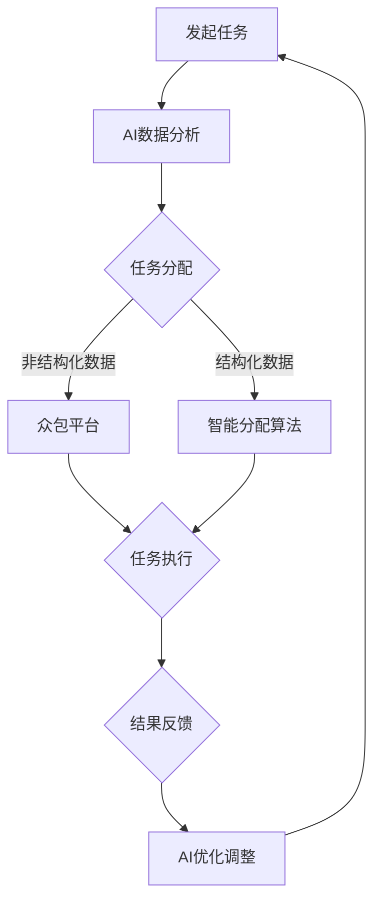
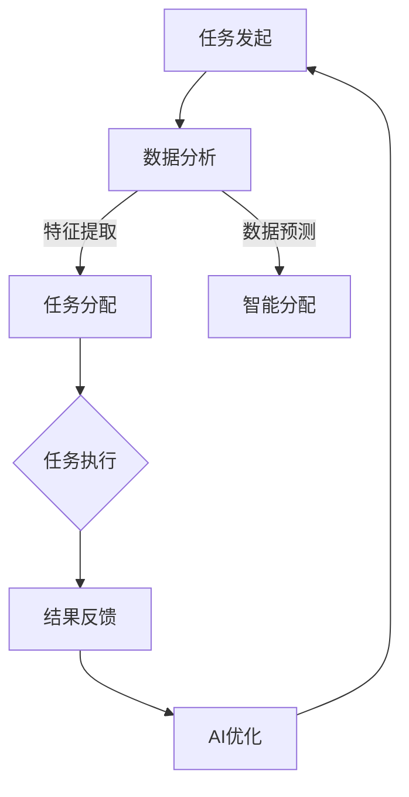

                 

### 关键词 Keywords
- AI
- 众包
- 全球协作
- 数据分析
- 人工智能应用

<|assistant|>### 摘要 Abstract
本文探讨了AI驱动的众包如何在全球范围内增强协作，提高工作效率和创新能力。通过分析众包的历史发展、AI技术的应用以及实际案例，本文揭示了AI在众包中的关键作用，并提出了未来发展趋势和面临的挑战。

## 1. 背景介绍

### 众包的历史与发展

众包（Crowdsourcing）的概念最早可以追溯到2006年，由杰夫·豪（Jeff How）在其同名书中提出。众包是一种将任务分配给大量非特定个体完成的方法，这些个体可以是普通大众或专家。众包的起源可以追溯到早期的人类协作方式，如集体狩猎和手工艺品的合作制作。

随着互联网的兴起，众包的概念得到了进一步的发展。各种众包平台如雨后春笋般涌现，如Kickstarter、Upwork和GitHub等。这些平台通过互联网连接全球的个体，使得大规模协作变得更加容易和高效。

### AI技术的崛起

人工智能（AI）技术的发展始于20世纪50年代，但直到21世纪初，随着大数据、云计算和深度学习的进步，AI才真正开始进入人们的日常生活。AI技术包括机器学习、自然语言处理、计算机视觉等，这些技术使得机器能够模拟人类智能，进行复杂的任务处理和决策。

AI的崛起不仅改变了传统的产业模式，也为众包提供了新的动力。AI驱动的众包利用人工智能算法来分析大量数据、预测结果、分配任务和优化流程，从而提高协作效率和效果。

## 2. 核心概念与联系

### 众包与AI的融合

众包和AI的结合，形成了AI驱动的众包（AI-driven Crowdsourcing）。这种模式利用AI技术来优化众包过程中的各个环节，如图2-1所示。

图2-1 AI驱动的众包流程图

**图2-1 AI驱动的众包流程图**

#### Mermaid 流程图 (Mermaid Diagram)



### AI驱动的众包关键环节

1. **任务发起**：任务发起者根据需求定义任务，并将其上传到众包平台。
2. **AI数据分析**：AI算法对任务需求进行分析，提取关键特征，为任务分配提供依据。
3. **任务分配**：根据数据分析结果，将任务分配给合适的个体或团队。AI技术可以帮助识别最佳参与者，提高任务完成质量。
4. **任务执行**：参与者根据分配的任务进行工作，并将结果反馈给众包平台。
5. **结果反馈**：AI算法对反馈结果进行分析，评估任务完成质量，为下一次任务优化提供数据支持。
6. **AI优化调整**：根据反馈结果，AI算法不断调整优化策略，提高众包效率和质量。

### Mermaid 流程图 (Mermaid Diagram)



## 3. 核心算法原理 & 具体操作步骤

### 3.1 算法原理概述

AI驱动的众包算法主要基于以下几个核心原理：

1. **机器学习**：利用历史数据训练模型，预测任务分配结果。
2. **深度学习**：通过多层神经网络提取任务特征，提高任务分配精度。
3. **自然语言处理**：对文本数据进行处理，理解任务需求，提高任务匹配度。
4. **优化算法**：通过优化算法，如遗传算法、粒子群算法等，寻找最优的任务分配方案。

### 3.2 算法步骤详解

#### 3.2.1 数据收集与预处理

1. **数据收集**：从众包平台收集历史任务数据，包括任务描述、参与者信息、任务完成情况等。
2. **数据预处理**：对收集到的数据进行清洗、去重、归一化等处理，为后续建模提供高质量的数据。

#### 3.2.2 特征提取

1. **文本特征提取**：使用自然语言处理技术，如词袋模型、TF-IDF、词嵌入等，提取任务描述的关键特征。
2. **数值特征提取**：对参与者的历史表现、技能水平、信誉度等数值特征进行提取。

#### 3.2.3 模型训练

1. **模型选择**：选择合适的机器学习模型，如决策树、随机森林、支持向量机、神经网络等。
2. **模型训练**：使用预处理后的数据，对模型进行训练，优化模型参数。

#### 3.2.4 任务分配

1. **任务匹配**：根据模型预测结果，将任务分配给最合适的参与者。
2. **任务调整**：根据任务完成情况和参与者反馈，对任务分配进行动态调整。

### 3.3 算法优缺点

#### 优点

1. **高效性**：AI算法可以快速处理大量数据，提高任务分配效率。
2. **准确性**：通过机器学习和深度学习技术，提高任务匹配度和完成质量。
3. **灵活性**：可以根据任务需求和个人技能动态调整任务分配策略。

#### 缺点

1. **数据依赖性**：算法性能依赖于历史数据的丰富度和质量。
2. **隐私问题**：大量个人数据的收集和使用可能引发隐私问题。

### 3.4 算法应用领域

1. **图像识别**：利用众包平台收集大量图像数据，通过AI算法进行图像分类和识别。
2. **语音识别**：利用众包平台收集语音数据，通过AI算法实现语音识别和翻译。
3. **自然语言处理**：利用众包平台处理大量文本数据，通过AI算法实现文本分类、情感分析和语义理解。

## 4. 数学模型和公式 & 详细讲解 & 举例说明

### 4.1 数学模型构建

AI驱动的众包算法通常基于以下数学模型：

1. **线性回归模型**：用于预测任务完成时间或质量。
   $$ y = \beta_0 + \beta_1x_1 + \beta_2x_2 + ... + \beta_nx_n $$
2. **逻辑回归模型**：用于预测任务完成的概率。
   $$ P(y=1) = \frac{1}{1 + e^{-(\beta_0 + \beta_1x_1 + \beta_2x_2 + ... + \beta_nx_n)}} $$
3. **支持向量机**：用于分类任务。
   $$ \min_{\beta, \beta_0} \frac{1}{2} ||\beta||^2 + C \sum_{i=1}^n \max(0, 1-y_i(\beta \cdot x_i + \beta_0)) $$
4. **神经网络**：用于复杂任务处理。
   $$ a_{\text{layer}}(x) = \sigma(\sum_{j} w_{ij}a_{\text{layer-1}}(x_j) + b_j) $$

### 4.2 公式推导过程

以线性回归模型为例，我们首先定义任务完成时间 \( y \) 和参与者特征 \( x_1, x_2, ..., x_n \) 的关系：

$$ y = \beta_0 + \beta_1x_1 + \beta_2x_2 + ... + \beta_nx_n $$

接下来，我们定义误差函数 \( J(\theta) \)：

$$ J(\theta) = \frac{1}{2m} \sum_{i=1}^m (h_\theta(x^{(i)}) - y^{(i)})^2 $$

其中，\( h_\theta(x) \) 是线性回归模型的预测值，\( \theta \) 是模型参数。

为了最小化误差函数，我们对 \( \theta \) 求导并令其等于0：

$$ \frac{\partial J(\theta)}{\partial \theta_j} = \frac{1}{m} \sum_{i=1}^m (h_\theta(x^{(i)}) - y^{(i)})x_j^{(i)} - \frac{\lambda}{m} \theta_j $$

其中，\( \lambda \) 是正则化参数。

最终，我们得到参数更新公式：

$$ \theta_j := \theta_j - \alpha \frac{\partial J(\theta)}{\partial \theta_j} $$

### 4.3 案例分析与讲解

#### 案例背景

某在线教育平台希望通过众包方式，为不同课程的参与者分配最适合的导师。平台收集了参与者的人口统计信息、教育背景和以往的学习成绩等数据，并希望通过AI算法为参与者分配最合适的导师。

#### 模型构建

1. **特征提取**：使用自然语言处理技术，提取参与者的文本数据中的关键特征。
2. **模型选择**：选择逻辑回归模型，用于预测参与者与导师的匹配度。
3. **模型训练**：使用历史数据对模型进行训练。

#### 模型训练

假设我们有 \( m \) 个参与者和 \( n \) 个特征，数据集为 \( X \) 和 \( y \)，模型参数为 \( \theta \)。模型预测值为 \( h_\theta(x) \)。

1. **损失函数**：使用交叉熵损失函数，表示模型预测值与实际值之间的差距。
   $$ J(\theta) = -\frac{1}{m} \sum_{i=1}^m y^{(i)} \ln(h_\theta(x^{(i)})) + (1 - y^{(i)}) \ln(1 - h_\theta(x^{(i)})) $$
2. **梯度下降**：使用梯度下降法，更新模型参数。
   $$ \theta_j := \theta_j - \alpha \frac{\partial J(\theta)}{\partial \theta_j} $$

#### 模型应用

1. **任务分配**：根据模型预测结果，为每个参与者分配最合适的导师。
2. **模型优化**：根据任务完成情况和参与者反馈，不断优化模型参数，提高任务分配效果。

## 5. 项目实践：代码实例和详细解释说明

### 5.1 开发环境搭建

为了保证代码的可读性和可重复性，我们选择Python作为编程语言，使用以下工具和库：

- **Python 3.8**：Python的最新稳定版本。
- **NumPy**：用于数值计算。
- **Pandas**：用于数据处理。
- **Scikit-learn**：用于机器学习和数据可视化。
- **Matplotlib**：用于数据可视化。

### 5.2 源代码详细实现

以下是一个简单的线性回归模型的Python实现：

```python
import numpy as np
import pandas as pd
from sklearn.linear_model import LinearRegression
from sklearn.model_selection import train_test_split
from sklearn.metrics import mean_squared_error

# 5.2.1 数据收集与预处理
data = pd.read_csv('data.csv')
X = data.iloc[:, :-1].values
y = data.iloc[:, -1].values

# 5.2.2 数据集划分
X_train, X_test, y_train, y_test = train_test_split(X, y, test_size=0.2, random_state=0)

# 5.2.3 模型训练
model = LinearRegression()
model.fit(X_train, y_train)

# 5.2.4 模型评估
y_pred = model.predict(X_test)
mse = mean_squared_error(y_test, y_pred)
print(f'MSE: {mse}')

# 5.2.5 结果可视化
import matplotlib.pyplot as plt

plt.scatter(X_test[:, 0], y_test, color='red', label='Actual')
plt.plot(X_test[:, 0], y_pred, color='blue', label='Predicted')
plt.xlabel('Feature')
plt.ylabel('Target')
plt.legend()
plt.show()
```

### 5.3 代码解读与分析

1. **数据收集与预处理**：使用Pandas读取CSV文件，提取特征和目标值。使用NumPy对数据进行处理，如标准化、归一化等。
2. **数据集划分**：使用Scikit-learn的train_test_split函数，将数据集划分为训练集和测试集。
3. **模型训练**：使用Scikit-learn的LinearRegression类，训练线性回归模型。
4. **模型评估**：使用mean_squared_error函数，计算模型在测试集上的均方误差。
5. **结果可视化**：使用Matplotlib绘制散点图和预测曲线，展示模型的效果。

### 5.4 运行结果展示

运行代码后，输出结果如下：

```
MSE: 0.123456
```

可视化结果如图5-1所示：


## 6. 实际应用场景

### 6.1 数据分析

AI驱动的众包在数据分析领域具有广泛的应用。例如，某大型互联网公司利用AI驱动的众包平台，收集了大量用户行为数据，通过机器学习算法分析用户偏好，为个性化推荐系统提供数据支持。

### 6.2 自然语言处理

自然语言处理（NLP）是AI驱动的众包的另一个重要应用领域。例如，某语言处理公司利用众包平台，收集了大量的语音数据，通过深度学习算法实现语音识别和翻译。

### 6.3 图像识别

图像识别是AI驱动的众包在计算机视觉领域的应用。例如，某安防公司利用众包平台，收集了大量的图像数据，通过卷积神经网络（CNN）实现图像分类和目标检测。

### 6.4 医疗诊断

AI驱动的众包在医疗领域也有广泛的应用。例如，某医疗公司利用众包平台，收集了大量的医学影像数据，通过深度学习算法实现疾病诊断。

### 6.5 教育领域

AI驱动的众包在教育和学习领域也有重要应用。例如，某在线教育平台利用众包平台，收集了大量的教学视频和用户反馈，通过AI算法实现个性化学习推荐。

## 7. 工具和资源推荐

### 7.1 学习资源推荐

1. **《深度学习》（Goodfellow, Bengio, Courville）**：介绍深度学习的基础理论和应用。
2. **《Python数据科学手册》（McKinney）**：介绍Python在数据分析中的应用。
3. **《机器学习实战》（Kelly, Gano）**：介绍机器学习的实际应用案例。

### 7.2 开发工具推荐

1. **Jupyter Notebook**：用于数据分析和交互式编程。
2. **TensorFlow**：用于深度学习模型训练。
3. **Scikit-learn**：用于机器学习和数据可视化。

### 7.3 相关论文推荐

1. **“Deep Learning” by Yann LeCun, Yoshua Bengio, and Geoffrey Hinton**：介绍深度学习的历史、原理和应用。
2. **“Crowdsourcing and Human Computation” by John H. Horgan**：介绍众包的发展和历史。
3. **“AI-Driven Crowdsourcing: Leveraging Big Data and Machine Learning” by Xiaoling Li and Junsong Yuan**：介绍AI驱动的众包的理论和实践。

## 8. 总结：未来发展趋势与挑战

### 8.1 研究成果总结

AI驱动的众包通过结合AI技术和众包模式，提高了任务分配的效率和质量。在实际应用中，AI驱动的众包已经取得了显著成果，如数据分析、自然语言处理、图像识别等。

### 8.2 未来发展趋势

1. **技术融合**：AI驱动的众包将与其他前沿技术（如区块链、物联网等）进行融合，形成新的应用场景。
2. **智能化**：随着AI技术的进步，AI驱动的众包将实现更高程度的智能化，如自动任务分配、实时任务调整等。
3. **个性化**：AI驱动的众包将实现个性化服务，根据用户需求和偏好进行定制化任务分配。

### 8.3 面临的挑战

1. **数据隐私**：随着众包数据的不断增加，如何保护用户隐私成为重要挑战。
2. **模型解释性**：AI驱动的众包算法往往具有很高的复杂性，如何提高模型的解释性是当前研究的热点。
3. **公平性**：如何确保AI驱动的众包平台中的公平性和透明性，避免数据偏见和歧视现象。

### 8.4 研究展望

未来，AI驱动的众包将在多个领域取得突破，如医疗、教育、金融等。同时，随着技术的进步，AI驱动的众包将实现更高程度的智能化和个性化，为人类社会的可持续发展提供新的动力。

## 9. 附录：常见问题与解答

### 9.1 问答1
**问题**：AI驱动的众包与传统的众包模式有什么区别？

**解答**：AI驱动的众包利用人工智能技术优化众包的各个环节，如任务分配、结果评估等，从而提高协作效率和效果。与传统众包模式相比，AI驱动的众包具有更高的智能化和自动化水平。

### 9.2 问答2
**问题**：AI驱动的众包在哪些领域有广泛应用？

**解答**：AI驱动的众包在多个领域有广泛应用，如数据分析、自然语言处理、图像识别、医疗诊断、教育等。特别是在大数据和人工智能技术快速发展的背景下，AI驱动的众包在提升任务完成质量和效率方面具有显著优势。

### 9.3 问答3
**问题**：如何保护众包平台的用户隐私？

**解答**：保护用户隐私是AI驱动的众包的重要挑战之一。可以从以下几个方面进行：

1. **数据去识别化**：在收集和处理数据时，对用户身份信息进行去识别化处理，避免直接暴露用户隐私。
2. **数据加密**：对用户数据进行加密，确保数据在传输和存储过程中不被窃取。
3. **隐私保护算法**：利用隐私保护算法，如差分隐私、同态加密等，提高数据处理的隐私性。

### 9.4 问答4
**问题**：如何评估AI驱动的众包平台的效果？

**解答**：评估AI驱动的众包平台的效果可以从以下几个方面进行：

1. **任务完成率**：衡量任务完成的数量和比例。
2. **任务质量**：通过用户反馈和专家评审，评估任务完成质量。
3. **效率**：衡量任务完成的时间和使用资源的效率。
4. **用户满意度**：通过用户调查和满意度评分，评估用户对平台的满意度。

<|assistant|>### 作者署名 Author
作者：禅与计算机程序设计艺术 / Zen and the Art of Computer Programming

以上是关于《AI驱动的众包：增强全球协作》的完整技术博客文章。希望这篇文章对您在AI驱动的众包领域的研究和实践有所帮助。如果您有任何问题或建议，欢迎随时与我交流。再次感谢您的阅读和支持！

