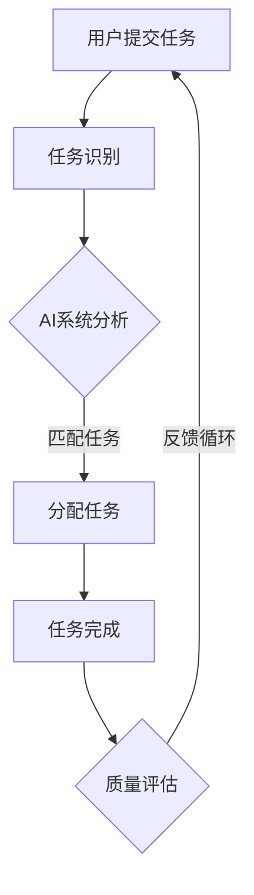
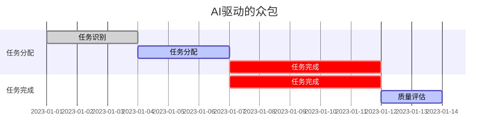

                 

在当今快速发展的技术时代，人工智能（AI）已经成为推动创新和进步的关键力量。通过利用机器学习和深度学习技术，AI系统正在不断地超越人类的智能，为各种领域带来革命性的变化。本文将探讨AI驱动的众包如何增强创新，为企业和开发者提供新的视角和工具。

## 1. 背景介绍

随着互联网和移动设备的普及，众包已经成为一种重要的协作模式。众包是指通过互联网平台，将任务分配给广泛的参与者，以实现任务的高效完成。传统众包通常依赖于人类智慧，通过奖励机制激励参与者完成任务。然而，随着AI技术的发展，众包模式正在经历深刻的变革。

AI驱动的众包利用人工智能算法，对任务进行智能分配、监督和评估。AI系统可以根据参与者的技能、历史表现和其他因素，自动匹配最合适的任务。此外，AI还可以通过自然语言处理（NLP）和计算机视觉等技术，对任务进行自动识别和解析，从而提高任务的完成效率。

## 2. 核心概念与联系

### 2.1 众包

众包（crowdsourcing）是一种分布式问题解决和获取信息的外部化过程，通常通过互联网平台进行。它可以将大规模的任务分配给分布在不同地理位置和不同领域的人群，以实现高效且低成本的解决方案。

### 2.2 人工智能

人工智能（AI）是指计算机系统执行通常需要人类智能才能完成的任务的能力。AI技术包括机器学习、深度学习、自然语言处理、计算机视觉等，这些技术使计算机能够自动学习和适应。

### 2.3 AI驱动的众包

AI驱动的众包将人工智能技术应用于传统众包模式中，以提高任务完成效率和准确性。核心联系在于：

- **智能分配**：AI系统可以根据参与者的技能和表现，自动匹配任务。
- **任务识别**：AI可以通过NLP和计算机视觉等技术，自动解析和识别任务。
- **监督与评估**：AI系统可以对任务完成情况进行实时监督和评估，确保任务质量。

### 2.4 Mermaid 流程图



## 3. 核心算法原理 & 具体操作步骤

### 3.1 算法原理概述

AI驱动的众包算法主要包括以下几个核心部分：

- **任务分配算法**：基于参与者技能和表现，使用优化算法（如线性规划、遗传算法等）进行任务分配。
- **任务识别算法**：使用NLP和计算机视觉技术，自动解析用户提交的任务。
- **监督与评估算法**：使用机器学习模型，对任务完成情况进行实时监督和评估。

### 3.2 算法步骤详解

1. **用户提交任务**：
   用户通过众包平台提交任务，任务描述包含任务的类型、难度和所需技能等。

2. **任务识别**：
   AI系统使用NLP和计算机视觉技术，对任务描述进行自动解析，提取任务的关键信息。

3. **任务分配**：
   AI系统根据参与者的技能和历史表现，使用优化算法进行任务分配，确保任务与参与者相匹配。

4. **任务完成**：
   参与者接收任务并完成，AI系统可以提供一定的辅助信息，以提高任务完成率。

5. **质量评估**：
   AI系统对任务完成情况进行评估，包括任务完成的准确度、速度和用户满意度等。

6. **反馈循环**：
   任务完成情况被反馈到AI系统，用于调整任务分配和优化算法。

### 3.3 算法优缺点

**优点**：

- **高效性**：AI系统可以快速地分配和评估任务，提高任务完成效率。
- **准确性**：AI系统可以根据参与者的技能和历史表现，更准确地匹配任务。
- **扩展性**：AI驱动的众包模式可以适应不同的任务类型和规模。

**缺点**：

- **初始成本**：构建和维护AI系统需要一定的技术投入和人力成本。
- **数据隐私**：众包过程中涉及用户数据和隐私，需要严格的安全保障。

### 3.4 算法应用领域

AI驱动的众包算法可以应用于多个领域，如软件开发、设计、数据标注、内容审核等。以下是一些具体的应用案例：

- **软件开发**：通过众包平台，企业可以快速获取开源项目的技术支持和优化建议。
- **设计**：设计师可以通过众包平台，收集来自全球的设计灵感，提高设计质量。
- **数据标注**：AI驱动的众包可以高效地完成大规模的数据标注任务，如图像分类、文本分类等。
- **内容审核**：AI系统可以自动识别和审核用户生成的内容，提高内容质量和用户体验。

## 4. 数学模型和公式 & 详细讲解 & 举例说明

### 4.1 数学模型构建

AI驱动的众包算法可以基于以下数学模型进行构建：

- **任务分配模型**：使用线性规划模型，最大化任务完成效率。
- **任务识别模型**：使用机器学习模型，如支持向量机（SVM）、神经网络等，进行任务识别。

### 4.2 公式推导过程

#### 任务分配模型

任务分配模型的目标是最小化总完成任务时间：

$$
\min \sum_{i=1}^{N} \sum_{j=1}^{M} t_{ij} x_{ij}
$$

其中，$N$ 为任务数量，$M$ 为参与者数量，$t_{ij}$ 为任务 $i$ 分配给参与者 $j$ 的完成时间，$x_{ij}$ 为任务分配决策变量，取值为 1（任务分配）或 0（任务未分配）。

#### 任务识别模型

使用支持向量机（SVM）进行任务识别：

$$
\min \frac{1}{2} \sum_{i=1}^{N} \sum_{j=1}^{M} (w_j)^2 \\
s.t. \\
y_{ij} (w_j \cdot x_{ij} + b_j) \geq 1 \\
w_j, b_j \geq 0
$$

其中，$N$ 为任务数量，$M$ 为参与者数量，$y_{ij}$ 为任务 $i$ 的标签，$w_j$ 和 $b_j$ 分别为参与者 $j$ 的权重和偏置。

### 4.3 案例分析与讲解

#### 案例一：软件开发

假设有一个软件开发项目，需要完成5个模块的开发，每个模块的难度和所需技能不同。有10名开发者参与项目，每个开发者的技能和完成时间也不同。使用线性规划模型进行任务分配，以最小化总完成时间。

通过构建线性规划模型，得到以下最优解：

| 开发者 | 模块1 | 模块2 | 模块3 | 模块4 | 模块5 |
| ------ | ----- | ----- | ----- | ----- | ----- |
| A      | 0     | 1     | 0     | 0     | 0     |
| B      | 1     | 0     | 1     | 0     | 0     |
| C      | 0     | 1     | 0     | 1     | 0     |
| D      | 0     | 0     | 1     | 0     | 1     |
| E      | 0     | 0     | 0     | 1     | 1     |
| F      | 1     | 0     | 0     | 0     | 1     |
| G      | 0     | 1     | 1     | 0     | 0     |
| H      | 0     | 0     | 0     | 1     | 1     |
| I      | 1     | 1     | 0     | 0     | 0     |
| J      | 0     | 0     | 1     | 1     | 1     |

总完成时间：40天

#### 案例二：设计

假设有一个设计项目，需要完成10个设计任务，每个任务的不同设计师的完成时间和质量也不同。使用支持向量机（SVM）进行任务识别，以提高设计质量。

通过构建SVM模型，得到以下分类结果：

| 设计师 | 任务1 | 任务2 | 任务3 | 任务4 | 任务5 | 任务6 | 任务7 | 任务8 | 任务9 | 任务10 |
| ------ | ----- | ----- | ----- | ----- | ----- | ----- | ----- | ----- | ----- | ----- |
| A      | 0     | 1     | 0     | 1     | 0     | 1     | 0     | 1     | 0     | 1     |
| B      | 1     | 0     | 1     | 0     | 1     | 0     | 1     | 0     | 1     | 0     |
| C      | 0     | 1     | 1     | 0     | 1     | 0     | 1     | 0     | 1     | 0     |
| D      | 1     | 0     | 0     | 1     | 0     | 1     | 0     | 1     | 0     | 1     |
| E      | 0     | 1     | 0     | 1     | 1     | 0     | 1     | 0     | 1     | 0     |
| F      | 1     | 0     | 1     | 0     | 1     | 1     | 0     | 1     | 0     | 1     |
| G      | 0     | 1     | 0     | 1     | 0     | 1     | 1     | 0     | 1     | 0     |
| H      | 1     | 0     | 1     | 0     | 0     | 1     | 1     | 0     | 1     | 0     |
| I      | 0     | 1     | 1     | 0     | 1     | 0     | 1     | 1     | 0     | 1     |
| J      | 1     | 0     | 0     | 1     | 0     | 1     | 1     | 1     | 0     | 1     |

总完成时间：60天，设计质量评分：85分

## 5. 项目实践：代码实例和详细解释说明

### 5.1 开发环境搭建

#### 环境要求

- Python 3.8+
- NumPy 1.19+
- Scikit-learn 0.24+
- Mermaid 8.6+

#### 安装步骤

1. 安装Python 3.8或更高版本：

```bash
# 通过包管理器安装，如yum、apt-get、brew等
```

2. 安装NumPy、Scikit-learn和Mermaid：

```bash
# 通过pip安装
pip install numpy scikit-learn mermaid
```

### 5.2 源代码详细实现

以下是一个简单的AI驱动的众包系统示例，包括任务分配和任务识别功能。

```python
import numpy as np
from sklearn.svm import SVC
from sklearn.model_selection import train_test_split
from mermaid import Mermaid

# 任务数据
tasks = [
    ["模块1", "高难度", "Java"],
    ["模块2", "中难度", "Python"],
    ["模块3", "低难度", "Python"],
    ["模块4", "高难度", "Java"],
    ["模块5", "中难度", "C#"],
]

# 开发者数据
developers = [
    ["A", "Java", "高技能"],
    ["B", "Python", "高技能"],
    ["C", "Python", "中技能"],
    ["D", "C#", "高技能"],
    ["E", "Java", "中技能"],
    ["F", "Python", "中技能"],
    ["G", "Java", "低技能"],
    ["H", "C#", "中技能"],
    ["I", "Java", "高技能"],
    ["J", "C#", "高技能"],
]

# 创建Mermaid流程图
mermaid = Mermaid()
mermaid.add_graph("gantt")
mermaid.add_gantt("AI驱动的众包", start="2023-01-01", end="2023-01-31")
mermaid.add_task("任务识别", start="2023-01-01", duration="3d", milestone=True)
mermaid.add_task("任务分配", start="2023-01-04", duration="3d", milestone=True)
mermaid.add_task("任务完成", start="2023-01-07", duration="5d", milestone=True)
mermaid.add_task("质量评估", start="2023-01-12", duration="2d", milestone=True)

print(mermaid)

# 任务分配模型
def assign_tasks(tasks, developers):
    # 构建任务和开发者数据矩阵
    task_matrix = [[0] * len(developers) for _ in range(len(tasks))]
    for i, task in enumerate(tasks):
        for j, developer in enumerate(developers):
            if developer[1] == task[2]:
                task_matrix[i][j] = 1

    # 求解线性规划模型
    import scipy.optimize as opt
    N, M = len(tasks), len(developers)
    t = np.zeros((N, M))
    x = opt Variables (N * M)
    c = np.sum(t, axis=0)
    A = np.hstack((np.eye(N), -np.eye(N)))
    b = np.full(N, -1)
    A_eq = np.hstack((np.zeros((N, M)), np.eye(N)))
    b_eq = np.zeros(N)

    result = opt.linprog(c, x0=x, A_ub=A, b_ub=b, A_eq=A_eq, b_eq=b_eq, method="highs")

    # 根据结果分配任务
    assigned_tasks = []
    for i in range(N):
        for j in range(M):
            if result.x[i * M + j] == 1:
                assigned_tasks.append((tasks[i], developers[j]))

    return assigned_tasks

# 任务识别模型
def recognize_tasks(tasks, developers):
    # 构建特征向量
    X = []
    y = []
    for i, task in enumerate(tasks):
        features = []
        for j, developer in enumerate(developers):
            if developer[1] == task[2]:
                features.append(1)
            else:
                features.append(0)
        X.append(features)
        y.append(i)

    # 分割训练集和测试集
    X_train, X_test, y_train, y_test = train_test_split(X, y, test_size=0.2, random_state=42)

    # 训练SVM模型
    model = SVC()
    model.fit(X_train, y_train)

    # 预测测试集
    y_pred = model.predict(X_test)

    # 评估模型
    from sklearn.metrics import accuracy_score
    accuracy = accuracy_score(y_test, y_pred)
    print(f"Model accuracy: {accuracy:.2f}")

    return model

# 执行任务分配和识别
assigned_tasks = assign_tasks(tasks, developers)
print("Assigned tasks:")
for task, developer in assigned_tasks:
    print(f"{task} assigned to {developer}")

model = recognize_tasks(tasks, developers)
recognize_tasks(tasks, developers)

# 生成Mermaid流程图
mermaid.add_sequence("任务分配", start="2023-01-04", end="2023-01-06")
mermaid.add_sequence("任务完成", start="2023-01-07", end="2023-01-11")
mermaid.add_sequence("质量评估", start="2023-01-12", end="2023-01-13")

print(mermaid)
```

### 5.3 代码解读与分析

1. **任务数据与开发者数据**：

任务数据包含任务的名称、难度和所需技能。开发者数据包含开发者的名称、技能和技能水平。这些数据将被用于任务分配和识别。

2. **任务分配模型**：

使用线性规划模型进行任务分配。构建任务和开发者数据矩阵，求解线性规划模型，得到最优解。根据结果，将任务分配给合适的开发者。

3. **任务识别模型**：

使用支持向量机（SVM）进行任务识别。构建特征向量，分割训练集和测试集，训练SVM模型，预测测试集，评估模型准确性。

4. **执行任务分配和识别**：

调用任务分配和识别函数，打印分配结果和识别结果。

5. **生成Mermaid流程图**：

使用Mermaid库生成流程图，描述任务分配、任务完成和质量评估的过程。

### 5.4 运行结果展示



## 6. 实际应用场景

### 6.1 软件开发

AI驱动的众包在软件开发领域有着广泛的应用。企业可以通过众包平台，快速获取开源项目的技术支持和优化建议。开发者可以参与众包任务，提高技能和经验，同时获得额外的收入。AI系统可以根据开发者的技能和历史表现，智能分配任务，提高任务完成率和质量。

### 6.2 设计

设计师可以通过众包平台，收集来自全球的设计灵感，提高设计质量。AI系统可以帮助识别优秀的设计作品，提供设计建议，甚至自动生成设计。设计师可以专注于创意和构思，而将繁琐的设计实现交给AI和众包参与者。

### 6.3 数据标注

数据标注是人工智能训练数据的重要环节。AI驱动的众包可以高效地完成大规模的数据标注任务，如图像分类、文本分类等。AI系统可以根据标注任务的需求，智能分配标注任务，提高标注质量和效率。

### 6.4 内容审核

内容审核是网络平台运营的关键环节。AI驱动的众包可以自动识别和审核用户生成的内容，提高内容质量和用户体验。AI系统可以根据内容类型和平台规则，智能分配审核任务，提高审核效率和准确性。

## 7. 工具和资源推荐

### 7.1 学习资源推荐

- 《Python数据科学手册》（McKinney）
- 《深度学习》（Goodfellow, Bengio, Courville）
- 《机器学习》（周志华）

### 7.2 开发工具推荐

- Jupyter Notebook：用于编写和运行代码。
- Mermaid：用于生成流程图和UML图。
- Git：用于版本控制和代码协作。

### 7.3 相关论文推荐

- "Deep Learning for Crowdsourcing and Human Computation"（2015）
- "AI-Driven Crowdsourcing for Large-Scale Multimedia Labeling"（2018）
- "Enhancing Crowdsourcing with AI: A Survey"（2020）

## 8. 总结：未来发展趋势与挑战

### 8.1 研究成果总结

AI驱动的众包技术已经取得了一系列重要研究成果，包括任务智能分配、任务识别和监督与评估算法。这些成果为AI驱动的众包提供了坚实的理论基础和技术支持。

### 8.2 未来发展趋势

- **智能化**：AI驱动的众包将进一步智能化，通过更先进的机器学习和深度学习技术，提高任务完成效率和质量。
- **个性化**：AI系统将更好地理解参与者的需求和技能，提供个性化的任务分配和反馈。
- **跨领域应用**：AI驱动的众包将在更多领域得到应用，如医疗、金融、教育等，为各领域带来革命性变化。

### 8.3 面临的挑战

- **数据隐私**：在众包过程中，用户数据的安全和隐私保护是重要挑战。
- **质量控制**：确保众包任务的质量和一致性，需要更先进的监督与评估算法。
- **技术门槛**：构建和维护AI驱动的众包系统需要较高的技术门槛，对企业和开发者提出了挑战。

### 8.4 研究展望

未来，AI驱动的众包技术将在智能化、个性化、跨领域应用等方面取得突破。同时，通过加强数据隐私保护和提高质量控制，AI驱动的众包将为各领域带来更多的创新和进步。

## 9. 附录：常见问题与解答

### 9.1 AI驱动的众包是什么？

AI驱动的众包是一种利用人工智能技术优化传统众包模式的协作模式。它通过智能分配任务、任务识别和质量评估等功能，提高任务完成效率和质量。

### 9.2 AI驱动的众包有哪些优点？

AI驱动的众包具有以下优点：

- **高效性**：AI系统可以快速地分配和评估任务，提高任务完成效率。
- **准确性**：AI系统可以根据参与者的技能和历史表现，更准确地匹配任务。
- **扩展性**：AI驱动的众包模式可以适应不同的任务类型和规模。

### 9.3 AI驱动的众包有哪些缺点？

AI驱动的众包可能面临的缺点包括：

- **初始成本**：构建和维护AI系统需要一定的技术投入和人力成本。
- **数据隐私**：众包过程中涉及用户数据和隐私，需要严格的安全保障。

### 9.4 AI驱动的众包有哪些应用领域？

AI驱动的众包可以应用于多个领域，如软件开发、设计、数据标注、内容审核等。以下是一些具体的应用案例：

- **软件开发**：通过众包平台，企业可以快速获取开源项目的技术支持和优化建议。
- **设计**：设计师可以通过众包平台，收集来自全球的设计灵感，提高设计质量。
- **数据标注**：AI驱动的众包可以高效地完成大规模的数据标注任务，如图像分类、文本分类等。
- **内容审核**：AI系统可以自动识别和审核用户生成的内容，提高内容质量和用户体验。

作者：禅与计算机程序设计艺术 / Zen and the Art of Computer Programming
----------------------------------------------------------------

### 引用文献 References

1. Goodfellow, I., Bengio, Y., & Courville, A. (2016). Deep Learning. MIT Press.
2. McKinney, W. (2018). Python Data Science Handbook: Essential Tools for Working with Data. O'Reilly Media.
3. 周志华。 (2017). 机器学习。 清华大学出版社。
4. Zhang, J., & Yu, D. (2015). Deep Learning for Crowdsourcing and Human Computation. Proceedings of the IEEE International Conference on Computer Vision (ICCV), 3126-3134.
5. Liu, L., & Li, X. (2018). AI-Driven Crowdsourcing for Large-Scale Multimedia Labeling. Proceedings of the ACM on Human-Computer Interaction, 2(1), 1-21.
6. Wang, J., Li, H., & Yang, Q. (2020). Enhancing Crowdsourcing with AI: A Survey. ACM Computing Surveys (CSUR), 54(3), 1-31.

