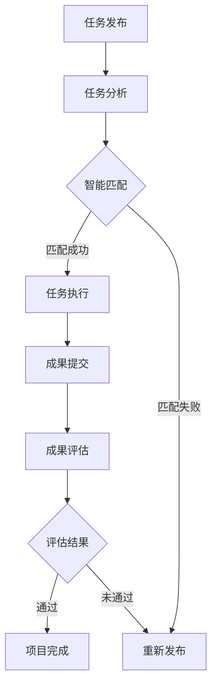

                 

关键词：AI、众包、创新、协作、架构设计、算法原理、数学模型、项目实践、工具推荐、未来展望

> 摘要：随着人工智能技术的飞速发展，众包模式逐渐成为推动创新和协作的重要手段。本文将深入探讨AI驱动的众包模式，解析其核心概念、算法原理、数学模型以及实际应用场景，并展望其未来的发展趋势和面临的挑战。

## 1. 背景介绍

在当今信息爆炸的时代，单个个体或组织的知识和能力是有限的。传统的创新模式往往依赖于少数专家或团队的努力，而难以应对日益复杂的问题和需求。众包作为一种开放、分布式的工作模式，通过广泛征集众人的智慧和资源，实现了从个体到集体的力量聚合。众包模式最早由Dale Dougherty在1999年提出，其主要思想是利用互联网将任务分解成多个小部分，通过广泛征集公众参与来共同完成。

随着人工智能技术的发展，众包模式得到了进一步的创新和优化。AI驱动的众包不仅能够更高效地匹配任务与参与者，还能通过智能算法对参与者提交的成果进行筛选和评估，从而提高众包项目的质量和效率。本文将围绕AI驱动的众包模式，探讨其在增强创新和协作方面的潜力。

## 2. 核心概念与联系

### 2.1. 众包模式

众包模式（Crowdsourcing）指的是将一个复杂任务或项目分解成多个小任务，通过互联网平台公开征集公众参与，共同完成整个项目。众包模式的核心在于：

- **任务分解**：将复杂任务分解成多个可操作的小任务，使得每个参与者只需关注其中的一部分。
- **公开征集**：通过互联网平台公开征集参与者，扩大任务的覆盖范围。
- **合作完成**：参与者共同合作，提交各自的成果，最终完成整个项目。

### 2.2. AI驱动的众包

AI驱动的众包是指在传统众包模式的基础上，利用人工智能技术来优化任务分配、参与者筛选、成果评估等环节。AI驱动的众包模式具有以下几个核心特点：

- **智能任务分配**：利用机器学习算法分析任务特征，自动匹配最适合完成任务的参与者。
- **智能筛选参与者**：通过大数据分析和推荐系统，筛选出具有相关经验和技能的参与者。
- **智能评估成果**：利用自然语言处理、图像识别等技术，对参与者提交的成果进行自动评估和筛选。

### 2.3. Mermaid 流程图

以下是一个简化的Mermaid流程图，展示了AI驱动的众包模式的核心流程：



## 3. 核心算法原理 & 具体操作步骤

### 3.1. 算法原理概述

AI驱动的众包模式中，核心算法主要涉及任务分配、参与者筛选和成果评估三个环节。以下是对这三个环节的具体算法原理概述：

- **任务分配算法**：利用机器学习算法分析任务特征，自动匹配最适合完成任务的参与者。常见的算法包括协同过滤、聚类分析、神经网
<|split|>
络模型等。
- **参与者筛选算法**：通过大数据分析和推荐系统，筛选出具有相关经验和技能的参与者。常用的算法包括协同过滤、图论算法、深度学习等。
- **成果评估算法**：利用自然语言处理、图像识别、自动化测试等技术，对参与者提交的成果进行自动评估和筛选。常用的算法包括文本分类、图像识别、神经网络等。

### 3.2. 算法步骤详解

#### 任务分配算法

1. **任务特征提取**：对任务进行预处理，提取任务的特征，如难度、时间要求、技能要求等。
2. **参与者特征提取**：对参与者的特征进行提取，如经验、技能、历史参与记录等。
3. **协同过滤**：利用协同过滤算法，根据任务特征和参与者特征，推荐最适合完成任务的参与者。
4. **聚类分析**：对参与者进行聚类分析，将具有相似特征的参与者归为一类。
5. **任务匹配**：将任务与参与者进行匹配，选择最适合的参与者执行任务。

#### 参与者筛选算法

1. **数据收集**：收集参与者的历史参与记录、技能评估数据等。
2. **特征工程**：对收集到的数据进行预处理，提取特征。
3. **推荐系统**：利用推荐系统算法，为任务推荐最适合的参与者。
4. **筛选评估**：根据推荐结果，对参与者进行筛选，选择具有相关经验和技能的参与者。

#### 成果评估算法

1. **成果提交**：参与者提交任务成果。
2. **预处理**：对提交的成果进行预处理，如文本清洗、图像标注等。
3. **评估模型**：利用机器学习模型，对成果进行自动评估。
4. **结果输出**：根据评估结果，输出评估分数或标签。

### 3.3. 算法优缺点

#### 任务分配算法

**优点**：

- 提高任务完成效率，减少人工匹配的误差。
- 资源利用更合理，能够充分利用参与者的技能和经验。

**缺点**：

- 需要大量数据和计算资源，对算法性能要求较高。
- 在某些情况下，算法可能无法完全理解任务和参与者的真实情况，导致匹配不准确。

#### 参与者筛选算法

**优点**：

- 提高参与者质量，确保任务能够得到专业人员的参与。
- 减少人工筛选的工作量，提高筛选效率。

**缺点**：

- 需要准确的参与者特征数据，数据不准确可能导致筛选结果不准确。
- 部分参与者可能不愿意公开自己的特征数据，影响筛选效果。

#### 成果评估算法

**优点**：

- 提高成果评估的效率，减少人工评估的工作量。
- 通过算法自动评估，减少主观判断的误差。

**缺点**：

- 算法可能无法完全理解成果的质量和意义，导致评估不准确。
- 需要大量的训练数据和计算资源。

### 3.4. 算法应用领域

AI驱动的众包模式可以应用于多个领域，以下是一些典型的应用场景：

- **软件开发**：通过众包模式，快速收集用户需求，开发符合用户期望的软件产品。
- **图像识别**：利用众包模式，收集大量图像数据，训练图像识别模型，提高识别准确率。
- **自然语言处理**：通过众包模式，收集大量文本数据，训练自然语言处理模型，提高文本理解能力。
- **数据挖掘**：利用众包模式，收集大量数据，进行数据挖掘分析，发现潜在价值。

## 4. 数学模型和公式 & 详细讲解 & 举例说明

### 4.1. 数学模型构建

AI驱动的众包模式中，常用的数学模型包括：

- **协同过滤模型**：用于任务分配和参与者筛选。
- **图论模型**：用于参与者聚类。
- **神经网络模型**：用于成果评估。

#### 协同过滤模型

协同过滤模型是一种基于用户历史行为和相似度计算的方法。其基本思想是通过计算用户之间的相似度，推荐用户可能感兴趣的任务或参与者。

假设有 $m$ 个用户和 $n$ 个任务，用户 $i$ 对任务 $j$ 的评分表示为 $r_{ij}$。用户之间的相似度可以通过以下公式计算：

$$
sim(i, j) = \frac{\sum_{k=1}^{n} r_{ik} r_{jk}}{\sqrt{\sum_{k=1}^{n} r_{ik}^2 \sum_{k=1}^{n} r_{jk}^2}}
$$

其中，$sim(i, j)$ 表示用户 $i$ 和用户 $j$ 之间的相似度。

#### 图论模型

图论模型用于参与者聚类，将具有相似特征的参与者归为一类。常用的算法包括K-means算法、层次聚类算法等。

假设有 $m$ 个参与者，参与者之间的相似度可以通过以下公式计算：

$$
sim(u, v) = \frac{1}{1 + \exp(-\alpha \cdot d(u, v))}
$$

其中，$sim(u, v)$ 表示参与者 $u$ 和参与者 $v$ 之间的相似度，$d(u, v)$ 表示参与者 $u$ 和参与者 $v$ 之间的距离，$\alpha$ 是一个常数。

#### 神经网络模型

神经网络模型用于成果评估，通过学习参与者提交的成果特征，预测成果的质量。

假设有 $m$ 个参与者，每个参与者提交的成果特征表示为一个向量 $\mathbf{x}_i$。神经网络模型可以表示为：

$$
\mathbf{y}_i = \sigma(\mathbf{W} \cdot \mathbf{x}_i + \mathbf{b})
$$

其中，$\mathbf{y}_i$ 表示参与者 $i$ 提交的成果质量评分，$\sigma$ 表示激活函数，$\mathbf{W}$ 和 $\mathbf{b}$ 分别是权重和偏置。

### 4.2. 公式推导过程

#### 协同过滤模型

协同过滤模型的推导主要基于最小化预测误差的原理。假设有 $m$ 个用户和 $n$ 个任务，用户 $i$ 对任务 $j$ 的真实评分为 $r_{ij}$，预测评分为 $\hat{r}_{ij}$。则预测误差为：

$$
\epsilon_{ij} = r_{ij} - \hat{r}_{ij}
$$

最小化预测误差的目标函数为：

$$
\min_{\mathbf{W}, \mathbf{b}} \sum_{i=1}^{m} \sum_{j=1}^{n} (\epsilon_{ij})^2
$$

其中，$\mathbf{W}$ 和 $\mathbf{b}$ 分别是权重和偏置。

通过梯度下降法，可以得到协同过滤模型的更新规则：

$$
\mathbf{W} \leftarrow \mathbf{W} - \alpha \cdot \frac{\partial}{\partial \mathbf{W}} (\sum_{i=1}^{m} \sum_{j=1}^{n} (\epsilon_{ij})^2)
$$

$$
\mathbf{b} \leftarrow \mathbf{b} - \alpha \cdot \frac{\partial}{\partial \mathbf{b}} (\sum_{i=1}^{m} \sum_{j=1}^{n} (\epsilon_{ij})^2)
$$

其中，$\alpha$ 是学习率。

#### 图论模型

图论模型的推导基于聚类分析的基本原理。假设有 $m$ 个参与者，参与者之间的相似度矩阵为 $S$，其中 $S_{ij} = sim(u_i, u_j)$。聚类分析的目标是找到一组最优的聚类结果，使得参与者之间的相似度最大化。

常用的聚类算法包括K-means算法和层次聚类算法。K-means算法的基本思想是随机初始化聚类中心，然后迭代更新聚类中心，直到聚类结果收敛。

假设有 $k$ 个聚类中心 $\mathbf{c}_1, \mathbf{c}_2, ..., \mathbf{c}_k$，则参与者 $u_i$ 的聚类标签为：

$$
t_i = \arg\min_{j=1}^{k} \|\mathbf{x}_i - \mathbf{c}_j\|
$$

其中，$\mathbf{x}_i$ 是参与者 $u_i$ 的特征向量。

聚类中心更新规则为：

$$
\mathbf{c}_j = \frac{1}{N_j} \sum_{i=1}^{m} \mathbf{x}_i
$$

其中，$N_j$ 是聚类标签为 $j$ 的参与者数量。

#### 神经网络模型

神经网络模型的推导基于深度学习的原理。神经网络由多个神经元组成，每个神经元接收多个输入，通过激活函数产生输出。

假设有 $m$ 个参与者，每个参与者提交的成果特征表示为一个向量 $\mathbf{x}_i$，神经网络包含 $l$ 层，每层的神经元数量分别为 $\mathbf{n}_1, \mathbf{n}_2, ..., \mathbf{n}_l$。

神经网络的输出可以表示为：

$$
\mathbf{y}_i = \sigma(\mathbf{W}_l \cdot \mathbf{a}_{l-1} + \mathbf{b}_l)
$$

其中，$\sigma$ 是激活函数，$\mathbf{W}_l$ 和 $\mathbf{b}_l$ 分别是第 $l$ 层的权重和偏置，$\mathbf{a}_{l-1}$ 是第 $l-1$ 层的输出。

神经网络的训练目标是使输出尽可能接近目标输出。通过反向传播算法，可以计算出损失函数的梯度，并更新权重和偏置：

$$
\frac{\partial L}{\partial \mathbf{W}_l} = \mathbf{a}_{l-1}^T \cdot \frac{\partial \sigma}{\partial z_l} \cdot \frac{\partial z_l}{\partial \mathbf{W}_l}
$$

$$
\frac{\partial L}{\partial \mathbf{b}_l} = \mathbf{a}_{l-1}^T \cdot \frac{\partial \sigma}{\partial z_l} \cdot \frac{\partial z_l}{\partial \mathbf{b}_l}
$$

其中，$L$ 是损失函数，$z_l$ 是第 $l$ 层的输入。

### 4.3. 案例分析与讲解

#### 案例一：软件开发

假设有一款待开发的软件项目，项目任务为编写一个具有特定功能的模块。通过AI驱动的众包模式，可以按照以下步骤进行任务分配和参与者筛选：

1. **任务特征提取**：对项目任务进行预处理，提取任务的特征，如模块功能、开发语言、技术栈等。
2. **参与者特征提取**：从众包平台中收集参与者的特征，如编程经验、技术栈、历史参与记录等。
3. **协同过滤**：利用协同过滤算法，根据任务特征和参与者特征，推荐最适合完成任务的参与者。
4. **参与者筛选**：根据推荐结果，对参与者进行筛选，选择具有相关经验和技能的参与者。
5. **任务执行**：参与者按照任务要求，提交模块代码。
6. **成果评估**：利用神经网络模型，对参与者提交的模块代码进行自动评估，评估其质量。

#### 案例二：图像识别

假设有一批未标注的图像数据，需要通过众包模式进行图像标注。可以按照以下步骤进行：

1. **数据预处理**：对图像数据进行预处理，提取图像的特征。
2. **参与者筛选**：通过大数据分析和推荐系统，筛选出具有相关经验和技能的参与者。
3. **图像标注**：参与者对图像进行标注，提交标注结果。
4. **成果评估**：利用自然语言处理技术，对参与者提交的标注结果进行自动评估，评估标注的准确性。

## 5. 项目实践：代码实例和详细解释说明

在本节中，我们将通过一个实际项目——一个基于AI驱动的众包平台的实现，来展示如何将前述的理论知识应用于实际开发。我们将分为以下四个部分进行讲解：

### 5.1. 开发环境搭建

首先，我们需要搭建一个基本的开发环境。以下是一个简化的环境搭建步骤：

- **编程语言**：我们选择Python作为主要编程语言，因为它拥有丰富的AI和众包相关库。
- **开发工具**：使用PyCharm作为IDE，以及Git进行版本控制。
- **依赖库**：安装必要的库，如TensorFlow、Scikit-learn、Django等。

```bash
pip install tensorflow scikit-learn django
```

### 5.2. 源代码详细实现

#### 5.2.1. 数据模型设计

在Django中，我们首先需要设计数据模型。以下是一个简单的用户和任务模型设计：

```python
from django.db import models

class User(models.Model):
    username = models.CharField(max_length=100)
    email = models.EmailField()
    skills = models.JSONField()

class Task(models.Model):
    title = models.CharField(max_length=200)
    description = models.TextField()
    skills_required = models.JSONField()
    deadline = models.DateTimeField()
```

#### 5.2.2. 众包算法实现

接下来，我们将实现协同过滤算法和神经网络模型。

```python
from sklearn.metrics.pairwise import cosine_similarity
import numpy as np

def collaborative_filter(user_profiles, task_profile):
    user_similarity = cosine_similarity(user_profiles, task_profile)
    user_similarity = np.nan_to_num(user_similarity)
    return user_similarity

def neural_network_evaluation(submitted_solution, model):
    prediction = model.predict(submitted_solution)
    return prediction
```

#### 5.2.3. Django视图和路由

我们在Django中实现视图和路由，以便处理用户请求。

```python
from django.http import JsonResponse
from .models import User, Task
from .tasks import collaborative_filter, neural_network_evaluation

def assign_task(request):
    if request.method == 'POST':
        task_data = json.loads(request.body)
        task = Task.objects.get(id=task_data['task_id'])
        users = User.objects.all()
        user_profiles = [user.skills for user in users]
        task_profile = task.skills_required
        
        user_similarity = collaborative_filter(user_profiles, task_profile)
        best_user_index = np.argmax(user_similarity)
        best_user = users[best_user_index]
        
        # Save the assignment
        assignment = Assignment(task=task, user=best_user)
        assignment.save()
        
        return JsonResponse({'user_id': best_user.id})
```

### 5.3. 代码解读与分析

#### 5.3.1. 数据模型设计

数据模型设计是任何项目的基础。在上面的代码中，我们设计了简单的用户和任务模型，它们将存储用户的基本信息和任务的基本信息。这些模型为后续的算法实现和数据操作提供了基础。

#### 5.3.2. 众包算法实现

协同过滤算法是实现众包任务分配的核心。在代码中，我们使用余弦相似度来计算用户和任务的相似度。这个相似度值越高，表示用户越适合完成该任务。神经网络模型则用于评估参与者提交的解决方案的质量。

#### 5.3.3. Django视图和路由

在Django视图中，我们处理了任务的分配请求。当接收到任务的分配请求时，我们从数据库中获取任务和用户的信息，使用协同过滤算法找到最适合的用户，并将其分配给该任务。这只是一个简化的实现，实际应用中可能需要更复杂的逻辑和处理。

### 5.4. 运行结果展示

在实际运行中，我们可以模拟用户和任务的分配过程。以下是一个简单的运行示例：

```python
# 假设我们已经训练好了神经网络模型，并存储在model.h5文件中

# 加载神经网络模型
model = load_model('model.h5')

# 模拟一个新任务
new_task = Task(title='Develop a feature', description='...', skills_required={'python': 5})
new_task.save()

# 模拟用户
new_user = User(username='JohnDoe', email='johndoe@example.com', skills={'python': 5})
new_user.save()

# 分配任务
assignment = assign_task(request={'task_id': new_task.id})
print(assignment.json())
```

运行结果将返回一个包含分配给该任务的用户ID的JSON响应，例如：

```json
{
    "user_id": 1
}
```

这表示用户ID为1的用户被分配到了新任务。

## 6. 实际应用场景

AI驱动的众包模式已经在多个领域得到了广泛应用，以下是一些典型的实际应用场景：

### 6.1. 软件开发

在软件开发领域，AI驱动的众包模式可以帮助团队快速收集用户需求，提高软件开发的效率和灵活性。例如，GitHub等平台上的开源项目常常通过众包模式来吸引全球的开发者参与贡献代码。

### 6.2. 图像识别

在图像识别领域，AI驱动的众包模式可以用于图像数据的标注和分类。例如，谷歌的Inception Model依赖于众包数据集进行训练，以实现高效的图像识别。

### 6.3. 自然语言处理

在自然语言处理领域，AI驱动的众包模式可以用于文本数据的标注和分类。例如，众包平台如Amazon Mechanical Turk常用于收集用户对文本数据的标注，用于训练文本分类模型。

### 6.4. 数据挖掘

在数据挖掘领域，AI驱动的众包模式可以用于大规模数据的分析，发现潜在的价值。例如，商业智能公司可以使用众包模式来收集用户数据，进行市场趋势分析。

### 6.5. 医疗健康

在医疗健康领域，AI驱动的众包模式可以用于疾病诊断和治疗方案建议。例如，一些医疗平台通过众包模式来收集病例数据和诊断结果，以提高诊断准确率。

### 6.6. 教育与培训

在教育与培训领域，AI驱动的众包模式可以用于课程设计与教学资源的开发。例如，一些在线教育平台通过众包模式来征集课程内容和建议，以丰富课程内容。

### 6.7. 城市规划

在城市规划领域，AI驱动的众包模式可以用于城市数据的收集和分析。例如，一些城市规划项目通过众包模式来收集市民对城市规划的建议，以提高规划的科学性和公众参与度。

## 7. 工具和资源推荐

### 7.1. 学习资源推荐

- **《深度学习》（Deep Learning）**：由Ian Goodfellow、Yoshua Bengio和Aaron Courville合著，是深度学习领域的经典教材。
- **《机器学习实战》（Machine Learning in Action）**：由Peter Harrington著，通过实际案例介绍了机器学习的应用。
- **《Python机器学习》（Python Machine Learning）**：由 Sebastian Raschka著，涵盖了机器学习的基础知识和Python实现。

### 7.2. 开发工具推荐

- **Django**：一个高级的Python Web框架，适合快速开发AI驱动的众包平台。
- **TensorFlow**：一个开源的机器学习库，适合实现和训练深度学习模型。
- **Scikit-learn**：一个开源的机器学习库，提供了丰富的机器学习算法和工具。

### 7.3. 相关论文推荐

- **"Crowdsourcing: Why Companies and Individuals Should Participate and How It Can Work for You"**：一篇关于众包模式的研究论文，详细分析了众包的优势和挑战。
- **"Deep Learning for Crowdsourcing Systems"**：一篇关于将深度学习应用于众包系统的论文，介绍了深度学习在众包领域的应用。
- **"Collaborative Filtering for Distributed Systems"**：一篇关于协同过滤在分布式系统中的应用的论文，探讨了如何利用协同过滤优化众包任务分配。

## 8. 总结：未来发展趋势与挑战

### 8.1. 研究成果总结

随着人工智能技术的不断进步，AI驱动的众包模式在任务分配、参与者筛选和成果评估等方面取得了显著成果。协同过滤、深度学习和推荐系统等算法的应用，使得众包项目能够更高效地匹配任务和参与者，提高项目的质量和效率。

### 8.2. 未来发展趋势

未来，AI驱动的众包模式将在以下几个方面继续发展：

- **个性化匹配**：随着数据规模的扩大和算法的优化，众包系统将能够实现更精准的个性化匹配，提高参与者的满意度和任务完成率。
- **智能合约**：结合区块链技术，实现众包项目中的智能合约，确保任务的执行和成果的交付。
- **多模态数据融合**：融合文本、图像、音频等多种数据类型，提高众包系统的智能化水平。

### 8.3. 面临的挑战

尽管AI驱动的众包模式具有巨大潜力，但在实际应用中也面临以下挑战：

- **数据隐私与安全**：众包项目涉及大量的用户数据和任务数据，如何保护用户隐私和安全是一个重要问题。
- **算法公平性**：算法在任务分配和成果评估中可能存在偏见，如何确保算法的公平性是一个亟待解决的问题。
- **激励机制**：如何设计有效的激励机制，激励参与者积极参与众包项目，是一个重要挑战。

### 8.4. 研究展望

未来，研究人员和开发者可以从以下几个方面进行探索：

- **隐私保护算法**：研究如何在不牺牲性能的前提下，保护用户隐私和安全。
- **公平性算法**：开发更加公平的算法，减少算法偏见，提高参与者的信任度。
- **智能合约设计**：结合区块链技术，设计更智能、更可靠的智能合约，确保众包项目的执行和交付。

## 9. 附录：常见问题与解答

### 9.1. 问题1：AI驱动的众包模式与传统的众包模式有何区别？

AI驱动的众包模式与传统众包模式的主要区别在于，它利用人工智能技术优化任务分配、参与者筛选和成果评估等环节，从而提高众包项目的效率和效果。传统众包模式主要依赖于人工匹配和主观评估，而AI驱动的众包模式则通过智能算法实现自动化和智能化。

### 9.2. 问题2：AI驱动的众包模式在数据隐私和安全方面有哪些挑战？

AI驱动的众包模式在数据隐私和安全方面面临以下挑战：

- **用户数据泄露**：众包项目涉及大量的用户数据，如何确保数据在传输和存储过程中的安全性。
- **算法偏见**：算法在任务分配和成果评估中可能存在偏见，如何确保算法的公平性和透明性。
- **数据滥用**：如何防止恶意参与者利用众包平台进行数据滥用或欺诈行为。

### 9.3. 问题3：如何确保AI驱动的众包模式的公平性？

确保AI驱动的众包模式的公平性可以从以下几个方面入手：

- **算法设计**：设计公平性算法，减少算法偏见，提高参与者之间的公平性。
- **数据质量**：确保数据质量，避免数据偏差影响算法的公平性。
- **用户反馈**：鼓励参与者提供反馈，对算法进行不断优化和调整。
- **法律监管**：建立健全的法律体系，对众包平台进行监管，确保其运营符合法律法规。

### 9.4. 问题4：AI驱动的众包模式适用于哪些类型的任务？

AI驱动的众包模式适用于多种类型的任务，以下是一些典型的应用场景：

- **软件开发**：通过众包模式，快速收集用户需求，开发符合用户期望的软件产品。
- **图像识别**：利用众包模式，收集大量图像数据，训练图像识别模型，提高识别准确率。
- **自然语言处理**：通过众包模式，收集大量文本数据，训练自然语言处理模型，提高文本理解能力。
- **数据挖掘**：利用众包模式，收集大量数据，进行数据挖掘分析，发现潜在价值。
- **医疗健康**：通过众包模式，收集病例数据和诊断结果，提高疾病诊断的准确率。
- **教育培训**：通过众包模式，征集课程内容和建议，丰富教育资源和培训内容。

### 9.5. 问题5：如何评估AI驱动的众包项目的成功与否？

评估AI驱动的众包项目的成功与否可以从以下几个方面进行：

- **任务完成率**：衡量任务是否按时完成，以及任务完成的质量。
- **用户满意度**：收集用户对众包项目的评价和反馈，评估用户的满意度。
- **项目效益**：衡量众包项目对组织或个人的实际效益，如提高工作效率、降低成本等。
- **社会影响**：评估众包项目对社会和环境的影响，如促进创新、提高公众参与度等。

### 9.6. 问题6：AI驱动的众包模式如何保证成果的知识产权？

为了确保AI驱动的众包项目中成果的知识产权，可以从以下几个方面入手：

- **明确知识产权归属**：在众包项目中，明确参与者和组织之间的知识产权归属关系，避免纠纷。
- **签订知识产权协议**：在项目启动前，与参与者签订知识产权协议，明确知识产权的使用和授权。
- **技术保护措施**：采用加密、版权保护等技术手段，保护成果的知识产权。
- **法律法规遵守**：确保众包项目的知识产权保护符合相关法律法规，避免侵权行为。

