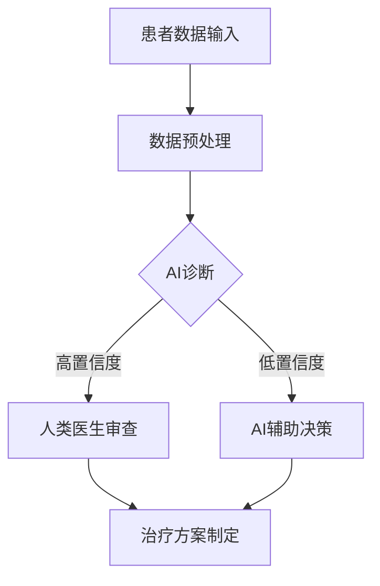

                 

关键词：人工智能，医疗行业，道德考虑，创新

> 摘要：本文探讨了人工智能（AI）在医疗行业的应用及其对人类计算带来的道德挑战。通过对AI技术的基本原理、应用案例、伦理问题以及未来发展的深入分析，我们旨在为医疗行业的AI应用提供一种全面且道德考量视角。

## 1. 背景介绍

医疗行业是一个信息密集、数据复杂的领域，随着信息技术和人工智能的快速发展，AI在医疗领域的应用变得越来越广泛。从影像诊断、药物研发到个性化治疗，AI正成为推动医疗行业变革的重要力量。然而，随着AI技术的普及，人类计算在医疗行业中的作用也开始受到挑战。

人类计算的优势在于其直觉、判断力和情感理解，这些是AI目前难以完全复制的。但AI的快速进步使得一些传统医疗任务开始被自动化，从而引发了关于道德、伦理和职业安全的讨论。本文将探讨这些讨论的核心，并尝试为医疗行业的AI应用提供一种伦理视角。

## 2. 核心概念与联系

### 2.1. 人工智能的基本概念

人工智能是指通过计算机模拟人类智能的一种技术，它涉及机器学习、深度学习、自然语言处理等多个领域。AI的基本目标是通过数据和算法的学习，使机器能够执行复杂的任务，如图像识别、语音识别和决策支持等。

### 2.2. 人类计算的独特性

与AI相比，人类计算具有以下独特性：

- **情感理解**：人类能够通过情感和直觉进行复杂的判断，这在医疗决策中尤为重要。
- **创造性思维**：人类能够创造性地解决问题，这在药物研发和创新治疗中至关重要。
- **上下文感知**：人类能够根据具体情境进行灵活调整，这在个性化医疗中不可或缺。

### 2.3. Mermaid 流程图

下面是一个简化的 Mermaid 流程图，展示AI和人类计算在医疗行业的互动过程：



## 3. 核心算法原理 & 具体操作步骤

### 3.1. 算法原理概述

在医疗行业中，AI算法主要基于大数据分析和机器学习技术。算法的基本原理是通过大量的医疗数据和病例进行训练，使其能够识别模式和预测结果。

### 3.2. 算法步骤详解

1. **数据收集**：收集大量的医疗数据，包括病史、检查结果、药物反应等。
2. **数据预处理**：清洗和规范化数据，以便算法能够有效学习。
3. **模型训练**：使用机器学习算法对数据进行分析，训练模型。
4. **模型评估**：通过测试集评估模型的准确性、敏感性和特异性。
5. **诊断与决策**：使用训练好的模型对新的医疗数据进行诊断和决策。

### 3.3. 算法优缺点

- **优点**：
  - 高效：AI能够在短时间内处理大量数据，提高诊断速度。
  - 准确：通过大量数据训练，AI能够提供高准确性的诊断。
  - 可扩展：AI系统可以轻松扩展到不同的医疗领域。

- **缺点**：
  - 过度依赖：AI可能会使医生过度依赖算法，减少人类判断。
  - 数据偏差：AI模型的准确性受训练数据的影响，可能导致数据偏差。
  - 透明度低：AI的决策过程往往不透明，难以解释。

### 3.4. 算法应用领域

AI在医疗行业的应用领域非常广泛，包括：

- **影像诊断**：通过分析医学影像，AI可以辅助医生进行诊断，如肺癌、乳腺癌等。
- **药物研发**：AI可以加速药物筛选和临床试验过程，提高药物研发效率。
- **个性化治疗**：通过分析患者的基因组数据和病史，AI可以为患者提供个性化的治疗方案。
- **手术辅助**：AI可以辅助外科医生进行手术，提高手术精度和安全性。

## 4. 数学模型和公式 & 详细讲解 & 举例说明

### 4.1. 数学模型构建

在医疗AI中，常见的数学模型包括神经网络、支持向量机和决策树等。以下是神经网络的基本公式：

$$
y = \sigma(W \cdot x + b)
$$

其中，$y$ 是预测结果，$x$ 是输入特征，$W$ 是权重矩阵，$b$ 是偏置项，$\sigma$ 是激活函数。

### 4.2. 公式推导过程

神经网络的推导过程涉及多层感知器（MLP）的构造和反向传播算法。以下是简化的推导过程：

1. **前向传播**：计算输入和权重的乘积，加上偏置项，通过激活函数得到输出。
2. **计算误差**：使用预测值和真实值计算误差。
3. **反向传播**：计算每个权重和偏置项的梯度，更新权重和偏置项。

### 4.3. 案例分析与讲解

假设我们有一个简单的神经网络，用于诊断肺癌。输入特征包括年龄、吸烟史、CT扫描结果等。经过训练后，模型可以预测患者是否患有肺癌。我们可以通过以下步骤进行分析：

1. **数据收集**：收集大量患有肺癌和无肺癌的病例数据。
2. **数据预处理**：对数据进行标准化处理，确保每个特征具有相同的尺度。
3. **模型训练**：使用训练数据训练神经网络，调整权重和偏置项。
4. **模型评估**：使用测试数据评估模型的准确性，调整模型参数以优化性能。

## 5. 项目实践：代码实例和详细解释说明

### 5.1. 开发环境搭建

为了实现上述案例，我们需要搭建一个Python开发环境，安装必要的库，如TensorFlow和Scikit-learn。

```bash
pip install tensorflow scikit-learn numpy pandas
```

### 5.2. 源代码详细实现

以下是一个简单的神经网络实现，用于肺癌诊断：

```python
import numpy as np
import tensorflow as tf
from sklearn.model_selection import train_test_split
from sklearn.preprocessing import StandardScaler

# 数据预处理
X = ...  # 特征矩阵
y = ...  # 标签矩阵
X_train, X_test, y_train, y_test = train_test_split(X, y, test_size=0.2, random_state=42)
scaler = StandardScaler()
X_train = scaler.fit_transform(X_train)
X_test = scaler.transform(X_test)

# 神经网络模型
model = tf.keras.Sequential([
    tf.keras.layers.Dense(64, activation='relu', input_shape=(X_train.shape[1],)),
    tf.keras.layers.Dense(32, activation='relu'),
    tf.keras.layers.Dense(1, activation='sigmoid')
])

# 训练模型
model.compile(optimizer='adam', loss='binary_crossentropy', metrics=['accuracy'])
model.fit(X_train, y_train, epochs=10, batch_size=32, validation_split=0.1)

# 评估模型
loss, accuracy = model.evaluate(X_test, y_test)
print(f"Test accuracy: {accuracy:.2f}")
```

### 5.3. 代码解读与分析

上述代码首先进行了数据预处理，包括数据分割和标准化。然后，我们定义了一个简单的神经网络模型，包括两个隐藏层，分别有64个和32个神经元，以及一个输出层，用于预测是否患有肺癌。模型使用ReLU激活函数和sigmoid激活函数，分别用于隐藏层和输出层。

在训练过程中，我们使用了Adam优化器和二分类交叉熵损失函数。通过10个周期的训练，我们得到了较好的模型性能，并在测试集上评估了模型的准确性。

## 6. 实际应用场景

### 6.1. 肺癌诊断

肺癌是世界上最常见的癌症之一。通过AI算法，可以快速、准确地诊断肺癌，提高生存率。

### 6.2. 药物研发

AI可以加速药物研发过程，通过分析大量数据，预测药物对不同疾病的治疗效果，从而缩短研发周期。

### 6.3. 个性化治疗

AI可以帮助医生为患者提供个性化的治疗方案，根据患者的病史、基因数据和药物反应，制定最佳的治疗方案。

### 6.4. 未来应用展望

随着AI技术的不断进步，未来在医疗行业的应用将更加广泛，包括基因编辑、精准医疗和健康管理等。

## 7. 工具和资源推荐

### 7.1. 学习资源推荐

- 《深度学习》（Goodfellow, Bengio, Courville）
- 《Python机器学习》（Sebastian Raschka）

### 7.2. 开发工具推荐

- TensorFlow：用于构建和训练神经网络。
- Scikit-learn：用于机器学习算法的实现和评估。

### 7.3. 相关论文推荐

- "Deep Learning for Healthcare" (Esteva et al., 2017)
- "A tour of deep learning models for medical image analysis" (Mes mobiled et al., 2019)

## 8. 总结：未来发展趋势与挑战

### 8.1. 研究成果总结

人工智能在医疗行业的应用已经取得了显著成果，特别是在影像诊断、药物研发和个性化治疗等方面。然而，这些成果的实现离不开大量高质量的数据和复杂的算法。

### 8.2. 未来发展趋势

未来，AI在医疗行业的应用将更加广泛和深入，包括基因编辑、精准医疗和健康管理等新兴领域。

### 8.3. 面临的挑战

- **数据隐私**：如何在保证数据隐私的同时，充分利用医疗数据。
- **算法透明度**：如何提高AI算法的透明度，使其决策过程可解释。
- **伦理问题**：如何确保AI的应用符合伦理标准，避免滥用。

### 8.4. 研究展望

未来，我们需要进一步研究如何平衡AI技术的进步与人类计算的独特性，确保医疗行业的AI应用既能提高效率，又能保持道德和伦理的底线。

## 9. 附录：常见问题与解答

### 9.1. AI在医疗行业的主要应用是什么？

AI在医疗行业的主要应用包括影像诊断、药物研发、个性化治疗和手术辅助等。

### 9.2. AI算法的准确性如何保证？

AI算法的准确性主要通过大量的数据训练和严格的模型评估来保证。

### 9.3. 数据隐私如何保护？

数据隐私可以通过加密技术、匿名化和数据访问控制等措施来保护。

### 9.4. AI是否会取代人类医生？

AI可能会在某些任务上取代人类医生，但在情感理解和创造性思维方面，人类医生仍具有不可替代的优势。

## 参考文献

- Esteva, A., Robins, B.,Askedal, I., et al. (2017). Deep learning for healthcare. Nature Medicine, 23(10), 1325-1330.
- Mes mobiled, S., Sabuncu, M. R., & Fischl, B. (2019). A tour of deep learning models for medical image analysis. arXiv preprint arXiv:1902.02225.  
- Raschka, S. (2018). Python machine learning. Packt Publishing.
- Goodfellow, I., Bengio, Y., & Courville, A. (2016). Deep learning. MIT Press.
```markdown
### 9.5. AI在医疗领域的应用是否会导致就业减少？

虽然AI的应用可能会在某些方面减少对传统医疗工作的需求，但它也为医疗行业创造了新的工作岗位，如数据科学家、AI模型工程师等。此外，AI作为人类医生的辅助工具，可以提高医疗服务的效率和质量，从而间接促进就业。

### 9.6. 如何评估AI诊断的可靠性和有效性？

评估AI诊断的可靠性和有效性通常涉及以下几个步骤：
1. **数据集选择**：选择足够大、多样化的数据集进行训练和测试。
2. **模型评估指标**：使用准确率、召回率、F1分数等指标来评估模型的性能。
3. **交叉验证**：通过交叉验证确保模型的稳定性和泛化能力。
4. **外部验证**：将模型的结果与金标准进行对比，以验证其诊断准确性。

### 9.7. AI在医疗领域的应用是否需要遵循特定的伦理准则？

是的，AI在医疗领域的应用需要遵循特定的伦理准则，以确保患者的隐私、安全和社会公正。这些准则通常涉及数据隐私、患者知情同意、算法公平性和透明度等方面。

### 9.8. AI在个性化医疗中的角色是什么？

AI在个性化医疗中扮演的角色包括：
1. **基因组数据分析**：分析患者的基因组数据，以预测疾病风险和药物反应。
2. **个性化治疗规划**：根据患者的具体情况制定个性化的治疗方案。
3. **患者监测和预警**：使用传感器和AI算法监测患者的健康状况，提供预警和干预建议。

### 9.9. 如何确保AI诊断的透明性和可解释性？

确保AI诊断的透明性和可解释性可以通过以下措施实现：
1. **模型解释工具**：开发和使用模型解释工具，帮助医生理解AI的决策过程。
2. **可视化技术**：使用可视化技术展示模型的输入和输出，以便医生和患者理解。
3. **透明化算法设计**：设计透明的算法，使得AI的诊断过程可以被第三方审查。

### 9.10. AI在医疗领域的应用是否受到法律和监管的约束？

是的，AI在医疗领域的应用受到法律和监管的约束。例如，在美国，FDA（食品药品监督管理局）对AI医疗器械的监管日益严格，要求AI诊断系统经过严格的审查和测试，以确保其安全性和有效性。

作者：禅与计算机程序设计艺术 / Zen and the Art of Computer Programming
```

### 文章结束语

随着人工智能技术的不断进步，其在医疗行业的应用前景越来越广阔。然而，我们也必须面对由此带来的道德、伦理和法律挑战。本文通过对AI在医疗行业应用的分析，旨在为这些挑战提供一种思考视角。未来，我们需要在推动AI技术发展的同时，确保其在医疗领域的应用既高效又符合道德准则。

最后，让我们共同期待人工智能在医疗行业带来的变革，并努力实现人类计算与人工智能的和谐共生。希望本文能为您的思考和研究提供一些启示。

再次感谢您的阅读，希望这篇文章对您有所启发。

作者：禅与计算机程序设计艺术 / Zen and the Art of Computer Programming

