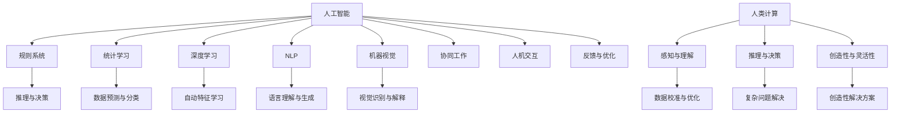

                 

关键词：人工智能、商业应用、创新、人类计算、商业模式、技术进步

> 摘要：本文将探讨人工智能技术在商业领域的创新应用，分析人工智能如何推动人类计算的发展，提高商业效率，并展望未来发展趋势与挑战。

## 1. 背景介绍

随着信息技术的快速发展，人工智能（AI）已成为当前科技领域的研究热点。从早期的规则系统到现代的深度学习，人工智能技术取得了显著的进步。商业领域一直以来都是技术进步的重要应用场景，而人工智能的崛起更是为商业创新提供了前所未有的机遇。

在商业应用中，人工智能技术正逐渐渗透到各个行业，如零售、金融、医疗、教育等，通过数据分析和智能决策，提高了企业的运营效率和市场竞争力。然而，人工智能的应用并非一帆风顺，如何在充分发挥其优势的同时，规避潜在的风险，成为了一个亟待解决的问题。

本文将围绕人工智能在商业应用中的创新，探讨人类计算在其中的角色和重要性，分析其具体应用场景，并提出未来发展的展望。

## 2. 核心概念与联系

### 2.1 人工智能的概念与分类

人工智能是指通过计算机模拟人类智能行为的技术，主要包括以下几种类型：

1. **规则系统（Rule-based Systems）**：基于明确的规则和逻辑关系进行推理和决策。
2. **统计学习（Statistical Learning）**：通过大量数据训练模型，实现对未知数据的预测和分类。
3. **深度学习（Deep Learning）**：基于多层神经网络的结构，通过自动学习数据特征，实现复杂的任务。
4. **自然语言处理（Natural Language Processing，NLP）**：使计算机能够理解、生成和处理人类语言。
5. **机器视觉（Computer Vision）**：使计算机能够识别和解释视觉信息。

### 2.2 人类计算的概念与作用

人类计算是指人类在信息处理和决策过程中的能力，包括感知、理解、推理、决策等。在人工智能技术日益普及的今天，人类计算的作用仍然不可替代。一方面，人类计算能够提供灵活的、创造性的解决方案，尤其是在面对复杂、不确定的问题时；另一方面，人类计算能够对人工智能模型进行校准和优化，提高其准确性和可靠性。

### 2.3 人工智能与人类计算的互动

人工智能与人类计算的互动主要体现在以下几个方面：

1. **协同工作**：人工智能可以作为人类计算的工具，帮助人类处理大量数据，提高工作效率。
2. **人机交互**：通过自然语言处理和机器视觉等技术，人工智能能够理解人类的指令和需求，提供个性化的服务。
3. **反馈与优化**：人类计算能够对人工智能模型进行评估和改进，使其更好地适应实际应用场景。

### 2.4 Mermaid 流程图



## 3. 核心算法原理 & 具体操作步骤

### 3.1 算法原理概述

人工智能算法主要包括以下几种：

1. **规则系统**：基于预定义的规则进行逻辑推理和决策。
2. **统计学习**：通过训练数据集，学习数据特征，实现对未知数据的预测和分类。
3. **深度学习**：基于多层神经网络的结构，自动学习数据特征，实现复杂任务。
4. **自然语言处理**：通过机器学习技术，使计算机能够理解、生成和处理人类语言。
5. **机器视觉**：通过图像处理技术，使计算机能够识别和解释视觉信息。

### 3.2 算法步骤详解

1. **数据收集与预处理**：收集相关数据，并进行清洗、去重、归一化等预处理操作。
2. **模型选择与训练**：选择合适的算法模型，利用训练数据集进行模型训练。
3. **模型评估与优化**：通过验证集和测试集对模型进行评估，根据评估结果进行模型优化。
4. **模型部署与应用**：将训练好的模型部署到实际应用场景中，进行任务执行。

### 3.3 算法优缺点

1. **规则系统**：优点：规则明确，易于理解和维护；缺点：适用范围有限，难以处理复杂问题。
2. **统计学习**：优点：适用于各种类型的数据，预测准确度较高；缺点：对训练数据依赖较大，泛化能力有限。
3. **深度学习**：优点：能够自动学习数据特征，处理复杂任务；缺点：计算资源需求大，训练时间较长。
4. **自然语言处理**：优点：能够理解人类语言，提供个性化服务；缺点：对语言理解能力有限，难以处理模糊和歧义。
5. **机器视觉**：优点：能够识别和解释视觉信息，提高生产效率；缺点：对光照、角度等环境因素敏感。

### 3.4 算法应用领域

1. **零售行业**：利用自然语言处理技术进行消费者行为分析，优化产品推荐和营销策略。
2. **金融行业**：利用统计学习和深度学习技术进行风险控制和投资决策。
3. **医疗行业**：利用机器视觉技术进行医学图像分析，辅助诊断和治疗。
4. **教育行业**：利用人工智能技术进行个性化教学和评估。

## 4. 数学模型和公式 & 详细讲解 & 举例说明

### 4.1 数学模型构建

在人工智能技术中，常用的数学模型包括：

1. **线性回归模型**：用于预测线性关系。
   $$ y = \beta_0 + \beta_1x_1 + \beta_2x_2 + \ldots + \beta_nx_n $$
2. **逻辑回归模型**：用于分类问题。
   $$ P(Y=1) = \frac{1}{1 + e^{-(\beta_0 + \beta_1x_1 + \beta_2x_2 + \ldots + \beta_nx_n)}} $$
3. **神经网络模型**：用于复杂任务的学习和预测。
   $$ a_{i,j}^{(l)} = \sigma(z_{i,j}^{(l)}) = \frac{1}{1 + e^{-z_{i,j}^{(l)}} $$

### 4.2 公式推导过程

以线性回归模型为例，推导过程如下：

1. **假设**：存在线性关系 $y = \beta_0 + \beta_1x_1 + \beta_2x_2 + \ldots + \beta_nx_n$。
2. **损失函数**：平方误差损失函数 $L = \frac{1}{2}\sum_{i=1}^{n}(y_i - \hat{y}_i)^2$。
3. **求导**：对损失函数关于每个参数求导，得到：
   $$ \frac{\partial L}{\partial \beta_j} = -\sum_{i=1}^{n}(y_i - \hat{y}_i)x_{ij} $$
4. **梯度下降**：更新参数：
   $$ \beta_j := \beta_j - \alpha \frac{\partial L}{\partial \beta_j} $$

### 4.3 案例分析与讲解

假设我们有一个简单的线性回归问题，预测房价。数据集包含房屋面积和房价，我们需要构建一个线性回归模型来预测未知房屋的房价。

1. **数据收集与预处理**：收集包含房屋面积和房价的数据，并进行清洗和归一化处理。
2. **模型选择与训练**：选择线性回归模型，利用训练数据集进行模型训练。
3. **模型评估与优化**：通过验证集和测试集对模型进行评估，并根据评估结果进行模型优化。
4. **模型部署与应用**：将训练好的模型部署到实际应用场景中，预测未知房屋的房价。

## 5. 项目实践：代码实例和详细解释说明

### 5.1 开发环境搭建

1. 安装Python环境，版本建议3.8及以上。
2. 安装必要的库，如NumPy、Pandas、Scikit-learn等。

### 5.2 源代码详细实现

以下是一个简单的线性回归模型的实现示例：

```python
import numpy as np
import pandas as pd
from sklearn.linear_model import LinearRegression
from sklearn.model_selection import train_test_split
from sklearn.metrics import mean_squared_error

# 数据收集与预处理
data = pd.read_csv('house_price_data.csv')
X = data[['area']]
y = data['price']

# 模型选择与训练
model = LinearRegression()
X_train, X_test, y_train, y_test = train_test_split(X, y, test_size=0.2, random_state=42)
model.fit(X_train, y_train)

# 模型评估与优化
y_pred = model.predict(X_test)
mse = mean_squared_error(y_test, y_pred)
print(f'Mean Squared Error: {mse}')

# 模型部署与应用
new_area = np.array([[1500]])
predicted_price = model.predict(new_area)
print(f'Predicted Price: {predicted_price[0]}')
```

### 5.3 代码解读与分析

1. **数据收集与预处理**：读取CSV文件，将数据分为特征和目标变量，并进行标准化处理。
2. **模型选择与训练**：选择线性回归模型，将训练数据分为训练集和测试集，进行模型训练。
3. **模型评估与优化**：利用测试集对模型进行评估，计算均方误差，并根据评估结果进行模型优化。
4. **模型部署与应用**：将训练好的模型应用于新数据，预测未知房屋的房价。

## 6. 实际应用场景

### 6.1 零售行业

人工智能技术在零售行业的应用主要包括：

1. **消费者行为分析**：利用自然语言处理技术，分析消费者在社交媒体、评论等渠道的行为，了解消费者需求和偏好。
2. **产品推荐**：基于消费者行为和购买历史，利用统计学习和深度学习技术，为消费者推荐个性化产品。
3. **库存管理**：通过预测销售数据，优化库存管理，减少库存成本。

### 6.2 金融行业

人工智能技术在金融行业的应用主要包括：

1. **风险控制**：利用统计学习和深度学习技术，对金融市场的数据进行分析，预测市场趋势，进行风险控制。
2. **投资决策**：利用大数据分析和机器学习技术，为投资者提供个性化的投资建议。
3. **信用评估**：利用自然语言处理技术，分析借款人的信用记录，预测信用风险。

### 6.3 医疗行业

人工智能技术在医疗行业的应用主要包括：

1. **医学图像分析**：利用机器视觉技术，对医学图像进行分析，辅助医生进行诊断。
2. **个性化治疗**：利用大数据分析和机器学习技术，为患者提供个性化的治疗方案。
3. **健康监测**：利用可穿戴设备和传感器技术，实时监测患者的健康状况。

### 6.4 未来应用展望

随着人工智能技术的不断进步，未来在商业领域的应用将更加广泛和深入：

1. **智能制造**：利用人工智能技术，实现生产流程的智能化，提高生产效率和产品质量。
2. **智慧物流**：利用人工智能技术，优化物流配送流程，提高物流效率。
3. **智慧城市**：利用人工智能技术，实现城市管理的智能化，提高城市居民的生活质量。

## 7. 工具和资源推荐

### 7.1 学习资源推荐

1. **《深度学习》**：由Goodfellow、Bengio和Courville合著，是深度学习领域的经典教材。
2. **《Python机器学习》**：由Sebastian Raschka和Vahid Mirjalili合著，介绍Python在机器学习领域的应用。
3. **Udacity的《机器学习纳米学位》**：提供系统的机器学习课程，适合初学者入门。

### 7.2 开发工具推荐

1. **Jupyter Notebook**：适合编写和运行Python代码，提供交互式编程环境。
2. **TensorFlow**：由Google开发的开源机器学习库，支持深度学习和统计学习。
3. **Scikit-learn**：Python的机器学习库，提供丰富的算法和工具。

### 7.3 相关论文推荐

1. **"Deep Learning" by Yann LeCun, Yoshua Bengio and Geoffrey Hinton**：介绍了深度学习的基本概念和发展趋势。
2. **"Large-Scale Machine Learning in Apache Spark" by Dzintars Ganiss and Xiaoyan Zhu**：介绍了如何在Apache Spark上进行大规模机器学习。
3. **"Reinforcement Learning: An Introduction" by Richard S. Sutton and Andrew G. Barto**：介绍了强化学习的基本原理和应用。

## 8. 总结：未来发展趋势与挑战

### 8.1 研究成果总结

近年来，人工智能技术取得了显著的进展，应用范围不断扩大。在商业领域，人工智能已经深刻改变了零售、金融、医疗等行业，提高了企业的运营效率和竞争力。

### 8.2 未来发展趋势

未来，人工智能技术将继续发展，并在更多领域得到应用。主要发展趋势包括：

1. **深度学习的普及**：深度学习技术在图像识别、语音识别等领域的表现已经超过人类水平，未来将在更多领域得到应用。
2. **强化学习的发展**：强化学习技术在游戏、推荐系统等领域表现出色，未来将在自动驾驶、机器人等领域得到广泛应用。
3. **跨学科融合**：人工智能技术将与其他学科（如生物学、心理学、经济学等）相结合，推动跨学科研究的发展。

### 8.3 面临的挑战

尽管人工智能技术取得了巨大进展，但仍面临一些挑战：

1. **数据隐私与安全**：随着人工智能技术的应用，数据隐私和安全问题日益突出，需要制定相应的法律法规和技术措施。
2. **算法透明性与可解释性**：深度学习等算法的复杂性和黑箱性质导致其难以解释，需要研究算法的可解释性和透明性。
3. **伦理与社会影响**：人工智能技术的发展可能会引发伦理和社会问题，需要关注其对社会的影响。

### 8.4 研究展望

未来，人工智能技术将在商业领域发挥更大的作用，推动商业创新和产业升级。同时，需要解决数据隐私、算法透明性和伦理问题，确保人工智能技术的可持续发展。

## 9. 附录：常见问题与解答

### 9.1 人工智能是否会取代人类？

人工智能技术的发展确实在某些领域取得了超越人类的表现，但它并不能完全取代人类。人工智能更多地是作为人类计算的工具，帮助人类解决复杂问题，提高工作效率。

### 9.2 人工智能会带来失业吗？

人工智能技术的发展可能会改变某些行业的就业结构，但也会创造新的就业机会。长期来看，人工智能将为社会带来更多的工作岗位。

### 9.3 人工智能是否会加剧社会不平等？

人工智能技术可能会加剧社会不平等，但这取决于政策制定者和社会各界的努力。通过合理的政策和技术措施，可以减少人工智能对社会不平等的影响。

### 9.4 人工智能是否会引发安全风险？

人工智能技术的发展确实存在安全风险，如数据泄露、算法偏见等。需要加强监管和安全管理，确保人工智能技术的安全可靠。

## 参考文献

1. Goodfellow, I., Bengio, Y., & Courville, A. (2016). *Deep Learning*. MIT Press.
2. Raschka, S., & Mirjalili, V. (2017). *Python Machine Learning*. Packt Publishing.
3. Ganiss, D., & Zhu, X. (2017). *Large-Scale Machine Learning in Apache Spark*. Springer.
4. Sutton, R. S., & Barto, A. G. (2018). *Reinforcement Learning: An Introduction*. MIT Press.
5. LeCun, Y., Bengio, Y., & Hinton, G. (2015). *Deep Learning*. Nature, 521(7553), 436-444.

