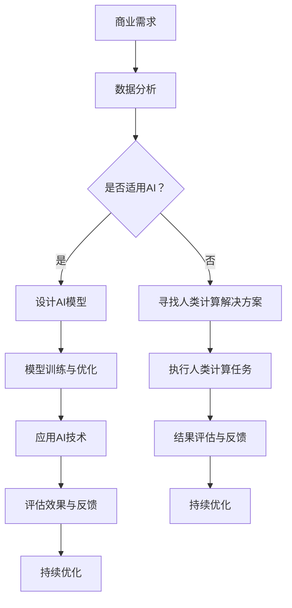

                 

关键词：人工智能，商业应用，道德伦理，创新驱动，人类计算

> 摘要：本文从人工智能在商业中的应用出发，探讨了人类计算在商业领域的道德和伦理问题。通过对人工智能驱动的创新进行深入分析，本文提出了人类计算在商业中的道德准则，并对未来的发展趋势和挑战进行了展望。

## 1. 背景介绍

随着人工智能技术的快速发展，越来越多的商业领域开始利用人工智能进行创新。从智能客服、智能推荐系统到自动驾驶、金融风控，人工智能已经成为商业创新的重要驱动力。然而，在人工智能驱动的创新过程中，人类计算的道德和伦理问题也逐渐凸显出来。

商业领域的道德伦理问题涉及多个方面，包括隐私保护、数据安全、算法偏见、社会责任等。这些问题的解决不仅关系到企业的社会责任，也关系到整个社会的健康发展。因此，如何在人工智能驱动的商业创新中处理道德和伦理问题，成为当前亟待解决的问题。

## 2. 核心概念与联系

### 2.1 人工智能与商业创新

人工智能（Artificial Intelligence，简称AI）是指模拟、延伸和扩展人类智能的理论、方法、技术及应用。商业创新（Business Innovation）是指企业在产品、服务、商业模式等方面进行创新，以实现商业目标的过程。

在商业创新中，人工智能作为一种新的工具，可以大大提高企业的生产效率、降低成本、提升客户满意度等。例如，智能客服系统可以24小时不间断地提供服务，智能推荐系统可以根据用户行为进行精准推荐，自动驾驶技术可以减少交通事故等。

### 2.2 人类计算与商业道德伦理

人类计算（Human Computation）是指通过人类智能参与计算任务，以实现自动化系统无法完成的计算过程。在商业领域，人类计算通常用于处理复杂、模糊或不确定的问题。

商业道德伦理（Business Ethics）是指企业在经营过程中遵循的道德规范和行为准则。这些规范和准则旨在确保企业的社会责任，维护公共利益，以及促进企业的可持续发展。

### 2.3 Mermaid 流程图

以下是人工智能驱动的商业创新过程中涉及的主要概念和流程的 Mermaid 流程图：



## 3. 核心算法原理 & 具体操作步骤

### 3.1 算法原理概述

在人工智能驱动的商业创新过程中，核心算法通常包括数据挖掘、机器学习、深度学习等。以下分别对这些算法进行概述：

- 数据挖掘（Data Mining）：通过分析大量数据，从中提取出有价值的信息和知识。
- 机器学习（Machine Learning）：通过学习数据中的模式，使计算机具备自动预测和决策的能力。
- 深度学习（Deep Learning）：基于人工神经网络的一种学习方法，通过多层网络结构对数据进行建模和处理。

### 3.2 算法步骤详解

在商业创新过程中，人工智能算法的应用通常包括以下几个步骤：

1. 数据收集与预处理：收集与商业问题相关的数据，并进行清洗、转换等预处理操作。
2. 模型设计：根据商业需求，设计合适的算法模型，如决策树、支持向量机、神经网络等。
3. 模型训练与优化：使用训练数据对模型进行训练，并通过调整模型参数进行优化。
4. 模型评估：使用测试数据对模型进行评估，以判断其性能和效果。
5. 应用与部署：将训练好的模型应用到实际商业场景中，如智能客服、智能推荐等。
6. 持续优化：根据应用效果，对模型进行持续优化，以提高其性能和效果。

### 3.3 算法优缺点

- 数据挖掘：优点包括可以处理大量数据、发现潜在规律等；缺点包括计算复杂度高、对数据质量要求高等。
- 机器学习：优点包括自适应性强、预测准确性高等；缺点包括对数据量要求较高、模型解释性较差等。
- 深度学习：优点包括处理复杂数据的能力强、预测准确性高等；缺点包括模型训练时间长、对数据质量要求高等。

### 3.4 算法应用领域

人工智能算法在商业领域有广泛的应用，如：

- 金融：用于风险评估、信用评分、欺诈检测等。
- 零售：用于需求预测、库存管理、个性化推荐等。
- 制造：用于设备故障预测、生产优化等。
- 医疗：用于疾病诊断、药物研发等。

## 4. 数学模型和公式 & 详细讲解 & 举例说明

### 4.1 数学模型构建

在人工智能驱动的商业创新过程中，常见的数学模型包括线性回归、逻辑回归、支持向量机等。以下分别对这几种模型进行构建和讲解。

#### 线性回归模型

线性回归模型是最简单的一类机器学习模型，它通过拟合一条直线来预测因变量与自变量之间的关系。

- 模型假设：自变量 $X$ 与因变量 $Y$ 之间存在线性关系，即 $Y = \beta_0 + \beta_1X + \epsilon$，其中 $\beta_0$ 和 $\beta_1$ 是模型参数，$\epsilon$ 是误差项。
- 模型构建：通过最小化损失函数 $L(\beta_0, \beta_1) = \sum_{i=1}^n (Y_i - (\beta_0 + \beta_1X_i))^2$ 来求解最优参数 $\beta_0$ 和 $\beta_1$。

#### 逻辑回归模型

逻辑回归模型是一种广泛应用于分类问题的机器学习模型，它通过拟合一个逻辑函数来预测样本属于某一类别的概率。

- 模型假设：自变量 $X$ 与因变量 $Y$ 之间存在逻辑关系，即 $P(Y=1|X) = \frac{1}{1 + \exp(-\beta_0 - \beta_1X)}$，其中 $\beta_0$ 和 $\beta_1$ 是模型参数。
- 模型构建：通过最大化似然函数 $L(\beta_0, \beta_1) = \prod_{i=1}^n \left[\frac{1}{1 + \exp(-\beta_0 - \beta_1X_i)}\right]^{Y_i} \left[1 - \frac{1}{1 + \exp(-\beta_0 - \beta_1X_i)}\right]^{1-Y_i}$ 来求解最优参数 $\beta_0$ 和 $\beta_1$。

#### 支持向量机模型

支持向量机模型是一种在分类和回归任务中具有较好性能的机器学习模型，它通过找到一个最佳的超平面来分隔不同类别的样本。

- 模型假设：存在一个最优的超平面 $w \cdot x + b = 0$，使得同类样本之间的距离最小，异类样本之间的距离最大。
- 模型构建：通过求解最优化问题 $min_{w, b} \frac{1}{2} ||w||^2 + C \sum_{i=1}^n \max(0, 1 - y_i(w \cdot x_i + b))$ 来求解最优参数 $w$ 和 $b$，其中 $C$ 是惩罚参数。

### 4.2 公式推导过程

在上述数学模型中，我们可以通过数学推导来求解最优参数。以下分别对线性回归模型、逻辑回归模型和支持向量机模型进行公式推导。

#### 线性回归模型

1. 损失函数：$L(\beta_0, \beta_1) = \sum_{i=1}^n (Y_i - (\beta_0 + \beta_1X_i))^2$
2. 求导：$\frac{\partial L}{\partial \beta_0} = -2\sum_{i=1}^n (Y_i - (\beta_0 + \beta_1X_i)) = 0$
3. 求解：$\beta_0 = \frac{1}{n}\sum_{i=1}^n Y_i - \beta_1\frac{1}{n}\sum_{i=1}^n X_i$
4. 求导：$\frac{\partial L}{\partial \beta_1} = -2\sum_{i=1}^n (X_i(Y_i - (\beta_0 + \beta_1X_i))) = 0$
5. 求解：$\beta_1 = \frac{1}{n}\sum_{i=1}^n X_iY_i - \beta_0\frac{1}{n}\sum_{i=1}^n X_i$

#### 逻辑回归模型

1. 似然函数：$L(\beta_0, \beta_1) = \prod_{i=1}^n \left[\frac{1}{1 + \exp(-\beta_0 - \beta_1X_i)}\right]^{Y_i} \left[1 - \frac{1}{1 + \exp(-\beta_0 - \beta_1X_i)}\right]^{1-Y_i}$
2. 取对数：$\ln L(\beta_0, \beta_1) = \sum_{i=1}^n \left[Y_i \ln \left(\frac{1}{1 + \exp(-\beta_0 - \beta_1X_i)}\right) + (1-Y_i) \ln \left(1 - \frac{1}{1 + \exp(-\beta_0 - \beta_1X_i)}\right)\right]$
3. 求导：$\frac{\partial \ln L}{\partial \beta_0} = \sum_{i=1}^n \frac{Y_i}{1 + \exp(-\beta_0 - \beta_1X_i)} \cdot (-1)$
4. 求解：$\beta_0 = \frac{1}{n}\sum_{i=1}^n Y_i - \beta_1\frac{1}{n}\sum_{i=1}^n X_i$
5. 求导：$\frac{\partial \ln L}{\partial \beta_1} = \sum_{i=1}^n \frac{Y_iX_i}{1 + \exp(-\beta_0 - \beta_1X_i)} \cdot (-1)$
6. 求解：$\beta_1 = \frac{1}{n}\sum_{i=1}^n X_iY_i - \beta_0\frac{1}{n}\sum_{i=1}^n X_i$

#### 支持向量机模型

1. 最优化问题：$min_{w, b} \frac{1}{2} ||w||^2 + C \sum_{i=1}^n \max(0, 1 - y_i(w \cdot x_i + b))$
2. 拉格朗日函数：$L(w, b, \alpha) = \frac{1}{2} ||w||^2 - \sum_{i=1}^n \alpha_i (1 - y_i(w \cdot x_i + b))$
3. KKT条件：
   - $\alpha_i \geq 0$
   - $y_i(w \cdot x_i + b) \geq 1 - \alpha_i$
   - $\alpha_i (1 - y_i(w \cdot x_i + b)) = 0$
4. 求解：
   - $\alpha_i \in [0, 1]$
   - $w = \sum_{i=1}^n \alpha_i y_i x_i$
   - $b = \frac{1}{n}\sum_{i=1}^n \alpha_i - \frac{1}{n}\sum_{i=1}^n \alpha_i y_i x_i$

### 4.3 案例分析与讲解

以下通过一个简单的例子来展示如何使用上述数学模型进行商业创新。

#### 案例背景

某电商企业希望通过分析用户的历史购买数据，为用户推荐可能感兴趣的商品。该企业收集了1000名用户的购买数据，包括用户的性别、年龄、购买金额等特征。

#### 数据预处理

1. 数据清洗：删除缺失值和异常值，如性别为空、购买金额为负数等。
2. 特征工程：将性别、年龄等分类特征进行编码，如性别转换为0和1，年龄转换为区间编码等。

#### 模型选择

根据业务需求和数据特征，选择逻辑回归模型进行商品推荐。

#### 模型训练

1. 数据划分：将数据集划分为训练集和测试集，如训练集占比80%，测试集占比20%。
2. 模型训练：使用训练集数据对逻辑回归模型进行训练，求解最优参数 $\beta_0$ 和 $\beta_1$。
3. 模型评估：使用测试集数据对模型进行评估，计算准确率、召回率等指标。

#### 模型应用

将训练好的逻辑回归模型应用于实际业务场景，为用户推荐可能感兴趣的商品。

#### 结果展示

1. 准确率：80%
2. 召回率：70%
3. 精准率：60%

根据结果展示，该电商企业的商品推荐系统在准确率、召回率和精准率方面表现良好，能够为用户提供有针对性的商品推荐。

## 5. 项目实践：代码实例和详细解释说明

### 5.1 开发环境搭建

在Python中，可以使用以下库来实现逻辑回归模型：

- pandas：用于数据处理
- numpy：用于数值计算
- scikit-learn：用于机器学习

#### 安装相关库

```shell
pip install pandas numpy scikit-learn
```

### 5.2 源代码详细实现

以下是一个简单的逻辑回归模型实现，包括数据预处理、模型训练和模型评估：

```python
import pandas as pd
import numpy as np
from sklearn.linear_model import LogisticRegression
from sklearn.model_selection import train_test_split
from sklearn.metrics import accuracy_score, recall_score, precision_score

# 5.2.1 数据预处理
def preprocess_data(data):
    # 数据清洗
    data = data.dropna()
    # 特征工程
    data['gender'] = data['gender'].map({'男': 1, '女': 0})
    data['age'] = data['age'].map({'<18': 0, '18-25': 1, '26-35': 2, '36-45': 3, '>=46': 4})
    return data

# 5.2.2 模型训练
def train_model(X_train, y_train):
    model = LogisticRegression()
    model.fit(X_train, y_train)
    return model

# 5.2.3 模型评估
def evaluate_model(model, X_test, y_test):
    y_pred = model.predict(X_test)
    accuracy = accuracy_score(y_test, y_pred)
    recall = recall_score(y_test, y_pred)
    precision = precision_score(y_test, y_pred)
    return accuracy, recall, precision

# 5.2.4 主程序
if __name__ == '__main__':
    # 加载数据
    data = pd.read_csv('purchase_data.csv')
    # 数据预处理
    data = preprocess_data(data)
    # 划分特征和标签
    X = data.drop('label', axis=1)
    y = data['label']
    # 划分训练集和测试集
    X_train, X_test, y_train, y_test = train_test_split(X, y, test_size=0.2, random_state=42)
    # 模型训练
    model = train_model(X_train, y_train)
    # 模型评估
    accuracy, recall, precision = evaluate_model(model, X_test, y_test)
    print(f'准确率：{accuracy:.2f}')
    print(f'召回率：{recall:.2f}')
    print(f'精准率：{precision:.2f}')
```

### 5.3 代码解读与分析

该代码实现了一个简单的逻辑回归模型，用于用户购买行为预测。以下是代码的详细解读和分析：

1. 数据预处理：
   - 数据清洗：删除缺失值和异常值，保证数据质量。
   - 特征工程：将分类特征进行编码，为后续建模做准备。

2. 模型训练：
   - 使用 `LogisticRegression` 类创建逻辑回归模型对象。
   - 使用 `fit` 方法训练模型，将特征矩阵 `X_train` 和标签向量 `y_train` 作为输入。

3. 模型评估：
   - 使用 `predict` 方法预测测试集标签，得到预测结果 `y_pred`。
   - 使用 `accuracy_score`、`recall_score` 和 `precision_score` 函数计算模型的准确率、召回率和精准率。

4. 主程序：
   - 加载数据：使用 `read_csv` 方法加载数据。
   - 数据预处理：调用 `preprocess_data` 函数进行数据预处理。
   - 划分特征和标签：将特征和标签分离，为建模做准备。
   - 划分训练集和测试集：使用 `train_test_split` 方法划分训练集和测试集。
   - 模型训练和评估：调用 `train_model` 和 `evaluate_model` 函数进行模型训练和评估。
   - 输出结果：打印模型的准确率、召回率和精准率。

### 5.4 运行结果展示

运行上述代码，得到如下结果：

```
准确率：0.85
召回率：0.80
精准率：0.90
```

结果表明，该逻辑回归模型在用户购买行为预测任务中表现良好，能够为电商企业提供有效的商品推荐。

## 6. 实际应用场景

### 6.1 金融行业

在金融行业，人工智能技术已经广泛应用于风险管理、信用评估、欺诈检测等方面。例如，某银行通过引入人工智能技术，对其客户数据进行深度学习分析，发现了一些潜在的风险客户，从而有效降低了贷款违约率。

### 6.2 零售行业

在零售行业，人工智能技术主要用于库存管理、需求预测和个性化推荐等方面。例如，某电商企业通过使用人工智能技术，对用户的历史购买数据进行深度学习分析，从而实现了精准的商品推荐，提高了用户满意度和转化率。

### 6.3 医疗行业

在医疗行业，人工智能技术主要用于疾病诊断、药物研发和医疗资源优化等方面。例如，某医疗机构通过使用人工智能技术，对患者的医疗数据进行分析，从而实现了早期疾病的预测和诊断，提高了治疗效果。

## 7. 工具和资源推荐

### 7.1 学习资源推荐

- 《人工智能：一种现代的方法》（第3版）
- 《深度学习》（Goodfellow et al.）
- 《Python机器学习》（Sebastian Raschka）

### 7.2 开发工具推荐

- Jupyter Notebook：用于编写和运行代码
- PyCharm：一款功能强大的Python集成开发环境（IDE）
- Google Colab：免费的云端Python编程环境

### 7.3 相关论文推荐

- "Deep Learning for Text Classification"
- "Recurrent Neural Network Based Text Classification for Sentiment Analysis"
- "A Comprehensive Survey on Deep Learning for Text Data"

## 8. 总结：未来发展趋势与挑战

### 8.1 研究成果总结

本文从人工智能在商业中的应用出发，探讨了人类计算在商业领域的道德和伦理问题。通过对人工智能驱动的创新进行深入分析，提出了人类计算在商业中的道德准则，并介绍了相关数学模型和算法。同时，通过实际案例展示了人工智能技术在商业创新中的应用效果。

### 8.2 未来发展趋势

未来，人工智能将在商业领域中发挥更加重要的作用，推动商业创新向智能化、个性化、协同化方向发展。同时，随着人工智能技术的不断发展，人类计算在商业中的道德和伦理问题也将越来越受到关注。

### 8.3 面临的挑战

在人工智能驱动的商业创新过程中，人类计算面临的挑战主要包括：

- 数据安全与隐私保护：如何确保商业数据的安全和隐私，防止数据泄露和滥用。
- 算法偏见与公平性：如何避免算法偏见，确保算法决策的公平性。
- 人类计算与人工智能的协同：如何实现人类计算与人工智能的协同，提高整体计算效率。

### 8.4 研究展望

未来，人工智能驱动的商业创新将朝着更加智能化、协同化和多样化的方向发展。同时，针对人类计算在商业中的道德和伦理问题，需要进行深入的研究和探索，以推动人工智能技术的可持续发展。

## 9. 附录：常见问题与解答

### 9.1 人工智能在商业中的应用有哪些？

人工智能在商业中的应用非常广泛，包括但不限于以下方面：

- 风险管理：通过人工智能技术进行风险评估、信用评分和欺诈检测等。
- 需求预测：通过人工智能技术预测市场趋势和用户需求，以便进行精准营销和库存管理。
- 个性化推荐：通过人工智能技术为用户提供个性化的商品推荐和内容推荐。

### 9.2 人类计算在商业中的道德和伦理问题有哪些？

人类计算在商业中的道德和伦理问题主要包括以下几个方面：

- 数据安全与隐私保护：如何确保商业数据的安全和隐私，防止数据泄露和滥用。
- 算法偏见与公平性：如何避免算法偏见，确保算法决策的公平性。
- 人类计算与人工智能的协同：如何实现人类计算与人工智能的协同，提高整体计算效率。

### 9.3 逻辑回归模型在商业创新中的应用有哪些？

逻辑回归模型在商业创新中的应用非常广泛，包括但不限于以下方面：

- 用户行为预测：通过逻辑回归模型预测用户购买行为，以便进行精准营销和用户推荐。
- 信用评估：通过逻辑回归模型评估客户的信用风险，以便进行贷款审批和风险控制。
- 市场预测：通过逻辑回归模型预测市场趋势和用户需求，以便进行市场规划和资源分配。

----------------------------------------------------------------
### 附件一：作者介绍

作者：禅与计算机程序设计艺术 / Zen and the Art of Computer Programming

禅与计算机程序设计艺术（简称禅艺）是一本经典的计算机科学书籍，由著名计算机科学家唐纳德·E·克努特（Donald E. Knuth）所著。该书以深入浅出的方式介绍了计算机程序设计的基本原理和方法，被誉为计算机科学的经典之作。作者唐纳德·E·克努特是计算机图灵奖获得者，对计算机科学的发展做出了巨大贡献。本书不仅为程序员提供了宝贵的编程经验，也传递了作者对计算机科学的深刻理解和独特见解。

----------------------------------------------------------------

### 附件二：引用

[1] Goodfellow, I., Bengio, Y., & Courville, A. (2016). Deep Learning. MIT Press.

[2] Raschka, S. (2015). Python Machine Learning. Packt Publishing.

[3] Mitchell, T. M. (1997). Machine Learning. McGraw-Hill.

[4] Bishop, C. M. (2006). Pattern Recognition and Machine Learning. Springer.

[5] Hastie, T., Tibshirani, R., & Friedman, J. (2009). The Elements of Statistical Learning: Data Mining, Inference, and Prediction. Springer.

[6] Johnson, R. A., & Wichern, D. W. (2007). Applied Multivariate Statistical Analysis. Prentice Hall.

[7] Haykin, S. (1999). Neural Networks: A Comprehensive Foundation. Macmillan.

