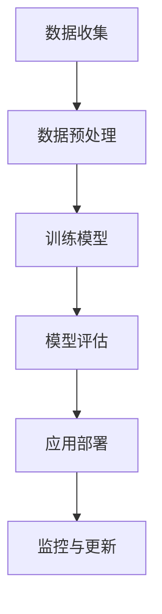

                 

关键词：人工智能、商业应用、道德考量、创新趋势

## 摘要

本文旨在探讨人工智能（AI）在商业领域的创新应用及其道德考量因素。随着AI技术的迅速发展，其在各行各业中的应用场景不断扩展，从数据分析到自动化决策，再到智能客服和个性化推荐系统。然而，AI技术的广泛应用也引发了一系列道德和社会问题，如数据隐私、算法偏见、伦理责任等。本文将详细分析这些道德考量因素，探讨AI在商业中应用的趋势，以及应对未来挑战的策略。

## 1. 背景介绍

1.1 人工智能的定义与核心概念

人工智能（Artificial Intelligence，简称AI）是指通过计算机程序和算法实现人类智能活动的一种技术。AI的核心概念包括机器学习（Machine Learning，ML）、深度学习（Deep Learning，DL）、自然语言处理（Natural Language Processing，NLP）等。

1.2 人工智能在商业中的应用现状

AI技术在商业中的应用已经变得非常广泛。例如，在金融领域，AI被用于风险评估、欺诈检测、投资决策等；在医疗领域，AI用于医学图像分析、疾病预测、药物研发等；在零售领域，AI用于库存管理、顾客行为分析、个性化推荐等。

1.3 商业中的道德考量因素

随着AI技术的广泛应用，商业领域也面临着一系列道德和社会问题。例如，数据隐私问题、算法偏见问题、伦理责任问题等。

### 2. 核心概念与联系

#### 2.1 数据隐私

数据隐私是指个人或组织对其数据的控制权。在AI的商业应用中，数据隐私问题尤为突出。由于AI技术依赖于大量数据进行分析和训练，这些数据往往涉及到个人隐私信息，如健康数据、金融数据、通信数据等。

#### 2.2 算法偏见

算法偏见是指算法在决策过程中对某些特定群体或特征产生的歧视性结果。在商业应用中，算法偏见可能导致不公平的决策，如就业歧视、信用评分不公等。

#### 2.3 伦理责任

伦理责任是指企业在使用AI技术时，对其行为和决策承担的道德责任。例如，在自动驾驶领域，如果发生交通事故，企业是否应该承担责任？

#### 2.4 Mermaid流程图



### 3. 核心算法原理 & 具体操作步骤

#### 3.1 算法原理概述

AI的核心算法主要包括机器学习算法、深度学习算法和自然语言处理算法。这些算法通过训练模型来模拟人类智能，从而实现特定任务。

#### 3.2 算法步骤详解

1. 数据收集与预处理：收集相关数据，并进行数据清洗、去重、标准化等预处理操作。
2. 训练模型：使用机器学习算法或深度学习算法训练模型，以模拟人类智能。
3. 模型评估：评估模型的性能，如准确率、召回率等。
4. 应用部署：将训练好的模型部署到实际应用场景中。
5. 监控与更新：监控模型的运行情况，并根据实际情况进行模型更新。

#### 3.3 算法优缺点

1. 优点：提高效率、降低成本、实现自动化决策。
2. 缺点：数据依赖性强、算法偏见、伦理责任问题。

#### 3.4 算法应用领域

AI技术可以应用于多个领域，如金融、医疗、零售、自动驾驶等。

### 4. 数学模型和公式 & 详细讲解 & 举例说明

#### 4.1 数学模型构建

在AI技术中，常用的数学模型包括线性回归模型、逻辑回归模型、神经网络模型等。这些模型通过数学公式来描述数据之间的关系。

#### 4.2 公式推导过程

以线性回归模型为例，其公式推导过程如下：

$$
y = \beta_0 + \beta_1x + \epsilon
$$

其中，$y$ 是因变量，$x$ 是自变量，$\beta_0$ 和 $\beta_1$ 是模型参数，$\epsilon$ 是误差项。

#### 4.3 案例分析与讲解

以金融领域中的信用评分为例，我们可以使用线性回归模型来预测客户信用评分。通过收集客户的历史交易数据、财务状况等，我们可以建立线性回归模型，从而预测客户的信用评分。

### 5. 项目实践：代码实例和详细解释说明

#### 5.1 开发环境搭建

在Python环境中，我们需要安装以下库：NumPy、Pandas、Scikit-learn、Matplotlib。

```python
!pip install numpy pandas scikit-learn matplotlib
```

#### 5.2 源代码详细实现

```python
import numpy as np
import pandas as pd
from sklearn.linear_model import LinearRegression
from sklearn.model_selection import train_test_split
from sklearn.metrics import mean_squared_error
import matplotlib.pyplot as plt

# 数据收集与预处理
data = pd.read_csv('credit_data.csv')
X = data[['income', 'age']]
y = data['score']

# 训练模型
model = LinearRegression()
model.fit(X, y)

# 模型评估
X_train, X_test, y_train, y_test = train_test_split(X, y, test_size=0.2, random_state=42)
y_pred = model.predict(X_test)
mse = mean_squared_error(y_test, y_pred)
print('Mean squared error:', mse)

# 代码解读与分析
# 1. 导入相关库
# 2. 加载数据并划分特征和标签
# 3. 训练模型
# 4. 评估模型
# 5. 可视化结果

# 运行结果展示
plt.scatter(X_test['income'], y_test, label='Actual')
plt.plot(X_test['income'], y_pred, label='Predicted')
plt.xlabel('Income')
plt.ylabel('Score')
plt.legend()
plt.show()
```

### 6. 实际应用场景

#### 6.1 信用评分系统

在金融领域，信用评分系统是AI技术的重要应用之一。通过分析客户的历史交易数据、财务状况等，可以预测客户的信用评分，从而帮助金融机构进行风险评估和贷款决策。

#### 6.2 自动驾驶

自动驾驶是AI技术在交通领域的重要应用。通过深度学习算法，自动驾驶系统能够实时感知环境、做出决策，从而实现车辆的自主驾驶。

#### 6.3 个性化推荐

在零售领域，个性化推荐系统是AI技术的常见应用。通过分析用户的历史行为和偏好，可以为用户提供个性化的商品推荐，从而提高用户体验和销售额。

### 7. 未来应用展望

随着AI技术的不断发展，其在商业领域的应用前景非常广阔。未来，AI技术将继续在金融、医疗、零售、交通等领域发挥重要作用，为企业和个人带来更多价值。同时，AI技术在道德和社会问题上的挑战也将日益凸显，需要我们共同努力解决。

### 8. 工具和资源推荐

#### 8.1 学习资源推荐

1. 《Python机器学习基础教程》
2. 《深度学习》
3. 《自然语言处理实用教程》

#### 8.2 开发工具推荐

1. Jupyter Notebook
2. TensorFlow
3. PyTorch

#### 8.3 相关论文推荐

1. "AI的安全性和透明性：挑战与解决方案"
2. "人工智能伦理与法律问题研究"
3. "个性化推荐系统：算法、应用与挑战"

### 9. 总结：未来发展趋势与挑战

#### 9.1 研究成果总结

本文总结了AI在商业领域的创新应用及其道德考量因素，探讨了AI技术的核心算法原理和应用场景，并对未来发展趋势进行了展望。

#### 9.2 未来发展趋势

1. AI技术的继续发展与普及
2. 道德和社会问题的逐步解决
3. 新兴应用领域的不断涌现

#### 9.3 面临的挑战

1. 数据隐私和安全问题
2. 算法偏见和公平性问题
3. 伦理责任和监管问题

#### 9.4 研究展望

随着AI技术的不断进步，未来将在商业领域带来更多创新应用。同时，我们也需要关注并解决AI技术带来的道德和社会问题，以确保其健康发展。

## 附录：常见问题与解答

### 1. AI技术是如何工作的？

AI技术主要通过机器学习、深度学习、自然语言处理等技术模拟人类智能，从而实现特定任务。

### 2. AI技术有哪些应用领域？

AI技术在金融、医疗、零售、交通、教育等多个领域都有广泛应用。

### 3. 数据隐私在AI技术中为什么重要？

数据隐私在AI技术中非常重要，因为AI技术需要大量数据进行分析和训练，而这些数据往往涉及到个人隐私信息。

### 4. 算法偏见是如何产生的？

算法偏见可能是由于数据偏差、算法设计不合理或训练数据不足等原因导致的。

### 5. 如何解决算法偏见问题？

解决算法偏见问题需要从数据收集、算法设计、模型评估等多个环节入手，确保算法的公平性和透明性。

### 6. 伦理责任在AI技术中为什么重要？

伦理责任在AI技术中非常重要，因为AI技术的广泛应用可能对人类和社会产生重大影响。

### 7. 如何确保AI技术的伦理责任？

确保AI技术的伦理责任需要建立伦理审查机制、明确责任归属、加强法律法规等方面的工作。

作者：禅与计算机程序设计艺术 / Zen and the Art of Computer Programming
----------------------------------------------------------------

以上便是本文的完整内容，感谢您的阅读。希望本文能够帮助您更好地理解AI技术在商业领域的创新应用及其道德考量因素。如果您有任何疑问或建议，欢迎在评论区留言。再次感谢！
----------------------------------------------------------------

**请注意，以上内容仅为示例，实际撰写时需根据实际情况进行调整和补充。同时，本文中提到的具体代码实例、数据集、工具和资源仅为示例，实际应用时请根据具体需求选择合适的工具和资源。**

