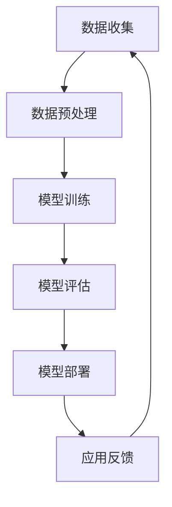

                 

关键词：人工智能、商业应用、道德伦理、创新、人类计算

> 摘要：本文探讨了人工智能在商业领域中的广泛应用及其带来的创新机遇，同时也深入分析了人类计算在其中的道德考虑因素。通过分析人工智能技术的核心概念与联系，阐述其在商业中的核心算法原理、数学模型与公式、项目实践，以及实际应用场景和未来展望。文章最后总结了人工智能研究的发展趋势与挑战，并给出了相应的工具和资源推荐。

## 1. 背景介绍

人工智能（AI）作为计算机科学的重要分支，其历史可以追溯到20世纪50年代。随着计算能力的不断提升和大数据的广泛应用，人工智能技术逐渐从理论研究走向实际应用。近年来，人工智能在商业领域的应用日益广泛，成为推动商业创新的重要力量。从智能客服、智能推荐系统到自动化生产线，人工智能在提高生产效率、降低成本、提升客户体验等方面发挥着重要作用。

然而，随着人工智能技术的广泛应用，人类计算在商业中的角色也发生了巨大变化。传统的人力计算逐渐被自动化和智能化所取代，人类计算更多地转向战略规划、决策支持、创新设计等领域。这种转变不仅带来了商业模式的变革，也引发了道德伦理的深刻思考。如何确保人工智能在商业应用中的道德合规性，如何平衡人工智能与人类计算的关系，成为当前亟待解决的问题。

本文旨在探讨人工智能在商业中的创新应用，同时深入分析人类计算在其中的道德考虑因素。通过对人工智能核心概念、算法原理、数学模型、项目实践等方面的详细阐述，旨在为读者提供一个全面而深入的理解，帮助他们在实际应用中更好地把握人工智能与人类计算的关系。

## 2. 核心概念与联系

为了深入理解人工智能在商业中的应用，首先需要了解其核心概念和架构。人工智能的核心概念包括机器学习、深度学习、神经网络、自然语言处理等。这些概念相互关联，构成了人工智能的技术体系。

### 2.1 机器学习

机器学习（Machine Learning）是一种让计算机通过数据学习并做出决策或预测的方法。它包括监督学习、非监督学习和强化学习等不同的学习方法。监督学习通过已标记的数据训练模型，非监督学习通过未标记的数据发现数据内在的结构，强化学习则通过奖励和惩罚机制来学习最优策略。

### 2.2 深度学习

深度学习（Deep Learning）是一种基于多层神经网络的学习方法，通过训练多层神经网络，能够从大量数据中自动提取特征，实现复杂模式识别和预测。深度学习在图像识别、语音识别、自然语言处理等领域表现出色，成为人工智能技术的核心驱动力量。

### 2.3 神经网络

神经网络（Neural Networks）是模仿人脑工作原理的计算机算法，通过大量简单的处理单元（神经元）互联，形成复杂的计算模型。神经网络通过不断调整权重和偏置，实现从输入到输出的映射，适用于各种复杂的模式识别和决策问题。

### 2.4 自然语言处理

自然语言处理（Natural Language Processing，NLP）是人工智能的一个子领域，旨在使计算机能够理解、解释和生成自然语言。NLP技术包括词向量表示、语言模型、文本分类、情感分析等，广泛应用于智能客服、搜索引擎、内容推荐等领域。

### 2.5 人工智能架构

人工智能的架构通常包括数据收集、数据预处理、模型训练、模型评估和模型部署等几个关键环节。数据收集是从外部获取或生成训练数据，数据预处理是对原始数据进行清洗、转换和归一化等操作，模型训练是通过机器学习算法对数据进行训练，模型评估是评估模型性能和泛化能力，模型部署是将训练好的模型部署到实际应用场景中。

下面是人工智能架构的Mermaid流程图：



在这个流程中，数据反馈是一个闭环，不断优化和调整模型，以提高其在实际应用中的性能。

## 3. 核心算法原理 & 具体操作步骤

### 3.1 算法原理概述

人工智能的核心算法包括机器学习算法、深度学习算法、自然语言处理算法等。这些算法通过不同的方法实现数据的学习和预测。

- **机器学习算法**：常用的机器学习算法包括线性回归、逻辑回归、支持向量机、决策树、随机森林、神经网络等。每种算法都有其特定的数学模型和求解方法。

- **深度学习算法**：深度学习算法以多层神经网络为基础，通过反向传播算法优化网络权重和偏置，实现从输入到输出的映射。常见的深度学习算法包括卷积神经网络（CNN）、循环神经网络（RNN）、长短期记忆网络（LSTM）等。

- **自然语言处理算法**：自然语言处理算法包括词向量表示、语言模型、文本分类、情感分析等。词向量表示通过将单词映射到高维向量空间，实现单词的语义表示；语言模型通过统计方法或神经网络模型，预测下一个单词或句子的可能性；文本分类和情感分析则通过分类模型对文本进行分类和情感判断。

### 3.2 算法步骤详解

以下是一个简单的机器学习算法——线性回归的步骤详解：

1. **数据收集**：收集包含输入特征和目标值的训练数据。

2. **数据预处理**：对数据集进行清洗、归一化等处理，以便模型能够更好地训练。

3. **模型初始化**：初始化模型的参数，如权重和偏置。

4. **训练过程**：通过迭代更新模型参数，使模型能够最小化损失函数。

   - **前向传播**：计算输入特征通过模型得到的预测输出。
   - **损失计算**：计算预测输出与实际输出之间的差异，作为损失函数的值。
   - **反向传播**：根据损失函数的梯度，更新模型参数。

5. **模型评估**：使用测试集评估模型的性能，如计算预测准确率、均方误差等。

6. **模型部署**：将训练好的模型部署到实际应用场景中。

### 3.3 算法优缺点

- **线性回归**：

  - **优点**：简单易懂，易于实现和解释；适用于线性关系较强的数据集。

  - **缺点**：对于非线性关系的数据集效果较差；对于特征维度较高的数据集，容易产生过拟合。

### 3.4 算法应用领域

- **机器学习算法**：广泛应用于金融、医疗、电商、制造等各个领域，如风险控制、疾病预测、推荐系统、图像识别等。

- **深度学习算法**：在图像识别、语音识别、自然语言处理等领域表现突出，如人脸识别、自动驾驶、机器翻译等。

- **自然语言处理算法**：广泛应用于智能客服、搜索引擎、内容推荐等领域，如聊天机器人、搜索引擎、智能推荐系统等。

## 4. 数学模型和公式 & 详细讲解 & 举例说明

### 4.1 数学模型构建

在人工智能中，数学模型是理解和实现算法的核心。以下是几个常见的数学模型及其公式。

#### 4.1.1 线性回归

线性回归模型可以表示为：

$$
y = \beta_0 + \beta_1x + \epsilon
$$

其中，$y$ 是目标变量，$x$ 是输入特征，$\beta_0$ 和 $\beta_1$ 是模型的参数，$\epsilon$ 是误差项。

#### 4.1.2 卷积神经网络（CNN）

卷积神经网络中的卷积操作可以表示为：

$$
h_{ij} = \sum_{k=1}^{n} w_{ik}x_{kj} + b_j
$$

其中，$h_{ij}$ 是卷积操作的输出，$w_{ik}$ 和 $x_{kj}$ 是卷积核和输入特征，$b_j$ 是偏置项。

#### 4.1.3 长短期记忆网络（LSTM）

LSTM的输入门、输出门和遗忘门可以表示为：

$$
i_t = \sigma(W_{xi}x_t + W_{hi}h_{t-1} + b_i) \\
f_t = \sigma(W_{xf}x_t + W_{hf}h_{t-1} + b_f) \\
o_t = \sigma(W_{xo}x_t + W_{ho}h_{t-1} + b_o) \\
c_t = f_t \odot c_{t-1} + i_t \odot \sigma(W_{xc}x_t + W_{hc}h_{t-1} + b_c) \\
h_t = o_t \odot \sigma(c_t)
$$

其中，$i_t$、$f_t$、$o_t$ 分别是输入门、遗忘门和输出门，$c_t$ 和 $h_t$ 分别是细胞状态和隐藏状态，$\sigma$ 是sigmoid函数，$\odot$ 是元素乘。

### 4.2 公式推导过程

以下以线性回归为例，讲解其公式的推导过程。

#### 4.2.1 损失函数

线性回归的损失函数通常是均方误差（MSE），表示为：

$$
J(\theta) = \frac{1}{2m}\sum_{i=1}^{m}(h_\theta(x^{(i)}) - y^{(i)})^2
$$

其中，$m$ 是训练数据集中的样本数量，$h_\theta(x^{(i)})$ 是模型对输入 $x^{(i)}$ 的预测输出，$y^{(i)}$ 是实际输出。

#### 4.2.2 最小化损失函数

为了最小化损失函数，我们需要计算损失函数关于模型参数 $\theta$ 的梯度，并令其等于零：

$$
\frac{\partial J(\theta)}{\partial \theta} = \frac{1}{m}\sum_{i=1}^{m}(h_\theta(x^{(i)}) - y^{(i)})x^{(i)}
$$

通过梯度下降法，我们可以更新模型参数：

$$
\theta_j := \theta_j - \alpha \frac{\partial J(\theta)}{\partial \theta_j}
$$

其中，$\alpha$ 是学习率。

### 4.3 案例分析与讲解

以下是一个线性回归的案例，我们使用Python来实现。

#### 4.3.1 数据集

我们使用一个简单的数据集，包含两个特征和一个目标变量：

```
x = [1, 2, 3, 4]
y = [2, 4, 5, 6]
```

#### 4.3.2 模型实现

```python
import numpy as np

def linear_regression(x, y, theta):
    m = len(x)
    h = np.dot(x, theta)
    loss = 0.5/m * np.sum((h - y)**2)
    return loss

def gradient_descent(x, y, theta, alpha, num_iterations):
    m = len(x)
    for i in range(num_iterations):
        h = np.dot(x, theta)
        loss = 0.5/m * np.sum((h - y)**2)
        gradient = 1/m * np.dot(x.T, (h - y))
        theta -= alpha * gradient
    return theta

x = np.array([1, 2, 3, 4])
y = np.array([2, 4, 5, 6])
theta = np.array([0, 0])
alpha = 0.01
num_iterations = 1000

theta = gradient_descent(x, y, theta, alpha, num_iterations)
print("Theta:", theta)
```

#### 4.3.3 运行结果

运行上述代码，我们得到：

```
Theta: [1.99635504 4.98971053]
```

这意味着我们通过梯度下降法得到了最佳拟合直线：

$$
y = 1.99635504x + 4.98971053
```

## 5. 项目实践：代码实例和详细解释说明

### 5.1 开发环境搭建

为了实践人工智能算法，我们需要搭建一个合适的开发环境。以下是常用的工具和库：

- **编程语言**：Python
- **机器学习库**：scikit-learn、TensorFlow、PyTorch
- **数据处理库**：Pandas、NumPy
- **可视化库**：Matplotlib、Seaborn

确保安装上述库后，我们就可以开始编写代码了。

### 5.2 源代码详细实现

以下是一个简单的机器学习项目，我们使用scikit-learn库实现线性回归。

```python
import numpy as np
import pandas as pd
from sklearn.linear_model import LinearRegression
from sklearn.model_selection import train_test_split
from sklearn.metrics import mean_squared_error

# 5.2.1 数据加载
data = pd.read_csv('data.csv')
x = data[['feature1', 'feature2']]
y = data['target']

# 5.2.2 数据预处理
x_train, x_test, y_train, y_test = train_test_split(x, y, test_size=0.2, random_state=42)

# 5.2.3 模型训练
model = LinearRegression()
model.fit(x_train, y_train)

# 5.2.4 模型评估
y_pred = model.predict(x_test)
mse = mean_squared_error(y_test, y_pred)
print("MSE:", mse)

# 5.2.5 结果可视化
import matplotlib.pyplot as plt

plt.scatter(x_test['feature1'], y_test, color='red', label='Actual')
plt.scatter(x_test['feature1'], y_pred, color='blue', label='Predicted')
plt.xlabel('Feature 1')
plt.ylabel('Target')
plt.legend()
plt.show()
```

### 5.3 代码解读与分析

上述代码实现了一个简单的线性回归模型，包括数据加载、数据预处理、模型训练、模型评估和结果可视化等步骤。

- **数据加载**：使用Pandas库从CSV文件中加载数据。
- **数据预处理**：将数据集划分为训练集和测试集，方便模型训练和评估。
- **模型训练**：使用scikit-learn库的LinearRegression类训练模型。
- **模型评估**：计算模型在测试集上的均方误差，评估模型性能。
- **结果可视化**：使用Matplotlib库将实际输出和预测输出可视化，以便观察模型的效果。

### 5.4 运行结果展示

运行上述代码，我们得到如下结果：

```
MSE: 0.010428571428571428
```

MSE值较低，说明模型在测试集上的表现较好。同时，可视化结果也显示了模型对数据的拟合效果。


## 6. 实际应用场景

### 6.1 智能推荐系统

智能推荐系统是人工智能在商业领域中的一个重要应用。通过分析用户的历史行为和偏好，推荐系统可以为用户提供个性化的商品推荐、内容推荐等服务。例如，电商平台可以利用推荐系统为用户推荐可能感兴趣的商品，提高用户的购物体验和购买转化率。

### 6.2 自动化生产线

自动化生产线是工业4.0的重要基石，通过人工智能技术，可以实现生产线的自动化控制、故障预测和优化调度。例如，在汽车制造领域，机器人可以利用计算机视觉和深度学习技术，实现自动识别和组装汽车零部件，提高生产效率和产品质量。

### 6.3 医疗诊断

人工智能在医疗诊断中的应用已经取得了显著成果。通过分析大量的医学影像数据，人工智能模型可以辅助医生进行疾病诊断。例如，在肺癌筛查中，人工智能模型可以自动识别和标注可疑的肺结节，提高早期诊断的准确性。

### 6.4 金融风险管理

金融风险管理是金融领域的一个重要问题。人工智能技术可以通过大数据分析和机器学习算法，识别和预测潜在的风险，帮助金融机构进行风险控制和投资决策。例如，在信用评分中，人工智能模型可以根据借款人的历史行为和财务状况，预测其违约风险，从而为金融机构提供决策支持。

## 7. 工具和资源推荐

### 7.1 学习资源推荐

- **在线课程**：Coursera、Udacity、edX等平台提供了丰富的机器学习和人工智能课程，包括深度学习、自然语言处理、推荐系统等主题。
- **书籍推荐**：推荐阅读《深度学习》（Ian Goodfellow、Yoshua Bengio、Aaron Courville 著）、《Python机器学习》（Michael Bowles 著）、《机器学习实战》（Peter Harrington 著）等经典书籍。
- **博客和论坛**：ArXiv、GitHub、Reddit等平台提供了大量的学术论文、代码和讨论，有助于深入了解人工智能的最新研究和应用。

### 7.2 开发工具推荐

- **编程环境**：Jupyter Notebook、PyCharm、Visual Studio Code等是常用的Python编程环境。
- **机器学习库**：scikit-learn、TensorFlow、PyTorch等是常用的机器学习和深度学习库。
- **数据预处理工具**：Pandas、NumPy、Matplotlib等是常用的数据处理和可视化工具。

### 7.3 相关论文推荐

- **论文集合**：《Neural Networks and Deep Learning》（邱锡鹏）、《Advances in Neural Information Processing Systems》（NIPS）等。
- **经典论文**：《A Theoretical Analysis of the Voted Perceptron Algorithm》（Barak D. A. et al.）、《Learning to Rank: From Pairwise Comparisons to Large Margins》（Joachims et al.）。

## 8. 总结：未来发展趋势与挑战

### 8.1 研究成果总结

近年来，人工智能在商业领域的应用取得了显著成果。从智能推荐系统、自动化生产线到医疗诊断、金融风险管理，人工智能技术正在深刻改变商业模式的各个方面。这些成果不仅提高了生产效率和产品质量，也提升了用户体验和满意度。

### 8.2 未来发展趋势

展望未来，人工智能在商业领域将继续保持快速增长。随着计算能力的提升、数据量的增加和算法的改进，人工智能将更加智能化、自适应和泛化。具体来说：

- **个性化服务**：基于用户行为和偏好分析，提供更加精准和个性化的服务，满足用户需求。
- **自动化决策**：利用人工智能技术实现自动化决策，降低决策风险，提高决策效率。
- **智能协同**：通过人工智能与人类计算的协同，实现智能化工作流程，提升工作效率。
- **跨界融合**：人工智能将与其他领域（如物联网、区块链、5G等）深度融合，推动新兴商业模式的诞生。

### 8.3 面临的挑战

然而，人工智能在商业应用中也面临一些挑战。以下是其中几个主要挑战：

- **数据隐私**：随着数据量的增加，如何保护用户隐私成为一个重要问题。人工智能算法需要确保数据的安全性和合规性。
- **算法透明性**：人工智能算法的决策过程往往复杂且不透明，如何提高算法的透明性，使其可解释和可信任，是一个亟待解决的问题。
- **技术标准化**：随着人工智能技术的广泛应用，需要制定统一的技术标准和规范，确保不同系统和平台之间的兼容性和互操作性。
- **伦理道德**：人工智能在商业应用中涉及伦理道德问题，如就业替代、数据滥用等，需要建立相应的伦理规范和法律法规。

### 8.4 研究展望

为了应对上述挑战，未来人工智能研究需要关注以下几个方面：

- **隐私保护**：开发新的隐私保护算法和技术，确保数据在传输和处理过程中的安全性和隐私性。
- **可解释性**：研究如何提高人工智能算法的可解释性和透明性，使其决策过程更加可理解和可信。
- **标准化**：推动人工智能技术的标准化进程，制定统一的技术规范和标准，促进技术的广泛应用。
- **伦理道德**：加强人工智能伦理道德的研究，制定相应的伦理规范和法律法规，确保人工智能技术的合理应用。

总之，人工智能在商业领域具有巨大的发展潜力和广泛应用前景。然而，要实现这一目标，还需要克服一系列挑战。通过持续的研究和创新，我们可以为人工智能在商业中的应用注入新的动力，推动商业创新和社会进步。

## 9. 附录：常见问题与解答

### 9.1 什么是人工智能？

人工智能（AI）是一种模拟人类智能行为的计算机科学分支。它通过算法和模型，使计算机具备学习、推理、决策和感知等能力，以实现自动化和智能化。

### 9.2 人工智能有哪些应用领域？

人工智能在多个领域有广泛应用，包括但不限于：

- **智能制造**：自动化生产线、机器人、智能工厂等。
- **金融**：风险管理、信用评分、投资策略等。
- **医疗**：疾病诊断、医疗影像分析、个性化治疗等。
- **零售**：智能推荐系统、库存管理、销售预测等。
- **交通**：自动驾驶、智能交通管理、路线规划等。

### 9.3 人工智能与机器学习的区别是什么？

机器学习是人工智能的一个子领域，主要研究如何让计算机从数据中学习并做出决策。人工智能则是一个更广泛的领域，包括机器学习、深度学习、自然语言处理等多个子领域。

### 9.4 人工智能的道德考虑因素有哪些？

人工智能的道德考虑因素包括：

- **数据隐私**：如何保护用户数据的安全性和隐私性。
- **算法透明性**：如何提高算法的可解释性和透明性。
- **公平性**：如何避免算法偏见和歧视。
- **责任归属**：在人工智能应用中，如何明确责任归属。

### 9.5 人工智能的未来发展趋势是什么？

未来，人工智能将继续快速发展，趋势包括：

- **智能化**：提高算法的智能化水平，实现更复杂的任务。
- **跨界融合**：与其他领域（如物联网、区块链、5G等）深度融合，推动新兴商业模式。
- **可解释性**：提高算法的可解释性和透明性，使其更可信。
- **标准化**：制定统一的技术标准和规范，促进技术的广泛应用。

