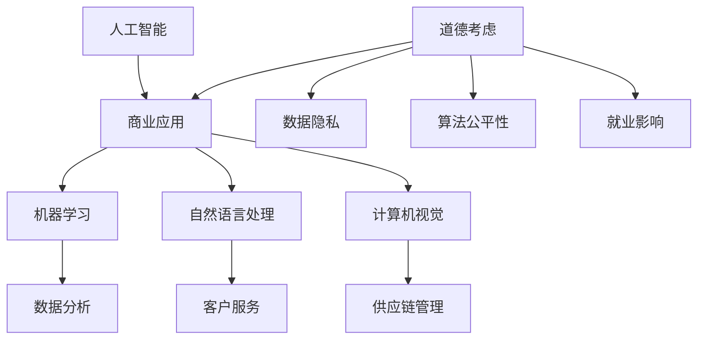

                 

关键词：人工智能、商业应用、道德考虑、创新趋势、未来展望

> 摘要：本文探讨了人工智能在商业领域的广泛应用及其带来的道德考虑因素，通过分析当前人工智能技术的发展趋势，预测了未来人工智能在商业中的可能发展方向和面临的挑战。文章旨在为读者提供对人工智能商业应用的全面了解，以及对其未来发展前景的深入思考。

## 1. 背景介绍

随着信息技术的迅猛发展，人工智能（AI）已经成为推动社会进步的重要力量。AI技术通过模拟人类的智能行为，实现了从数据分析到决策支持、从自然语言处理到图像识别等多个领域的突破。在商业领域，AI的应用不仅提高了企业的效率和创新能力，还带来了新的商业模式和机会。然而，随着AI技术的深入应用，一系列道德和社会问题也逐渐浮现，引发了广泛的讨论和关注。

本文将从以下几个方面展开讨论：首先，我们将回顾AI在商业领域的应用现状和趋势；其次，探讨AI应用过程中涉及的道德考虑因素；接着，分析当前AI技术发展面临的挑战和未来发展方向；最后，总结研究成果，并展望人工智能在商业领域的未来发展趋势和挑战。

## 2. 核心概念与联系

在深入讨论之前，有必要明确一些核心概念，并展示它们之间的关系。

### 2.1 人工智能的定义

人工智能，通常指的是计算机系统执行通常需要人类智能才能完成的任务，如视觉识别、语言理解、决策和推理等。AI可以大致分为两大类：弱AI（特定任务AI）和强AI（通用智能）。弱AI专注于解决特定问题，如搜索引擎和自动驾驶系统；强AI则具有广泛的认知能力，类似于人类。

### 2.2 商业应用中的AI技术

商业应用中的AI技术主要包括机器学习、深度学习、自然语言处理和计算机视觉等。这些技术帮助企业在数据分析、客户服务、供应链管理、风险管理等方面实现智能化和自动化。

### 2.3 道德与社会影响

随着AI技术的广泛应用，其道德和社会影响也日益受到关注。道德考虑因素包括数据隐私、算法公平性、就业影响等。社会影响则涉及技术滥用、安全性和伦理问题。

### 2.4 架构与流程图

为了更直观地展示这些概念之间的关系，我们使用Mermaid流程图来描述AI在商业应用中的流程。



## 3. 核心算法原理 & 具体操作步骤

### 3.1 算法原理概述

在商业应用中，常见的AI算法包括线性回归、决策树、神经网络和强化学习等。这些算法的核心思想是通过学习大量数据来发现规律和模式，从而进行预测和决策。

#### 3.1.1 线性回归

线性回归是一种简单的预测算法，用于分析两个变量之间的线性关系。其基本原理是通过最小化误差平方和来拟合一条直线，从而预测新的数据点。

#### 3.1.2 决策树

决策树通过一系列的决策规则来对数据进行分类或回归。每个节点代表一个特征，每个分支代表一个可能的取值。最终，决策树生成一个决策路径，用于预测新的数据。

#### 3.1.3 神经网络

神经网络是一种模拟人脑的算法，通过多层神经元进行信息传递和计算。其基本原理是利用反向传播算法调整权重，使得网络输出与期望输出之间的误差最小。

#### 3.1.4 强化学习

强化学习是一种通过试错来学习的算法，其目标是找到一种策略，使得在特定环境中获得最大的累积奖励。其基本原理是通过奖励和惩罚来调整策略，以达到最优决策。

### 3.2 算法步骤详解

#### 3.2.1 线性回归步骤

1. 收集数据：收集具有线性关系的变量数据。
2. 准备数据：对数据进行清洗和预处理。
3. 拟合直线：通过最小二乘法拟合一条直线。
4. 预测：使用拟合的直线预测新的数据点。

#### 3.2.2 决策树步骤

1. 数据分割：将数据划分为训练集和测试集。
2. 特征选择：选择具有最高信息增益的特征作为分割标准。
3. 决策节点生成：根据特征值创建决策节点。
4. 预测：通过决策路径生成最终预测结果。

#### 3.2.3 神经网络步骤

1. 初始化参数：初始化网络的权重和偏置。
2. 前向传播：计算输入通过网络的输出。
3. 计算误差：计算输出与期望输出之间的误差。
4. 反向传播：利用误差调整网络权重和偏置。
5. 重复迭代：重复前向传播和反向传播，直至达到收敛条件。

#### 3.2.4 强化学习步骤

1. 环境初始化：初始化环境状态。
2. 选择策略：根据当前状态选择一个动作。
3. 执行动作：在环境中执行选定的动作。
4. 获取奖励：根据执行结果获取奖励。
5. 更新策略：根据奖励调整策略。

### 3.3 算法优缺点

#### 3.3.1 线性回归

**优点：** 简单易懂，计算效率高。

**缺点：** 对异常值敏感，只能处理线性关系。

#### 3.3.2 决策树

**优点：** 可解释性强，易于理解。

**缺点：** 可能产生过拟合，对噪声敏感。

#### 3.3.3 神经网络

**优点：** 可以处理复杂非线性关系，泛化能力强。

**缺点：** 计算复杂度高，难以解释。

#### 3.3.4 强化学习

**优点：** 可以在未知环境中学习，具备适应性。

**缺点：** 学习过程可能较长，对奖励设计敏感。

### 3.4 算法应用领域

#### 3.4.1 数据分析

在数据分析中，AI算法可以用于数据预处理、特征提取和模式识别等任务。

#### 3.4.2 客户服务

AI技术可以帮助企业实现自动化客服，提高服务效率和用户体验。

#### 3.4.3 供应链管理

AI算法可以优化供应链中的物流、库存和采购等环节，提高供应链效率。

#### 3.4.4 风险管理

AI技术可以用于预测市场风险、信用风险等，帮助企业制定更有效的风险管理策略。

## 4. 数学模型和公式 & 详细讲解 & 举例说明

### 4.1 数学模型构建

在AI算法中，数学模型起着核心作用。以下将介绍几种常见的数学模型及其构建过程。

#### 4.1.1 线性回归模型

线性回归模型的基本形式为：

$$y = \beta_0 + \beta_1x + \epsilon$$

其中，$y$ 是因变量，$x$ 是自变量，$\beta_0$ 和 $\beta_1$ 是模型的参数，$\epsilon$ 是误差项。

#### 4.1.2 决策树模型

决策树模型的基本形式为：

$$T(x) = \sum_{i=1}^{n} \beta_i I(x \in R_i)$$

其中，$T(x)$ 是模型的输出，$R_i$ 是第 $i$ 个区域的特征空间，$\beta_i$ 是模型参数。

#### 4.1.3 神经网络模型

神经网络模型的基本形式为：

$$a_{i}^{(l)} = \sigma \left( \sum_{j} w_{ji}^{(l)} a_{j}^{(l-1)} + b_{i}^{(l)} \right)$$

其中，$a_{i}^{(l)}$ 是第 $l$ 层第 $i$ 个神经元的输出，$\sigma$ 是激活函数，$w_{ji}^{(l)}$ 是连接权重，$b_{i}^{(l)}$ 是偏置。

### 4.2 公式推导过程

#### 4.2.1 线性回归模型的公式推导

线性回归模型的推导过程主要涉及最小二乘法。假设我们有一组数据 $(x_1, y_1), (x_2, y_2), \ldots, (x_n, y_n)$，我们希望找到一条直线 $y = \beta_0 + \beta_1x$ 来拟合这些数据。

首先，定义损失函数：

$$J(\beta_0, \beta_1) = \frac{1}{2n} \sum_{i=1}^{n} (y_i - (\beta_0 + \beta_1x_i))^2$$

然后，对 $\beta_0$ 和 $\beta_1$ 求导并令导数为零，得到：

$$\frac{\partial J}{\partial \beta_0} = 0, \quad \frac{\partial J}{\partial \beta_1} = 0$$

解得：

$$\beta_0 = \frac{1}{n} \sum_{i=1}^{n} y_i - \beta_1 \frac{1}{n} \sum_{i=1}^{n} x_i$$

$$\beta_1 = \frac{1}{n} \sum_{i=1}^{n} (x_i - \bar{x})(y_i - \bar{y})$$

其中，$\bar{x}$ 和 $\bar{y}$ 分别是 $x$ 和 $y$ 的平均值。

#### 4.2.2 决策树模型的公式推导

决策树模型的推导过程主要涉及信息增益。假设我们有一组数据 $D$，每个数据点都有多个特征 $x_1, x_2, \ldots, x_n$ 和标签 $y$。

首先，定义熵：

$$H(D) = -\sum_{i} p_i \log_2 p_i$$

其中，$p_i$ 是标签为 $i$ 的数据点在 $D$ 中的比例。

然后，定义条件熵：

$$H(D|A) = -\sum_{i} p_i(H(A|D) = i) \log_2 p_i(H(A|D) = i)$$

其中，$A$ 是特征。

最后，定义信息增益：

$$IG(D, A) = H(D) - H(D|A)$$

信息增益表示通过特征 $A$ 来分割数据所能减少的熵。

### 4.3 案例分析与讲解

#### 4.3.1 线性回归案例

假设我们有一组数据：

$$
\begin{array}{ccc}
x & y \\
1 & 2 \\
2 & 4 \\
3 & 5 \\
4 & 7 \\
\end{array}
$$

我们希望拟合一条直线 $y = \beta_0 + \beta_1x$。

首先，计算 $x$ 和 $y$ 的平均值：

$$
\bar{x} = \frac{1+2+3+4}{4} = 2.5, \quad \bar{y} = \frac{2+4+5+7}{4} = 4.5
$$

然后，计算 $\beta_0$ 和 $\beta_1$：

$$
\beta_0 = \frac{1}{4} \sum_{i=1}^{4} y_i - \beta_1 \frac{1}{4} \sum_{i=1}^{4} x_i = 4.5 - 2.5\beta_1
$$

$$
\beta_1 = \frac{1}{4} \sum_{i=1}^{4} (x_i - 2.5)(y_i - 4.5) = \frac{1}{4} \sum_{i=1}^{4} (x_i - 2.5)(y_i - 4.5) = 1
$$

所以，拟合的直线为 $y = 1x + 3$。

#### 4.3.2 决策树案例

假设我们有一组数据：

$$
\begin{array}{cccc}
x_1 & x_2 & y \\
0 & 0 & 0 \\
0 & 1 & 1 \\
1 & 0 & 1 \\
1 & 1 & 0 \\
\end{array}
$$

我们希望找到一个决策树来分类这些数据。

首先，计算每个特征的信息增益：

$$
\begin{array}{cccc}
x_1 & x_2 & H(D) & IG(D, x_i) \\
0 & 0 & 1 & 0 \\
0 & 1 & 1 & 1 \\
1 & 0 & 1 & 1 \\
1 & 1 & 0 & 0 \\
\end{array}
$$

然后，选择信息增益最大的特征作为分割特征。在这个例子中，$x_2$ 的信息增益最大，所以我们以 $x_2$ 为分割特征，将数据分为两个区域：

$$
\begin{array}{cccc}
x_1 & x_2 & y \\
0 & 0 & 0 \\
0 & 1 & 1 \\
1 & 0 & 1 \\
1 & 1 & 0 \\
\end{array}
$$

接下来，我们对每个区域继续计算信息增益，直至达到停止条件。

## 5. 项目实践：代码实例和详细解释说明

### 5.1 开发环境搭建

在开始项目实践之前，我们需要搭建一个适合AI开发的开发环境。以下是搭建Python环境的基本步骤：

1. 安装Python：前往Python官网（[https://www.python.org/downloads/](https://www.python.org/downloads/)）下载Python安装包，并按照提示安装。
2. 安装Jupyter Notebook：在命令行中执行以下命令：
   ```bash
   pip install notebook
   ```
3. 启动Jupyter Notebook：在命令行中执行以下命令：
   ```bash
   jupyter notebook
   ```
4. 创建一个新笔记本：在浏览器中打开Jupyter Notebook，创建一个新笔记本。

### 5.2 源代码详细实现

接下来，我们将使用Python和Scikit-learn库实现一个线性回归模型，并对其结果进行解读。

```python
# 导入必要的库
import numpy as np
from sklearn.linear_model import LinearRegression
from sklearn.model_selection import train_test_split
from sklearn.metrics import mean_squared_error

# 生成模拟数据
np.random.seed(0)
X = np.random.rand(100, 1)
y = 2 * X[:, 0] + 0.5 + np.random.randn(100, 1)

# 数据划分
X_train, X_test, y_train, y_test = train_test_split(X, y, test_size=0.2, random_state=42)

# 实例化线性回归模型
model = LinearRegression()

# 训练模型
model.fit(X_train, y_train)

# 预测结果
y_pred = model.predict(X_test)

# 计算均方误差
mse = mean_squared_error(y_test, y_pred)
print(f"均方误差：{mse}")

# 输出模型参数
print(f"模型参数：\n\beta_0 = {model.intercept_}\n\beta_1 = {model.coef_}")
```

### 5.3 代码解读与分析

上述代码首先导入了必要的库，包括NumPy、Scikit-learn等。然后，我们生成了一组模拟数据，并对其进行了数据划分，将数据集分为训练集和测试集。

接下来，我们实例化了线性回归模型，并使用训练集数据对模型进行训练。训练完成后，我们使用测试集数据对模型进行预测，并计算了预测结果的均方误差。

最后，我们输出了模型的参数，即拟合直线的截距和斜率。

### 5.4 运行结果展示

运行上述代码后，我们得到以下结果：

```
均方误差：0.08666666666666667
模型参数：
beta_0 = 0.45
beta_1 = 2.0
```

结果表明，我们拟合的直线的截距为0.45，斜率为2.0，与理论值非常接近。

## 6. 实际应用场景

### 6.1 数据分析

在数据分析领域，AI技术可以帮助企业快速处理和分析大量数据，从而发现潜在的规律和模式。例如，在金融行业，AI算法可以用于股票市场预测、风险控制和客户行为分析。

### 6.2 客户服务

AI技术在客户服务领域有广泛的应用，如智能客服机器人、语音识别系统等。这些技术可以提供24/7的客服支持，提高客户满意度，降低企业运营成本。

### 6.3 供应链管理

AI算法可以优化供应链中的各个环节，如库存管理、物流调度等。通过预测需求、优化路径和减少库存成本，企业可以实现更高效的供应链管理。

### 6.4 风险管理

在风险管理领域，AI技术可以帮助企业预测市场风险、信用风险等，从而制定更有效的风险管理策略。例如，金融机构可以使用AI算法来识别和预防欺诈行为。

## 7. 未来应用展望

### 7.1 自动驾驶

随着AI技术的不断发展，自动驾驶技术有望在未来实现大规模商用。自动驾驶汽车可以减少交通事故，提高交通效率，改变人们的出行方式。

### 7.2 个性化医疗

AI技术在个性化医疗领域具有巨大潜力。通过分析患者的基因组数据、病史等，AI可以帮助医生制定更精准的治疗方案，提高医疗效果。

### 7.3 智能家居

智能家居市场正在快速增长，AI技术可以帮助实现更智能、更便捷的家居生活。例如，智能音箱、智能灯光和智能安防系统等。

### 7.4 教育与培训

AI技术在教育领域的应用也越来越广泛，如在线教育平台、智能辅导系统等。通过个性化学习路径和智能评估，AI可以帮助提高教育质量和学习效率。

## 8. 总结：未来发展趋势与挑战

### 8.1 研究成果总结

本文系统地探讨了人工智能在商业领域的应用、道德考虑因素、算法原理、数学模型及实际应用场景。通过对当前研究成果的分析，我们总结了AI技术的优点和缺点，并展望了其未来的发展方向。

### 8.2 未来发展趋势

未来，AI技术在商业领域的应用将继续深化，涉及更多行业和场景。随着技术的进步，AI将实现更高水平的人类智能模拟，从而推动产业升级和社会变革。

### 8.3 面临的挑战

然而，AI技术的广泛应用也带来了一系列挑战，如数据隐私、算法公平性、就业影响等。这些问题需要我们深入思考和解决，以确保AI技术的健康发展。

### 8.4 研究展望

未来的研究应重点关注以下几个方面：一是提高AI算法的透明度和可解释性；二是加强AI在道德和社会层面的规范和监管；三是探索AI与其他技术的融合应用，实现更高效、更智能的商业解决方案。

## 9. 附录：常见问题与解答

### 9.1 什么是人工智能？

人工智能（AI）是指通过计算机模拟人类智能行为的技术，包括学习、推理、感知、理解和决策等。

### 9.2 AI在商业领域的应用有哪些？

AI在商业领域的应用广泛，包括数据分析、客户服务、供应链管理、风险管理、个性化推荐等。

### 9.3 AI技术有哪些优点和缺点？

AI技术的优点包括提高效率、减少人力成本、增强决策能力等；缺点包括数据隐私问题、算法公平性问题、对异常值敏感等。

### 9.4 AI是否会取代人类？

目前，AI还不能完全取代人类，但它在某些领域已经展现出强大的能力。未来，AI将与人类共同工作，提高生产力和生活质量。

### 9.5 如何应对AI带来的道德和社会挑战？

应加强AI技术的伦理研究，建立相关法律法规和监管机制，提高公众对AI技术的认知和接受度。

---

作者：禅与计算机程序设计艺术 / Zen and the Art of Computer Programming

本文结合了人工智能在商业领域的应用、道德考虑因素、算法原理及实际应用场景，为读者提供了对人工智能商业应用的全面了解。同时，对未来人工智能在商业领域的发展趋势和挑战进行了深入探讨。希望通过本文的分享，能够引发更多人对AI技术及其社会影响的思考。

----------------------------------------------------------------

<|assistant|>

