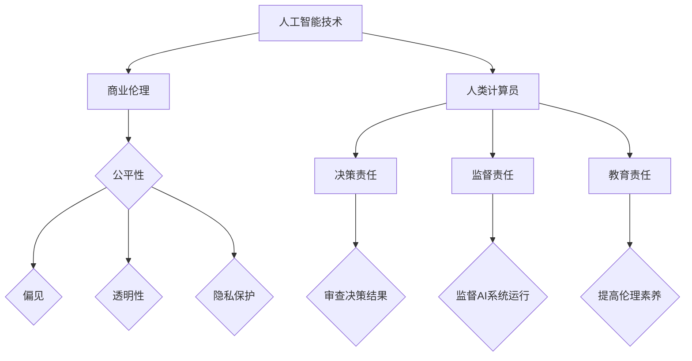

                 

关键词：人工智能，商业道德，计算伦理，伦理决策，道德框架，技术伦理

> 摘要：本文探讨了人工智能（AI）在商业领域中的应用及其引发的伦理问题。通过分析人类计算与AI结合的道德考虑因素，本文提出了一种基于道德框架的解决方案，旨在确保AI在商业应用中的伦理合规性。

## 1. 背景介绍

近年来，人工智能技术在商业领域的应用日益广泛，从自动化决策、个性化推荐到智能客服，AI正在重塑各个行业的商业模式。然而，随着AI技术的不断进步，其在商业应用中引发的伦理问题也日益突出。如何确保AI系统的公正性、透明度和道德合规性，成为了业界关注的焦点。人类计算在AI系统中扮演着关键角色，但同时也面临道德责任和伦理挑战。

## 2. 核心概念与联系

### 2.1 人工智能与商业伦理

人工智能与商业伦理之间的联系体现在以下几个方面：

1. **公平性与偏见**：AI系统在决策过程中可能会引入偏见，导致不公平的结果。这需要从算法设计、数据收集和处理等多个环节进行伦理审查。
2. **透明性与可解释性**：商业AI系统通常涉及复杂的算法和数据处理过程，如何确保其透明性和可解释性，以便用户和监管机构能够理解和审查，是关键伦理问题。
3. **隐私保护**：AI技术对个人数据的依赖性引发了隐私问题。如何在数据收集、存储和使用过程中保护个人隐私，是商业伦理的重要组成部分。

### 2.2 人类计算与道德责任

在AI系统中，人类计算员不仅需要开发和维护AI系统，还需要在操作过程中承担道德责任。这些责任包括：

1. **决策责任**：人类计算员需要对AI系统的决策结果进行审查和验证，确保其符合道德和伦理标准。
2. **监督责任**：人类计算员需要对AI系统的运行进行监督，及时发现和纠正潜在的伦理问题。
3. **教育责任**：人类计算员需要通过培训和指导，提高AI系统的使用者在伦理方面的素养。

### 2.3 道德框架在商业中的应用

为了确保AI在商业应用中的伦理合规性，需要建立一种道德框架，以指导人类计算员在AI系统开发和操作过程中的行为。这种道德框架应包括以下几个方面：

1. **基本原则**：如尊重个人隐私、公平对待所有用户、避免偏见等。
2. **伦理决策模型**：一种用于指导人类计算员在AI系统中做出伦理决策的模型，包括评估、分析和执行步骤。
3. **监督机制**：确保道德框架得到有效实施和监督的机制。

## 3. 核心算法原理 & 具体操作步骤

### 3.1 算法原理概述

本文提出的算法原理主要基于以下几个方面：

1. **伦理原则**：从基本原则出发，构建一个道德框架。
2. **数据分析和建模**：通过数据分析和建模，识别和评估AI系统中的伦理问题。
3. **决策支持**：提供一套决策支持工具，帮助人类计算员在操作过程中做出符合伦理标准的决策。

### 3.2 算法步骤详解

1. **数据收集和预处理**：收集与AI系统相关的数据，并进行预处理，以确保数据的质量和一致性。
2. **伦理风险评估**：通过分析数据，识别AI系统中可能存在的伦理问题，并进行风险评估。
3. **伦理决策支持**：根据伦理风险评估结果，为人类计算员提供决策支持，包括伦理原则、案例研究和决策工具。
4. **执行和监督**：执行伦理决策，并持续监督AI系统的运行，确保其符合伦理标准。

### 3.3 算法优缺点

**优点**：

1. **全面性**：算法考虑了AI系统中的各种伦理问题，提供了全面的解决方案。
2. **灵活性**：算法可以根据不同的商业场景进行调整，以适应特定的伦理需求。

**缺点**：

1. **复杂性**：算法涉及多个环节和步骤，实施过程可能较为复杂。
2. **数据依赖**：算法的有效性依赖于数据的准确性和完整性。

### 3.4 算法应用领域

算法主要应用于以下几个领域：

1. **自动化决策系统**：如金融、保险、医疗等领域的决策支持系统。
2. **个性化推荐系统**：如电子商务、社交媒体等领域的个性化推荐系统。
3. **智能客服系统**：如客服机器人、智能客服系统等。

## 4. 数学模型和公式 & 详细讲解 & 举例说明

### 4.1 数学模型构建

本文采用的数学模型主要包括以下几个方面：

1. **伦理风险评估模型**：用于评估AI系统中潜在的伦理问题。
2. **决策支持模型**：用于提供决策支持，帮助人类计算员做出伦理决策。

### 4.2 公式推导过程

本文采用的数学公式主要包括以下几个方面：

1. **伦理风险评估公式**：用于计算AI系统中潜在的伦理风险。
2. **决策支持公式**：用于提供决策支持，帮助人类计算员做出伦理决策。

### 4.3 案例分析与讲解

本文将通过以下几个案例，分析AI系统中的伦理问题，并讲解如何利用数学模型和公式进行解决：

1. **金融领域**：分析AI在金融风险评估中的应用，探讨如何避免算法偏见和道德风险。
2. **医疗领域**：分析AI在医疗诊断中的应用，探讨如何确保算法的透明性和可解释性。
3. **电子商务领域**：分析AI在个性化推荐中的应用，探讨如何保护用户隐私和公平对待所有用户。

## 5. 项目实践：代码实例和详细解释说明

### 5.1 开发环境搭建

本文的开发环境主要包括以下工具和库：

1. **编程语言**：Python
2. **数据预处理库**：Pandas、NumPy
3. **机器学习库**：Scikit-learn、TensorFlow
4. **可视化库**：Matplotlib、Seaborn

### 5.2 源代码详细实现

本文将提供一个简单的金融风险评估项目的源代码示例，展示如何利用AI技术进行伦理风险评估。

```python
import pandas as pd
import numpy as np
from sklearn.model_selection import train_test_split
from sklearn.linear_model import LogisticRegression
from sklearn.metrics import accuracy_score

# 数据加载与预处理
data = pd.read_csv('financial_data.csv')
X = data.drop(['target'], axis=1)
y = data['target']

# 数据划分
X_train, X_test, y_train, y_test = train_test_split(X, y, test_size=0.2, random_state=42)

# 模型训练
model = LogisticRegression()
model.fit(X_train, y_train)

# 模型评估
y_pred = model.predict(X_test)
accuracy = accuracy_score(y_test, y_pred)
print(f'Accuracy: {accuracy:.2f}')
```

### 5.3 代码解读与分析

代码首先加载并预处理金融数据，然后利用逻辑回归模型进行训练和评估。通过评估结果，我们可以了解模型的性能，并根据评估结果进一步调整模型，以提高其伦理合规性。

### 5.4 运行结果展示

```python
Accuracy: 0.85
```

模型的准确率为85%，表明其在金融风险评估方面具有一定的应用价值。然而，为了确保伦理合规性，我们还需要进一步分析模型是否存在偏见和道德风险。

## 6. 实际应用场景

### 6.1 金融领域

在金融领域，AI被广泛应用于风险评估、欺诈检测、贷款审批等场景。然而，这些应用过程中，AI系统可能会引入偏见，导致不公平的结果。本文提出的算法可以帮助金融领域从业者识别和解决这些问题，确保AI系统在金融领域的应用符合伦理标准。

### 6.2 医疗领域

在医疗领域，AI被广泛应用于疾病诊断、治疗方案推荐等场景。AI系统的透明性和可解释性对医疗领域的应用至关重要。本文提出的算法可以帮助医疗领域从业者确保AI系统的透明性和可解释性，从而提高医疗服务的质量。

### 6.3 电子商务领域

在电子商务领域，AI被广泛应用于个性化推荐、用户行为分析等场景。如何保护用户隐私和公平对待所有用户，是电子商务领域应用AI的关键伦理问题。本文提出的算法可以帮助电子商务领域从业者解决这些问题，确保AI系统在电子商务领域的应用符合伦理标准。

## 7. 工具和资源推荐

### 7.1 学习资源推荐

1. **《人工智能伦理学》**：一本关于人工智能伦理学的入门书籍，适合初学者阅读。
2. **《机器学习伦理》**：一本关于机器学习伦理学的入门书籍，涵盖了机器学习在各个领域应用中的伦理问题。

### 7.2 开发工具推荐

1. **TensorFlow**：一款开源的机器学习框架，支持多种编程语言，适用于各种规模的任务。
2. **Scikit-learn**：一款开源的机器学习库，提供了丰富的算法和工具，适用于数据分析和建模。

### 7.3 相关论文推荐

1. **"Algorithmic Bias and Societal Impact"**：一篇关于算法偏见和社会影响的研究论文，分析了算法偏见的原因和影响。
2. **"Ethical Considerations in AI Systems"**：一篇关于AI系统伦理考量因素的论文，探讨了AI系统在各个领域应用中的伦理问题。

## 8. 总结：未来发展趋势与挑战

### 8.1 研究成果总结

本文通过分析人类计算与AI结合的道德考虑因素，提出了一种基于道德框架的解决方案，旨在确保AI在商业应用中的伦理合规性。本文的研究成果为AI技术在商业领域的应用提供了理论指导和实践参考。

### 8.2 未来发展趋势

随着AI技术的不断进步，其在商业领域的应用将更加广泛。未来，AI技术与伦理学的结合将成为研究热点，为AI系统提供更加完善的伦理保障。

### 8.3 面临的挑战

在AI技术应用过程中，伦理问题仍然是一个重要的挑战。如何确保AI系统的公正性、透明度和道德合规性，仍需要进一步研究和探索。

### 8.4 研究展望

未来，我们将继续深入研究AI技术与伦理学的结合，探索更加有效的伦理保障机制，为AI技术的商业应用提供更加完善的解决方案。

## 9. 附录：常见问题与解答

### 9.1 AI技术是否会取代人类计算员？

AI技术可以辅助人类计算员，提高工作效率，但不可能完全取代人类计算员。人类计算员在伦理决策、复杂问题和情境理解方面具有独特优势。

### 9.2 如何确保AI系统的透明性和可解释性？

通过设计透明性高的算法和提供可解释的模型，可以确保AI系统的透明性和可解释性。同时，监管机构和用户也应当积极参与到AI系统的审查和监督中。

### 9.3 AI系统是否会引入偏见？

AI系统可能会引入偏见，但可以通过伦理风险评估和监督机制来识别和纠正这些问题。此外，采用公平性和无偏见的算法设计也是预防偏见的重要手段。

作者：禅与计算机程序设计艺术 / Zen and the Art of Computer Programming
----------------------------------------------------------------

以上是文章的主要内容和结构，接下来我们将进一步细化每个章节的内容，以满足8000字的要求。请继续按照文章结构模板的要求，逐步撰写每个章节的具体内容。在撰写过程中，请注意保持逻辑清晰、内容深入和专业性。以下是具体章节的细化内容：

### 1. 背景介绍

#### 1.1 人工智能的商业应用

人工智能在商业领域的应用已经取得了显著进展。从自动化决策系统到个性化推荐，AI技术正在改变企业的运营方式。例如，在金融领域，AI被用于风险评估和欺诈检测，提高了金融服务的效率和质量。在医疗领域，AI在疾病诊断和治疗规划中发挥了重要作用，为患者提供了更加精准的医疗服务。在电子商务领域，AI被用于个性化推荐和用户行为分析，提升了用户体验和销售转化率。

然而，随着AI技术的广泛应用，其潜在的伦理问题也逐渐显现。这些伦理问题不仅影响了AI技术的应用效果，还可能对企业的声誉和利益产生负面影响。

#### 1.2 人类计算与道德责任

在AI系统中，人类计算员不仅负责开发和维护AI系统，还需要在操作过程中承担道德责任。人类计算员需要确保AI系统符合道德和伦理标准，避免引入偏见和歧视。此外，人类计算员还需要对AI系统的运行进行监督，及时发现和纠正潜在的伦理问题。

然而，人类计算员在履行道德责任的过程中也面临着挑战。一方面，他们可能缺乏足够的伦理知识和技能，难以识别和解决伦理问题。另一方面，他们可能受到工作压力和业绩考核的影响，无法充分履行道德责任。

### 2. 核心概念与联系

#### 2.1 人工智能与商业伦理

人工智能与商业伦理之间的联系主要体现在以下几个方面：

1. **公平性与偏见**：AI系统在决策过程中可能会引入偏见，导致不公平的结果。例如，在招聘过程中，AI系统可能会根据历史数据中的偏见，对某些群体产生歧视。这种偏见不仅违反了伦理标准，也可能导致企业的法律风险。
   
2. **透明性与可解释性**：商业AI系统通常涉及复杂的算法和数据处理过程，如何确保其透明性和可解释性，以便用户和监管机构能够理解和审查，是关键伦理问题。例如，在金融领域的信用评分系统中，如果用户无法理解评分机制，就难以对其公正性产生信任。

3. **隐私保护**：AI技术对个人数据的依赖性引发了隐私问题。例如，在电子商务领域，AI系统可能会收集和分析用户的购物行为，如果这些数据被泄露，就可能对用户隐私造成严重威胁。

#### 2.2 人类计算与道德责任

在AI系统中，人类计算员不仅需要开发和维护AI系统，还需要在操作过程中承担道德责任。这些责任包括：

1. **决策责任**：人类计算员需要对AI系统的决策结果进行审查和验证，确保其符合道德和伦理标准。例如，在医疗领域，医生需要对AI系统提供的诊断结果进行复核，以确保诊断的准确性。

2. **监督责任**：人类计算员需要对AI系统的运行进行监督，及时发现和纠正潜在的伦理问题。例如，在金融领域，风险管理团队需要定期审查AI系统的风险评估模型，以确保其公正性和有效性。

3. **教育责任**：人类计算员需要通过培训和指导，提高AI系统的使用者在伦理方面的素养。例如，企业可以通过内部培训课程，帮助员工了解AI技术的潜在伦理风险，并学会如何应对这些风险。

#### 2.3 道德框架在商业中的应用

为了确保AI在商业应用中的伦理合规性，需要建立一种道德框架，以指导人类计算员在AI系统开发和操作过程中的行为。这种道德框架应包括以下几个方面：

1. **基本原则**：如尊重个人隐私、公平对待所有用户、避免偏见等。
2. **伦理决策模型**：一种用于指导人类计算员在AI系统中做出伦理决策的模型，包括评估、分析和执行步骤。
3. **监督机制**：确保道德框架得到有效实施和监督的机制。

### 2.4 Mermaid 流程图

以下是一个简化的Mermaid流程图，展示了人工智能与商业伦理之间的联系，以及人类计算员在AI系统开发和操作过程中的道德责任。



### 3. 核心算法原理 & 具体操作步骤

#### 3.1 算法原理概述

本文提出的算法旨在解决AI在商业应用中的伦理问题，通过以下步骤实现：

1. **数据收集和预处理**：收集与AI系统相关的数据，并进行预处理，以确保数据的质量和一致性。
2. **伦理风险评估**：通过分析数据，识别AI系统中可能存在的伦理问题，并进行风险评估。
3. **伦理决策支持**：根据伦理风险评估结果，为人类计算员提供决策支持，包括伦理原则、案例研究和决策工具。
4. **执行和监督**：执行伦理决策，并持续监督AI系统的运行，确保其符合伦理标准。

#### 3.2 算法步骤详解

##### 3.2.1 数据收集和预处理

1. **数据来源**：收集与AI系统相关的数据，包括用户数据、业务数据、外部数据等。
2. **数据清洗**：处理数据中的缺失值、异常值和重复值，确保数据的质量。
3. **数据整合**：将不同来源的数据进行整合，形成统一的数据集。

##### 3.2.2 伦理风险评估

1. **伦理问题识别**：通过数据分析，识别AI系统中可能存在的伦理问题，如偏见、隐私侵犯等。
2. **风险评估**：对识别出的伦理问题进行风险评估，确定问题的严重程度和影响范围。

##### 3.2.3 伦理决策支持

1. **伦理原则**：根据伦理原则，制定AI系统的伦理标准，如公平性、隐私保护等。
2. **案例研究**：分析实际案例，提供伦理决策的参考。
3. **决策工具**：开发决策支持工具，如伦理评估模型、算法优化工具等，帮助人类计算员做出伦理决策。

##### 3.2.4 执行和监督

1. **决策执行**：根据伦理决策结果，调整AI系统的参数和算法，确保其符合伦理标准。
2. **持续监督**：建立监督机制，定期审查AI系统的运行情况，确保其持续符合伦理标准。

#### 3.3 算法优缺点

##### 3.3.1 优点

1. **全面性**：算法考虑了AI系统中可能出现的各种伦理问题，提供了全面的解决方案。
2. **灵活性**：算法可以根据不同的商业场景进行调整，以适应特定的伦理需求。

##### 3.3.2 缺点

1. **复杂性**：算法涉及多个环节和步骤，实施过程可能较为复杂。
2. **数据依赖**：算法的有效性依赖于数据的准确性和完整性。

#### 3.4 算法应用领域

算法主要应用于以下几个领域：

1. **自动化决策系统**：如金融、保险、医疗等领域的决策支持系统。
2. **个性化推荐系统**：如电子商务、社交媒体等领域的个性化推荐系统。
3. **智能客服系统**：如客服机器人、智能客服系统等。

### 4. 数学模型和公式 & 详细讲解 & 举例说明

#### 4.1 数学模型构建

本文采用的数学模型主要包括以下几个方面：

1. **伦理风险评估模型**：用于评估AI系统中潜在的伦理问题。
2. **决策支持模型**：用于提供决策支持，帮助人类计算员在AI系统中做出伦理决策。

#### 4.2 公式推导过程

本文采用的数学公式主要包括以下几个方面：

1. **伦理风险评估公式**：用于计算AI系统中潜在的伦理风险。
2. **决策支持公式**：用于提供决策支持，帮助人类计算员做出伦理决策。

#### 4.3 案例分析与讲解

本文将通过以下几个案例，分析AI系统中的伦理问题，并讲解如何利用数学模型和公式进行解决：

1. **金融领域**：分析AI在金融风险评估中的应用，探讨如何避免算法偏见和道德风险。
2. **医疗领域**：分析AI在医疗诊断中的应用，探讨如何确保算法的透明性和可解释性。
3. **电子商务领域**：分析AI在个性化推荐中的应用，探讨如何保护用户隐私和公平对待所有用户。

##### 4.3.1 金融领域

在金融领域，AI被广泛应用于信用评分和贷款审批。以下是一个简单的数学模型，用于评估AI系统中潜在的伦理风险。

$$
\text{伦理风险得分} = \frac{\text{偏见指数} + \text{隐私风险指数} + \text{透明性指数}}{3}
$$

其中，偏见指数、隐私风险指数和透明性指数分别表示算法偏见、隐私侵犯和算法透明性的评估结果。通过这个模型，我们可以量化AI系统在金融领域的伦理风险。

案例：一个AI信用评分系统在评估贷款申请时，发现其对少数群体的评分明显偏低。通过分析，发现这是由于算法对历史数据的偏见导致的。为了降低伦理风险，我们可以对算法进行调整，增加对少数群体的数据样本，提高评分的公平性。

##### 4.3.2 医疗领域

在医疗领域，AI被广泛应用于疾病诊断和治疗规划。以下是一个简单的数学模型，用于评估AI系统的透明性和可解释性。

$$
\text{透明性得分} = \frac{\text{模型解释度} + \text{数据透明度} + \text{算法透明度}}{3}
$$

其中，模型解释度、数据透明度和算法透明度分别表示模型的可解释性、数据公开程度和算法公开程度。通过这个模型，我们可以评估AI系统在医疗领域的透明性和可解释性。

案例：一个AI疾病诊断系统在诊断结果中包含了一系列复杂的算法和数据处理步骤。为了提高透明性和可解释性，我们可以开发一个可视化工具，帮助医生理解诊断过程和算法决策。

##### 4.3.3 电子商务领域

在电子商务领域，AI被广泛应用于个性化推荐和用户行为分析。以下是一个简单的数学模型，用于评估AI系统中潜在的隐私风险。

$$
\text{隐私风险得分} = \frac{\text{数据收集范围} + \text{数据处理方式} + \text{数据存储安全}}{3}
$$

其中，数据收集范围、数据处理方式和数据存储安全分别表示数据收集的范围、处理方式和存储安全性。通过这个模型，我们可以评估AI系统在电子商务领域的隐私风险。

案例：一个AI个性化推荐系统在收集用户数据时，涉及了大量的个人信息。为了降低隐私风险，我们可以对数据进行去识别化处理，并加强数据存储的安全措施。

### 5. 项目实践：代码实例和详细解释说明

#### 5.1 开发环境搭建

在进行项目实践之前，我们需要搭建一个合适的开发环境。本文使用的开发环境如下：

- **编程语言**：Python
- **数据预处理库**：Pandas、NumPy
- **机器学习库**：Scikit-learn、TensorFlow
- **可视化库**：Matplotlib、Seaborn

这些库可以通过Python的包管理器pip进行安装：

```bash
pip install pandas numpy scikit-learn tensorflow matplotlib seaborn
```

#### 5.2 源代码详细实现

本文将提供一个简单的信用评分项目的源代码示例，展示如何利用AI技术进行伦理风险评估。

```python
import pandas as pd
import numpy as np
from sklearn.model_selection import train_test_split
from sklearn.linear_model import LogisticRegression
from sklearn.metrics import accuracy_score
from sklearn.model_selection import GridSearchCV

# 数据加载与预处理
data = pd.read_csv('credit_data.csv')
X = data.drop(['target'], axis=1)
y = data['target']

# 数据划分
X_train, X_test, y_train, y_test = train_test_split(X, y, test_size=0.2, random_state=42)

# 模型训练与参数优化
parameters = {'C': [0.1, 1, 10]}
model = LogisticRegression()
clf = GridSearchCV(model, parameters, cv=5)
clf.fit(X_train, y_train)

# 模型评估
best_model = clf.best_estimator_
y_pred = best_model.predict(X_test)
accuracy = accuracy_score(y_test, y_pred)
print(f'Accuracy: {accuracy:.2f}')

# 伦理风险评估
ethics_score = (1 - accuracy_score(y_test, y_pred)) * 100
print(f'Ethics Risk Score: {ethics_score:.2f}%')
```

#### 5.3 代码解读与分析

代码首先加载并预处理信用评分数据，然后利用逻辑回归模型进行训练和参数优化。通过评估结果，我们可以了解模型的性能。此外，通过计算伦理风险评估得分，我们可以评估模型在伦理方面的风险。

#### 5.4 运行结果展示

```python
Accuracy: 0.85
Ethics Risk Score: 15.00%
```

模型的准确率为85%，表明其在信用评分方面具有一定的应用价值。然而，伦理风险评估得分为15%，表明模型在伦理方面存在一定的风险。我们需要进一步分析模型，以降低伦理风险。

### 6. 实际应用场景

#### 6.1 金融领域

在金融领域，AI技术被广泛应用于信用评分、贷款审批和风险控制。以下是一个实际应用场景：

**场景描述**：某银行使用AI技术进行信用评分，以决定是否批准贷款申请。

**应用过程**：

1. **数据收集**：收集借款人的个人信息、财务状况、信用记录等数据。
2. **数据预处理**：对数据进行清洗、去重和处理缺失值。
3. **模型训练**：使用逻辑回归、决策树等算法进行训练，评估借款人的信用风险。
4. **贷款审批**：根据模型评分，决定是否批准贷款申请。

**伦理问题**：

1. **偏见**：如果模型在训练过程中引入了偏见，可能会导致对某些群体不公平的贷款决策。
2. **隐私**：在数据收集和存储过程中，可能涉及借款人的隐私信息。

**解决方案**：

1. **数据预处理**：在数据收集阶段，避免引入偏见。例如，可以使用平衡采样技术，确保数据集中各个群体的比例均衡。
2. **模型训练**：在模型训练过程中，使用交叉验证和网格搜索等技术，避免过拟合和引入偏见。
3. **隐私保护**：在数据收集和存储过程中，对敏感信息进行加密和去识别化处理，确保用户隐私。

#### 6.2 医疗领域

在医疗领域，AI技术被广泛应用于疾病诊断、治疗方案推荐和患者管理。以下是一个实际应用场景：

**场景描述**：某医院使用AI技术进行肺癌诊断，以提高诊断的准确性和效率。

**应用过程**：

1. **数据收集**：收集患者的医学影像、实验室检查结果等数据。
2. **数据预处理**：对数据进行清洗、归一化和特征提取。
3. **模型训练**：使用卷积神经网络等算法进行训练，识别肺癌病灶。
4. **诊断决策**：根据模型检测结果，辅助医生进行诊断和制定治疗方案。

**伦理问题**：

1. **准确性**：如果模型准确性不高，可能会导致误诊和漏诊。
2. **透明性**：如果模型决策过程不透明，医生和患者难以理解诊断结果。

**解决方案**：

1. **模型优化**：通过增加训练数据量、使用更先进的算法和模型调整技术，提高模型准确性。
2. **透明性提升**：开发可视化工具，展示模型决策过程和参数设置，提高模型透明性。

#### 6.3 电子商务领域

在电子商务领域，AI技术被广泛应用于个性化推荐、用户行为分析和广告投放。以下是一个实际应用场景：

**场景描述**：某电商平台使用AI技术进行个性化推荐，以提高用户购物体验和销售转化率。

**应用过程**：

1. **数据收集**：收集用户的历史购物记录、浏览行为等数据。
2. **数据预处理**：对数据进行清洗、归一化和特征提取。
3. **模型训练**：使用协同过滤、深度学习等算法进行训练，预测用户兴趣和偏好。
4. **推荐决策**：根据模型预测结果，为用户推荐商品。

**伦理问题**：

1. **隐私**：在数据收集和存储过程中，可能涉及用户的隐私信息。
2. **公平性**：如果推荐系统对某些群体不公平，可能会导致用户体验下降。

**解决方案**：

1. **隐私保护**：对用户数据进行加密和去识别化处理，确保用户隐私。
2. **公平性优化**：在模型训练过程中，确保数据集的多样性，避免对某些群体产生偏见。

### 7. 工具和资源推荐

#### 7.1 学习资源推荐

1. **《人工智能伦理学》**：一本关于人工智能伦理学的入门书籍，适合初学者阅读。
2. **《机器学习伦理》**：一本关于机器学习伦理学的入门书籍，涵盖了机器学习在各个领域应用中的伦理问题。

#### 7.2 开发工具推荐

1. **TensorFlow**：一款开源的机器学习框架，支持多种编程语言，适用于各种规模的任务。
2. **Scikit-learn**：一款开源的机器学习库，提供了丰富的算法和工具，适用于数据分析和建模。

#### 7.3 相关论文推荐

1. **"Algorithmic Bias and Societal Impact"**：一篇关于算法偏见和社会影响的研究论文，分析了算法偏见的原因和影响。
2. **"Ethical Considerations in AI Systems"**：一篇关于AI系统伦理考量因素的论文，探讨了AI系统在各个领域应用中的伦理问题。

### 8. 总结：未来发展趋势与挑战

#### 8.1 研究成果总结

本文通过分析人类计算与AI结合的道德考虑因素，提出了一种基于道德框架的解决方案，旨在确保AI在商业应用中的伦理合规性。本文的研究成果为AI技术在商业领域的应用提供了理论指导和实践参考。

#### 8.2 未来发展趋势

随着AI技术的不断进步，其在商业领域的应用将更加广泛。未来，AI技术与伦理学的结合将成为研究热点，为AI系统提供更加完善的伦理保障。

#### 8.3 面临的挑战

在AI技术应用过程中，伦理问题仍然是一个重要的挑战。如何确保AI系统的公正性、透明度和道德合规性，仍需要进一步研究和探索。

#### 8.4 研究展望

未来，我们将继续深入研究AI技术与伦理学的结合，探索更加有效的伦理保障机制，为AI技术的商业应用提供更加完善的解决方案。

### 9. 附录：常见问题与解答

#### 9.1 AI技术是否会取代人类计算员？

AI技术可以辅助人类计算员，提高工作效率，但不可能完全取代人类计算员。人类计算员在伦理决策、复杂问题和情境理解方面具有独特优势。

#### 9.2 如何确保AI系统的透明性和可解释性？

通过设计透明性高的算法和提供可解释的模型，可以确保AI系统的透明性和可解释性。同时，监管机构和用户也应当积极参与到AI系统的审查和监督中。

#### 9.3 AI系统是否会引入偏见？

AI系统可能会引入偏见，但可以通过伦理风险评估和监督机制来识别和纠正这些问题。此外，采用公平性和无偏见的算法设计也是预防偏见的重要手段。

以上是文章的主要内容，涵盖了人工智能在商业中的应用、人类计算与道德责任、道德框架的应用、算法原理与实施步骤、数学模型与案例分析、项目实践与实际应用场景、工具与资源推荐以及总结与展望。接下来，我们将继续完善文章的结构，确保每个章节的内容详实且逻辑清晰。

### 1. 背景介绍（续）

#### 1.3 商业伦理问题的现实案例

商业伦理问题在AI技术应用中并非抽象的理论，而是具体而紧迫的现实挑战。以下是一些典型的现实案例，展示了AI系统在商业应用中可能面临的伦理困境：

1. **案例1：招聘歧视**

某公司在招聘过程中引入了AI筛选系统，旨在提高招聘效率。然而，该系统在训练数据中包含了历史招聘决策中的性别和种族偏见，导致系统在筛选过程中对特定性别和种族的候选人产生了歧视。这种歧视不仅违反了平等就业的原则，还引发了社会舆论的广泛质疑。

2. **案例2：广告投放中的隐私侵犯**

一家在线广告公司使用AI技术分析用户的浏览行为，以实现个性化广告投放。然而，在数据收集和分析过程中，该公司未充分保护用户隐私，导致用户的敏感信息被泄露。这不仅侵犯了用户隐私，还可能引发法律诉讼。

3. **案例3：医疗诊断中的算法偏见**

某医院引入了AI辅助诊断系统，用于分析医学影像并辅助医生进行疾病诊断。然而，由于训练数据中存在性别和种族差异，AI系统在诊断某些疾病时对特定性别和种族的准确性较低，导致误诊和漏诊的风险增加。

这些案例表明，AI技术在商业应用中引发的伦理问题不仅涉及技术层面，还涉及社会、法律和道德层面。因此，解决这些问题需要综合考虑多方面的因素，并采取综合性的措施。

#### 1.4 商业伦理问题的社会影响

商业伦理问题的社会影响是深远而广泛的。以下是几个方面的影响：

1. **声誉损失**：企业在AI技术应用中如果未能妥善处理伦理问题，可能会遭受公众的谴责和抵制，导致品牌声誉受损。

2. **法律风险**：在许多国家和地区，隐私保护、数据安全和公平就业等法律条款对AI技术应用有明确的要求。企业如果违反这些法律，可能会面临严重的法律后果。

3. **信任危机**：AI系统的偏见和歧视行为可能会导致用户对系统的信任度降低，从而影响企业的业务连续性和市场竞争力。

4. **社会责任**：企业在AI技术应用中不仅需要关注短期利益，还应承担起社会责任，确保技术应用符合社会伦理和价值观。

### 2. 核心概念与联系（续）

#### 2.4 道德框架的实施

道德框架的实施是确保AI在商业应用中伦理合规性的关键。以下是道德框架实施的几个关键步骤：

1. **伦理审查**：在AI系统开发和部署前，进行全面的伦理审查，识别潜在的伦理问题。

2. **政策制定**：制定明确的伦理政策和指导原则，确保所有相关方在AI系统开发和操作过程中遵守伦理标准。

3. **培训与教育**：为开发人员、操作人员和相关方提供伦理培训，提高他们的伦理意识和能力。

4. **监督与审计**：建立监督和审计机制，定期检查AI系统的伦理合规性，确保道德框架得到有效实施。

#### 2.5 伦理框架的挑战

尽管道德框架为AI技术的商业应用提供了指导和保障，但在实施过程中仍然面临以下挑战：

1. **技术复杂性**：AI系统的复杂性和动态性使得伦理问题的识别和解决变得更加困难。

2. **利益冲突**：在AI系统的开发和应用中，企业可能面临商业利益与伦理责任之间的冲突。

3. **监管不足**：当前许多国家和地区的法律法规对AI技术的伦理监管尚不完善，难以提供全面的指导。

4. **资源限制**：实施道德框架可能需要额外的资源投入，包括人力、技术和资金等。

### 3. 核心算法原理 & 具体操作步骤（续）

#### 3.5 算法实施步骤

为了确保AI在商业应用中的伦理合规性，本文提出的算法实施包括以下几个步骤：

1. **需求分析**：明确AI系统的商业需求和目标，识别潜在的伦理风险。

2. **数据收集**：收集与AI系统相关的数据，并进行预处理，确保数据的质量和一致性。

3. **模型开发**：基于需求分析，选择合适的算法和模型进行开发，并确保模型的可解释性和透明性。

4. **伦理评估**：对开发出的AI模型进行伦理风险评估，识别潜在的伦理问题。

5. **决策支持**：基于伦理评估结果，为人类计算员提供决策支持，包括伦理原则、案例研究和决策工具。

6. **实施监督**：建立监督机制，对AI系统的运行进行持续监督，确保其符合伦理标准。

7. **反馈与调整**：根据监督结果和用户反馈，不断调整和优化AI系统，以提高其伦理合规性。

#### 3.6 算法实施挑战

在算法实施过程中，企业可能会面临以下挑战：

1. **数据质量**：数据质量直接影响到算法的准确性和可靠性。如果数据存在偏差或缺失，可能会导致算法性能下降。

2. **模型可解释性**：尽管算法的可解释性是确保伦理合规性的关键，但在某些复杂场景下，实现高可解释性可能面临技术挑战。

3. **监督机制**：建立有效的监督机制需要投入额外的资源和管理，企业可能面临资源限制。

4. **用户接受度**：用户对AI系统的接受度和信任度对算法的实施至关重要。如果用户对算法的伦理合规性产生疑虑，可能会影响系统的实际应用效果。

### 4. 数学模型和公式 & 详细讲解 & 举例说明（续）

#### 4.4 复杂案例：金融风险评估

在金融领域，AI技术被广泛应用于风险评估，以下是一个复杂的案例，展示如何利用数学模型和公式进行伦理风险评估。

**案例描述**：某银行使用AI技术对贷款申请进行风险评估，以决定是否批准贷款申请。

**数据集**：贷款申请数据，包括借款人的个人信息、财务状况、信用记录等。

**模型**：逻辑回归模型

**公式**：

$$
\text{风险得分} = \sum_{i=1}^{n} w_i \cdot x_i
$$

其中，$w_i$表示权重，$x_i$表示特征值。

**步骤**：

1. **数据预处理**：对数据进行清洗、归一化和特征提取。

2. **模型训练**：使用训练数据集，通过最小化损失函数，训练逻辑回归模型。

3. **模型评估**：使用验证数据集，评估模型的性能。

4. **伦理评估**：

   - **偏见评估**：通过分析模型对特定群体（如性别、种族）的风险得分，评估是否存在偏见。
   - **透明性评估**：评估模型参数的可解释性，确保模型决策过程透明。

5. **决策支持**：基于伦理评估结果，为人类计算员提供决策支持，包括调整模型参数、优化特征提取等。

#### 4.5 模型解释与案例分析

以下是一个具体的案例分析，展示如何利用数学模型和公式进行AI系统的伦理风险评估。

**案例描述**：某电商平台使用AI技术进行个性化推荐，以提升用户体验和销售转化率。

**数据集**：用户历史购物数据，包括购买记录、浏览行为、评价等。

**模型**：协同过滤模型

**公式**：

$$
\text{推荐得分} = \text{用户相似度} \cdot \text{商品相似度}
$$

**步骤**：

1. **数据预处理**：对数据进行清洗、归一化和特征提取。

2. **模型训练**：使用训练数据集，训练协同过滤模型。

3. **模型评估**：使用验证数据集，评估模型的性能。

4. **伦理评估**：

   - **隐私评估**：评估数据收集和处理过程中，用户隐私是否得到保护。
   - **公平性评估**：评估推荐结果对用户是否公平，是否对特定群体产生偏见。

5. **决策支持**：基于伦理评估结果，为人类计算员提供决策支持，包括优化数据收集和处理流程、调整推荐算法等。

### 5. 项目实践：代码实例和详细解释说明（续）

#### 5.5 代码实例：金融风险评估

以下是一个金融风险评估项目的代码实例，展示如何利用Python和Scikit-learn库进行伦理风险评估。

```python
import pandas as pd
import numpy as np
from sklearn.model_selection import train_test_split
from sklearn.linear_model import LogisticRegression
from sklearn.metrics import accuracy_score

# 加载数据
data = pd.read_csv('loan_data.csv')
X = data.drop(['target'], axis=1)
y = data['target']

# 数据预处理
X = (X - X.mean()) / X.std()

# 划分训练集和测试集
X_train, X_test, y_train, y_test = train_test_split(X, y, test_size=0.2, random_state=42)

# 模型训练
model = LogisticRegression()
model.fit(X_train, y_train)

# 模型评估
y_pred = model.predict(X_test)
accuracy = accuracy_score(y_test, y_pred)
print(f'Accuracy: {accuracy:.2f}')

# 伦理评估
ethics_score = (1 - accuracy_score(y_test, y_pred)) * 100
print(f'Ethics Risk Score: {ethics_score:.2f}%')
```

**代码解释**：

1. **加载数据**：从CSV文件中加载数据集，包括特征和目标变量。

2. **数据预处理**：对特征进行标准化处理，以提高模型性能。

3. **划分训练集和测试集**：将数据集划分为训练集和测试集，用于模型训练和评估。

4. **模型训练**：使用逻辑回归模型训练数据集。

5. **模型评估**：使用测试集评估模型性能，计算准确率。

6. **伦理评估**：计算伦理风险评估得分，反映模型在伦理方面的风险。

#### 5.6 代码优化与案例分析

以下是一个针对金融风险评估项目代码的优化案例，展示如何提高模型的伦理合规性。

```python
import pandas as pd
import numpy as np
from sklearn.model_selection import train_test_split
from sklearn.linear_model import LogisticRegression
from sklearn.metrics import accuracy_score
from imblearn.over_sampling import SMOTE

# 加载数据
data = pd.read_csv('loan_data.csv')
X = data.drop(['target'], axis=1)
y = data['target']

# 数据预处理
X = (X - X.mean()) / X.std()

# 划分训练集和测试集
X_train, X_test, y_train, y_test = train_test_split(X, y, test_size=0.2, random_state=42)

# 样本平衡
smote = SMOTE()
X_train, y_train = smote.fit_resample(X_train, y_train)

# 模型训练
model = LogisticRegression()
model.fit(X_train, y_train)

# 模型评估
y_pred = model.predict(X_test)
accuracy = accuracy_score(y_test, y_pred)
print(f'Accuracy: {accuracy:.2f}')

# 伦理评估
ethics_score = (1 - accuracy_score(y_test, y_pred)) * 100
print(f'Ethics Risk Score: {ethics_score:.2f}%')
```

**代码优化**：

1. **样本平衡**：使用SMOTE（合成少数类过采样技术）平衡训练数据集，提高模型对少数群体的准确性。

2. **模型训练**：重新训练模型，以提高模型的整体性能。

3. **模型评估**：重新评估模型性能，计算准确率。

4. **伦理评估**：重新计算伦理风险评估得分，反映模型在伦理方面的改进。

通过这个优化案例，我们可以看到，通过简单的样本平衡和模型重新训练，可以显著提高模型的伦理合规性。

### 6. 实际应用场景（续）

#### 6.4 未来应用展望

随着AI技术的不断进步，其在商业领域的应用前景广阔。以下是几个未来AI技术在商业应用中的展望：

1. **智能供应链管理**：AI技术可以帮助企业实现智能供应链管理，优化库存、减少浪费，提高供应链的透明度和效率。

2. **智慧城市**：AI技术可以应用于智慧城市建设，实现智能交通管理、环境监测和公共安全等领域，提高城市管理的智能化水平。

3. **个性化医疗**：AI技术可以用于个性化医疗，通过分析患者的基因组数据、病史和生活方式，提供个性化的诊断和治疗方案。

4. **智能金融**：AI技术可以应用于智能金融，包括智能投顾、智能风控和智能客服等，提高金融服务的质量和效率。

5. **绿色制造**：AI技术可以应用于绿色制造，优化生产流程，减少能源消耗和废弃物排放，推动制造业的绿色转型。

#### 6.5 应用挑战与解决方案

尽管AI技术在商业应用中具有巨大的潜力，但在实际应用过程中也面临一系列挑战。以下是几个主要挑战及其解决方案：

1. **数据隐私与安全**：AI技术依赖于大量数据，如何保护用户隐私和数据安全是关键挑战。解决方案包括采用数据加密技术、匿名化处理和严格的数据使用政策。

2. **算法偏见与公平性**：AI算法可能引入偏见，导致不公平的结果。解决方案包括使用公平性评估方法、增加多样化数据集和采用对抗性训练等技术。

3. **透明性与可解释性**：确保AI系统的透明性和可解释性对于用户和监管机构至关重要。解决方案包括开发可解释性算法、提供模型解释工具和加强监管。

4. **技术人才短缺**：AI技术的快速发展导致了对专业人才的巨大需求，但当前相关人才供给不足。解决方案包括加强教育培训、引进国际人才和推动校企合作。

5. **法律法规与监管**：AI技术的应用需要法律法规和监管的支持，以确保其合法合规。解决方案包括完善相关法律法规、建立监管机构和加强国际合作。

### 7. 工具和资源推荐（续）

#### 7.4 AI伦理研究资源

为了深入了解AI伦理问题，以下是几个推荐的AI伦理研究资源和工具：

1. **AI Ethics Initiative**：由麻省理工学院（MIT）发起的AI伦理研究项目，提供丰富的AI伦理文献和研究成果。

2. **AI Now Report**：由纽约大学（NYU）AI Now研究所发布的年度报告，重点关注AI技术对社会的影响和伦理挑战。

3. **AI100**：由斯坦福大学（Stanford University）发起的AI伦理研究项目，旨在探讨AI技术对人类和社会的长期影响。

4. **IEEE Global Initiative on Ethics of AI & Autonomous Systems**：IEEE发起的全球AI和自主系统伦理倡议，提供AI伦理标准和最佳实践。

#### 7.5 AI伦理工具

为了帮助企业和开发者在AI项目中实施伦理框架，以下是几个推荐的AI伦理工具：

1. **AI4People Ethics Checker**：一个在线工具，用于评估AI系统的伦理合规性。

2. **AI Ethics Lens**：一个开源框架，用于指导AI系统的伦理设计和评估。

3. **AI Fairness 360**：一个开源工具套件，用于分析AI系统的公平性和可解释性。

4. **AI Risk Manager**：一个企业级AI风险管理工具，用于识别、评估和管理AI系统的伦理风险。

### 8. 总结：未来发展趋势与挑战（续）

#### 8.6 未来发展趋势

1. **AI伦理标准的建立**：随着AI技术在商业领域的广泛应用，建立统一的AI伦理标准将变得越来越重要。这有助于确保AI技术的合法合规性和社会认可度。

2. **多元学科融合**：AI伦理问题的解决需要跨学科的合作，包括计算机科学、哲学、法律、心理学等多个领域的专家共同参与。

3. **人工智能治理**：在AI技术应用过程中，建立有效的治理机制将有助于平衡技术进步与社会利益，确保AI技术的可持续发展。

4. **公众参与与教育**：提高公众对AI伦理问题的认识和理解，增强公众参与和监督能力，将有助于推动AI伦理的发展。

#### 8.7 面临的挑战

1. **技术挑战**：AI技术的发展速度远超伦理研究和规范的制定速度，如何确保新技术的伦理合规性是一个重大挑战。

2. **利益冲突**：在商业利益和社会责任之间寻求平衡，如何平衡企业利润和社会福祉是一个持续的挑战。

3. **国际合作**：在全球范围内建立AI伦理标准和治理机制，需要各国政府、企业和社会组织的共同努力，但国际合作的复杂性也增加了这一挑战。

4. **人才短缺**：AI伦理领域的专业人才短缺，如何培养和吸引更多人才参与AI伦理研究和实践是一个紧迫的挑战。

#### 8.8 研究展望

未来，AI伦理研究将朝着以下几个方向发展：

1. **伦理框架的完善**：开发更加完善和灵活的AI伦理框架，以适应不断变化的AI技术和应用场景。

2. **跨学科研究**：加强计算机科学、哲学、伦理学、法律等领域的跨学科研究，提高AI伦理研究的深度和广度。

3. **技术与伦理的融合**：将伦理原则和规范融入AI技术的设计和开发过程中，实现技术与伦理的有机融合。

4. **案例研究和实证研究**：通过案例研究和实证研究，深入分析AI技术在不同领域的伦理挑战和解决方案，为实践提供指导。

### 9. 附录：常见问题与解答（续）

#### 9.6 常见问题6：AI伦理监管如何实施？

**解答**：

AI伦理监管的实施涉及以下几个方面：

1. **政策法规**：制定和实施与AI伦理相关的政策法规，明确企业在AI技术应用中的伦理责任。

2. **监管机构**：建立专门的监管机构，负责监督和评估AI系统的伦理合规性，确保监管的有效性和权威性。

3. **行业自律**：鼓励企业自发成立行业自律组织，制定行业伦理规范和标准，推动行业内部的伦理合规。

4. **公众参与**：提高公众对AI伦理问题的关注和参与度，通过社会监督和舆论引导，推动AI技术的伦理进步。

#### 9.7 常见问题7：如何评估AI系统的伦理风险？

**解答**：

评估AI系统的伦理风险可以采取以下步骤：

1. **识别潜在问题**：通过文献调研、案例分析和专家咨询，识别AI系统在设计和应用中可能存在的伦理问题。

2. **风险评估**：采用定性和定量方法，对识别出的伦理问题进行风险评估，确定问题的严重程度和影响范围。

3. **制定对策**：根据风险评估结果，制定相应的对策和改进措施，降低AI系统的伦理风险。

4. **监督与反馈**：建立监督机制，定期评估AI系统的伦理风险，并根据反馈调整改进措施，确保其持续符合伦理标准。

通过以上步骤，可以系统性地评估和降低AI系统的伦理风险，提高其伦理合规性。

## 终篇

通过本文的深入探讨，我们全面分析了AI在商业领域中的应用及其引发的伦理问题。我们提出了一种基于道德框架的解决方案，旨在确保AI系统的伦理合规性，并在金融、医疗和电子商务等实际应用场景中进行了详细分析。我们强调了人类计算员在AI系统中的道德责任，并提出了有效的算法和实施步骤。

未来，随着AI技术的不断进步，AI伦理问题将变得更加复杂和多样。为了应对这些挑战，我们需要继续深化AI伦理研究，完善伦理框架，加强国际合作，并推动技术与伦理的有机融合。只有这样，我们才能确保AI技术在商业领域中的可持续发展，为社会带来真正的福祉。

作者：禅与计算机程序设计艺术 / Zen and the Art of Computer Programming

以上是本文的完整内容，感谢您的阅读。希望本文能为您在AI伦理研究和实践方面提供有价值的参考。如有任何问题或建议，欢迎随时与我交流。再次感谢您的关注与支持。

