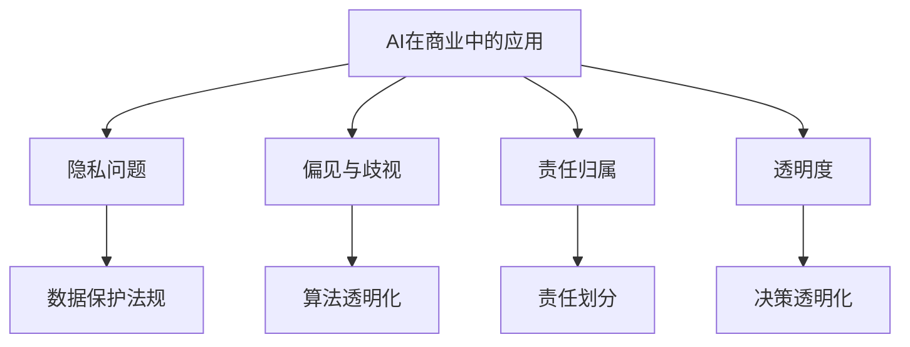

                 

 关键词：人工智能、商业道德、创新、人类计算、伦理问题、挑战、应用领域

> 摘要：随着人工智能（AI）技术的快速发展，其在商业领域的应用日益广泛，然而，AI驱动的创新也带来了诸多道德考虑因素。本文将探讨人类计算在商业中的道德问题，总结现有挑战，并展望未来发展趋势。

## 1. 背景介绍

### 1.1 人工智能的发展历程

人工智能（Artificial Intelligence，简称AI）自1956年诞生以来，经历了多个发展阶段。从早期的符号主义、知识表示，到基于规则的专家系统，再到基于数据的学习算法，AI技术已经取得了显著的进步。近年来，随着深度学习、神经网络等技术的突破，AI在图像识别、自然语言处理、语音识别等领域取得了革命性的成果。

### 1.2 人工智能在商业中的应用

随着AI技术的不断进步，其在商业领域的应用也越来越广泛。例如，智能客服系统、精准营销、自动化决策、风险控制等。AI在提高企业效率、降低成本、提升客户体验等方面发挥了重要作用。然而，AI的商业应用也带来了诸多道德问题，需要我们深入探讨。

## 2. 核心概念与联系

### 2.1 AI与商业道德

商业道德是指企业在经营活动中遵循的伦理规范和道德标准。AI与商业道德的关系主要体现在以下几个方面：

1. **隐私问题**：AI在处理和分析大量数据时，可能涉及到用户隐私的侵犯。
2. **偏见与歧视**：AI算法可能基于历史数据产生偏见，导致决策的不公正。
3. **责任归属**：在AI应用中，当出现错误或损害时，责任应由谁承担？
4. **透明度**：AI决策过程是否透明，用户是否能够理解和信任？

### 2.2 人类计算与商业道德

人类计算在商业中的应用历史悠久，如管理决策、风险评估、客户服务等。与AI相比，人类计算具有以下特点：

1. **灵活性与创造力**：人类计算能够根据情境进行灵活调整，具有高度的创造力。
2. **情感理解与沟通**：人类计算能够理解和处理情感，进行有效的沟通。
3. **道德判断与责任感**：人类计算在进行决策时，能够考虑道德因素，承担相应的责任。

### 2.3 Mermaid流程图



## 3. 核心算法原理 & 具体操作步骤

### 3.1 算法原理概述

在AI驱动的商业应用中，核心算法主要包括机器学习、深度学习、自然语言处理等。这些算法通过处理和分析大量数据，实现自动化决策和优化。

### 3.2 算法步骤详解

1. **数据收集**：收集与企业业务相关的数据，如客户信息、交易记录、市场数据等。
2. **数据预处理**：对数据进行清洗、去噪、归一化等处理，确保数据质量。
3. **特征工程**：提取数据中的有效特征，为算法提供输入。
4. **模型训练**：使用机器学习、深度学习等方法训练模型，使模型能够对数据进行分类、预测等操作。
5. **模型评估**：评估模型的性能，包括准确率、召回率、F1值等指标。
6. **模型部署**：将训练好的模型部署到生产环境中，实现自动化决策和优化。

### 3.3 算法优缺点

- **优点**：高效、自动化、可扩展。
- **缺点**：可能存在偏见、歧视，缺乏透明度，责任归属困难。

### 3.4 算法应用领域

- **客户服务**：智能客服系统、个性化推荐等。
- **精准营销**：用户画像、广告投放优化等。
- **风险控制**：信用评估、欺诈检测等。

## 4. 数学模型和公式 & 详细讲解 & 举例说明

### 4.1 数学模型构建

在AI驱动的商业应用中，常用的数学模型包括线性回归、逻辑回归、决策树、支持向量机等。以下以线性回归为例，介绍数学模型的构建。

### 4.2 公式推导过程

线性回归模型的目标是找到一个最佳拟合直线，使得实际值与预测值之间的误差最小。其公式如下：

$$ y = wx + b $$

其中，$y$ 为实际值，$x$ 为特征值，$w$ 为权重，$b$ 为偏置。

### 4.3 案例分析与讲解

假设我们有一个关于房价的数据集，包含房屋面积、房屋类型、房屋年龄等特征。我们希望通过线性回归模型预测房屋价格。

1. **数据收集与预处理**：收集相关数据，并进行数据清洗、归一化等预处理操作。
2. **特征工程**：提取有效特征，如房屋面积、房屋类型等。
3. **模型训练**：使用线性回归模型训练数据集，得到最佳拟合直线。
4. **模型评估**：评估模型性能，如计算均方误差（MSE）等指标。
5. **模型部署**：将训练好的模型部署到生产环境中，实现自动化预测。

## 5. 项目实践：代码实例和详细解释说明

### 5.1 开发环境搭建

- **Python**：作为主要编程语言。
- **Scikit-learn**：用于线性回归模型的训练和评估。

### 5.2 源代码详细实现

以下是一个简单的线性回归模型实现：

```python
from sklearn.linear_model import LinearRegression
from sklearn.model_selection import train_test_split
from sklearn.metrics import mean_squared_error

# 数据收集与预处理
# ...（代码实现）

# 特征工程
# ...（代码实现）

# 模型训练
X_train, X_test, y_train, y_test = train_test_split(X, y, test_size=0.2, random_state=42)
model = LinearRegression()
model.fit(X_train, y_train)

# 模型评估
y_pred = model.predict(X_test)
mse = mean_squared_error(y_test, y_pred)
print("MSE:", mse)

# 模型部署
# ...（代码实现）
```

### 5.3 代码解读与分析

- **数据收集与预处理**：收集数据，并进行清洗、归一化等操作。
- **特征工程**：提取有效特征，为模型提供输入。
- **模型训练**：使用 Scikit-learn 库中的 LinearRegression 类训练模型。
- **模型评估**：计算均方误差（MSE）等指标，评估模型性能。
- **模型部署**：将训练好的模型部署到生产环境中。

## 6. 实际应用场景

### 6.1 客户服务

AI驱动的智能客服系统可以实时回答客户问题，提高客户满意度。然而，在处理敏感问题时，需要确保隐私保护。

### 6.2 精准营销

AI驱动的精准营销可以根据用户行为、兴趣等进行个性化推荐，提高营销效果。但需注意数据隐私和用户权益保护。

### 6.3 风险控制

AI驱动的风险控制系统可以识别潜在风险，提高风险防控能力。但需确保算法的公平性、透明度。

## 7. 未来应用展望

### 7.1 新兴领域

随着AI技术的不断突破，未来有望在医疗、教育、金融等领域取得突破性应用。

### 7.2 跨界融合

AI与其他技术的跨界融合，如物联网、大数据等，将推动更多创新应用。

### 7.3 道德规范

随着AI应用的普及，制定统一的道德规范和标准，将有助于降低道德风险。

## 8. 工具和资源推荐

### 8.1 学习资源推荐

- **《Python机器学习》**：适合初学者入门。
- **《深度学习》**：适合有一定基础的学习者。

### 8.2 开发工具推荐

- **Jupyter Notebook**：用于编写和运行代码。
- **TensorFlow**：用于深度学习模型训练。

### 8.3 相关论文推荐

- **“Deep Learning for Natural Language Processing”**：介绍深度学习在自然语言处理领域的应用。
- **“Ethical Considerations in AI”**：探讨AI在商业应用中的道德问题。

## 9. 总结：未来发展趋势与挑战

### 9.1 研究成果总结

AI技术在商业应用中取得了显著成果，但仍面临诸多道德挑战。

### 9.2 未来发展趋势

AI在商业领域的应用将更加深入，涉及更多新兴领域。

### 9.3 面临的挑战

- **隐私保护**：确保用户数据安全。
- **公平性**：避免算法偏见和歧视。
- **透明度**：提高算法透明度，增强用户信任。
- **责任归属**：明确责任划分。

### 9.4 研究展望

制定统一的道德规范和标准，推动AI技术的可持续发展。

## 10. 附录：常见问题与解答

### 10.1 问题1：如何确保AI算法的公平性？

**解答**：通过数据清洗、特征工程、算法优化等手段，降低算法偏见和歧视。

### 10.2 问题2：AI在商业应用中的道德问题有哪些？

**解答**：隐私问题、偏见与歧视、责任归属、透明度等。

### 10.3 问题3：如何提高AI算法的透明度？

**解答**：公开算法细节、加强算法解释、提供用户反馈等。

[END]
```

