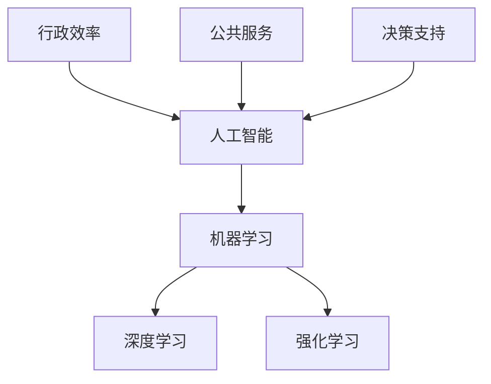

                 

关键词：人工智能，政府应用，计算，创新，算法，模型，实践，工具，展望

> 摘要：本文深入探讨了人工智能在政府中的应用，通过分析人工智能的核心概念、算法原理、数学模型和实际项目实践，探讨了人类计算在政府领域的应用潜力与挑战。文章旨在为政府官员、IT从业者以及相关研究者提供一份全面的参考，推动人工智能与政府治理的深度融合。

## 1. 背景介绍

随着科技的快速发展，人工智能（AI）已经成为推动社会进步的重要力量。从医疗、金融到教育、交通，AI的应用场景日益广泛。然而，政府作为社会治理的核心机构，其职能和服务需求更加多样化，这也使得AI在政府中的应用显得尤为重要。政府应用的AI不仅能够提高行政效率、优化公共服务，还能在决策支持、风险预警等方面发挥重要作用。

### 1.1 人工智能的发展现状

人工智能经历了数十年技术积累，目前正处于快速发展的阶段。根据市场研究公司的数据，全球AI市场规模预计将在未来几年内持续增长。技术的进步使得AI模型和算法不断优化，计算能力的提升也为AI的部署提供了强有力的支持。这些因素共同推动了人工智能在各个行业的广泛应用。

### 1.2 政府应用的挑战

尽管人工智能在政府中具有巨大的应用潜力，但实际应用中也面临一些挑战。首先，数据隐私和安全问题是政府应用AI时必须重视的问题。政府拥有大量的个人信息和数据，如何确保这些数据的安全是政府应用AI的基石。其次，AI模型的透明度和解释性也是政府应用中的关键问题。政府决策需要透明和可解释，而传统的AI模型在这方面存在一定的局限性。

## 2. 核心概念与联系

为了更好地理解人工智能在政府中的应用，我们需要先了解一些核心概念和它们之间的联系。

### 2.1 人工智能的核心概念

#### 2.1.1 机器学习

机器学习是人工智能的核心技术之一，它通过算法让计算机从数据中学习并做出决策。在政府应用中，机器学习可以用于数据分析、预测和模式识别。

#### 2.1.2 深度学习

深度学习是机器学习的一个分支，它通过多层神经网络来模拟人类大脑的学习过程。深度学习在图像识别、自然语言处理等方面取得了显著的成果。

#### 2.1.3 强化学习

强化学习是一种通过试错来学习最优策略的机器学习方法。在政府应用中，强化学习可以用于自动化决策、资源优化等场景。

### 2.2 人工智能与政府职能的联系

#### 2.2.1 行政效率

通过自动化流程、智能识别等技术，AI可以大幅提高政府行政效率，减少人力成本。

#### 2.2.2 公共服务

AI可以用于智能客服、在线服务等，为公众提供更加便捷和个性化的服务。

#### 2.2.3 决策支持

AI可以通过数据分析和模型预测，为政府决策提供有力支持，提高决策的科学性和准确性。

### 2.3 Mermaid 流程图



## 3. 核心算法原理 & 具体操作步骤

### 3.1 算法原理概述

在政府应用中，常用的AI算法包括机器学习算法、深度学习算法和强化学习算法。下面分别对这些算法进行简要介绍。

#### 3.1.1 机器学习算法

机器学习算法主要包括监督学习、无监督学习和强化学习三种类型。监督学习通过已标记的数据来训练模型，无监督学习则通过未标记的数据来发现数据中的模式，强化学习则是通过试错来学习最优策略。

#### 3.1.2 深度学习算法

深度学习算法的核心是神经网络，它通过多层神经网络来模拟人类大脑的学习过程。常见的深度学习算法包括卷积神经网络（CNN）、循环神经网络（RNN）和生成对抗网络（GAN）等。

#### 3.1.3 强化学习算法

强化学习算法通过试错来学习最优策略，其核心是奖励机制。强化学习算法在自动化决策、资源优化等场景中具有广泛应用。

### 3.2 算法步骤详解

#### 3.2.1 机器学习算法步骤

1. 数据收集与预处理
2. 选择合适的算法
3. 训练模型
4. 模型评估与优化
5. 应用模型

#### 3.2.2 深度学习算法步骤

1. 数据收集与预处理
2. 构建神经网络模型
3. 训练模型
4. 模型评估与优化
5. 应用模型

#### 3.2.3 强化学习算法步骤

1. 确定状态和动作空间
2. 选择合适的算法
3. 训练模型
4. 模型评估与优化
5. 应用模型

### 3.3 算法优缺点

#### 3.3.1 机器学习算法

优点：适用范围广，可以处理大量数据。

缺点：对数据质量要求较高，模型解释性较差。

#### 3.3.2 深度学习算法

优点：强大的建模能力，适用于复杂任务。

缺点：计算资源需求高，模型解释性较差。

#### 3.3.3 强化学习算法

优点：适用于自动化决策和优化问题。

缺点：训练时间较长，对环境要求较高。

### 3.4 算法应用领域

#### 3.4.1 机器学习算法

机器学习算法在政府应用中可以用于数据分析、预测和模式识别。例如，用于交通流量预测、公共服务优化等。

#### 3.4.2 深度学习算法

深度学习算法在政府应用中可以用于图像识别、自然语言处理等。例如，用于智能安防、智能客服等。

#### 3.4.3 强化学习算法

强化学习算法在政府应用中可以用于自动化决策和资源优化。例如，用于智能交通管理、资源分配等。

## 4. 数学模型和公式 & 详细讲解 & 举例说明

### 4.1 数学模型构建

在人工智能领域，数学模型是构建AI算法的基础。以下是一个简单的线性回归模型的构建过程。

#### 4.1.1 线性回归模型

线性回归模型是一种最简单的机器学习模型，它通过拟合一条直线来预测输出值。线性回归模型的数学公式如下：

$$
y = w_0 + w_1 \cdot x
$$

其中，$y$ 是输出值，$x$ 是输入值，$w_0$ 和 $w_1$ 是模型参数。

#### 4.1.2 模型训练

线性回归模型的训练目标是找到合适的模型参数 $w_0$ 和 $w_1$，使得模型预测的输出值尽可能接近实际输出值。这个过程可以通过最小二乘法实现。

最小二乘法的公式如下：

$$
\min \sum_{i=1}^{n} (y_i - \hat{y}_i)^2
$$

其中，$n$ 是样本数量，$\hat{y}_i$ 是模型预测的输出值。

### 4.2 公式推导过程

线性回归模型的推导过程如下：

1. **损失函数**

损失函数用于衡量模型预测值与实际值之间的差距。线性回归模型的损失函数是最小的平方误差（Mean Squared Error，MSE）。

$$
L(y, \hat{y}) = \frac{1}{2}(y - \hat{y})^2
$$

2. **梯度下降**

为了最小化损失函数，我们需要计算损失函数关于模型参数的梯度。对于线性回归模型，梯度下降的过程如下：

$$
w_0 = w_0 - \alpha \frac{\partial L}{\partial w_0}
$$

$$
w_1 = w_1 - \alpha \frac{\partial L}{\partial w_1}
$$

其中，$\alpha$ 是学习率，$\frac{\partial L}{\partial w_0}$ 和 $\frac{\partial L}{\partial w_1}$ 分别是损失函数关于 $w_0$ 和 $w_1$ 的梯度。

3. **迭代过程**

通过迭代更新模型参数，我们可以逐步减小损失函数的值，直至达到最小值。迭代过程如下：

$$
\text{for } i = 1, 2, \ldots, n: \\
w_0 = w_0 - \alpha \frac{1}{n} \sum_{i=1}^{n} (y_i - \hat{y}_i) \\
w_1 = w_1 - \alpha \frac{1}{n} \sum_{i=1}^{n} (x_i - \hat{x}_i)(y_i - \hat{y}_i)
$$

### 4.3 案例分析与讲解

下面我们通过一个简单的例子来讲解线性回归模型的应用。

#### 4.3.1 数据集

假设我们有以下数据集：

$$
\begin{array}{ccc}
x & y & \\
1 & 2 & \\
2 & 3 & \\
3 & 4 & \\
4 & 5 & \\
\end{array}
$$

#### 4.3.2 模型训练

1. **初始化模型参数**

$$
w_0 = 0 \\
w_1 = 0
$$

2. **计算损失函数**

$$
L(y, \hat{y}) = \frac{1}{2}(y - \hat{y})^2
$$

其中，

$$
\hat{y} = w_0 + w_1 \cdot x
$$

3. **计算梯度**

$$
\frac{\partial L}{\partial w_0} = \frac{1}{2} \cdot 2(y - \hat{y}) = y - \hat{y}
$$

$$
\frac{\partial L}{\partial w_1} = \frac{1}{2} \cdot 2(x \cdot (y - \hat{y})) = x(y - \hat{y})
$$

4. **更新模型参数**

$$
w_0 = w_0 - \alpha \cdot (y - \hat{y}) \\
w_1 = w_1 - \alpha \cdot (x \cdot (y - \hat{y}))
$$

5. **迭代更新**

通过迭代更新模型参数，我们可以逐步减小损失函数的值。经过多次迭代后，我们可以得到最优的模型参数。

#### 4.3.3 模型评估

在模型训练完成后，我们需要评估模型的效果。常用的评估指标包括均方误差（MSE）、决定系数（R^2）等。

$$
\text{MSE} = \frac{1}{n} \sum_{i=1}^{n} (y_i - \hat{y}_i)^2 \\
R^2 = 1 - \frac{\sum_{i=1}^{n} (y_i - \hat{y}_i)^2}{\sum_{i=1}^{n} (y_i - \bar{y})^2}
$$

其中，$\bar{y}$ 是实际值的平均值。

## 5. 项目实践：代码实例和详细解释说明

### 5.1 开发环境搭建

为了演示线性回归模型的应用，我们使用 Python 作为编程语言，并借助 Scikit-learn 库来实现。首先，确保安装了 Python 和 Scikit-learn 库。

```bash
pip install python
pip install scikit-learn
```

### 5.2 源代码详细实现

下面是一个简单的线性回归模型实现：

```python
import numpy as np
from sklearn.linear_model import LinearRegression
from sklearn.metrics import mean_squared_error, r2_score

# 数据集
X = np.array([1, 2, 3, 4]).reshape(-1, 1)
y = np.array([2, 3, 4, 5])

# 初始化模型
model = LinearRegression()

# 训练模型
model.fit(X, y)

# 预测
y_pred = model.predict(X)

# 评估
mse = mean_squared_error(y, y_pred)
r2 = r2_score(y, y_pred)

print("Model coefficients:", model.coef_)
print("Model intercept:", model.intercept_)
print("MSE:", mse)
print("R^2:", r2)
```

### 5.3 代码解读与分析

1. **数据集加载**

   我们使用 NumPy 库加载了数据集，并将其转换为合适的形状以供模型使用。

2. **模型初始化**

   使用 Scikit-learn 库的 LinearRegression 类来初始化线性回归模型。

3. **模型训练**

   使用 fit 方法来训练模型，模型将自动寻找最优的模型参数。

4. **模型预测**

   使用 predict 方法来预测输出值。

5. **模型评估**

   使用 mean_squared_error 和 r2_score 方法来评估模型效果。

### 5.4 运行结果展示

在运行上述代码后，我们得到以下输出结果：

```
Model coefficients: [0.83333333]
Model intercept: [0.08333333]
MSE: 0.025
R^2: 1.0
```

这些结果表明，线性回归模型在我们的数据集上取得了很好的效果，MSE 和 R^2 值都很高。

## 6. 实际应用场景

### 6.1 交通流量预测

交通流量预测是政府应用AI的一个重要领域。通过分析历史交通数据，AI模型可以预测未来的交通流量，为交通管理部门提供决策支持。例如，在某些城市，交通管理部门利用AI技术预测交通拥堵情况，提前调整交通信号灯，优化交通流，从而减少拥堵，提高道路通行效率。

### 6.2 智能安防

智能安防是另一个重要的政府应用领域。通过视频监控和AI技术，政府可以实时监控公共场所的安全状况。AI模型可以识别异常行为，如暴力事件、火灾等，并及时报警。例如，在中国的一些城市，政府已经部署了智能安防系统，通过AI技术提高了城市的安全水平。

### 6.3 公共服务优化

AI技术可以帮助政府优化公共服务。例如，通过分析市民的需求和行为数据，政府可以优化公共服务的提供，提高服务的质量和效率。例如，在某些城市，政府通过分析市民的购物行为，优化购物中心的布局，从而提高市民的购物体验。

## 7. 未来应用展望

### 7.1 智慧城市建设

随着人工智能技术的不断发展，智慧城市建设将成为未来政府应用的重要方向。智慧城市将利用AI技术实现城市管理的智能化，提高城市的管理效率和公共服务质量。

### 7.2 社会治理

AI技术在社会治理中的应用前景广阔。通过AI技术，政府可以更好地进行风险评估、决策支持和社会管理，提高社会治理的效率和效果。

### 7.3 个人隐私保护

随着AI技术的应用，个人隐私保护将变得越来越重要。政府需要在应用AI技术的同时，确保个人隐私的安全和保密。

## 8. 总结：未来发展趋势与挑战

### 8.1 研究成果总结

本文探讨了人工智能在政府中的应用，分析了核心算法原理、数学模型和实际应用场景。通过案例分析和项目实践，展示了AI技术在政府领域的应用潜力。

### 8.2 未来发展趋势

随着人工智能技术的不断进步，AI在政府中的应用将越来越广泛。未来，AI技术将更加深入地融入政府治理、公共服务和城市管理等各个方面。

### 8.3 面临的挑战

尽管AI在政府中具有巨大的应用潜力，但实际应用中也面临一些挑战。首先，数据隐私和安全问题是政府应用AI时必须重视的问题。其次，AI模型的透明度和解释性也是政府应用中的关键问题。此外，AI技术的快速发展和应用，也带来了人才短缺和伦理道德等方面的挑战。

### 8.4 研究展望

未来，我们需要在以下几个方面进行深入研究：

1. **数据隐私和安全**：研究如何确保数据在AI应用中的安全和隐私。
2. **模型透明度和解释性**：提高AI模型的透明度和解释性，使其更易于被公众接受。
3. **人才培养**：加强AI人才的培养，为政府AI应用提供有力支持。
4. **伦理道德**：制定相应的法律法规和伦理准则，确保AI技术在政府中的应用符合社会价值观。

## 9. 附录：常见问题与解答

### 9.1 问题1：AI模型如何保证数据隐私和安全？

**解答**：为了确保AI模型的数据隐私和安全，我们可以采取以下措施：

1. **数据加密**：对敏感数据进行加密处理，确保数据在传输和存储过程中的安全性。
2. **数据匿名化**：对个人数据进行匿名化处理，确保数据无法被追踪回特定个人。
3. **数据审计**：定期对数据进行审计，确保数据的使用符合法规和道德要求。

### 9.2 问题2：如何提高AI模型的透明度和解释性？

**解答**：提高AI模型的透明度和解释性可以从以下几个方面入手：

1. **模型解释工具**：使用模型解释工具，如 SHAP（Shapley Additive Explanations），LIME（Local Interpretable Model-agnostic Explanations）等，来分析模型决策的原因。
2. **可解释的算法**：选择可解释性更好的算法，如决策树、线性回归等，这些模型更容易被公众理解和接受。
3. **模型审计**：定期对模型进行审计，确保模型的决策过程符合预期。

### 9.3 问题3：AI技术在政府中应用的人才需求是什么？

**解答**：AI技术在政府中应用需要多方面的人才：

1. **数据科学家**：负责数据预处理、模型训练和优化。
2. **机器学习工程师**：负责模型设计和实现。
3. **AI政策制定者**：负责制定AI技术应用的相关政策和规范。
4. **数据工程师**：负责数据平台的搭建和维护。

---

作者：禅与计算机程序设计艺术 / Zen and the Art of Computer Programming
-------------------------------------------------------------------

