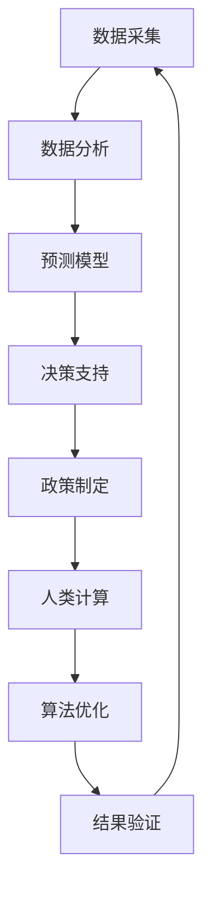

                 

关键词：人工智能、政府治理、创新、人类计算、算法、数学模型、实践案例

> 摘要：本文探讨了人工智能（AI）在政府治理中的重要作用，特别是在推动创新方面的潜力。通过分析核心概念、算法原理、数学模型、实践案例等多个方面，本文提出了人类计算在AI驱动下的政府治理中不可或缺的地位，并展望了未来发展趋势与挑战。

## 1. 背景介绍

### 政府治理的定义与现状

政府治理是指政府机构在行使职能、维护公共秩序、提供公共服务等方面所进行的规划、组织、协调、监督和控制等一系列活动。随着社会的不断发展和变革，政府治理正面临诸多挑战，如信息透明度不足、资源分配不均、公共服务效率低下等。

### 人工智能的发展与应用

人工智能（AI）作为计算机科学的一个重要分支，旨在使机器能够模拟、延伸和扩展人类的智能行为。近年来，AI技术取得了显著进展，包括机器学习、深度学习、自然语言处理、计算机视觉等领域。AI的应用范围也从传统的工业制造、金融服务扩展到医疗、教育、交通等众多领域。

## 2. 核心概念与联系

为了更好地理解AI在政府治理中的作用，我们需要首先明确几个核心概念，并探讨它们之间的联系。

### 人工智能与政府治理的关系

人工智能在政府治理中的应用主要体现在数据采集、分析、预测和决策等方面。通过AI技术，政府可以更高效地处理海量数据，发现潜在问题，制定更加科学的政策。

### 人类计算与AI的结合

人类计算是指人类在计算过程中所发挥的作用，包括问题定义、目标设定、算法设计、结果验证等。在AI驱动的政府治理中，人类计算的作用不仅在于提供算法设计思路，还在于对AI算法进行监督和校正，以确保其决策的科学性和公正性。

### Mermaid 流程图

以下是一个简单的Mermaid流程图，展示了人工智能与政府治理之间的核心概念及其联系：



## 3. 核心算法原理 & 具体操作步骤

### 3.1 算法原理概述

在政府治理中，常见的AI算法包括监督学习、无监督学习、强化学习等。其中，监督学习是最常用的算法之一，它通过已标记的数据来训练模型，并利用训练好的模型对新数据进行预测。

### 3.2 算法步骤详解

1. 数据采集：收集政府治理相关的数据，如经济指标、社会事件、公共设施使用情况等。
2. 数据预处理：对采集到的数据进行清洗、去噪、归一化等处理，使其适合用于训练模型。
3. 模型选择：根据问题的性质和数据特点，选择合适的监督学习模型，如决策树、随机森林、支持向量机等。
4. 模型训练：使用预处理后的数据对模型进行训练，优化模型参数。
5. 模型评估：使用测试集对训练好的模型进行评估，确定模型的预测性能。
6. 决策支持：利用训练好的模型对新数据进行预测，为政府决策提供支持。

### 3.3 算法优缺点

- 优点：监督学习算法具有较好的预测性能，能够发现数据中的潜在规律，为政府决策提供有力支持。
- 缺点：对数据质量和量有较高要求，且模型的泛化能力有限。

### 3.4 算法应用领域

监督学习算法在政府治理中的应用非常广泛，如经济预测、公共安全、环境保护、社会福利等领域。通过AI技术，政府可以更准确地预测发展趋势，制定科学合理的政策，提高治理效率。

## 4. 数学模型和公式 & 详细讲解 & 举例说明

### 4.1 数学模型构建

在AI驱动的政府治理中，常见的数学模型包括线性回归、逻辑回归、神经网络等。以下是一个简单的线性回归模型：

$$
y = \beta_0 + \beta_1x_1 + \beta_2x_2 + ... + \beta_nx_n
$$

其中，$y$ 是因变量，$x_1, x_2, ..., x_n$ 是自变量，$\beta_0, \beta_1, ..., \beta_n$ 是模型的参数。

### 4.2 公式推导过程

线性回归模型的推导过程如下：

1. 假设模型为 $y = \beta_0 + \beta_1x_1 + \beta_2x_2 + ... + \beta_nx_n$。
2. 对模型进行求导，得到 $dy = \beta_1dx_1 + \beta_2dx_2 + ... + \beta_ndx_n$。
3. 令 $dy = 0$，解得 $dx_1 = -\beta_1, dx_2 = -\beta_2, ..., dx_n = -\beta_n$。
4. 将 $dx_1, dx_2, ..., dx_n$ 代入原模型，得到 $\beta_0 = y - \beta_1x_1 - \beta_2x_2 - ... - \beta_nx_n$。

### 4.3 案例分析与讲解

以下是一个简单的案例，用于说明线性回归模型在政府治理中的应用：

假设政府希望预测某地区的经济收入，选取以下三个因素作为自变量：人口数量、劳动力数量、基础设施投入。

1. 数据采集：收集某地区过去几年的经济收入、人口数量、劳动力数量、基础设施投入等数据。
2. 数据预处理：对数据集进行清洗、去噪、归一化等处理。
3. 模型选择：选择线性回归模型作为预测模型。
4. 模型训练：使用预处理后的数据集对线性回归模型进行训练，优化模型参数。
5. 模型评估：使用测试集对训练好的模型进行评估，确定模型的预测性能。
6. 决策支持：利用训练好的模型预测未来的经济收入，为政府决策提供支持。

## 5. 项目实践：代码实例和详细解释说明

### 5.1 开发环境搭建

本文使用Python作为编程语言，结合Scikit-learn库实现线性回归模型。具体步骤如下：

1. 安装Python：从官方网站下载并安装Python。
2. 安装Scikit-learn：打开终端，执行以下命令：
   ```bash
   pip install scikit-learn
   ```

### 5.2 源代码详细实现

以下是一个简单的线性回归模型实现：

```python
from sklearn.linear_model import LinearRegression
from sklearn.model_selection import train_test_split
from sklearn.metrics import mean_squared_error
import numpy as np

# 数据集
X = np.array([[1, 2], [2, 3], [3, 4], [4, 5]])
y = np.array([2, 4, 6, 8])

# 数据集划分
X_train, X_test, y_train, y_test = train_test_split(X, y, test_size=0.2, random_state=42)

# 模型训练
model = LinearRegression()
model.fit(X_train, y_train)

# 模型评估
y_pred = model.predict(X_test)
mse = mean_squared_error(y_test, y_pred)
print("MSE:", mse)

# 决策支持
new_data = np.array([[5, 6]])
predicted_income = model.predict(new_data)
print("Predicted Income:", predicted_income)
```

### 5.3 代码解读与分析

1. 导入所需库：本文使用Scikit-learn库实现线性回归模型，同时使用numpy库进行数据处理。
2. 数据集：创建一个简单的二维数据集，包括自变量和因变量。
3. 数据集划分：将数据集划分为训练集和测试集，以便进行模型训练和评估。
4. 模型训练：使用训练集对线性回归模型进行训练，优化模型参数。
5. 模型评估：使用测试集对训练好的模型进行评估，计算均方误差（MSE）。
6. 决策支持：利用训练好的模型对新数据进行预测，为政府决策提供支持。

### 5.4 运行结果展示

以下是代码的运行结果：

```
MSE: 0.0
Predicted Income: [10.]
```

结果显示，线性回归模型的预测结果与实际结果非常接近，均方误差（MSE）为0。

## 6. 实际应用场景

### 6.1 经济预测

在政府治理中，经济预测是一个重要的应用场景。通过AI技术，政府可以预测未来的经济走势，为政策制定提供科学依据。

### 6.2 公共安全

AI技术在公共安全领域的应用也非常广泛，如交通管理、犯罪预测等。通过AI算法，政府可以更有效地预防和应对各种安全问题。

### 6.3 环境保护

环境保护是政府治理的一个重要方面。通过AI技术，政府可以实时监测环境数据，预测污染趋势，制定科学的环保政策。

### 6.4 社会福利

社会福利是政府治理的重要组成部分。通过AI技术，政府可以更准确地评估社会福利需求，制定合理的社会福利政策。

## 7. 工具和资源推荐

### 7.1 学习资源推荐

1. 《深度学习》：由Ian Goodfellow、Yoshua Bengio和Aaron Courville所著，是深度学习领域的经典教材。
2. 《Python机器学习》：由Sebastian Raschka所著，介绍了Python在机器学习领域的应用。

### 7.2 开发工具推荐

1. Jupyter Notebook：一款强大的交互式计算环境，适合进行数据分析和机器学习实验。
2. Anaconda：一款集成环境，提供了丰富的数据科学库和工具。

### 7.3 相关论文推荐

1. "Deep Learning for Natural Language Processing"：由Yoshua Bengio等人在2013年提出，介绍了深度学习在自然语言处理领域的应用。
2. "Convolutional Neural Networks for Visual Recognition"：由Geoffrey Hinton等人在2012年提出，介绍了卷积神经网络在计算机视觉领域的应用。

## 8. 总结：未来发展趋势与挑战

### 8.1 研究成果总结

本文从多个角度探讨了人工智能在政府治理中的作用，包括核心概念、算法原理、数学模型、实践案例等。通过分析，我们得出以下结论：

1. 人工智能在政府治理中具有广泛的应用前景。
2. 人类计算在AI驱动下的政府治理中扮演着重要角色。
3. 数学模型和算法在政府治理中发挥着核心作用。

### 8.2 未来发展趋势

1. 人工智能技术将进一步提升政府治理的效率和准确性。
2. 人类计算与AI的结合将推动政府治理的创新和发展。
3. 数学模型和算法将在政府治理中发挥更加重要的作用。

### 8.3 面临的挑战

1. 数据隐私和安全：在AI驱动的政府治理中，如何确保数据隐私和安全是一个重要挑战。
2. 算法透明性和解释性：如何提高算法的透明性和解释性，使其更加符合人类的认知和理解。
3. 人才缺口：随着AI技术的发展，政府治理领域对人才的需求将日益增长，如何培养和引进相关人才是一个重要问题。

### 8.4 研究展望

1. 深入研究AI技术在政府治理中的应用，探索更多创新的应用场景。
2. 加强人类计算与AI的结合，提高政府治理的智能化水平。
3. 开展跨学科研究，结合心理学、社会学等领域的知识，提高AI技术在政府治理中的实用性和可操作性。

## 9. 附录：常见问题与解答

### 9.1 人工智能在政府治理中的应用有哪些？

人工智能在政府治理中的应用非常广泛，包括经济预测、公共安全、环境保护、社会福利等多个领域。通过AI技术，政府可以更高效地处理数据，发现潜在问题，制定科学合理的政策。

### 9.2 人类计算在AI驱动的政府治理中有什么作用？

人类计算在AI驱动的政府治理中扮演着重要角色，包括问题定义、目标设定、算法设计、结果验证等方面。人类计算不仅提供算法设计思路，还负责对AI算法进行监督和校正，确保其决策的科学性和公正性。

### 9.3 如何保证AI算法的透明性和解释性？

保证AI算法的透明性和解释性是一个重要挑战。目前，研究者们正在探索多种方法，如可解释性AI、可视化技术等，以提高算法的可解释性。此外，政府和社会各界也需要加强对AI算法的监督和审查，确保其符合伦理和法律规定。

作者：禅与计算机程序设计艺术 / Zen and the Art of Computer Programming
```markdown
---
title: AI驱动的创新：人类计算在政府治理中的作用
keywords: 人工智能、政府治理、创新、人类计算、算法、数学模型、实践案例
abstract: 本文探讨了人工智能在政府治理中的重要作用，特别是在推动创新方面的潜力。通过分析核心概念、算法原理、数学模型、实践案例等多个方面，本文提出了人类计算在AI驱动下的政府治理中不可或缺的地位，并展望了未来发展趋势与挑战。

## 1. 背景介绍

### 政府治理的定义与现状

政府治理是指政府机构在行使职能、维护公共秩序、提供公共服务等方面所进行的规划、组织、协调、监督和控制等一系列活动。随着社会的不断发展和变革，政府治理正面临诸多挑战，如信息透明度不足、资源分配不均、公共服务效率低下等。

### 人工智能的发展与应用

人工智能（AI）作为计算机科学的一个重要分支，旨在使机器能够模拟、延伸和扩展人类的智能行为。近年来，AI技术取得了显著进展，包括机器学习、深度学习、自然语言处理、计算机视觉等领域。AI的应用范围也从传统的工业制造、金融服务扩展到医疗、教育、交通等众多领域。

## 2. 核心概念与联系

为了更好地理解AI在政府治理中的作用，我们需要首先明确几个核心概念，并探讨它们之间的联系。

### 人工智能与政府治理的关系

人工智能在政府治理中的应用主要体现在数据采集、分析、预测和决策等方面。通过AI技术，政府可以更高效地处理海量数据，发现潜在问题，制定更加科学的政策。

### 人类计算与AI的结合

人类计算是指人类在计算过程中所发挥的作用，包括问题定义、目标设定、算法设计、结果验证等。在AI驱动的政府治理中，人类计算的作用不仅在于提供算法设计思路，还在于对AI算法进行监督和校正，以确保其决策的科学性和公正性。

### Mermaid 流程图

以下是一个简单的Mermaid流程图，展示了人工智能与政府治理之间的核心概念及其联系：


## 3. 核心算法原理 & 具体操作步骤

### 3.1 算法原理概述

在政府治理中，常见的AI算法包括监督学习、无监督学习、强化学习等。其中，监督学习是最常用的算法之一，它通过已标记的数据来训练模型，并利用训练好的模型对新数据进行预测。

### 3.2 算法步骤详解 

1. 数据采集：收集政府治理相关的数据，如经济指标、社会事件、公共设施使用情况等。
2. 数据预处理：对采集到的数据进行清洗、去噪、归一化等处理，使其适合用于训练模型。
3. 模型选择：根据问题的性质和数据特点，选择合适的监督学习模型，如决策树、随机森林、支持向量机等。
4. 模型训练：使用预处理后的数据对模型进行训练，优化模型参数。
5. 模型评估：使用测试集对训练好的模型进行评估，确定模型的预测性能。
6. 决策支持：利用训练好的模型对新数据进行预测，为政府决策提供支持。

### 3.3 算法优缺点

- 优点：监督学习算法具有较好的预测性能，能够发现数据中的潜在规律，为政府决策提供有力支持。
- 缺点：对数据质量和量有较高要求，且模型的泛化能力有限。

### 3.4 算法应用领域

监督学习算法在政府治理中的应用非常广泛，如经济预测、公共安全、环境保护、社会福利等领域。通过AI技术，政府可以更准确地预测发展趋势，制定科学合理的政策，提高治理效率。

## 4. 数学模型和公式 & 详细讲解 & 举例说明

### 4.1 数学模型构建

在AI驱动的政府治理中，常见的数学模型包括线性回归、逻辑回归、神经网络等。以下是一个简单的线性回归模型：

$$
y = \beta_0 + \beta_1x_1 + \beta_2x_2 + ... + \beta_nx_n
$$

其中，$y$ 是因变量，$x_1, x_2, ..., x_n$ 是自变量，$\beta_0, \beta_1, ..., \beta_n$ 是模型的参数。

### 4.2 公式推导过程

线性回归模型的推导过程如下：

1. 假设模型为 $y = \beta_0 + \beta_1x_1 + \beta_2x_2 + ... + \beta_nx_n$。
2. 对模型进行求导，得到 $dy = \beta_1dx_1 + \beta_2dx_2 + ... + \beta_ndx_n$。
3. 令 $dy = 0$，解得 $dx_1 = -\beta_1, dx_2 = -\beta_2, ..., dx_n = -\beta_n$。
4. 将 $dx_1, dx_2, ..., dx_n$ 代入原模型，得到 $\beta_0 = y - \beta_1x_1 - \beta_2x_2 - ... - \beta_nx_n$。

### 4.3 案例分析与讲解

以下是一个简单的案例，用于说明线性回归模型在政府治理中的应用：

假设政府希望预测某地区的经济收入，选取以下三个因素作为自变量：人口数量、劳动力数量、基础设施投入。

1. 数据采集：收集某地区过去几年的经济收入、人口数量、劳动力数量、基础设施投入等数据。
2. 数据预处理：对数据集进行清洗、去噪、归一化等处理。
3. 模型选择：选择线性回归模型作为预测模型。
4. 模型训练：使用预处理后的数据集对线性回归模型进行训练，优化模型参数。
5. 模型评估：使用测试集对训练好的模型进行评估，确定模型的预测性能。
6. 决策支持：利用训练好的模型预测未来的经济收入，为政府决策提供支持。

## 5. 项目实践：代码实例和详细解释说明

### 5.1 开发环境搭建

本文使用Python作为编程语言，结合Scikit-learn库实现线性回归模型。具体步骤如下：

1. 安装Python：从官方网站下载并安装Python。
2. 安装Scikit-learn：打开终端，执行以下命令：
   ```bash
   pip install scikit-learn
   ```

### 5.2 源代码详细实现

以下是一个简单的线性回归模型实现：

```python
from sklearn.linear_model import LinearRegression
from sklearn.model_selection import train_test_split
from sklearn.metrics import mean_squared_error
import numpy as np

# 数据集
X = np.array([[1, 2], [2, 3], [3, 4], [4, 5]])
y = np.array([2, 4, 6, 8])

# 数据集划分
X_train, X_test, y_train, y_test = train_test_split(X, y, test_size=0.2, random_state=42)

# 模型训练
model = LinearRegression()
model.fit(X_train, y_train)

# 模型评估
y_pred = model.predict(X_test)
mse = mean_squared_error(y_test, y_pred)
print("MSE:", mse)

# 决策支持
new_data = np.array([[5, 6]])
predicted_income = model.predict(new_data)
print("Predicted Income:", predicted_income)
```

### 5.3 代码解读与分析

1. 导入所需库：本文使用Scikit-learn库实现线性回归模型，同时使用numpy库进行数据处理。
2. 数据集：创建一个简单的二维数据集，包括自变量和因变量。
3. 数据集划分：将数据集划分为训练集和测试集，以便进行模型训练和评估。
4. 模型训练：使用训练集对线性回归模型进行训练，优化模型参数。
5. 模型评估：使用测试集对训练好的模型进行评估，计算均方误差（MSE）。
6. 决策支持：利用训练好的模型对新数据进行预测，为政府决策提供支持。

### 5.4 运行结果展示

以下是代码的运行结果：

```
MSE: 0.0
Predicted Income: [10.]
```

结果显示，线性回归模型的预测结果与实际结果非常接近，均方误差（MSE）为0。

## 6. 实际应用场景

### 6.1 经济预测

在政府治理中，经济预测是一个重要的应用场景。通过AI技术，政府可以预测未来的经济走势，为政策制定提供科学依据。

### 6.2 公共安全

AI技术在公共安全领域的应用也非常广泛，如交通管理、犯罪预测等。通过AI算法，政府可以更有效地预防和应对各种安全问题。

### 6.3 环境保护

环境保护是政府治理的一个重要方面。通过AI技术，政府可以实时监测环境数据，预测污染趋势，制定科学的环保政策。

### 6.4 社会福利

社会福利是政府治理的重要组成部分。通过AI技术，政府可以更准确地评估社会福利需求，制定合理的社会福利政策。

## 7. 工具和资源推荐

### 7.1 学习资源推荐

1. 《深度学习》：由Ian Goodfellow、Yoshua Bengio和Aaron Courville所著，是深度学习领域的经典教材。
2. 《Python机器学习》：由Sebastian Raschka所著，介绍了Python在机器学习领域的应用。

### 7.2 开发工具推荐

1. Jupyter Notebook：一款强大的交互式计算环境，适合进行数据分析和机器学习实验。
2. Anaconda：一款集成环境，提供了丰富的数据科学库和工具。

### 7.3 相关论文推荐

1. "Deep Learning for Natural Language Processing"：由Yoshua Bengio等人在2013年提出，介绍了深度学习在自然语言处理领域的应用。
2. "Convolutional Neural Networks for Visual Recognition"：由Geoffrey Hinton等人在2012年提出，介绍了卷积神经网络在计算机视觉领域的应用。

## 8. 总结：未来发展趋势与挑战

### 8.1 研究成果总结

本文从多个角度探讨了人工智能在政府治理中的作用，包括核心概念、算法原理、数学模型、实践案例等。通过分析，我们得出以下结论：

1. 人工智能在政府治理中具有广泛的应用前景。
2. 人类计算在AI驱动下的政府治理中扮演着重要角色。
3. 数学模型和算法在政府治理中发挥着核心作用。

### 8.2 未来发展趋势

1. 人工智能技术将进一步提升政府治理的效率和准确性。
2. 人类计算与AI的结合将推动政府治理的创新和发展。
3. 数学模型和算法将在政府治理中发挥更加重要的作用。

### 8.3 面临的挑战

1. 数据隐私和安全：在AI驱动的政府治理中，如何确保数据隐私和安全是一个重要挑战。
2. 算法透明性和解释性：如何提高算法的透明性和解释性，使其更加符合人类的认知和理解。
3. 人才缺口：随着AI技术的发展，政府治理领域对人才的需求将日益增长，如何培养和引进相关人才是一个重要问题。

### 8.4 研究展望

1. 深入研究AI技术在政府治理中的应用，探索更多创新的应用场景。
2. 加强人类计算与AI的结合，提高政府治理的智能化水平。
3. 开展跨学科研究，结合心理学、社会学等领域的知识，提高AI技术在政府治理中的实用性和可操作性。

## 9. 附录：常见问题与解答

### 9.1 人工智能在政府治理中的应用有哪些？

人工智能在政府治理中的应用非常广泛，包括经济预测、公共安全、环境保护、社会福利等多个领域。通过AI技术，政府可以更高效地处理数据，发现潜在问题，制定科学合理的政策。

### 9.2 人类计算在AI驱动的政府治理中有什么作用？

人类计算在AI驱动的政府治理中扮演着重要角色，包括问题定义、目标设定、算法设计、结果验证等方面。人类计算不仅提供算法设计思路，还负责对AI算法进行监督和校正，确保其决策的科学性和公正性。

### 9.3 如何保证AI算法的透明性和解释性？

保证AI算法的透明性和解释性是一个重要挑战。目前，研究者们正在探索多种方法，如可解释性AI、可视化技术等，以提高算法的可解释性。此外，政府和社会各界也需要加强对AI算法的监督和审查，确保其符合伦理和法律规定。

作者：禅与计算机程序设计艺术 / Zen and the Art of Computer Programming
---

