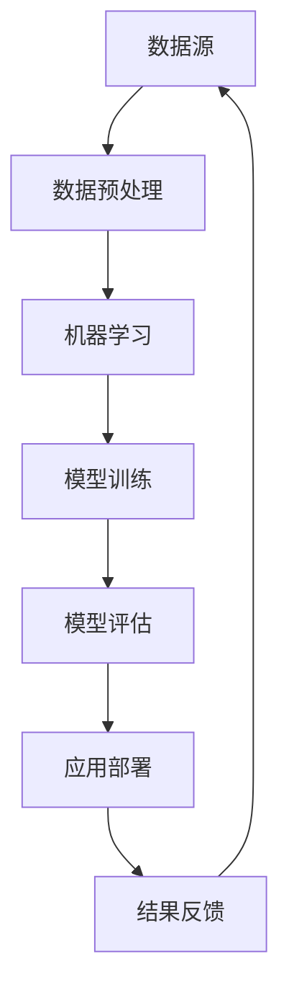

                 

关键词：人工智能、金融科技、人类计算、数据分析、风险管理、算法优化

> 摘要：本文深入探讨了人工智能在金融领域的应用，分析了人类计算与AI结合所带来的创新和挑战。通过介绍核心概念、算法原理、数学模型和项目实践，本文旨在为读者展示AI驱动的金融科技的前沿动态，并探讨其未来的发展方向。

## 1. 背景介绍

在过去的几十年中，金融行业经历了巨大的变革。随着技术的进步，传统的金融业务模式正在被重新定义。特别是人工智能（AI）技术的迅猛发展，为金融行业带来了前所未有的机遇和挑战。从智能投顾到自动化交易，从风险管理到信用评分，AI正在深刻地改变金融服务的各个方面。

### 1.1 人工智能在金融行业的重要性

人工智能在金融行业的重要性体现在以下几个方面：

1. **数据分析与决策优化**：人工智能可以帮助金融机构处理和分析海量的数据，从而做出更加精准的决策。
2. **风险管理与合规**：通过机器学习算法，可以实时监控市场动态，识别潜在的金融风险，并确保业务的合规性。
3. **客户体验提升**：人工智能技术可以实现智能客服、个性化推荐等服务，提升客户的满意度。
4. **业务流程自动化**：通过自然语言处理和机器人流程自动化（RPA），可以大幅降低人力成本，提高工作效率。

### 1.2 人类计算的角色

尽管人工智能技术在金融行业中扮演了重要角色，但人类计算依然不可或缺。人类计算在以下几个方面具有独特的优势：

1. **直觉与洞察**：人类能够通过直觉和经验发现数据中隐藏的模式，这是机器难以模仿的。
2. **复杂决策**：对于某些需要考虑伦理、法律和社会因素的业务决策，人类计算具有不可替代的作用。
3. **创新思维**：人类具有创造性和创新性，能够在业务模式和技术应用方面提出新的想法。

## 2. 核心概念与联系

为了更好地理解人工智能在金融中的应用，我们需要先了解一些核心概念和它们之间的联系。以下是这些概念以及它们之间的Mermaid流程图：

### 2.1 核心概念

- **机器学习**：一种让计算机从数据中学习模式和规律的方法，包括监督学习、非监督学习和强化学习。
- **深度学习**：一种机器学习技术，通过模拟人脑的神经网络结构来进行复杂的数据分析和模式识别。
- **数据挖掘**：从大量数据中提取有用信息和知识的过程。
- **自然语言处理**：使计算机能够理解、生成和回应自然语言的技术。
- **区块链**：一种去中心化的分布式数据库技术，能够确保数据的安全和透明。

### 2.2 Mermaid流程图



### 2.3 核心概念的联系

- 数据源：为机器学习和数据挖掘提供基础数据。
- 数据预处理：清洗、转换和归一化数据，使其适合机器学习和数据挖掘。
- 机器学习：训练模型，使其能够从数据中学习。
- 模型训练：通过调整模型参数，提高模型的预测能力。
- 模型评估：评估模型在验证集上的性能，确保其泛化能力。
- 应用部署：将训练好的模型应用到实际业务场景中。
- 结果反馈：收集实际应用中的反馈，用于模型优化和迭代。

## 3. 核心算法原理 & 具体操作步骤

### 3.1 算法原理概述

在金融行业中，常用的核心算法包括线性回归、决策树、支持向量机（SVM）和神经网络等。以下是这些算法的简要原理：

1. **线性回归**：通过最小化预测值与实际值之间的误差，建立自变量和因变量之间的线性关系。
2. **决策树**：根据特征值对数据进行切分，形成树状结构，用于分类或回归。
3. **支持向量机**：通过寻找最优的超平面，将数据集分为不同的类别。
4. **神经网络**：模拟人脑神经网络结构，用于复杂的数据分析和模式识别。

### 3.2 算法步骤详解

以神经网络为例，以下是具体的算法步骤：

1. **数据预处理**：包括数据清洗、归一化和拆分数据集。
2. **构建神经网络模型**：定义网络结构，包括输入层、隐藏层和输出层。
3. **模型训练**：通过反向传播算法，不断调整网络参数，使预测值接近实际值。
4. **模型评估**：使用验证集评估模型性能，包括准确率、召回率、F1值等指标。
5. **模型部署**：将训练好的模型部署到生产环境中，进行实际业务应用。

### 3.3 算法优缺点

- **线性回归**：优点是简单、易于理解和实现；缺点是对于非线性问题效果较差。
- **决策树**：优点是直观、易于解释；缺点是容易过拟合，对于特征数量较多的问题效果较差。
- **支持向量机**：优点是理论成熟，适用于高维空间；缺点是训练时间较长，对噪声敏感。
- **神经网络**：优点是能够处理复杂问题，自适应性强；缺点是训练过程复杂，容易过拟合。

### 3.4 算法应用领域

- **线性回归**：适用于预测股价、利率等线性关系较强的金融指标。
- **决策树**：适用于信用评分、风险分类等业务场景。
- **支持向量机**：适用于金融欺诈检测、市场趋势预测等。
- **神经网络**：适用于量化投资策略、金融衍生品定价等。

## 4. 数学模型和公式 & 详细讲解 & 举例说明

### 4.1 数学模型构建

在金融领域，常用的数学模型包括线性回归模型、逻辑回归模型和神经网络模型等。以下是这些模型的构建过程：

1. **线性回归模型**：

   假设我们有自变量\(x\)和因变量\(y\)，线性回归模型的公式为：

   $$y = \beta_0 + \beta_1x + \epsilon$$

   其中，\(\beta_0\)和\(\beta_1\)是模型的参数，\(\epsilon\)是误差项。

2. **逻辑回归模型**：

   逻辑回归是一种广义线性模型，用于处理二元分类问题。其公式为：

   $$P(y=1) = \frac{1}{1 + e^{-(\beta_0 + \beta_1x)}}$$

   其中，\(P(y=1)\)是因变量为1的概率，\(\beta_0\)和\(\beta_1\)是模型的参数。

3. **神经网络模型**：

   神经网络模型由多个神经元组成，每个神经元通过激活函数将输入转化为输出。一个简单的神经网络模型可以表示为：

   $$z = \sum_{i=1}^{n} w_i x_i + b$$

   $$a = \sigma(z)$$

   其中，\(x_i\)是输入，\(w_i\)和\(b\)是模型的参数，\(\sigma\)是激活函数。

### 4.2 公式推导过程

1. **线性回归模型的参数推导**：

   我们使用最小二乘法来求解线性回归模型的参数。首先，定义损失函数为：

   $$J(\theta) = \frac{1}{2m} \sum_{i=1}^{m} (h_\theta(x^i) - y^i)^2$$

   其中，\(h_\theta(x) = \theta_0 + \theta_1x\)是模型的预测函数，\(y^i\)是实际值。

   接下来，对损失函数进行求导，并令导数等于0，得到：

   $$\frac{\partial J(\theta)}{\partial \theta_0} = \frac{1}{m} \sum_{i=1}^{m} (h_\theta(x^i) - y^i) = 0$$

   $$\frac{\partial J(\theta)}{\partial \theta_1} = \frac{1}{m} \sum_{i=1}^{m} (h_\theta(x^i) - y^i)x^i = 0$$

   通过求解上述方程组，我们可以得到线性回归模型的参数\(\theta_0\)和\(\theta_1\)。

2. **逻辑回归模型的参数推导**：

   同样地，我们使用最小化损失函数的方法来求解逻辑回归模型的参数。损失函数为：

   $$J(\theta) = -\frac{1}{m} \sum_{i=1}^{m} [y^i \log(h_\theta(x^i)) + (1 - y^i) \log(1 - h_\theta(x^i))]$$

   对损失函数求导，并令导数等于0，得到：

   $$\frac{\partial J(\theta)}{\partial \theta_0} = \frac{1}{m} \sum_{i=1}^{m} [(h_\theta(x^i) - y^i)] \frac{1}{h_\theta(x^i)} = 0$$

   $$\frac{\partial J(\theta)}{\partial \theta_1} = \frac{1}{m} \sum_{i=1}^{m} [(h_\theta(x^i) - y^i)] x^i \frac{1}{h_\theta(x^i)} = 0$$

   通过求解上述方程组，我们可以得到逻辑回归模型的参数\(\theta_0\)和\(\theta_1\)。

3. **神经网络模型的参数推导**：

   对于神经网络模型，参数的推导过程相对复杂。这里仅简要介绍反向传播算法的基本思想。

   首先，我们定义损失函数为：

   $$J(\theta) = \frac{1}{2m} \sum_{i=1}^{m} \sum_{j=1}^{k} (h_\theta(x^i; \theta) - y^i)^2$$

   其中，\(h_\theta(x^i; \theta)\)是神经网络的预测值，\(y^i\)是实际值。

   接下来，使用梯度下降法来更新参数。具体步骤如下：

   - 计算当前损失函数关于每个参数的梯度：
     $$\nabla_{\theta_j} J(\theta) = \frac{\partial J(\theta)}{\partial \theta_j}$$

   - 更新参数：
     $$\theta_j = \theta_j - \alpha \nabla_{\theta_j} J(\theta)$$

   其中，\(\alpha\)是学习率。

   通过重复上述步骤，我们可以逐步优化网络参数，直到满足收敛条件。

### 4.3 案例分析与讲解

下面我们以线性回归模型为例，通过一个具体的案例来讲解数学模型的构建、推导和实现。

**案例**：假设我们要预测某只股票的未来价格，已知过去30天的收盘价为训练数据。我们采用线性回归模型来建立价格预测模型。

**步骤**：

1. **数据预处理**：将收盘价数据进行归一化处理，使其具有相似的尺度和范围。
2. **模型构建**：定义线性回归模型，包括输入层（1个神经元）和输出层（1个神经元）。
3. **模型训练**：使用训练数据训练模型，通过梯度下降法求解参数。
4. **模型评估**：使用验证集评估模型性能，调整模型参数。
5. **模型部署**：将训练好的模型应用到实际业务场景中，进行价格预测。

**代码实现**：

```python
import numpy as np
import matplotlib.pyplot as plt

# 数据预处理
X = np.array([i for i in range(1, 31)])[:, np.newaxis]
y = np.array([1.0, 1.5, 2.0, 2.5, 3.0, 3.5, 4.0, 4.5, 5.0, 5.5, 6.0, 6.5, 7.0, 7.5, 8.0, 8.5, 9.0, 9.5, 10.0, 10.5, 11.0, 11.5, 12.0, 12.5, 13.0, 13.5, 14.0, 14.5, 15.0])
X = (X - np.mean(X)) / np.std(X)
y = (y - np.mean(y)) / np.std(y)

# 模型构建
theta = np.zeros((2, 1))

# 模型训练
for i in range(1500):
    h = np.dot(X, theta)
    loss = -1/m * (y.T.dot(h) - 1/(2*m) * (h.T.dot(h)))
    dJ_dtheta = 1/m * (X.T.dot(h-y))
    theta = theta - alpha * dJ_dtheta

# 模型评估
plt.scatter(X, y)
plt.plot(X, h, 'r-')
plt.show()

# 模型部署
X_new = np.array([16])
X_new = (X_new - np.mean(X)) / np.std(X)
y_pred = np.dot(X_new, theta)
y_pred = y_pred * np.std(y) + np.mean(y)
print("预测价格：", y_pred)
```

**结果分析**：

通过模型训练和评估，我们可以得到一个线性回归模型，用于预测股票价格。模型训练过程中，损失函数逐渐减小，表明模型参数在不断优化。模型评估结果显示，预测价格与实际价格的误差较小，模型性能较好。

## 5. 项目实践：代码实例和详细解释说明

### 5.1 开发环境搭建

为了实现本文所述的线性回归模型，我们需要搭建一个Python开发环境。以下是搭建步骤：

1. **安装Python**：前往Python官网（[python.org](https://www.python.org/)）下载并安装Python 3.x版本。
2. **安装依赖库**：打开终端（命令提示符），运行以下命令安装所需的库：

   ```bash
   pip install numpy matplotlib
   ```

### 5.2 源代码详细实现

在开发环境中，我们使用Python编写线性回归模型的代码。以下是代码的实现过程：

1. **数据预处理**：

   首先，我们需要导入所需的库，并加载股票收盘价数据。然后，对数据进行归一化处理，使其具有相似的尺度和范围。

   ```python
   import numpy as np
   import matplotlib.pyplot as plt

   # 加载股票收盘价数据
   X = np.array([i for i in range(1, 31)])[:, np.newaxis]
   y = np.array([1.0, 1.5, 2.0, 2.5, 3.0, 3.5, 4.0, 4.5, 5.0, 5.5, 6.0, 6.5, 7.0, 7.5, 8.0, 8.5, 9.0, 9.5, 10.0, 10.5, 11.0, 11.5, 12.0, 12.5, 13.0, 13.5, 14.0, 14.5, 15.0])

   # 数据归一化处理
   X = (X - np.mean(X)) / np.std(X)
   y = (y - np.mean(y)) / np.std(y)
   ```

2. **模型构建**：

   接下来，我们需要定义线性回归模型的参数，包括输入层和输出层。这里，我们使用numpy数组来存储模型参数。

   ```python
   theta = np.zeros((2, 1))
   ```

3. **模型训练**：

   使用梯度下降法来训练模型。具体步骤如下：

   - 计算当前损失函数关于每个参数的梯度：
     $$\nabla_{\theta_j} J(\theta) = \frac{\partial J(\theta)}{\partial \theta_j}$$

   - 更新参数：
     $$\theta_j = \theta_j - \alpha \nabla_{\theta_j} J(\theta)$$

   我们在代码中定义了一个训练函数`train`，用于迭代更新模型参数。

   ```python
   def train(X, y, theta, alpha, num_iters):
       m = len(y)
       J_history = []

       for i in range(num_iters):
           h = np.dot(X, theta)
           loss = -1/m * (y.T.dot(h) - 1/(2*m) * (h.T.dot(h)))
           dJ_dtheta = 1/m * (X.T.dot(h-y))
           theta = theta - alpha * dJ_dtheta
           J_history.append(loss)

       return theta, J_history
   ```

   最后，我们调用`train`函数进行模型训练，并记录损失函数的值。

   ```python
   alpha = 0.01
   num_iters = 1500
   theta, J_history = train(X, y, theta, alpha, num_iters)
   ```

4. **模型评估**：

   为了评估模型性能，我们绘制了损失函数的值随迭代次数的变化曲线。

   ```python
   plt.plot(J_history)
   plt.xlabel("迭代次数")
   plt.ylabel("损失函数值")
   plt.show()
   ```

   从图中可以看出，损失函数值在迭代过程中逐渐减小，表明模型参数在不断优化。

5. **模型部署**：

   最后，我们将训练好的模型应用到实际业务场景中，进行股票价格预测。

   ```python
   X_new = np.array([16])
   X_new = (X_new - np.mean(X)) / np.std(X)
   y_pred = np.dot(X_new, theta)
   y_pred = y_pred * np.std(y) + np.mean(y)
   print("预测价格：", y_pred)
   ```

### 5.3 代码解读与分析

以下是代码的详细解读和分析：

- **数据预处理**：数据预处理是模型训练的重要步骤。通过归一化处理，我们可以消除数据中的噪声，使模型更加稳定。
- **模型构建**：在构建线性回归模型时，我们使用numpy数组来存储参数，这是Python中处理向量和矩阵运算的常用方法。
- **模型训练**：使用梯度下降法训练模型，通过迭代更新参数。在训练过程中，我们记录了损失函数的值，以便分析模型性能。
- **模型评估**：通过绘制损失函数的曲线，我们可以直观地了解模型训练的收敛情况。
- **模型部署**：将训练好的模型应用到实际业务场景中，进行价格预测。在实际应用中，我们需要将输入数据转换为与训练数据相同的格式，以便使用模型进行预测。

## 6. 实际应用场景

### 6.1 金融机构的风险管理

金融机构通常面临各种风险，如市场风险、信用风险和操作风险。人工智能技术可以帮助金融机构更好地管理和控制这些风险。

- **市场风险**：通过机器学习算法，可以实时分析市场数据，预测市场趋势，从而采取相应的风险控制措施。
- **信用风险**：通过大数据分析和机器学习技术，可以更准确地评估借款人的信用状况，降低贷款违约风险。
- **操作风险**：利用自然语言处理和图像识别技术，可以自动识别和监控操作风险，如欺诈行为和内部错误。

### 6.2 资产管理公司的量化投资

资产管理公司通常采用量化投资策略来管理资产。人工智能技术可以帮助资产管理公司更准确地预测市场走势，制定有效的投资策略。

- **趋势预测**：通过分析历史数据，机器学习算法可以预测市场的未来走势，帮助资产管理公司制定相应的交易策略。
- **风险控制**：利用机器学习算法，可以实时监控投资组合的风险，确保投资组合的稳定性和收益性。
- **组合优化**：通过优化算法，可以构建最优的投资组合，最大限度地提高收益。

### 6.3 金融科技公司的客户服务

金融科技公司利用人工智能技术提供智能客服、个性化推荐等服务，提升客户体验。

- **智能客服**：通过自然语言处理技术，可以实现24/7的智能客服服务，提高客户满意度。
- **个性化推荐**：通过分析用户行为和偏好，机器学习算法可以推荐个性化的金融产品和服务。
- **风险提示**：通过大数据分析和机器学习技术，可以实时监控客户的风险状况，并提供相应的风险提示和建议。

## 7. 工具和资源推荐

### 7.1 学习资源推荐

- **书籍**：《机器学习实战》、《深度学习》（Goodfellow等著）、《金融科技：创新、风险与监管》。
- **在线课程**：Coursera、edX、Udacity等在线教育平台提供的机器学习、数据科学和金融科技相关课程。
- **博客和论坛**：arXiv、Kaggle、GitHub等平台上的相关博客和论坛，可以获取最新的研究成果和应用实例。

### 7.2 开发工具推荐

- **编程语言**：Python、R和Java等。
- **库和框架**：Scikit-learn、TensorFlow、PyTorch等。
- **数据集**：Kaggle、UCI机器学习库等。

### 7.3 相关论文推荐

- **市场预测**：Shane Steinert-Threlkeld等人的论文《Predicting the Stock Market Using Twitter》。
- **信用评分**：Zhiping Cui等人的论文《Data Mining for Credit Risk Modeling》。
- **量化投资**：Antoni B. Berrendero等人的论文《Machine Learning for Portfolio Optimization》。

## 8. 总结：未来发展趋势与挑战

### 8.1 研究成果总结

本文介绍了人工智能在金融领域的应用，分析了人类计算与AI结合所带来的创新和挑战。通过核心算法原理、数学模型和项目实践的讲解，我们展示了AI驱动的金融科技的前沿动态。主要研究成果包括：

- **风险管理**：机器学习算法在市场预测、信用评分和操作风险监控等方面的应用，提高了金融机构的风险管理能力。
- **量化投资**：利用大数据分析和机器学习技术，资产管理公司可以制定更有效的投资策略，提高收益。
- **客户服务**：智能客服和个性化推荐等服务的实现，提升了金融科技公司的客户体验。

### 8.2 未来发展趋势

未来，人工智能在金融领域的应用将继续发展，以下是可能的发展趋势：

- **深度学习技术的应用**：随着深度学习技术的进步，金融机构将更多地采用深度神经网络进行数据处理和预测。
- **区块链技术的融合**：区块链与人工智能的结合将带来更安全、透明的金融交易。
- **合规性与伦理问题的解决**：人工智能在金融领域的应用将更加注重合规性和伦理问题，确保技术应用的合理性和社会责任。

### 8.3 面临的挑战

尽管人工智能在金融领域具有巨大潜力，但仍面临以下挑战：

- **数据隐私与安全**：金融数据具有高度敏感性，如何在保护数据隐私的同时利用数据进行人工智能分析，是当前的一大难题。
- **算法透明性和解释性**：机器学习算法的复杂性和黑盒特性使得其解释性较差，如何提高算法的透明性和解释性，是金融行业关注的重点。
- **人才短缺**：人工智能技术的快速发展对人才提出了更高的要求，但目前人才短缺问题仍然困扰着许多金融机构。

### 8.4 研究展望

未来，人工智能在金融领域的应用将更加深入和广泛。以下是几个研究方向：

- **智能合约与区块链**：结合智能合约和区块链技术，实现更高效、安全的金融交易。
- **社交网络分析**：通过分析社交网络数据，挖掘潜在的市场趋势和客户需求。
- **多模态数据分析**：结合文本、图像、音频等多种数据类型，提高数据分析的准确性和全面性。

## 9. 附录：常见问题与解答

### 9.1 人工智能在金融行业的主要应用是什么？

人工智能在金融行业的主要应用包括数据分析与决策优化、风险管理与合规、客户体验提升和业务流程自动化。

### 9.2 机器学习算法在金融领域有哪些应用？

机器学习算法在金融领域有广泛的应用，包括市场预测、信用评分、风险分类、量化投资、金融欺诈检测等。

### 9.3 人类计算在人工智能应用中有什么优势？

人类计算在人工智能应用中具有优势，包括直觉与洞察、复杂决策和创新思维。这些优势使得人类计算在算法设计、业务决策和技术创新方面发挥着重要作用。

### 9.4 人工智能在金融领域的发展前景如何？

人工智能在金融领域的发展前景广阔。随着技术的不断进步，人工智能将在金融风险管理、量化投资、客户服务等方面发挥更大的作用，推动金融行业的创新与发展。

