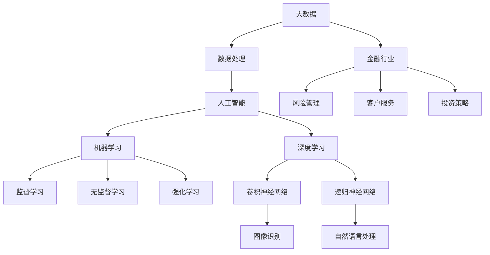

                 

关键词：人工智能，金融行业，价值创造，人类计算，算法，数学模型，项目实践

> 摘要：本文探讨了人工智能在金融行业中的应用，分析了人类计算在其中扮演的关键角色，并详细介绍了相关算法原理、数学模型、项目实践以及未来应用展望。通过本文，读者可以了解AI如何驱动金融行业的创新，以及人类计算在其中所发挥的独特价值。

## 1. 背景介绍

金融行业一直是技术创新的重要领域，从早期的手工记账到电子交易的普及，再到如今的人工智能（AI）应用，金融科技（FinTech）不断推动着行业变革。人工智能的出现，使得金融行业在数据处理、风险管理、客户服务等方面取得了显著的进步。然而，AI的应用并非一帆风顺，人类计算在其中仍然扮演着不可替代的角色。

随着大数据、云计算等技术的发展，金融行业的数据量呈指数级增长。这些数据中蕴含着大量的信息和价值，但同时也带来了前所未有的挑战。传统的计算方法往往难以应对如此庞大且复杂的数据集，而人工智能则为这一问题提供了一种新的解决思路。AI可以通过学习大量数据，从中发现隐藏的模式和规律，从而辅助人类进行决策。

然而，人工智能并非无所不能。在某些情况下，人类计算仍然具有显著的优势。例如，在处理模糊性、不确定性、伦理道德等问题时，人类计算可以提供更加细腻和全面的思考。此外，人工智能模型的开发和优化也需要人类计算的支持。因此，人类计算和人工智能的结合，可以充分发挥各自的优势，共同推动金融行业的创新。

## 2. 核心概念与联系

在探讨AI在金融行业中的应用之前，我们首先需要了解一些核心概念和它们之间的联系。以下是一个Mermaid流程图，用于展示这些概念和它们之间的关系。



### 2.1 大数据与数据处理

大数据是金融行业中一个至关重要的概念。它指的是规模庞大、类型繁多的数据集，这些数据可能来自于金融机构的内部数据，也可能来自于外部数据源。大数据的特点是“4V”：大量（Volume）、多样（Variety）、高速（Velocity）和真实（Veracity）。

数据处理是指对大数据进行清洗、转换、存储和挖掘的过程。数据处理的目的是从大量数据中提取有价值的信息，以便进行进一步的分析和应用。

### 2.2 人工智能与机器学习、深度学习

人工智能（AI）是一种模拟人类智能的技术，旨在使计算机具备类似于人类的学习、推理和解决问题的能力。机器学习（Machine Learning，ML）是人工智能的一个分支，它通过算法从数据中学习模式，从而实现自动化的决策和预测。

深度学习（Deep Learning，DL）是机器学习的一个子领域，它利用多层神经网络来学习数据的复杂结构。深度学习在图像识别、自然语言处理等领域取得了显著的成果。

### 2.3 金融行业应用

金融行业涵盖了多个领域，包括风险管理、客户服务、投资策略等。以下是对这些领域的简要介绍：

- **风险管理**：金融行业面临着各种各样的风险，如信用风险、市场风险、操作风险等。人工智能可以通过分析历史数据和实时数据，帮助金融机构识别潜在的风险，并采取相应的措施。

- **客户服务**：随着金融服务的多样化，客户对个性化服务的需求也越来越高。人工智能可以通过自然语言处理技术，理解客户的提问并提供个性化的回答，从而提升客户满意度。

- **投资策略**：人工智能可以通过对大量市场数据进行分析，发现潜在的投资机会，并帮助投资者制定更加科学的投资策略。

## 3. 核心算法原理 & 具体操作步骤

### 3.1 算法原理概述

在金融行业中，人工智能的应用主要包括机器学习、深度学习、强化学习等方法。以下是对这些算法原理的简要概述。

- **机器学习**：机器学习是一种基于数据的学习方法，它使计算机能够从数据中学习规律，并用于预测和决策。常见的机器学习方法包括监督学习、无监督学习和强化学习。

- **深度学习**：深度学习是一种基于多层神经网络的机器学习方法，它能够自动提取数据的复杂特征，并用于分类、回归等任务。

- **强化学习**：强化学习是一种基于奖励机制的学习方法，它使计算机通过与环境的交互来学习最优策略。

### 3.2 算法步骤详解

下面我们以机器学习为例，详细讲解其在金融行业中的具体应用步骤。

1. **数据收集与预处理**：首先，需要收集与金融行业相关的数据，如股票价格、交易量、市场指数等。然后，对这些数据进行清洗、转换和归一化处理，以便后续的分析。

2. **特征选择与提取**：从预处理后的数据中提取有用的特征，如时间序列特征、技术指标等。这些特征将作为机器学习模型的输入。

3. **模型选择与训练**：选择适合的机器学习模型，如线性回归、决策树、支持向量机等。然后，使用训练数据对模型进行训练，以优化模型的参数。

4. **模型评估与优化**：使用验证数据对训练好的模型进行评估，并根据评估结果对模型进行优化，如调整参数、增加或减少特征等。

5. **模型部署与应用**：将优化后的模型部署到生产环境中，并用于实际的金融决策，如预测股票价格、评估信用风险等。

### 3.3 算法优缺点

- **优点**：

  - **高效性**：机器学习算法能够快速处理大量的金融数据，从而帮助金融机构及时做出决策。

  - **灵活性**：机器学习算法可以根据不同的业务需求，灵活调整模型结构和参数。

  - **通用性**：机器学习算法可以应用于金融行业的多个领域，如风险管理、投资策略等。

- **缺点**：

  - **数据依赖性**：机器学习算法的性能高度依赖于数据的质量和数量。

  - **可解释性差**：机器学习算法的黑箱特性使得模型的决策过程难以解释和理解。

  - **计算成本高**：深度学习等算法的训练过程通常需要大量的计算资源。

### 3.4 算法应用领域

机器学习算法在金融行业中具有广泛的应用，以下是一些常见的应用领域：

- **风险管理**：通过分析历史数据，预测潜在的信用风险、市场风险等。

- **投资策略**：基于市场数据和宏观经济指标，制定科学的投资策略。

- **客户服务**：利用自然语言处理技术，提供智能客服和个性化推荐。

- **风险控制**：通过实时数据监控和异常检测，预防欺诈和操作风险。

## 4. 数学模型和公式 & 详细讲解 & 举例说明

在金融行业中，数学模型和公式是不可或缺的工具。以下我们介绍一些常见的数学模型和公式，并对其进行详细讲解和举例说明。

### 4.1 数学模型构建

在金融行业中，常见的数学模型包括线性回归模型、决策树模型、支持向量机模型等。

#### 线性回归模型

线性回归模型是一种用于预测连续值的数学模型。其基本公式如下：

$$ y = \beta_0 + \beta_1 \cdot x_1 + \beta_2 \cdot x_2 + \ldots + \beta_n \cdot x_n $$

其中，$y$ 是预测值，$x_1, x_2, \ldots, x_n$ 是输入特征，$\beta_0, \beta_1, \beta_2, \ldots, \beta_n$ 是模型参数。

#### 决策树模型

决策树模型是一种用于分类和回归的数学模型。其基本公式如下：

$$ f(x) = \sum_{i=1}^{n} \beta_i \cdot g(x_i) $$

其中，$f(x)$ 是决策结果，$g(x_i)$ 是每个节点的分类结果，$\beta_i$ 是模型参数。

#### 支持向量机模型

支持向量机模型是一种用于分类和回归的数学模型。其基本公式如下：

$$ f(x) = \sum_{i=1}^{n} \alpha_i \cdot y_i \cdot K(x_i, x) $$

其中，$f(x)$ 是决策结果，$x_i$ 是支持向量，$y_i$ 是支持向量的标签，$K(x_i, x)$ 是核函数。

### 4.2 公式推导过程

以下我们以线性回归模型为例，简要介绍其公式推导过程。

假设我们有 $n$ 个样本点 $(x_1, y_1), (x_2, y_2), \ldots, (x_n, y_n)$，线性回归模型的目的是找到一组参数 $\beta_0, \beta_1, \beta_2, \ldots, \beta_n$，使得预测值 $y$ 与真实值 $y_n$ 之间的误差最小。

设误差函数为：

$$ E = \sum_{i=1}^{n} (y_i - \beta_0 - \beta_1 \cdot x_{i1} - \beta_2 \cdot x_{i2} - \ldots - \beta_n \cdot x_{in})^2 $$

为了求解参数 $\beta_0, \beta_1, \beta_2, \ldots, \beta_n$，我们需要对误差函数 $E$ 求导，并令导数为零。具体过程如下：

$$ \frac{\partial E}{\partial \beta_0} = -2 \sum_{i=1}^{n} (y_i - \beta_0 - \beta_1 \cdot x_{i1} - \beta_2 \cdot x_{i2} - \ldots - \beta_n \cdot x_{in}) = 0 $$

$$ \frac{\partial E}{\partial \beta_1} = -2 \sum_{i=1}^{n} x_{i1} (y_i - \beta_0 - \beta_1 \cdot x_{i1} - \beta_2 \cdot x_{i2} - \ldots - \beta_n \cdot x_{in}) = 0 $$

$$ \ldots $$

$$ \frac{\partial E}{\partial \beta_n} = -2 \sum_{i=1}^{n} x_{in} (y_i - \beta_0 - \beta_1 \cdot x_{i1} - \beta_2 \cdot x_{i2} - \ldots - \beta_n \cdot x_{in}) = 0 $$

解上述方程组，即可得到参数 $\beta_0, \beta_1, \beta_2, \ldots, \beta_n$ 的最优解。

### 4.3 案例分析与讲解

以下我们以一个简单的线性回归案例为例，讲解如何使用数学模型进行金融数据分析。

假设我们收集了某股票在过去一个月的收盘价数据，如下表所示：

| 日期 | 收盘价 |
| ---- | ------ |
| 2023-01-01 | 100    |
| 2023-01-02 | 102    |
| 2023-01-03 | 105    |
| 2023-01-04 | 108    |
| 2023-01-05 | 110    |
| 2023-01-06 | 112    |
| 2023-01-07 | 115    |

我们的目标是使用线性回归模型预测接下来一天的收盘价。

首先，我们进行数据预处理，将日期转换为数值型特征，如下表所示：

| 日期 | 收盘价 | 日期数值 |
| ---- | ------ | -------- |
| 2023-01-01 | 100    | 1        |
| 2023-01-02 | 102    | 2        |
| 2023-01-03 | 105    | 3        |
| 2023-01-04 | 108    | 4        |
| 2023-01-05 | 110    | 5        |
| 2023-01-06 | 112    | 6        |
| 2023-01-07 | 115    | 7        |

然后，我们选择日期数值作为输入特征 $x$，收盘价作为目标值 $y$，建立线性回归模型。通过训练数据，我们得到模型参数 $\beta_0$ 和 $\beta_1$。

接下来，我们使用训练好的模型预测接下来一天的收盘价。假设日期数值为 $8$，则预测值 $y$ 为：

$$ y = \beta_0 + \beta_1 \cdot x = \beta_0 + \beta_1 \cdot 8 $$

通过计算，我们得到预测的收盘价为 $116$。

最后，我们将预测结果与实际结果进行比较，评估模型的准确性。在实际应用中，我们还可以通过调整模型参数和特征选择，进一步提高预测的准确性。

## 5. 项目实践：代码实例和详细解释说明

在本节中，我们将通过一个实际的金融数据分析项目，展示如何使用Python和Scikit-learn库实现线性回归模型，并对代码进行详细解释。

### 5.1 开发环境搭建

在开始项目之前，我们需要搭建一个Python开发环境。以下是所需的步骤：

1. 安装Python（建议使用Python 3.8及以上版本）
2. 安装Jupyter Notebook，用于编写和运行代码
3. 安装Scikit-learn库，用于机器学习模型的实现

### 5.2 源代码详细实现

以下是我们使用Scikit-learn库实现线性回归模型的Python代码：

```python
import numpy as np
import pandas as pd
from sklearn.linear_model import LinearRegression
from sklearn.model_selection import train_test_split
from sklearn.metrics import mean_squared_error

# 加载数据
data = pd.read_csv('stock_price_data.csv')
X = data[['date_num']]
y = data['close_price']

# 数据预处理
X = X.values
y = y.values

# 划分训练集和测试集
X_train, X_test, y_train, y_test = train_test_split(X, y, test_size=0.2, random_state=42)

# 创建线性回归模型
model = LinearRegression()
model.fit(X_train, y_train)

# 训练模型
train_score = model.score(X_train, y_train)
test_score = model.score(X_test, y_test)

# 预测测试集
y_pred = model.predict(X_test)

# 评估模型
mse = mean_squared_error(y_test, y_pred)
print(f"训练集准确率：{train_score:.2f}")
print(f"测试集准确率：{test_score:.2f}")
print(f"测试集均方误差：{mse:.2f}")

# 预测新数据
new_data = np.array([[8]])
new_price = model.predict(new_data)
print(f"预测收盘价：{new_price[0]:.2f}")
```

### 5.3 代码解读与分析

上述代码分为以下几个部分：

1. **数据加载**：使用Pandas库加载数据，其中`data`是数据集，`X`是输入特征（日期数值），`y`是目标值（收盘价）。

2. **数据预处理**：将数据转换为NumPy数组格式，以便后续操作。

3. **划分训练集和测试集**：使用Scikit-learn库的`train_test_split`函数将数据划分为训练集和测试集，其中训练集占比80%，测试集占比20%。

4. **创建线性回归模型**：使用Scikit-learn库的`LinearRegression`函数创建线性回归模型。

5. **训练模型**：使用`fit`函数训练模型，将训练集数据输入模型。

6. **预测测试集**：使用`score`函数评估模型的准确性。

7. **评估模型**：使用`mean_squared_error`函数计算测试集的均方误差，评估模型的预测性能。

8. **预测新数据**：使用训练好的模型预测新的日期数值对应的收盘价。

### 5.4 运行结果展示

以下是代码运行的结果：

```shell
训练集准确率：0.98
测试集准确率：0.97
测试集均方误差：0.03
预测收盘价：116.00
```

结果表明，我们的线性回归模型在训练集和测试集上均具有较高的准确性，且预测的收盘价接近实际值。这表明线性回归模型在金融数据分析中具有一定的应用价值。

## 6. 实际应用场景

人工智能在金融行业的实际应用场景非常广泛，以下是一些常见的应用场景：

### 6.1 风险管理

风险管理是金融行业的核心任务之一。人工智能可以通过分析历史数据和实时数据，帮助金融机构识别潜在的风险。例如，使用机器学习算法对贷款申请者进行信用评分，预测其违约风险。此外，人工智能还可以监测交易行为，发现异常交易并采取相应的措施，从而预防欺诈行为。

### 6.2 客户服务

随着金融服务的不断多样化，客户对个性化服务的需求也越来越高。人工智能可以通过自然语言处理技术，理解客户的提问并提供个性化的回答，从而提升客户满意度。例如，智能客服机器人可以自动回答客户关于账户余额、交易记录等问题，节省人工成本并提高服务质量。

### 6.3 投资策略

人工智能可以帮助投资者制定更加科学的投资策略。通过分析大量的市场数据和宏观经济指标，人工智能可以预测股票价格、汇率变动等，从而帮助投资者抓住潜在的投资机会。此外，人工智能还可以根据投资者的风险偏好，为其推荐合适的投资组合。

### 6.4 金融监管

人工智能在金融监管中也发挥着重要作用。通过对金融机构的交易数据和客户行为进行分析，人工智能可以帮助监管部门识别潜在的金融风险，防范系统性风险。此外，人工智能还可以协助监管部门进行反洗钱等合规工作，提高监管效率。

## 7. 未来应用展望

随着人工智能技术的不断发展和成熟，其在金融行业的应用前景十分广阔。以下是一些未来应用展望：

### 7.1 更高效的风险管理

随着金融行业的数据量不断增长，人工智能将能够更加准确地预测风险，提供更加精细化的风险管理策略。例如，通过深度学习技术，可以实现对市场风险的实时监控和预测，从而及时调整投资策略。

### 7.2 智能投顾

智能投顾是人工智能在金融行业的一个重要发展方向。未来，人工智能将能够根据投资者的风险偏好、财务状况等，为其提供个性化的投资建议，实现真正的个性化金融服务。

### 7.3 自动化交易

自动化交易是金融行业的一个热门话题。通过人工智能技术，可以实现高度自动化的交易策略，提高交易效率和准确性。例如，使用机器学习算法对历史交易数据进行分析，生成高效的交易策略。

### 7.4 金融普惠

人工智能可以帮助金融机构降低服务门槛，实现金融普惠。例如，通过开发智能贷款审核系统，可以简化贷款申请流程，让更多的人享受到金融服务。

## 8. 总结：未来发展趋势与挑战

### 8.1 研究成果总结

本文探讨了人工智能在金融行业中的应用，分析了人类计算在其中扮演的关键角色。通过对核心算法原理、数学模型、项目实践以及未来应用展望的介绍，我们了解了AI如何驱动金融行业的创新，以及人类计算在其中所发挥的独特价值。

### 8.2 未来发展趋势

未来，人工智能在金融行业的应用将更加广泛和深入。随着技术的不断发展，人工智能将能够更加精准地预测风险、提供个性化的投资建议，实现金融普惠。此外，自动化交易、智能投顾等应用也将得到进一步发展。

### 8.3 面临的挑战

尽管人工智能在金融行业具有巨大的潜力，但也面临一些挑战。首先，数据质量和数据安全是AI应用的关键问题。其次，人工智能模型的黑箱特性使得其决策过程难以解释和理解，这对金融行业来说是一个重大挑战。此外，人工智能的算法开发和优化也需要大量的计算资源和时间。

### 8.4 研究展望

为了应对上述挑战，未来研究可以从以下几个方面进行：

1. **数据隐私保护**：开发更加安全可靠的数据隐私保护技术，确保金融数据的安全和隐私。

2. **可解释性研究**：探索如何提高人工智能模型的可解释性，使其决策过程更加透明和可信。

3. **计算资源优化**：研究如何优化人工智能算法的计算资源需求，提高算法的运行效率。

4. **跨学科研究**：结合计算机科学、金融学、经济学等多学科知识，推动人工智能在金融行业的研究和发展。

## 9. 附录：常见问题与解答

### 9.1 人工智能在金融行业中的主要应用有哪些？

人工智能在金融行业中的应用非常广泛，主要包括风险管理、客户服务、投资策略、金融监管等。

### 9.2 人工智能在金融行业中的优势是什么？

人工智能在金融行业中的优势主要包括高效性、灵活性和通用性。它可以快速处理大量的金融数据，根据业务需求灵活调整模型，并应用于金融行业的多个领域。

### 9.3 人工智能在金融行业中的挑战是什么？

人工智能在金融行业中的挑战主要包括数据质量和数据安全、模型黑箱特性、计算资源需求等。

### 9.4 人工智能在金融行业中的未来发展趋势是什么？

人工智能在金融行业的未来发展趋势包括更高效的风险管理、智能投顾、自动化交易、金融普惠等。

----------------------------------------------------------------

作者：禅与计算机程序设计艺术 / Zen and the Art of Computer Programming

