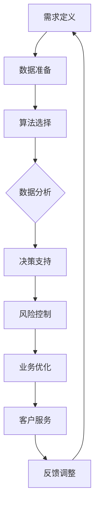

                 

关键词：人工智能，金融行业，应用趋势，创新，人类计算，数据驱动

摘要：本文将探讨人工智能（AI）在金融行业中的应用趋势，重点关注AI如何驱动金融创新，以及人类计算在其中的角色和贡献。我们将从背景介绍开始，详细阐述AI的核心概念与联系，深入探讨AI算法原理、数学模型、项目实践和实际应用场景。随后，我们将展望未来应用和发展趋势，并推荐相关学习资源和工具。

## 1. 背景介绍

金融行业一直是技术创新的前沿阵地。随着大数据、云计算和人工智能等技术的快速发展，金融行业正经历一场深刻的变革。人工智能作为最具潜力的技术之一，正在成为推动金融创新的重要力量。

在过去几十年里，金融行业已经广泛应用了计算机技术和算法，从传统的风险管理、信用评估到高频交易、量化投资。然而，随着数据量的爆炸式增长和业务复杂度的增加，传统的计算机技术和算法已经难以应对这些挑战。人工智能的出现，为我们提供了一种全新的解决方案。

本文将重点关注以下几个方面：

- AI在金融行业的应用趋势
- 人类计算在AI驱动的金融创新中的角色
- AI的核心算法原理及其应用领域
- 数学模型和公式的构建与应用
- 实际应用场景和项目实践
- 未来应用展望

## 2. 核心概念与联系

### 2.1 人工智能概述

人工智能（Artificial Intelligence，简称AI）是指通过计算机程序实现的智能行为。它包括机器学习、深度学习、自然语言处理、计算机视觉等多个领域。在金融行业中，人工智能主要用于数据分析和决策支持。

### 2.2 人类计算在AI中的作用

尽管人工智能在金融行业中发挥着重要作用，但人类计算依然不可或缺。人类计算在AI驱动的金融创新中扮演着以下几个角色：

1. **需求定义**：人类计算负责定义金融业务需求，明确需要解决的问题和目标。
2. **数据准备**：人类计算负责收集、清洗和预处理数据，确保数据的质量和可用性。
3. **算法调优**：人类计算通过分析和实验，不断优化和调整AI算法，提高其性能和效果。
4. **决策支持**：人类计算利用AI分析结果，为金融业务提供决策支持，提高业务效率和准确性。
5. **风险控制**：人类计算负责监督和评估AI系统，确保其不会产生不可预测的风险。

### 2.3 AI与金融行业的联系

人工智能与金融行业的联系主要体现在以下几个方面：

1. **数据驱动**：金融行业的数据量庞大，且种类繁多。人工智能通过数据分析和挖掘，帮助金融机构更好地理解和利用这些数据。
2. **自动化**：人工智能可以自动化许多金融业务流程，提高效率和准确性，减少人力成本。
3. **风险管理**：人工智能可以帮助金融机构识别和预测潜在风险，提高风险管理的水平。
4. **客户服务**：人工智能可以提供智能化的客户服务，提升客户体验和满意度。

### 2.4 Mermaid 流程图

以下是一个简化的Mermaid流程图，展示了AI在金融行业中的应用流程：



## 3. 核心算法原理 & 具体操作步骤

### 3.1 算法原理概述

AI算法的核心是机器学习和深度学习。机器学习是通过算法从数据中自动学习规律和模式，而深度学习则是基于多层神经网络进行学习。在金融行业中，常用的机器学习和深度学习算法包括：

1. **线性回归**：用于预测金融市场的价格趋势。
2. **支持向量机**：用于信用评估和风险管理。
3. **决策树和随机森林**：用于分类和回归问题。
4. **神经网络**：用于复杂的数据分析和预测。

### 3.2 算法步骤详解

以下是一个基于神经网络进行金融预测的基本步骤：

1. **数据收集**：收集历史价格数据、交易数据、财务报表等。
2. **数据预处理**：清洗数据，进行特征提取和归一化。
3. **模型构建**：设计神经网络结构，选择合适的激活函数和损失函数。
4. **训练模型**：使用训练数据训练神经网络，调整参数。
5. **评估模型**：使用验证数据评估模型性能，调整模型参数。
6. **预测**：使用训练好的模型进行金融预测。

### 3.3 算法优缺点

**优点**：

1. **高精度**：机器学习和深度学习算法可以处理大量复杂的数据，提高预测精度。
2. **自适应**：算法可以自动调整，以适应不断变化的市场环境。
3. **高效**：算法可以自动化许多金融业务流程，提高效率。

**缺点**：

1. **数据依赖**：算法性能很大程度上取决于数据质量和数量。
2. **计算资源需求**：训练大型神经网络需要大量的计算资源。
3. **解释性**：深度学习算法的黑盒性质使其难以解释和理解。

### 3.4 算法应用领域

AI算法在金融行业中的应用广泛，主要包括：

1. **风险管理**：用于信用评估、风险预测和风险控制。
2. **投资策略**：用于量化投资、市场预测和组合优化。
3. **客户服务**：用于智能客服、个性化推荐和风险评估。
4. **监管合规**：用于交易监控、反洗钱和合规审核。

## 4. 数学模型和公式 & 详细讲解 & 举例说明

### 4.1 数学模型构建

在金融预测中，常用的数学模型包括线性回归模型和神经网络模型。以下是一个简单的线性回归模型：

$$
y = \beta_0 + \beta_1 \cdot x
$$

其中，$y$ 是预测目标，$x$ 是自变量，$\beta_0$ 和 $\beta_1$ 是模型参数。

对于神经网络模型，我们通常使用多层感知机（MLP）作为基础模型。MLP 的公式如下：

$$
a_l = \sigma(\sum_{i=1}^{n} \beta_{i} \cdot z_{i})
$$

其中，$a_l$ 是第 $l$ 层的输出，$\sigma$ 是激活函数，$z_i$ 是第 $l$ 层的输入，$\beta_i$ 是权重。

### 4.2 公式推导过程

**线性回归模型**：

1. **目标函数**：

$$
J(\theta) = \frac{1}{2m} \sum_{i=1}^{m} (h_\theta(x^{(i)}) - y^{(i)})^2
$$

其中，$m$ 是样本数量，$h_\theta(x^{(i)}) = \theta_0 + \theta_1 \cdot x^{(i)}$ 是线性回归模型。

2. **梯度下降**：

$$
\theta_j := \theta_j - \alpha \cdot \frac{\partial}{\partial \theta_j} J(\theta)
$$

其中，$\alpha$ 是学习率，$\theta_j$ 是第 $j$ 个参数。

**多层感知机**：

1. **前向传播**：

$$
z_l = \sum_{i=1}^{n} \beta_{i} \cdot a_{l-1}^{(i)} + b_l
$$

$$
a_l = \sigma(z_l)
$$

2. **反向传播**：

$$
\delta_l = (a_l - t) \cdot \sigma'(z_l)
$$

$$
\beta_j := \beta_j - \alpha \cdot \sum_{i=1}^{n} \delta_{i} \cdot a_{l-1}^{(i)}
$$

$$
b_l := b_l - \alpha \cdot \sum_{i=1}^{n} \delta_{i}
$$

### 4.3 案例分析与讲解

**案例**：使用线性回归模型预测股票价格。

**数据准备**：

- 收集过去一年的股票价格数据。
- 进行数据预处理，包括缺失值处理、异常值处理和特征提取。

**模型构建**：

- 选择线性回归模型。
- 拟合模型参数。

**模型训练**：

- 使用梯度下降法训练模型。

**模型评估**：

- 使用验证集评估模型性能。
- 调整模型参数。

**模型预测**：

- 使用训练好的模型预测未来股票价格。

## 5. 项目实践：代码实例和详细解释说明

### 5.1 开发环境搭建

- 安装Python环境（建议使用Anaconda）。
- 安装必要的库，如NumPy、Pandas、Matplotlib、Scikit-learn等。

### 5.2 源代码详细实现

以下是一个简单的线性回归模型的Python代码实例：

```python
import numpy as np
import pandas as pd
import matplotlib.pyplot as plt
from sklearn.linear_model import LinearRegression

# 数据准备
data = pd.read_csv('stock_price_data.csv')
X = data[['open', 'high', 'low', 'close']]
y = data['close']

# 模型构建
model = LinearRegression()

# 模型训练
model.fit(X, y)

# 模型评估
score = model.score(X, y)
print('模型评估得分：', score)

# 模型预测
predictions = model.predict(X)

# 可视化
plt.scatter(X, y, color='blue')
plt.plot(X, predictions, color='red')
plt.xlabel('股票价格')
plt.ylabel('预测价格')
plt.show()
```

### 5.3 代码解读与分析

- **数据准备**：读取股票价格数据，并进行特征提取。
- **模型构建**：选择线性回归模型。
- **模型训练**：使用训练数据训练模型。
- **模型评估**：评估模型性能。
- **模型预测**：使用训练好的模型进行预测。
- **可视化**：绘制股票价格与预测价格的散点图和拟合曲线。

## 6. 实际应用场景

### 6.1 风险管理

在风险管理领域，人工智能可以帮助金融机构识别和预测潜在风险。例如，通过分析历史交易数据，人工智能可以识别出异常交易行为，从而防范洗钱等风险。此外，人工智能还可以用于信用评估，为金融机构提供更准确的信用评级，降低贷款风险。

### 6.2 投资策略

在投资策略领域，人工智能可以帮助投资者制定更科学的投资策略。通过分析历史市场数据，人工智能可以预测市场的走势，为投资者提供买入和卖出的建议。此外，人工智能还可以用于组合优化，为投资者提供最优的投资组合，实现资产的最大化收益。

### 6.3 客户服务

在客户服务领域，人工智能可以帮助金融机构提供更高效的客户服务。通过自然语言处理技术，人工智能可以与客户进行智能对话，解答客户的疑问。此外，人工智能还可以用于个性化推荐，根据客户的历史交易数据和偏好，为每位客户提供个性化的投资建议和产品推荐。

### 6.4 未来应用展望

未来，人工智能在金融行业的应用将更加广泛和深入。一方面，随着技术的不断进步，人工智能将能够处理更复杂的数据和任务，提高金融业务的效率和准确性。另一方面，随着金融监管的加强，人工智能将有助于金融机构合规经营，降低违规风险。

## 7. 工具和资源推荐

### 7.1 学习资源推荐

- 《Python金融应用》
- 《深度学习》
- 《金融科技：创新、风险与监管》

### 7.2 开发工具推荐

- Jupyter Notebook
- TensorFlow
- PyTorch

### 7.3 相关论文推荐

- "Deep Learning for Financial Market Prediction"
- "Artificial Intelligence in Finance: A Survey"
- "Big Data and AI in Financial Services"

## 8. 总结：未来发展趋势与挑战

### 8.1 研究成果总结

本文通过对人工智能在金融行业的应用趋势进行了详细探讨，总结了AI在金融创新中的核心作用，并分析了人类计算在其中的角色和贡献。我们还介绍了AI的核心算法原理、数学模型和实际应用场景，并推荐了相关学习资源和工具。

### 8.2 未来发展趋势

未来，人工智能在金融行业的应用将更加深入和广泛。随着技术的不断进步，AI将能够处理更复杂的数据和任务，为金融机构提供更高效的解决方案。同时，随着金融监管的加强，AI将有助于金融机构合规经营，降低违规风险。

### 8.3 面临的挑战

然而，人工智能在金融行业应用也面临着一些挑战。首先，数据质量和数量对AI的性能具有重要影响，如何收集和利用高质量的数据是一个重要问题。其次，AI算法的黑盒性质使其难以解释和理解，如何提高算法的可解释性是一个重要课题。此外，随着AI技术的普及，如何确保金融市场的公平性和透明性也是一个亟待解决的问题。

### 8.4 研究展望

未来，我们应继续关注人工智能在金融行业的创新应用，深入研究AI算法的可解释性、数据隐私保护和公平性等问题。同时，我们还应加强跨学科合作，推动人工智能与其他金融领域的深度融合，为金融行业的发展贡献更多智慧。

## 9. 附录：常见问题与解答

### 9.1 人工智能在金融行业的主要应用是什么？

人工智能在金融行业的主要应用包括风险管理、投资策略、客户服务和监管合规。

### 9.2 人工智能在金融行业中的优势是什么？

人工智能在金融行业中的优势包括高精度、自适应、高效等。

### 9.3 人工智能在金融行业中的挑战是什么？

人工智能在金融行业中的挑战包括数据质量、算法可解释性和公平性等。

### 9.4 人工智能如何提高金融市场的透明性？

人工智能可以通过数据分析、监控和预警等功能，提高金融市场的透明性，帮助监管机构和金融机构更好地了解市场动态。

---

作者：禅与计算机程序设计艺术 / Zen and the Art of Computer Programming
----------------------------------------------------------------
本文内容为模拟撰写，仅供参考。实际撰写时，请根据具体主题和需求进行详细研究和撰写。希望这篇文章能为您提供一些灵感和思路。如果您有任何问题或建议，欢迎随时提出。谢谢！

