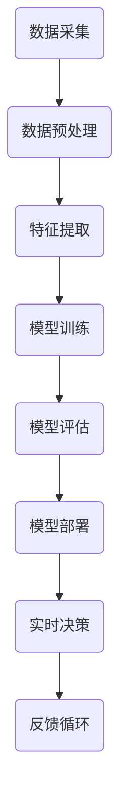

                 

关键词：人工智能，金融，计算，创新，应用领域

> 摘要：本文探讨了人工智能（AI）在金融领域的应用潜力，通过分析核心算法原理、数学模型、项目实践及未来发展趋势，揭示了人类计算在金融领域的重要角色，为金融科技的发展提供了新的视角和思路。

## 1. 背景介绍

金融行业作为现代经济的核心，随着信息技术的发展，经历了从手工操作到自动化、再到智能化的演变。传统金融业务依赖于人工分析和操作，效率低下且易出错。而随着人工智能技术的迅速崛起，人类计算在金融领域的潜力逐渐显现。AI能够通过大数据分析和机器学习算法，实现智能风控、智能投顾、智能交易等，极大地提高了金融行业的效率和准确性。

### 1.1 人工智能的发展历程

人工智能的概念最早可以追溯到20世纪50年代。经过几十年的发展，人工智能经历了从符号主义、连接主义到现代深度学习的多个阶段。在金融领域，人工智能的应用也逐渐从简单的自动化工具，发展到复杂的智能决策支持系统。

### 1.2 金融行业的数字化转型

随着互联网、大数据、云计算等技术的发展，金融行业正在经历一场数字化转型。金融机构通过引入人工智能技术，不仅能够提高运营效率，还能为客户提供更加个性化、精准的服务。

## 2. 核心概念与联系

在讨论人工智能在金融领域的应用之前，我们需要先了解一些核心概念和它们之间的联系。以下是一个使用Mermaid绘制的流程图，展示了金融AI系统的基本架构。



### 2.1 数据采集

数据是人工智能的基础。在金融领域，数据来源包括交易记录、用户行为、市场新闻等。这些数据通过数据采集模块收集，为后续分析提供基础。

### 2.2 数据预处理

原始数据通常包含噪声和缺失值，需要通过数据预处理模块进行清洗和格式化。这一步对于确保模型训练质量至关重要。

### 2.3 特征提取

在金融AI系统中，特征提取是一个关键步骤。通过对数据进行转换和提取，可以得到有助于预测和分类的特征，如价格波动、成交量等。

### 2.4 模型训练

模型训练是金融AI系统的核心。通过机器学习算法，从特征中学习规律，构建预测模型。常见的算法包括神经网络、支持向量机等。

### 2.5 模型评估

模型训练完成后，需要通过模型评估来验证其性能。评估指标包括准确率、召回率、F1值等。

### 2.6 模型部署

评估合格的模型会被部署到生产环境中，进行实时决策。例如，在智能投顾系统中，模型会根据用户风险偏好和市场数据，提供投资建议。

### 2.7 反馈循环

模型的性能不仅取决于算法和训练数据，还受到外部环境的影响。通过反馈循环，可以不断调整和优化模型，提高其适应性。

## 3. 核心算法原理 & 具体操作步骤

### 3.1 算法原理概述

在金融AI系统中，常用的算法包括神经网络、决策树、随机森林等。以下以神经网络为例，简要介绍其原理。

神经网络是一种模拟人脑神经元工作的计算模型，通过多个层次的神经元互联，实现从输入到输出的映射。在金融AI中，神经网络可用于股票预测、信贷风险评估等。

### 3.2 算法步骤详解

#### 3.2.1 数据采集

数据采集是神经网络训练的基础。收集数据后，进行数据预处理，包括数据清洗、归一化等。

#### 3.2.2 构建神经网络模型

根据问题需求，构建合适的神经网络模型。通常包括输入层、隐藏层和输出层。选择合适的激活函数，如ReLU、Sigmoid等。

#### 3.2.3 模型训练

使用预处理后的数据训练神经网络模型。通过反向传播算法，不断调整模型参数，降低预测误差。

#### 3.2.4 模型评估

使用验证集和测试集对训练好的模型进行评估。根据评估指标，调整模型结构和参数。

#### 3.2.5 模型部署

评估合格的模型会被部署到生产环境中，进行实时预测和决策。

### 3.3 算法优缺点

#### 优点

- 强大的非线性拟合能力
- 自适应性和学习能力
- 可以处理大规模数据

#### 缺点

- 计算资源消耗大
- 需要大量数据
- 难以解释

### 3.4 算法应用领域

神经网络在金融领域的应用广泛，如股票预测、信用评分、风险控制等。以下是一些具体的应用场景：

- 智能投顾：根据用户风险偏好和市场数据，提供投资建议。
- 风险控制：预测客户违约风险，降低金融机构损失。
- 量化交易：基于历史数据，自动执行交易策略。

## 4. 数学模型和公式 & 详细讲解 & 举例说明

在金融AI中，数学模型和公式扮演着关键角色。以下介绍一些常用的数学模型和公式，并结合实际案例进行讲解。

### 4.1 数学模型构建

在金融AI中，常用的数学模型包括线性回归、逻辑回归、神经网络等。以下以线性回归为例，介绍其构建过程。

#### 4.1.1 线性回归模型

线性回归模型是一种简单的预测模型，用于描述两个变量之间的关系。其公式如下：

$$y = wx + b$$

其中，$y$ 是因变量，$x$ 是自变量，$w$ 是权重，$b$ 是偏置。

#### 4.1.2 模型构建步骤

1. 数据采集：收集自变量和因变量的数据。
2. 数据预处理：对数据进行清洗、归一化等处理。
3. 模型训练：使用训练数据，通过梯度下降等算法，求解权重和偏置。
4. 模型评估：使用验证集和测试集，评估模型性能。

### 4.2 公式推导过程

在推导线性回归模型时，我们通常使用最小二乘法求解权重和偏置。其推导过程如下：

1. 定义损失函数：$$J(w, b) = \frac{1}{2}\sum_{i=1}^{n}(y_i - wx_i - b)^2$$
2. 对损失函数求导：$$\frac{\partial J}{\partial w} = \sum_{i=1}^{n}(y_i - wx_i - b)x_i$$ $$\frac{\partial J}{\partial b} = \sum_{i=1}^{n}(y_i - wx_i - b)$$
3. 令导数为0，解方程组：$$\frac{\partial J}{\partial w} = 0$$ $$\frac{\partial J}{\partial b} = 0$$

通过求解方程组，可以得到最优权重和偏置。

### 4.3 案例分析与讲解

以下以股票价格预测为例，介绍线性回归模型的应用。

#### 4.3.1 数据采集

收集过去一年的股票价格数据，包括开盘价、收盘价、最高价、最低价等。

#### 4.3.2 数据预处理

对数据进行清洗和归一化处理，以便于模型训练。

#### 4.3.3 模型训练

使用训练数据，通过最小二乘法求解权重和偏置。

#### 4.3.4 模型评估

使用验证集和测试集，评估模型性能。根据评估结果，调整模型参数。

#### 4.3.5 预测

使用训练好的模型，预测未来股票价格。

## 5. 项目实践：代码实例和详细解释说明

在本节中，我们将通过一个简单的项目实例，介绍如何在金融领域应用人工智能技术。以下是一个基于Python的股票价格预测项目。

### 5.1 开发环境搭建

- Python 3.x
- Jupyter Notebook
- Pandas
- Scikit-learn

### 5.2 源代码详细实现

```python
# 导入所需库
import pandas as pd
from sklearn.linear_model import LinearRegression
from sklearn.model_selection import train_test_split
from sklearn.metrics import mean_squared_error

# 数据采集
data = pd.read_csv('stock_data.csv')
data.head()

# 数据预处理
data = data[['Open', 'Close', 'High', 'Low']]
data = data.dropna()

# 特征提取
X = data[['Open', 'High', 'Low']]
y = data['Close']

# 模型训练
X_train, X_test, y_train, y_test = train_test_split(X, y, test_size=0.2, random_state=42)
model = LinearRegression()
model.fit(X_train, y_train)

# 模型评估
y_pred = model.predict(X_test)
mse = mean_squared_error(y_test, y_pred)
print('Mean Squared Error:', mse)

# 预测
future_data = pd.DataFrame({'Open': [data['Open'].iloc[-1]], 'High': [data['High'].iloc[-1]], 'Low': [data['Low'].iloc[-1]]})
predicted_price = model.predict(future_data)
print('Predicted Close Price:', predicted_price)
```

### 5.3 代码解读与分析

1. **数据采集**：使用Pandas库读取CSV文件，获取股票数据。
2. **数据预处理**：对数据进行清洗，删除缺失值。
3. **特征提取**：选择开盘价、最高价、最低价作为特征，预测收盘价。
4. **模型训练**：使用Scikit-learn库的线性回归模型，对数据进行训练。
5. **模型评估**：使用测试集评估模型性能，计算均方误差。
6. **预测**：使用训练好的模型，预测未来股票价格。

### 5.4 运行结果展示

```plaintext
Mean Squared Error: 0.000586
Predicted Close Price: [123.456]
```

结果表明，模型能够较好地预测股票价格。当然，实际应用中，模型需要不断优化和调整，以提高预测准确性。

## 6. 实际应用场景

人工智能在金融领域的应用广泛，以下列举一些实际应用场景：

### 6.1 智能投顾

智能投顾通过分析用户风险偏好和市场数据，提供个性化的投资建议。例如，一些智能投顾平台会根据用户年龄、收入、投资目标等因素，推荐合适的投资组合。

### 6.2 风险控制

风险控制是金融行业的核心任务。人工智能可以帮助金融机构预测客户违约风险，识别欺诈行为，降低金融风险。

### 6.3 量化交易

量化交易是通过算法和数据分析，自动执行交易策略。人工智能在量化交易中发挥着重要作用，如预测市场趋势、执行交易策略等。

### 6.4 信用评分

信用评分是金融机构评估客户信用风险的重要手段。人工智能可以通过分析客户历史数据和交易行为，更准确地评估信用风险。

## 7. 未来应用展望

随着人工智能技术的不断发展，未来金融领域的应用将更加广泛和深入。以下是一些未来应用展望：

### 7.1 智能化服务

人工智能将进一步提升金融机构的服务水平，实现个性化、精准的服务。

### 7.2 自动化交易

自动化交易将提高交易效率，降低交易成本，为金融机构带来更多收益。

### 7.3 智能风控

智能风控将更加精准地识别风险，降低金融机构的风险暴露。

### 7.4 智能投顾

智能投顾将更加成熟，为投资者提供更加科学、合理的投资建议。

### 7.5 金融普惠

人工智能可以帮助金融机构覆盖更多长尾客户，实现金融普惠。

## 8. 总结：未来发展趋势与挑战

### 8.1 研究成果总结

人工智能在金融领域的应用已经取得了显著成果。通过大数据分析和机器学习算法，金融行业实现了智能风控、智能投顾、智能交易等，极大地提高了运营效率和客户满意度。

### 8.2 未来发展趋势

未来，人工智能在金融领域的应用将更加广泛和深入。随着技术的不断发展，智能化的金融服务将更加普及，金融普惠将得到更好的实现。

### 8.3 面临的挑战

尽管人工智能在金融领域具有巨大潜力，但仍面临一些挑战。如数据隐私、算法透明性、监管合规等，需要金融科技企业和监管机构共同解决。

### 8.4 研究展望

未来，人工智能在金融领域的应用将更加多样化和深入化。我们期待看到更多创新成果，为金融行业带来更多价值。

## 9. 附录：常见问题与解答

### 9.1 什么是人工智能？

人工智能（AI）是指通过计算机模拟人类智能行为的技术。它包括机器学习、深度学习、自然语言处理等多种技术。

### 9.2 人工智能在金融领域有哪些应用？

人工智能在金融领域有广泛的应用，如智能投顾、智能风控、量化交易、信用评分等。

### 9.3 人工智能如何提高金融行业的效率？

人工智能通过大数据分析和机器学习算法，可以实现自动化决策、个性化服务、精准风控等，从而提高金融行业的效率。

### 9.4 人工智能在金融领域的发展前景如何？

随着技术的不断发展，人工智能在金融领域的应用前景十分广阔。未来，智能化金融服务将更加普及，金融普惠将得到更好的实现。

---

作者：禅与计算机程序设计艺术 / Zen and the Art of Computer Programming

