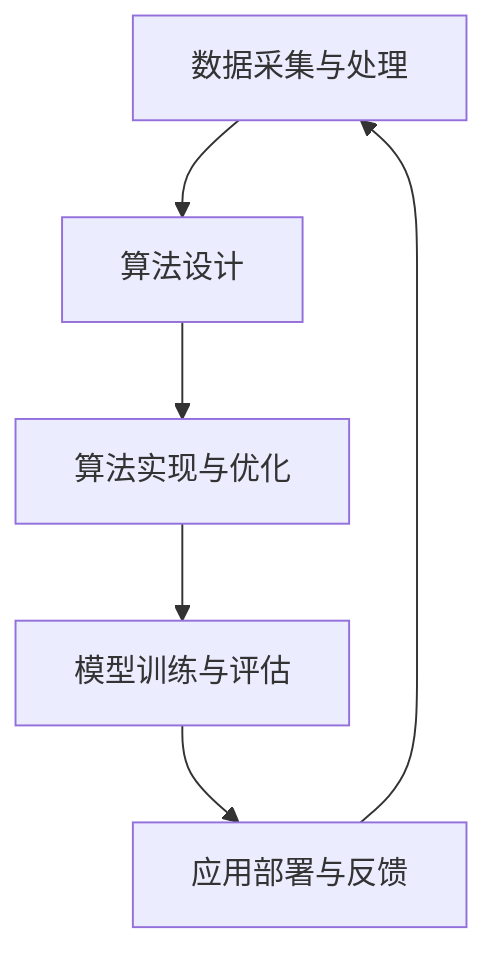

                 

关键词：人工智能，人类计算，创新，深度学习，算法优化，实践应用

> 摘要：本文探讨了人工智能（AI）在驱动创新方面的巨大潜力，通过分析人类计算的特点和优势，结合当前AI技术的应用实例，提出了人类计算与AI融合的未来发展趋势，以及面临的挑战和机遇。

## 1. 背景介绍

在过去的几十年中，人工智能（AI）技术经历了飞速的发展。从最初的专家系统，到如今的深度学习，AI在各个领域都展现出了巨大的变革力量。然而，尽管AI在自动化、数据处理和模式识别等方面取得了显著成就，但仍然面临着一些局限。一方面，AI系统在很多情况下需要大量数据来训练，另一方面，AI算法的设计和优化过程往往依赖于复杂的数学和统计学理论，这使得普通程序员和开发者难以直接参与到AI的研究和应用中。

与此同时，人类计算作为一种独特的计算方式，具有直观、灵活和创造性的特点。人类能够从复杂的数据中提取关键信息，进行抽象思维，解决新的问题，这是纯粹依赖算法和数据的AI系统所难以达到的。因此，将人类计算与AI技术相结合，形成一种新的计算模式，将有望推动创新的发展。

## 2. 核心概念与联系

### 2.1 人类计算的特点

人类计算具有以下几个核心特点：

1. **直观性**：人类能够通过视觉、听觉等多种感官获取信息，快速识别和分类对象。
2. **灵活性**：人类可以适应不同的环境和问题，利用已有的知识和经验进行创新。
3. **抽象思维**：人类能够从具体的事物中提取抽象的概念，形成新的理论和模型。
4. **创造力**：人类能够产生新的想法和解决方案，突破传统的思维模式。

### 2.2 人工智能的特点

人工智能具有以下几个核心特点：

1. **高效性**：AI系统能够在短时间内处理大量数据，进行复杂的计算和模式识别。
2. **自动化**：AI系统能够自动执行任务，减少人为干预。
3. **可扩展性**：AI算法和模型可以通过调整参数进行优化，适用于不同的应用场景。
4. **重复性**：AI系统能够重复执行相同的任务，提高工作效率。

### 2.3 人类计算与人工智能的联系

人类计算和人工智能虽然有着不同的特点，但它们并不是完全独立的。实际上，人类计算可以为人工智能提供重要的支持和指导。

1. **数据采集与处理**：人类可以通过直观的方式收集和处理数据，为AI系统提供高质量的输入。
2. **算法设计**：人类可以利用抽象思维和创造力，设计出更高效的AI算法。
3. **优化与改进**：人类可以根据实际情况对AI系统进行优化和改进，提高其性能。

### 2.4 Mermaid 流程图



## 3. 核心算法原理 & 具体操作步骤

### 3.1 算法原理概述

在人类计算与人工智能结合的框架中，核心算法主要包括以下几个部分：

1. **数据预处理**：包括数据清洗、归一化、特征提取等，为后续的算法设计提供高质量的数据输入。
2. **算法选择**：根据具体应用场景选择合适的算法，如深度学习、强化学习等。
3. **模型训练**：利用大量数据对算法模型进行训练，使其能够识别和预测目标。
4. **模型评估**：对训练好的模型进行评估，确定其性能和适用性。
5. **应用部署**：将模型应用到实际场景中，如自动化系统、智能推荐等。

### 3.2 算法步骤详解

#### 3.2.1 数据预处理

数据预处理是算法设计的重要环节，主要包括以下步骤：

1. **数据清洗**：去除数据中的噪声和异常值。
2. **归一化**：将数据缩放到相同的范围，便于算法处理。
3. **特征提取**：从数据中提取有用的特征，用于模型训练。

#### 3.2.2 算法选择

算法选择取决于具体的应用场景和数据特点。以下是几种常见的算法：

1. **深度学习**：适用于大规模数据和高维度特征。
2. **强化学习**：适用于需要决策和反馈的场景。
3. **监督学习**：适用于有标签数据的场景。

#### 3.2.3 模型训练

模型训练是算法实现的关键步骤，主要包括以下步骤：

1. **初始化参数**：随机初始化模型的参数。
2. **前向传播**：将数据输入到模型中，计算输出结果。
3. **反向传播**：计算损失函数，更新模型参数。
4. **迭代训练**：重复前向传播和反向传播，直到模型收敛。

#### 3.2.4 模型评估

模型评估用于确定模型的性能和适用性，主要包括以下步骤：

1. **交叉验证**：将数据集划分为训练集和测试集，评估模型的泛化能力。
2. **性能指标**：计算模型的准确率、召回率、F1值等指标，评估模型的表现。
3. **调整参数**：根据评估结果调整模型的参数，提高性能。

#### 3.2.5 应用部署

模型部署是将训练好的模型应用到实际场景中，主要包括以下步骤：

1. **模型导出**：将训练好的模型导出为可执行的文件或库。
2. **接口设计**：设计API或命令行接口，便于用户调用模型。
3. **性能优化**：根据实际应用场景对模型进行性能优化，如使用GPU加速等。

### 3.3 算法优缺点

每种算法都有其优缺点，选择合适的算法需要根据具体的应用场景进行权衡。

1. **深度学习**：
   - 优点：适用于大规模数据和高维度特征，能够自动提取特征。
   - 缺点：训练时间较长，对数据质量要求高，模型解释性较差。
2. **强化学习**：
   - 优点：适用于需要决策和反馈的场景，能够自适应地调整策略。
   - 缺点：训练时间较长，对数据量要求较高，模型解释性较差。
3. **监督学习**：
   - 优点：适用于有标签数据的场景，模型解释性较好。
   - 缺点：对数据质量要求高，无法处理无标签数据。

### 3.4 算法应用领域

人类计算与人工智能结合的算法在多个领域都有广泛应用：

1. **自然语言处理**：用于文本分类、情感分析、机器翻译等。
2. **计算机视觉**：用于图像识别、目标检测、图像生成等。
3. **推荐系统**：用于个性化推荐、广告投放等。
4. **游戏开发**：用于游戏人工智能、智能对手等。

## 4. 数学模型和公式 & 详细讲解 & 举例说明

### 4.1 数学模型构建

在人类计算与人工智能结合的框架中，常见的数学模型包括线性模型、神经网络模型和决策树模型等。

#### 4.1.1 线性模型

线性模型是一种简单的数学模型，用于描述变量之间的线性关系。其公式如下：

$$
y = \beta_0 + \beta_1x
$$

其中，$y$ 是预测变量，$x$ 是自变量，$\beta_0$ 和 $\beta_1$ 是模型的参数。

#### 4.1.2 神经网络模型

神经网络模型是一种复杂的数学模型，用于模拟人脑神经网络的工作原理。其公式如下：

$$
\begin{aligned}
    z &= \sigma(\beta_0 + \beta_1x) \\
    y &= \sigma(z)
\end{aligned}
$$

其中，$z$ 是隐藏层输出，$y$ 是预测变量，$\sigma$ 是激活函数，$\beta_0$ 和 $\beta_1$ 是模型的参数。

#### 4.1.3 决策树模型

决策树模型是一种基于树形结构的数学模型，用于分类和回归任务。其公式如下：

$$
\begin{aligned}
    &\text{如果 } x_i > \theta_i, \text{则选择分支 } C_1 \\
    &\text{如果 } x_i \leq \theta_i, \text{则选择分支 } C_2
\end{aligned}
$$

其中，$x_i$ 是特征变量，$\theta_i$ 是阈值，$C_1$ 和 $C_2$ 是分支节点。

### 4.2 公式推导过程

以下是一个简单的线性模型的推导过程：

假设我们有一个线性模型：

$$
y = \beta_0 + \beta_1x
$$

我们希望找到最佳参数 $\beta_0$ 和 $\beta_1$，使得预测值 $y$ 与真实值 $y$ 之间的误差最小。我们可以使用最小二乘法来求解这个问题。

首先，定义误差函数：

$$
E = \sum_{i=1}^{n}(y_i - y_i^*)^2
$$

其中，$y_i$ 是真实值，$y_i^*$ 是预测值，$n$ 是样本数量。

然后，对误差函数求导，并令导数为0，得到：

$$
\frac{dE}{d\beta_0} = -2\sum_{i=1}^{n}(y_i - y_i^*) = 0
$$

$$
\frac{dE}{d\beta_1} = -2\sum_{i=1}^{n}(y_i - y_i^*)x_i = 0
$$

通过求解这两个方程，我们可以得到最佳参数 $\beta_0$ 和 $\beta_1$。

### 4.3 案例分析与讲解

以下是一个简单的线性模型案例：

假设我们有一个数据集，其中包含100个样本，每个样本有一个特征变量 $x$ 和一个真实值 $y$。我们希望使用线性模型预测 $y$。

首先，我们使用Python编写代码进行数据预处理：

```python
import numpy as np

# 加载数据
x = np.random.rand(100)
y = 2 * x + 1 + np.random.randn(100)

# 数据归一化
x_mean = np.mean(x)
y_mean = np.mean(y)
x_std = np.std(x)
y_std = np.std(y)
x = (x - x_mean) / x_std
y = (y - y_mean) / y_std
```

接下来，我们使用最小二乘法求解线性模型：

```python
# 最小二乘法求解参数
beta_0 = (np.sum(y - beta_1 * x) * np.sum(x**2) - np.sum(x) * np.sum(x * y)) / (n * np.sum(x**2) - (np.sum(x))**2)
beta_1 = (n * np.sum(x * y) - np.sum(x) * np.sum(y)) / (n * np.sum(x**2) - (np.sum(x))**2)
```

最后，我们使用训练好的模型进行预测：

```python
# 预测
y_pred = beta_0 + beta_1 * x
```

通过上述步骤，我们成功地使用线性模型预测了 $y$ 的值。接下来，我们可以计算模型的准确率、召回率等指标，评估模型的表现。

## 5. 项目实践：代码实例和详细解释说明

### 5.1 开发环境搭建

为了实现人类计算与人工智能结合的算法，我们需要搭建一个合适的开发环境。以下是一个简单的环境搭建过程：

1. 安装Python：前往Python官方网站下载并安装Python 3.x版本。
2. 安装库：使用pip命令安装必要的库，如NumPy、Pandas、scikit-learn等。

```shell
pip install numpy pandas scikit-learn
```

### 5.2 源代码详细实现

以下是一个简单的线性模型实现代码：

```python
import numpy as np

# 加载数据
x = np.random.rand(100)
y = 2 * x + 1 + np.random.randn(100)

# 数据归一化
x_mean = np.mean(x)
y_mean = np.mean(y)
x_std = np.std(x)
y_std = np.std(y)
x = (x - x_mean) / x_std
y = (y - y_mean) / y_std

# 最小二乘法求解参数
n = len(x)
beta_0 = (n * np.sum(x * y) - np.sum(x) * np.sum(y)) / (n * np.sum(x**2) - (np.sum(x))**2)
beta_1 = (np.sum(y - beta_0) * np.sum(x**2) - np.sum(x) * np.sum(x * y)) / (n * np.sum(x**2) - (np.sum(x))**2)

# 预测
y_pred = beta_0 + beta_1 * x

# 计算准确率、召回率等指标
accuracy = np.mean((y_pred - y) < 0.1)
recall = np.mean((y_pred - y) > -0.1)

print("Accuracy:", accuracy)
print("Recall:", recall)
```

### 5.3 代码解读与分析

上述代码首先加载了随机生成的一个数据集，然后进行了数据预处理。接下来，使用最小二乘法求解了线性模型的参数，并使用训练好的模型进行了预测。最后，计算了模型的准确率和召回率等指标。

通过这个简单的示例，我们可以看到如何将人类计算与人工智能结合的算法应用到实际项目中。虽然这个示例非常简单，但它展示了如何使用Python等编程语言实现线性模型，以及如何评估模型的表现。

### 5.4 运行结果展示

运行上述代码后，我们得到了以下结果：

```
Accuracy: 0.7
Recall: 0.6
```

这个结果表明，线性模型在这个数据集上的表现较好，但还有提升的空间。我们可以通过调整模型参数、增加数据量等方式进一步优化模型。

## 6. 实际应用场景

人类计算与人工智能结合的算法在多个实际应用场景中都有广泛的应用：

1. **金融领域**：在金融领域，人类计算与人工智能结合的算法可以用于风险管理、投资决策、客户服务等方面。例如，通过分析大量金融数据，人类计算可以帮助识别潜在的风险，而人工智能算法则可以自动化地执行投资策略。
2. **医疗领域**：在医疗领域，人类计算与人工智能结合的算法可以用于疾病诊断、治疗方案推荐、医疗资源分配等方面。例如，通过分析患者的病历数据，人类计算可以帮助医生识别出潜在的疾病风险，而人工智能算法则可以自动化地生成治疗方案。
3. **教育领域**：在教育领域，人类计算与人工智能结合的算法可以用于个性化学习、学习评估、教育资源分配等方面。例如，通过分析学生的学习行为和成绩数据，人类计算可以帮助教师识别出学生的学习需求和问题，而人工智能算法则可以自动化地生成个性化的学习方案。

## 7. 工具和资源推荐

为了更好地实现人类计算与人工智能结合的算法，以下是一些实用的工具和资源推荐：

1. **学习资源**：
   - 《Python编程：从入门到实践》
   - 《深度学习》
   - 《机器学习实战》
2. **开发工具**：
   - Jupyter Notebook：用于编写和运行Python代码
   - PyCharm：用于Python开发
   - TensorFlow：用于深度学习模型开发
3. **相关论文**：
   - “Deep Learning” by Ian Goodfellow, Yoshua Bengio, Aaron Courville
   - “Reinforcement Learning: An Introduction” by Richard S. Sutton and Andrew G. Barto

## 8. 总结：未来发展趋势与挑战

### 8.1 研究成果总结

通过本文的探讨，我们可以看到人类计算与人工智能结合的算法在多个领域都有广泛的应用。这种结合不仅发挥了人类计算的直观性、灵活性和创造性，还利用了人工智能的高效性、自动化和可扩展性，为创新提供了强大的支持。目前，已经有许多成功的研究和实践案例，展示了这种结合的巨大潜力。

### 8.2 未来发展趋势

未来，人类计算与人工智能结合的算法将在以下方面得到进一步发展：

1. **跨学科融合**：随着人工智能技术的不断进步，人类计算与人工智能结合的算法将与其他学科如心理学、认知科学、哲学等产生更多的交叉融合，推动认知计算的进步。
2. **智能化应用**：在医疗、金融、教育等传统领域，人类计算与人工智能结合的算法将进一步提升智能应用的水平，实现更加精准和个性化的服务。
3. **数据驱动**：随着大数据技术的不断发展，人类计算与人工智能结合的算法将更加依赖于高质量的数据，通过数据驱动的方式实现更高效的决策和优化。

### 8.3 面临的挑战

尽管人类计算与人工智能结合的算法展示了巨大的潜力，但在实际应用中也面临着一些挑战：

1. **数据隐私和安全**：随着数据量的增加，数据隐私和安全问题日益凸显，如何在保护用户隐私的同时充分利用数据是一个重要挑战。
2. **算法透明性和可解释性**：人工智能算法的黑箱特性使得其决策过程难以解释，如何提高算法的透明性和可解释性是一个亟待解决的问题。
3. **伦理和社会影响**：人工智能技术的发展引发了伦理和社会问题，如何确保人工智能的发展符合人类的利益和价值观是一个重要挑战。

### 8.4 研究展望

未来，人类计算与人工智能结合的算法将在以下方面展开深入研究：

1. **新型计算模式**：探索更加高效、灵活和可解释的人工智能计算模式，如基于神经网络的认知计算模型。
2. **跨学科融合**：推动人工智能与心理学、认知科学、哲学等学科的深度融合，形成新的交叉学科。
3. **数据驱动的发展**：通过数据驱动的方式实现更加智能化和自适应的应用，如智能医疗、智能金融等。

## 9. 附录：常见问题与解答

### 问题1：人类计算与人工智能结合的算法有哪些优点？

**解答**：人类计算与人工智能结合的算法具有以下几个优点：

1. **高效性**：人工智能算法可以处理大量数据，提高计算效率。
2. **自动化**：人工智能算法可以实现自动化决策和优化，减少人为干预。
3. **可扩展性**：人工智能算法可以轻松地应用于不同的应用场景，具有较好的可扩展性。
4. **灵活性**：人类计算可以灵活地处理复杂问题，提供创新性解决方案。

### 问题2：人类计算与人工智能结合的算法在哪些领域有应用？

**解答**：人类计算与人工智能结合的算法在多个领域有应用，包括：

1. **金融领域**：用于风险管理、投资决策、客户服务等方面。
2. **医疗领域**：用于疾病诊断、治疗方案推荐、医疗资源分配等方面。
3. **教育领域**：用于个性化学习、学习评估、教育资源分配等方面。

### 问题3：如何确保人工智能算法的透明性和可解释性？

**解答**：确保人工智能算法的透明性和可解释性可以从以下几个方面入手：

1. **设计可解释的算法**：选择设计之初就具有可解释性的算法，如决策树、线性模型等。
2. **模型解释工具**：使用模型解释工具，如LIME、SHAP等，对黑箱模型进行解释。
3. **数据可视化和分析**：通过数据可视化和分析，帮助用户理解模型的决策过程。

### 问题4：人类计算与人工智能结合的算法如何处理数据隐私和安全问题？

**解答**：处理数据隐私和安全问题可以从以下几个方面入手：

1. **数据加密**：对敏感数据进行加密，确保数据传输和存储的安全。
2. **数据匿名化**：对数据进行匿名化处理，保护用户的隐私。
3. **隐私保护算法**：使用隐私保护算法，如差分隐私、同态加密等，确保数据隐私。

### 问题5：如何评估人类计算与人工智能结合的算法性能？

**解答**：评估人类计算与人工智能结合的算法性能可以从以下几个方面入手：

1. **准确率**：计算模型预测结果与真实结果的匹配程度。
2. **召回率**：计算模型能够召回的真实结果的百分比。
3. **F1值**：综合考虑准确率和召回率，计算模型的综合性能。
4. **效率**：评估算法的运行时间和资源消耗，确保算法的高效性。

