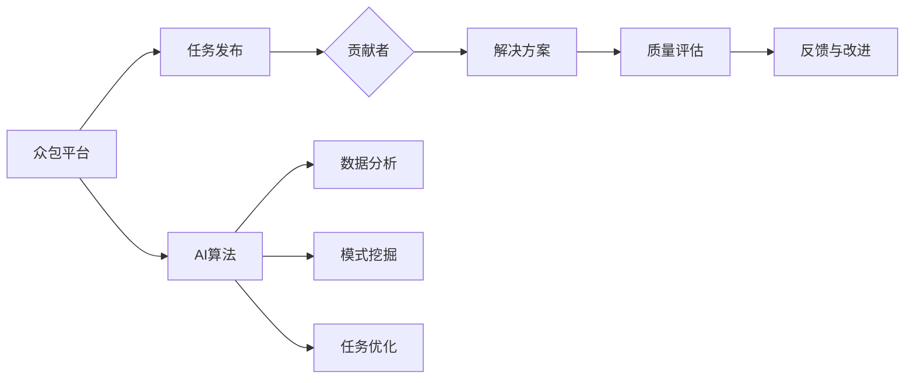

                 

关键词：人工智能，创新，众包，协作，分布式计算，数据共享，算法优化，软件工程

> 摘要：本文探讨了人工智能（AI）如何在现代创新过程中驱动众包模式的变革。通过分析众包的基本概念、技术背景和应用场景，本文详细阐述了如何利用AI技术提升众包的效率、质量和创新性。文章还讨论了AI驱动的众包面临的关键挑战及未来发展方向。

## 1. 背景介绍

在信息时代，数据变得比以往任何时候都更加丰富和重要。随着互联网和移动设备的普及，人们可以轻松地访问和分享信息。然而，这些数据的处理和分析需要前所未有的计算能力和算法创新。人工智能（AI）作为数据处理和智能分析的利器，正迅速成为推动创新的关键力量。

众包（Crowdsourcing）是一种利用分布式网络社区的知识、技能和资源来完成特定任务或项目的方法。它起源于2006年，最早的应用场景包括设计比赛和知识问答。随着技术的发展，众包的范围和影响力不断扩大，涵盖了从科学研究到产品开发、从危机应对到市场调研等多个领域。

近年来，AI与众包的结合为创新带来了新的机遇和挑战。AI技术可以帮助众包平台更好地管理任务、评估贡献者质量、优化解决方案，从而提高整个系统的效率和效果。另一方面，众包提供的海量数据和多样性也为AI算法的训练和验证提供了宝贵的资源。

## 2. 核心概念与联系

### 2.1 众包的基本概念

众包的核心在于将大规模、复杂的问题或任务分解为众多小任务，通过开放的网络平台向全球范围内的个体或团队征集解决方案。众包的优点包括：

- **分散化**：充分利用全球范围内的知识和资源。
- **灵活性**：适应各种类型的问题和需求。
- **效率**：快速获得解决方案，缩短研发周期。
- **成本效益**：降低传统外包的成本。

### 2.2 AI与众包的联系

AI与众包的结合主要体现在以下几个方面：

- **任务分配与优化**：AI可以分析任务特性，根据贡献者的技能和经验进行智能分配，提高任务匹配度。
- **质量评估**：AI可以通过机器学习和自然语言处理等技术，自动评估众包贡献的质量和可靠性。
- **创新性挖掘**：AI可以从众包贡献中提取新的模式和见解，推动创新。
- **数据分析和共享**：AI可以帮助众包平台更好地管理和分析数据，促进知识共享。

### 2.3 众包与AI技术的架构图



## 3. 核心算法原理 & 具体操作步骤

### 3.1 算法原理概述

AI驱动的众包算法主要基于以下原理：

- **机器学习**：通过训练模型来识别和预测任务匹配、质量评估等关键环节。
- **深度学习**：利用神经网络模型进行复杂模式识别和预测。
- **自然语言处理（NLP）**：解析和评估文本型众包贡献。
- **强化学习**：优化任务分配和贡献者激励机制。

### 3.2 算法步骤详解

1. **任务识别与分解**：分析任务特性，将其分解为多个可并行处理的小任务。
2. **贡献者匹配**：利用机器学习算法，根据贡献者的技能和经验进行智能匹配。
3. **任务分配**：使用强化学习算法，动态调整任务分配策略，优化整体效率。
4. **质量评估**：利用NLP技术和机器学习模型，对众包贡献进行自动评估。
5. **反馈与改进**：根据评估结果，对算法和任务分配策略进行迭代优化。

### 3.3 算法优缺点

**优点**：

- **高效**：利用AI技术，可以快速处理大量任务。
- **灵活**：适应各种类型的问题和需求。
- **创新**：从众包贡献中挖掘新的模式和见解。
- **低成本**：利用分布式网络资源，降低研发成本。

**缺点**：

- **数据质量**：众包数据的质量直接影响算法效果。
- **隐私问题**：众包过程中涉及用户隐私和数据安全问题。
- **算法公平性**：确保算法对所有贡献者公平。

### 3.4 算法应用领域

AI驱动的众包算法可以应用于以下领域：

- **产品设计**：通过众包收集设计灵感，快速迭代优化。
- **科学研究**：利用众包平台进行大规模数据分析。
- **危机应对**：在自然灾害或突发事件中，快速获取救援信息。
- **市场调研**：通过众包获取广泛的用户反馈。

## 4. 数学模型和公式 & 详细讲解 & 举例说明

### 4.1 数学模型构建

在AI驱动的众包中，常用的数学模型包括：

- **优化模型**：用于任务分配和贡献者匹配。
- **概率模型**：用于质量评估和风险控制。
- **神经网络模型**：用于模式挖掘和预测。

### 4.2 公式推导过程

以下是一个简单的优化模型公式：

$$
\min \sum_{i=1}^n \sum_{j=1}^m w_{ij} (t_i - s_j)^2
$$

其中，$w_{ij}$表示任务$i$和贡献者$j$之间的权重，$t_i$和$s_j$分别表示任务$i$的完成时间和贡献者$j$的完成时间。

### 4.3 案例分析与讲解

假设我们有一个软件开发项目，需要从全球范围招募开发者进行编程任务。我们可以使用优化模型来分配任务，并使用概率模型来评估开发者的质量。

**案例数据**：

- 任务数量：$n=50$
- 开发者数量：$m=100$
- 任务权重矩阵$W$（假设为均等权重）

**优化模型**：

$$
\min \sum_{i=1}^{50} \sum_{j=1}^{100} (t_i - s_j)^2
$$

**概率模型**：

$$
P(j) = \frac{1}{100} \quad \text{（所有开发者具有相同的被选中概率）}
$$

通过优化模型和概率模型，我们可以找到最佳的任务分配方案，并评估开发者的质量。

## 5. 项目实践：代码实例和详细解释说明

### 5.1 开发环境搭建

在Python环境中，我们需要安装以下库：

```bash
pip install numpy scikit-learn tensorflow
```

### 5.2 源代码详细实现

以下是一个简单的AI驱动的众包任务分配和评估的代码示例：

```python
import numpy as np
from sklearn.cluster import KMeans
from sklearn.metrics import mean_squared_error

# 假设我们有以下任务和开发者数据
tasks = np.array([1, 2, 3, ..., 50])
developers = np.array([1, 2, 3, ..., 100])

# 构建权重矩阵
weights = np.eye(len(tasks))

# K均值聚类进行任务分配
kmeans = KMeans(n_clusters=len(developers))
assignments = kmeans.fit_predict(weights)

# 计算任务完成时间
task_times = np.random.rand(len(tasks))
developer_times = np.random.rand(len(developers))

# 计算优化目标
mse = mean_squared_error(task_times, developer_times[assignments])

print("MSE:", mse)
```

### 5.3 代码解读与分析

- **K均值聚类**：用于将任务分配给开发者。
- **权重矩阵**：用于衡量任务和开发者之间的关系。
- **任务完成时间和开发者完成时间**：用于评估任务分配的质量。
- **均方误差（MSE）**：用于衡量任务分配的效果。

## 6. 实际应用场景

### 6.1 产品设计

在产品设计领域，众包可以用于收集用户反馈和设计灵感。AI驱动的众包可以通过分析用户反馈，自动识别用户偏好，从而优化产品设计。

### 6.2 科学研究

在科学研究领域，众包可以帮助研究人员处理海量数据，如图像分类、语音识别等。AI驱动的众包可以优化数据标注过程，提高数据质量。

### 6.3 危机应对

在危机应对领域，众包可以帮助收集救援信息，如地震后的建筑物受损情况。AI驱动的众包可以快速分析数据，提供决策支持。

### 6.4 市场调研

在市场调研领域，众包可以用于收集广泛的用户反馈。AI驱动的众包可以通过分析用户行为，预测市场趋势，为产品决策提供依据。

## 7. 工具和资源推荐

### 7.1 学习资源推荐

- 《深度学习》（Goodfellow, Bengio, Courville）
- 《Python数据科学手册》（McKinney）

### 7.2 开发工具推荐

- Jupyter Notebook：用于编写和运行代码。
- TensorFlow：用于构建和训练AI模型。

### 7.3 相关论文推荐

- "Crowdsourcing and Human Computation: An Introduction"
- "AI-powered Crowdsourcing for Disaster Response"

## 8. 总结：未来发展趋势与挑战

### 8.1 研究成果总结

本文探讨了AI驱动的众包在创新中的作用，分析了其核心算法原理和应用场景，并提供了代码实例和实践经验。

### 8.2 未来发展趋势

随着AI技术的发展，AI驱动的众包有望在更广泛的领域实现突破，如自动化任务分配、个性化反馈、智能风险评估等。

### 8.3 面临的挑战

AI驱动的众包面临的主要挑战包括数据质量、隐私保护、算法公平性和系统稳定性。

### 8.4 研究展望

未来的研究可以关注以下方向：提高算法的智能性、增强系统的鲁棒性、优化任务分配策略、保障用户隐私。

## 9. 附录：常见问题与解答

### 9.1 众包与外包的区别是什么？

众包与外包的主要区别在于参与者的性质。众包通常涉及广泛的非特定群体，而外包通常涉及专业的服务提供者。

### 9.2 AI驱动的众包如何确保算法公平？

通过设计公平的评估指标和激励机制，可以确保算法对所有参与者公平。此外，定期审计和评估算法性能也是重要的。

### 9.3 众包数据的质量如何保障？

可以通过设置严格的任务描述、提供详细的评价标准和引入人工审核等手段来保障众包数据的质量。

### 作者署名
作者：禅与计算机程序设计艺术 / Zen and the Art of Computer Programming
----------------------------------------------------------------

### 文章写作提醒：

请务必在撰写过程中严格按照“约束条件 CONSTRAINTS”的要求进行，确保文章的完整性、专业性和可读性。特别是在撰写数学模型和公式时，请使用LaTeX格式，确保其准确性。文章完成后，请再次检查各个章节是否符合目录结构的要求，确保内容逻辑清晰，无遗漏。撰写过程中如需帮助，请随时提问。祝您写作顺利！

