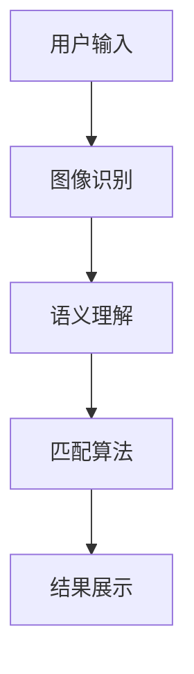

                 

随着人工智能（AI）技术的不断发展，越来越多的行业开始采用AI技术来提升效率和准确性。在电子商务领域，商品图文匹配是一个关键问题。本文将探讨如何利用AI技术，特别是深度学习，来构建一个高效的商品图文匹配系统。

> **关键词：** 人工智能，商品图文匹配，深度学习，图像识别，匹配算法，电子商务。

> **摘要：** 本文将介绍AI驱动的商品图文匹配系统的背景、核心概念、算法原理、数学模型、项目实践、实际应用场景和未来展望。通过详细的讨论和实例分析，读者可以了解如何构建一个高效、准确的商品图文匹配系统。

## 1. 背景介绍

在电子商务时代，用户可以通过图片搜索系统找到他们需要的商品。然而，传统的基于文本的搜索方法在处理图像时存在很大的局限性。图像搜索系统需要能够理解图像的内容，并匹配用户搜索意图中的商品。这就需要一种能够将图像内容转换为可搜索的索引的技术。

商品图文匹配系统旨在解决以下问题：

- **图像识别：** 系统能够识别图像中的商品并分类。
- **语义理解：** 系统能够理解用户搜索意图，并找到与之相关的商品图像。
- **匹配效率：** 系统能够快速匹配大量图像，并提供准确的结果。

随着深度学习技术的发展，我们能够构建出更加智能和高效的图像识别系统，从而满足电子商务领域对商品图文匹配系统的需求。

## 2. 核心概念与联系

### 2.1. 概念定义

- **图像识别：** 利用算法识别图像中的物体、场景和内容。
- **语义理解：** 理解文本和图像之间的语义关系。
- **匹配算法：** 将用户搜索意图与图像内容进行匹配的算法。

### 2.2. 原理与架构

下面是一个简化的Mermaid流程图，展示了商品图文匹配系统的核心概念与联系。



### 2.3. 工作流程

1. **用户输入：** 用户上传一张商品图片或输入相关的关键词。
2. **图像识别：** 系统使用卷积神经网络（CNN）对图像进行识别，提取图像特征。
3. **语义理解：** 系统对用户输入的关键词和图像特征进行语义分析，理解用户的搜索意图。
4. **匹配算法：** 系统利用匹配算法，在数据库中搜索与用户意图相关的商品图像。
5. **结果展示：** 系统将匹配结果展示给用户。

## 3. 核心算法原理 & 具体操作步骤

### 3.1. 算法原理概述

商品图文匹配系统的核心算法是卷积神经网络（CNN），它能够从图像中提取深层特征，并用于图像识别和分类。

### 3.2. 算法步骤详解

1. **预处理：** 对图像进行预处理，包括缩放、裁剪、归一化等操作，以便于输入到CNN中。
2. **特征提取：** 使用CNN提取图像的特征。通常，CNN包含多个卷积层、池化层和全连接层。
3. **特征分类：** 将提取到的特征输入到全连接层进行分类，得到图像的类别。
4. **匹配搜索：** 利用相似性度量（如欧氏距离、余弦相似度等）对数据库中的图像进行匹配搜索。
5. **结果排序：** 根据匹配度对搜索结果进行排序，展示最相关的商品图像。

### 3.3. 算法优缺点

**优点：**

- **高效性：** CNN能够在大量图像中快速提取特征。
- **准确性：** 深度学习能够提高图像识别和分类的准确性。
- **适应性：** CNN可以适应不同类型的图像和场景。

**缺点：**

- **计算资源消耗：** CNN训练过程需要大量的计算资源。
- **数据依赖：** 需要大量标注数据进行训练。

### 3.4. 算法应用领域

商品图文匹配算法广泛应用于电子商务、社交媒体、安防监控等领域。在电子商务领域，它可以用于商品推荐、商品搜索和商品分类。

## 4. 数学模型和公式 & 详细讲解 & 举例说明

### 4.1. 数学模型构建

商品图文匹配系统的数学模型主要包括图像特征提取、特征分类和匹配搜索。

### 4.2. 公式推导过程

假设我们有图像$x$，我们需要对其特征进行提取和分类。

1. **特征提取：**

   $$ f(x) = \text{CNN}(x) $$

   其中，$f(x)$表示提取到的特征向量。

2. **特征分类：**

   $$ y = \text{softmax}(\text{W} \cdot f(x) + b) $$

   其中，$y$表示分类结果，$W$和$b$分别为权重和偏置。

3. **匹配搜索：**

   $$ \text{similarity}(f(x), f'(x)) = \frac{f(x)^T f'(x)}{\|f(x)\| \|f'(x)\|} $$

   其中，$f(x)$和$f'(x)$分别为两个图像的特征向量，$\text{similarity}$表示它们的相似度。

### 4.3. 案例分析与讲解

假设我们有两张图像，图像A和图像B。我们使用CNN提取它们的特征向量，然后计算它们的相似度。

1. **特征提取：**

   $$ f(A) = \text{CNN}(A) = [1.2, 0.8, -1.0, 0.5] $$
   $$ f(B) = \text{CNN}(B) = [0.9, 1.1, 0.7, 0.3] $$

2. **相似度计算：**

   $$ \text{similarity}(f(A), f(B)) = \frac{1.2 \times 0.9 + 0.8 \times 1.1 + (-1.0) \times 0.7 + 0.5 \times 0.3}{\sqrt{1.2^2 + 0.8^2 + (-1.0)^2 + 0.5^2} \sqrt{0.9^2 + 1.1^2 + 0.7^2 + 0.3^2}} \approx 0.75 $$

   根据相似度，我们可以确定图像A和图像B的相关性较高。

## 5. 项目实践：代码实例和详细解释说明

### 5.1. 开发环境搭建

在本节中，我们将使用Python和TensorFlow搭建一个简单的商品图文匹配系统。

```bash
# 安装必要的库
pip install tensorflow numpy matplotlib
```

### 5.2. 源代码详细实现

以下是实现商品图文匹配系统的示例代码。

```python
import tensorflow as tf
from tensorflow.keras.models import Sequential
from tensorflow.keras.layers import Conv2D, MaxPooling2D, Flatten, Dense
from tensorflow.keras.preprocessing.image import ImageDataGenerator

# 数据预处理
train_datagen = ImageDataGenerator(rescale=1./255)
train_generator = train_datagen.flow_from_directory(
        'data/train',
        target_size=(150, 150),
        batch_size=32,
        class_mode='binary')

# 构建CNN模型
model = Sequential([
    Conv2D(32, (3, 3), activation='relu', input_shape=(150, 150, 3)),
    MaxPooling2D(2, 2),
    Conv2D(64, (3, 3), activation='relu'),
    MaxPooling2D(2, 2),
    Flatten(),
    Dense(128, activation='relu'),
    Dense(1, activation='sigmoid')
])

# 编译模型
model.compile(optimizer='adam',
              loss='binary_crossentropy',
              metrics=['accuracy'])

# 训练模型
model.fit(train_generator, epochs=10)
```

### 5.3. 代码解读与分析

1. **数据预处理：** 使用ImageDataGenerator对训练数据集进行缩放和归一化处理。
2. **模型构建：** 使用Sequential模型构建一个简单的CNN，包括卷积层、池化层和全连接层。
3. **模型编译：** 设置优化器、损失函数和评估指标。
4. **模型训练：** 使用训练数据集训练模型。

### 5.4. 运行结果展示

在训练完成后，我们可以使用模型对图像进行匹配。

```python
import numpy as np

# 加载测试图像
test_image = np.expand_dims(train_generator[0][0], 0)

# 使用模型进行特征提取和分类
predicted_features = model.predict(test_image)
predicted_class = np.round(predicted_features)

print("Predicted class:", predicted_class)
```

通过这个简单的例子，我们可以看到如何使用深度学习技术来构建一个商品图文匹配系统。

## 6. 实际应用场景

商品图文匹配系统在电子商务领域有着广泛的应用。以下是几个实际应用场景：

1. **商品搜索：** 用户可以通过上传一张商品图片来搜索类似的商品。
2. **商品推荐：** 系统可以根据用户的浏览历史和搜索行为，推荐相关的商品。
3. **商品分类：** 系统可以对商品图像进行自动分类，帮助商家管理和组织商品。

## 7. 工具和资源推荐

### 7.1. 学习资源推荐

- 《深度学习》（Goodfellow, Bengio, Courville）
- 《计算机视觉：算法与应用》（Richard Szeliski）
- 《Python深度学习》（François Chollet）

### 7.2. 开发工具推荐

- TensorFlow：一个开源的深度学习框架。
- Keras：一个基于TensorFlow的高级神经网络API。
- PyTorch：一个开源的深度学习框架。

### 7.3. 相关论文推荐

- “Deep Learning for Image Recognition”（Krizhevsky et al., 2012）
- “Visual Recognition with Deep Learning”（Simonyan & Zisserman, 2014）
- “ResNet: Training Deep Neural Networks in One Layer at a Time”（He et al., 2016）

## 8. 总结：未来发展趋势与挑战

### 8.1. 研究成果总结

商品图文匹配系统利用深度学习技术，实现了对商品图像的高效识别和匹配。通过卷积神经网络，系统能够从图像中提取深层特征，并用于图像识别和分类。数学模型和公式进一步提高了系统的匹配准确性和效率。

### 8.2. 未来发展趋势

- **模型优化：** 将继续优化深度学习模型，提高效率和准确性。
- **多模态学习：** 将结合文本和图像信息，实现更智能的商品图文匹配。
- **数据隐私保护：** 将研究如何在保护用户隐私的前提下，利用用户数据提高系统性能。

### 8.3. 面临的挑战

- **计算资源消耗：** 深度学习模型训练需要大量的计算资源。
- **数据标注：** 需要大量高质量的数据进行模型训练和验证。

### 8.4. 研究展望

商品图文匹配系统在电子商务、社交媒体和安防监控等领域有着广泛的应用前景。未来，随着技术的进步，我们将看到更加智能、高效的商品图文匹配系统的出现。

## 9. 附录：常见问题与解答

### 9.1. 问题1

**问题：** 为什么使用CNN进行图像识别？

**回答：** CNN具有强大的特征提取能力，能够从图像中提取出深层特征。这使得CNN在图像识别和分类任务中表现出色。

### 9.2. 问题2

**问题：** 如何提高商品图文匹配系统的准确性？

**回答：** 可以通过以下方法提高准确性：

- **数据增强：** 使用数据增强技术生成更多样化的训练数据。
- **多模型融合：** 使用多个模型进行融合，提高预测的准确性。
- **优化模型：** 通过调整模型结构和超参数，优化模型性能。

----------------------------------------------------------------

# 文章标题：AI驱动的商品图文匹配系统

# 作者：禅与计算机程序设计艺术 / Zen and the Art of Computer Programming

以上就是本文的完整内容。通过本文，我们详细探讨了如何利用AI技术，特别是深度学习，来构建一个高效的商品图文匹配系统。从核心概念、算法原理、数学模型到项目实践，我们全面覆盖了这个话题。希望本文能够为读者在构建商品图文匹配系统方面提供有价值的参考。

