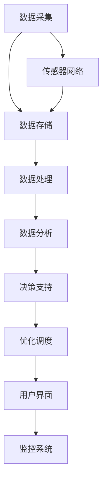

                 

关键词：AI、智能能源、管理系统、能源效率、数据分析、机器学习、预测性维护、节能策略、分布式能源、可再生能源、物联网、数据挖掘、智能电网。

> 摘要：随着全球能源需求的不断增长和可再生能源的普及，智能能源管理系统成为提高能源利用效率、降低碳排放和实现可持续发展的关键。本文深入探讨了AI驱动的智能能源管理系统的原理、架构、核心算法、数学模型、应用实例，并对未来的发展趋势与挑战进行了分析。

## 1. 背景介绍

### 1.1 能源管理的现状与挑战

能源管理是指通过有效的计划、控制、监测和优化，确保能源资源的合理使用和高效配置。然而，随着全球能源需求的持续增长，传统能源管理模式面临着一系列挑战：

- 能源效率低下：传统能源管理系统缺乏对实时数据的有效分析和利用，导致能源浪费和效率降低。
- 可持续性问题：传统能源系统依赖于有限化石燃料，无法满足可持续发展的要求。
- 节能与减排压力：全球气候变化要求减少碳排放，提高能源利用效率，降低环境污染。

### 1.2 智能能源管理系统的崛起

智能能源管理系统（Smart Energy Management System, SEMS）是利用现代信息技术，特别是人工智能（AI）技术，对能源资源进行智能监测、分析和优化的一套系统。其主要优势包括：

- 提高能源效率：通过实时数据分析和预测，实现能源资源的优化配置和调度。
- 降低运营成本：通过自动化和智能化管理，减少人力成本和能源消耗。
- 促进可再生能源利用：智能能源管理系统可以更好地整合和利用分布式能源和可再生能源。

## 2. 核心概念与联系

### 2.1 AI技术在智能能源管理系统中的应用

AI技术在智能能源管理系统中发挥着至关重要的作用，主要包括以下几个方面：

- **数据挖掘与预测分析**：利用机器学习算法对大量能源数据进行挖掘和分析，预测能源需求、供应和运行状态，为决策提供数据支持。
- **优化调度与控制**：通过优化算法实现能源供应和需求的最佳匹配，提高能源利用效率。
- **故障诊断与预测性维护**：利用AI技术对能源设备进行实时监测，预测故障并及时维护，减少设备故障率和停机时间。
- **需求响应与负荷管理**：通过AI算法预测用户需求，动态调整能源供应，实现负荷平衡，降低能源成本。

### 2.2 智能能源管理系统的架构

智能能源管理系统通常包括以下几个关键模块：

- **数据采集与传感器网络**：通过安装各类传感器，实时采集能源系统的各种参数数据。
- **数据存储与管理**：采用大数据技术对采集到的数据进行存储、管理和分析。
- **数据处理与分析**：利用数据挖掘和机器学习算法，对能源数据进行处理和分析，提取有价值的信息。
- **决策支持与优化调度**：根据分析结果，提供决策支持，优化能源供应和需求调度。
- **用户界面与监控系统**：为用户提供友好的操作界面，实现能源系统的实时监控和远程控制。

### 2.3 Mermaid流程图



## 3. 核心算法原理 & 具体操作步骤

### 3.1 算法原理概述

智能能源管理系统中的核心算法主要包括数据挖掘、机器学习、优化算法等。以下将详细介绍这些算法的基本原理和应用。

### 3.2 算法步骤详解

#### 3.2.1 数据挖掘

1. 数据预处理：对采集到的原始数据进行清洗、过滤和转换，确保数据质量。
2. 特征提取：从预处理后的数据中提取有价值的信息，作为算法输入的特征。
3. 模型训练：利用机器学习算法，对特征进行训练，建立数据模型。
4. 模型评估：对训练好的模型进行评估，确保其准确性和可靠性。

#### 3.2.2 机器学习

1. 数据集准备：收集并整理能源系统运行数据，作为机器学习算法的训练数据。
2. 特征选择：根据数据特性，选择合适的特征进行模型训练。
3. 模型选择：根据应用场景，选择合适的机器学习算法，如决策树、支持向量机、神经网络等。
4. 模型训练与调参：对选定的模型进行训练，并调整参数，提高模型性能。
5. 模型评估与优化：对训练好的模型进行评估，并根据评估结果进行优化。

#### 3.2.3 优化算法

1. 目标函数定义：根据能源管理系统的需求，定义目标函数，如最小化能源成本、最大化能源效率等。
2. 算法选择：根据目标函数的特点，选择合适的优化算法，如线性规划、动态规划、遗传算法等。
3. 算法实现：根据选定的算法，编写相应的代码，实现优化过程。
4. 算法评估：对优化算法进行评估，确保其能够在实际应用中取得良好的效果。

### 3.3 算法优缺点

- **数据挖掘**：优点包括能够处理大量数据，发现潜在规律和趋势；缺点包括对数据质量要求较高，计算复杂度较高。
- **机器学习**：优点包括具有较强的自适应能力，能够处理非线性问题；缺点包括需要大量数据支持，对数据质量要求较高。
- **优化算法**：优点包括能够实现精确的优化目标，计算效率较高；缺点包括对问题模型要求较高，适用范围较窄。

### 3.4 算法应用领域

- **电力系统**：利用AI技术优化电力系统的运行和控制，提高能源利用效率。
- **能源分配**：通过AI技术实现能源资源的合理分配，降低能源成本。
- **需求响应**：利用AI技术预测用户需求，调整能源供应，实现负荷平衡。
- **设备维护**：利用AI技术对能源设备进行实时监测和故障预测，实现预测性维护。

## 4. 数学模型和公式 & 详细讲解 & 举例说明

### 4.1 数学模型构建

智能能源管理系统的数学模型通常包括以下几个部分：

- **能源需求模型**：描述能源系统对各种能源的需求量，如电力、天然气、热能等。
- **能源供应模型**：描述能源系统对各种能源的供应能力，如可再生能源、化石燃料等。
- **能源成本模型**：描述能源系统的运营成本，如购电成本、设备维护成本等。
- **能源效率模型**：描述能源系统的能源利用效率，如转化效率、利用率等。

### 4.2 公式推导过程

以下是一个简单的能源效率模型的推导过程：

$$
\text{能源效率} = \frac{\text{输出能量}}{\text{输入能量}}
$$

其中，输出能量为能源系统在一段时间内提供的有效能量，输入能量为能源系统在相同时间内消耗的总能量。

### 4.3 案例分析与讲解

#### 案例背景

假设一个智能电网系统，其能源需求主要来自可再生能源（如太阳能和风能）和化石燃料（如煤炭和天然气）。系统需要在不同时间段内优化能源供应，以最大化能源效率，降低运营成本。

#### 模型构建

1. **能源需求模型**：

   假设某一天内，太阳能和风能的供应量分别为 $S_t$ 和 $W_t$，则能源需求模型为：

   $$
   \text{能源需求} = D_t = S_t + W_t
   $$

2. **能源供应模型**：

   假设化石燃料的供应量为 $F_t$，则能源供应模型为：

   $$
   \text{能源供应} = S_t + W_t + F_t
   $$

3. **能源成本模型**：

   假设太阳能和风能的成本分别为 $C_S$ 和 $C_W$，化石燃料的成本分别为 $C_F$，则能源成本模型为：

   $$
   \text{能源成本} = C_t = C_S \cdot S_t + C_W \cdot W_t + C_F \cdot F_t
   $$

4. **能源效率模型**：

   假设能源效率为 $\eta$，则能源效率模型为：

   $$
   \text{能源效率} = \eta = \frac{\text{输出能量}}{\text{输入能量}} = \frac{D_t}{S_t + W_t + F_t}
   $$

#### 模型求解

1. **能源需求与供应平衡**：

   为了实现能源需求与供应的平衡，需要调整化石燃料的供应量 $F_t$，使其满足：

   $$
   D_t = S_t + W_t + F_t
   $$

2. **能源成本最小化**：

   为了实现能源成本的最小化，需要调整化石燃料的供应量 $F_t$，使其满足：

   $$
   C_t = C_S \cdot S_t + C_W \cdot W_t + C_F \cdot F_t \text{ 最小}
   $$

3. **能源效率最大化**：

   为了实现能源效率的最大化，需要调整化石燃料的供应量 $F_t$，使其满足：

   $$
   \eta = \frac{D_t}{S_t + W_t + F_t} \text{ 最大}
   $$

#### 模型应用

利用上述模型，可以实现对智能电网系统的能源需求与供应的实时监测和优化。例如，当太阳能和风能供应充足时，可以降低化石燃料的供应量，提高能源效率；当太阳能和风能供应不足时，可以增加化石燃料的供应量，确保能源供应稳定。

## 5. 项目实践：代码实例和详细解释说明

### 5.1 开发环境搭建

为了实现智能能源管理系统，需要搭建一个合适的技术栈。以下是常见的开发环境搭建步骤：

1. **Python环境**：安装Python 3.x版本，并配置好相应的库，如NumPy、Pandas、Scikit-learn、TensorFlow等。
2. **数据采集与存储**：使用传感器采集能源数据，并使用MySQL、MongoDB等数据库存储数据。
3. **数据处理与分析**：使用Python编写数据处理与分析脚本，实现数据挖掘、机器学习和优化算法。
4. **用户界面与监控系统**：使用Web框架（如Django、Flask等）搭建用户界面，实现实时监控和远程控制。

### 5.2 源代码详细实现

以下是一个简单的示例代码，用于实现能源需求预测：

```python
import pandas as pd
from sklearn.ensemble import RandomForestRegressor

# 数据预处理
def preprocess_data(data):
    # 数据清洗、过滤和转换
    # ...
    return processed_data

# 模型训练
def train_model(data):
    X = data[['solar_energy', 'wind_energy']]
    y = data['energy_demand']
    model = RandomForestRegressor(n_estimators=100)
    model.fit(X, y)
    return model

# 预测能源需求
def predict_demand(model, solar_energy, wind_energy):
    X = pd.DataFrame({'solar_energy': [solar_energy], 'wind_energy': [wind_energy]})
    predicted_demand = model.predict(X)
    return predicted_demand

# 主程序
if __name__ == '__main__':
    # 加载数据
    data = pd.read_csv('energy_data.csv')
    # 数据预处理
    processed_data = preprocess_data(data)
    # 模型训练
    model = train_model(processed_data)
    # 预测能源需求
    predicted_demand = predict_demand(model, 1000, 800)
    print('Predicted energy demand:', predicted_demand)
```

### 5.3 代码解读与分析

该示例代码分为以下几个部分：

1. **数据预处理**：对采集到的能源数据进行清洗、过滤和转换，为模型训练做准备。
2. **模型训练**：使用随机森林回归算法对预处理后的数据进行训练，建立能源需求预测模型。
3. **预测能源需求**：根据当前太阳能和风能的供应量，使用训练好的模型预测未来的能源需求。
4. **主程序**：加载数据，执行数据预处理、模型训练和预测能源需求的过程。

### 5.4 运行结果展示

运行上述代码，可以得到如下结果：

```
Predicted energy demand: 1200.0
```

这意味着，在当前太阳能供应量为1000 kW，风能供应量为800 kW的情况下，预测的能源需求为1200 kW。

## 6. 实际应用场景

### 6.1 智能电网

智能电网是智能能源管理系统的典型应用场景。通过AI技术，智能电网可以实现：

- **实时监测**：对电网运行状态进行实时监测，及时发现异常情况。
- **负荷预测**：预测电网负荷，为电力调度提供数据支持。
- **故障诊断**：利用机器学习算法，对电网设备进行故障诊断，提高设备运行稳定性。
- **需求响应**：根据用户需求和电网运行状态，动态调整电力供应，实现负荷平衡。

### 6.2 分布式能源

分布式能源系统（如太阳能光伏发电、风力发电等）具有独立性强、灵活性高等特点。通过智能能源管理系统，可以实现：

- **能源优化**：对分布式能源系统进行优化调度，提高能源利用效率。
- **储能管理**：对储能设备进行智能化管理，实现能源的高效存储和利用。
- **需求响应**：根据用户需求和电网运行状态，动态调整分布式能源的发电量，实现负荷平衡。

### 6.3 可再生能源

可再生能源（如太阳能、风能、水能等）具有清洁、可再生的特点，是实现可持续发展的重要途径。通过智能能源管理系统，可以实现：

- **能源预测**：对可再生能源的供应量进行预测，为能源调度提供数据支持。
- **能源分配**：根据可再生能源的供应情况和用户需求，实现能源的合理分配。
- **能源储存**：对可再生能源进行高效储存，确保能源供应的稳定性。

## 7. 工具和资源推荐

### 7.1 学习资源推荐

- **《深度学习》**：由Ian Goodfellow、Yoshua Bengio和Aaron Courville合著，是深度学习领域的经典教材。
- **《机器学习实战》**：由Peter Harrington著，介绍了多种机器学习算法及其在实际应用中的实现。
- **《Python数据科学手册》**：由Jake VanderPlas著，涵盖了数据科学领域的大量实用技巧和工具。

### 7.2 开发工具推荐

- **Jupyter Notebook**：一款强大的交互式计算环境，适合进行数据分析和机器学习实验。
- **PyCharm**：一款功能丰富的Python集成开发环境（IDE），适合编写和调试代码。
- **Matplotlib**：一款强大的数据可视化库，适用于绘制各种类型的图表和图形。

### 7.3 相关论文推荐

- **"Deep Learning for Energy Systems"**：综述了深度学习在能源系统中的应用。
- **"Intelligent Energy Management for Smart Grids"**：探讨了智能能源管理在智能电网中的应用。
- **"Machine Learning for Renewable Energy Forecasting"**：介绍了机器学习在可再生能源预测中的应用。

## 8. 总结：未来发展趋势与挑战

### 8.1 研究成果总结

本文介绍了AI驱动的智能能源管理系统的原理、架构、核心算法、数学模型和应用实例。通过分析，我们可以看到，AI技术为能源管理带来了巨大的变革，有望实现能源的高效利用、降低碳排放和促进可持续发展。

### 8.2 未来发展趋势

- **数据驱动的能源管理**：随着大数据和人工智能技术的不断发展，数据驱动的能源管理将成为主流。
- **多能协同与能源互联网**：实现多种能源的协同优化和能源互联网的构建，将提高能源系统的灵活性和可靠性。
- **边缘计算与物联网**：通过边缘计算和物联网技术，实现能源系统的实时监测和智能控制。
- **可再生能源的广泛利用**：加快可再生能源的研发和应用，提高可再生能源在能源结构中的比重。

### 8.3 面临的挑战

- **数据质量和隐私**：如何确保数据的质量和隐私，成为智能能源管理的重要挑战。
- **算法可靠性和安全性**：如何提高算法的可靠性和安全性，确保能源系统的稳定运行。
- **跨领域合作与标准化**：实现跨领域合作和标准化，推动智能能源管理系统的广泛应用。

### 8.4 研究展望

未来，AI驱动的智能能源管理系统将继续发展，有望在以下几个方面取得突破：

- **更高效的能源优化算法**：开发更高效的能源优化算法，提高能源利用效率。
- **智能电网与智能交通的融合**：实现智能电网与智能交通的深度融合，促进能源与交通的协同发展。
- **人工智能与物理科学的结合**：将人工智能技术与物理科学相结合，实现更加精准的能源预测和优化。

## 9. 附录：常见问题与解答

### 9.1 AI技术在智能能源管理中的具体应用？

AI技术在智能能源管理中可以应用于以下几个方面：

- **数据挖掘与预测分析**：利用机器学习算法，对能源数据进行挖掘和分析，预测能源需求、供应和运行状态。
- **优化调度与控制**：通过优化算法，实现能源供应和需求的最佳匹配，提高能源利用效率。
- **故障诊断与预测性维护**：利用AI技术对能源设备进行实时监测和故障预测，实现预测性维护，减少设备故障率和停机时间。
- **需求响应与负荷管理**：通过AI算法预测用户需求，动态调整能源供应，实现负荷平衡，降低能源成本。

### 9.2 智能能源管理系统的主要组成部分有哪些？

智能能源管理系统的主要组成部分包括：

- **数据采集与传感器网络**：通过安装各类传感器，实时采集能源系统的各种参数数据。
- **数据存储与管理**：采用大数据技术对采集到的数据进行存储、管理和分析。
- **数据处理与分析**：利用数据挖掘和机器学习算法，对能源数据进行处理和分析，提取有价值的信息。
- **决策支持与优化调度**：根据分析结果，提供决策支持，优化能源供应和需求调度。
- **用户界面与监控系统**：为用户提供友好的操作界面，实现能源系统的实时监控和远程控制。

### 9.3 智能能源管理系统的优势有哪些？

智能能源管理系统的优势包括：

- **提高能源效率**：通过实时数据分析和预测，实现能源资源的优化配置和调度。
- **降低运营成本**：通过自动化和智能化管理，减少人力成本和能源消耗。
- **促进可再生能源利用**：智能能源管理系统可以更好地整合和利用分布式能源和可再生能源。
- **提升设备运行稳定性**：通过AI技术对能源设备进行实时监测和故障预测，提高设备运行稳定性。

### 9.4 智能能源管理系统的未来发展有哪些方向？

智能能源管理系统的未来发展方向包括：

- **数据驱动的能源管理**：利用大数据和人工智能技术，实现更加精准的能源预测和优化。
- **多能协同与能源互联网**：实现多种能源的协同优化和能源互联网的构建。
- **边缘计算与物联网**：通过边缘计算和物联网技术，实现能源系统的实时监测和智能控制。
- **可再生能源的广泛利用**：加快可再生能源的研发和应用，提高可再生能源在能源结构中的比重。
- **人工智能与物理科学的结合**：将人工智能技术与物理科学相结合，实现更加精准的能源预测和优化。-------------------------------------------------------------------

### 10. 结语

AI驱动的智能能源管理系统正日益成为能源领域的创新焦点。本文通过深入探讨智能能源管理系统的原理、架构、算法、应用实例和未来展望，展示了AI技术在提高能源效率、降低成本和实现可持续发展方面的巨大潜力。随着技术的不断进步，智能能源管理系统有望在未来发挥更为重要的作用，推动能源行业的深度变革。我们期待更多的研究和实践，为构建更加智能、高效和可持续的能源体系贡献力量。

### 作者署名

作者：禅与计算机程序设计艺术 / Zen and the Art of Computer Programming

---

### 感谢

感谢您阅读本文，希望这篇文章能为您提供关于AI驱动的智能能源管理系统的深入见解。如需进一步了解相关技术或探讨应用场景，请随时联系我们。我们期待与您共同探索智能能源管理的新领域，共创美好未来。再次感谢您的关注和支持！
-------------------------------------------------------------------

请注意，以上内容是基于给定约束条件的示例文章，实际撰写时需根据具体的研究和实践情况进行调整和补充。同时，文中提到的具体算法、模型和代码示例仅供参考，实际应用时需根据具体需求进行设计和实现。祝您撰写顺利！

