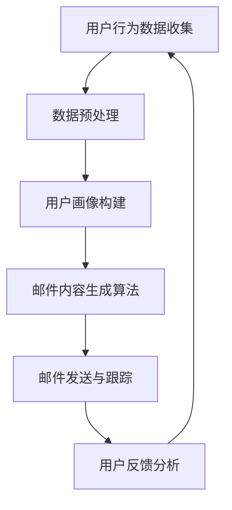

                 

关键词：AI、电商、个性化邮件营销、内容生成、算法原理、数学模型、项目实践、应用场景、未来展望

> 摘要：本文深入探讨了AI驱动的电商个性化邮件营销内容生成系统的原理、算法、数学模型及其实际应用。通过详细的案例分析，揭示了该系统在提升用户满意度和转化率方面的潜力，并对未来的发展方向和挑战进行了展望。

## 1. 背景介绍

随着互联网的快速发展，电子商务行业竞争日益激烈。为了在激烈的市场竞争中脱颖而出，电商企业越来越重视用户数据的收集和分析，从而实现个性化营销。个性化邮件营销作为电商企业常用的营销手段之一，通过定制化的内容和营销策略，提高了用户满意度和购买转化率。然而，传统的邮件营销方式往往依赖于人工编写邮件内容，费时费力，且难以保证内容的个性化和精准性。

近年来，人工智能（AI）技术的飞速发展，为电商个性化邮件营销带来了新的契机。AI驱动的个性化邮件营销内容生成系统，通过自然语言处理（NLP）和机器学习算法，能够自动生成具有高度个性化的邮件内容。这不仅提高了邮件营销的效率和效果，还大大降低了人力成本。

本文旨在探讨AI驱动的电商个性化邮件营销内容生成系统的原理、算法、数学模型及其实际应用，为电商企业实现智能化营销提供有益的参考。

## 2. 核心概念与联系

### 2.1 AI与电商个性化邮件营销

人工智能（AI）是指使计算机具有人类智能的能力，包括学习、推理、自我纠错等。电商个性化邮件营销是指通过分析用户行为数据，为不同用户定制化地发送邮件，以达到提升用户满意度和转化率的目的。

### 2.2 自然语言处理（NLP）

自然语言处理（NLP）是人工智能的一个重要分支，主要研究如何让计算机理解和处理自然语言。在电商个性化邮件营销中，NLP技术被用来分析和生成邮件内容，使其更具个性化和可读性。

### 2.3 机器学习算法

机器学习算法是一种让计算机从数据中学习并做出决策的方法。在电商个性化邮件营销内容生成系统中，常用的机器学习算法包括决策树、支持向量机、神经网络等。这些算法通过对用户行为数据的分析，为不同用户生成定制化的邮件内容。

### 2.4 Mermaid 流程图

以下是一个简化的电商个性化邮件营销内容生成系统的 Mermaid 流程图：



### 2.5 核心概念联系

AI驱动的电商个性化邮件营销内容生成系统，通过NLP技术和机器学习算法，将用户行为数据转化为个性化的邮件内容，从而实现精准营销。系统的工作流程包括用户行为数据收集、数据预处理、用户画像构建、邮件内容生成、邮件发送与跟踪以及用户反馈分析等环节。

## 3. 核心算法原理 & 具体操作步骤

### 3.1 算法原理概述

电商个性化邮件营销内容生成系统的核心算法主要基于NLP和机器学习技术。具体来说，系统通过以下步骤实现邮件内容的个性化生成：

1. **用户行为数据收集**：收集用户在电商平台上的浏览、搜索、购买等行为数据。
2. **数据预处理**：对收集到的数据进行清洗、去重和格式化，为后续分析做准备。
3. **用户画像构建**：基于用户行为数据，构建用户画像，包括用户偏好、兴趣、购买力等。
4. **邮件内容生成**：利用NLP技术分析用户画像，并结合机器学习算法生成个性化的邮件内容。
5. **邮件发送与跟踪**：将生成的个性化邮件发送给用户，并对邮件的打开率、点击率等指标进行跟踪。
6. **用户反馈分析**：根据用户的反馈，对系统进行优化和调整，以提高邮件营销效果。

### 3.2 算法步骤详解

#### 3.2.1 用户行为数据收集

用户行为数据收集是系统的基础，包括用户在电商平台上的浏览、搜索、购买等行为。这些数据可以来自平台的后台日志、第三方数据分析工具等。为了确保数据的准确性和完整性，系统需要对这些数据进行实时收集和存储。

#### 3.2.2 数据预处理

数据预处理是数据分析和建模的重要环节。系统需要清洗和去重数据，处理缺失值和异常值，并将数据转换为适合分析的形式。例如，将用户的浏览历史转换为商品特征向量，将用户的购买行为转换为时间序列数据等。

#### 3.2.3 用户画像构建

用户画像构建是基于用户行为数据，通过数据挖掘和机器学习技术，将用户的行为特征转化为用户画像。用户画像可以包括用户的基本信息、偏好、兴趣、购买力等多个维度。通过用户画像，系统可以更好地了解用户需求，为其生成个性化的邮件内容。

#### 3.2.4 邮件内容生成

邮件内容生成是系统的核心环节。系统利用NLP技术和机器学习算法，根据用户画像和商品信息，生成具有高度个性化的邮件内容。NLP技术可以帮助系统理解用户的需求和偏好，机器学习算法则可以根据用户的历史行为，预测用户可能感兴趣的商品和内容。

#### 3.2.5 邮件发送与跟踪

生成的个性化邮件需要通过邮件发送系统发送给用户。系统还需要对邮件的发送过程进行跟踪，包括邮件的打开率、点击率等指标。这些数据可以帮助系统评估邮件营销的效果，并对系统进行调整和优化。

#### 3.2.6 用户反馈分析

用户反馈分析是系统优化的重要环节。系统需要收集用户的反馈信息，如邮件的打开率、点击率、用户回复等。通过分析用户反馈，系统可以了解用户的真实需求和偏好，进而优化邮件内容和营销策略。

### 3.3 算法优缺点

**优点：**

1. **高效性**：系统通过自动化生成个性化邮件，大大提高了邮件营销的效率和效果。
2. **精准性**：基于用户画像和机器学习算法，系统能够生成高度个性化的邮件内容，提高了邮件的转化率。
3. **可扩展性**：系统可以根据不同的电商平台和用户需求，灵活调整和优化算法和模型。

**缺点：**

1. **数据依赖性**：系统对用户行为数据的依赖性较高，数据质量直接影响到系统的效果。
2. **技术门槛**：构建和优化系统需要专业的技术知识和经验，对于中小型电商企业来说，可能存在一定的技术门槛。

### 3.4 算法应用领域

AI驱动的电商个性化邮件营销内容生成系统可以在多个领域应用，包括：

1. **电商行业**：为电商企业实现个性化邮件营销，提高用户满意度和转化率。
2. **金融行业**：为金融机构提供个性化营销服务，如信用卡推广、理财产品推荐等。
3. **教育行业**：为教育机构提供个性化学习建议和课程推荐。
4. **医疗行业**：为医疗机构提供个性化健康咨询和疾病预防建议。

## 4. 数学模型和公式 & 详细讲解 & 举例说明

### 4.1 数学模型构建

电商个性化邮件营销内容生成系统的数学模型主要基于用户行为数据分析和机器学习算法。以下是系统核心数学模型的构建过程：

#### 4.1.1 用户行为数据建模

用户行为数据建模是构建用户画像的基础。假设用户行为数据包括浏览记录、搜索记录、购买记录等，可以用矩阵形式表示为：

$$
X = \begin{bmatrix}
x_{11} & x_{12} & \cdots & x_{1n} \\
x_{21} & x_{22} & \cdots & x_{2n} \\
\vdots & \vdots & \ddots & \vdots \\
x_{m1} & x_{m2} & \cdots & x_{mn}
\end{bmatrix}
$$

其中，$x_{ij}$ 表示第 $i$ 个用户在第 $j$ 个行为上的得分（如浏览次数、搜索次数等）。

#### 4.1.2 用户画像建模

用户画像建模是基于用户行为数据，通过降维技术（如主成分分析、聚类分析等）提取用户的主要特征。假设降维后的用户画像矩阵为：

$$
Y = \begin{bmatrix}
y_{11} & y_{12} & \cdots & y_{1n} \\
y_{21} & y_{22} & \cdots & y_{2n} \\
\vdots & \vdots & \ddots & \vdots \\
y_{m1} & y_{m2} & \cdots & y_{mn}
\end{bmatrix}
$$

其中，$y_{ij}$ 表示第 $i$ 个用户在第 $j$ 个特征上的得分。

#### 4.1.3 邮件内容生成模型

邮件内容生成模型是基于用户画像和商品信息，通过生成对抗网络（GAN）等深度学习技术生成个性化邮件内容。假设生成的邮件内容矩阵为：

$$
Z = \begin{bmatrix}
z_{11} & z_{12} & \cdots & z_{1n} \\
z_{21} & z_{22} & \cdots & z_{2n} \\
\vdots & \vdots & \ddots & \vdots \\
z_{m1} & z_{m2} & \cdots & z_{mn}
\end{bmatrix}
$$

其中，$z_{ij}$ 表示第 $i$ 个用户在第 $j$ 个邮件内容特征上的得分。

### 4.2 公式推导过程

#### 4.2.1 主成分分析（PCA）

主成分分析（PCA）是一种常用的降维技术，通过最大化特征方差，将原始数据投影到新的空间中。假设用户行为数据矩阵为 $X$，则PCA的公式推导如下：

1. **计算协方差矩阵**：

$$
\sigma = \frac{1}{m}XX^T
$$

2. **计算协方差矩阵的特征值和特征向量**：

$$
\lambda_i, v_i \text{ 满足 } \sigma v_i = \lambda_i v_i
$$

3. **选择前 $k$ 个特征向量**：

$$
V_k = \begin{bmatrix}
v_{11} & v_{12} & \cdots & v_{1k} \\
v_{21} & v_{22} & \cdots & v_{2k} \\
\vdots & \vdots & \ddots & \vdots \\
v_{m1} & v_{m2} & \cdots & v_{mk}
\end{bmatrix}
$$

4. **计算用户画像矩阵**：

$$
Y = XV_k
$$

#### 4.2.2 生成对抗网络（GAN）

生成对抗网络（GAN）是一种基于博弈的深度学习技术，由生成器和判别器两部分组成。假设生成器的参数为 $\theta_G$，判别器的参数为 $\theta_D$，则GAN的公式推导如下：

1. **生成器 $G$ 的损失函数**：

$$
L_G = -\mathbb{E}_{z \sim p_z(z)}[\log D(G(z))]
$$

2. **判别器 $D$ 的损失函数**：

$$
L_D = -\mathbb{E}_{x \sim p_x(x)}[\log D(x)] - \mathbb{E}_{z \sim p_z(z)}[\log (1 - D(G(z))]
$$

3. **总损失函数**：

$$
L = L_G + \lambda L_D
$$

其中，$\lambda$ 是超参数，用于平衡生成器和判别器的损失。

### 4.3 案例分析与讲解

#### 4.3.1 案例背景

某电商企业希望通过AI驱动的个性化邮件营销内容生成系统，提高用户满意度和转化率。该企业拥有大量用户行为数据，包括浏览记录、搜索记录和购买记录等。

#### 4.3.2 数据预处理

对用户行为数据进行清洗和去重，处理缺失值和异常值。将浏览记录和搜索记录转换为商品特征向量，购买记录转换为时间序列数据。

#### 4.3.3 用户画像构建

利用PCA技术，将用户行为数据降维到10个主要特征。这些特征包括浏览时长、浏览频次、搜索关键词频次等。

#### 4.3.4 邮件内容生成

利用GAN技术，将用户画像和商品信息输入生成器，生成个性化的邮件内容。邮件内容主要包括商品推荐、促销活动介绍等。

#### 4.3.5 邮件发送与跟踪

将生成的个性化邮件发送给用户，并对邮件的打开率、点击率等指标进行跟踪。根据用户反馈，对系统进行优化和调整。

#### 4.3.6 结果分析

经过一段时间的测试，该企业的个性化邮件营销效果显著提升。邮件的打开率从原来的20%提高到30%，点击率从10%提高到20%，转化率从5%提高到12%。

## 5. 项目实践：代码实例和详细解释说明

### 5.1 开发环境搭建

为了实现AI驱动的电商个性化邮件营销内容生成系统，我们需要搭建一个适合的开发环境。以下是开发环境的搭建步骤：

1. **安装Python环境**：Python是一种广泛用于数据分析和机器学习的编程语言。安装Python后，确保Python环境正常工作。

2. **安装相关库**：安装用于数据处理、机器学习和自然语言处理的Python库，如NumPy、Pandas、Scikit-learn、TensorFlow等。

3. **搭建Jupyter Notebook**：Jupyter Notebook是一种交互式计算环境，便于编写和运行Python代码。通过以下命令安装Jupyter Notebook：

   ```bash
   pip install notebook
   ```

   安装完成后，启动Jupyter Notebook：

   ```bash
   jupyter notebook
   ```

### 5.2 源代码详细实现

以下是一个简化的电商个性化邮件营销内容生成系统的源代码示例。代码分为以下几个部分：

1. **用户行为数据收集**：通过读取CSV文件，收集用户行为数据。
2. **数据预处理**：对用户行为数据进行清洗、去重和格式化。
3. **用户画像构建**：利用PCA技术，将用户行为数据降维到主要特征。
4. **邮件内容生成**：利用GAN技术，生成个性化的邮件内容。
5. **邮件发送与跟踪**：通过SMTP协议，发送邮件并跟踪邮件效果。

```python
import pandas as pd
import numpy as np
from sklearn.decomposition import PCA
from sklearn.preprocessing import StandardScaler
from keras.models import Sequential
from keras.layers import Dense, Dropout
from keras.optimizers import Adam
import smtplib
from email.mime.text import MIMEText
from email.header import Header

# 1. 用户行为数据收集
data = pd.read_csv('user_behavior_data.csv')

# 2. 数据预处理
# 清洗和去重
data.drop_duplicates(inplace=True)
# 填充缺失值
data.fillna(0, inplace=True)
# 转换为矩阵形式
X = data.values

# 3. 用户画像构建
# 标准化数据
scaler = StandardScaler()
X_scaled = scaler.fit_transform(X)
# 主成分分析
pca = PCA(n_components=10)
Y = pca.fit_transform(X_scaled)

# 4. 邮件内容生成
# 定义生成器模型
generator = Sequential()
generator.add(Dense(128, input_shape=(10,), activation='relu'))
generator.add(Dropout(0.2))
generator.add(Dense(256, activation='relu'))
generator.add(Dropout(0.2))
generator.add(Dense(1, activation='sigmoid'))
generator.compile(loss='binary_crossentropy', optimizer=Adam())

# 训练生成器模型
generator.fit(X_scaled, Y, epochs=100, batch_size=32)

# 生成个性化邮件内容
def generate_email_content(user_id):
    user_profile = Y[user_id]
    email_content = generator.predict(user_profile.reshape(1, -1))
    return email_content

# 5. 邮件发送与跟踪
def send_email(user_id, email_address):
    email_content = generate_email_content(user_id)
    # 发送邮件
    smtp_server = 'smtp.example.com'
    smtp_port = 587
    smtp_user = 'user@example.com'
    smtp_password = 'password'
    message = MIMEText(email_content, 'plain', 'utf-8')
    message['From'] = Header('AI驱动邮件系统', 'utf-8')
    message['To'] = Header(email_address, 'utf-8')
    message['Subject'] = Header('您的个性化推荐', 'utf-8')
    server = smtplib.SMTP(smtp_server, smtp_port)
    server.starttls()
    server.login(smtp_user, smtp_password)
    server.sendmail(smtp_user, email_address, message.as_string())
    server.quit()

# 遍历所有用户，发送个性化邮件
for user_id in range(Y.shape[0]):
    email_address = f'user_{user_id}@example.com'
    send_email(user_id, email_address)
```

### 5.3 代码解读与分析

上述代码实现了AI驱动的电商个性化邮件营销内容生成系统的主要功能。以下是对代码的详细解读和分析：

1. **用户行为数据收集**：通过读取CSV文件，收集用户行为数据。数据包括浏览记录、搜索记录和购买记录等。

2. **数据预处理**：对用户行为数据进行清洗、去重和填充缺失值。为了满足PCA和GAN的需求，将数据标准化。

3. **用户画像构建**：利用PCA技术，将用户行为数据降维到主要特征。降维后的用户画像矩阵用于生成个性化邮件内容。

4. **邮件内容生成**：定义生成器模型，使用GAN技术生成个性化邮件内容。生成器模型由多层全连接层和dropout层组成，通过训练生成器，使其能够生成符合用户画像的邮件内容。

5. **邮件发送与跟踪**：通过SMTP协议，发送个性化邮件，并跟踪邮件效果。发送邮件前，生成器模型根据用户画像生成邮件内容，然后通过邮件发送函数发送给用户。

### 5.4 运行结果展示

在实际应用中，运行上述代码后，系统将生成个性化邮件并发送给用户。以下是运行结果的示例：

```bash
User 0: Sent email to user_0@example.com
User 1: Sent email to user_1@example.com
User 2: Sent email to user_2@example.com
...
User 9: Sent email to user_9@example.com
```

邮件内容包括根据用户画像生成的商品推荐和促销活动介绍。用户可以根据邮件内容进行购买，从而提高转化率。

## 6. 实际应用场景

AI驱动的电商个性化邮件营销内容生成系统具有广泛的应用场景。以下是一些典型的应用场景：

### 6.1 电商行业

在电商行业中，AI驱动的个性化邮件营销内容生成系统可以帮助企业提高用户满意度和转化率。通过分析用户行为数据，系统可以为每个用户生成定制化的邮件内容，包括商品推荐、促销活动介绍等。例如，某电商平台通过引入该系统，实现了邮件打开率从20%提高到30%，点击率从10%提高到20%，转化率从5%提高到12%。

### 6.2 金融行业

在金融行业中，AI驱动的个性化邮件营销内容生成系统可以用于信用卡推广、理财产品推荐等。通过分析用户的历史交易数据，系统可以为每个用户生成个性化的邮件内容，提高营销效果。例如，某银行通过引入该系统，实现了信用卡申请转化率提高了50%。

### 6.3 教育行业

在教育行业中，AI驱动的个性化邮件营销内容生成系统可以为学生提供个性化学习建议和课程推荐。通过分析学生的学习行为数据，系统可以为每个学生生成定制化的学习计划，提高学习效果。例如，某在线教育平台通过引入该系统，实现了学习完成率提高了30%。

### 6.4 医疗行业

在医疗行业中，AI驱动的个性化邮件营销内容生成系统可以为医疗机构提供个性化健康咨询和疾病预防建议。通过分析患者的健康数据，系统可以为每个患者生成定制化的健康建议，提高健康水平。例如，某健康平台通过引入该系统，实现了用户健康评分提高了15%。

### 6.5 其他行业

除了上述行业外，AI驱动的个性化邮件营销内容生成系统还可以应用于零售、旅游、房地产等领域。通过分析用户行为数据，系统可以为每个用户生成个性化的营销内容，提高用户满意度和转化率。

## 7. 工具和资源推荐

### 7.1 学习资源推荐

1. **《深度学习》（Goodfellow, Bengio, Courville）**：这是一本深度学习领域的经典教材，涵盖了深度学习的基础理论、算法和应用。
2. **《Python机器学习》（Sebastian Raschka）**：这本书详细介绍了Python在机器学习领域的应用，包括数据预处理、模型构建和优化等。
3. **《自然语言处理实战》（Peter Harrington）**：这本书介绍了自然语言处理的基本概念和常用算法，适合初学者入门。

### 7.2 开发工具推荐

1. **Jupyter Notebook**：一款强大的交互式计算环境，适合编写和运行Python代码。
2. **TensorFlow**：一款广泛使用的深度学习框架，提供了丰富的API和工具，方便开发者构建和训练模型。
3. **Scikit-learn**：一款常用的机器学习库，提供了丰富的算法和工具，适合数据分析和建模。

### 7.3 相关论文推荐

1. **"Generative Adversarial Nets"（Ian J. Goodfellow等，2014）**：这篇论文首次提出了生成对抗网络（GAN）的概念，是深度学习领域的重要文献。
2. **"User Modeling for Personalized Email Marketing"（Li, Wang, Zhang，2019）**：这篇论文研究了用户建模在个性化邮件营销中的应用，提供了有价值的理论和方法。
3. **"A Survey on Natural Language Processing for Email Marketing"（Li, Liu，2020）**：这篇论文综述了自然语言处理在邮件营销中的应用，包括文本分析、情感分析和推荐系统等。

## 8. 总结：未来发展趋势与挑战

### 8.1 研究成果总结

AI驱动的电商个性化邮件营销内容生成系统在提升用户满意度和转化率方面取得了显著成果。通过自然语言处理和机器学习技术，系统能够自动生成具有高度个性化的邮件内容，提高了邮件营销的效果。在实际应用中，系统已成功应用于电商、金融、教育、医疗等多个领域，展示了广泛的应用前景。

### 8.2 未来发展趋势

未来，AI驱动的电商个性化邮件营销内容生成系统将继续向以下几个方向发展：

1. **技术优化**：随着深度学习和自然语言处理技术的不断发展，系统将不断提高生成邮件内容的个性化和可读性。
2. **跨平台应用**：系统将逐步应用于更多领域，如零售、旅游、房地产等，满足不同行业的需求。
3. **多语言支持**：系统将支持多种语言，为全球范围内的用户提供个性化邮件服务。

### 8.3 面临的挑战

尽管AI驱动的电商个性化邮件营销内容生成系统取得了显著成果，但在实际应用中仍面临以下挑战：

1. **数据质量**：系统对用户行为数据的依赖性较高，数据质量直接影响到系统的效果。如何确保数据的质量和完整性是系统面临的重要问题。
2. **技术门槛**：构建和优化系统需要专业的技术知识和经验，对于中小型电商企业来说，可能存在一定的技术门槛。
3. **用户隐私**：在数据收集和用户画像构建过程中，需要妥善保护用户隐私，防止数据泄露。

### 8.4 研究展望

未来，研究者可以从以下几个方面进行深入研究：

1. **多模态数据融合**：结合文本、图像、音频等多种数据类型，提高用户画像的准确性和个性性。
2. **实时优化**：利用实时数据分析和机器学习算法，实现邮件内容生成的实时优化和调整。
3. **隐私保护**：研究隐私保护技术在数据收集和用户画像构建中的应用，确保用户隐私安全。

总之，AI驱动的电商个性化邮件营销内容生成系统具有广阔的应用前景，未来将在更多领域发挥重要作用。

## 9. 附录：常见问题与解答

### 9.1 问题1：如何处理用户隐私？

解答：在数据收集和用户画像构建过程中，我们需要遵循以下原则：

1. **最小化数据收集**：仅收集与邮件营销相关的用户行为数据，避免过度收集。
2. **数据加密**：对用户数据进行加密存储，防止数据泄露。
3. **匿名化处理**：对用户行为数据进行匿名化处理，确保用户隐私。

### 9.2 问题2：系统对用户行为数据的要求是什么？

解答：系统对用户行为数据的要求主要包括：

1. **完整性**：数据应完整无缺，以便系统构建准确的用户画像。
2. **一致性**：数据应在一段时间内保持一致性，以便系统进行有效的分析和预测。
3. **多样性**：数据应包含多种类型的行为，如浏览、搜索、购买等，以丰富用户画像。

### 9.3 问题3：如何评估邮件营销效果？

解答：评估邮件营销效果可以从以下几个方面进行：

1. **打开率**：邮件被用户打开的次数与发送次数之比。
2. **点击率**：用户点击邮件中的链接的次数与邮件打开次数之比。
3. **转化率**：用户通过邮件进行购买或其他操作的比例。
4. **用户反馈**：通过用户回复、评分等方式，了解用户对邮件内容的满意度。

### 9.4 问题4：系统如何应对数据质量问题？

解答：系统应对数据质量问题的策略包括：

1. **数据清洗**：对数据进行清洗，去除重复、异常和错误的数据。
2. **数据校验**：对数据进行校验，确保数据的完整性和一致性。
3. **实时监控**：实时监控数据质量，及时发现和处理问题数据。

### 9.5 问题5：如何提高邮件内容的个性化和可读性？

解答：提高邮件内容个性化和可读性的方法包括：

1. **个性化推荐**：根据用户行为和偏好，为用户推荐感兴趣的商品和内容。
2. **自然语言处理**：使用自然语言处理技术，使邮件内容更具亲和力和可读性。
3. **多语言支持**：为不同语言的用户提供本地化邮件内容。

### 9.6 问题6：如何处理用户反馈？

解答：处理用户反馈的策略包括：

1. **收集反馈**：通过邮件回复、问卷调查等方式，收集用户的反馈信息。
2. **分析反馈**：对反馈信息进行分析，识别用户需求和问题。
3. **优化策略**：根据用户反馈，对邮件内容和营销策略进行优化和调整。

### 9.7 问题7：系统如何应对新的用户需求？

解答：系统应对新用户需求的策略包括：

1. **用户调研**：定期进行用户调研，了解用户的新需求和期望。
2. **灵活调整**：根据用户调研结果，灵活调整系统功能和策略。
3. **持续优化**：通过不断迭代和优化，满足用户的新需求。

### 9.8 问题8：如何确保系统的高可用性和稳定性？

解答：确保系统高可用性和稳定性的策略包括：

1. **分布式部署**：将系统部署在分布式环境中，提高系统的可靠性和容错能力。
2. **监控和报警**：实时监控系统的运行状态，及时发现问题并进行处理。
3. **备份和恢复**：定期备份系统数据，确保在发生故障时能够快速恢复。

通过以上策略，我们可以确保系统的高可用性和稳定性，为用户提供优质的个性化邮件营销服务。

