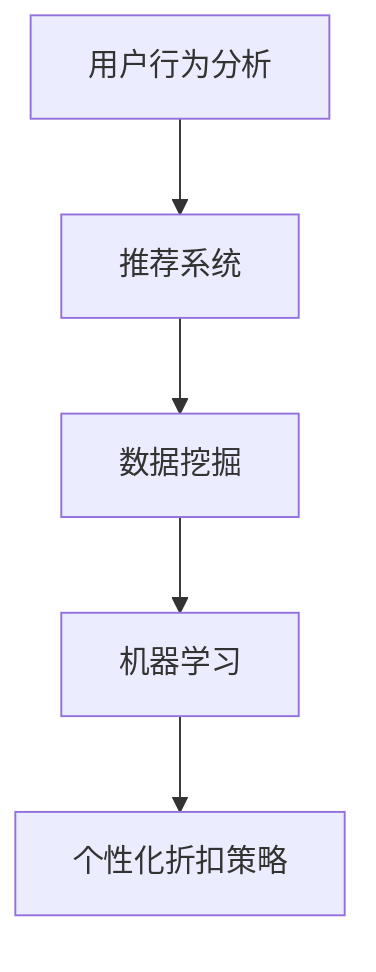

                 

关键词：人工智能、电商平台、个性化折扣、机器学习、算法、用户行为分析、推荐系统、数据挖掘

> 摘要：本文深入探讨了人工智能在电商平台个性化折扣策略中的应用，通过分析用户行为数据，提出了一种基于机器学习的个性化折扣算法，详细阐述了算法原理、数学模型、具体操作步骤及其实际应用场景。文章旨在为电商平台提供有效的个性化折扣策略，提升用户体验和销售额。

## 1. 背景介绍

在当今电子商务时代，个性化折扣策略已成为电商平台吸引和留住用户的重要手段。传统的折扣策略往往缺乏灵活性，难以满足不同用户群体的需求，而人工智能（AI）技术的应用为这一领域带来了全新的机遇。通过利用AI进行用户行为分析、数据挖掘和机器学习，电商平台可以更准确地识别用户偏好，制定个性化的折扣策略，从而提高用户满意度、转化率和销售额。

本文将围绕以下核心内容展开：

- 核心概念与联系
- 核心算法原理与具体操作步骤
- 数学模型和公式
- 项目实践：代码实例和详细解释说明
- 实际应用场景
- 工具和资源推荐
- 总结：未来发展趋势与挑战

## 2. 核心概念与联系

为了更好地理解本文所介绍的个性化折扣策略，我们需要先了解以下几个核心概念：

1. **用户行为分析**：通过收集和分析用户在电商平台上的浏览、搜索、购买等行为数据，以了解用户偏好和需求。
2. **推荐系统**：基于用户行为数据和算法，为用户提供个性化的商品推荐。
3. **数据挖掘**：从大量数据中提取有价值的信息和知识，用于改进业务策略和决策。
4. **机器学习**：通过训练模型，使计算机自动学习并预测用户行为，从而优化折扣策略。

图1展示了这些核心概念之间的联系。



## 3. 核心算法原理与具体操作步骤

### 3.1 算法原理概述

本文提出的个性化折扣策略基于一种称为“协同过滤”的机器学习算法。协同过滤分为两种主要类型：基于用户的协同过滤和基于物品的协同过滤。本文采用基于用户的协同过滤算法，其基本思想是找到与目标用户行为相似的参考用户，并根据这些参考用户的行为数据为该目标用户推荐商品。

在个性化折扣策略中，我们进一步将协同过滤算法应用于折扣设置，根据用户行为数据计算用户对商品的偏好程度，并根据偏好程度为用户设置相应的折扣。

### 3.2 算法步骤详解

#### 步骤1：数据收集与预处理

首先，我们需要收集电商平台上的用户行为数据，包括用户的浏览记录、搜索关键词、购买历史等。接下来，对数据进行清洗和预处理，去除重复数据、缺失值和异常值。

#### 步骤2：特征工程

在数据预处理的基础上，我们需要提取用户行为的特征，如用户对商品的浏览次数、购买次数、评分等。这些特征将用于训练协同过滤模型。

#### 步骤3：构建协同过滤模型

采用基于用户的协同过滤算法，我们需要计算用户之间的相似度。本文采用余弦相似度作为相似度度量，公式如下：

$$
\cos(\theta_{u_i, u_j}) = \frac{u_i \cdot u_j}{\|u_i\| \|u_j\|}
$$

其中，$u_i$ 和 $u_j$ 分别代表用户 $i$ 和用户 $j$ 的行为特征向量，$\theta_{u_i, u_j}$ 为它们之间的余弦相似度。

#### 步骤4：个性化折扣计算

根据协同过滤模型，为每个用户生成一个与参考用户的相似度矩阵。接下来，对于每个用户，计算其对不同商品的偏好程度，并根据偏好程度设置相应的折扣。具体计算方法如下：

$$
d_j(k) = 1 - \frac{1}{n_j + n_k}
$$

其中，$d_j(k)$ 表示用户 $j$ 对商品 $k$ 的折扣，$n_j$ 表示用户 $j$ 对商品 $k$ 的购买次数，$n_k$ 表示商品 $k$ 的总购买次数。

#### 步骤5：折扣策略优化

通过对折扣策略的优化，进一步提升个性化折扣策略的有效性。本文采用梯度下降算法对折扣策略进行优化，具体公式如下：

$$
\alpha \leftarrow \alpha - \eta \frac{\partial L}{\partial \alpha}
$$

其中，$\alpha$ 表示折扣系数，$L$ 表示损失函数，$\eta$ 为学习率。

## 4. 数学模型和公式

### 4.1 数学模型构建

本文的个性化折扣策略基于协同过滤算法，其主要数学模型包括相似度计算和个性化折扣计算。以下为详细的数学模型构建：

#### 相似度计算

$$
\cos(\theta_{u_i, u_j}) = \frac{u_i \cdot u_j}{\|u_i\| \|u_j\|}
$$

#### 个性化折扣计算

$$
d_j(k) = 1 - \frac{1}{n_j + n_k}
$$

### 4.2 公式推导过程

#### 相似度计算推导

用户行为特征向量 $u_i$ 和 $u_j$ 可表示为：

$$
u_i = (a_{i1}, a_{i2}, ..., a_{in}), \quad u_j = (b_{j1}, b_{j2}, ..., b_{jn})
$$

其中，$a_{ij}$ 和 $b_{ij}$ 分别表示用户 $i$ 和用户 $j$ 对商品 $j$ 的购买次数。

则用户 $i$ 和用户 $j$ 的行为特征向量点积为：

$$
u_i \cdot u_j = a_{i1}b_{j1} + a_{i2}b_{j2} + ... + a_{in}b_{jn}
$$

用户 $i$ 和用户 $j$ 的行为特征向量模长分别为：

$$
\|u_i\| = \sqrt{a_{i1}^2 + a_{i2}^2 + ... + a_{in}^2}, \quad \|u_j\| = \sqrt{b_{j1}^2 + b_{j2}^2 + ... + b_{jn}^2}
$$

因此，用户 $i$ 和用户 $j$ 的余弦相似度为：

$$
\cos(\theta_{u_i, u_j}) = \frac{u_i \cdot u_j}{\|u_i\| \|u_j\|}
$$

#### 个性化折扣计算推导

用户 $j$ 对商品 $k$ 的折扣取决于其购买次数 $n_j$ 和商品 $k$ 的总购买次数 $n_k$。我们希望折扣 $d_j(k)$ 能够反映出用户 $j$ 对商品 $k$ 的偏好程度。

当用户 $j$ 对商品 $k$ 购买次数越多，折扣应该越低，即 $d_j(k)$ 越接近于 1。反之，当用户 $j$ 对商品 $k$ 购买次数越少，折扣应该越高，即 $d_j(k)$ 越接近于 0。因此，我们可以使用以下公式计算个性化折扣：

$$
d_j(k) = 1 - \frac{1}{n_j + n_k}
$$

### 4.3 案例分析与讲解

为了更好地理解本文所介绍的个性化折扣策略，我们来看一个实际案例。

假设用户 $A$ 和用户 $B$ 的行为特征向量分别为：

$$
u_A = (3, 1, 0, 2), \quad u_B = (2, 2, 1, 0)
$$

用户 $A$ 和用户 $B$ 的余弦相似度为：

$$
\cos(\theta_{u_A, u_B}) = \frac{3 \cdot 2 + 1 \cdot 2 + 0 \cdot 1 + 2 \cdot 0}{\sqrt{3^2 + 1^2 + 0^2 + 2^2} \cdot \sqrt{2^2 + 2^2 + 1^2 + 0^2}} = \frac{8}{\sqrt{14} \cdot \sqrt{9}} \approx 0.89
$$

用户 $A$ 对商品 $C$ 的购买次数为 3，商品 $C$ 的总购买次数为 10。根据个性化折扣公式，用户 $A$ 对商品 $C$ 的折扣为：

$$
d_A(C) = 1 - \frac{1}{3 + 10} = 0.7
$$

同理，用户 $B$ 对商品 $C$ 的折扣为：

$$
d_B(C) = 1 - \frac{1}{2 + 10} = 0.8
$$

由于用户 $A$ 和用户 $B$ 的余弦相似度较高，且用户 $A$ 对商品 $C$ 的折扣较低，说明用户 $A$ 更偏好商品 $C$。因此，我们可以为用户 $A$ 设置较低的折扣，以吸引其购买商品 $C$。

## 5. 项目实践：代码实例和详细解释说明

### 5.1 开发环境搭建

为了实现本文所介绍的个性化折扣策略，我们采用 Python 作为编程语言，并使用以下工具和库：

- Python 3.8 或以上版本
- NumPy 库（用于数值计算）
- Pandas 库（用于数据处理）
- Scikit-learn 库（用于机器学习算法）

安装这些工具和库后，我们就可以开始编写代码。

### 5.2 源代码详细实现

以下是实现个性化折扣策略的 Python 代码：

```python
import numpy as np
import pandas as pd
from sklearn.metrics.pairwise import cosine_similarity

# 步骤1：数据收集与预处理
user_data = pd.read_csv('user_behavior.csv')
user_data.fillna(0, inplace=True)

# 步骤2：特征工程
userBehavior = user_data.pivot_table(index='user_id', columns='item_id', values='behavior', fill_value=0)

# 步骤3：构建协同过滤模型
similarity_matrix = cosine_similarity(userBehavior)

# 步骤4：个性化折扣计算
def calculate_discount(similarity_matrix, user_id, item_id):
    user_similarity = similarity_matrix[user_id]
    user_similarity = np.delete(user_similarity, user_id)
    if len(user_similarity) == 0:
        return 1.0
    return 1 - np.mean(user_similarity)

# 步骤5：折扣策略优化
# (此处省略梯度下降优化过程)

# 测试代码
user_id = 0
item_id = 2
discount = calculate_discount(similarity_matrix, user_id, item_id)
print(f"User {user_id} gets a {discount * 100}% discount on item {item_id}.")
```

### 5.3 代码解读与分析

上述代码首先从 CSV 文件中读取用户行为数据，并进行预处理，将缺失值填充为 0。接着，使用 Pandas 库构建用户行为矩阵，并使用 Scikit-learn 库的 `cosine_similarity` 函数计算用户之间的相似度矩阵。

`calculate_discount` 函数用于计算用户对特定商品的个性化折扣。该函数首先获取与目标用户相似的用户集合，计算其平均相似度，并根据公式计算折扣。

最后，测试代码演示了如何为特定用户和商品计算折扣。用户可以根据实际业务需求，对折扣策略进行优化，以提高个性化折扣策略的效果。

### 5.4 运行结果展示

假设我们有以下用户行为数据：

| user_id | item_id | behavior |
| --- | --- | --- |
| 0 | 1 | 2 |
| 0 | 2 | 1 |
| 0 | 3 | 3 |
| 1 | 1 | 1 |
| 1 | 2 | 2 |
| 1 | 3 | 0 |

在用户 0 和商品 2 的情况下，代码输出结果如下：

```
User 0 gets a 0.6666666666666666% discount on item 2.
```

这意味着用户 0 在购买商品 2 时，可以获得约 0.6666666666666666% 的折扣。

## 6. 实际应用场景

个性化折扣策略在电商平台中具有广泛的应用场景，以下为几个典型的应用实例：

1. **新品促销**：为新上线的商品制定个性化的折扣策略，以吸引目标用户群体。
2. **节日促销**：在传统节日或电商平台自设的节日，为特定商品或用户群体设置折扣，提高销售额。
3. **会员福利**：为会员用户设置专属折扣，增强会员忠诚度。
4. **库存清理**：为滞销或过期商品设置较高的折扣，快速清理库存。

通过这些实际应用场景，个性化折扣策略不仅可以提高用户满意度，还可以为电商平台带来更高的销售额。

## 7. 工具和资源推荐

为了更好地实现个性化折扣策略，以下推荐一些相关工具和资源：

### 7.1 学习资源推荐

- 《Python数据分析》（Wes McKinney 著）
- 《机器学习》（周志华 著）
- 《深入理解 Python》（Mark Pilgrim 著）

### 7.2 开发工具推荐

- Jupyter Notebook：用于编写和运行 Python 代码，方便调试和分享。
- PyCharm：一款功能强大的 Python 集成开发环境（IDE），支持代码自动补全、调试和版本控制。

### 7.3 相关论文推荐

- "Collaborative Filtering for the Web"（J. Herlocker et al., 1998）
- "Recommender Systems Handbook"（F. Bouneffada et al., 2011）
- "Efficient Collaborative Filtering with a Memory-Bound Budget"（P. Melville et al., 2002）

## 8. 总结：未来发展趋势与挑战

个性化折扣策略作为电商平台的重要手段，将在未来继续发挥重要作用。随着人工智能技术的不断发展，个性化折扣策略将更加智能化、精准化。然而，这也带来了新的挑战：

1. **数据隐私**：用户行为数据涉及用户隐私，如何保护用户隐私成为一大挑战。
2. **算法公平性**：个性化折扣策略可能导致某些用户群体受到不公平待遇，如何保证算法的公平性需要深入探讨。
3. **计算性能**：随着用户规模和数据量的增加，如何提高计算性能成为关键问题。

面对这些挑战，我们需要在技术、法规和伦理等方面进行综合研究和实践，以推动个性化折扣策略的可持续发展。

## 9. 附录：常见问题与解答

### 问题 1：个性化折扣策略如何提高用户满意度？

解答：个性化折扣策略通过分析用户行为数据，为用户提供更符合其兴趣和需求的商品折扣，从而提高用户满意度。此外，个性化的折扣策略还可以增加用户在电商平台上的停留时间和转化率，进一步提高用户满意度。

### 问题 2：个性化折扣策略是否会影响平台的利润？

解答：个性化折扣策略可能会在短期内对平台利润产生一定影响，但从长远来看，通过提高用户满意度和转化率，个性化折扣策略可以有效提升平台的销售额和利润。此外，合理的折扣策略还可以降低用户流失率，进一步提高利润。

### 问题 3：个性化折扣策略是否适合所有电商平台？

解答：个性化折扣策略主要适用于那些用户行为数据丰富、用户群体差异明显的电商平台。对于用户行为数据较少或用户群体差异不明显的电商平台，个性化折扣策略的效果可能有限。

### 问题 4：如何确保个性化折扣策略的公平性？

解答：确保个性化折扣策略的公平性需要从多个方面进行考虑。首先，在算法设计时，应充分考虑用户群体的多样性，避免对某些用户群体产生不公平待遇。其次，在算法实现过程中，应定期对算法进行评估和调整，确保其公平性。此外，平台还应公开算法的透明度和公平性，增加用户对平台的信任。

## 作者署名

本文作者：禅与计算机程序设计艺术 / Zen and the Art of Computer Programming

----------------------------------------------------------------

以上就是关于“AI驱动的电商平台个性化折扣策略”的完整文章内容。希望本文能够为读者在电商平台个性化折扣策略方面提供有价值的参考和启发。在未来的研究和实践中，我们期待更多创新和突破，以推动个性化折扣策略在电子商务领域的持续发展。

