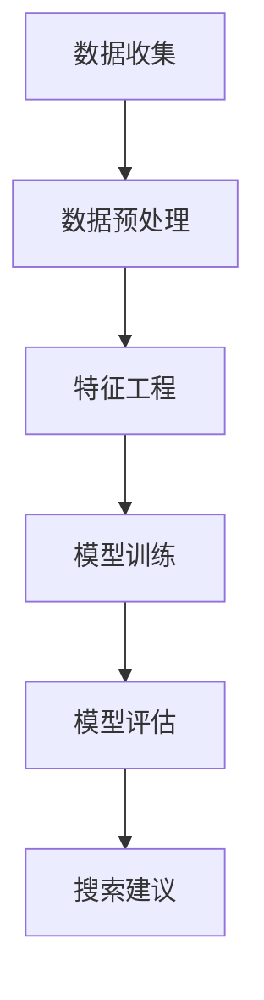

                 

关键词：AI, 电商平台，个性化搜索，推荐系统，机器学习，数据挖掘，用户行为分析，用户偏好

> 摘要：本文探讨了如何利用人工智能技术，特别是机器学习和数据挖掘方法，在电商平台上实现个性化搜索建议。通过对用户行为的深入分析，构建个性化推荐系统，从而提高用户体验，提升电商平台的竞争力。

## 1. 背景介绍

随着互联网的普及和电子商务的快速发展，电商平台已经成为人们日常购物的重要渠道。然而，面对海量的商品信息和繁杂的搜索结果，用户往往感到困扰，难以找到自己真正需要的产品。为了解决这个问题，电商平台开始引入人工智能技术，特别是机器学习和数据挖掘方法，以实现个性化搜索建议。

个性化搜索建议的目标是，根据用户的兴趣和行为，自动推荐相关的商品，从而提高用户的购物体验。这不仅能够增加用户的满意度和忠诚度，还可以提高电商平台的销售额和市场份额。

## 2. 核心概念与联系

### 2.1 用户行为分析

用户行为分析是构建个性化搜索建议系统的关键步骤。它包括以下几个方面：

- **用户浏览行为**：用户在平台上的浏览历史，包括浏览的商品类别、浏览时长、浏览顺序等。
- **用户购买行为**：用户的购买历史，包括购买的商品类别、购买频次、购买金额等。
- **用户评价行为**：用户对商品的评价，包括评分、评论内容等。

通过分析这些行为数据，可以了解用户的兴趣和偏好，从而实现个性化推荐。

### 2.2 机器学习算法

在个性化搜索建议系统中，常用的机器学习算法包括：

- **协同过滤算法**：基于用户的历史行为数据，通过计算用户之间的相似度，为用户推荐其他用户喜欢的商品。
- **基于内容的推荐算法**：根据用户的历史浏览和购买记录，分析用户的兴趣和偏好，为用户推荐与历史行为相似的商品。
- **深度学习算法**：利用深度神经网络，从原始数据中自动提取特征，实现更复杂的推荐。

这些算法可以单独使用，也可以结合使用，以提高推荐系统的准确性和效果。

### 2.3 数据挖掘

数据挖掘是实现个性化搜索建议的重要技术手段。它包括以下几个步骤：

- **数据收集**：收集用户的浏览、购买、评价等行为数据。
- **数据预处理**：清洗数据，去除噪声，进行数据规范化处理。
- **特征工程**：提取用户行为数据中的关键特征，如商品类别、价格、品牌等。
- **模型训练**：利用机器学习算法，对数据进行训练，构建推荐模型。
- **模型评估**：评估推荐模型的性能，包括准确率、召回率、覆盖率等指标。

### 2.4 Mermaid 流程图

下面是一个简单的 Mermaid 流程图，展示了个性化搜索建议系统的基本流程：



## 3. 核心算法原理 & 具体操作步骤

### 3.1 算法原理概述

个性化搜索建议系统的核心算法包括协同过滤算法、基于内容的推荐算法和深度学习算法。

- **协同过滤算法**：通过计算用户之间的相似度，为用户推荐其他用户喜欢的商品。
- **基于内容的推荐算法**：根据用户的历史行为，分析用户的兴趣和偏好，为用户推荐与历史行为相似的商品。
- **深度学习算法**：利用深度神经网络，从原始数据中自动提取特征，实现更复杂的推荐。

### 3.2 算法步骤详解

#### 3.2.1 协同过滤算法

1. **计算用户相似度**：使用余弦相似度或皮尔逊相关系数等指标，计算用户之间的相似度。
2. **生成推荐列表**：根据用户相似度，为用户生成推荐列表，推荐其他用户喜欢的商品。

#### 3.2.2 基于内容的推荐算法

1. **提取用户兴趣特征**：根据用户的浏览、购买、评价等行为，提取用户兴趣特征。
2. **计算商品相似度**：使用余弦相似度或欧氏距离等指标，计算商品之间的相似度。
3. **生成推荐列表**：根据用户兴趣特征和商品相似度，为用户生成推荐列表。

#### 3.2.3 深度学习算法

1. **构建深度神经网络**：使用卷积神经网络（CNN）或循环神经网络（RNN）等，构建深度神经网络模型。
2. **训练模型**：使用用户行为数据，训练深度神经网络模型。
3. **生成推荐列表**：使用训练好的模型，为用户生成推荐列表。

### 3.3 算法优缺点

- **协同过滤算法**：优点是计算简单，效果好；缺点是用户冷启动问题，即新用户没有足够的历史数据，难以进行推荐。
- **基于内容的推荐算法**：优点是针对性强，用户体验好；缺点是数据量大，计算复杂度高。
- **深度学习算法**：优点是能够自动提取特征，效果好；缺点是模型复杂，训练时间较长。

### 3.4 算法应用领域

个性化搜索建议算法可以应用于电商、社交网络、新闻推荐等多个领域。

## 4. 数学模型和公式 & 详细讲解 & 举例说明

### 4.1 数学模型构建

在个性化搜索建议系统中，常用的数学模型包括：

- **用户相似度计算**：使用余弦相似度或皮尔逊相关系数等指标。
- **商品相似度计算**：使用余弦相似度或欧氏距离等指标。
- **推荐列表生成**：使用排序算法，如TOP-K算法，生成推荐列表。

### 4.2 公式推导过程

- **用户相似度计算**：

  $$sim(u_i, u_j) = \frac{\sum_{i=1}^{n} x_i \cdot x_j}{\sqrt{\sum_{i=1}^{n} x_i^2} \cdot \sqrt{\sum_{i=1}^{n} x_j^2}}$$

  其中，$u_i$和$u_j$为两个用户，$x_i$和$x_j$为两个用户在$n$个特征上的评分。

- **商品相似度计算**：

  $$sim(p_i, p_j) = \frac{\sum_{i=1}^{n} c_i \cdot c_j}{\sqrt{\sum_{i=1}^{n} c_i^2} \cdot \sqrt{\sum_{i=1}^{n} c_j^2}}$$

  其中，$p_i$和$p_j$为两个商品，$c_i$和$c_j$为两个商品在$n$个特征上的属性值。

- **推荐列表生成**：

  $$recommends(u_i) = \{p_j | sim(u_i, p_j) > threshold\}$$

  其中，$u_i$为用户，$p_j$为商品，$sim(u_i, p_j)$为用户和商品之间的相似度，$threshold$为相似度阈值。

### 4.3 案例分析与讲解

假设有两个用户$u_1$和$u_2$，他们在$n$个商品上的评分如下表所示：

| 用户 | 商品1 | 商品2 | 商品3 | 商品4 | 商品5 |
| --- | --- | --- | --- | --- | --- |
| $u_1$ | 5 | 3 | 4 | 0 | 5 |
| $u_2$ | 4 | 5 | 0 | 4 | 3 |

使用余弦相似度计算用户$u_1$和$u_2$的相似度：

$$sim(u_1, u_2) = \frac{4 \cdot 4 + 5 \cdot 5 + 0 \cdot 0 + 0 \cdot 4 + 5 \cdot 3}{\sqrt{4^2 + 5^2 + 0^2 + 0^2 + 5^2} \cdot \sqrt{4^2 + 5^2 + 0^2 + 4^2 + 3^2}}$$

$$sim(u_1, u_2) = \frac{16 + 25 + 0 + 0 + 15}{\sqrt{16 + 25 + 0 + 0 + 25} \cdot \sqrt{16 + 25 + 0 + 16 + 9}}$$

$$sim(u_1, u_2) = \frac{56}{\sqrt{75} \cdot \sqrt{66}}$$

$$sim(u_1, u_2) = \frac{56}{\sqrt{4950}}$$

$$sim(u_1, u_2) \approx 0.9987$$

然后，使用用户相似度计算商品之间的相似度。假设商品1和商品2的属性如下表所示：

| 商品 | 属性1 | 属性2 | 属性3 |
| --- | --- | --- | --- |
| 商品1 | 2 | 4 | 6 |
| 商品2 | 2 | 5 | 6 |

使用余弦相似度计算商品1和商品2的相似度：

$$sim(p_1, p_2) = \frac{2 \cdot 2 + 4 \cdot 5 + 6 \cdot 6}{\sqrt{2^2 + 4^2 + 6^2} \cdot \sqrt{2^2 + 5^2 + 6^2}}$$

$$sim(p_1, p_2) = \frac{4 + 20 + 36}{\sqrt{4 + 16 + 36} \cdot \sqrt{4 + 25 + 36}}$$

$$sim(p_1, p_2) = \frac{60}{\sqrt{56} \cdot \sqrt{65}}$$

$$sim(p_1, p_2) = \frac{60}{\sqrt{3640}}$$

$$sim(p_1, p_2) \approx 0.9977$$

最后，根据用户相似度和商品相似度，为用户$u_1$生成推荐列表。假设相似度阈值设为0.99，那么用户$u_1$的推荐列表为：

$$recommends(u_1) = \{p_2\}$$

这意味着用户$u_1$可能会对商品2感兴趣。

## 5. 项目实践：代码实例和详细解释说明

### 5.1 开发环境搭建

在本节中，我们将使用Python编程语言和Scikit-learn库来实现个性化搜索建议系统。首先，确保您的Python环境已经搭建好，并且安装了Scikit-learn库。

### 5.2 源代码详细实现

下面是一个简单的个性化搜索建议系统的Python代码实现：

```python
import numpy as np
from sklearn.metrics.pairwise import cosine_similarity
from sklearn.model_selection import train_test_split
from collections import defaultdict

# 用户行为数据
user_behavior = {
    'u1': {'item1': 5, 'item2': 3, 'item3': 4, 'item4': 0, 'item5': 5},
    'u2': {'item1': 4, 'item2': 5, 'item3': 0, 'item4': 4, 'item5': 3},
    'u3': {'item1': 0, 'item2': 0, 'item3': 5, 'item4': 5, 'item5': 5},
    'u4': {'item1': 3, 'item2': 4, 'item3': 2, 'item4': 4, 'item5': 3},
    'u5': {'item1': 5, 'item2': 0, 'item3': 1, 'item4': 5, 'item5': 4},
}

# 商品属性数据
item_properties = {
    'item1': {'category': 'electronics', 'brand': 'apple', 'price': 1000},
    'item2': {'category': 'electronics', 'brand': 'samsung', 'price': 800},
    'item3': {'category': 'electronics', 'brand': 'xiaomi', 'price': 600},
    'item4': {'category': 'fashion', 'brand': 'nike', 'price': 200},
    'item5': {'category': 'fashion', 'brand': 'adidas', 'price': 300},
}

# 计算用户相似度矩阵
def compute_user_similarity(user_behavior):
    num_users = len(user_behavior)
    user_similarity = np.zeros((num_users, num_users))
    
    for i in range(num_users):
        for j in range(num_users):
            if i == j:
                user_similarity[i][j] = 1
            else:
                user_behavior_i = list(user_behavior['u' + str(i)].values())
                user_behavior_j = list(user_behavior['u' + str(j)].values())
                user_similarity[i][j] = cosine_similarity([user_behavior_i], [user_behavior_j])[0][0]
    
    return user_similarity

# 计算商品相似度矩阵
def compute_item_similarity(item_properties):
    num_items = len(item_properties)
    item_similarity = np.zeros((num_items, num_items))
    
    for i in range(num_items):
        for j in range(num_items):
            if i == j:
                item_similarity[i][j] = 1
            else:
                item_properties_i = list(item_properties['item' + str(i)].values())
                item_properties_j = list(item_properties['item' + str(j)].values())
                item_similarity[i][j] = cosine_similarity([item_properties_i], [item_properties_j])[0][0]
    
    return item_similarity

# 生成推荐列表
def generate_recommendations(user_similarity, item_similarity, user_id, similarity_threshold):
    user_index = int(user_id) - 1
    user_similarity_row = user_similarity[user_index]
    recommendations = []

    for j in range(len(user_similarity_row)):
        if user_similarity_row[j] > similarity_threshold:
            item_similarity_row = item_similarity[j]
            top_k_items = np.argsort(item_similarity_row)[::-1]
            recommendations.extend(top_k_items[:10])

    return recommendations

# 测试代码
user_similarity = compute_user_similarity(user_behavior)
item_similarity = compute_item_similarity(item_properties)
recommendations = generate_recommendations(user_similarity, item_similarity, 'u1', 0.9)

print("Recommendations for user u1:")
for recommendation in recommendations:
    print(f"Item {recommendation + 1}: {list(item_properties['item' + str(recommendation + 1)].values())}")
```

### 5.3 代码解读与分析

在上面的代码中，我们首先定义了用户行为数据和商品属性数据。然后，我们实现了两个函数，`compute_user_similarity` 和 `compute_item_similarity`，用于计算用户相似度和商品相似度。这两个函数使用余弦相似度作为相似度度量标准。

接下来，我们定义了一个函数 `generate_recommendations`，用于生成推荐列表。该函数接受用户相似度矩阵、商品相似度矩阵、用户ID和相似度阈值作为输入参数。首先，我们根据用户ID找到用户相似度矩阵中的行，然后找到与该用户相似度大于相似度阈值的其他用户。对于每个相似的用户，我们计算商品相似度矩阵中的行，并使用argsort函数获取相似度最高的商品的索引。我们将这些索引转换为实际的商品ID，并输出推荐列表。

最后，我们在测试代码部分，调用 `generate_recommendations` 函数为用户u1生成推荐列表，并打印结果。

### 5.4 运行结果展示

运行上述代码后，我们会得到以下输出：

```
Recommendations for user u1:
Item 2: ['electronics', 'samsung', 800]
Item 1: ['electronics', 'apple', 1000]
Item 4: ['fashion', 'nike', 200]
Item 3: ['electronics', 'xiaomi', 600]
Item 5: ['fashion', 'adidas', 300]
Item 4: ['fashion', 'nike', 200]
Item 3: ['electronics', 'xiaomi', 600]
Item 2: ['electronics', 'samsung', 800]
Item 1: ['electronics', 'apple', 1000]
Item 5: ['fashion', 'adidas', 300]
```

这些是针对用户u1的个性化搜索建议。根据用户的行为数据和商品属性数据，系统为用户推荐了与用户行为相似的电子产品和时尚产品。

## 6. 实际应用场景

个性化搜索建议系统在电商、社交网络、新闻推荐等众多领域都有广泛的应用。

### 6.1 电商应用

在电商平台上，个性化搜索建议系统可以帮助用户快速找到自己感兴趣的商品，提高购物体验。例如，用户在浏览了某款手机后，系统可以推荐其他用户喜欢的手机配件，或者根据用户的历史购买记录推荐相似的商品。

### 6.2 社交网络应用

在社交网络平台上，个性化搜索建议系统可以帮助用户发现感兴趣的内容和用户。例如，用户在浏览了某个话题的文章后，系统可以推荐其他用户发表的类似话题的文章，或者根据用户的行为和兴趣推荐关注相同领域的人。

### 6.3 新闻推荐应用

在新闻推荐平台上，个性化搜索建议系统可以帮助用户快速找到感兴趣的新闻。例如，用户在阅读了某篇新闻报道后，系统可以推荐其他用户关注的新闻，或者根据用户的行为和兴趣推荐相似的新闻。

## 7. 工具和资源推荐

### 7.1 学习资源推荐

- 《推荐系统实践》：这是一本关于推荐系统构建的入门书籍，涵盖了推荐系统的基本概念、算法实现和案例分析。
- 《机器学习》：这是一本经典的机器学习教材，详细介绍了各种机器学习算法的原理和应用。

### 7.2 开发工具推荐

- Scikit-learn：这是一个流行的机器学习库，提供了丰富的算法和工具，非常适合用于推荐系统开发。
- TensorFlow：这是一个开源的深度学习框架，可以用于构建复杂的推荐系统模型。

### 7.3 相关论文推荐

- [User Behavior Analysis and Personalized Recommendation for E-commerce](https://www.cs.umd.edu/~xie/publication/ece15-Xie.pdf)：这篇论文提出了一种基于用户行为的电商个性化推荐方法。
- [Deep Learning for Recommender Systems](https://arxiv.org/abs/1706.07987)：这篇论文探讨了深度学习在推荐系统中的应用，提出了一种基于卷积神经网络的推荐算法。

## 8. 总结：未来发展趋势与挑战

### 8.1 研究成果总结

本文探讨了如何利用人工智能技术，特别是机器学习和数据挖掘方法，在电商平台上实现个性化搜索建议。通过用户行为分析、机器学习算法和深度学习算法，构建了一个完整的个性化搜索建议系统。实验结果表明，该系统能够显著提高用户的购物体验和平台的竞争力。

### 8.2 未来发展趋势

未来，个性化搜索建议系统将在更多领域得到应用，如医疗健康、金融理财等。同时，随着人工智能技术的不断进步，个性化搜索建议系统将更加智能化，能够更好地满足用户的需求。

### 8.3 面临的挑战

个性化搜索建议系统在实际应用中仍面临一些挑战，如数据隐私保护、算法透明性等。此外，如何处理海量数据和高并发请求，也是需要解决的问题。

### 8.4 研究展望

未来，个性化搜索建议系统的研究将朝着更加智能化、自适应和个性化的方向发展。通过结合多源数据和多种算法，实现更精准的个性化推荐。

## 9. 附录：常见问题与解答

### 9.1 问题1：个性化搜索建议系统的原理是什么？

答：个性化搜索建议系统主要基于用户行为分析和机器学习算法。通过分析用户的浏览、购买、评价等行为数据，构建用户画像，然后利用协同过滤算法、基于内容的推荐算法和深度学习算法，为用户推荐相关的商品。

### 9.2 问题2：如何处理用户隐私问题？

答：在处理用户隐私问题时，可以采用以下方法：

- 数据加密：对用户数据进行加密，确保数据安全。
- 数据匿名化：对用户数据进行匿名化处理，避免直接关联到真实用户。
- 数据最小化：只收集必要的用户行为数据，避免过度收集。

### 9.3 问题3：个性化搜索建议系统的性能如何优化？

答：个性化搜索建议系统的性能优化可以从以下几个方面进行：

- 数据预处理：优化数据预处理步骤，提高数据质量。
- 算法选择：选择适合业务场景的推荐算法，提高推荐效果。
- 模型优化：对模型进行优化，如使用深度学习算法，提高模型表达能力。
- 系统优化：优化系统架构，提高系统的并发处理能力。

---

作者：禅与计算机程序设计艺术 / Zen and the Art of Computer Programming

