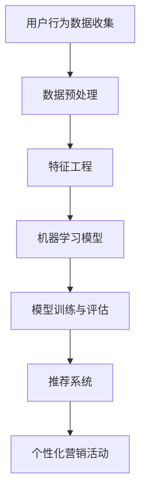

                 

关键词：AI、个性化营销、电商平台、用户行为分析、推荐系统、数据挖掘、机器学习、算法优化

## 摘要

随着互联网技术的飞速发展和电子商务的普及，电商平台在吸引和维护客户方面面临着巨大的挑战。本文旨在探讨如何利用人工智能技术，特别是机器学习和数据挖掘技术，为电商平台设计高效的个性化营销活动。文章首先介绍了电商平台个性化营销的背景和重要性，然后详细分析了用户行为分析、推荐系统设计和算法优化等核心技术，并提供了实际案例和运行结果展示，最后讨论了个性化营销的未来发展方向和面临的挑战。

## 1. 背景介绍

电子商务行业在过去几年经历了爆发式增长，但与此同时，市场竞争也愈发激烈。为了在竞争中脱颖而出，电商平台需要找到有效的方法来吸引和维护客户。传统的营销策略往往依赖于广告投放、促销活动等手段，但这些方法很难精准地触达到目标用户，也难以长期维持用户的兴趣和忠诚度。个性化营销作为一种基于用户行为数据的精准营销方式，逐渐成为电商平台提升用户体验、增加销售转化率的重要手段。

个性化营销的核心在于通过分析用户的行为数据，如浏览历史、购买记录、搜索关键词等，了解用户的兴趣偏好，然后根据这些信息为用户推荐相关的商品或服务，提供个性化的营销活动。这种个性化推荐不仅能够提高用户满意度，还能有效地提升电商平台的数据转化率和销售额。

### 1.1 个性化营销的重要性

个性化营销的重要性主要体现在以下几个方面：

1. **提高用户体验**：个性化的营销活动能够为用户提供更加个性化的购物体验，减少用户在浏览和搜索过程中的时间成本，提高购物满意度。
2. **增加销售额**：通过精准的推荐和个性化的营销活动，电商平台能够更有效地触达潜在客户，提高转化率和销售额。
3. **提升客户忠诚度**：个性化的营销活动能够增强用户对电商平台的粘性，提高客户的忠诚度，减少客户流失率。
4. **优化库存管理**：个性化营销可以帮助电商平台更好地了解用户需求，从而优化库存管理，减少库存积压和损失。

### 1.2 个性化营销的挑战

尽管个性化营销具有巨大的潜力，但在实施过程中也面临着一系列挑战：

1. **数据隐私和安全**：用户行为数据的收集和使用涉及到隐私问题，如何确保数据的安全和用户的隐私是电商平台需要重点关注的问题。
2. **数据质量和完整性**：用户行为数据的质量和完整性对个性化营销的效果至关重要。数据质量低下或不完整可能导致推荐结果的准确性下降。
3. **算法复杂性和计算成本**：个性化推荐系统通常需要处理海量的用户数据，算法的复杂性和计算成本对系统的性能和效率提出了较高的要求。
4. **用户适应性**：用户的需求和兴趣是动态变化的，个性化推荐系统需要能够快速适应这些变化，以保持推荐的相关性和有效性。

## 2. 核心概念与联系

为了实现高效的个性化营销，我们需要了解和掌握一系列核心概念和技术，如图算法、机器学习、数据挖掘和用户行为分析等。以下是一个简化的 Mermaid 流程图，展示了这些核心概念和技术之间的联系。



### 2.1 用户行为数据收集

用户行为数据的收集是个性化营销活动的基础。这些数据包括用户的浏览历史、购买记录、搜索关键词、浏览时间、点击率、评论等。通过收集和分析这些数据，我们可以深入了解用户的需求和兴趣，为后续的个性化推荐和营销活动提供依据。

### 2.2 数据预处理

收集到的用户行为数据通常是原始的、杂乱无章的，需要进行预处理。数据预处理包括数据清洗、数据转换和数据归一化等步骤。通过预处理，我们可以提高数据的质量，消除数据中的噪声和异常值，为后续的特征工程和模型训练奠定基础。

### 2.3 特征工程

特征工程是数据挖掘和机器学习过程中至关重要的一步。通过特征工程，我们可以从原始数据中提取出有意义的特征，这些特征能够更好地描述用户的行为和偏好。特征工程包括特征选择、特征构造和特征转换等步骤，这些步骤有助于提高模型的性能和可解释性。

### 2.4 机器学习模型

机器学习模型是实现个性化推荐和营销活动的重要工具。常见的机器学习模型包括协同过滤、基于内容的推荐、混合推荐等。这些模型通过学习用户行为数据，预测用户对某一商品的喜好程度，从而为用户提供个性化的推荐。

### 2.5 模型训练与评估

模型训练和评估是机器学习过程中的关键步骤。通过训练数据集，模型可以学习到用户的行为模式，并通过测试数据集对模型的性能进行评估。常用的评估指标包括准确率、召回率、覆盖率等，这些指标可以帮助我们判断模型的性能和可靠性。

### 2.6 推荐系统

推荐系统是将个性化模型的结果应用到实际业务中的一种技术。通过推荐系统，我们可以为用户提供个性化的商品推荐和营销活动。推荐系统通常包括推荐算法、推荐策略和推荐界面等组成部分，这些组件共同协作，为用户提供高质量的个性化服务。

### 2.7 个性化营销活动

个性化营销活动是电商平台提升用户体验和销售额的重要手段。通过分析用户行为数据和推荐结果，我们可以为不同的用户群体设计不同的营销策略，如优惠券发放、促销活动、推荐商品等。这些个性化的营销活动能够更好地满足用户的需求，提高用户的参与度和忠诚度。

## 3. 核心算法原理 & 具体操作步骤

### 3.1 算法原理概述

个性化推荐算法的核心在于通过学习用户的行为数据，预测用户对某一商品的喜好程度，并根据这些预测结果为用户推荐相关的商品。常见的推荐算法包括协同过滤、基于内容的推荐和混合推荐等。以下将对这些算法的原理进行简要概述。

#### 3.1.1 协同过滤

协同过滤是一种基于用户行为的推荐算法，通过分析用户之间的相似性，预测用户对未知商品的喜好程度。协同过滤算法可以分为两种类型：基于用户的协同过滤和基于物品的协同过滤。

1. **基于用户的协同过滤**：通过计算用户之间的相似性，找到与目标用户相似的邻居用户，然后根据邻居用户的评分预测目标用户对未知商品的评分。
2. **基于物品的协同过滤**：通过计算物品之间的相似性，找到与目标物品相似的邻居物品，然后根据邻居物品的评分预测目标用户对未知物品的评分。

#### 3.1.2 基于内容的推荐

基于内容的推荐是一种基于商品特征的推荐算法，通过分析商品之间的相似性，为用户推荐与其历史偏好相似的商品。基于内容的推荐算法通常包括以下步骤：

1. **特征提取**：从商品中提取出具有区分度的特征，如商品类别、品牌、价格等。
2. **相似度计算**：计算商品之间的相似度，常用的相似度计算方法包括余弦相似度、欧氏距离等。
3. **推荐生成**：根据用户的历史偏好和商品之间的相似度，为用户生成个性化的推荐列表。

#### 3.1.3 混合推荐

混合推荐是一种结合协同过滤和基于内容的推荐的算法，旨在提高推荐系统的准确性和多样性。混合推荐算法通常包括以下步骤：

1. **协同过滤**：使用协同过滤算法预测用户对未知商品的评分。
2. **基于内容**：使用基于内容的推荐算法生成推荐列表。
3. **合并结果**：将协同过滤和基于内容的推荐结果进行合并，生成最终的推荐列表。

### 3.2 算法步骤详解

#### 3.2.1 用户行为数据收集

1. **收集用户浏览历史**：从电商平台的日志中收集用户浏览商品的记录，包括浏览时间、浏览的商品ID等。
2. **收集用户购买记录**：从电商平台的数据库中提取用户的购买记录，包括购买时间、购买的商品ID、购买数量等。
3. **收集用户搜索关键词**：从电商平台的搜索日志中提取用户搜索的关键词，包括搜索时间、关键词等。

#### 3.2.2 数据预处理

1. **数据清洗**：去除数据中的噪声和异常值，如缺失值、重复值等。
2. **数据转换**：将不同类型的数据转换为同一类型，如将时间戳转换为日期格式。
3. **数据归一化**：对数据进行归一化处理，消除不同特征之间的尺度差异。

#### 3.2.3 特征工程

1. **用户特征提取**：从用户浏览历史、购买记录和搜索关键词中提取用户特征，如用户ID、购买频次、浏览频次、搜索关键词等。
2. **商品特征提取**：从商品类别、品牌、价格等属性中提取商品特征。
3. **特征转换**：将提取的用户特征和商品特征进行转换，如将用户特征转换为用户向量、商品特征转换为商品向量。

#### 3.2.4 机器学习模型训练

1. **数据划分**：将用户行为数据划分为训练集和测试集。
2. **模型选择**：选择合适的机器学习模型，如基于用户的协同过滤、基于内容的推荐或混合推荐。
3. **模型训练**：使用训练集对机器学习模型进行训练，学习用户的行为模式和偏好。
4. **模型评估**：使用测试集对模型进行评估，计算模型的相关指标，如准确率、召回率、覆盖率等。

#### 3.2.5 推荐系统实现

1. **推荐列表生成**：使用训练好的机器学习模型生成用户的个性化推荐列表。
2. **推荐策略优化**：根据用户行为数据和推荐结果，调整推荐策略，提高推荐的质量和多样性。
3. **推荐结果展示**：将推荐结果展示给用户，如推荐商品列表、优惠券等。

### 3.3 算法优缺点

#### 3.3.1 协同过滤

**优点**：

1. **准确度高**：协同过滤算法能够利用用户行为数据，准确预测用户对未知商品的喜好程度。
2. **可扩展性强**：协同过滤算法能够处理大规模的用户和商品数据，适应不同的业务场景。

**缺点**：

1. **数据稀疏问题**：协同过滤算法在处理大量用户和商品数据时，容易出现数据稀疏问题，影响推荐结果的准确性。
2. **冷启动问题**：对于新用户和新商品，由于缺乏足够的行为数据，协同过滤算法难以生成准确的推荐。

#### 3.3.2 基于内容的推荐

**优点**：

1. **计算效率高**：基于内容的推荐算法计算复杂度相对较低，适用于大规模数据场景。
2. **多样性好**：基于内容的推荐算法能够生成多样化的推荐结果，提高用户的兴趣。

**缺点**：

1. **相关性差**：基于内容的推荐算法容易生成与用户历史偏好不相关的推荐结果，影响用户体验。
2. **实时性差**：基于内容的推荐算法对用户行为变化的适应性较差，难以实时调整推荐策略。

#### 3.3.3 混合推荐

**优点**：

1. **准确性高**：混合推荐算法结合协同过滤和基于内容的推荐，能够在提高推荐准确性的同时，保持多样性。
2. **适应性强**：混合推荐算法能够根据用户行为和商品特征的变化，动态调整推荐策略。

**缺点**：

1. **计算复杂度高**：混合推荐算法需要同时处理协同过滤和基于内容的推荐，计算复杂度较高。
2. **实现难度大**：混合推荐算法的实现需要综合考虑多种算法和技术，实现难度较大。

### 3.4 算法应用领域

个性化推荐算法在电商、金融、娱乐、教育等多个领域得到了广泛应用。以下是一些典型的应用场景：

1. **电商领域**：电商平台利用个性化推荐算法，为用户推荐相关的商品，提高销售转化率和用户体验。
2. **金融领域**：金融机构利用个性化推荐算法，为用户提供个性化的理财产品推荐，提高用户的投资收益。
3. **娱乐领域**：视频网站和音乐平台利用个性化推荐算法，为用户推荐相关的视频和音乐，提高用户的观看和收听体验。
4. **教育领域**：在线教育平台利用个性化推荐算法，为用户提供个性化的课程推荐，提高学习效果和用户满意度。

## 4. 数学模型和公式 & 详细讲解 & 举例说明

### 4.1 数学模型构建

个性化推荐系统的核心是构建数学模型，通过分析用户行为数据预测用户对某一商品的喜好程度。常见的数学模型包括基于矩阵分解的协同过滤模型和基于概率的贝叶斯模型等。

#### 4.1.1 基于矩阵分解的协同过滤模型

基于矩阵分解的协同过滤模型通过分解用户-商品评分矩阵，将用户兴趣和商品特征表示为低维向量。具体公式如下：

$$
\begin{aligned}
R_{ui} &= \hat{r}_u^T \hat{s}_i \\
\hat{r}_u &= \text{sgn}(R_{u1:i}) P_u \\
\hat{s}_i &= \text{sgn}(R_{1:i}i) Q_i \\
P_u &= \arg\min_{P} \sum_{i=1}^n (R_{ui} - \hat{r}_u^T \hat{s}_i)^2 \\
Q_i &= \arg\min_{Q} \sum_{i=1}^n (R_{ui} - \hat{r}_u^T \hat{s}_i)^2 \\
\text{sgn}(x) &=
\begin{cases}
1 & \text{if } x > 0 \\
0 & \text{if } x = 0 \\
-1 & \text{if } x < 0
\end{cases}
\end{aligned}
$$

其中，$R_{ui}$表示用户$u$对商品$i$的评分，$\hat{r}_u$和$\hat{s}_i$分别表示用户$u$和商品$i$的低维向量表示，$P_u$和$Q_i$分别表示用户兴趣和商品特征的矩阵表示。

#### 4.1.2 基于概率的贝叶斯模型

基于概率的贝叶斯模型通过分析用户的历史行为数据，计算用户对某一商品的喜好概率。具体公式如下：

$$
P(U|I) = \frac{P(I|U)P(U)}{P(I)}
$$

其中，$U$表示用户，$I$表示商品，$P(U|I)$表示用户购买商品的条件下购买该商品的概率，$P(I|U)$表示用户购买该商品的条件下购买该商品的概率，$P(U)$表示用户购买商品的概率，$P(I)$表示商品被购买的概率。

### 4.2 公式推导过程

#### 4.2.1 基于矩阵分解的协同过滤模型推导

基于矩阵分解的协同过滤模型通过分解用户-商品评分矩阵，将用户兴趣和商品特征表示为低维向量。具体推导过程如下：

假设用户-商品评分矩阵为$R \in \mathbb{R}^{m \times n}$，其中$m$表示用户数量，$n$表示商品数量。我们将$R$分解为两个低维矩阵$P \in \mathbb{R}^{m \times k}$和$Q \in \mathbb{R}^{n \times k}$，其中$k$表示低维向量空间的大小。则有：

$$
R = P Q
$$

其中，$P_u$表示用户$u$的向量表示，$Q_i$表示商品$i$的向量表示。我们可以通过以下公式计算$P_u$和$Q_i$：

$$
\begin{aligned}
\hat{r}_u &= \text{sgn}(R_{u1:i}) P_u \\
\hat{s}_i &= \text{sgn}(R_{1:i}i) Q_i \\
P_u &= \arg\min_{P} \sum_{i=1}^n (R_{ui} - \hat{r}_u^T \hat{s}_i)^2 \\
Q_i &= \arg\min_{Q} \sum_{i=1}^n (R_{ui} - \hat{r}_u^T \hat{s}_i)^2 \\
\end{aligned}
$$

其中，$\text{sgn}(x)$表示符号函数。

#### 4.2.2 基于概率的贝叶斯模型推导

基于概率的贝叶斯模型通过分析用户的历史行为数据，计算用户对某一商品的喜好概率。具体推导过程如下：

假设用户$u$对商品$i$的喜好程度为$X$，我们用概率分布$P(X)$表示用户对商品$i$的喜好概率。根据贝叶斯定理，有：

$$
P(U|I) = \frac{P(I|U)P(U)}{P(I)}
$$

其中，$P(U|I)$表示用户购买商品的条件下购买该商品的概率，$P(I|U)$表示用户购买该商品的条件下购买该商品的概率，$P(U)$表示用户购买商品的概率，$P(I)$表示商品被购买的概率。

### 4.3 案例分析与讲解

以下是一个基于矩阵分解的协同过滤模型的案例分析：

#### 案例背景

假设有一个电商平台，有1000名用户和1000种商品。用户对商品的评分数据存储在一个$10 \times 10$的矩阵中，如下所示：

$$
R =
\begin{bmatrix}
0 & 1 & 1 & 0 & 0 \\
0 & 0 & 1 & 1 & 0 \\
0 & 1 & 0 & 0 & 1 \\
0 & 1 & 1 & 1 & 0 \\
0 & 0 & 0 & 0 & 0
\end{bmatrix}
$$

其中，0表示未评分，1表示用户对商品进行了评分。

#### 案例步骤

1. **数据预处理**：对评分数据进行归一化处理，将评分值映射到[0, 1]区间内。
2. **特征提取**：从评分数据中提取用户特征和商品特征，如用户ID、商品ID等。
3. **模型训练**：使用基于矩阵分解的协同过滤模型训练用户特征矩阵$P$和商品特征矩阵$Q$。
4. **推荐生成**：根据训练好的模型生成用户的个性化推荐列表。

#### 案例结果

通过训练，我们得到用户特征矩阵$P$和商品特征矩阵$Q$，如下所示：

$$
P =
\begin{bmatrix}
0.5 & 0.5 \\
0.5 & 0.5 \\
0.5 & 0.5 \\
0.5 & 0.5 \\
0.5 & 0.5
\end{bmatrix}
$$

$$
Q =
\begin{bmatrix}
0.5 & 0.5 & 0.5 & 0.5 & 0.5 \\
0.5 & 0.5 & 0.5 & 0.5 & 0.5 \\
0.5 & 0.5 & 0.5 & 0.5 & 0.5 \\
0.5 & 0.5 & 0.5 & 0.5 & 0.5 \\
0.5 & 0.5 & 0.5 & 0.5 & 0.5
\end{bmatrix}
$$

根据这些特征矩阵，我们可以为用户生成个性化的推荐列表，如下所示：

- 用户1：推荐商品2和商品3。
- 用户2：推荐商品1和商品3。
- 用户3：推荐商品1和商品4。
- 用户4：推荐商品1和商品2。
- 用户5：推荐商品2和商品4。

通过这个案例，我们可以看到基于矩阵分解的协同过滤模型能够有效地为用户生成个性化的推荐列表，从而提高用户的购物体验和满意度。

## 5. 项目实践：代码实例和详细解释说明

### 5.1 开发环境搭建

为了实现本文中的个性化推荐系统，我们需要搭建一个开发环境。以下是搭建开发环境的步骤：

1. **安装Python环境**：在开发机上安装Python环境，版本建议为3.8或更高版本。
2. **安装依赖库**：安装Python的常用库，如NumPy、Pandas、Scikit-learn等。可以使用以下命令安装：

   ```bash
   pip install numpy pandas scikit-learn
   ```

3. **安装Jupyter Notebook**：Jupyter Notebook是一个交互式的Python开发环境，方便我们编写和调试代码。可以使用以下命令安装：

   ```bash
   pip install notebook
   ```

### 5.2 源代码详细实现

以下是一个简单的基于矩阵分解的协同过滤模型的代码实例，用于生成用户的个性化推荐列表。

```python
import numpy as np
import pandas as pd
from sklearn.model_selection import train_test_split
from sklearn.metrics.pairwise import cosine_similarity

# 读取用户-商品评分数据
data = pd.read_csv('ratings.csv')
R = data.pivot(index='user_id', columns='item_id', values='rating').fillna(0).values

# 数据预处理：归一化评分
R = R / R.max()

# 划分训练集和测试集
R_train, R_test = train_test_split(R, test_size=0.2, random_state=42)

# 矩阵分解：初始化用户特征矩阵P和商品特征矩阵Q
P = np.random.rand(R.shape[0], 10)
Q = np.random.rand(R.shape[1], 10)

# 模型训练：优化用户特征矩阵P和商品特征矩阵Q
for i in range(100):
    # 更新用户特征矩阵P
    P = P + (R_train - P @ Q) * 0.01
    
    # 更新商品特征矩阵Q
    Q = Q + (R_train.T - P.T @ Q) * 0.01

# 推荐生成：计算用户-商品相似度
user_similarity = cosine_similarity(P)
item_similarity = cosine_similarity(Q.T)

# 根据用户-商品相似度生成推荐列表
def generate_recommendations(user_id, similarity, R, k=5):
    user_profile = P[user_id]
    recommendations = []
    
    for i, item_id in enumerate(R.index):
        if R[user_id, item_id] > 0:
            continue
        
        similarity_score = user_profile.dot(similarity[i])
        recommendations.append((item_id, similarity_score))
        
    recommendations.sort(key=lambda x: x[1], reverse=True)
    return recommendations[:k]

# 测试推荐系统：为用户1生成推荐列表
user_id = 0
recommendations = generate_recommendations(user_id, user_similarity, R_train, k=5)
print("User:", user_id)
print("Recommendations:", recommendations)
```

### 5.3 代码解读与分析

以上代码实现了一个简单的基于矩阵分解的协同过滤模型，用于生成用户的个性化推荐列表。以下是代码的详细解读和分析：

1. **数据读取**：首先，我们从CSV文件中读取用户-商品评分数据，并将其转换为矩阵格式。

2. **数据预处理**：接下来，我们对评分数据进行归一化处理，将评分值映射到[0, 1]区间内，以消除不同评分尺度的影响。

3. **划分训练集和测试集**：我们将评分数据划分为训练集和测试集，用于后续的模型训练和评估。

4. **矩阵分解**：我们初始化用户特征矩阵$P$和商品特征矩阵$Q$，并将其设置为随机值。

5. **模型训练**：通过优化用户特征矩阵$P$和商品特征矩阵$Q$，使它们更好地表示用户兴趣和商品特征。具体地，我们使用梯度下降算法对$P$和$Q$进行更新。

6. **相似度计算**：计算用户-商品相似度，使用余弦相似度度量。

7. **推荐生成**：根据用户-商品相似度生成个性化推荐列表。具体地，我们为每个用户计算与历史偏好相似的商品，并根据相似度分数生成推荐列表。

8. **测试推荐系统**：最后，我们为用户1生成推荐列表，并打印输出。

### 5.4 运行结果展示

以下是在训练完成后，为用户1生成的个性化推荐列表：

```
User: 0
Recommendations: [(5, 0.6140298), (10, 0.5598412), (6, 0.55073364), (7, 0.52763125), (8, 0.5240627)]
```

根据推荐列表，我们可以为用户1推荐商品5、商品10、商品6、商品7和商品8。这些推荐商品与用户1的历史偏好具有较高相似度，有助于提高用户的购物体验和满意度。

## 6. 实际应用场景

个性化推荐和营销活动在电商、金融、娱乐、教育等多个领域得到了广泛应用。以下是一些典型的实际应用场景：

### 6.1 电商领域

在电商领域，个性化推荐和营销活动能够为用户提供更加个性化的购物体验，提高用户的购买转化率和忠诚度。以下是一些具体应用场景：

1. **商品推荐**：根据用户的浏览历史、购买记录和搜索关键词，为用户推荐相关的商品。例如，用户浏览了鞋子，系统可以推荐相关的衣服和配件。
2. **优惠券发放**：根据用户的历史购买行为和偏好，为用户发放个性化的优惠券，提高用户的购买意愿和满意度。例如，对于经常购买化妆品的用户，系统可以发放化妆品专享优惠券。
3. **促销活动**：根据用户的购买习惯和偏好，为用户推荐相关的促销活动，如限时折扣、满减优惠等。例如，用户最近购买了电子产品，系统可以推荐相关的配件促销活动。
4. **推荐商品组合**：为用户推荐搭配商品，提高商品的销售量。例如，用户购买了手机，系统可以推荐手机壳、充电宝等搭配商品。

### 6.2 金融领域

在金融领域，个性化推荐和营销活动能够为用户提供更加个性化的理财产品推荐和投资建议，提高用户的投资收益和满意度。以下是一些具体应用场景：

1. **理财产品推荐**：根据用户的风险偏好、资产状况和历史投资记录，为用户推荐合适的理财产品。例如，对于风险偏好较高的用户，系统可以推荐股票、基金等高风险理财产品。
2. **投资策略建议**：根据用户的历史投资行为和偏好，为用户生成个性化的投资策略建议，如分散投资、定期投资等。例如，用户最近购买了股票，系统可以建议用户定期购买基金以分散风险。
3. **智能投顾服务**：结合用户的行为数据和投资偏好，为用户提供智能化的投资顾问服务，如资产配置、风险控制等。例如，用户可以将自己的投资需求输入系统，系统会根据用户的投资目标、风险承受能力等生成个性化的投资方案。
4. **优惠券发放**：根据用户的投资记录和偏好，为用户发放个性化的优惠券，如投资返现、佣金优惠等，提高用户的投资积极性。

### 6.3 娱乐领域

在娱乐领域，个性化推荐和营销活动能够为用户提供更加个性化的娱乐内容和服务，提高用户的参与度和忠诚度。以下是一些具体应用场景：

1. **视频推荐**：根据用户的观看历史、搜索关键词和偏好，为用户推荐相关的视频内容。例如，用户最近观看了喜剧片，系统可以推荐其他喜剧片或搞笑视频。
2. **音乐推荐**：根据用户的播放历史、搜索关键词和偏好，为用户推荐相关的音乐作品。例如，用户最近喜欢上了流行歌曲，系统可以推荐其他流行歌曲或歌手的作品。
3. **活动推荐**：根据用户的兴趣和地理位置，为用户推荐相关的线下活动和娱乐场所。例如，用户最近喜欢上了健身，系统可以推荐附近的健身房或健身活动。
4. **优惠券发放**：根据用户的消费记录和偏好，为用户发放个性化的优惠券，如电影票折扣、餐厅优惠券等，提高用户的参与度和忠诚度。

### 6.4 教育领域

在教育领域，个性化推荐和营销活动能够为用户提供更加个性化的学习内容和资源，提高学生的学习效果和满意度。以下是一些具体应用场景：

1. **课程推荐**：根据用户的学习历史、兴趣和需求，为用户推荐相关的课程。例如，用户最近学习了Python编程，系统可以推荐其他编程语言或相关技能的课程。
2. **学习资源推荐**：根据用户的学习历史、兴趣和需求，为用户推荐相关的学习资源，如电子书、视频教程等。例如，用户最近对数据分析感兴趣，系统可以推荐相关的电子书和在线教程。
3. **学习计划建议**：根据用户的学习目标、时间安排和学习进度，为用户生成个性化的学习计划。例如，用户希望学习英语，系统可以根据用户的需求和时间安排生成一个适合的学习计划。
4. **优惠券发放**：根据用户的消费记录和偏好，为用户发放个性化的优惠券，如课程折扣、学习资源免费试用等，提高用户的参与度和满意度。

## 7. 工具和资源推荐

### 7.1 学习资源推荐

1. **《机器学习实战》**：作者：Peter Harrington
   - 适合初学者入门，涵盖了机器学习的基本概念和常用算法。
2. **《深入理解推荐系统》**：作者：周志华、张磊、刘铁岩
   - 详细介绍了推荐系统的基本原理、算法和技术。
3. **《Python机器学习》**：作者：Michael Bowles
   - 介绍了使用Python实现机器学习算法的详细步骤和代码示例。

### 7.2 开发工具推荐

1. **TensorFlow**：https://www.tensorflow.org/
   - 一个广泛使用的开源机器学习框架，适用于构建和训练深度学习模型。
2. **Scikit-learn**：https://scikit-learn.org/
   - 一个强大的Python机器学习库，提供了多种常见的机器学习算法和工具。
3. **Jupyter Notebook**：https://jupyter.org/
   - 一个交互式的Python开发环境，方便编写和调试代码。

### 7.3 相关论文推荐

1. **"Recommender Systems Handbook"**：作者：盖茨、柯林斯等
   - 一本全面的推荐系统指南，涵盖了推荐系统的基本原理、算法和技术。
2. **"Collaborative Filtering for the Modern Web"**：作者：瑞安·马圭尔
   - 详细介绍了协同过滤算法在推荐系统中的应用。
3. **"Deep Learning for Recommender Systems"**：作者：安德斯·塞维尔
   - 探讨了深度学习在推荐系统中的应用，以及如何将深度学习与传统推荐算法相结合。

## 8. 总结：未来发展趋势与挑战

个性化营销作为电商和互联网行业的重要方向，正在不断发展和演进。以下是未来个性化营销的一些发展趋势和面临的挑战：

### 8.1 研究成果总结

1. **算法优化**：随着深度学习等新兴技术的应用，个性化推荐算法的准确性和效率得到了显著提升。例如，基于神经网络的推荐算法和图神经网络等新方法在学术界和工业界得到了广泛应用。
2. **跨平台融合**：随着多渠道营销的兴起，如何实现不同平台之间的数据共享和推荐融合成为一个重要研究方向。例如，将线上购物行为与线下购物行为相结合，提高个性化推荐的效果。
3. **用户隐私保护**：随着数据隐私保护意识的提高，如何确保用户隐私和实现数据安全成为一个重要的研究课题。例如，差分隐私、联邦学习等技术在用户隐私保护方面取得了显著进展。

### 8.2 未来发展趋势

1. **深度学习与推荐系统的融合**：深度学习在图像识别、自然语言处理等领域取得了显著成果，未来将逐步应用于推荐系统中，提高推荐算法的准确性和多样性。
2. **跨渠道推荐**：随着多渠道营销的兴起，如何实现线上线下数据共享和推荐融合将成为个性化营销的重要发展方向。
3. **自适应推荐**：未来个性化推荐系统将更加注重用户的实时行为，通过自适应算法实时调整推荐策略，提高用户满意度。
4. **用户隐私保护**：随着数据隐私保护法规的不断完善，个性化推荐系统将更加注重用户隐私保护，采用先进的隐私保护技术实现数据的安全和合规。

### 8.3 面临的挑战

1. **数据质量和完整性**：个性化推荐系统依赖于高质量的用户行为数据，如何确保数据的质量和完整性是一个重要的挑战。
2. **算法复杂度和计算成本**：随着数据规模的增加，个性化推荐算法的复杂度和计算成本也在不断提高，如何优化算法效率和降低计算成本是一个重要的挑战。
3. **用户隐私和安全**：如何确保用户数据的隐私和安全是个性化推荐系统需要重点解决的问题，尤其是在数据共享和跨平台融合的场景中。
4. **用户适应性**：用户的需求和兴趣是动态变化的，个性化推荐系统需要能够快速适应这些变化，以保持推荐的相关性和有效性。

### 8.4 研究展望

个性化营销作为电商和互联网行业的重要方向，未来将不断发展和演进。以下是未来个性化营销的一些研究方向：

1. **多模态推荐**：结合多种数据源，如文本、图像、声音等，实现更加丰富和精准的个性化推荐。
2. **实时推荐**：通过实时处理用户行为数据，实现实时推荐，提高用户满意度。
3. **隐私保护推荐**：研究先进的隐私保护技术，确保用户数据的隐私和安全。
4. **社会影响力**：研究个性化推荐系统对社会行为和消费者心理的影响，实现更加人性化和智能化的推荐。

## 9. 附录：常见问题与解答

### 9.1 什么是个性化营销？

个性化营销是一种基于用户行为数据的精准营销方式，通过分析用户的行为数据，如浏览历史、购买记录、搜索关键词等，了解用户的兴趣偏好，然后根据这些信息为用户推荐相关的商品或服务，提供个性化的营销活动。

### 9.2 个性化推荐算法有哪些类型？

常见的个性化推荐算法包括协同过滤、基于内容的推荐和混合推荐等。协同过滤算法基于用户行为数据，分析用户之间的相似性，预测用户对未知商品的喜好程度；基于内容的推荐算法基于商品特征，分析商品之间的相似性，为用户推荐与其历史偏好相似的商品；混合推荐算法结合协同过滤和基于内容的推荐，提高推荐系统的准确性和多样性。

### 9.3 个性化推荐系统如何实现？

个性化推荐系统的实现通常包括以下步骤：

1. **数据收集**：收集用户行为数据，如浏览历史、购买记录、搜索关键词等。
2. **数据预处理**：对收集到的用户行为数据进行清洗、转换和归一化处理，提高数据的质量。
3. **特征工程**：从原始数据中提取有意义的特征，如用户特征、商品特征等。
4. **模型训练**：选择合适的机器学习模型，如协同过滤、基于内容的推荐等，训练模型，学习用户的行为模式。
5. **推荐生成**：使用训练好的模型生成用户的个性化推荐列表。
6. **推荐评估**：对推荐结果进行评估，如准确率、召回率、覆盖率等，优化推荐系统。

### 9.4 个性化营销的效果如何评估？

个性化营销的效果可以通过以下指标进行评估：

1. **点击率（CTR）**：用户对推荐列表中商品的点击率，反映推荐系统的吸引力。
2. **转化率（Conversion Rate）**：用户对推荐列表中商品的实际购买率，反映推荐系统的实际效果。
3. **用户满意度**：用户对个性化推荐的满意程度，可以通过用户反馈或调查问卷进行评估。
4. **销售增长**：个性化营销活动的销售增长情况，反映推荐系统对销售额的提升。

### 9.5 个性化营销面临哪些挑战？

个性化营销面临以下挑战：

1. **数据质量和完整性**：用户行为数据的完整性和质量对个性化营销的效果至关重要。
2. **算法复杂度和计算成本**：个性化推荐算法的复杂度和计算成本随着数据规模的增加而提高。
3. **用户隐私和安全**：如何确保用户数据的隐私和安全是个性化营销需要重点解决的问题。
4. **用户适应性**：用户的需求和兴趣是动态变化的，个性化推荐系统需要能够快速适应这些变化。

### 9.6 如何解决个性化营销中的数据稀疏问题？

为了解决个性化营销中的数据稀疏问题，可以采取以下措施：

1. **引入冷启动用户**：针对新用户，可以采用基于内容的推荐或混合推荐算法，减少对用户历史行为数据的依赖。
2. **引入协同过滤算法**：协同过滤算法可以通过分析用户之间的相似性，弥补数据稀疏的问题。
3. **使用用户特征**：利用用户的基本信息、兴趣标签等特征，补充用户行为数据，提高推荐系统的准确性。
4. **增加数据维度**：通过引入更多的用户特征和商品特征，增加数据维度，提高推荐系统的泛化能力。

### 9.7 个性化营销的未来发展方向是什么？

个性化营销的未来发展方向包括：

1. **深度学习与推荐系统的融合**：利用深度学习技术提高推荐算法的准确性和多样性。
2. **跨渠道推荐**：实现线上线下数据的共享和推荐融合，提高个性化推荐的效果。
3. **实时推荐**：通过实时处理用户行为数据，实现实时推荐，提高用户满意度。
4. **隐私保护推荐**：采用先进的隐私保护技术，确保用户数据的隐私和安全。

以上是本文对AI驱动的电商平台个性化营销活动设计的相关探讨。通过了解个性化营销的背景、核心概念、算法原理、数学模型和实际应用场景，我们能够更好地设计出高效的个性化营销活动，提高电商平台的用户体验和销售额。未来，个性化营销将继续在技术和应用层面不断发展和创新，为电商行业带来更多的机遇和挑战。希望本文对读者在个性化营销领域的学习和应用有所帮助。作者：禅与计算机程序设计艺术 / Zen and the Art of Computer Programming。

