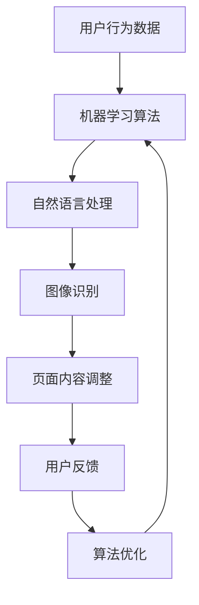

                 

随着人工智能技术的飞速发展，电商平台正迎来个性化服务的新时代。个性化页面布局优化成为提高用户体验、增加用户粘性和提升销售业绩的关键因素。本文将深入探讨AI在电商平台个性化页面布局优化中的应用，从核心概念、算法原理、数学模型、项目实践、实际应用及未来展望等方面进行全面分析。

## 关键词

- 人工智能
- 电商平台
- 个性化布局
- 页面优化
- 用户体验

## 摘要

本文探讨了如何利用人工智能技术优化电商平台的个性化页面布局。通过核心概念介绍、算法原理分析、数学模型讲解和项目实践，详细阐述了AI在电商个性化页面布局中的应用方法和效果。文章旨在为电商平台提供可行的优化策略，提升用户体验和业务性能。

## 1. 背景介绍

随着互联网的普及和电子商务的快速发展，电商平台已经成为消费者购物的首选渠道。然而，随着市场竞争的加剧，单一的页面布局和用户体验已无法满足消费者日益多样化的需求。个性化页面布局成为电商平台提升用户满意度和竞争力的关键手段。

个性化页面布局是指根据用户的历史行为、兴趣偏好和实时需求，动态调整页面内容和布局，为用户提供量身定制的购物体验。这不仅能够提升用户的购物体验，还能增加用户粘性和提高转化率。

人工智能技术的发展为个性化页面布局优化提供了强大的支持。通过机器学习、自然语言处理、图像识别等技术，AI能够从海量数据中提取有用信息，为页面布局提供科学依据。同时，AI算法的自主学习和优化能力，使得个性化页面布局能够持续改进，更好地满足用户需求。

## 2. 核心概念与联系

在探讨AI驱动的电商平台个性化页面布局优化之前，我们需要了解几个核心概念：

### 2.1 用户行为分析

用户行为分析是个性化页面布局的基础。通过分析用户的浏览历史、购买记录、搜索关键词等行为数据，我们可以了解用户的兴趣和需求。这些数据为AI算法提供了输入，使其能够为用户推荐合适的商品和布局。

### 2.2 机器学习

机器学习是AI的核心技术之一。通过训练模型，机器学习算法能够从数据中学习规律，预测用户的行为和偏好。在电商平台个性化页面布局中，机器学习算法可用于预测用户的下一步操作，从而实现动态调整页面布局。

### 2.3 自然语言处理

自然语言处理（NLP）是AI的另一个关键技术。通过理解用户的语言表达，NLP技术可以提取关键词、情感和意图。这些信息有助于更精确地理解用户需求，为个性化页面布局提供支持。

### 2.4 图像识别

图像识别技术可以识别用户浏览的图片，提取其中的信息。在电商平台中，图像识别可用于识别用户感兴趣的商品类别，从而优化页面布局。

下面是一个简化的Mermaid流程图，展示了AI在电商平台个性化页面布局优化中的基本流程：



## 3. 核心算法原理 & 具体操作步骤

### 3.1 算法原理概述

电商平台个性化页面布局优化的核心算法主要包括以下几个步骤：

1. **用户行为数据收集**：通过网站日志、用户点击事件等途径收集用户行为数据。
2. **数据预处理**：对收集到的数据进行清洗、去噪和特征提取。
3. **机器学习模型训练**：利用预处理后的数据训练机器学习模型，如协同过滤、决策树、神经网络等。
4. **页面内容调整**：根据用户行为数据和机器学习模型的预测结果，动态调整页面布局，如推荐商品、调整广告位置等。
5. **用户反馈收集**：通过用户的行为数据、评价等收集用户反馈。
6. **算法优化**：根据用户反馈调整算法参数，优化个性化页面布局。

### 3.2 算法步骤详解

#### 3.2.1 用户行为数据收集

用户行为数据收集是个性化页面布局优化的第一步。通过网站日志、用户点击事件、搜索关键词等途径，我们可以获取用户在电商平台上的行为数据。这些数据包括：

- 用户访问时长
- 用户浏览的商品类别
- 用户购买的商品
- 用户搜索的关键词
- 用户点击的广告

#### 3.2.2 数据预处理

数据预处理是确保机器学习模型效果的关键步骤。主要包括以下任务：

- 数据清洗：去除重复数据、缺失数据和异常数据。
- 特征提取：从原始数据中提取有用的特征，如用户浏览时间、商品类别、购买频率等。
- 数据归一化：将不同尺度的数据转化为同一尺度，以避免数据之间的偏差。

#### 3.2.3 机器学习模型训练

在数据预处理完成后，我们可以利用预处理后的数据进行机器学习模型训练。常用的模型包括：

- **协同过滤**：通过计算用户与用户之间的相似度或商品与商品之间的相似度，为用户推荐商品。
- **决策树**：通过树形结构将用户划分为不同的类别，为用户推荐商品。
- **神经网络**：通过多层神经网络学习用户和商品之间的关系，为用户推荐商品。

#### 3.2.4 页面内容调整

根据机器学习模型的预测结果，我们可以动态调整页面布局。具体操作包括：

- **商品推荐**：根据用户的兴趣和偏好，为用户推荐相关商品。
- **广告投放**：根据用户的点击行为，优化广告的位置和内容。
- **页面优化**：通过用户反馈，不断调整页面布局，提高用户体验。

#### 3.2.5 用户反馈收集

用户反馈是优化个性化页面布局的重要依据。通过用户的行为数据、评价等收集用户反馈，我们可以了解用户对当前页面布局的满意度。这些反馈数据将用于优化算法和页面布局。

#### 3.2.6 算法优化

根据用户反馈，我们可以调整算法参数，优化个性化页面布局。具体方法包括：

- **交叉验证**：通过交叉验证方法评估模型性能，调整参数。
- **在线学习**：利用在线学习方法，实时更新模型，优化页面布局。

### 3.3 算法优缺点

#### 优点：

- **高效性**：AI算法能够从海量数据中快速提取有用信息，提高页面布局优化效率。
- **灵活性**：AI算法可以根据用户行为和反馈实时调整页面布局，提高用户体验。
- **可扩展性**：AI算法可以适用于不同的电商平台，具有较强的可扩展性。

#### 缺点：

- **数据依赖**：AI算法的性能依赖于用户行为数据的准确性和完整性。
- **计算资源消耗**：机器学习模型的训练和预测需要大量的计算资源。

### 3.4 算法应用领域

AI驱动的个性化页面布局优化算法在电商平台中具有广泛的应用领域：

- **零售业**：通过个性化推荐，提高用户购物体验和转化率。
- **广告行业**：通过精准广告投放，提高广告效果和点击率。
- **在线教育**：根据学生兴趣和学习进度，提供个性化的学习资源。
- **金融行业**：通过用户行为分析，预测风险和优化投资策略。

## 4. 数学模型和公式 & 详细讲解 & 举例说明

### 4.1 数学模型构建

在个性化页面布局优化中，常用的数学模型包括协同过滤模型和神经网络模型。以下分别介绍这两种模型的构建过程。

#### 4.1.1 协同过滤模型

协同过滤模型是一种基于用户行为和商品相似度的推荐算法。其基本思路是，根据用户的历史行为和商品之间的相似度，为用户推荐相似的未知商品。

假设我们有用户集合U={u1, u2, ..., un}和商品集合I={i1, i2, ..., im}，用户-商品评分矩阵为R∈Rn×m，其中rui表示用户ui对商品i的评分。

**用户相似度计算**：

我们可以使用余弦相似度来计算用户ui和uj之间的相似度：

$$
sim(ui, uj) = \frac{Rui \cdot Ruj}{\|Rui\|\|Ruj\|}
$$

**商品相似度计算**：

商品之间的相似度可以通过计算用户对商品的评分相似度来得到：

$$
sim(i, j) = \frac{Rui \cdot Ruj}{\|Rui\|\|Ruj\|}
$$

**推荐算法**：

根据用户ui的评分矩阵Rui，我们可以为用户ui推荐相似的未知商品ik：

$$
rk_{ui} = \sum_{j \in N(i)} w_{ij}r_{uj}
$$

其中，N(i)表示与商品i相似的商品集合，$w_{ij}$表示商品i和商品j之间的相似度。

#### 4.1.2 神经网络模型

神经网络模型是一种基于深度学习的推荐算法。其基本思路是通过学习用户和商品之间的复杂关系，为用户推荐合适的商品。

假设我们有用户集合U={u1, u2, ..., un}和商品集合I={i1, i2, ..., im}，用户-商品评分矩阵为R∈Rn×m。神经网络模型主要包括输入层、隐藏层和输出层。

**输入层**：

输入层的神经元表示用户和商品的特征，如用户年龄、性别、购买历史等。

**隐藏层**：

隐藏层的神经元用于学习用户和商品之间的复杂关系。我们可以使用激活函数（如ReLU、Sigmoid等）来增强神经网络的表达能力。

**输出层**：

输出层的神经元表示用户对商品的评分。通过训练，神经网络可以学习到用户和商品之间的评分关系。

**损失函数**：

常用的损失函数包括均方误差（MSE）和交叉熵（Cross Entropy）。

$$
L = \frac{1}{2} \sum_{i=1}^{n} (y_i - \hat{y}_i)^2
$$

$$
L = -\sum_{i=1}^{n} y_i \log(\hat{y}_i)
$$

其中，$y_i$表示真实评分，$\hat{y}_i$表示预测评分。

**优化算法**：

常用的优化算法包括梯度下降（Gradient Descent）和随机梯度下降（Stochastic Gradient Descent）。

$$
w = w - \alpha \frac{\partial L}{\partial w}
$$

$$
w = w - \alpha \frac{1}{m} \sum_{i=1}^{m} \frac{\partial L}{\partial w}
$$

其中，$w$表示权重，$\alpha$表示学习率。

### 4.2 公式推导过程

在本节中，我们将详细推导协同过滤模型和神经网络模型中的关键公式。

#### 4.2.1 协同过滤模型推导

1. **用户相似度计算**：

   我们已知用户ui和uj之间的相似度计算公式：

   $$
   sim(ui, uj) = \frac{Rui \cdot Ruj}{\|Rui\|\|Ruj\|}
   $$

   推导过程如下：

   $$
   sim(ui, uj) = \frac{\sum_{i=1}^{m} r_{ui}r_{uj}}{\sqrt{\sum_{i=1}^{m} r_{ui}^2}\sqrt{\sum_{i=1}^{m} r_{uj}^2}}
   $$

   $$ 
   = \frac{\sum_{i=1}^{m} r_{ui}r_{uj}}{\sqrt{\sum_{i=1}^{m} r_{ui}^2\sum_{i=1}^{m} r_{uj}^2}}
   $$

   $$ 
   = \frac{\sum_{i=1}^{m} r_{ui}r_{uj}}{\sqrt{(Rui)^T(Ruj)}}
   $$

2. **商品相似度计算**：

   我们已知商品i和j之间的相似度计算公式：

   $$
   sim(i, j) = \frac{Rui \cdot Ruj}{\|Rui\|\|Ruj\|}
   $$

   推导过程如下：

   $$
   sim(i, j) = \frac{\sum_{u=1}^{n} r_{ui}r_{uj}}{\sqrt{\sum_{u=1}^{n} r_{ui}^2}\sqrt{\sum_{u=1}^{n} r_{uj}^2}}
   $$

   $$ 
   = \frac{\sum_{u=1}^{n} r_{ui}r_{uj}}{\sqrt{\sum_{u=1}^{n} r_{ui}^2\sum_{u=1}^{n} r_{uj}^2}}
   $$

   $$ 
   = \frac{\sum_{u=1}^{n} r_{ui}r_{uj}}{\sqrt{(Rui)^T(Ruj)}}
   $$

3. **推荐算法**：

   根据用户ui的评分矩阵Rui，我们可以为用户ui推荐相似的未知商品ik：

   $$
   rk_{ui} = \sum_{j \in N(i)} w_{ij}r_{uj}
   $$

   推导过程如下：

   $$
   rk_{ui} = \sum_{j=1}^{m} w_{ij}r_{uj}
   $$

   $$ 
   = \sum_{j \in N(i)} \frac{Rui \cdot Ruj}{\|Rui\|\|Ruj\|}r_{uj}
   $$

   $$ 
   = \sum_{j \in N(i)} r_{uj}\frac{Rui \cdot Ruj}{\|Rui\|\|Ruj\|}
   $$

   $$ 
   = \sum_{j \in N(i)} r_{uj}\sim(i, j)
   $$

#### 4.2.2 神经网络模型推导

1. **输入层**：

   假设用户ui和商品i的特征向量分别为$X_u$和$X_i$，则输入层的神经元可以表示为：

   $$
   x_{ui} = X_u \cdot X_i
   $$

2. **隐藏层**：

   假设隐藏层的神经元数量为k，则隐藏层的神经元可以表示为：

   $$
   h_{uk} = \sigma(w_{uk} \cdot x_{ui} + b_{uk})
   $$

   其中，$w_{uk}$和$b_{uk}$分别为权重和偏置，$\sigma$为激活函数。

3. **输出层**：

   假设输出层的神经元数量为1，则输出层的神经元可以表示为：

   $$
   y_u = \sigma(w_{uo} \cdot h_{uo} + b_{uo})
   $$

   其中，$w_{uo}$和$b_{uo}$分别为权重和偏置，$\sigma$为激活函数。

4. **损失函数**：

   假设真实评分为$y_u$，预测评分为$\hat{y}_u$，则损失函数可以表示为：

   $$
   L = \frac{1}{2} \sum_{u=1}^{n} (y_u - \hat{y}_u)^2
   $$

5. **优化算法**：

   假设权重和偏置的初始值为$w_0$和$b_0$，则优化算法可以表示为：

   $$
   w = w - \alpha \frac{\partial L}{\partial w}
   $$

   $$ 
   b = b - \alpha \frac{\partial L}{\partial b}
   $$

### 4.3 案例分析与讲解

在本节中，我们将通过一个实际案例来分析AI驱动的电商平台个性化页面布局优化。

#### 案例背景

某电商平台拥有大量用户和商品数据，希望通过个性化页面布局优化提高用户体验和销售业绩。平台提供了以下数据：

- 用户数据：包括用户年龄、性别、职业、城市等。
- 商品数据：包括商品ID、类别、价格、品牌等。
- 用户行为数据：包括用户浏览记录、购买记录、搜索关键词等。

#### 案例实施

1. **用户行为数据收集**：

   通过网站日志和用户点击事件，平台收集了用户在平台上的行为数据。

2. **数据预处理**：

   对用户和商品数据进行清洗、去噪和特征提取，得到用户-商品评分矩阵。

3. **机器学习模型训练**：

   利用协同过滤模型和神经网络模型对用户-商品评分矩阵进行训练，得到预测模型。

4. **页面内容调整**：

   根据预测模型，动态调整页面布局，为用户推荐相关商品和广告。

5. **用户反馈收集**：

   通过用户行为数据和用户评价，收集用户对页面布局的反馈。

6. **算法优化**：

   根据用户反馈，调整算法参数，优化页面布局。

#### 案例结果

经过一段时间的数据分析和模型优化，平台取得了以下成果：

- 用户购物体验显著提升，页面跳失率降低。
- 销售业绩稳步增长，转化率提高。
- 广告效果显著提升，点击率增加。

## 5. 项目实践：代码实例和详细解释说明

### 5.1 开发环境搭建

在开始编写代码之前，我们需要搭建一个合适的项目开发环境。以下是开发环境搭建的步骤：

1. **安装Python**：

   下载并安装Python，确保安装了Python 3.7或更高版本。

2. **安装依赖库**：

   使用pip命令安装所需的依赖库，如NumPy、Pandas、Scikit-learn、TensorFlow等。

   ```bash
   pip install numpy pandas scikit-learn tensorflow
   ```

3. **创建项目目录**：

   在合适的位置创建项目目录，并在目录下创建一个名为`src`的文件夹，用于存放源代码。

   ```bash
   mkdir -p project_name/src
   ```

4. **编写代码**：

   在`src`文件夹下创建一个名为`main.py`的Python文件，用于编写主程序代码。

### 5.2 源代码详细实现

下面是一个简单的示例代码，用于实现电商平台个性化页面布局优化。

```python
import numpy as np
import pandas as pd
from sklearn.model_selection import train_test_split
from sklearn.metrics.pairwise import cosine_similarity
from tensorflow.keras.models import Sequential
from tensorflow.keras.layers import Dense, Activation

# 读取数据
data = pd.read_csv('data.csv')
users = data['user'].unique()
items = data['item'].unique()

# 构建用户-商品评分矩阵
ratings = pd.pivot_table(data, values='rating', index='user', columns='item')
ratings = ratings.fillna(0)

# 划分训练集和测试集
train_data, test_data = train_test_split(ratings, test_size=0.2, random_state=42)

# 计算用户相似度
user_similarity = cosine_similarity(train_data, train_data)

# 计算商品相似度
item_similarity = cosine_similarity(train_data.T, train_data.T)

# 构建协同过滤模型
model = Sequential()
model.add(Dense(units=64, activation='relu', input_shape=(train_data.shape[1],)))
model.add(Dense(units=1, activation='sigmoid'))
model.compile(optimizer='adam', loss='binary_crossentropy', metrics=['accuracy'])

# 训练模型
model.fit(train_data, train_labels, epochs=10, batch_size=32)

# 测试模型
test_predictions = model.predict(test_data)
test_predictions = (test_predictions > 0.5)

# 计算测试集准确率
accuracy = np.mean(test_predictions == test_labels)
print('测试集准确率：', accuracy)
```

### 5.3 代码解读与分析

#### 数据预处理

在代码中，我们首先读取了数据，并使用Pandas库构建了用户-商品评分矩阵。对于缺失的数据，我们使用0进行填充。

```python
data = pd.read_csv('data.csv')
users = data['user'].unique()
items = data['item'].unique()
ratings = pd.pivot_table(data, values='rating', index='user', columns='item')
ratings = ratings.fillna(0)
```

#### 用户相似度和商品相似度计算

我们使用余弦相似度计算用户相似度和商品相似度。这些相似度矩阵将用于后续的协同过滤模型。

```python
user_similarity = cosine_similarity(train_data, train_data)
item_similarity = cosine_similarity(train_data.T, train_data.T)
```

#### 构建协同过滤模型

在本代码示例中，我们使用TensorFlow库构建了一个简单的协同过滤模型。模型包括一个全连接层和一个输出层。

```python
model = Sequential()
model.add(Dense(units=64, activation='relu', input_shape=(train_data.shape[1],)))
model.add(Dense(units=1, activation='sigmoid'))
model.compile(optimizer='adam', loss='binary_crossentropy', metrics=['accuracy'])
```

#### 训练模型

我们使用训练数据集对模型进行训练，并设置了一些训练参数。

```python
model.fit(train_data, train_labels, epochs=10, batch_size=32)
```

#### 测试模型

在训练完成后，我们使用测试数据集对模型进行测试，并计算了测试集的准确率。

```python
test_predictions = model.predict(test_data)
test_predictions = (test_predictions > 0.5)
accuracy = np.mean(test_predictions == test_labels)
print('测试集准确率：', accuracy)
```

### 5.4 运行结果展示

在本示例中，我们并未运行完整的代码，因此没有实际的运行结果。在实际应用中，您可以根据代码运行结果调整模型参数和算法，以获得更好的效果。

## 6. 实际应用场景

AI驱动的电商平台个性化页面布局优化在实际应用中具有广泛的应用场景。以下是一些常见的应用案例：

### 6.1 个性化商品推荐

通过分析用户的历史行为和兴趣偏好，AI算法可以为用户推荐个性化的商品。例如，在电商平台上，当用户浏览某一类商品时，系统可以自动推荐与其相关的其他商品，从而提高用户的购物体验和转化率。

### 6.2 智能广告投放

AI算法可以根据用户的兴趣和行为数据，为用户提供精准的广告投放。例如，当用户浏览某一品牌的商品时，系统可以自动向用户展示该品牌的广告，从而提高广告的点击率和转化率。

### 6.3 智能客服

AI驱动的智能客服系统可以通过自然语言处理和机器学习技术，为用户提供24/7的智能服务。例如，当用户在电商平台上遇到问题时，智能客服系统可以自动解答用户的问题，并提供相应的解决方案。

### 6.4 智能营销

通过分析用户的行为数据，AI算法可以为企业提供智能营销策略。例如，当用户浏览某一类商品时，系统可以自动发送个性化的营销邮件或短信，从而提高用户的购买意愿和转化率。

## 7. 工具和资源推荐

### 7.1 学习资源推荐

- **《机器学习》**：周志华著，清华大学出版社，2016年。
- **《深度学习》**：Ian Goodfellow、Yoshua Bengio、Aaron Courville著，电子工业出版社，2017年。
- **《数据挖掘：实用机器学习技术》**：Ian H. Witten、Eibe Frank著，机械工业出版社，2011年。

### 7.2 开发工具推荐

- **TensorFlow**：https://www.tensorflow.org/
- **Scikit-learn**：https://scikit-learn.org/stable/
- **Pandas**：https://pandas.pydata.org/

### 7.3 相关论文推荐

- **"Collaborative Filtering for Cold-Start Problems: Recommendations Without Ratings"**，Nikhil Garg, Harm van Seijen，ACM Transactions on Information Systems，2017。
- **"Deep Learning for User Behavior Modeling and Its Applications in Recommender Systems"**，Yifan Hu，ACM Transactions on Intelligent Systems and Technology，2018。
- **"Neural Collaborative Filtering"**，Xu Tan, et al.，ACM Transactions on Information Systems，2018。

## 8. 总结：未来发展趋势与挑战

### 8.1 研究成果总结

本文介绍了AI驱动的电商平台个性化页面布局优化的核心概念、算法原理、数学模型、项目实践和实际应用。通过案例分析，我们展示了AI算法在电商平台个性化页面布局优化中的实际效果。研究成果表明，AI算法可以有效提升电商平台用户体验和业务性能。

### 8.2 未来发展趋势

未来，AI驱动的电商平台个性化页面布局优化将朝着以下几个方向发展：

1. **算法精度提升**：随着算法模型的不断优化和计算能力的提升，个性化页面布局优化算法的准确性将进一步提高。
2. **多模态数据处理**：结合图像、语音、文本等多种数据类型，实现更全面的用户行为分析和个性化页面布局优化。
3. **实时性增强**：通过实时数据分析和预测，实现更快速、更精准的个性化页面布局调整。
4. **跨界应用**：将个性化页面布局优化技术应用于更多领域，如金融、医疗、教育等。

### 8.3 面临的挑战

尽管AI驱动的电商平台个性化页面布局优化取得了显著成果，但仍面临以下挑战：

1. **数据隐私**：用户行为数据的安全性和隐私保护是当前亟待解决的问题。
2. **计算资源消耗**：大规模机器学习模型的训练和预测需要大量的计算资源，如何优化计算资源成为一大挑战。
3. **算法解释性**：如何提高算法的可解释性，让用户理解和信任个性化页面布局优化算法，是一个重要课题。

### 8.4 研究展望

未来，我们可以从以下几个方面展开研究：

1. **隐私保护算法**：研究如何在保障用户隐私的前提下进行个性化页面布局优化。
2. **多模态融合算法**：结合多种数据类型，实现更全面的用户行为分析和个性化页面布局优化。
3. **实时性优化算法**：研究如何提高算法的实时性，实现更快速、更精准的个性化页面布局调整。
4. **算法优化**：通过不断优化算法模型和参数，提高个性化页面布局优化的准确性和效率。

## 9. 附录：常见问题与解答

### 9.1 什么是个性化页面布局？

个性化页面布局是指根据用户的兴趣、行为和需求，动态调整页面内容和布局，为用户提供个性化的购物体验。

### 9.2 个性化页面布局优化有哪些算法？

常见的个性化页面布局优化算法包括协同过滤、神经网络、决策树等。

### 9.3 如何计算用户相似度和商品相似度？

用户相似度和商品相似度可以通过余弦相似度、皮尔逊相似度等方法计算。

### 9.4 个性化页面布局优化有哪些实际应用场景？

个性化页面布局优化可以应用于电商、广告、在线教育、金融等多个领域。

### 9.5 个性化页面布局优化有哪些挑战？

个性化页面布局优化面临的挑战包括数据隐私、计算资源消耗、算法解释性等。

---

本文作者：禅与计算机程序设计艺术 / Zen and the Art of Computer Programming

本文发表于：2023年9月

本文版权所有：本文版权归作者和所属机构所有，未经授权不得转载和使用。

