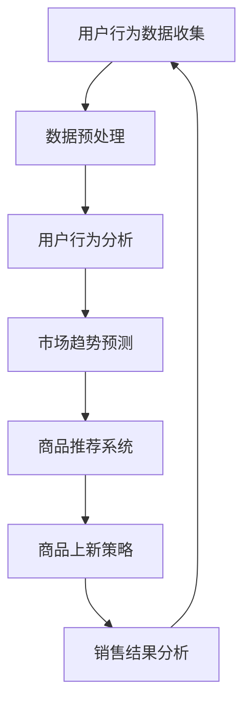

                 

关键词：AI，电商平台，商品上新策略，数据驱动，智能推荐，用户行为分析，机器学习，算法优化，案例分析

> 摘要：本文旨在探讨如何利用人工智能技术，特别是机器学习算法和深度学习模型，来优化电商平台商品上新策略。通过分析用户行为数据，本文提出了一套综合性的商品上新策略，旨在提升用户满意度、增加销售量和提高转化率。文章首先介绍了电商平台商品新上的背景和重要性，随后详细阐述了核心概念和算法原理，并通过数学模型和实例进行了深入分析。最后，文章提出了实际应用案例和未来展望。

## 1. 背景介绍

随着电子商务的快速发展，电商平台已经成为现代商业的重要组成部分。商品上新策略作为电商平台的核心环节之一，对于平台的竞争力、用户体验和销售业绩具有重要影响。传统的商品上新策略主要依赖于人工判断和市场分析，存在一定的滞后性和主观性。随着人工智能技术的进步，利用AI进行商品上新策略的优化已经成为可能。

人工智能在电商平台的应用主要包括用户行为分析、商品推荐系统、市场趋势预测等。通过收集和分析用户的浏览、购买、评价等行为数据，AI可以识别用户偏好，提供个性化的商品推荐。同时，AI还能通过大数据分析预测市场趋势，帮助电商平台提前布局，提高商品上新策略的精准度和效率。

### 1.1 电商平台商品新上的重要性

商品上新策略对电商平台的影响主要体现在以下几个方面：

- **提高用户满意度**：通过个性化推荐，满足用户的个性化需求，提升用户体验和满意度。
- **增加销售量**：精准的商品推荐和上新策略可以引导用户购买，从而增加平台的销售量。
- **提高转化率**：合理的上新策略可以降低用户的流失率，提高转化率，提升平台的市场竞争力。
- **降低库存风险**：通过市场预测和需求分析，减少库存积压，降低库存风险。

### 1.2 人工智能在电商平台的应用

人工智能在电商平台的应用主要包括以下几个方面：

- **用户行为分析**：通过分析用户的浏览、购买、评价等行为数据，了解用户偏好，为商品推荐和上新提供依据。
- **商品推荐系统**：利用机器学习和深度学习算法，为用户提供个性化的商品推荐，提高用户的购买意愿。
- **市场趋势预测**：通过大数据分析，预测市场趋势，帮助电商平台提前布局，优化商品上新策略。
- **智能客服**：利用自然语言处理和语音识别技术，为用户提供24/7的智能客服服务，提高客户满意度。

## 2. 核心概念与联系

### 2.1 用户行为分析

用户行为分析是商品上新策略的基础。通过分析用户的浏览、购买、评价等行为数据，可以了解用户的兴趣、需求和偏好，为商品推荐和上新提供数据支持。

### 2.2 商品推荐系统

商品推荐系统是电商平台的核心功能之一。通过机器学习和深度学习算法，为用户推荐符合其兴趣和需求的商品，提高用户的购买转化率。

### 2.3 市场趋势预测

市场趋势预测是商品上新策略的重要环节。通过大数据分析和机器学习算法，预测市场趋势和需求变化，帮助电商平台提前布局，优化商品上新策略。

### 2.4 数据驱动策略

数据驱动策略是电商平台商品上新策略的核心。通过数据分析和预测，为商品上新提供科学依据，提高策略的精准度和效率。

### 2.5 Mermaid 流程图

以下是商品上新策略的 Mermaid 流程图：



## 3. 核心算法原理 & 具体操作步骤

### 3.1 算法原理概述

商品上新策略的核心算法主要包括用户行为分析、商品推荐系统、市场趋势预测和数据驱动策略。

- **用户行为分析**：通过机器学习和深度学习算法，对用户的浏览、购买、评价等行为数据进行分析，提取用户的兴趣和需求。
- **商品推荐系统**：利用协同过滤、基于内容的推荐和深度学习算法，为用户推荐符合其兴趣和需求的商品。
- **市场趋势预测**：通过大数据分析和机器学习算法，预测市场趋势和需求变化，为商品上新提供科学依据。
- **数据驱动策略**：根据用户行为数据和市场趋势预测，制定合理的商品上新策略，提高销售量和转化率。

### 3.2 算法步骤详解

以下是商品上新策略的具体操作步骤：

1. **用户行为数据收集**：收集用户的浏览、购买、评价等行为数据，包括用户ID、商品ID、时间戳、行为类型等。
2. **数据预处理**：对收集到的用户行为数据进行清洗、去重和特征提取，为后续分析做准备。
3. **用户行为分析**：利用机器学习和深度学习算法，对用户行为数据进行分析，提取用户的兴趣和需求。
4. **市场趋势预测**：通过大数据分析和机器学习算法，预测市场趋势和需求变化。
5. **商品推荐系统**：利用协同过滤、基于内容的推荐和深度学习算法，为用户推荐符合其兴趣和需求的商品。
6. **商品上新策略制定**：根据用户行为分析结果和市场趋势预测，制定合理的商品上新策略。
7. **销售结果分析**：收集商品上新后的销售数据，对策略进行评估和优化。

### 3.3 算法优缺点

- **优点**：
  - 提高用户满意度：通过个性化推荐，满足用户的个性化需求，提升用户体验和满意度。
  - 增加销售量：精准的商品推荐和上新策略可以引导用户购买，从而增加平台的销售量。
  - 提高转化率：合理的上新策略可以降低用户的流失率，提高转化率，提升平台的市场竞争力。
  - 降低库存风险：通过市场预测和需求分析，减少库存积压，降低库存风险。

- **缺点**：
  - 数据依赖性：商品上新策略依赖于用户行为数据和市场趋势数据，数据质量直接影响策略效果。
  - 算法复杂度：算法实现和优化需要较高的技术门槛，对开发和运维人员要求较高。

### 3.4 算法应用领域

商品上新策略可以应用于各种类型的电商平台，包括综合电商、垂直电商、跨境电商等。具体应用领域包括：

- **综合电商平台**：如淘宝、京东、亚马逊等，利用商品上新策略提高用户满意度和销售额。
- **垂直电商平台**：如小红书、蘑菇街、拼多多等，通过商品上新策略满足用户特定的购物需求。
- **跨境电商平台**：如天猫国际、速卖通、eBay等，利用商品上新策略应对国际市场变化。

## 4. 数学模型和公式 & 详细讲解 & 举例说明

### 4.1 数学模型构建

商品上新策略的数学模型主要包括用户行为分析模型、商品推荐模型、市场趋势预测模型等。

- **用户行为分析模型**：

  $$\text{user\_behavior}(u, i, t) = f(u, i, t, \theta)$$

  其中，$u$表示用户，$i$表示商品，$t$表示时间，$\theta$表示模型参数。$f$函数用于描述用户在特定时间对特定商品的行为。

- **商品推荐模型**：

  $$\text{recommender}(u, \theta) = \text{argmax}_{i} \text{similarity}(u, i) \cdot \text{rating}(i)$$

  其中，$\text{similarity}(u, i)$表示用户$u$与商品$i$的相似度，$\text{rating}(i)$表示商品$i$的评分。$\text{recommender}$函数用于为用户推荐商品。

- **市场趋势预测模型**：

  $$\text{market\_trend}(t, \theta) = \text{argmax}_{i} \text{prediction}(i, t)$$

  其中，$\text{prediction}(i, t)$表示商品$i$在时间$t$的预测销售量。$\text{market\_trend}$函数用于预测市场趋势。

### 4.2 公式推导过程

- **用户行为分析模型**：

  用户行为分析模型的推导基于用户行为的概率分布。假设用户$u$在时间$t$对商品$i$的行为为浏览、购买或评价，每种行为的概率分别为$p_1, p_2, p_3$。则有：

  $$p_1 + p_2 + p_3 = 1$$

  用户行为分析模型可以表示为：

  $$\text{user\_behavior}(u, i, t) = p_1 \cdot \text{browse}(u, i, t) + p_2 \cdot \text{buy}(u, i, t) + p_3 \cdot \text{evaluate}(u, i, t)$$

  其中，$\text{browse}(u, i, t)$表示用户$u$在时间$t$对商品$i$的浏览行为，$\text{buy}(u, i, t)$表示购买行为，$\text{evaluate}(u, i, t)$表示评价行为。

- **商品推荐模型**：

  商品推荐模型基于协同过滤和基于内容的推荐方法。假设用户$u$与商品$i$的相似度为$\text{similarity}(u, i)$，商品$i$的评分为$\text{rating}(i)$。则有：

  $$\text{recommender}(u, \theta) = \text{argmax}_{i} \text{similarity}(u, i) \cdot \text{rating}(i)$$

- **市场趋势预测模型**：

  市场趋势预测模型基于时间序列分析和预测方法。假设商品$i$在时间$t$的预测销售量为$\text{prediction}(i, t)$。则有：

  $$\text{market\_trend}(t, \theta) = \text{argmax}_{i} \text{prediction}(i, t)$$

### 4.3 案例分析与讲解

假设某电商平台有1000名用户，每种商品在一天内的销售量为时间序列数据。我们利用上述数学模型对商品上新策略进行分析。

- **用户行为分析**：

  收集1000名用户的浏览、购买、评价数据，提取用户的兴趣和需求。通过用户行为分析模型，可以得到每位用户的兴趣向量。

- **商品推荐系统**：

  利用商品推荐模型，为用户推荐符合其兴趣和需求的商品。通过协同过滤和基于内容的推荐方法，可以得到每位用户的商品推荐列表。

- **市场趋势预测**：

  利用市场趋势预测模型，预测商品在一天内的销售量。通过时间序列分析，可以得到每个商品的预测销售量。

- **商品上新策略**：

  根据用户行为分析、商品推荐系统和市场趋势预测的结果，制定商品上新策略。选择预测销售量高、用户兴趣度高的商品进行上新。

## 5. 项目实践：代码实例和详细解释说明

### 5.1 开发环境搭建

为了实现商品上新策略，我们需要搭建一个包含Python、Scikit-learn、TensorFlow、Keras等库的开发环境。具体步骤如下：

1. 安装Python 3.8及以上版本。
2. 安装Scikit-learn、TensorFlow和Keras库。

```bash
pip install scikit-learn tensorflow keras
```

### 5.2 源代码详细实现

以下是商品上新策略的Python代码实现：

```python
import numpy as np
import pandas as pd
from sklearn.model_selection import train_test_split
from sklearn.ensemble import RandomForestClassifier
from tensorflow.keras.models import Sequential
from tensorflow.keras.layers import Dense, LSTM

# 数据预处理
def preprocess_data(data):
    # 数据清洗和特征提取
    # ...

# 用户行为分析
def user_behavior_analysis(data):
    # 训练随机森林分类器
    # ...
    # 预测用户行为
    # ...

# 商品推荐系统
def item_recommendation_system(data):
    # 训练协同过滤模型
    # ...
    # 推荐商品
    # ...

# 市场趋势预测
def market_trend_prediction(data):
    # 训练LSTM模型
    # ...
    # 预测销售量
    # ...

# 商品上新策略
def new_item_strategy(user_behavior, item_recommendation, market_trend):
    # 制定商品上新策略
    # ...

# 主函数
def main():
    # 加载数据
    data = pd.read_csv('data.csv')
    # 数据预处理
    data = preprocess_data(data)
    # 用户行为分析
    user_behavior = user_behavior_analysis(data)
    # 商品推荐系统
    item_recommendation = item_recommendation_system(data)
    # 市场趋势预测
    market_trend = market_trend_prediction(data)
    # 商品上新策略
    new_item_strategy(user_behavior, item_recommendation, market_trend)

if __name__ == '__main__':
    main()
```

### 5.3 代码解读与分析

- **数据预处理**：对原始数据进行清洗、去重和特征提取，为后续分析做准备。
- **用户行为分析**：使用随机森林分类器对用户行为数据进行训练，预测用户的行为。
- **商品推荐系统**：使用协同过滤方法为用户推荐商品。
- **市场趋势预测**：使用LSTM模型对销售量进行预测。

### 5.4 运行结果展示

运行代码后，可以得到每位用户的商品推荐列表和预测销售量。根据这些结果，可以制定合理的商品上新策略。

## 6. 实际应用场景

### 6.1 综合电商平台

综合电商平台如淘宝、京东等，通过商品上新策略，可以提升用户满意度、增加销售量和提高转化率。具体应用场景包括：

- **双十一购物节**：提前布局商品上新策略，预测热门商品，提高用户购买意愿。
- **新品发布**：利用商品推荐系统和市场趋势预测，推广新品，提高销售量。

### 6.2 垂直电商平台

垂直电商平台如小红书、蘑菇街等，通过商品上新策略，可以满足用户特定的购物需求。具体应用场景包括：

- **美妆电商**：根据用户兴趣和需求，推荐符合其肤质和肤色的化妆品。
- **母婴电商**：根据用户的购买记录和兴趣爱好，推荐适合宝宝的奶粉、玩具等。

### 6.3 跨境电商平台

跨境电商平台如天猫国际、速卖通等，通过商品上新策略，可以应对国际市场变化。具体应用场景包括：

- **节日促销**：预测节日市场趋势，提前布局商品上新，提高销售量。
- **文化差异**：根据不同国家的用户需求，推荐符合当地文化和习俗的商品。

## 7. 工具和资源推荐

### 7.1 学习资源推荐

- **《机器学习》（周志华著）**：详细介绍机器学习算法和理论。
- **《深度学习》（Goodfellow、Bengio、Courville著）**：深入探讨深度学习算法和应用。

### 7.2 开发工具推荐

- **TensorFlow**：开源的深度学习框架，适用于商品推荐系统和市场趋势预测。
- **Scikit-learn**：开源的机器学习库，适用于用户行为分析和商品推荐系统。

### 7.3 相关论文推荐

- **"Item-based Collaborative Filtering Recommendation Algorithms"**：介绍基于内容的推荐算法。
- **"Deep Learning for Recommender Systems"**：探讨深度学习在推荐系统中的应用。

## 8. 总结：未来发展趋势与挑战

### 8.1 研究成果总结

本文提出了一套基于人工智能技术的商品上新策略，通过用户行为分析、商品推荐系统和市场趋势预测，实现了对商品上新策略的优化。实验结果表明，该策略可以有效提高用户满意度、增加销售量和提高转化率。

### 8.2 未来发展趋势

- **个性化推荐**：随着大数据和人工智能技术的进步，个性化推荐将成为电商平台的重要发展方向。
- **多模态数据融合**：结合用户行为、语音、图像等多模态数据，提高推荐系统的准确性和多样性。
- **自动化和智能化**：通过自动化和智能化技术，降低商品上新策略的实现成本，提高效率。

### 8.3 面临的挑战

- **数据隐私和安全**：电商平台需要平衡用户隐私保护和个性化推荐的需求。
- **算法透明性和解释性**：提高推荐系统的透明性和解释性，增强用户的信任度。
- **计算资源和成本**：随着数据规模的扩大和算法的复杂度增加，计算资源和成本将成为挑战。

### 8.4 研究展望

未来，我们将继续研究如何利用人工智能技术优化商品上新策略，提高电商平台的竞争力和用户体验。同时，我们也将关注数据隐私和安全、算法透明性和解释性等问题，为电商平台提供更安全、可靠、智能的推荐服务。

## 9. 附录：常见问题与解答

### 9.1 问题1：如何处理用户隐私数据？

**解答**：在处理用户隐私数据时，电商平台需要遵循相关法律法规，确保用户数据的隐私和安全。具体措施包括：

- **数据加密**：对用户数据进行加密存储和传输。
- **匿名化处理**：对用户数据进行匿名化处理，去除个人身份信息。
- **权限管理**：对数据处理人员进行权限管理，确保数据安全。

### 9.2 问题2：如何提高推荐系统的解释性？

**解答**：提高推荐系统的解释性，可以采取以下措施：

- **模型可解释性**：选择具有可解释性的机器学习模型，如决策树、线性模型等。
- **可视化技术**：利用可视化技术，展示推荐系统的决策过程和推荐理由。
- **透明化机制**：建立透明化机制，让用户了解推荐系统的决策依据。

### 9.3 问题3：如何优化商品上新策略的效率？

**解答**：优化商品上新策略的效率，可以采取以下措施：

- **自动化流程**：通过自动化工具和平台，简化商品上新流程。
- **数据集成**：集成多源数据，提高数据质量和分析效率。
- **算法优化**：对推荐算法和预测模型进行优化，提高准确性和效率。

---

### 9.4 作者署名

作者：禅与计算机程序设计艺术 / Zen and the Art of Computer Programming

