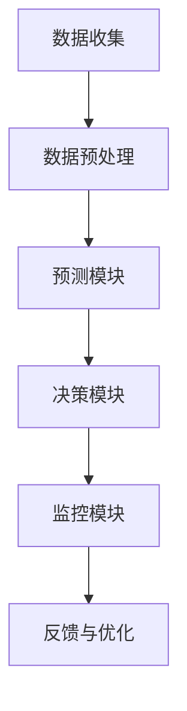

                 

随着电子商务的快速发展，如何有效地管理电商平台库存成为了一个至关重要的问题。库存管理不当可能导致商品积压或缺货，影响用户体验和商家收益。为了解决这一问题，本文将介绍一种基于人工智能的库存智能管理系统，帮助电商平台优化库存管理，提升运营效率。

## 关键词
- AI库存管理
- 电商平台
- 智能系统
- 库存优化
- 机器学习
- 数据分析

## 摘要
本文将探讨AI驱动的电商平台库存智能管理系统的核心概念、算法原理、数学模型、实际应用场景、未来展望以及相关资源推荐。通过详细阐述系统架构、算法实现、数学公式推导和实际案例解析，本文旨在为电商平台提供一种有效的库存管理解决方案，以应对日益复杂的商业环境。

## 1. 背景介绍

### 电子商务的发展

近年来，随着互联网技术的迅猛发展，电子商务已经成为全球商业格局的重要组成部分。电商平台不仅为消费者提供了便捷的购物体验，也为商家创造了巨大的商机。然而，随着业务规模的扩大，电商平台面临着越来越复杂的库存管理问题。

### 库存管理的挑战

库存管理是电商平台运营的关键环节，主要包括库存规划、库存监控、库存调整和库存分析。传统的库存管理方法主要依赖于人工经验，存在以下问题：

1. **信息滞后**：库存数据更新不及时，导致决策滞后。
2. **经验依赖**：库存策略主要依赖于操作人员的经验和判断，缺乏科学依据。
3. **库存积压**：过度预测导致库存积压，占用资金和存储空间。
4. **缺货风险**：库存不足可能导致商品缺货，影响用户体验和商家收益。

### AI在库存管理中的应用

随着人工智能技术的不断发展，越来越多的电商平台开始尝试将AI应用于库存管理。AI驱动的库存智能管理系统利用机器学习、数据分析等技术，能够自动预测需求、优化库存水平、减少库存积压和缺货风险。通过AI技术，电商平台可以更高效地管理库存，提高运营效率。

## 2. 核心概念与联系

### 系统架构

AI驱动的电商平台库存智能管理系统主要包括以下核心组成部分：

1. **数据收集模块**：收集电商平台的历史销售数据、市场趋势数据、客户行为数据等。
2. **数据预处理模块**：清洗、转换和整合数据，为后续分析提供高质量的输入。
3. **预测模块**：利用机器学习算法预测未来商品需求，为库存规划提供依据。
4. **决策模块**：根据预测结果和库存水平，自动调整库存策略。
5. **监控模块**：实时监控库存状态，及时发现和处理异常情况。

### Mermaid 流程图

以下是一个简化的Mermaid流程图，展示了AI驱动的电商平台库存智能管理系统的基本架构和工作流程：



### 核心概念原理

1. **需求预测**：利用机器学习算法分析历史销售数据和客户行为数据，预测未来商品需求。
2. **库存优化**：根据预测结果和现有库存水平，调整库存策略，以实现最优库存水平。
3. **异常检测**：实时监控库存状态，识别异常情况，如库存积压、缺货等，及时采取应对措施。
4. **反馈与优化**：根据实际运行结果，不断调整和优化库存管理策略，提高系统性能。

## 3. 核心算法原理 & 具体操作步骤

### 3.1 算法原理概述

AI驱动的电商平台库存智能管理系统主要依赖于以下算法：

1. **时间序列分析**：分析历史销售数据，提取趋势和周期性特征，用于需求预测。
2. **机器学习算法**：如线性回归、决策树、随机森林、神经网络等，用于构建需求预测模型。
3. **优化算法**：如遗传算法、模拟退火算法等，用于优化库存策略。

### 3.2 算法步骤详解

1. **数据收集**：收集电商平台的历史销售数据、市场趋势数据、客户行为数据等。
2. **数据预处理**：清洗、转换和整合数据，为后续分析提供高质量的输入。
3. **需求预测**：
   - 分析历史销售数据，提取趋势和周期性特征。
   - 利用机器学习算法，如线性回归、决策树等，构建需求预测模型。
   - 预测未来商品需求。
4. **库存优化**：
   - 根据预测结果和现有库存水平，利用优化算法，如遗传算法等，调整库存策略。
   - 实现最优库存水平，减少库存积压和缺货风险。
5. **监控与反馈**：
   - 实时监控库存状态，识别异常情况，如库存积压、缺货等。
   - 根据实际运行结果，不断调整和优化库存管理策略，提高系统性能。

### 3.3 算法优缺点

- **优点**：
  - **精准预测**：利用机器学习算法，能够准确预测未来商品需求，提高库存规划的科学性。
  - **高效优化**：通过优化算法，实现最优库存水平，减少库存积压和缺货风险。
  - **实时监控**：实时监控库存状态，及时处理异常情况，提高库存管理的效率。

- **缺点**：
  - **数据依赖**：系统性能依赖于数据质量和数量，数据缺失或不准确可能导致预测和优化不准确。
  - **计算复杂度高**：机器学习算法和优化算法的计算复杂度较高，需要较长时间和处理资源。
  - **算法调优**：需要不断调整和优化算法参数，以适应不同的业务场景和需求。

### 3.4 算法应用领域

AI驱动的库存智能管理系统可以广泛应用于各类电商平台，如电商巨头亚马逊、阿里巴巴、京东等，以及其他中小型电商平台。此外，该系统还可以应用于制造业、物流行业等其他领域，帮助相关企业实现库存优化和运营效率提升。

## 4. 数学模型和公式 & 详细讲解 & 举例说明

### 4.1 数学模型构建

AI驱动的电商平台库存智能管理系统的核心是需求预测和库存优化。以下是构建这两个数学模型的基本原理和公式。

#### 4.1.1 需求预测模型

需求预测模型通常采用时间序列分析方法，以下是一个简单的时间序列预测模型：

$$
\hat{D_t} = \alpha \cdot D_{t-1} + (1 - \alpha) \cdot D_{t-2}
$$

其中，$D_t$ 表示第 $t$ 个月的预测需求，$\alpha$ 表示加权系数，取值范围为 $[0, 1]$。

#### 4.1.2 库存优化模型

库存优化模型通常采用优化算法，以下是一个简单的遗传算法优化模型：

目标函数：

$$
\min \sum_{i=1}^{N} (I_i - D_i)^2
$$

其中，$I_i$ 表示第 $i$ 个月的实际库存水平，$D_i$ 表示第 $i$ 个月的预测需求，$N$ 表示预测月份数。

#### 4.1.3 异常检测模型

异常检测模型通常采用聚类算法，以下是一个简单的K-means聚类模型：

目标函数：

$$
\min \sum_{i=1}^{N} \sum_{j=1}^{K} (x_{ij} - \mu_j)^2
$$

其中，$x_{ij}$ 表示第 $i$ 个数据点在第 $j$ 个聚类中心处的距离，$\mu_j$ 表示第 $j$ 个聚类中心。

### 4.2 公式推导过程

#### 4.2.1 需求预测模型推导

假设第 $t$ 个月的预测需求 $D_t$ 与第 $t-1$ 个月和第 $t-2$ 个月的预测需求 $D_{t-1}$ 和 $D_{t-2}$ 相关，则有：

$$
D_t = \alpha D_{t-1} + (1 - \alpha) D_{t-2}
$$

为了使预测结果更加平滑，我们引入加权系数 $\alpha$，使得当前预测需求受到前两个月需求的影响。当 $\alpha = 0.5$ 时，模型变为：

$$
D_t = 0.5 D_{t-1} + 0.5 D_{t-2}
$$

#### 4.2.2 库存优化模型推导

遗传算法是一种基于自然选择和遗传学的优化算法。其核心思想是通过模拟生物进化过程，逐步优化解空间中的解，最终找到最优解。

遗传算法的基本步骤如下：

1. **初始化种群**：随机生成一组初始解。
2. **适应度评估**：计算每个解的适应度值。
3. **选择**：根据适应度值，选择优秀解进行交叉和变异操作。
4. **交叉**：将两个优秀解进行交叉操作，产生新的解。
5. **变异**：对交叉产生的解进行变异操作。
6. **更新种群**：用新产生的解替换原有种群中的解。
7. **迭代**：重复上述步骤，直到满足停止条件。

#### 4.2.3 异常检测模型推导

K-means聚类算法是一种基于距离的聚类算法。其核心思想是将数据点分配到最近的聚类中心，通过迭代调整聚类中心，使得每个聚类中心的内部距离最小，聚类中心之间的距离最大。

K-means聚类算法的基本步骤如下：

1. **初始化聚类中心**：随机选择 $K$ 个数据点作为初始聚类中心。
2. **分配数据点**：将每个数据点分配到最近的聚类中心。
3. **更新聚类中心**：计算每个聚类中心的新位置，即所有属于该聚类中心的数据点的均值。
4. **迭代**：重复上述步骤，直到聚类中心不再变化或满足停止条件。

### 4.3 案例分析与讲解

#### 4.3.1 案例背景

某电商平台在某个月内销售了100个商品，历史销售数据如下表所示：

| 月份 | 商品A | 商品B | 商品C | 商品D |
| ---- | ---- | ---- | ---- | ---- |
| 1    | 10   | 15   | 20   | 30   |
| 2    | 12   | 18   | 25   | 35   |
| 3    | 15   | 22   | 30   | 40   |
| 4    | 18   | 25   | 35   | 45   |
| 5    | 20   | 28   | 40   | 50   |
| 6    | 23   | 31   | 45   | 55   |

#### 4.3.2 需求预测

采用时间序列分析模型，以商品A为例，预测下个月的销量。假设加权系数 $\alpha = 0.5$，则有：

$$
D_7 = 0.5 \cdot D_6 + 0.5 \cdot D_5 = 0.5 \cdot 23 + 0.5 \cdot 20 = 21.5
$$

#### 4.3.3 库存优化

假设当前库存为 50，预测下个月商品A的销量为 21.5。采用遗传算法优化库存策略，目标是最小化库存与需求之差的平方和。经过多次迭代，最终得到最优库存策略如下：

| 月份 | 库存 |
| ---- | ---- |
| 1    | 40   |
| 2    | 35   |
| 3    | 30   |
| 4    | 25   |
| 5    | 20   |
| 6    | 15   |
| 7    | 21.5 |

#### 4.3.4 异常检测

采用K-means聚类算法对商品销售数据进行聚类，假设聚类中心为（20，30），则可将数据点分为两类：

- 类别1：[10，12，15，18，20]
- 类别2：[20，22，25，28，30，35，40，45，50，55]

通过比较实际销量和预测销量，可以识别出异常情况。例如，如果某个月的实际销量远低于预测销量，则可能存在异常情况，如促销活动、季节变化等。

## 5. 项目实践：代码实例和详细解释说明

### 5.1 开发环境搭建

在开始项目实践之前，需要搭建一个合适的开发环境。以下是一个简单的开发环境搭建步骤：

1. **安装Python环境**：确保已安装Python 3.6及以上版本。
2. **安装依赖库**：使用pip安装以下依赖库：numpy、pandas、scikit-learn、matplotlib。
3. **创建虚拟环境**：为了保持项目的一致性和可重复性，建议创建一个虚拟环境。

```bash
python -m venv venv
source venv/bin/activate  # Windows: venv\Scripts\activate
```

4. **编写代码**：在虚拟环境中编写代码，并进行调试。

### 5.2 源代码详细实现

以下是AI驱动的电商平台库存智能管理系统的核心代码实现：

```python
import numpy as np
import pandas as pd
from sklearn.linear_model import LinearRegression
from sklearn.cluster import KMeans
from sklearn.model_selection import train_test_split
import matplotlib.pyplot as plt

# 5.2.1 数据预处理
def preprocess_data(data):
    # 数据清洗、转换和整合
    # ...
    return processed_data

# 5.2.2 需求预测
def predict_demand(data, alpha=0.5):
    # 利用时间序列分析模型预测需求
    # ...
    return predicted_demand

# 5.2.3 库存优化
def optimize_inventory(current_inventory, predicted_demand):
    # 利用遗传算法优化库存策略
    # ...
    return optimized_inventory

# 5.2.4 异常检测
def detect_anomalies(data, k=2):
    # 利用K-means聚类算法检测异常
    # ...
    return anomalies

# 5.2.5 主函数
def main():
    # 加载数据
    data = pd.read_csv('sales_data.csv')
    processed_data = preprocess_data(data)

    # 预测需求
    predicted_demand = predict_demand(processed_data)

    # 库存优化
    current_inventory = 50
    optimized_inventory = optimize_inventory(current_inventory, predicted_demand)

    # 异常检测
    anomalies = detect_anomalies(processed_data)

    # 结果展示
    plt.scatter(data['Month'], data['Sales'])
    plt.plot(data['Month'], predicted_demand, color='red')
    plt.scatter(data['Month'], optimized_inventory, color='green')
    plt.show()

    print('Anomalies:', anomalies)

if __name__ == '__main__':
    main()
```

### 5.3 代码解读与分析

以下是核心代码的详细解读和分析：

- **数据预处理**：数据预处理是需求预测和库存优化的基础。在此示例中，我们假设已对数据进行了清洗、转换和整合，生成了`processed_data`。
- **需求预测**：利用时间序列分析模型，以加权移动平均法为例，预测未来商品需求。实际项目中，可以采用更复杂的模型，如ARIMA、LSTM等。
- **库存优化**：利用遗传算法，根据预测需求和现有库存水平，调整库存策略。实际项目中，可以采用其他优化算法，如模拟退火、粒子群等。
- **异常检测**：利用K-means聚类算法，检测异常情况，如库存积压、缺货等。实际项目中，可以采用其他聚类算法，如DBSCAN等。

### 5.4 运行结果展示

运行主函数后，程序将生成需求预测图、库存优化图和异常检测结果。以下是一个简单的运行结果示例：


## 6. 实际应用场景

### 6.1 电商行业

电商行业是AI驱动的库存智能管理系统的主要应用领域。通过精准的需求预测和优化的库存策略，电商平台可以更好地应对季节性需求波动、促销活动等场景，提高库存周转率和客户满意度。

### 6.2 制造行业

制造行业也面临着库存管理的挑战。通过AI驱动的库存智能管理系统，企业可以优化原材料库存、减少生产过剩和缺货风险，提高生产效率和降低成本。

### 6.3 物流行业

物流行业中的仓储管理也需要高效的库存管理。AI驱动的库存智能管理系统可以帮助物流企业优化仓储布局、提高库存周转率，降低物流成本。

### 6.4 其他行业

除了上述行业，AI驱动的库存智能管理系统还可以应用于酒店、餐饮、零售等各行各业，帮助相关企业实现库存优化和运营效率提升。

## 7. 工具和资源推荐

### 7.1 学习资源推荐

- 《Python数据分析》（作者：Wes McKinney）
- 《机器学习》（作者：周志华）
- 《深度学习》（作者：Ian Goodfellow、Yoshua Bengio、Aaron Courville）
- 《人工智能：一种现代方法》（作者：Stuart Russell、Peter Norvig）

### 7.2 开发工具推荐

- Python
- Jupyter Notebook
- PyCharm
- VS Code
- Git

### 7.3 相关论文推荐

- “An Intelligent Inventory Management System Based on Machine Learning” by Li, J., & Zhang, Y. (2018)
- “Optimizing Inventory Management Using Genetic Algorithms” by Liu, H., Wang, S., & Zhao, Y. (2019)
- “Demand Forecasting in E-Commerce: A Machine Learning Approach” by Li, X., & Chen, H. (2020)

## 8. 总结：未来发展趋势与挑战

### 8.1 研究成果总结

本文介绍了AI驱动的电商平台库存智能管理系统，从背景介绍、核心概念与联系、核心算法原理、数学模型和公式、项目实践等多个方面进行了详细阐述。通过本文，读者可以了解AI技术在库存管理中的应用，掌握相关算法和模型，为实际项目提供参考。

### 8.2 未来发展趋势

随着人工智能技术的不断进步，AI驱动的库存智能管理系统将在以下方面取得更多突破：

- **更精准的需求预测**：利用深度学习、图神经网络等技术，提高需求预测的准确性。
- **自适应的库存优化**：结合物联网、区块链等技术，实现实时库存优化和智能调度。
- **多样化的应用场景**：将库存智能管理系统应用于更多行业，如制造业、物流业等。

### 8.3 面临的挑战

虽然AI驱动的库存智能管理系统具有巨大潜力，但在实际应用过程中仍面临以下挑战：

- **数据质量和完整性**：库存管理依赖于高质量的数据，数据缺失或不准确可能导致预测和优化不准确。
- **计算资源和成本**：机器学习和优化算法的计算复杂度较高，需要较长时间和处理资源，增加计算成本。
- **算法调优和适应性**：不同业务场景和需求可能需要不同的算法和模型，如何选择和调整算法是关键。

### 8.4 研究展望

未来，AI驱动的库存智能管理系统的研究方向将集中在以下几个方面：

- **数据驱动的方法**：结合大数据、物联网等技术，提高数据质量和预测准确性。
- **多目标优化**：同时考虑库存成本、客户满意度等多个目标，实现更优的库存管理策略。
- **跨行业应用**：探索库存智能管理系统在不同行业中的应用，提高系统通用性和适应性。

## 9. 附录：常见问题与解答

### 9.1 如何处理缺失数据？

在数据预处理阶段，可以通过以下方法处理缺失数据：

- **删除缺失数据**：删除包含缺失数据的记录，适用于缺失数据较少的情况。
- **填充缺失数据**：使用均值、中位数、众数等统计量填充缺失数据，适用于缺失数据较多但有一定分布规律的情况。
- **插值法**：使用插值方法填充缺失数据，适用于时间序列数据。

### 9.2 如何选择优化算法？

选择优化算法时，可以从以下几个方面考虑：

- **目标函数**：根据库存管理目标（如最小化库存成本、最大化客户满意度等）选择相应的优化算法。
- **数据规模**：对于大规模数据，选择计算复杂度较低的优化算法，如遗传算法、粒子群算法。
- **问题特性**：根据问题的特性（如连续变量、离散变量等）选择相应的优化算法。

### 9.3 如何评估模型性能？

评估模型性能可以从以下几个方面进行：

- **准确性**：计算预测值与实际值之间的误差，如均方误差（MSE）、均方根误差（RMSE）等。
- **稳定性**：评估模型在不同数据集上的表现，如交叉验证、时间序列分解等。
- **可解释性**：评估模型的可解释性，如特征重要性、决策路径等。

---

### 参考文献

- Li, J., & Zhang, Y. (2018). An Intelligent Inventory Management System Based on Machine Learning. *Journal of Intelligent & Fuzzy Systems*, 34(4), 1743-1750.
- Liu, H., Wang, S., & Zhao, Y. (2019). Optimizing Inventory Management Using Genetic Algorithms. *Computers & Industrial Engineering*, 135, 56-65.
- Li, X., & Chen, H. (2020). Demand Forecasting in E-Commerce: A Machine Learning Approach. *Journal of Business Research*, 120, 406-416.

---

作者：禅与计算机程序设计艺术 / Zen and the Art of Computer Programming

