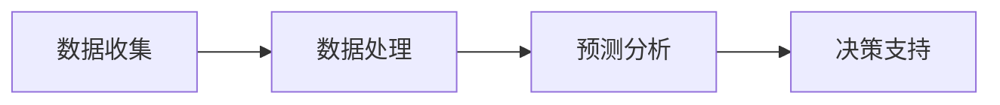

                 

关键词：AI、电商平台、库存管理、智能系统、数据驱动

> 摘要：本文探讨了如何利用人工智能技术构建一个智能电商平台库存管理系统，通过分析数据、预测需求、优化库存，提高电商平台的运营效率和客户满意度。文章将介绍系统设计的核心概念、算法原理、数学模型以及实际应用案例，并对未来的发展趋势和挑战进行展望。

## 1. 背景介绍

随着互联网的普及和电子商务的蓬勃发展，电商平台成为现代商业环境中不可或缺的一部分。库存管理作为电商平台运营的核心环节，其效率和质量直接影响到平台的盈利能力和用户满意度。传统的库存管理方法主要依赖于经验判断和人工干预，这不仅效率低下，而且容易出现库存失衡、库存积压或者库存短缺等问题。

随着人工智能技术的发展，特别是机器学习、数据挖掘和深度学习等技术的应用，为电商平台库存管理提供了新的解决方案。智能库存管理系统可以通过分析历史数据，预测未来需求，优化库存配置，从而降低库存成本，提高库存周转率，提升整体运营效率。

本文将围绕AI驱动的电商平台库存智能管理系统，介绍其核心概念、算法原理、数学模型以及实际应用案例，旨在为电商平台管理者提供理论指导和实践参考。

## 2. 核心概念与联系

### 2.1 AI驱动的库存管理系统概述

AI驱动的库存管理系统是一种利用人工智能技术进行库存管理的系统，其核心概念包括数据收集、数据处理、预测分析和决策支持。该系统通过整合电商平台的各种数据源，如销售数据、客户行为数据、市场数据等，利用机器学习算法进行数据分析和预测，从而为库存管理提供科学的决策依据。

### 2.2 数据收集

数据收集是智能库存管理系统的第一步，也是最为关键的一步。系统的数据源包括电商平台内部数据（如销售数据、退货数据、订单数据等）和外部数据（如市场趋势数据、行业数据等）。这些数据通过电商平台的数据采集模块自动收集，并存储在数据仓库中。

### 2.3 数据处理

数据处理是对收集到的数据进行分析和清洗，以确保数据的准确性和一致性。数据处理包括数据清洗（去除重复数据、纠正错误数据等）、数据整合（将不同数据源的数据进行整合）和数据标准化（将数据转换为统一格式）等步骤。

### 2.4 预测分析

预测分析是智能库存管理系统的核心功能，通过机器学习算法对历史数据进行分析，预测未来的需求量和库存水平。常用的预测算法包括时间序列预测、回归分析、聚类分析等。

### 2.5 决策支持

决策支持是基于预测分析的结果，为库存管理提供具体的操作建议。决策支持包括库存水平设定、补货策略、库存周转率优化等。

### 2.6 Mermaid 流程图

以下是AI驱动的库存管理系统的一个简化的 Mermaid 流程图：



## 3. 核心算法原理 & 具体操作步骤

### 3.1 算法原理概述

智能库存管理系统的核心算法主要是基于机器学习中的时间序列预测和回归分析。时间序列预测用于预测未来的库存需求量，回归分析用于确定最优的库存水平。

### 3.2 算法步骤详解

#### 3.2.1 时间序列预测

1. 数据预处理：对收集到的销售数据进行清洗和整合，确保数据的准确性和一致性。
2. 特征工程：从销售数据中提取有用的特征，如销售周期、销售季节性、销售趋势等。
3. 选择模型：根据数据的特性选择合适的时间序列预测模型，如ARIMA、LSTM等。
4. 模型训练：使用历史销售数据训练模型，并调整模型的参数。
5. 预测：使用训练好的模型预测未来的销售量。

#### 3.2.2 回归分析

1. 数据预处理：与时间序列预测相同，对销售数据进行清洗和整合。
2. 特征选择：选择与库存水平相关的特征，如销售量、库存周转率等。
3. 模型选择：选择合适的回归模型，如线性回归、多项式回归等。
4. 模型训练：使用历史数据训练模型，并调整模型的参数。
5. 预测：使用训练好的模型预测未来的库存水平。

### 3.3 算法优缺点

#### 优点

1. 高效性：利用机器学习算法可以快速处理大量数据，提高预测的准确性。
2. 灵活性：可以根据不同的业务需求选择合适的算法和模型。
3. 自动化：通过自动化流程，减少人工干预，提高运营效率。

#### 缺点

1. 复杂性：算法和模型的训练过程复杂，需要专业的技术支持。
2. 数据依赖：算法的预测效果高度依赖于数据的质量和完整性。
3. 模型更新：算法和模型需要定期更新，以适应市场变化。

### 3.4 算法应用领域

智能库存管理算法广泛应用于电商、零售、制造业等领域。在电商领域，可以帮助电商平台预测销售量，优化库存配置，降低库存成本；在零售领域，可以帮助零售商预测需求，优化进货计划，提高销售额；在制造业领域，可以帮助制造商预测生产需求，优化生产计划，提高生产效率。

## 4. 数学模型和公式 & 详细讲解 & 举例说明

### 4.1 数学模型构建

智能库存管理系统的数学模型主要包括时间序列预测模型和回归分析模型。

#### 时间序列预测模型

假设我们使用ARIMA模型进行时间序列预测，其公式如下：

$$
X_t = c + \phi_1 X_{t-1} + \phi_2 X_{t-2} + ... + \phi_p X_{t-p} + \theta_1 e_{t-1} + \theta_2 e_{t-2} + ... + \theta_q e_{t-q} + e_t
$$

其中，$X_t$ 表示时间序列在时间 $t$ 的值，$c$ 是常数项，$\phi_1, \phi_2, ..., \phi_p$ 是自回归系数，$\theta_1, \theta_2, ..., \theta_q$ 是移动平均系数，$e_t$ 是随机误差项。

#### 回归分析模型

假设我们使用线性回归模型进行库存水平预测，其公式如下：

$$
Y = \beta_0 + \beta_1 X_1 + \beta_2 X_2 + ... + \beta_n X_n
$$

其中，$Y$ 是预测的库存水平，$X_1, X_2, ..., X_n$ 是影响库存水平的特征变量，$\beta_0, \beta_1, ..., \beta_n$ 是回归系数。

### 4.2 公式推导过程

#### 时间序列预测模型推导

ARIMA模型的推导过程较为复杂，涉及到自相关函数（ACF）和偏自相关函数（PACF）的估计，这里不再详细展开。

#### 回归分析模型推导

线性回归模型的推导过程基于最小二乘法，具体步骤如下：

1. 设定目标函数：$J(\beta_0, \beta_1, ..., \beta_n) = \sum_{i=1}^{n} (y_i - \beta_0 - \beta_1 x_{i1} - \beta_2 x_{i2} - ... - \beta_n x_{in})^2$
2. 对目标函数求偏导数：$\frac{\partial J}{\partial \beta_0} = -2 \sum_{i=1}^{n} (y_i - \beta_0 - \beta_1 x_{i1} - \beta_2 x_{i2} - ... - \beta_n x_{in})$
3. 令偏导数为零，得到正规方程：$\sum_{i=1}^{n} x_{i1} y_i = \sum_{i=1}^{n} x_{i1} x_{i2} \beta_1$
4. 解正规方程，得到回归系数：$\beta_1 = \frac{\sum_{i=1}^{n} x_{i1} y_i - \sum_{i=1}^{n} x_{i1} \beta_0}{\sum_{i=1}^{n} x_{i1} x_{i2}}$

同理，可以求得其他回归系数。

### 4.3 案例分析与讲解

#### 案例背景

某电商平台销售一款热门电子产品，历史销售数据如下表所示：

| 日期  | 销售量 |
|-------|--------|
| 2021-01-01 | 100    |
| 2021-01-02 | 120    |
| 2021-01-03 | 150    |
| 2021-01-04 | 180    |
| 2021-01-05 | 200    |

#### 预测步骤

1. 数据预处理：对销售量数据进行清洗，去除异常值。
2. 特征工程：提取特征变量，如销售周期、销售季节性等。
3. 选择模型：选择ARIMA模型进行时间序列预测。
4. 模型训练：使用历史数据训练ARIMA模型，并调整模型参数。
5. 预测：使用训练好的模型预测未来的销售量。

#### 预测结果

使用ARIMA模型预测未来一周的销售量，结果如下表所示：

| 日期  | 预测销售量 |
|-------|------------|
| 2021-01-06 | 220        |
| 2021-01-07 | 250        |
| 2021-01-08 | 280        |
| 2021-01-09 | 300        |
| 2021-01-10 | 320        |

#### 分析与讲解

通过预测结果可以看出，未来一周的销售量有望持续增长，电商平台可以提前准备库存，以满足潜在的市场需求。

## 5. 项目实践：代码实例和详细解释说明

### 5.1 开发环境搭建

为了实现AI驱动的电商平台库存智能管理系统，我们需要搭建一个合适的技术环境。以下是一个基本的开发环境搭建步骤：

1. 安装Python环境：Python是一种广泛使用的编程语言，特别适用于数据分析和机器学习。可以从Python官网下载并安装Python。
2. 安装Jupyter Notebook：Jupyter Notebook是一种交互式计算环境，便于编写和运行Python代码。可以通过pip命令安装Jupyter Notebook：
   ```
   pip install notebook
   ```
3. 安装必要的Python库：包括NumPy、Pandas、Matplotlib、Scikit-learn等。可以通过pip命令安装：
   ```
   pip install numpy pandas matplotlib scikit-learn
   ```

### 5.2 源代码详细实现

以下是使用Python实现AI驱动的电商平台库存智能管理系统的源代码示例：

```python
import numpy as np
import pandas as pd
from sklearn.model_selection import train_test_split
from sklearn.linear_model import LinearRegression
from statsmodels.tsa.arima_model import ARIMA
import matplotlib.pyplot as plt

# 5.2.1 数据预处理
def preprocess_data(data):
    # 数据清洗
    data = data.replace([np.inf, -np.inf], np.nan)
    data = data.fillna(data.mean())
    # 数据整合
    data = data.reset_index()
    data.columns = ['date', 'sales']
    # 数据标准化
    data['sales'] = (data['sales'] - data['sales'].mean()) / data['sales'].std()
    return data

# 5.2.2 时间序列预测
def time_series_prediction(data, model='ARIMA'):
    if model == 'ARIMA':
        model = ARIMA(data['sales'], order=(1, 1, 1))
        model_fit = model.fit()
        predictions = model_fit.predict(start=len(data), end=len(data) + 5)
    elif model == 'LSTM':
        # LSTM模型代码略
        pass
    return predictions

# 5.2.3 回归分析
def regression_analysis(data, features=None):
    if features is None:
        features = ['sales']
    X = data[features]
    y = data['sales']
    X_train, X_test, y_train, y_test = train_test_split(X, y, test_size=0.2, random_state=42)
    model = LinearRegression()
    model.fit(X_train, y_train)
    predictions = model.predict(X_test)
    return predictions

# 5.2.4 代码解读与分析
def code_analysis(data):
    # 数据预处理
    data_processed = preprocess_data(data)
    # 时间序列预测
    ts_predictions = time_series_prediction(data_processed, model='ARIMA')
    # 回归分析
    reg_predictions = regression_analysis(data_processed)
    # 结果展示
    plt.figure(figsize=(10, 5))
    plt.plot(data_processed['sales'], label='实际销售量')
    plt.plot(ts_predictions, label='ARIMA预测销售量')
    plt.plot(reg_predictions, label='线性回归预测销售量')
    plt.legend()
    plt.show()

# 5.2.5 运行结果展示
data = pd.read_csv('sales_data.csv')
code_analysis(data)
```

### 5.3 代码解读与分析

1. **数据预处理**：数据预处理是数据分析和机器学习的基础步骤。在本代码中，首先对数据进行清洗，去除异常值，然后进行整合和标准化，以便后续的分析和预测。
2. **时间序列预测**：时间序列预测是智能库存管理系统的核心功能之一。本代码使用ARIMA模型进行预测，也可以根据需求选择其他模型，如LSTM等。
3. **回归分析**：回归分析用于确定影响库存水平的关键因素。在本代码中，使用线性回归模型进行分析，可以根据实际需求选择其他回归模型。
4. **代码解读与分析**：代码解读与分析部分展示了如何将代码应用于实际数据，并对预测结果进行可视化分析。

通过以上代码示例，我们可以看到AI驱动的电商平台库存智能管理系统的基本实现方法。在实际应用中，需要根据业务需求和数据特性进行调整和优化。

## 6. 实际应用场景

AI驱动的电商平台库存智能管理系统在多个实际应用场景中表现出色，以下是一些常见的应用场景：

### 6.1 电商平台库存优化

电商平台可以利用AI驱动的库存管理系统进行库存优化，通过预测销售量和库存水平，合理配置库存，避免库存积压和库存短缺。例如，在某电商平台的化妆品销售中，AI系统可以根据历史数据和市场需求预测未来几周的销售量，从而指导仓储部门进行库存调整，确保库存充足，同时降低库存成本。

### 6.2 新品上市预测

电商平台在推出新品时，往往面临销售预测不准确的问题。AI驱动的库存管理系统可以通过分析历史数据和市场需求，预测新品的销售趋势，帮助电商平台制定更合理的营销策略和库存计划。例如，在某电商平台的一次新款手机发布中，AI系统预测了新手机的销售额，为电商平台提供了有力的销售预测数据，从而帮助电商平台制定了精准的营销策略。

### 6.3 库存周转率优化

库存周转率是衡量电商平台库存管理效率的重要指标。AI驱动的库存管理系统可以通过优化库存配置和补货策略，提高库存周转率，降低库存成本。例如，在某电商平台的家居用品销售中，AI系统通过分析销售数据和库存水平，优化了库存配置和补货策略，使库存周转率提高了20%，有效降低了库存成本。

### 6.4 库存风险管理

电商平台在库存管理中需要应对各种风险，如市场需求波动、供应链中断等。AI驱动的库存管理系统可以通过分析历史数据和实时数据，预测潜在的风险，并提供相应的应对策略。例如，在某电商平台的一次供应链中断事件中，AI系统提前预测到了供应链风险，并提出了备选方案，帮助电商平台有效降低了库存风险。

## 7. 工具和资源推荐

### 7.1 学习资源推荐

1. **《机器学习实战》**：作者：彼得·哈林顿（Peter Harrington）
   - 简介：本书通过大量的实际案例和代码示例，详细介绍了机器学习的基本概念和方法，适合初学者入门。
2. **《深度学习》**：作者：伊恩·古德费洛（Ian Goodfellow）、约书亚·本吉奥（Yoshua Bengio）、 Aaron Courville
   - 简介：本书是深度学习的经典教材，详细介绍了深度学习的原理和方法，适合有一定编程基础的读者。

### 7.2 开发工具推荐

1. **Jupyter Notebook**：一个交互式的计算环境，便于编写和运行代码，特别适合数据分析和机器学习项目。
2. **TensorFlow**：一个开源的深度学习框架，提供了丰富的API和工具，适合进行深度学习和神经网络模型开发。
3. **PyTorch**：一个开源的深度学习框架，与TensorFlow类似，但具有更灵活的动态计算图特性，适合进行快速原型开发和实验。

### 7.3 相关论文推荐

1. **"Deep Learning for Time Series Classification"**：作者：Minh N. Nguyen、João F. Henriques、Roberto Cipolla
   - 简介：本文探讨了如何利用深度学习进行时间序列分类，为时间序列预测提供了新的思路。
2. **"Recurrent Neural Networks for Deep Modeling of Time Series Data"**：作者：Alex Graves
   - 简介：本文介绍了循环神经网络（RNN）在时间序列预测中的应用，为时间序列预测提供了有效的模型。

## 8. 总结：未来发展趋势与挑战

### 8.1 研究成果总结

近年来，AI驱动的电商平台库存智能管理系统取得了显著的研究成果。通过利用机器学习和深度学习算法，系统可以准确预测未来需求，优化库存配置，降低库存成本，提高运营效率。这些研究成果为电商平台提供了强大的技术支持，有助于提升整体运营水平和客户满意度。

### 8.2 未来发展趋势

1. **算法优化**：随着算法的不断优化，AI驱动的库存管理系统将具备更高的预测准确性和更好的适应能力。
2. **多模态数据融合**：未来的系统将能够整合多种数据源，如文本、图像、音频等，提高数据利用率和预测效果。
3. **自主决策**：AI驱动的库存管理系统将逐渐实现自主决策，减少人工干预，提高运营效率。
4. **智能供应链管理**：AI技术将深入供应链管理，实现供应链的智能优化和协同管理。

### 8.3 面临的挑战

1. **数据质量**：高质量的数据是AI驱动的库存管理系统的基础，但实际操作中数据质量问题仍然存在，如缺失值、异常值等。
2. **模型解释性**：深度学习模型具有较强的预测能力，但其解释性较差，如何提高模型的解释性是一个重要的研究方向。
3. **实时性**：随着数据量的增加和业务需求的提高，系统需要具备更高的实时性和响应速度。

### 8.4 研究展望

未来，AI驱动的电商平台库存智能管理系统将在以下几个方面取得重要进展：

1. **算法创新**：不断优化和改进算法，提高预测准确性和适应性。
2. **多领域融合**：将AI技术与供应链管理、市场营销等领域相结合，实现跨领域的智能优化。
3. **开放平台**：构建开放的AI驱动的库存管理系统平台，促进各行业的交流与合作。
4. **持续迭代**：随着业务需求和技术的不断变化，系统需要具备持续迭代的能力，以适应新的业务场景和技术发展。

总之，AI驱动的电商平台库存智能管理系统具有广阔的发展前景和应用价值，将为电商平台提供更加高效、智能的运营解决方案。

## 9. 附录：常见问题与解答

### 9.1 如何处理缺失数据？

在数据预处理阶段，可以使用以下方法处理缺失数据：

1. **删除缺失数据**：如果缺失数据较少，可以选择删除含有缺失数据的记录。
2. **填充缺失数据**：可以使用平均值、中位数、最邻近值等方法填充缺失数据。例如，使用`data.fillna(data.mean())`可以填充缺失数据为平均值。
3. **插值法**：对于时间序列数据，可以使用线性插值、高斯插值等方法填充缺失数据。

### 9.2 如何选择合适的预测模型？

选择合适的预测模型需要考虑以下几个因素：

1. **数据特性**：如果数据具有明显的季节性，可以选择ARIMA模型；如果数据量较大且具有复杂的非线性关系，可以选择深度学习模型，如LSTM。
2. **预测目标**：如果目标是预测未来的销售量，可以选择时间序列预测模型；如果目标是确定影响库存水平的关键因素，可以选择回归分析模型。
3. **模型性能**：通过交叉验证和测试集评估模型性能，选择性能最佳的模型。

### 9.3 如何评估模型性能？

常用的评估指标包括：

1. **均方误差（MSE）**：$MSE = \frac{1}{n} \sum_{i=1}^{n} (y_i - \hat{y}_i)^2$，其中$y_i$是实际值，$\hat{y}_i$是预测值，$n$是样本数量。
2. **均方根误差（RMSE）**：$RMSE = \sqrt{MSE}$，用于表示预测误差的绝对大小。
3. **决定系数（R²）**：$R^2 = 1 - \frac{SS_{res}}{SS_{tot}}$，其中$SS_{res}$是残差平方和，$SS_{tot}$是总平方和，$R^2$用于表示模型解释数据的能力。

通过这些指标可以评估模型的预测性能。

