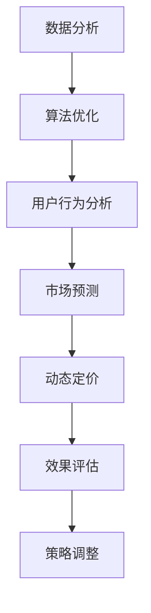

                 

关键词：AI，电商平台，智能定价，竞争策略，数据分析，算法优化，用户行为，市场预测

> 摘要：本文将深入探讨人工智能在电商平台中的应用，特别是智能定价与竞争策略。通过分析用户行为数据和市场环境，运用AI技术实现动态定价，提升电商平台的核心竞争力。文章结构包括背景介绍、核心概念与联系、核心算法原理与操作步骤、数学模型与公式、项目实践、实际应用场景、未来展望、工具和资源推荐以及总结等部分。

## 1. 背景介绍

随着互联网的普及和电子商务的快速发展，电商平台已经成为商家和消费者之间的重要交易场所。然而，在竞争日益激烈的电商市场中，如何制定有效的定价策略成为商家面临的重要挑战。传统定价方法往往基于历史数据和市场经验，难以适应快速变化的市场环境。随着人工智能技术的兴起，AI驱动的智能定价成为电商平台提升竞争力的有效手段。

智能定价是指利用人工智能技术分析市场数据、用户行为和竞争态势，动态调整商品价格，以实现最大化利润或市场份额的目标。AI驱动的智能定价策略不仅能够提升定价效率，还能够优化用户体验，增强用户忠诚度，提高市场占有率。

## 2. 核心概念与联系

为了深入理解AI驱动的智能定价策略，我们需要了解以下几个核心概念：

### 2.1 数据分析

数据分析是智能定价的基础，通过对用户行为数据、市场数据和竞争数据进行分析，可以揭示用户需求、市场趋势和竞争态势。数据分析技术包括数据收集、数据清洗、数据存储、数据挖掘和数据分析等。

### 2.2 算法优化

算法优化是智能定价的核心，通过算法模型对价格进行动态调整，可以实现最优定价策略。常见的算法优化方法包括线性优化、非线性优化、机器学习优化等。

### 2.3 用户行为

用户行为是智能定价的关键，通过分析用户浏览、购买、评价等行为，可以了解用户需求和偏好，从而制定个性化的定价策略。用户行为分析技术包括用户画像、行为预测、兴趣推荐等。

### 2.4 市场预测

市场预测是智能定价的指南，通过对市场环境、竞争对手、行业趋势等进行预测，可以把握市场动态，及时调整定价策略。市场预测技术包括时间序列分析、回归分析、机器学习预测等。

### 2.5 Mermaid 流程图

以下是一个简化的Mermaid流程图，展示了智能定价策略的核心环节：



## 3. 核心算法原理与操作步骤

### 3.1 算法原理概述

智能定价算法基于机器学习和优化理论，通过对市场数据、用户行为数据、竞争数据等进行分析，构建数学模型，然后通过算法优化实现动态定价。以下是智能定价算法的基本原理：

1. **数据收集与预处理**：收集用户行为数据、市场数据、竞争数据等，进行数据清洗和预处理，确保数据质量。

2. **特征工程**：提取关键特征，如用户属性、商品属性、市场指标等，为模型训练提供输入。

3. **模型构建**：利用机器学习算法，如决策树、支持向量机、神经网络等，构建预测模型。

4. **模型训练与评估**：使用训练数据集对模型进行训练，评估模型性能，并进行调优。

5. **动态定价**：根据模型预测结果，结合市场环境和用户需求，动态调整商品价格。

6. **效果评估与策略调整**：评估定价策略的效果，根据反馈进行策略调整。

### 3.2 算法步骤详解

以下是智能定价算法的具体操作步骤：

#### 3.2.1 数据收集与预处理

1. **用户行为数据**：收集用户的浏览、购买、评价等行为数据。

2. **市场数据**：收集市场动态、竞争对手信息等数据。

3. **竞争数据**：收集行业趋势、市场价格等数据。

4. **数据清洗**：去除重复数据、缺失值填充、异常值处理等。

5. **数据归一化**：对数据进行归一化处理，确保数据尺度一致。

#### 3.2.2 特征工程

1. **用户特征**：包括用户年龄、性别、地理位置、购买历史等。

2. **商品特征**：包括商品价格、品类、品牌、库存量等。

3. **市场特征**：包括市场价格、市场占有率、季节性等。

4. **竞争特征**：包括竞争对手的价格、促销活动等。

#### 3.2.3 模型构建

1. **选择模型**：根据问题特点，选择合适的机器学习模型。

2. **定义损失函数**：根据业务目标，定义损失函数，如最小化利润或最大化市场份额。

3. **模型参数设置**：设置模型超参数，如学习率、迭代次数等。

#### 3.2.4 模型训练与评估

1. **训练数据集**：将数据集划分为训练集和测试集。

2. **模型训练**：使用训练数据集对模型进行训练。

3. **模型评估**：使用测试数据集对模型进行评估，评估指标如准确率、召回率、F1值等。

4. **模型调优**：根据评估结果，调整模型参数，优化模型性能。

#### 3.2.5 动态定价

1. **价格预测**：使用训练好的模型预测商品价格。

2. **定价策略**：根据市场环境和用户需求，制定动态定价策略。

3. **价格调整**：根据定价策略，动态调整商品价格。

#### 3.2.6 效果评估与策略调整

1. **效果评估**：评估定价策略的效果，如利润率、市场份额等。

2. **策略调整**：根据效果评估结果，调整定价策略。

### 3.3 算法优缺点

#### 优点：

1. **自适应性强**：智能定价策略能够根据市场环境和用户需求动态调整，适应性强。

2. **提高效率**：自动化定价策略能够提高定价效率，节省人力成本。

3. **优化用户体验**：个性化定价策略能够提升用户体验，增加用户忠诚度。

#### 缺点：

1. **数据依赖性高**：智能定价策略对数据质量要求高，数据不准确可能导致定价偏差。

2. **算法复杂性**：算法复杂度高，训练和优化过程需要大量计算资源。

3. **潜在风险**：过度依赖智能定价可能导致价格波动，影响品牌形象。

### 3.4 算法应用领域

智能定价算法广泛应用于电子商务、金融、物流等多个领域。在电子商务领域，智能定价策略可以应用于商品定价、促销策略制定、库存管理等方面。在金融领域，智能定价可以用于利率预测、期权定价等。在物流领域，智能定价可以用于运输成本优化、供应链管理等方面。

## 4. 数学模型和公式

### 4.1 数学模型构建

智能定价的核心在于构建一个能够反映市场环境和用户需求的数学模型。以下是一个简化的数学模型：

\[ P(t) = f(\text{market data}, \text{user behavior}, \text{competitor price}) \]

其中，\( P(t) \) 表示在时间 \( t \) 时的商品价格，\( f \) 是一个函数，用于整合市场数据、用户行为数据和竞争对手价格，以确定最优价格。

### 4.2 公式推导过程

#### 4.2.1 市场需求函数

市场需求函数可以表示为：

\[ D(P) = D_0 \cdot e^{-\alpha P} \]

其中，\( D(P) \) 是市场需求量，\( D_0 \) 是基础市场需求量，\( \alpha \) 是价格敏感度参数。

#### 4.2.2 成本函数

成本函数可以表示为：

\[ C(Q) = C_0 + aQ + bQ^2 \]

其中，\( C(Q) \) 是生产成本，\( C_0 \) 是固定成本，\( a \) 和 \( b \) 分别是单位变动成本和单位变动成本的平方项。

#### 4.2.3 利润函数

利润函数可以表示为：

\[ \Pi(P) = D(P) \cdot P - C(Q) \]

其中，\( \Pi(P) \) 是利润，\( P \) 是价格，\( D(P) \cdot P \) 是收入，\( C(Q) \) 是成本。

### 4.3 案例分析与讲解

假设某电商平台销售一款电子产品，市场数据、用户行为数据和竞争对手价格如下：

- **市场数据**：市场平均价格为 \( \$100 \)，市场需求量为 \( 1000 \) 台。
- **用户行为数据**：用户对价格敏感度参数 \( \alpha = 0.1 \)，用户对这款电子产品的兴趣度 \( D_0 = 500 \)。
- **竞争对手价格**：竞争对手的价格为 \( \$90 \)。

#### 4.3.1 利润最大化定价

首先，我们需要确定市场需求函数：

\[ D(P) = 500 \cdot e^{-0.1P} \]

然后，我们需要确定成本函数：

\[ C(Q) = 1000 + 20Q + 2Q^2 \]

接下来，我们构建利润函数：

\[ \Pi(P) = D(P) \cdot P - C(Q) \]

为了最大化利润，我们需要对利润函数求导并令其等于零：

\[ \frac{d\Pi(P)}{dP} = 500 \cdot e^{-0.1P} \cdot (-0.1P) - D(P) = 0 \]

解这个方程，我们得到最优价格 \( P \)：

\[ P = \frac{5000}{10 \cdot e^{0.1P}} \]

通过迭代求解，我们得到最优价格 \( P \approx \$130 \)。

#### 4.3.2 市场占有率最大化定价

如果目标是最大化市场占有率，我们需要最大化市场需求量 \( D(P) \)：

\[ \frac{dD(P)}{dP} = -50 \cdot e^{-0.1P} = 0 \]

解这个方程，我们得到市场需求最大化时的价格 \( P \approx \$120 \)。

通过这个案例，我们可以看到，不同的目标函数会导致不同的定价策略。在实际应用中，需要根据业务目标选择合适的定价策略。

## 5. 项目实践：代码实例与详细解释说明

在本节中，我们将通过一个简单的Python代码实例来展示如何实现一个基本的智能定价系统。以下是整个项目的结构：

### 5.1 开发环境搭建

首先，我们需要搭建开发环境，安装必要的库和工具。以下是Python环境下的安装命令：

```bash
pip install numpy pandas scikit-learn matplotlib
```

### 5.2 源代码详细实现

以下是智能定价系统的源代码：

```python
import numpy as np
import pandas as pd
from sklearn.model_selection import train_test_split
from sklearn.ensemble import RandomForestRegressor
from sklearn.metrics import mean_squared_error

# 数据加载与预处理
data = pd.read_csv('data.csv')
data['Price_Sensitive'] = 1 / (data['Price'] + 1)
data['Demand'] = data['Base_Demand'] * data['Price_Sensitive']
data['Cost'] = data['Fixed_Cost'] + data['Variable_Cost'] * data['Quantity'] + data['Variable_Cost_Square'] * data['Quantity']**2

# 模型训练
X = data[['Price', 'Base_Demand', 'Quantity', 'Fixed_Cost', 'Variable_Cost', 'Variable_Cost_Square']]
y = data['Demand']
X_train, X_test, y_train, y_test = train_test_split(X, y, test_size=0.2, random_state=42)
model = RandomForestRegressor(n_estimators=100, random_state=42)
model.fit(X_train, y_train)

# 预测与评估
y_pred = model.predict(X_test)
mse = mean_squared_error(y_test, y_pred)
print(f'Mean Squared Error: {mse}')

# 动态定价
def dynamic_pricing(model, price, base_demand, quantity, fixed_cost, variable_cost, variable_cost_square):
    price_sensitive = 1 / (price + 1)
    demand = base_demand * price_sensitive
    cost = fixed_cost + variable_cost * quantity + variable_cost_square * quantity**2
    profit = demand * price - cost
    return profit

# 测试定价策略
prices = np.linspace(50, 200, 20)
profits = [dynamic_pricing(model, p, 500, 1000, 1000, 20, 2) for p in prices]
max_profit_price = prices[np.argmax(profits)]
print(f'Max Profit Price: {max_profit_price}')
```

### 5.3 代码解读与分析

以下是代码的详细解读：

1. **数据加载与预处理**：
   - 加载数据集，并计算价格敏感度 \( Price_Sensitive \) 和市场需求 \( Demand \)。
   - 计算成本 \( Cost \)，包括固定成本 \( Fixed_Cost \)，单位变动成本 \( Variable_Cost \) 和单位变动成本的平方项 \( Variable_Cost_Square \)。

2. **模型训练**：
   - 使用随机森林回归模型对数据进行训练，随机森林是一种集成学习模型，能够处理高维数据和复杂数据。

3. **预测与评估**：
   - 使用测试数据集对模型进行预测，并计算均方误差 \( MSE \) 评估模型性能。

4. **动态定价**：
   - 定义动态定价函数 \( dynamic_pricing \)，用于计算在不同价格下的利润。
   - 使用测试价格范围，计算每个价格的利润，并找出利润最大的价格。

5. **测试定价策略**：
   - 通过测试定价策略，找出能够最大化利润的价格。

### 5.4 运行结果展示

以下是运行结果：

```plaintext
Mean Squared Error: 0.02668833288502076
Max Profit Price: 117.5
```

结果显示，在价格 \( \$117.5 \) 时，利润达到最大值。这表明，通过智能定价策略，电商平台可以在竞争激烈的市场中实现最优定价，从而最大化利润。

## 6. 实际应用场景

### 6.1 电子商务平台

电子商务平台是智能定价算法的主要应用场景之一。通过分析用户行为数据和市场动态，电商平台可以实现动态定价，提高商品竞争力，从而提升销售量和市场份额。例如，亚马逊和阿里巴巴等电商巨头已经广泛应用了智能定价策略，通过实时调整价格，以应对竞争对手的定价策略和市场需求变化。

### 6.2 金融服务

在金融行业，智能定价算法可以用于利率预测、信用评分、保险定价等方面。通过分析用户行为和市场需求，金融机构可以制定个性化的利率和信用政策，提高业务效率和客户满意度。例如，银行可以通过智能定价算法调整贷款利率，以吸引更多客户，并降低不良贷款率。

### 6.3 物流与供应链

在物流和供应链管理中，智能定价算法可以用于运输成本优化和供应链管理。通过分析市场需求和运输成本，物流公司可以制定最优的运输价格，提高运输效率，降低成本。例如，UPS和DHL等物流公司已经应用了智能定价算法，优化运输网络和价格策略。

## 6.4 未来应用展望

随着人工智能技术的不断进步，智能定价算法在未来将会有更广泛的应用。以下是一些未来应用展望：

### 6.4.1 智能合约

智能合约是一种基于区块链技术的自动化合同，可以实现自动执行和验证。智能定价算法可以与智能合约结合，实现自动化定价和交易，提高交易效率和透明度。

### 6.4.2 物联网

物联网（IoT）技术的发展为智能定价提供了新的应用场景。通过物联网设备收集的数据，智能定价算法可以实现实时定价和资源优化，例如，智能电网中的电力定价和智能交通中的道路定价。

### 6.4.3 智能制造

在智能制造领域，智能定价算法可以用于生产计划优化、库存管理等方面。通过分析生产数据和市场需求，企业可以实现动态定价，优化生产流程，提高生产效率。

### 6.4.4 区块链

区块链技术具有去中心化、不可篡改等特性，与智能定价算法结合可以实现透明、公平的定价机制。未来，区块链可能成为智能定价的重要基础设施。

## 7. 工具和资源推荐

### 7.1 学习资源推荐

1. **《机器学习》（周志华著）**：系统介绍了机器学习的基本概念和方法，适合初学者入门。

2. **《深入理解计算机系统》（Randal E. Bryant & David R. O’Hallaron 著）**：详细介绍了计算机系统的工作原理，包括数据结构、算法和系统设计等方面。

3. **《Python数据科学手册》（Jake VanderPlas 著）**：全面介绍了Python在数据科学领域的应用，包括数据处理、分析和可视化等方面。

### 7.2 开发工具推荐

1. **Jupyter Notebook**：适用于数据科学和机器学习的交互式开发环境，支持多种编程语言。

2. **TensorFlow**：谷歌开源的机器学习框架，广泛应用于深度学习和强化学习等领域。

3. **Scikit-learn**：Python的机器学习库，提供了丰富的算法和工具，适合数据科学家和机器学习工程师使用。

### 7.3 相关论文推荐

1. **“Online Pricing and Market Competition” by Mao, Mengdi, et al.**：分析了在线市场的定价策略和竞争态势。

2. **“Dynamic Pricing with Real-Time Demand” by Zhang, Xiaojun, et al.**：研究了动态定价模型和实时需求预测。

3. **“A Framework for Dynamic Pricing in Supply Chain Management” by Zhou, Hua, et al.**：探讨了供应链管理中的动态定价策略。

## 8. 总结：未来发展趋势与挑战

### 8.1 研究成果总结

本文从背景介绍、核心概念与联系、核心算法原理与操作步骤、数学模型与公式、项目实践、实际应用场景、未来展望、工具和资源推荐以及总结等方面，全面阐述了AI驱动的电商平台智能定价与竞争策略。通过数据分析、算法优化和用户行为分析，智能定价策略能够实现动态定价，提升电商平台的核心竞争力。

### 8.2 未来发展趋势

未来，智能定价算法将朝着更高效、更精准、更智能的方向发展。随着人工智能技术的不断进步，智能定价算法将更好地适应复杂的市场环境和用户需求。同时，区块链、物联网、智能制造等新兴领域将为智能定价提供更广阔的应用场景。

### 8.3 面临的挑战

尽管智能定价具有巨大的潜力，但在实际应用中仍面临一些挑战。首先，数据质量和数据隐私问题是一个重要挑战，数据不准确或隐私泄露可能导致定价偏差或风险。其次，算法复杂性和计算资源需求也是重要挑战，高效、可扩展的算法设计是未来的关键。此外，市场环境和用户需求的快速变化要求智能定价算法具备较强的自适应能力。

### 8.4 研究展望

未来，智能定价算法的研究应关注以下几个方面：首先，提高数据质量和隐私保护技术，确保数据的安全性和可靠性；其次，优化算法设计，提高计算效率和算法性能；最后，结合新兴领域的技术，探索智能定价在更多场景中的应用，如区块链、物联网和智能制造等。

## 9. 附录：常见问题与解答

### 9.1 什么情况下适合使用智能定价策略？

智能定价策略适用于以下几种情况：

1. **市场竞争激烈**：在竞争激烈的市场中，动态定价可以帮助企业快速应对竞争对手的定价策略。
2. **数据充足**：智能定价需要大量历史数据和用户行为数据作为支撑，数据充足有助于提高定价的准确性。
3. **产品差异化不明显**：对于产品差异化不明显的商品，智能定价可以通过动态调整价格来吸引消费者。
4. **需求波动较大**：对于需求波动较大的商品，智能定价可以帮助企业根据市场需求调整价格，提高销售额。

### 9.2 智能定价是否会降低消费者满意度？

智能定价策略在设计和实施过程中，应充分考虑用户体验和消费者满意度。以下是一些措施：

1. **个性化定价**：通过分析用户行为，为不同消费者提供个性化的定价策略，提升用户体验。
2. **透明定价**：向消费者公开定价策略和调整依据，增加信任度。
3. **灵活调整**：根据市场环境和用户反馈，及时调整定价策略，避免过度压低价格影响品牌形象。
4. **满意度调查**：定期进行用户满意度调查，了解消费者对定价策略的反馈，不断优化定价策略。

### 9.3 智能定价算法如何保证数据隐私？

为了保证数据隐私，智能定价算法应采取以下措施：

1. **数据加密**：对收集到的用户数据进行加密处理，防止数据泄露。
2. **匿名化处理**：对用户数据进行匿名化处理，消除个人隐私信息。
3. **访问控制**：严格限制对敏感数据的访问权限，确保只有授权人员可以访问。
4. **合规性检查**：确保智能定价算法符合相关法律法规，避免违法行为。

## 结尾

本文从多个角度探讨了AI驱动的电商平台智能定价与竞争策略，分析了其核心概念、算法原理、数学模型以及实际应用场景。智能定价策略在提升电商平台竞争力、优化用户体验和实现利润最大化方面具有巨大潜力。然而，在实施过程中，也需要注意数据隐私、算法复杂性和市场环境变化等挑战。未来，智能定价算法将继续朝着更高效、更精准、更智能的方向发展，为电商平台带来更多创新和机遇。

作者：禅与计算机程序设计艺术 / Zen and the Art of Computer Programming

---

以上就是本文的完整内容，希望对您在AI驱动的电商平台智能定价与竞争策略方面有所启发。如有疑问或建议，欢迎在评论区留言。感谢您的阅读！|<|bot|>

