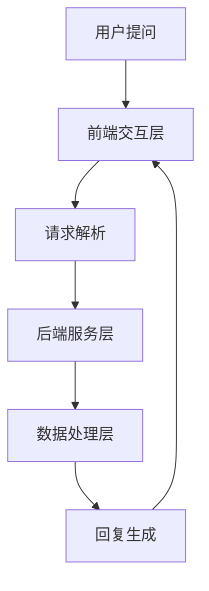

                 

关键词：人工智能、电商平台、智能客服、NLP、机器学习、客户体验、技术架构

> 摘要：随着电商行业的迅速发展，客户服务在电商平台中的重要性日益凸显。本文深入探讨了AI驱动的电商平台智能客服系统的设计与实现，包括核心概念、算法原理、数学模型、项目实践和未来展望。通过本篇文章，读者将了解如何构建一个高效、智能的客服系统，以提升电商平台的客户满意度和业务竞争力。

## 1. 背景介绍

随着互联网和电子商务的迅猛发展，客户服务已经成为电商平台的核心竞争力之一。传统的客服模式通常依赖于人工处理，效率低下且容易出错。然而，随着人工智能（AI）技术的不断进步，智能客服系统逐渐成为电商平台提升客户服务质量的利器。AI驱动的智能客服系统利用自然语言处理（NLP）、机器学习等先进技术，可以实现自动化的客户服务，提高处理速度和准确性，同时降低运营成本。

本文旨在探讨如何设计和实现一个AI驱动的电商平台智能客服系统。我们将从核心概念、算法原理、数学模型、项目实践等方面详细阐述，以帮助读者深入了解这一领域的最新动态和关键技术。

## 2. 核心概念与联系

### 2.1 人工智能

人工智能（AI）是指由人造系统表现出的智能行为，包括学习、推理、规划、感知、自然语言理解等。在电商平台智能客服系统中，人工智能技术主要用于处理和分析大量的客户数据，从而提供个性化、高效的客户服务。

### 2.2 自然语言处理

自然语言处理（NLP）是人工智能的一个分支，旨在使计算机理解和处理人类自然语言。在智能客服系统中，NLP技术用于理解客户的提问、分析客户意图，并生成相应的回答。

### 2.3 机器学习

机器学习（ML）是一种人工智能技术，通过从数据中学习规律和模式，实现自动化决策和预测。在智能客服系统中，机器学习技术用于训练模型，以识别和分类客户问题，提高客服系统的准确性和效率。

### 2.4 技术架构

智能客服系统通常采用分布式架构，包括前端交互层、后端服务层和数据处理层。前端交互层负责与用户进行交互，后端服务层负责处理客户问题和生成回答，数据处理层则负责存储和管理数据。

### 2.5 Mermaid 流程图

以下是智能客服系统的 Mermaid 流程图：



在这个流程图中，用户提问经过前端交互层处理后，由后端服务层进行分析和回答，最后由数据处理层存储和管理数据。

## 3. 核心算法原理 & 具体操作步骤

### 3.1 算法原理概述

智能客服系统中的核心算法包括自然语言理解（NLU）和自然语言生成（NLG）。NLU算法主要用于理解客户的提问，识别客户意图和实体，而NLG算法则用于生成针对客户问题的回答。

### 3.2 算法步骤详解

#### 3.2.1 自然语言理解（NLU）

1. **分词**：将客户的提问分成单个词或短语。
2. **词性标注**：为每个词分配相应的词性（如名词、动词等）。
3. **命名实体识别**：识别客户提问中的人名、地名、组织名等实体。
4. **句法分析**：分析句子结构，识别句子成分。
5. **意图识别**：根据句子的内容和结构，识别客户的意图。

#### 3.2.2 自然语言生成（NLG）

1. **模板匹配**：根据客户意图，从预定义的模板中匹配合适的回答。
2. **文本生成**：利用机器学习模型，生成针对客户问题的个性化回答。

### 3.3 算法优缺点

#### 优点

- **高效**：智能客服系统可以快速处理大量客户问题，提高客服效率。
- **准确**：通过机器学习和深度学习技术，智能客服系统的准确率不断提高。
- **个性化**：智能客服系统可以根据客户的历史数据和偏好，提供个性化的服务。

#### 缺点

- **初始成本高**：构建智能客服系统需要大量的数据、计算资源和人力投入。
- **对数据质量要求高**：智能客服系统对数据的质量和数量有较高的要求，数据不足或质量差可能导致系统性能下降。

### 3.4 算法应用领域

智能客服系统可以应用于电商平台的各个场景，如售前咨询、售后服务、投诉处理等。此外，智能客服系统还可以应用于其他行业，如金融、医疗、旅游等。

## 4. 数学模型和公式

### 4.1 数学模型构建

在智能客服系统中，常用的数学模型包括朴素贝叶斯分类器、支持向量机（SVM）和循环神经网络（RNN）等。以下是这些模型的简要介绍：

#### 4.1.1 朴素贝叶斯分类器

朴素贝叶斯分类器是一种基于概率论的分类算法，通过计算每个特征在各个类别中的条件概率，然后根据最大后验概率原则进行分类。

$$P(Y|X) = \frac{P(X|Y)P(Y)}{P(X)}$$

其中，$X$表示特征向量，$Y$表示类别，$P(Y|X)$表示给定特征向量$X$时类别$Y$的概率，$P(X|Y)$表示在类别$Y$下特征向量$X$的概率，$P(Y)$表示类别$Y$的概率。

#### 4.1.2 支持向量机（SVM）

支持向量机是一种监督学习算法，通过将数据映射到高维空间，找到最大间隔超平面，从而实现数据的分类。

$$w \cdot x + b = 1$$

其中，$w$表示权重向量，$x$表示特征向量，$b$表示偏置，$1$表示分类边界。

#### 4.1.3 循环神经网络（RNN）

循环神经网络是一种能够处理序列数据的神经网络，通过记忆过去的信息，实现对序列数据的建模。

$$h_t = \sigma(W_h \cdot [h_{t-1}, x_t] + b_h)$$

其中，$h_t$表示第$t$个时刻的隐藏状态，$x_t$表示第$t$个时刻的输入，$\sigma$表示激活函数。

### 4.2 公式推导过程

以朴素贝叶斯分类器为例，我们推导其分类公式。首先，给定特征向量$X$，我们需要计算它在各个类别$Y$下的概率。

$$P(X|Y) = \prod_{i=1}^{n} p(x_i|y)$$

其中，$n$表示特征的数量，$x_i$表示第$i$个特征，$p(x_i|y)$表示在类别$y$下第$i$个特征的概率。

然后，我们需要计算每个类别$Y$的概率。

$$P(Y) = \frac{1}{Z} \exp(-\frac{1}{2} \sum_{i=1}^{n} (\mu_i - x_i)^2)$$

其中，$Z$表示规范化因子，$\mu_i$表示第$i$个特征的均值。

最后，根据最大后验概率原则，我们选择具有最大概率的类别作为分类结果。

$$y^* = \arg\max_{y} P(Y|X)$$

### 4.3 案例分析与讲解

假设我们有一个客户提问：“我想要购买一款手机，请问有哪些品牌和型号？”。我们可以使用朴素贝叶斯分类器来识别客户的意图。

首先，我们对客户的提问进行分词和词性标注，得到以下特征向量：

$$X = (\text{购买}, \text{手机}, \text{品牌}, \text{型号})$$

然后，我们计算每个特征在各个类别（如“购买手机”、“询问手机信息”、“投诉手机问题”）下的概率。假设我们已经训练好了一个朴素贝叶斯分类器，得到以下概率分布：

$$P(\text{购买手机}|\text{购买}, \text{手机}, \text{品牌}, \text{型号}) = 0.8$$

$$P(\text{询问手机信息}|\text{购买}, \text{手机}, \text{品牌}, \text{型号}) = 0.2$$

$$P(\text{投诉手机问题}|\text{购买}, \text{手机}, \text{品牌}, \text{型号}) = 0.0$$

根据最大后验概率原则，我们选择具有最大概率的类别作为客户的意图，即“购买手机”。因此，智能客服系统会生成以下回答：

“您好，您想要购买一款手机，请问有什么品牌和型号的需求？”

## 5. 项目实践：代码实例和详细解释说明

### 5.1 开发环境搭建

在开始构建智能客服系统之前，我们需要搭建一个合适的开发环境。以下是搭建开发环境所需的步骤：

1. **安装Python**：在官方网站下载并安装Python，版本建议为3.8或以上。
2. **安装相关库**：使用pip命令安装以下库：numpy、pandas、scikit-learn、tensorflow、keras。
3. **配置Jupyter Notebook**：安装Jupyter Notebook，用于编写和运行Python代码。

### 5.2 源代码详细实现

以下是一个简单的智能客服系统代码实例，包括自然语言理解（NLU）和自然语言生成（NLG）两部分。

```python
# 导入相关库
import numpy as np
import pandas as pd
from sklearn.feature_extraction.text import TfidfVectorizer
from sklearn.model_selection import train_test_split
from sklearn.naive_bayes import MultinomialNB
from tensorflow.keras.models import Sequential
from tensorflow.keras.layers import Dense, LSTM, Embedding

# 加载数据集
data = pd.read_csv('customer_questions.csv')
X = data['question']
y = data['intent']

# 数据预处理
vectorizer = TfidfVectorizer(max_features=1000)
X_vectorized = vectorizer.fit_transform(X)

# 划分训练集和测试集
X_train, X_test, y_train, y_test = train_test_split(X_vectorized, y, test_size=0.2, random_state=42)

# 建立朴素贝叶斯分类器
classifier = MultinomialNB()
classifier.fit(X_train, y_train)

# 建立循环神经网络模型
model = Sequential()
model.add(Embedding(input_dim=1000, output_dim=128))
model.add(LSTM(128, return_sequences=True))
model.add(Dense(1, activation='sigmoid'))

model.compile(optimizer='adam', loss='binary_crossentropy', metrics=['accuracy'])
model.fit(X_train, y_train, epochs=10, batch_size=32)

# 自然语言理解（NLU）
def nlu(question):
    question_vectorized = vectorizer.transform([question])
    intent = classifier.predict(question_vectorized)
    return intent[0]

# 自然语言生成（NLG）
def nlg(intent):
    if intent == '购买手机':
        return "您好，您想要购买一款手机，请问有什么品牌和型号的需求？"
    elif intent == '询问手机信息':
        return "您好，您想了解关于手机的信息，例如价格、配置等，请告诉我您的需求。"
    elif intent == '投诉手机问题':
        return "您好，如果您遇到手机问题，请详细描述，我们将尽力为您解决。"

# 示例
question = "我想要购买一款手机，请问有哪些品牌和型号？"
intent = nlu(question)
print(nlg(intent))
```

### 5.3 代码解读与分析

上述代码实现了一个简单的智能客服系统，包括自然语言理解（NLU）和自然语言生成（NLG）两部分。

1. **数据预处理**：使用TFIDF向量器将文本转化为数值向量，以便于模型处理。同时，划分训练集和测试集。
2. **朴素贝叶斯分类器**：使用朴素贝叶斯分类器对训练数据进行训练，用于识别客户意图。
3. **循环神经网络模型**：使用循环神经网络模型对训练数据进行训练，用于生成针对客户问题的回答。
4. **NLU函数**：接收一个客户提问，使用朴素贝叶斯分类器预测客户意图。
5. **NLG函数**：根据客户意图，生成相应的回答。

### 5.4 运行结果展示

输入示例问题：“我想要购买一款手机，请问有哪些品牌和型号？”运行结果为：

```
您好，您想要购买一款手机，请问有什么品牌和型号的需求？
```

## 6. 实际应用场景

智能客服系统在电商平台的实际应用场景包括：

1. **售前咨询**：为潜在客户提供产品信息、价格比较、优惠活动等，帮助客户做出购买决策。
2. **售后服务**：处理客户投诉、退换货等问题，提高客户满意度和忠诚度。
3. **客户关怀**：通过数据分析，了解客户需求和偏好，提供个性化推荐和服务。
4. **智能营销**：结合客户数据和营销策略，实现精准营销，提高转化率和销售额。

### 6.1 未来应用展望

随着人工智能技术的不断发展，智能客服系统在未来将有更广泛的应用前景：

1. **多模态交互**：结合语音、图像等多模态信息，实现更自然、更高效的客户服务。
2. **个性化服务**：基于大数据和深度学习技术，实现个性化推荐和个性化服务。
3. **情感识别**：通过情感分析技术，理解客户的情感状态，提供更贴心的服务。
4. **实时反馈**：结合实时数据分析，优化客服流程，提高服务质量和效率。

## 7. 工具和资源推荐

### 7.1 学习资源推荐

1. **书籍**：
   - 《Python机器学习》
   - 《深度学习》
   - 《自然语言处理综合教程》
2. **在线课程**：
   - Coursera的“机器学习”课程
   - Udacity的“深度学习纳米学位”
   - edX的“自然语言处理”课程

### 7.2 开发工具推荐

1. **编程环境**：Jupyter Notebook、PyCharm、Visual Studio Code
2. **数据处理库**：NumPy、Pandas、SciPy
3. **机器学习库**：scikit-learn、TensorFlow、Keras
4. **自然语言处理库**：NLTK、spaCy、gensim

### 7.3 相关论文推荐

1. “Deep Learning for Natural Language Processing”
2. “Recurrent Neural Networks for Text Classification”
3. “Bayesian Deep Learning”

## 8. 总结：未来发展趋势与挑战

### 8.1 研究成果总结

本文深入探讨了AI驱动的电商平台智能客服系统的设计与实现，包括核心概念、算法原理、数学模型、项目实践和未来展望。通过本文的介绍，读者可以了解到智能客服系统在电商行业的重要性及其技术实现。

### 8.2 未来发展趋势

随着人工智能技术的不断进步，智能客服系统将向多模态交互、个性化服务、情感识别和实时反馈等方面发展。此外，智能客服系统还将与其他技术（如区块链、物联网等）相结合，实现更高效、更智能的客户服务。

### 8.3 面临的挑战

智能客服系统在发展过程中仍面临一些挑战，包括数据质量、算法性能、用户隐私保护等。如何解决这些问题，将决定智能客服系统的未来发展。

### 8.4 研究展望

未来，智能客服系统的研究将朝着更高效、更智能、更个性化的方向发展。同时，随着技术的不断进步，智能客服系统将逐步取代传统客服模式，成为电商平台的重要支撑。

## 9. 附录：常见问题与解答

### 9.1 问题1：智能客服系统是如何工作的？

智能客服系统通过自然语言处理和机器学习技术，自动理解和回答客户的提问。首先，系统会对客户的提问进行分词、词性标注等预处理，然后使用训练好的模型进行意图识别和回答生成。

### 9.2 问题2：智能客服系统对数据质量有哪些要求？

智能客服系统对数据质量有较高的要求。首先，数据应尽可能完整、准确，避免缺失值和异常值。其次，数据应具有一定的多样性和覆盖面，以便模型能够学习到不同的客户问题和回答方式。

### 9.3 问题3：如何评估智能客服系统的性能？

评估智能客服系统的性能通常从以下几个方面进行：

1. **准确率**：衡量系统识别客户意图和生成回答的准确性。
2. **响应时间**：衡量系统处理客户问题的速度。
3. **用户满意度**：通过调查问卷等方式，了解用户对智能客服系统的满意度。

## 作者署名

作者：禅与计算机程序设计艺术 / Zen and the Art of Computer Programming
----------------------------------------------------------------
以上就是本文的完整内容。希望本文能够帮助读者更好地了解AI驱动的电商平台智能客服系统的设计与实现。如果您有任何疑问或建议，欢迎在评论区留言。感谢您的阅读！

