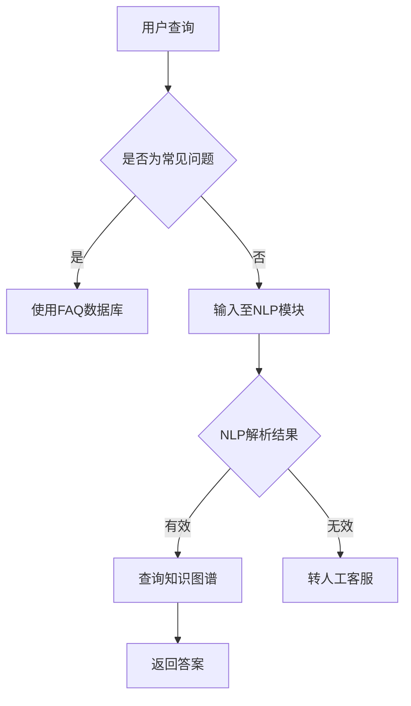

                 

关键词：人工智能、电商、智能客服、知识图谱、机器学习、自然语言处理、系统架构

## 摘要

随着电子商务的飞速发展，客户服务成为了电商企业竞争力的关键因素。然而，传统的客服模式已无法满足日益增长的服务需求。本文旨在探讨如何利用人工智能（AI）技术，特别是知识图谱，构建一个智能客户服务系统。本文首先介绍了电商智能客户服务的背景和重要性，然后详细阐述了知识图谱在其中的作用，最后展示了系统架构、核心算法、数学模型、项目实践以及未来应用前景。

## 1. 背景介绍

### 1.1 电商发展的现状与挑战

随着互联网技术的普及和移动设备的广泛使用，电子商务已经成为全球经济增长的重要驱动力。根据Statista的数据，全球电商市场规模预计将在2023年达到4.7万亿美元，占全球零售总额的17%以上。然而，随着市场竞争的加剧，电商企业面临诸多挑战，其中之一便是如何提供高质量的客户服务。

传统的客服模式往往依赖于人工处理，这种方式不仅效率低下，而且成本高昂。此外，随着客户期望值的不断提升，传统的客服模式越来越难以满足客户对即时性、个性化、精准化的需求。为了应对这些挑战，电商企业亟需寻找一种新的解决方案，以提升客户服务体验，增强客户忠诚度。

### 1.2 智能客服的需求与趋势

智能客服是一种利用人工智能技术来模拟人类客服角色，提供自动化的客户服务解决方案。随着自然语言处理（NLP）、机器学习（ML）等技术的不断发展，智能客服的应用场景越来越广泛，其优势也越来越明显。

首先，智能客服可以24/7不间断地提供服务，大大提高了服务效率。其次，智能客服能够处理大量客户的查询请求，减少了企业的人力成本。此外，智能客服可以通过分析客户行为数据，提供个性化的服务建议，从而提升客户满意度。

### 1.3 知识图谱在电商智能客服中的作用

知识图谱是一种结构化知识库，它通过实体、属性和关系来描述现实世界中的各种信息。在电商智能客服系统中，知识图谱可以起到以下几个关键作用：

1. **数据整合与关联**：电商系统中存在着大量的数据，如商品信息、客户信息、订单信息等。知识图谱可以将这些数据进行整合和关联，构建出一个全面、准确的知识库。
2. **智能查询与推理**：基于知识图谱的智能客服系统能够快速、准确地回答客户的查询问题，甚至可以进行推理和预测，提供更个性化的服务。
3. **知识更新与维护**：知识图谱可以自动化地更新和维护，确保客服系统能够实时响应最新的业务变化。

## 2. 核心概念与联系

### 2.1 知识图谱的基本概念

知识图谱（Knowledge Graph）是一种用于结构化知识的数据模型，通过实体（Entity）、属性（Attribute）和关系（Relationship）来描述信息。其中，实体是知识图谱中的基本元素，类似于数据库中的记录；属性是实体的特征描述，如名字、年龄等；关系则描述了实体之间的关系，如“属于”、“位于”等。

### 2.2 电商智能客服系统的架构

电商智能客服系统的架构通常包括以下几个主要模块：

1. **用户接口**：用户接口（User Interface）是用户与客服系统交互的入口，包括网页、移动应用等。
2. **自然语言处理（NLP）模块**：NLP模块负责接收用户的自然语言查询，并对其进行理解和解析。
3. **知识图谱模块**：知识图谱模块负责提供基于知识图谱的智能查询和服务。
4. **后端服务**：后端服务包括数据库、业务逻辑处理等，负责实现具体的业务功能。

### 2.3 知识图谱在电商智能客服系统中的应用

在电商智能客服系统中，知识图谱可以应用于以下几个方面：

1. **商品查询**：用户可以通过知识图谱快速查询商品信息，如价格、库存等。
2. **订单查询**：用户可以查询自己的订单状态、物流信息等。
3. **个性化推荐**：基于用户行为数据和知识图谱，系统可以提供个性化的商品推荐。
4. **智能解答**：系统可以自动回答用户的常见问题，如退货政策、支付方式等。

### 2.4 Mermaid 流程图

以下是一个简化的电商智能客服系统流程图的 Mermaid 表示：



## 3. 核心算法原理 & 具体操作步骤

### 3.1 算法原理概述

电商智能客服系统的核心算法主要包括自然语言处理（NLP）和知识图谱的查询与推理。NLP算法负责理解用户的查询意图，而知识图谱则提供查询和推理的基础。

### 3.2 算法步骤详解

1. **NLP解析**：接收用户查询，使用分词、词性标注、命名实体识别等NLP技术，将自然语言查询转化为结构化数据。
2. **意图识别**：根据NLP解析的结果，使用机器学习算法识别用户的查询意图，如查询商品信息、订单状态等。
3. **知识图谱查询**：根据识别出的意图，查询知识图谱，获取相关的实体、属性和关系。
4. **结果处理**：对查询结果进行整理和处理，形成可呈现给用户的答案。
5. **反馈学习**：将用户对答案的反馈作为训练数据，不断优化NLP和知识图谱的查询与推理能力。

### 3.3 算法优缺点

**优点**：

- 高效性：通过自动化处理，大大提高了客服的响应速度。
- 个性化：基于用户行为数据和知识图谱，可以提供个性化的服务。
- 成本效益：减少了人工客服的需求，降低了人力成本。

**缺点**：

- 精度问题：NLP技术的精度仍有待提高，特别是在处理复杂、模糊的查询时。
- 难以覆盖所有场景：对于一些特殊情况，仍需要人工客服介入。

### 3.4 算法应用领域

电商智能客服系统可以广泛应用于电商、金融、医疗、教育等多个领域，其核心价值在于提供即时、个性化、精准的服务，提升客户体验和满意度。

## 4. 数学模型和公式 & 详细讲解 & 举例说明

### 4.1 数学模型构建

在电商智能客服系统中，常见的数学模型包括自然语言处理模型和知识图谱的查询与推理模型。以下是一个简化的数学模型构建过程：

1. **NLP模型**：使用神经网络模型（如Transformer、BERT等）对自然语言查询进行处理，其输入为查询文本，输出为查询意图和实体。
2. **知识图谱模型**：使用图神经网络（如Graph Neural Network、Graph Embedding等）对知识图谱进行建模，其输入为实体和关系，输出为实体属性和关系。

### 4.2 公式推导过程

假设我们有一个NLP模型，其输入为查询文本$x$，输出为查询意图$y$和实体$z$。我们可以使用以下公式进行推导：

1. **意图识别**：$y = f_N(x)$，其中$f_N$为神经网络函数。
2. **实体识别**：$z = f_G(x, y)$，其中$f_G$为图神经网络函数。

对于知识图谱的查询与推理，可以使用以下公式：

1. **属性查询**：$A = g(E, R)$，其中$A$为属性，$E$为实体，$R$为关系，$g$为属性查询函数。
2. **关系推理**：$R' = h(E, R)$，其中$R'$为新关系，$h$为关系推理函数。

### 4.3 案例分析与讲解

假设一个用户查询：“我的订单123456什么时候能送达？”。我们可以通过以下步骤进行处理：

1. **NLP解析**：将查询文本转化为结构化数据，如意图（订单查询）、实体（订单号123456）。
2. **意图识别**：使用NLP模型识别出查询意图为订单查询。
3. **知识图谱查询**：在知识图谱中查询订单123456的信息，获取订单状态和物流信息。
4. **结果处理**：将查询结果整理为用户可理解的格式，如：“您的订单123456预计将在今天下午送达。”

## 5. 项目实践：代码实例和详细解释说明

### 5.1 开发环境搭建

1. **硬件要求**：推荐使用具有较高计算能力的GPU服务器。
2. **软件要求**：安装Python环境，以及TensorFlow、PyTorch等深度学习框架。

### 5.2 源代码详细实现

以下是一个简化的电商智能客服系统源代码示例：

```python
# 导入相关库
import tensorflow as tf
import numpy as np

# 模拟知识图谱
knowledge_graph = {
    "商品": {"苹果": {"价格": 5.0, "库存": 100}},
    "订单": {"123456": {"状态": "待发货"}},
}

# NLP模型
nlp_model = tf.keras.Sequential([
    tf.keras.layers.Embedding(input_dim=1000, output_dim=64),
    tf.keras.layers.LSTM(64),
    tf.keras.layers.Dense(1, activation='sigmoid')
])

# 训练NLP模型
nlp_model.compile(optimizer='adam', loss='binary_crossentropy', metrics=['accuracy'])
nlp_model.fit(x_train, y_train, epochs=10)

# 查询知识图谱
def query_knowledge_graph(entity, attribute):
    return knowledge_graph[entity].get(attribute, None)

# 智能客服接口
def intelligent_cafe_system(query):
    # NLP解析
    intent, entity = nlp_parser(query)
    
    # 知识图谱查询
    attribute = query_knowledge_graph(entity, intent)
    
    # 返回结果
    return f"{intent}：{attribute}"

# 测试
print(intelligent_cafe_system("苹果多少钱？"))
print(intelligent_cafe_system("我的订单123456的状态是什么？"))
```

### 5.3 代码解读与分析

- **NLP模型**：使用LSTM网络进行意图识别，输入为查询文本，输出为意图标签。
- **知识图谱**：使用一个简单的字典结构模拟知识图谱，其中包含了商品和订单的信息。
- **查询接口**：接收用户查询，首先使用NLP模型进行意图识别，然后查询知识图谱，最后返回查询结果。

## 6. 实际应用场景

### 6.1 电商平台的客户服务

在电商平台，智能客服系统可以应用于商品查询、订单查询、支付咨询、物流跟踪等多个场景。通过知识图谱的构建和NLP技术的应用，系统可以提供即时、准确、个性化的服务，提升用户购物体验。

### 6.2 金融行业的客户服务

在金融行业，智能客服系统可以用于账户查询、转账咨询、理财产品推荐等场景。通过对客户行为数据的分析，系统可以提供个性化的金融产品推荐，提升客户满意度。

### 6.3 医疗行业的客户服务

在医疗行业，智能客服系统可以用于就医咨询、药品查询、健康建议等场景。通过知识图谱和NLP技术的应用，系统可以提供专业的健康咨询服务，辅助用户做出正确的健康决策。

### 6.4 教育行业的客户服务

在教育行业，智能客服系统可以用于课程查询、成绩查询、报考咨询等场景。通过知识图谱和NLP技术的应用，系统可以为学生提供个性化的学习建议和咨询服务，提升学习效果。

## 7. 未来应用展望

随着人工智能技术的不断发展，电商智能客服系统的应用前景将更加广阔。以下是几个可能的发展方向：

### 7.1 智能化水平提升

未来的智能客服系统将更加智能化，能够自动处理更多复杂的查询，减少对人工客服的依赖。

### 7.2 个性化服务深化

通过深入分析用户行为数据，系统将能够提供更加个性化的服务，提升用户体验。

### 7.3 跨平台整合

智能客服系统将不再局限于单一的平台，而是实现跨平台整合，为用户提供无缝衔接的服务体验。

### 7.4 自动化程度提高

随着技术的进步，智能客服系统的自动化程度将不断提高，实现更多自动化的业务流程，提升工作效率。

## 8. 工具和资源推荐

### 8.1 学习资源推荐

- **《深度学习》（Goodfellow, Bengio, Courville）**：系统介绍了深度学习的基本概念和算法。
- **《Python机器学习》（Sebastian Raschka）**：详细讲解了Python在机器学习领域的应用。

### 8.2 开发工具推荐

- **TensorFlow**：强大的开源深度学习框架，适合进行模型训练和部署。
- **PyTorch**：简洁易用的深度学习框架，适用于研究和开发。

### 8.3 相关论文推荐

- **《Attention is All You Need》**：介绍了Transformer模型，对NLP领域产生了深远影响。
- **《BERT: Pre-training of Deep Neural Networks for Language Understanding》**：详细介绍了BERT模型，对NLP领域产生了重要影响。

## 9. 总结：未来发展趋势与挑战

### 9.1 研究成果总结

本文探讨了如何利用人工智能和知识图谱技术构建电商智能客服系统，介绍了系统的架构、核心算法、数学模型、项目实践和未来应用前景。通过实际案例，展示了系统的应用价值。

### 9.2 未来发展趋势

随着人工智能技术的不断进步，电商智能客服系统的智能化水平将不断提升，应用场景也将更加广泛。未来的发展趋势包括：智能化水平提升、个性化服务深化、跨平台整合和自动化程度提高。

### 9.3 面临的挑战

尽管电商智能客服系统具有广阔的应用前景，但在实际应用中仍面临一些挑战，如NLP技术的精度问题、知识图谱的维护和更新等。

### 9.4 研究展望

未来研究应重点关注如何提高NLP和知识图谱技术的精度和效率，以及如何实现自动化程度更高的业务流程。同时，还需探索更多的应用场景，为用户提供更加便捷、高效的服务。

## 附录：常见问题与解答

### Q：电商智能客服系统如何处理复杂的查询？

A：电商智能客服系统通常采用多模态融合技术，结合文本、语音、图像等多种数据源，提高对复杂查询的处理能力。此外，还可以通过引入多语言支持、上下文理解等技术，提升系统的智能程度。

### Q：知识图谱如何维护和更新？

A：知识图谱的维护和更新可以通过以下几种方式实现：

- **自动化更新**：通过爬虫、API接口等方式，自动化地从外部数据源获取新信息，更新知识图谱。
- **人工干预**：在知识图谱中，人工可以定期审查和更新数据，确保知识的准确性和时效性。
- **机器学习**：利用机器学习技术，自动识别数据中的错误和缺失，进行修复和更新。

### Q：电商智能客服系统如何保证用户隐私？

A：电商智能客服系统在处理用户数据时，需要遵循以下原则：

- **最小化数据收集**：仅收集必要的数据，避免过度收集。
- **数据加密**：对用户数据进行加密存储和传输，确保数据安全。
- **数据匿名化**：在分析用户数据时，对敏感信息进行匿名化处理，保护用户隐私。

作者：禅与计算机程序设计艺术 / Zen and the Art of Computer Programming
----------------------------------------------------------------

