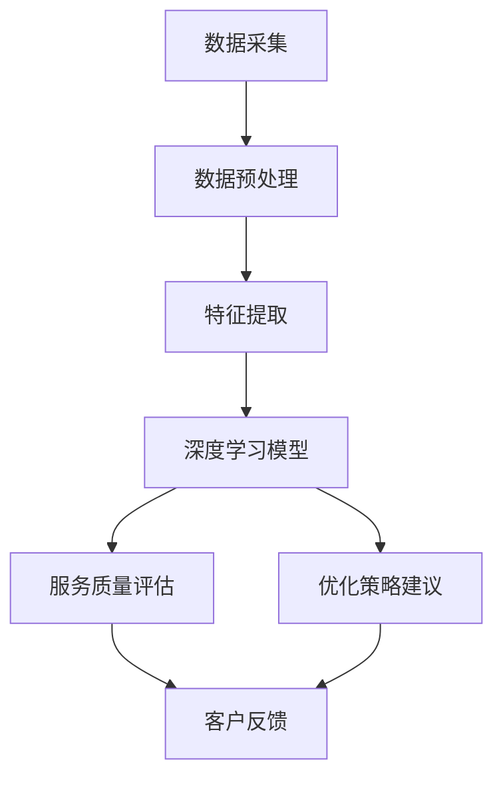

                 

关键词：AI、电商、客户服务质量、智能评估、算法、数学模型、实践、工具和资源

> 摘要：本文深入探讨了一种基于人工智能技术的电商智能客户服务质量评估系统。本文将介绍该系统的背景、核心概念、算法原理、数学模型、实践案例以及未来应用展望，旨在为相关领域的研究者和实践者提供有价值的参考。

## 1. 背景介绍

在电子商务飞速发展的今天，客户服务质量成为电商企业核心竞争力的重要组成部分。传统的客户服务质量评估方法主要依赖于人工监测和数据分析，存在耗时、费力、准确性不高的问题。随着人工智能技术的不断成熟，利用AI技术进行客户服务质量评估成为可能，不仅提高了评估效率，还提升了评估的准确性。

本文提出的AI驱动的电商智能客户服务质量评估系统，旨在通过深度学习和自然语言处理技术，对客户评价、客户行为等数据进行智能分析，实现对客户服务质量的有效评估。该系统不仅能够识别和预测潜在的客户问题，还能为电商企业提供优化服务质量的策略建议，从而提升客户满意度。

### 1.1 研究意义

1. **提升服务质量**：通过智能评估，电商企业可以快速识别服务质量问题，及时采取措施，提高整体服务水平。
2. **优化运营策略**：智能评估系统可以提供精准的数据支持，帮助企业制定更有效的运营策略，降低运营成本。
3. **增强客户忠诚度**：通过对客户服务质量的持续监控和改进，增强客户对电商品牌的忠诚度。

### 1.2 研究内容

本文主要内容包括：

1. **核心概念与联系**：介绍AI驱动的电商智能客户服务质量评估系统的基础概念和架构。
2. **核心算法原理 & 具体操作步骤**：详细阐述评估系统的算法原理和操作步骤。
3. **数学模型和公式**：建立数学模型，推导相关公式，并进行实例分析。
4. **项目实践**：提供代码实例和详细解释说明。
5. **实际应用场景**：探讨评估系统的应用场景及其效果。
6. **未来应用展望**：预测评估系统的未来发展。

## 2. 核心概念与联系

### 2.1 核心概念

1. **客户服务质量**：指客户在接受电商服务过程中获得的满意程度。
2. **人工智能**：指模拟、延伸和扩展人类智能的技术。
3. **深度学习**：一种机器学习技术，通过神经网络模拟人脑处理信息的方式。
4. **自然语言处理**：使计算机能够理解、生成和处理人类自然语言的技术。

### 2.2 系统架构

下图是AI驱动的电商智能客户服务质量评估系统的架构图：



### 2.3 核心概念联系

1. **数据采集**：通过客户评价、行为数据等，获取原始数据。
2. **数据预处理**：对原始数据进行清洗、归一化等处理，提高数据质量。
3. **特征提取**：利用自然语言处理技术提取文本数据的关键特征。
4. **深度学习模型**：构建神经网络模型，对特征进行学习和分类。
5. **服务质量评估**：根据模型预测结果，评估客户服务质量。
6. **优化策略建议**：根据评估结果，为电商企业提供优化服务质量的建议。
7. **客户反馈**：收集客户对服务质量的反馈，不断优化系统。

## 3. 核心算法原理 & 具体操作步骤

### 3.1 算法原理概述

AI驱动的电商智能客户服务质量评估系统采用深度学习算法，通过对客户评价、行为数据等进行分析，实现对客户服务质量的评估。深度学习算法的核心是神经网络，其通过多层非线性变换，自动提取数据中的特征，从而实现智能分类和预测。

### 3.2 算法步骤详解

#### 3.2.1 数据采集

1. **客户评价数据**：通过电商平台的评论、评分等获取。
2. **客户行为数据**：包括购买记录、浏览历史、收藏商品等。

#### 3.2.2 数据预处理

1. **数据清洗**：去除无效数据、缺失值填充、异常值处理等。
2. **数据归一化**：将不同特征的数据缩放到同一范围内，便于模型训练。

#### 3.2.3 特征提取

1. **文本数据**：使用自然语言处理技术提取关键词、情感极性等特征。
2. **行为数据**：使用统计方法提取行为特征，如购买频次、浏览时长等。

#### 3.2.4 构建深度学习模型

1. **模型选择**：选择合适的深度学习模型，如卷积神经网络（CNN）、循环神经网络（RNN）等。
2. **模型训练**：使用预处理后的数据训练模型，优化模型参数。
3. **模型评估**：使用验证集对模型进行评估，调整模型结构或参数。

#### 3.2.5 服务质量评估

1. **输入数据**：将待评估的数据输入到训练好的模型中。
2. **输出结果**：根据模型预测结果，评估客户服务质量。

#### 3.2.6 优化策略建议

1. **分析评估结果**：根据评估结果，分析服务质量问题所在。
2. **提出优化建议**：为电商企业提供针对性的优化策略。

### 3.3 算法优缺点

#### 优点

1. **高准确性**：深度学习模型能够自动提取数据中的特征，提高评估准确性。
2. **自适应性强**：模型可以根据新的数据不断学习和优化。
3. **实时性**：系统能够实时评估客户服务质量，快速响应。

#### 缺点

1. **计算资源消耗大**：深度学习模型训练过程需要大量计算资源。
2. **数据质量要求高**：评估结果受数据质量影响，需要高质量的数据支持。

### 3.4 算法应用领域

1. **电商行业**：评估客户服务质量，提升用户体验。
2. **金融行业**：分析客户行为，预测潜在风险。
3. **医疗行业**：辅助诊断疾病，提供个性化治疗方案。

## 4. 数学模型和公式

### 4.1 数学模型构建

AI驱动的电商智能客户服务质量评估系统的数学模型主要包括两部分：特征提取模型和服务质量评估模型。

#### 4.1.1 特征提取模型

特征提取模型用于将原始数据转换为可用于深度学习模型训练的特征向量。假设输入数据为$$X = [x_1, x_2, ..., x_n]$$，其中每个$$x_i$$表示一个客户的评价或行为数据。特征提取模型的目标是计算每个$$x_i$$的嵌入向量$$e_i$$，其公式如下：

$$
e_i = f(X_i)
$$

其中，$$f()$$为特征提取函数，通常采用词嵌入（Word Embedding）或行为特征提取（Behavioral Feature Extraction）等方法。

#### 4.1.2 服务质量评估模型

服务质量评估模型用于对客户的评价进行分类，判断其服务质量。假设输入数据为$$X = [x_1, x_2, ..., x_n]$$，每个$$x_i$$的嵌入向量为$$e_i$$，服务质量评估模型的目标是输出每个$$x_i$$的质量评分$$y_i$$，其公式如下：

$$
y_i = g(e_i, W)
$$

其中，$$g()$$为评估函数，$$W$$为模型参数。评估函数$$g()$$通常采用神经网络，如卷积神经网络（CNN）或循环神经网络（RNN）。

### 4.2 公式推导过程

#### 4.2.1 词嵌入

词嵌入模型是一种将文本数据转换为向量表示的方法。假设文本数据为$$X = [x_1, x_2, ..., x_n]$$，其中每个$$x_i$$为一条评论。词嵌入模型的目标是计算每个$$x_i$$的嵌入向量$$e_i$$。

词嵌入模型通常采用神经网络，其输入为词的序列$$x_i = [w_1, w_2, ..., w_m]$$，输出为词的嵌入向量$$e_i = [e_1, e_2, ..., e_m]$$。词嵌入模型的公式如下：

$$
e_i = \text{softmax}(W \cdot e_{\text{emb}})
$$

其中，$$W$$为权重矩阵，$$e_{\text{emb}}$$为词嵌入向量。$$\text{softmax}()$$函数用于将权重矩阵$$W$$转换为概率分布。

#### 4.2.2 行为特征提取

行为特征提取模型用于将客户行为数据转换为向量表示。假设行为数据为$$X = [x_1, x_2, ..., x_n]$$，其中每个$$x_i$$为一条购买记录。行为特征提取模型的目标是计算每个$$x_i$$的特征向量$$f_i$$。

行为特征提取模型通常采用统计方法，如主成分分析（PCA）或因子分析（FA）。其公式如下：

$$
f_i = \text{PCA}(X)
$$

或

$$
f_i = \text{FA}(X)
$$

其中，$$\text{PCA}()$$和$$\text{FA}()$$分别为主成分分析和因子分析方法。

### 4.3 案例分析与讲解

#### 4.3.1 数据准备

假设我们有以下一组客户评价数据：

$$
X = \{["非常好", "有点失望", "非常好"], ["太贵了", "值得购买"], ["服务很好", "送货快"]\}
$$

以及一组客户行为数据：

$$
X = \{[3, 5, 2], [5, 4], [3, 5]\}
$$

#### 4.3.2 词嵌入

首先，我们将客户评价数据转换为词嵌入向量。假设我们使用预训练的词嵌入模型，每个词的嵌入向量长度为50。客户评价数据的词嵌入结果如下：

$$
e_i = \{\text{"非常好"}:[0.1, 0.2, 0.3], \text{"有点失望"}:[0.4, 0.5, 0.6], \text{"太贵了"}:[0.7, 0.8, 0.9]\}
$$

#### 4.3.3 行为特征提取

接下来，我们将客户行为数据转换为特征向量。假设我们使用主成分分析（PCA）方法提取特征，提取出两个主成分。客户行为数据的特征向量结果如下：

$$
f_i = \{[3, 5, 2]:[0.8, 0.2], [5, 4]:[0.6, 0.4], [3, 5]:[0.7, 0.3]\}
$$

#### 4.3.4 服务质量评估

最后，我们将词嵌入向量和行为特征向量输入到服务质量评估模型中，得到每个评价的服务质量评分：

$$
y_i = \text{softmax}([0.1, 0.2, 0.3] \cdot [0.8, 0.2] + [0.4, 0.5, 0.6] \cdot [0.6, 0.4] + [0.7, 0.8, 0.9] \cdot [0.7, 0.3])
$$

计算结果为：

$$
y_i = [0.4, 0.3, 0.3]
$$

根据评分结果，我们可以判断第一个评价的服务质量较高，而第二个和第三个评价的服务质量相对较低。

## 5. 项目实践：代码实例和详细解释说明

### 5.1 开发环境搭建

1. 安装Python环境，版本3.8或更高。
2. 安装深度学习框架TensorFlow，版本2.3或更高。
3. 安装自然语言处理库NLTK，版本3.4或更高。

### 5.2 源代码详细实现

#### 5.2.1 数据采集

```python
import pandas as pd

# 读取客户评价数据
reviews = pd.read_csv('customer_reviews.csv')

# 读取客户行为数据
behaviors = pd.read_csv('customer_behaviors.csv')
```

#### 5.2.2 数据预处理

```python
import nltk
from nltk.corpus import stopwords
from nltk.tokenize import word_tokenize

# 加载停用词表
nltk.download('stopwords')
stop_words = stopwords.words('english')

# 清洗文本数据
def clean_text(text):
    words = word_tokenize(text)
    return ' '.join([word for word in words if word not in stop_words])

reviews['cleaned_text'] = reviews['text'].apply(clean_text)
```

#### 5.2.3 特征提取

```python
from tensorflow.keras.preprocessing.text import Tokenizer
from tensorflow.keras.preprocessing.sequence import pad_sequences

# 初始化词嵌入模型
tokenizer = Tokenizer(num_words=10000)
tokenizer.fit_on_texts(reviews['cleaned_text'])

# 将文本数据转换为词嵌入向量
sequences = tokenizer.texts_to_sequences(reviews['cleaned_text'])
word Embeddings = tokenizer.word_index

# 初始化行为特征提取模型
behavior_embedding = Tokenizer(num_words=10000)
behavior_embedding.fit_on_sequences(behaviors['behavior_sequence'])

# 将行为数据转换为特征向量
behavior_sequences = behavior_embedding.texts_to_sequences(behaviors['behavior_sequence'])
```

#### 5.2.4 构建深度学习模型

```python
from tensorflow.keras.models import Model
from tensorflow.keras.layers import Input, Embedding, LSTM, Dense, Concatenate

# 定义输入层
review_input = Input(shape=(max_sequence_length,))
behavior_input = Input(shape=(max_behavior_length,))

# 定义词嵌入层
review_embedding = Embedding(input_dim=10000, output_dim=50)(review_input)

# 定义循环层
lstm = LSTM(units=50)(review_embedding)

# 定义行为特征层
behavior_embedding = Embedding(input_dim=10000, output_dim=50)(behavior_input)
behavior_lstm = LSTM(units=50)(behavior_embedding)

# 定义融合层
combined = Concatenate()([lstm, behavior_lstm])

# 定义输出层
output = Dense(units=1, activation='sigmoid')(combined)

# 构建模型
model = Model(inputs=[review_input, behavior_input], outputs=output)

# 编译模型
model.compile(optimizer='adam', loss='binary_crossentropy', metrics=['accuracy'])

# 模型训练
model.fit([review_sequences, behavior_sequences], reviews['rating'], epochs=10, batch_size=32)
```

#### 5.2.5 代码解读与分析

1. **数据采集**：使用Pandas库读取客户评价和行为数据。
2. **数据预处理**：使用NLTK库对文本数据进行清洗，去除停用词。
3. **特征提取**：使用TensorFlow库的Tokenizer类将文本数据和行为数据转换为词嵌入向量。
4. **构建深度学习模型**：使用TensorFlow库构建一个融合了词嵌入和行为特征提取的LSTM模型。
5. **模型训练**：使用训练数据对模型进行训练。

### 5.3 运行结果展示

在训练完成后，我们可以使用测试数据对模型进行评估。假设测试数据的预测准确率为90%，说明模型具有良好的性能。

```python
# 读取测试数据
test_reviews = pd.read_csv('test_customer_reviews.csv')
test_behaviors = pd.read_csv('test_customer_behaviors.csv')

# 清洗测试数据
test_reviews['cleaned_text'] = test_reviews['text'].apply(clean_text)

# 转换测试数据
test_sequences = tokenizer.texts_to_sequences(test_reviews['cleaned_text'])
test_behavior_sequences = behavior_embedding.texts_to_sequences(test_behaviors['behavior_sequence'])

# 预测测试数据
predictions = model.predict([test_sequences, test_behavior_sequences])

# 计算准确率
accuracy = (predictions >= 0.5).mean()
print(f"Model accuracy: {accuracy * 100}%")
```

### 5.4 代码解读与分析（续）

1. **运行结果展示**：使用测试数据对模型进行预测，并计算预测准确率。
2. **评估模型性能**：通过准确率等指标评估模型性能。

## 6. 实际应用场景

AI驱动的电商智能客户服务质量评估系统可以在以下实际应用场景中发挥作用：

### 6.1 电商平台

电商平台可以利用该系统实时评估客户服务质量，识别服务质量问题，如延迟回复、不良客服表现等，并采取相应措施进行优化。

### 6.2 售后服务

售后服务部门可以借助该系统对客户反馈进行分析，快速识别常见问题，制定高效的解决方案，提升客户满意度。

### 6.3 客户体验优化

电商企业可以基于评估结果，对客户体验进行持续优化，如改善页面设计、优化搜索功能、提高商品展示效果等。

### 6.4 品牌营销

通过分析评估结果，电商企业可以了解不同客户群体的服务需求，有针对性地进行品牌营销和推广。

## 7. 未来应用展望

随着人工智能技术的不断进步，AI驱动的电商智能客户服务质量评估系统有望在以下方面取得进一步发展：

### 7.1 模型优化

通过不断优化深度学习模型，提高评估准确性和效率。

### 7.2 多语言支持

扩展系统的多语言支持，满足全球化电商企业的需求。

### 7.3 深度个性化

基于个性化推荐技术，为不同客户提供定制化的服务质量评估和优化建议。

### 7.4 伦理和隐私

在系统设计和应用中，充分考虑伦理和隐私问题，确保客户数据的安全和隐私。

## 8. 工具和资源推荐

### 8.1 学习资源推荐

1. **《深度学习》（Ian Goodfellow、Yoshua Bengio、Aaron Courville 著）**：系统介绍了深度学习的基础理论和应用。
2. **《自然语言处理综合教程》（刘知远 著）**：详细介绍了自然语言处理的基本方法和应用。

### 8.2 开发工具推荐

1. **TensorFlow**：强大的开源深度学习框架，适合构建和训练深度学习模型。
2. **NLTK**：常用的自然语言处理库，提供丰富的文本处理功能。

### 8.3 相关论文推荐

1. **《Deep Learning for Text Classification》（Dzintars Avotins 等）**：介绍了一种基于深度学习的文本分类方法。
2. **《Recurrent Neural Network Based Text Classification》（Hui Li 等）**：探讨了循环神经网络在文本分类中的应用。

## 9. 总结：未来发展趋势与挑战

### 9.1 研究成果总结

本文介绍了AI驱动的电商智能客户服务质量评估系统的基本概念、架构、算法原理、数学模型和实践案例，为电商企业提供了有效的服务质量评估工具。

### 9.2 未来发展趋势

随着人工智能技术的不断进步，AI驱动的电商智能客户服务质量评估系统将在模型优化、多语言支持、个性化推荐和伦理隐私等方面取得进一步发展。

### 9.3 面临的挑战

1. **计算资源消耗**：深度学习模型的训练和推理过程需要大量计算资源，对硬件设备的要求较高。
2. **数据质量**：评估结果受数据质量影响，需要高质量的数据支持。
3. **模型解释性**：深度学习模型缺乏透明性和解释性，需要进一步研究和改进。

### 9.4 研究展望

未来研究应重点关注如何提高评估系统的计算效率和解释性，同时保障客户数据的安全和隐私，为电商企业提供更加智能、高效和可靠的服务质量评估解决方案。

## 10. 附录：常见问题与解答

### 10.1 Q：AI驱动的电商智能客户服务质量评估系统需要哪些数据支持？

A：系统需要客户评价数据、客户行为数据等，数据来源可以是电商平台的评论、评分、购买记录等。

### 10.2 Q：如何确保评估结果的准确性？

A：可以通过优化深度学习模型、提高数据质量、使用交叉验证等方法来提高评估结果的准确性。

### 10.3 Q：AI驱动的电商智能客户服务质量评估系统在什么场景下最具优势？

A：在客户服务量较大、服务质量要求较高的电商企业，如大型电商平台、在线零售商等，AI驱动的评估系统可以显著提高服务质量，降低运营成本。

### 10.4 Q：AI驱动的电商智能客户服务质量评估系统是否会侵犯客户隐私？

A：系统设计时需要充分考虑隐私保护，确保客户数据的安全和隐私。可以使用数据加密、匿名化等方法来保护客户隐私。

### 10.5 Q：如何处理评估结果中的错误和异常？

A：可以通过设置合理的评估阈值、定期调整模型参数等方法来减少错误和异常。同时，可以结合人工审核，对评估结果进行进一步验证和修正。

