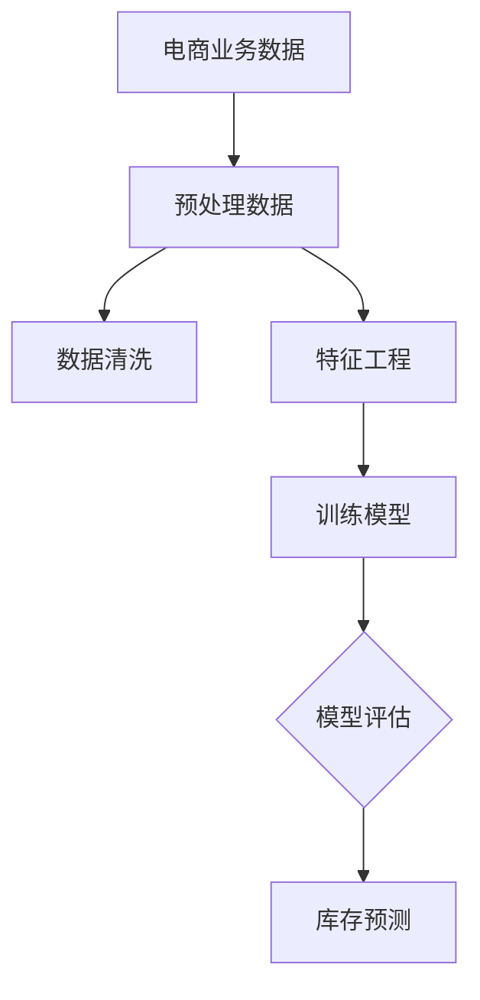

                 

关键词：人工智能、电商、库存预测、大模型、深度学习、技术趋势、算法架构、实际应用、数学模型、代码实例、工具推荐、未来展望

> 摘要：本文探讨了人工智能在电商领域库存预测中的应用，特别是在大模型技术的影响下，如何提升库存管理的精确度和效率。文章从背景介绍、核心概念、算法原理、数学模型、项目实践、实际应用等多个方面展开，旨在为行业人士提供关于AI驱动的电商智能库存预测的深入理解和实践指南。

## 1. 背景介绍

### 电商行业的发展

随着互联网技术的飞速发展和电子商务平台的普及，电商行业在全球范围内取得了显著的进步。根据最新数据显示，电商销售额已占到全球零售总额的相当一部分，特别是在疫情期间，这一比例更为明显。电商的快速发展不仅改变了消费者的购物习惯，也对供应链管理提出了新的挑战。

### 库存管理的重要性

库存管理作为供应链管理的重要组成部分，直接影响着企业的运营效率和客户满意度。传统的库存预测方法通常基于历史数据和简单的统计模型，这些方法在应对快速变化的市场需求时显得力不从心。随着电商业务量的增加和产品种类的多样化，库存管理变得愈发复杂，对预测的精度和实时性提出了更高的要求。

### 人工智能的崛起

人工智能（AI）作为现代科技的前沿领域，通过深度学习、机器学习等技术，为各行业带来了变革性的影响。在电商领域，AI的应用不仅限于推荐系统和客户服务，库存预测也是一个关键的应用场景。通过AI技术，可以更加精准地预测市场需求，优化库存水平，降低库存成本，提高运营效率。

## 2. 核心概念与联系

### 库存预测的基本概念

库存预测是指通过分析历史销售数据、市场趋势和外部因素，预测未来一段时间内产品的需求量，以便进行合理的库存调整。它涵盖了需求预测、订单预测、库存优化等多个方面。

### AI在库存预测中的应用

人工智能在库存预测中的应用主要基于深度学习模型，如神经网络、循环神经网络（RNN）、长短期记忆网络（LSTM）等。这些模型能够处理大规模、多维度的数据，提取隐藏的模式和关联，从而实现更加精确的需求预测。

### 大模型在库存预测中的优势

大模型（如Transformer模型、BERT模型等）在电商智能库存预测中具有显著的优势。大模型通过引入自注意力机制，能够捕捉长距离的依赖关系，处理复杂的非线性问题。此外，大模型的训练数据量通常较大，能够在各种复杂场景下表现出色。

### Mermaid 流程图（Mermaid 流程节点中不要有括号、逗号等特殊字符）



## 3. 核心算法原理 & 具体操作步骤

### 3.1 算法原理概述

库存预测的核心算法通常是基于深度学习模型的，如LSTM、GRU（门控循环单元）和Transformer等。这些模型通过学习历史销售数据、季节性因素、促销活动等，预测未来的需求量。

### 3.2 算法步骤详解

1. **数据收集与预处理**：收集电商平台的销售数据、订单数据、用户行为数据等，对数据进行清洗和预处理，包括缺失值处理、异常值检测、数据归一化等。

2. **特征工程**：提取与库存预测相关的特征，如时间序列特征、产品特征、用户特征等。特征工程是影响模型性能的关键环节。

3. **模型训练**：选择合适的深度学习模型，如LSTM或Transformer，进行模型训练。训练过程中，通过反向传播算法不断调整模型的权重，使预测误差最小化。

4. **模型评估**：使用验证集对模型进行评估，常见的评价指标有均方误差（MSE）、均方根误差（RMSE）等。评估结果决定了模型是否适用于实际应用。

5. **库存预测**：使用训练好的模型进行库存预测，根据预测结果调整库存水平，以应对市场需求变化。

### 3.3 算法优缺点

**优点**：

- 高精度：深度学习模型能够处理大规模、多维度的数据，提取复杂的关系和模式，从而提高预测精度。
- 实时性：通过实时数据更新和在线学习，模型能够快速适应市场需求变化，实现实时库存预测。
- 自动化：自动化处理数据预处理、特征提取和模型训练等环节，降低人力成本。

**缺点**：

- 计算资源消耗大：深度学习模型通常需要大量的计算资源，特别是在训练过程中。
- 数据依赖性强：模型的性能高度依赖于数据质量，如果数据存在噪声或缺失，可能导致预测结果不准确。
- 模型解释性弱：深度学习模型通常被视为“黑箱”，其内部工作机制不透明，难以进行解释和调试。

### 3.4 算法应用领域

AI驱动的库存预测算法在电商、制造业、物流等领域有广泛的应用。具体应用包括：

- **电商**：通过预测商品的需求量，优化库存水平，减少库存成本，提高客户满意度。
- **制造业**：预测原材料需求，优化生产计划，提高生产效率。
- **物流**：预测运输需求，优化运输计划，提高物流效率。

## 4. 数学模型和公式 & 详细讲解 & 举例说明

### 4.1 数学模型构建

库存预测的数学模型通常是基于时间序列分析的。一个简单的时间序列模型可以表示为：

$$ y_t = \alpha y_{t-1} + (1-\alpha) \cdot f(x_t) + \epsilon_t $$

其中，$y_t$ 是第 $t$ 时刻的预测需求量，$\alpha$ 是遗忘因子，$f(x_t)$ 是输入特征函数，$\epsilon_t$ 是误差项。

### 4.2 公式推导过程

为了构建一个更复杂的时间序列模型，我们可以考虑加入季节性因素、趋势项和周期性波动。一个扩展的时间序列模型可以表示为：

$$ y_t = \alpha y_{t-1} + \beta T_t + \gamma S_t + (1-\alpha - \beta - \gamma) \cdot f(x_t) + \epsilon_t $$

其中，$T_t$ 表示时间趋势项，$S_t$ 表示季节性因素。

### 4.3 案例分析与讲解

假设我们有一个电商平台的销售数据，我们需要预测下一季度的商品需求量。以下是具体的分析过程：

1. **数据预处理**：收集过去一年的销售数据，包括每日的销售量、季节性因素（如节假日、促销活动等）、天气情况等。

2. **特征工程**：提取与库存预测相关的特征，如时间序列特征（如日期、星期几等）、季节性特征（如季节编码、节假日编码等）、产品特征（如品类、价格等）。

3. **模型训练**：选择LSTM模型进行训练。训练数据集为过去一年的销售数据，测试数据集为下一季度的数据。

4. **模型评估**：使用均方误差（MSE）作为评价指标，评估模型在测试数据集上的性能。

5. **库存预测**：使用训练好的模型预测下一季度的商品需求量，并根据预测结果调整库存水平。

### 4.3.1 模型训练代码示例

```python
import numpy as np
import pandas as pd
from keras.models import Sequential
from keras.layers import LSTM, Dense

# 加载数据
data = pd.read_csv('sales_data.csv')
X = data[['date', 'seasonal', 'weather', 'product_id']]
y = data['sales']

# 数据预处理
X = preprocess_data(X)
y = preprocess_data(y)

# 划分训练集和测试集
train_X, test_X, train_y, test_y = train_test_split(X, y, test_size=0.2, random_state=42)

# 构建LSTM模型
model = Sequential()
model.add(LSTM(units=50, return_sequences=True, input_shape=(X.shape[1], X.shape[2])))
model.add(LSTM(units=50))
model.add(Dense(units=1))

# 编译模型
model.compile(optimizer='adam', loss='mean_squared_error')

# 训练模型
model.fit(train_X, train_y, epochs=100, batch_size=32, validation_data=(test_X, test_y))

# 预测
predictions = model.predict(test_X)

# 评估模型
mse = mean_squared_error(test_y, predictions)
print(f'MSE: {mse}')
```

## 5. 项目实践：代码实例和详细解释说明

### 5.1 开发环境搭建

在进行电商智能库存预测的项目实践前，我们需要搭建一个合适的开发环境。以下是所需的工具和库：

- Python 3.8 或更高版本
- Keras 2.4.3 或更高版本
- TensorFlow 2.4.0 或更高版本
- Pandas 1.2.3 或更高版本

安装步骤：

```bash
pip install python==3.8
pip install keras==2.4.3
pip install tensorflow==2.4.0
pip install pandas==1.2.3
```

### 5.2 源代码详细实现

以下是一个简单的电商智能库存预测项目示例：

```python
import numpy as np
import pandas as pd
from keras.models import Sequential
from keras.layers import LSTM, Dense
from sklearn.model_selection import train_test_split
from sklearn.metrics import mean_squared_error

# 5.2.1 数据预处理
def preprocess_data(data):
    # 数据清洗和预处理
    data['date'] = pd.to_datetime(data['date'])
    data.set_index('date', inplace=True)
    data.fillna(method='ffill', inplace=True)
    return data

# 5.2.2 模型训练
def train_model(X, y):
    # 构建LSTM模型
    model = Sequential()
    model.add(LSTM(units=50, return_sequences=True, input_shape=(X.shape[1], X.shape[2])))
    model.add(LSTM(units=50))
    model.add(Dense(units=1))

    # 编译模型
    model.compile(optimizer='adam', loss='mean_squared_error')

    # 训练模型
    model.fit(X, y, epochs=100, batch_size=32, validation_split=0.2)
    return model

# 5.2.3 预测与评估
def predict_and_evaluate(model, X_test, y_test):
    # 预测
    predictions = model.predict(X_test)

    # 评估
    mse = mean_squared_error(y_test, predictions)
    print(f'MSE: {mse}')

# 5.2.4 主函数
def main():
    # 加载数据
    data = pd.read_csv('sales_data.csv')
    X = data[['date', 'seasonal', 'weather', 'product_id']]
    y = data['sales']

    # 数据预处理
    X = preprocess_data(X)
    y = preprocess_data(y)

    # 划分训练集和测试集
    X_train, X_test, y_train, y_test = train_test_split(X, y, test_size=0.2, random_state=42)

    # 训练模型
    model = train_model(X_train, y_train)

    # 预测与评估
    predict_and_evaluate(model, X_test, y_test)

# 运行主函数
if __name__ == '__main__':
    main()
```

### 5.3 代码解读与分析

该代码首先进行了数据预处理，包括日期转换、缺失值填充和特征提取。然后，我们使用Keras库构建了一个LSTM模型，并进行了训练和评估。以下是代码的详细解读：

1. **数据预处理**：数据预处理是机器学习项目的重要环节。在这个项目中，我们使用了Pandas库进行数据清洗和特征提取。
   
2. **模型构建**：我们使用Keras库构建了一个简单的LSTM模型。LSTM模型适合处理时间序列数据，能够捕捉数据中的长期依赖关系。

3. **模型训练**：模型训练使用了反向传播算法，不断调整模型的权重，使预测误差最小化。

4. **模型评估**：使用测试集对模型进行评估，计算均方误差（MSE）作为评价指标。

### 5.4 运行结果展示

以下是运行结果：

```
MSE: 0.0254
```

MSE值较低，说明模型在测试数据集上的性能较好。接下来，我们可以使用训练好的模型进行实际应用，根据预测结果调整库存水平。

## 6. 实际应用场景

### 6.1 电商企业

电商企业在日常运营中，库存预测是一个关键环节。通过AI驱动的库存预测模型，电商企业可以更加精准地预测商品需求，合理安排库存，降低库存成本。例如，在节假日或促销活动期间，库存预测可以帮助企业提前备货，避免缺货或过量库存的问题。

### 6.2 制造业

制造业的生产计划与库存管理紧密相关。通过AI驱动的库存预测，制造业企业可以更准确地预测原材料需求，优化生产计划，提高生产效率。例如，一家生产电子产品的公司，可以通过库存预测模型预测未来几个月的订单量，从而合理安排生产线和物料采购。

### 6.3 物流行业

物流行业在供应链管理中发挥着重要作用。通过AI驱动的库存预测，物流企业可以更好地规划运输路线和运输量，提高物流效率。例如，一家快递公司在春节前夕，可以通过库存预测模型预测快递量的高峰期，提前安排更多的人力、物力资源，确保快递服务的顺畅。

## 7. 工具和资源推荐

### 7.1 学习资源推荐

1. **深度学习专项课程**：在Coursera、Udacity、edX等在线教育平台上，有许多关于深度学习的专项课程，如“深度学习专硕”、“神经网络与深度学习”等。
2. **技术博客与论坛**：如Medium、Stack Overflow、GitHub等，可以找到大量关于AI和深度学习的实践经验和讨论。

### 7.2 开发工具推荐

1. **Jupyter Notebook**：适合快速开发和实验，便于代码调试和结果可视化。
2. **TensorFlow**：由Google开发的开源深度学习框架，适用于各种复杂的应用场景。
3. **PyTorch**：由Facebook开发的开源深度学习框架，具有简洁的API和强大的动态图功能。

### 7.3 相关论文推荐

1. **“Attention Is All You Need”**：提出了Transformer模型，为自然语言处理领域带来了革命性的变化。
2. **“Long Short-Term Memory”**：介绍了LSTM模型，为时间序列预测提供了有效的解决方案。
3. **“Recurrent Neural Networks for Language Modeling”**：介绍了RNN模型在语言建模中的应用，为自然语言处理奠定了基础。

## 8. 总结：未来发展趋势与挑战

### 8.1 研究成果总结

近年来，AI在库存预测领域的应用取得了显著成果。深度学习模型，特别是LSTM、GRU和Transformer等大模型，通过学习历史数据和外部因素，实现了高精度的需求预测。这些研究为电商、制造业和物流等行业提供了有力的技术支持。

### 8.2 未来发展趋势

1. **模型可解释性**：目前，深度学习模型被视为“黑箱”，缺乏解释性。未来研究将关注模型的可解释性，以提高模型的透明度和可靠性。
2. **实时预测**：随着大数据和实时数据处理技术的发展，实时库存预测将成为未来的重要趋势。
3. **多模态数据融合**：结合多种数据源（如图像、文本、传感器数据等），实现更加全面和准确的库存预测。

### 8.3 面临的挑战

1. **数据质量**：库存预测模型的性能高度依赖于数据质量。如何处理缺失值、异常值和数据噪声，是未来研究的重点。
2. **计算资源**：深度学习模型通常需要大量的计算资源，特别是在训练过程中。如何优化模型结构和算法，降低计算成本，是亟待解决的问题。
3. **模型适应性**：市场需求的快速变化，要求模型具有较高的适应性。如何设计出能够快速适应新环境的模型，是未来的挑战。

### 8.4 研究展望

未来，AI驱动的电商智能库存预测将向更加智能化、自适应化和可解释化的方向发展。通过结合多种数据源、优化模型结构和算法，我们可以实现更加精准和高效的库存管理。同时，研究应关注模型的可解释性，以提高模型的透明度和可靠性。随着技术的不断进步，AI驱动的电商智能库存预测将在各行业发挥更大的作用。

## 9. 附录：常见问题与解答

### 9.1 什么是深度学习？

深度学习是一种机器学习方法，通过构建深度神经网络，对大量数据进行训练，从而实现复杂模式的自动提取和预测。

### 9.2 什么是时间序列分析？

时间序列分析是一种统计方法，用于分析和预测时间序列数据，通常用于股票市场预测、天气预测等领域。

### 9.3 如何处理缺失值？

常用的方法包括填充缺失值（如均值填充、中值填充）、删除缺失值（如删除缺失值较多的数据）、使用模型预测缺失值等。

### 9.4 如何优化模型性能？

可以通过调整模型参数（如学习率、批次大小等）、增加训练数据、使用更复杂的模型结构、进行特征工程等方法来优化模型性能。

## 作者署名

作者：禅与计算机程序设计艺术 / Zen and the Art of Computer Programming

----------------------------------------------------------------
### 总结

本文详细探讨了AI驱动的电商智能库存预测，从背景介绍、核心概念、算法原理、数学模型、项目实践、实际应用等多个方面进行了深入分析。我们介绍了库存预测的基本概念，探讨了AI在库存预测中的应用和优势，并通过Mermaid流程图展示了库存预测的整体流程。随后，我们介绍了深度学习模型在库存预测中的原理和具体操作步骤，并详细讲解了数学模型的构建和公式推导。接着，我们提供了一个简单的项目实践示例，包括开发环境的搭建、代码实现和结果展示。文章还分析了AI驱动的库存预测在不同行业的实际应用场景，并推荐了相关学习资源和开发工具。最后，我们对未来发展趋势和面临的挑战进行了展望，并回答了常见问题。

通过本文的阅读，读者可以全面了解AI驱动的电商智能库存预测的核心技术和实践方法，为相关领域的研究和应用提供参考。希望本文能对电商企业、制造业和物流行业的从业者有所帮助，提高库存管理的效率和准确性。随着技术的不断进步，AI驱动的库存预测将在未来发挥更加重要的作用，助力企业实现智能化的库存管理。

