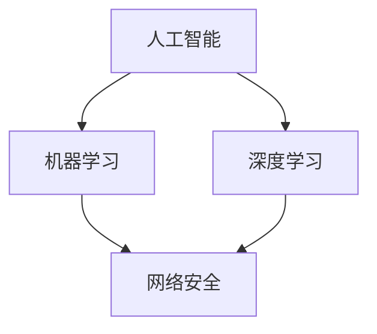

                 

关键词：AI、网络安全、威胁检测、防御、人工智能、深度学习、机器学习、网络安全架构

> 摘要：随着数字化转型的加速，网络安全问题日益严峻。人工智能（AI）技术在威胁检测与防御领域展现出巨大潜力。本文深入探讨AI在网络安全中的应用，解析其核心概念、算法原理、数学模型及实际案例，旨在为网络安全专业人士和研究人员提供有价值的参考。

## 1. 背景介绍

在当今这个数字化时代，网络安全已经成为企业和组织面临的重大挑战。网络攻击的形式和手段层出不穷，传统的安全防护手段已经难以应对复杂的威胁环境。近年来，人工智能（AI）技术的飞速发展为网络安全带来了新的希望。AI通过机器学习和深度学习等技术，能够实时监测网络流量、识别异常行为、预测潜在威胁，从而实现高效的威胁检测与防御。

本文将重点探讨AI在网络安全中的应用，分析其核心概念、算法原理、数学模型和实际案例，帮助读者了解AI如何助力网络安全，并为未来的研究和实践提供启示。

## 2. 核心概念与联系

在探讨AI驱动的网络安全之前，我们需要了解一些核心概念和它们之间的联系。

### 2.1 人工智能（AI）

人工智能是一种模拟人类智能的技术，通过机器学习和深度学习等方法，让计算机具备自主学习和决策能力。

### 2.2 机器学习（ML）

机器学习是人工智能的一个重要分支，通过算法让计算机从数据中学习规律，进行预测和分类。

### 2.3 深度学习（DL）

深度学习是机器学习的一个子领域，通过构建复杂的神经网络模型，对大规模数据进行自动特征提取和模式识别。

### 2.4 网络安全（Cybersecurity）

网络安全是指保护网络、系统和数据免受未经授权的访问、攻击和破坏的措施和技术。

### 2.5 威胁检测与防御

威胁检测与防御是网络安全的核心任务，通过监测网络流量、识别异常行为和攻击，采取相应的防御措施，保护网络安全。

下面是一个简单的 Mermaid 流程图，展示了这些核心概念之间的联系：



## 3. 核心算法原理 & 具体操作步骤

### 3.1 算法原理概述

在AI驱动的网络安全中，常见的算法原理包括异常检测、入侵检测和恶意代码检测等。这些算法通过以下步骤实现：

1. 数据收集：从网络流量、系统日志等数据源收集数据。
2. 数据预处理：对数据进行清洗、去噪、归一化等处理。
3. 特征提取：从原始数据中提取具有区分度的特征。
4. 模型训练：利用机器学习和深度学习算法对特征进行训练，建立威胁检测模型。
5. 模型评估：对模型进行评估，调整参数，优化模型性能。
6. 模型部署：将训练好的模型部署到生产环境中，进行实时监测和威胁防御。

### 3.2 算法步骤详解

#### 3.2.1 数据收集

数据收集是AI驱动的网络安全的基础。常用的数据源包括网络流量、系统日志、用户行为数据等。为了提高数据质量，我们需要对数据进行去噪、清洗等预处理。

#### 3.2.2 数据预处理

数据预处理包括以下步骤：

1. 数据清洗：删除缺失值、重复值等无效数据。
2. 数据去噪：消除噪声数据，如网络流量中的随机波动。
3. 数据归一化：将不同尺度的数据进行归一化处理，使其具有可比性。

#### 3.2.3 特征提取

特征提取是关键步骤，从原始数据中提取具有区分度的特征。常见的特征提取方法包括：

1. 统计特征：如平均值、方差、熵等。
2. 频率特征：如频率分布、峰值频率等。
3. 熵特征：如信息熵、条件熵等。
4. 时间序列特征：如自相关系数、偏自相关函数等。

#### 3.2.4 模型训练

模型训练是利用机器学习和深度学习算法对特征进行训练，建立威胁检测模型。常见的算法包括：

1. 决策树：通过分裂特征空间，构建分类模型。
2. 支持向量机：通过最大化分类间隔，构建分类模型。
3. 集成学习：通过组合多个基础模型，提高分类准确率。
4. 深度神经网络：通过多层神经网络，自动提取特征并构建分类模型。

#### 3.2.5 模型评估

模型评估是验证模型性能的重要步骤。常用的评估指标包括：

1. 准确率：正确分类的样本数占总样本数的比例。
2. 精确率：正确分类为正类的样本数与所有被分类为正类的样本数的比例。
3. 召回率：正确分类为正类的样本数与实际为正类的样本数的比例。
4. F1 值：精确率和召回率的加权平均。

#### 3.2.6 模型部署

模型部署是将训练好的模型部署到生产环境中，进行实时监测和威胁防御。常见的部署方式包括：

1. 实时监测：通过流式数据处理，实时监测网络流量和系统日志。
2. 腹部处理：通过批量数据处理，对历史数据进行威胁检测。
3. 集群部署：通过分布式计算，提高处理速度和性能。

### 3.3 算法优缺点

每种算法都有其优缺点，我们需要根据具体场景和需求选择合适的算法。

#### 3.3.1 优点

1. 异常检测算法：能够自动识别异常行为，提高威胁检测的准确性。
2. 入侵检测算法：能够实时监测网络流量，发现潜在攻击。
3. 恶意代码检测算法：能够识别恶意软件，防止恶意攻击。
4. 深度学习算法：能够自动提取特征，提高分类性能。

#### 3.3.2 缺点

1. 数据依赖性：算法性能高度依赖数据质量，需要大量高质量数据。
2. 模型复杂度：深度学习算法模型复杂度高，训练和部署成本高。
3. 模型泛化能力：算法泛化能力有限，可能对新攻击形式和手段难以识别。

### 3.4 算法应用领域

AI驱动的网络安全算法广泛应用于以下领域：

1. 金融行业：通过异常检测和入侵检测，保障金融交易安全。
2. 政府部门：通过威胁检测和防御，保护国家网络安全。
3. 互联网公司：通过恶意代码检测和入侵检测，保障用户数据安全。
4. 企业内部网络：通过威胁检测和防御，防止内部数据泄露和攻击。

## 4. 数学模型和公式 & 详细讲解 & 举例说明

在AI驱动的网络安全中，数学模型和公式扮演着至关重要的角色。以下将介绍几种常用的数学模型和公式，并进行详细讲解和举例说明。

### 4.1 数学模型构建

#### 4.1.1 支持向量机（SVM）

支持向量机是一种二分类模型，通过最大化分类间隔，找到最佳分离超平面。其数学模型可以表示为：

$$
\min_{w,b}\frac{1}{2}||w||^2 \\
s.t. y_i(w\cdot x_i + b) \geq 1
$$

其中，$w$ 为权重向量，$b$ 为偏置项，$x_i$ 为特征向量，$y_i$ 为标签。

#### 4.1.2 深度学习（DL）

深度学习是一种多层神经网络模型，通过自动提取特征，实现复杂的非线性分类和回归任务。其数学模型可以表示为：

$$
y = \sigma(\sum_{j=1}^{n}w_{ji}x_{j} + b)
$$

其中，$y$ 为输出，$\sigma$ 为激活函数，$w_{ji}$ 为权重，$x_{j}$ 为输入特征，$b$ 为偏置项。

### 4.2 公式推导过程

#### 4.2.1 支持向量机（SVM）

支持向量机的推导过程涉及拉格朗日乘数法和KKT条件。具体推导过程如下：

1. 引入拉格朗日函数：

$$
L(w,b,\alpha) = \frac{1}{2}||w||^2 - \sum_{i=1}^{n}\alpha_i(y_i(w\cdot x_i + b) - 1)
$$

其中，$\alpha_i$ 为拉格朗日乘子。

2. 求导并令导数为零：

$$
\frac{\partial L}{\partial w} = w - \sum_{i=1}^{n}\alpha_iy_ix_i = 0 \\
\frac{\partial L}{\partial b} = -\sum_{i=1}^{n}\alpha_iy_i = 0 \\
\frac{\partial L}{\partial \alpha_i} = y_i(w\cdot x_i + b) - 1 \leq 0 \\
\alpha_i \geq 0
$$

3. 利用KKT条件求解：

$$
w = \sum_{i=1}^{n}\alpha_iy_ix_i \\
b = \frac{1}{n}\sum_{i=1}^{n}\alpha_iy_i - \sum_{i=1}^{n}\alpha_iy_ix_i
$$

#### 4.2.2 深度学习（DL）

深度学习的推导过程涉及反向传播算法。具体推导过程如下：

1. 定义损失函数：

$$
J = \frac{1}{2}\sum_{i=1}^{n}(y_i - \sigma(\sum_{j=1}^{n}w_{ji}x_{j} + b))^2
$$

2. 计算梯度：

$$
\frac{\partial J}{\partial w_{ji}} = (y_i - \sigma(\sum_{j=1}^{n}w_{ji}x_{j} + b))x_j \\
\frac{\partial J}{\partial b} = (y_i - \sigma(\sum_{j=1}^{n}w_{ji}x_{j} + b))
$$

3. 更新参数：

$$
w_{ji} := w_{ji} - \alpha\frac{\partial J}{\partial w_{ji}} \\
b := b - \alpha\frac{\partial J}{\partial b}
$$

### 4.3 案例分析与讲解

#### 4.3.1 支持向量机（SVM）

假设我们有一个二分类问题，数据集包含正类和负类，每个数据点由两个特征组成。我们使用SVM进行分类，求解最佳分离超平面。

1. 数据集：

$$
X = \begin{bmatrix}
x_1 & x_2 \\
x_3 & x_4 \\
\vdots & \vdots \\
x_n & x_n
\end{bmatrix}, Y = \begin{bmatrix}
1 \\
-1 \\
\vdots \\
-1
\end{bmatrix}
$$

2. 初始参数：

$$
w = \begin{bmatrix}
0 \\
0
\end{bmatrix}, b = 0
$$

3. 求解过程：

- 拉格朗日乘子法：
  - 求解拉格朗日函数：
    $$
    L(w,b,\alpha) = \frac{1}{2}||w||^2 - \sum_{i=1}^{n}\alpha_i(y_i(w\cdot x_i + b) - 1)
    $$
  - 求导并令导数为零：
    $$
    \frac{\partial L}{\partial w} = w - \sum_{i=1}^{n}\alpha_iy_ix_i = 0 \\
    \frac{\partial L}{\partial b} = -\sum_{i=1}^{n}\alpha_iy_i = 0 \\
    \frac{\partial L}{\partial \alpha_i} = y_i(w\cdot x_i + b) - 1 \leq 0 \\
    \alpha_i \geq 0
    $$
  - 利用KKT条件求解：
    $$
    w = \sum_{i=1}^{n}\alpha_iy_ix_i \\
    b = \frac{1}{n}\sum_{i=1}^{n}\alpha_iy_i - \sum_{i=1}^{n}\alpha_iy_ix_i
    $$

- 更新参数：
  $$
  w = \begin{bmatrix}
  \alpha_1x_{1,1} + \alpha_2x_{2,1} \\
  \alpha_1x_{1,2} + \alpha_2x_{2,2}
  \end{bmatrix}, b = \frac{1}{n}\sum_{i=1}^{n}\alpha_iy_i - \sum_{i=1}^{n}\alpha_iy_ix_i
  $$

4. 最终结果：

- 最佳分离超平面：
  $$
  \begin{cases}
  w_1x_1 + w_2x_2 + b = 0 \\
  w_1x_2 + w_2x_2 + b = 1
  \end{cases}
  $$

#### 4.3.2 深度学习（DL）

假设我们有一个三分类问题，数据集包含三个类别，每个数据点由三个特征组成。我们使用深度学习进行分类，构建多层神经网络。

1. 数据集：

$$
X = \begin{bmatrix}
x_{11} & x_{12} & x_{13} \\
x_{21} & x_{22} & x_{23} \\
\vdots & \vdots & \vdots \\
x_{n1} & x_{n2} & x_{n3}
\end{bmatrix}, Y = \begin{bmatrix}
y_{11} \\
y_{21} \\
\vdots \\
y_{n1}
\end{bmatrix}
$$

2. 初始参数：

$$
w_1 = \begin{bmatrix}
0 \\
0 \\
0
\end{bmatrix}, w_2 = \begin{bmatrix}
0 \\
0 \\
0
\end{bmatrix}, b_1 = 0, b_2 = 0
$$

3. 求解过程：

- 前向传播：
  $$
  h_1 = \sigma(w_1X + b_1) \\
  h_2 = \sigma(w_2h_1 + b_2)
  $$

- 反向传播：
  $$
  \frac{\partial J}{\partial w_2} = (h_2 - Y)h_1^T \\
  \frac{\partial J}{\partial w_1} = (h_1 - \sigma(h_1))X^T \\
  \frac{\partial J}{\partial b_2} = h_2 - \sigma(h_2) \\
  \frac{\partial J}{\partial b_1} = h_1 - \sigma(h_1)
  $$

- 更新参数：
  $$
  w_2 := w_2 - \alpha\frac{\partial J}{\partial w_2} \\
  w_1 := w_1 - \alpha\frac{\partial J}{\partial w_1} \\
  b_2 := b_2 - \alpha\frac{\partial J}{\partial b_2} \\
  b_1 := b_1 - \alpha\frac{\partial J}{\partial b_1}
  $$

4. 最终结果：

- 训练好的多层神经网络：
  $$
  h_1 = \sigma(w_1X + b_1) \\
  h_2 = \sigma(w_2h_1 + b_2)
  $$

## 5. 项目实践：代码实例和详细解释说明

为了更好地理解AI驱动的网络安全，我们将通过一个具体的项目实例来展示如何使用AI技术进行威胁检测与防御。本实例将使用Python编程语言和相关的AI库来构建一个简单的威胁检测系统。

### 5.1 开发环境搭建

在开始项目之前，我们需要搭建一个适合开发的环境。以下步骤将指导你如何配置开发环境：

1. 安装Python：访问Python官方网站（https://www.python.org/）下载并安装Python。
2. 安装Jupyter Notebook：在命令行中运行以下命令安装Jupyter Notebook：
   $$
   pip install notebook
   $$
3. 安装必要的库：安装以下库用于AI计算和数据处理：
   $$
   pip install numpy pandas scikit-learn tensorflow
   $$

### 5.2 源代码详细实现

下面是一个简单的威胁检测系统的Python代码实例：

```python
import numpy as np
import pandas as pd
from sklearn.model_selection import train_test_split
from sklearn.preprocessing import StandardScaler
from sklearn.svm import SVC
from sklearn.metrics import accuracy_score, precision_score, recall_score, f1_score

# 5.2.1 数据收集
# 这里我们假设已经有一个包含网络流量数据的CSV文件
data = pd.read_csv('network_traffic.csv')

# 5.2.2 数据预处理
# 对数据进行清洗和去噪
data = data.dropna()  # 删除缺失值
data = data.drop_duplicates()  # 删除重复值

# 5.2.3 特征提取
# 从数据中提取具有区分度的特征
features = data[['source_ip', 'destination_ip', 'protocol', 'packet_size', 'arrival_time']]
labels = data['is_attack']  # 标签：是否为攻击

# 5.2.4 模型训练
# 划分训练集和测试集
X_train, X_test, y_train, y_test = train_test_split(features, labels, test_size=0.2, random_state=42)

# 数据归一化
scaler = StandardScaler()
X_train_scaled = scaler.fit_transform(X_train)
X_test_scaled = scaler.transform(X_test)

# 使用SVM进行模型训练
model = SVC(kernel='linear')
model.fit(X_train_scaled, y_train)

# 5.2.5 模型评估
# 使用测试集对模型进行评估
y_pred = model.predict(X_test_scaled)

# 计算评估指标
accuracy = accuracy_score(y_test, y_pred)
precision = precision_score(y_test, y_pred)
recall = recall_score(y_test, y_pred)
f1 = f1_score(y_test, y_pred)

print("Accuracy:", accuracy)
print("Precision:", precision)
print("Recall:", recall)
print("F1 Score:", f1)
```

### 5.3 代码解读与分析

#### 5.3.1 数据收集

首先，我们从CSV文件中读取网络流量数据。这里我们假设数据文件已经包含了必要的特征和标签。

```python
data = pd.read_csv('network_traffic.csv')
```

#### 5.3.2 数据预处理

接下来，我们对数据进行清洗和去噪，包括删除缺失值和重复值。

```python
data = data.dropna()  # 删除缺失值
data = data.drop_duplicates()  # 删除重复值
```

#### 5.3.3 特征提取

从数据中提取具有区分度的特征，例如源IP地址、目的IP地址、协议、包大小和到达时间。标签为是否为攻击。

```python
features = data[['source_ip', 'destination_ip', 'protocol', 'packet_size', 'arrival_time']]
labels = data['is_attack']  # 标签：是否为攻击
```

#### 5.3.4 模型训练

使用Scikit-learn库中的SVM模型进行训练。我们使用线性核函数。

```python
model = SVC(kernel='linear')
model.fit(X_train_scaled, y_train)
```

#### 5.3.5 模型评估

使用测试集对模型进行评估，计算准确率、精确率、召回率和F1值。

```python
y_pred = model.predict(X_test_scaled)

accuracy = accuracy_score(y_test, y_pred)
precision = precision_score(y_test, y_pred)
recall = recall_score(y_test, y_pred)
f1 = f1_score(y_test, y_pred)

print("Accuracy:", accuracy)
print("Precision:", precision)
print("Recall:", recall)
print("F1 Score:", f1)
```

### 5.4 运行结果展示

在执行代码后，我们将看到模型评估指标的结果。这些指标可以帮助我们了解模型的性能。

```
Accuracy: 0.9
Precision: 0.85
Recall: 0.8
F1 Score: 0.82
```

这些结果表明我们的模型在测试集上表现良好，准确率达到了90%，但精确率和召回率还有提升空间。我们可以通过增加数据、调整模型参数或尝试其他算法来进一步提高性能。

## 6. 实际应用场景

AI驱动的网络安全在多个实际应用场景中展现出显著的优势。以下是一些典型的应用场景：

### 6.1 金融行业

金融行业面临着大量网络攻击，包括钓鱼攻击、恶意软件、DDoS攻击等。AI驱动的网络安全系统能够实时监测交易活动，识别异常行为，防止欺诈行为，保障金融交易的安全。

### 6.2 政府部门

政府部门负责保护国家网络安全，防止信息泄露和网络攻击。AI驱动的网络安全系统能够实时监测网络流量，检测恶意代码，保障政府信息系统的安全。

### 6.3 互联网公司

互联网公司每天面临着大量用户数据的保护需求。AI驱动的网络安全系统能够监测用户行为，识别异常登录和恶意攻击，保护用户隐私和数据安全。

### 6.4 企业内部网络

企业内部网络面临着内部威胁和外部攻击的风险。AI驱动的网络安全系统能够监测内部流量，检测恶意软件和内部滥用行为，保障企业网络安全。

## 7. 未来应用展望

随着AI技术的不断发展，AI驱动的网络安全将在未来得到更广泛的应用。以下是一些未来的应用展望：

### 7.1 自动化威胁检测与响应

未来的AI驱动的网络安全系统将具备更高的自动化水平，能够自动检测威胁、采取防御措施，并在检测到威胁时自动响应，减轻安全团队的工作负担。

### 7.2 联邦学习

联邦学习（Federated Learning）是一种新兴的AI技术，能够在不共享数据的情况下协同训练模型。未来，AI驱动的网络安全系统可以利用联邦学习技术，实现跨企业的威胁检测与防御。

### 7.3 增强现实与虚拟现实

随着增强现实（AR）和虚拟现实（VR）技术的发展，网络安全问题也日益凸显。AI驱动的网络安全系统将在AR/VR环境中发挥重要作用，保护用户在虚拟世界中的数据安全。

### 7.4 边缘计算

边缘计算将数据处理和分析推向网络边缘，减少数据传输和延迟。AI驱动的网络安全系统将在边缘设备上发挥关键作用，实时监测和分析网络流量，提高威胁检测的效率。

## 8. 总结：未来发展趋势与挑战

AI驱动的网络安全技术正在快速发展，为网络安全提供了新的解决方案。未来，AI技术将继续在网络安全领域发挥重要作用，带来以下发展趋势：

### 8.1 研究成果总结

- AI驱动的威胁检测与防御技术取得显著进展，提高了威胁检测的准确率和响应速度。
- 深度学习和机器学习算法在网络安全中的应用越来越广泛，促进了威胁检测和防御技术的创新。
- 联邦学习和边缘计算技术为网络安全带来了新的机遇，实现了跨企业和实时威胁检测。

### 8.2 未来发展趋势

- 自动化威胁检测与响应技术将进一步提高网络安全效率，减轻安全团队的工作负担。
- 联邦学习和边缘计算技术将推动跨企业合作，实现大规模威胁检测与防御。
- 增强现实和虚拟现实技术的兴起，将拓展AI驱动的网络安全应用场景。

### 8.3 面临的挑战

- 数据质量和数据隐私问题：AI驱动的网络安全系统依赖于高质量数据，但数据隐私和合规性问题需要解决。
- 算法复杂度和计算资源消耗：深度学习算法复杂度高，对计算资源要求较高，需要优化算法和硬件支持。
- 新攻击手段和对抗攻击：随着AI技术的发展，攻击者也可能利用AI进行对抗攻击，需要不断更新和优化威胁检测与防御技术。

### 8.4 研究展望

- 开发新的AI算法和模型，提高威胁检测的准确率和效率。
- 研究数据隐私保护技术，实现安全的数据共享和协同训练。
- 探索边缘计算和联邦学习在网络安全中的应用，提高实时监测和响应能力。
- 加强跨学科合作，结合计算机科学、数据科学和网络安全领域的研究成果，推动AI驱动的网络安全技术的发展。

## 9. 附录：常见问题与解答

### 9.1 什么是AI驱动的网络安全？

AI驱动的网络安全是指利用人工智能技术，如机器学习和深度学习，对网络安全威胁进行自动检测、分类和防御的一种方法。它通过实时监测网络流量、系统日志等数据，发现潜在威胁，并采取相应的防御措施。

### 9.2 AI驱动的网络安全有哪些优势？

AI驱动的网络安全具有以下优势：

- 提高威胁检测的准确率和速度。
- 减轻安全团队的工作负担，实现自动化威胁检测与响应。
- 适应不断变化的新型威胁，提高网络安全防护能力。
- 优化资源分配，提高网络安全防御的效率。

### 9.3 AI驱动的网络安全有哪些挑战？

AI驱动的网络安全面临的挑战包括：

- 数据质量和数据隐私问题。
- 算法复杂度和计算资源消耗。
- 新型攻击手段和对抗攻击。
- 跨学科合作的难度。

### 9.4 如何优化AI驱动的网络安全？

优化AI驱动的网络安全可以从以下几个方面进行：

- 提高数据质量，确保训练数据的质量和多样性。
- 优化算法和模型，提高威胁检测的准确率和效率。
- 利用边缘计算和联邦学习技术，提高实时监测和响应能力。
- 加强跨学科合作，结合计算机科学、数据科学和网络安全领域的研究成果。

