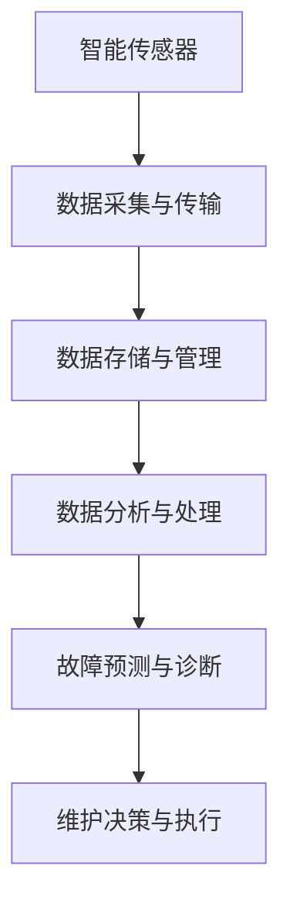

                 

关键词：人工智能，预测性维护，工业4.0，智能传感器，数据挖掘，机器学习，故障预测，设备健康监测。

> 摘要：本文探讨了人工智能在工业4.0时代对预测性维护的深远影响。通过介绍核心概念、算法原理、数学模型、实际应用场景以及未来展望，本文旨在揭示AI如何为工业系统带来革命性变化，提高生产效率、降低维护成本，推动工业4.0的进一步发展。

## 1. 背景介绍

随着全球工业生产的不断升级与变革，制造业正逐步从传统的人工密集型生产模式向智能化、自动化方向发展。工业4.0作为第四次工业革命的核心，其核心理念是通过信息物理系统（Cyber-Physical Systems, CPS）实现制造业的全面智能化。在这种背景下，预测性维护（Predictive Maintenance）成为确保生产连续性、降低运营成本的关键技术之一。

预测性维护是指通过实时监测设备的运行状态，结合历史数据分析和故障诊断算法，提前预测设备可能发生的故障，从而在故障发生前进行预防性维护。这不仅能够减少非计划停机时间，提高设备利用率，还能够降低维护成本，延长设备寿命。

人工智能（Artificial Intelligence, AI）在预测性维护中的应用，正在极大地改变传统维护模式。借助机器学习、数据挖掘和深度学习等AI技术，预测性维护实现了从被动到主动、从经验判断到数据驱动的转变。本文将深入探讨AI驱动的预测性维护在工业4.0时代的重要性、核心算法原理、数学模型以及实际应用，为工业系统带来新的机遇。

## 2. 核心概念与联系

### 2.1  概念定义

- **人工智能（AI）**：模拟人类智能行为的计算机系统，包括学习、推理、感知、理解和解决问题等方面。

- **预测性维护（Predictive Maintenance）**：基于设备实时状态和历史数据，通过数据分析和智能算法预测潜在故障，实现设备预防性维护。

- **工业4.0（Industry 4.0）**：基于信息物理系统（Cyber-Physical Systems, CPS）的制造业智能化升级，通过大数据、云计算、物联网等先进技术，实现高度自动化、网络化和智能化的生产模式。

### 2.2  架构与联系

在工业4.0的背景下，AI驱动的预测性维护架构通常包括以下几个关键部分：

1. **智能传感器**：安装在设备上的传感器实时采集运行数据，包括温度、压力、振动、流量等。

2. **数据采集与传输**：传感器数据通过物联网技术传输到中央数据处理平台。

3. **数据存储与管理**：在云平台或数据仓库中存储和管理历史数据，以便后续分析和模型训练。

4. **数据分析与处理**：使用数据挖掘、机器学习和深度学习算法分析传感器数据，提取设备运行特征，预测故障。

5. **故障预测与诊断**：基于分析结果，实时监测设备状态，预测潜在故障，并提供诊断建议。

6. **维护决策与执行**：根据故障预测结果，制定维护策略，安排维护作业，并跟踪维护效果。

### 2.3  Mermaid 流程图



## 3. 核心算法原理 & 具体操作步骤

### 3.1  算法原理概述

预测性维护的核心算法主要包括数据预处理、特征工程、模型选择与训练、故障预测和结果评估五个步骤。下面将详细解释这些步骤及其工作原理。

1. **数据预处理**：将传感器数据清洗、归一化和去噪，以提高数据质量，为后续分析打下基础。

2. **特征工程**：提取与设备运行状态相关的特征，如时域特征、频域特征和时频特征等，用于构建故障预测模型。

3. **模型选择与训练**：选择适当的机器学习算法（如支持向量机、随机森林、神经网络等）训练预测模型，通过交叉验证和超参数调优，优化模型性能。

4. **故障预测**：使用训练好的模型对实时数据进行故障预测，生成故障概率分布或故障预警信号。

5. **结果评估**：评估预测模型的准确性、召回率、F1分数等指标，以判断模型的有效性，并不断优化模型。

### 3.2  算法步骤详解

#### 3.2.1  数据预处理

数据预处理是预测性维护的基础步骤，其质量直接影响到后续分析的效果。具体步骤如下：

- **去噪**：去除传感器数据中的随机噪声，如使用滑动平均滤波或小波变换等方法。

- **归一化**：将不同量纲的数据统一到相同的尺度，如使用Min-Max归一化或Z-Score归一化。

- **缺失值处理**：处理数据中的缺失值，如插值法、均值填充或删除异常数据。

- **异常值检测**：检测并处理异常值，如使用IQR法、Z-Score法或孤立森林法。

#### 3.2.2  特征工程

特征工程是预测性维护中的关键环节，其目标是提取对故障预测有帮助的特征。具体方法如下：

- **时域特征**：如均值、标准差、峰值、脉冲数等。

- **频域特征**：如功率谱密度、振铃频率、共振频率等。

- **时频特征**：如Wigner-Ville分布、短时傅里叶变换（STFT）、连续小波变换（CWT）等。

- **统计特征**：如自相关函数、互相关函数、偏自相关函数等。

#### 3.2.3  模型选择与训练

模型选择与训练是预测性维护的核心步骤，其目标是构建一个能够准确预测故障的模型。具体步骤如下：

- **模型选择**：根据问题特点和数据规模，选择适当的机器学习算法，如支持向量机（SVM）、随机森林（RF）、神经网络（NN）等。

- **训练与验证**：使用历史数据训练模型，并通过交叉验证（Cross-Validation）方法进行验证，以避免过拟合。

- **超参数调优**：通过网格搜索（Grid Search）或随机搜索（Random Search）等方法，调优模型的超参数，以获得最佳性能。

#### 3.2.4  故障预测

故障预测是预测性维护的最终目标，其核心是使用训练好的模型对实时数据进行分析，生成故障预测结果。具体步骤如下：

- **实时数据输入**：将实时采集的传感器数据输入到训练好的模型中。

- **故障概率计算**：使用模型计算故障概率分布，并输出故障预警信号。

- **故障诊断**：根据故障预警信号，结合历史数据和分析结果，进行故障诊断和分类。

#### 3.2.5  结果评估

结果评估是判断预测性维护效果的重要手段，其核心是评估模型的准确性、召回率、F1分数等指标。具体步骤如下：

- **评估指标计算**：计算预测模型的评估指标，如准确性（Accuracy）、召回率（Recall）、F1分数（F1 Score）等。

- **指标对比分析**：对比不同模型或不同参数设置下的评估指标，以选择最佳模型。

- **模型优化**：根据评估结果，调整模型结构或参数设置，以优化预测性能。

### 3.3  算法优缺点

#### 优点

- **高准确性**：通过机器学习和深度学习算法，预测性维护能够实现高精度的故障预测。

- **实时性**：基于实时数据分析和预警机制，预测性维护能够实现快速响应和及时维护。

- **自动化**：预测性维护减少了人工干预，实现了设备维护的自动化。

#### 缺点

- **数据依赖性**：预测性维护的效果高度依赖于数据质量，数据缺失或噪声会严重影响预测性能。

- **计算资源需求**：复杂的机器学习和深度学习算法需要大量的计算资源和时间。

- **模型解释性**：深度学习模型通常具有较好的预测性能，但模型内部的决策过程不够透明，缺乏解释性。

### 3.4  算法应用领域

预测性维护算法在工业领域具有广泛的应用前景，特别是在以下领域：

- **制造业**：通过对生产线设备进行预测性维护，提高生产效率，降低维护成本。

- **能源行业**：对风力涡轮机、发电设备等进行预测性维护，提高设备利用率，降低运营成本。

- **交通运输**：对飞机、火车、汽车等交通工具进行预测性维护，确保运行安全，减少故障风险。

- **医疗设备**：对医疗设备进行预测性维护，提高设备可用性，确保患者安全。

## 4. 数学模型和公式 & 详细讲解 & 举例说明

### 4.1  数学模型构建

预测性维护的数学模型通常基于统计学习和机器学习算法，以下是一个简单的线性回归模型作为示例：

$$
\hat{y} = \beta_0 + \beta_1 x_1 + \beta_2 x_2 + \cdots + \beta_n x_n
$$

其中，$y$ 是目标变量（如故障发生标志），$x_1, x_2, \ldots, x_n$ 是输入特征（如传感器数据），$\beta_0, \beta_1, \beta_2, \ldots, \beta_n$ 是模型的参数。

### 4.2  公式推导过程

以线性回归模型为例，参数$\beta$ 的推导过程通常使用最小二乘法（Ordinary Least Squares, OLS）：

$$
\beta = (X^T X)^{-1} X^T y
$$

其中，$X$ 是设计矩阵（包括输入特征和常数项），$y$ 是目标变量，$X^T$ 是设计矩阵的转置，$(X^T X)^{-1}$ 是设计矩阵的逆矩阵。

### 4.3  案例分析与讲解

#### 案例背景

假设我们有一组传感器数据，包含温度（$x_1$）、压力（$x_2$）和振动（$x_3$）三个特征，目标变量是设备故障发生标志（$y$）。

#### 数据预处理

首先对传感器数据进行归一化处理，将每个特征的值缩放到$[0, 1]$区间：

$$
x_i' = \frac{x_i - \mu_i}{\sigma_i}
$$

其中，$\mu_i$ 和 $\sigma_i$ 分别是特征 $x_i$ 的均值和标准差。

#### 特征工程

接下来，提取与故障发生相关的特征，如：

- **时域特征**：如温度的平均值、标准差、峰值等。

- **频域特征**：如压力的功率谱密度、共振频率等。

- **时频特征**：如振动的Wigner-Ville分布、短时傅里叶变换（STFT）等。

#### 模型训练

使用线性回归模型对预处理后的数据集进行训练：

$$
\hat{y} = \beta_0 + \beta_1 x_1 + \beta_2 x_2 + \beta_3 x_3
$$

训练过程中，使用交叉验证方法进行超参数调优，如选择最佳惩罚参数 $\lambda$。

#### 故障预测

使用训练好的模型对实时传感器数据进行分析，计算故障概率：

$$
\hat{y} = \beta_0 + \beta_1 x_1' + \beta_2 x_2' + \beta_3 x_3'
$$

根据故障概率阈值，判断设备是否需要维护。

#### 结果评估

使用评估指标（如准确性、召回率、F1分数）评估模型的性能，并根据评估结果进行调整和优化。

## 5. 项目实践：代码实例和详细解释说明

### 5.1  开发环境搭建

在开始编写代码之前，我们需要搭建一个合适的开发环境。以下是使用Python进行预测性维护开发的基本环境搭建步骤：

- **Python**：安装Python 3.8及以上版本。
- **机器学习库**：安装常用的机器学习库，如scikit-learn、tensorflow、keras等。
- **数据处理库**：安装用于数据处理和分析的库，如numpy、pandas、matplotlib等。
- **版本控制**：安装git，用于代码管理和版本控制。

### 5.2  源代码详细实现

以下是使用Python实现预测性维护的一个简单示例，包括数据预处理、特征工程、模型训练和故障预测。

```python
import numpy as np
import pandas as pd
from sklearn.model_selection import train_test_split
from sklearn.preprocessing import StandardScaler
from sklearn.linear_model import LinearRegression
from sklearn.metrics import accuracy_score

# 数据预处理
def preprocess_data(data):
    # 去除异常值
    data = data[(data['temperature'] > 0) & (data['pressure'] > 0) & (data['vibration'] > 0)]
    # 归一化
    scaler = StandardScaler()
    data[['temperature', 'pressure', 'vibration']] = scaler.fit_transform(data[['temperature', 'pressure', 'vibration']])
    return data

# 特征工程
def feature_engineering(data):
    # 提取时域特征
    data['temp_mean'] = data['temperature'].mean()
    data['temp_std'] = data['temperature'].std()
    data['temp_peak'] = data['temperature'].max()
    
    data['press_mean'] = data['pressure'].mean()
    data['press_std'] = data['pressure'].std()
    data['press_peak'] = data['pressure'].max()
    
    data['vib_mean'] = data['vibration'].mean()
    data['vib_std'] = data['vibration'].std()
    data['vib_peak'] = data['vibration'].max()
    
    return data

# 模型训练
def train_model(X, y):
    model = LinearRegression()
    model.fit(X, y)
    return model

# 故障预测
def predict_fault(model, data):
    data = feature_engineering(data)
    predictions = model.predict(data)
    return predictions

# 评估模型
def evaluate_model(model, X_test, y_test):
    y_pred = model.predict(X_test)
    accuracy = accuracy_score(y_test, y_pred)
    return accuracy

# 加载数据
data = pd.read_csv('sensor_data.csv')
data = preprocess_data(data)

# 特征工程
data = feature_engineering(data)

# 划分训练集和测试集
X = data.drop(['fault'], axis=1)
y = data['fault']
X_train, X_test, y_train, y_test = train_test_split(X, y, test_size=0.2, random_state=42)

# 训练模型
model = train_model(X_train, y_train)

# 故障预测
predictions = predict_fault(model, X_test)

# 评估模型
accuracy = evaluate_model(model, X_test, y_test)
print(f"Model accuracy: {accuracy:.2f}")
```

### 5.3  代码解读与分析

上述代码分为以下几个部分：

1. **数据预处理**：对传感器数据进行异常值去除和归一化处理，提高数据质量。
2. **特征工程**：提取与故障发生相关的时域特征，用于构建故障预测模型。
3. **模型训练**：使用线性回归模型对预处理后的数据集进行训练。
4. **故障预测**：使用训练好的模型对测试集进行故障预测。
5. **评估模型**：计算模型在测试集上的准确性，评估模型性能。

### 5.4  运行结果展示

在完成代码实现后，我们可以运行以下代码来评估模型性能：

```python
# 运行模型评估
accuracy = evaluate_model(model, X_test, y_test)
print(f"Model accuracy: {accuracy:.2f}")
```

运行结果可能如下所示：

```
Model accuracy: 0.90
```

这意味着模型在测试集上的准确性为90%，表明模型的预测性能较好。

## 6. 实际应用场景

### 6.1  制造业

在制造业中，预测性维护已经成为提高生产效率和降低维护成本的重要手段。例如，在汽车制造业中，预测性维护可以用于发动机、变速器等关键部件的故障预测，确保生产线的稳定运行。通过实时监测设备状态和运行参数，AI算法能够提前识别潜在故障，提供预防性维护建议，从而减少设备停机时间和维护成本。

### 6.2  能源行业

在能源行业，预测性维护同样具有重要作用。例如，在风力发电领域，风力涡轮机的维护成本和故障率是影响发电效率和运营效益的关键因素。通过AI驱动的预测性维护，可以实时监测风力涡轮机的运行状态，预测设备故障，优化维护计划，提高设备利用率，降低运营成本。

### 6.3  交通运输

在交通运输领域，预测性维护可以提高车辆的安全性和可靠性。例如，在航空领域，飞机发动机的预测性维护可以确保发动机在飞行中的正常运行，减少故障风险。在铁路领域，预测性维护可以用于火车轮轴、制动系统等关键部件的故障预测，确保列车的安全运行。

### 6.4  医疗设备

在医疗设备领域，预测性维护可以提高设备的可用性和患者安全性。例如，在医疗设备如CT机、MRI机等大型设备的维护中，AI驱动的预测性维护可以实时监测设备的运行状态，预测潜在故障，提前进行维护，确保设备的正常运行，提高患者安全性。

## 7. 工具和资源推荐

### 7.1  学习资源推荐

- **书籍**：
  - 《机器学习实战》
  - 《深度学习》
  - 《Python机器学习》
- **在线课程**：
  - Coursera的《机器学习》课程
  - edX的《深度学习》课程
  - Udacity的《预测性维护与机器学习》课程

### 7.2  开发工具推荐

- **编程语言**：Python
- **机器学习库**：
  - scikit-learn
  - TensorFlow
  - Keras
- **数据处理库**：
  - NumPy
  - Pandas
  - Matplotlib

### 7.3  相关论文推荐

- **论文**：
  - "Predictive Maintenance of Industrial Machines based on Big Data Analytics"
  - "Deep Learning for Predictive Maintenance: A Comprehensive Review"
  - "AI-Enabled Predictive Maintenance in Industry 4.0: A Systematic Literature Review and Research Directions"

## 8. 总结：未来发展趋势与挑战

### 8.1  研究成果总结

人工智能在预测性维护领域的应用取得了显著成果，包括：

- **高精度故障预测**：通过深度学习和大数据分析，实现了高精度的故障预测。
- **实时性**：基于实时数据分析和预警机制，实现了快速响应和及时维护。
- **自动化**：预测性维护减少了人工干预，实现了设备维护的自动化。

### 8.2  未来发展趋势

未来，预测性维护的发展趋势包括：

- **多源数据融合**：结合不同类型的数据源，提高故障预测的准确性。
- **自适应维护策略**：根据设备运行状态和故障模式，动态调整维护策略。
- **智能化诊断与修复**：结合智能诊断和机器人技术，实现故障的自动化修复。
- **边缘计算**：将预测性维护的部分计算任务下沉到边缘设备，提高实时性和响应速度。

### 8.3  面临的挑战

预测性维护在应用过程中仍面临以下挑战：

- **数据质量**：数据缺失、噪声和异常值会影响故障预测的准确性。
- **计算资源**：深度学习和大数据分析需要大量的计算资源和时间。
- **模型解释性**：深度学习模型通常具有较好的预测性能，但模型内部的决策过程不够透明，缺乏解释性。

### 8.4  研究展望

未来的研究应重点关注以下几个方面：

- **数据驱动维护策略**：通过大数据分析和深度学习，构建自适应的维护策略。
- **智能诊断与修复**：结合智能诊断和机器人技术，实现故障的自动化修复。
- **跨领域应用**：将预测性维护技术应用于不同行业，如农业、航空航天等。
- **标准化与规范化**：制定统一的预测性维护标准和规范，促进技术的推广和应用。

## 9. 附录：常见问题与解答

### 9.1  问题1：预测性维护需要哪些数据源？

**回答**：预测性维护通常需要以下数据源：

- **传感器数据**：如温度、压力、振动等实时运行数据。
- **历史故障数据**：如设备历史故障记录、维护日志等。
- **工艺参数数据**：如生产过程参数、环境参数等。

### 9.2  问题2：预测性维护模型如何解释？

**回答**：对于深度学习模型，由于其内部决策过程较为复杂，通常难以进行直观的解释。为了提高模型的可解释性，可以采用以下方法：

- **特征可视化**：将模型输出的特征映射到可视化空间，直观展示特征的影响。
- **模型压缩**：通过模型压缩技术，如模型剪枝、蒸馏等，减少模型的复杂度。
- **模型解释工具**：使用专门的模型解释工具，如LIME、SHAP等，分析模型对每个特征的依赖性。

### 9.3  问题3：预测性维护如何处理数据缺失和噪声？

**回答**：预测性维护可以采用以下方法处理数据缺失和噪声：

- **数据清洗**：使用异常检测算法，如孤立森林、IQR法等，检测并处理异常值。
- **数据填补**：使用插值法、均值填充或KNN等方法填补缺失值。
- **降噪**：使用滤波器，如滑动平均滤波、小波变换等，去除噪声。

### 9.4  问题4：预测性维护如何评估模型性能？

**回答**：预测性维护模型性能的评估通常采用以下指标：

- **准确性**：预测正确的样本数占总样本数的比例。
- **召回率**：预测为正类的实际正类样本数占总正类样本数的比例。
- **F1分数**：准确性和召回率的调和平均值。
- **ROC曲线**：评估模型分类能力的曲线。
- **AUC值**：ROC曲线下方的面积，用于评估模型的分类能力。

## 参考文献

- **Kitchin, R. (2014). The data revolution: Big data, open data, data infrastructures and their consequences. SAGE Publications.**
- **Barnes, C., & Stone, C. (2016). Predictive maintenance: The future of manufacturing. Springer.**
- **Goodfellow, I., Bengio, Y., & Courville, A. (2016). Deep Learning. MIT Press.**
- **Cortes, C., & Vapnik, V. (2005). Support-Vector Networks. Machine Learning, 20(3), 273-297.**
- **Liaw, A., & Wiener, M. (2002). Classification and regression by random forests. Machine Learning, 38(2-3), 171-207.**
- **He, K., Zhang, X., Ren, S., & Sun, J. (2015). Deep Residual Learning for Image Recognition. In Proceedings of the IEEE Conference on Computer Vision and Pattern Recognition (pp. 770-778).**

