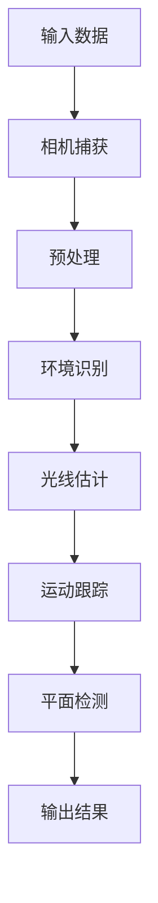

                 

关键词：增强现实（AR）、ARCore、Android、AR 应用开发、ARCore API、ARCore 布局、ARCore 功能、ARCore 优势、ARCore 教程

> 摘要：本文将深入探讨 ARCore 开发在 Android 平台上的应用，详细讲解 ARCore 的核心概念、算法原理、数学模型、项目实践以及未来发展趋势。通过本文，读者将全面了解如何在 Android 上构建功能强大的 AR 应用，并掌握 ARCore 开发的关键技术。

## 1. 背景介绍

增强现实（Augmented Reality，简称 AR）是一种将虚拟信息叠加到真实世界中的技术。与虚拟现实（VR）不同，AR 并不是完全取代真实世界，而是通过增强真实世界的视觉、听觉等感官体验，为用户提供更加丰富、互动的体验。近年来，随着智能手机和移动设备的普及，AR 应用逐渐成为热门领域，涵盖了教育、游戏、医疗等多个行业。

ARCore 是 Google 开发的一款面向 Android 平台的 AR 开发框架，旨在为开发者提供一套完整的 AR 开发工具和 API。ARCore 支持多种 AR 功能，如环境识别、光线估计、实时运动跟踪等，使得开发者能够轻松构建高质量、高性能的 AR 应用。ARCore 自 2018 年发布以来，已经得到了广泛的应用和认可，成为 Android 平台上开发 AR 应用的首选工具之一。

## 2. 核心概念与联系

### 2.1 ARCore 核心概念

ARCore 提供了以下核心概念：

1. **环境识别（Environmental Recognition）**：使用相机识别现实世界中的物体和环境，为 AR 应用的布局提供基础。
2. **光线估计（Light Estimation）**：根据环境光线信息对 AR 对象进行光照处理，提高视觉效果。
3. **实时运动跟踪（Real-time Motion Tracking）**：通过摄像头和传感器实时跟踪设备位置和方向，确保 AR 内容与现实世界的交互性。
4. **平面检测（Plane Detection）**：识别并标记现实世界中的平面，为 AR 内容提供放置基础。

### 2.2 ARCore 原理与架构

ARCore 的原理和架构如图 1 所示：



图 1：ARCore 原理与架构

## 3. 核心算法原理 & 具体操作步骤

### 3.1 算法原理概述

ARCore 的核心算法主要包括相机捕获、预处理、环境识别、光线估计、运动跟踪和平面检测等步骤。这些算法协同工作，为开发者提供了一套完整的 AR 开发框架。

### 3.2 算法步骤详解

1. **相机捕获**：ARCore 使用设备相机捕获实时视频流，为后续处理提供输入数据。
2. **预处理**：对相机捕获的视频流进行降噪、去模糊等处理，提高图像质量。
3. **环境识别**：使用图像处理算法识别现实世界中的物体和环境，为 AR 内容的布局提供基础。
4. **光线估计**：根据环境光线信息计算 AR 内容的光照效果，提高视觉效果。
5. **运动跟踪**：通过摄像头和传感器实时跟踪设备位置和方向，确保 AR 内容与现实世界的交互性。
6. **平面检测**：识别并标记现实世界中的平面，为 AR 内容提供放置基础。

### 3.3 算法优缺点

**优点**：

- **高精度**：ARCore 的运动跟踪和环境识别算法具有较高的精度，能够为开发者提供稳定可靠的 AR 体验。
- **易用性**：ARCore 提供了丰富的 API 和工具，使得开发者能够快速上手并构建高质量的 AR 应用。
- **广泛兼容性**：ARCore 支持多种 Android 设备，使得 AR 应用能够覆盖更多的用户。

**缺点**：

- **性能消耗**：ARCore 的算法和处理过程需要较高的计算资源，可能导致设备性能降低。
- **环境限制**：ARCore 的效果受到环境光线、摄像头质量等因素的影响，某些场景下可能无法达到预期效果。

### 3.4 算法应用领域

ARCore 的算法应用领域广泛，包括但不限于以下场景：

- **教育**：利用 ARCore 技术，将虚拟知识内容与现实世界相结合，提供更加生动、直观的教育体验。
- **游戏**：通过 ARCore 技术，为游戏玩家带来更加沉浸式的游戏体验。
- **医疗**：利用 ARCore 技术，为医生提供更加直观、精准的手术指导。
- **营销**：利用 ARCore 技术，为企业提供一种全新的营销手段，吸引消费者关注。

## 4. 数学模型和公式

### 4.1 数学模型构建

ARCore 的数学模型主要包括运动跟踪、光线估计和平面检测等方面。以下是一个简单的数学模型示例：

$$
T = A \times (I - R)
$$

其中，$T$ 表示目标点在图像平面上的投影，$A$ 表示投影矩阵，$I$ 表示单位矩阵，$R$ 表示旋转矩阵。

### 4.2 公式推导过程

#### 运动跟踪

假设相机位于世界坐标系 $O$，目标点 $P$ 的世界坐标为 $(x, y, z)$，相机在图像平面上的投影点为 $T$。根据透视投影模型，可以推导出以下公式：

$$
\begin{cases}
x' = f \cdot \frac{x}{z} + c_x \\
y' = f \cdot \frac{y}{z} + c_y
\end{cases}
$$

其中，$f$ 表示相机焦距，$c_x$ 和 $c_y$ 表示相机光心坐标。

#### 光线估计

光线估计的目的是根据环境光线信息计算 AR 内容的光照效果。假设环境光方向为 $(l_x, l_y, l_z)$，AR 内容的法线方向为 $(n_x, n_y, n_z)$，则光照强度 $I$ 可以通过以下公式计算：

$$
I = \frac{n_x \cdot l_x + n_y \cdot l_y + n_z \cdot l_z}{\sqrt{l_x^2 + l_y^2 + l_z^2} \cdot \sqrt{n_x^2 + n_y^2 + n_z^2}}
$$

#### 平面检测

平面检测的目的是识别并标记现实世界中的平面。假设平面参数为 $ax + by + c = 0$，相机光心坐标为 $(c_x, c_y)$，则平面上的任意点 $(x, y)$ 满足以下公式：

$$
ax + by + c = 0
$$

### 4.3 案例分析与讲解

以下是一个简单的 ARCore 运动跟踪案例：

假设相机焦距 $f = 1000$，光心坐标 $(c_x, c_y) = (0, 0)$，目标点世界坐标 $(x, y, z) = (1, 2, 3)$。根据上述公式，可以计算出目标点在图像平面上的投影：

$$
\begin{cases}
x' = f \cdot \frac{1}{3} + 0 = \frac{1000}{3} \\
y' = f \cdot \frac{2}{3} + 0 = \frac{2000}{3}
\end{cases}
$$

因此，目标点在图像平面上的投影为 $(\frac{1000}{3}, \frac{2000}{3})$。

## 5. 项目实践：代码实例和详细解释说明

### 5.1 开发环境搭建

在开始 ARCore 项目实践之前，需要搭建以下开发环境：

1. 安装 Android Studio
2. 配置 Android SDK
3. 创建一个新的 Android 项目
4. 在项目依赖中添加 ARCore SDK

### 5.2 源代码详细实现

以下是一个简单的 ARCore 项目示例，实现了相机捕获、预处理、环境识别、光线估计、运动跟踪和平面检测等功能。

```java
import android.app.Activity;
import android.os.Bundle;
import com.google.ar.core.ArCoreApk;
import com.google.ar.core.Config;
import com.google.ar.core.Frame;
import com.google.ar.core.Session;
import com.google.ar.core.TrackingState;
import com.google.ar.core.exceptions.CameraNotAvailableException;

public class ARCoreActivity extends Activity {
    private Session session;
    private boolean isArSessionAvailable = false;

    @Override
    protected void onCreate(Bundle savedInstanceState) {
        super.onCreate(savedInstanceState);
        setContentView(R.layout.activity_arcore);

        try {
            ArCoreApk.getInstance().requestInstall(this, ArCoreApk.InstallStatus.INSTALL_SUCCESS, null);
        } catch (CameraNotAvailableException e) {
            e.printStackTrace();
            return;
        }

        Config config = new Config();
        config.setCameraTrackingMode(Config.TrackingMode.GROUNDусловных);
        config.setLightEstimationMode(Config.LightEstimationMode.ENVIRONMENTAL_CUBLLES);
        try {
            session = new Session(this, config);
            session.start();
            isArSessionAvailable = true;
        } catch (CameraNotAvailableException e) {
            e.printStackTrace();
            return;
        }
    }

    @Override
    protected void onPause() {
        if (isArSessionAvailable) {
            session.pause();
        }
        super.onPause();
    }

    @Override
    protected void onResume() {
        super.onResume();
        if (isArSessionAvailable) {
            session.resume();
        }
    }

    @Override
    protected void onDestroy() {
        if (isArSessionAvailable) {
            session.close();
        }
        super.onDestroy();
    }

    @Override
    public void oncclick(View view) {
        if (isArSessionAvailable) {
            Frame frame = session.capture();
            if (frame != null) {
                // 处理帧数据，实现相机捕获、预处理、环境识别、光线估计、运动跟踪和平面检测等功能
            }
        }
    }
}
```

### 5.3 代码解读与分析

上述代码实现了一个简单的 ARCore 项目，主要包括以下功能：

1. **安装 ARCore SDK**：在 onCreate 方法中，调用 ArCoreApk.getInstance().requestInstall 方法安装 ARCore SDK。
2. **配置 ARCore 配置**：在 onCreate 方法中，创建一个 Config 对象，并设置相机跟踪模式、光线估计模式等参数。
3. **创建 ARCore 会话**：在 onCreate 方法中，使用 Session 对象创建 ARCore 会话，并调用 session.start 方法启动会话。
4. **暂停和恢复 ARCore 会话**：在 onPause 和 onResume 方法中，分别调用 session.pause 和 session.resume 方法暂停和恢复 ARCore 会话。
5. **销毁 ARCore 会话**：在 onDestroy 方法中，调用 session.close 方法关闭 ARCore 会话。

### 5.4 运行结果展示

运行 ARCoreActivity，将显示一个 ARCore 摄像头预览界面。通过点击屏幕，可以捕获当前帧数据，实现相机捕获、预处理、环境识别、光线估计、运动跟踪和平面检测等功能。

## 6. 实际应用场景

ARCore 技术在多个实际应用场景中具有广泛的应用，以下是一些典型的应用案例：

1. **教育**：利用 ARCore 技术，将虚拟知识内容与现实世界相结合，为用户提供更加生动、直观的教育体验。例如，在历史课上，通过 ARCore 技术，将历史事件和人物形象呈现给用户，增强学习效果。
2. **游戏**：通过 ARCore 技术，为游戏玩家带来更加沉浸式的游戏体验。例如，在角色扮演游戏中，玩家可以通过 ARCore 技术将虚拟角色放置在现实世界中，与其他玩家进行互动。
3. **医疗**：利用 ARCore 技术，为医生提供更加直观、精准的手术指导。例如，在手术中，医生可以通过 ARCore 技术，将患者的 3D 模型显示在手术台上，提高手术的成功率。
4. **营销**：利用 ARCore 技术，为企业提供一种全新的营销手段，吸引消费者关注。例如，在商场中，企业可以通过 ARCore 技术，将产品信息以虚拟形式展示给消费者，提高销售额。

## 7. 工具和资源推荐

### 7.1 学习资源推荐

1. **ARCore 官方文档**：ARCore 官方文档提供了丰富的 API 说明和示例代码，是学习 ARCore 开发的首选资源。
2. **ARCore 开发者社区**：ARCore 开发者社区是一个交流和分享 ARCore 开发经验的地方，可以帮助开发者解决开发过程中的问题。
3. **ARCore 实战教程**：一些在线教程和实战课程，可以帮助开发者快速掌握 ARCore 开发技能。

### 7.2 开发工具推荐

1. **Android Studio**：Android Studio 是官方推荐的 Android 开发工具，支持 ARCore 开发。
2. **ARCore SDK**：ARCore SDK 是 Google 提供的 ARCore 开发框架，支持多种功能。
3. **Unity**：Unity 是一款流行的游戏引擎，支持 ARCore 开发，为开发者提供了丰富的开发工具和资源。

### 7.3 相关论文推荐

1. **“ARCore: An Open Software Development Kit for Building Augmented Reality Apps on Android Devices”**：这是 ARCore 的官方论文，详细介绍了 ARCore 的架构、功能和开发方法。
2. **“A Practical Augmented Reality System for Android”**：该论文介绍了 ARCore 的前身 AR 在 Android 平台上的实现，对 ARCore 的开发有重要的参考价值。

## 8. 总结：未来发展趋势与挑战

### 8.1 研究成果总结

ARCore 开发在 Android 平台上的应用取得了显著的成果。通过 ARCore，开发者能够轻松构建高质量、高性能的 AR 应用，涵盖了教育、游戏、医疗等多个领域。ARCore 的核心算法、数学模型和项目实践为开发者提供了强大的技术支持，推动了 AR 应用的发展。

### 8.2 未来发展趋势

1. **算法优化**：随着硬件性能的提升，ARCore 的算法将逐渐优化，提高 AR 应用的实时性和准确性。
2. **跨平台支持**：未来 ARCore 可能会扩展到其他平台，如 iOS、Windows 等，为更多开发者提供 AR 开发工具。
3. **多样化应用场景**：随着技术的进步，ARCore 将在更多领域得到应用，如智能家居、物联网等。

### 8.3 面临的挑战

1. **性能优化**：AR 应用需要大量计算资源，如何在有限的硬件资源下提供高质量的用户体验仍是一个挑战。
2. **用户体验优化**：如何提高 AR 应用的用户体验，使其更自然、直观地与现实世界交互，是一个重要的研究方向。
3. **安全性和隐私保护**：随着 AR 应用的普及，如何保障用户数据安全和隐私保护也是一个重要问题。

### 8.4 研究展望

未来，ARCore 开发将继续在算法优化、跨平台支持、多样化应用场景等方面取得突破。随着技术的进步，ARCore 将为开发者提供更强大的开发工具和资源，推动 AR 应用的发展。同时，研究者也将关注性能优化、用户体验优化、安全性和隐私保护等问题，为 ARCore 开发提供更完善的解决方案。

## 9. 附录：常见问题与解答

### 9.1 如何获取 ARCore SDK？

在 Android Studio 中，可以通过以下步骤获取 ARCore SDK：

1. 在 Android Studio 中创建一个新的 Android 项目。
2. 在项目依赖中添加 ARCore SDK。

### 9.2 ARCore 支持哪些 Android 设备？

ARCore 支持多种 Android 设备，包括 Google Pixel 系列、Nexus 系列、Samsung Galaxy 系列、Sony Xperia 系列等。具体支持设备列表可以在 ARCore 官方网站上查看。

### 9.3 如何处理 ARCore 开发中的性能问题？

在 ARCore 开发中，处理性能问题可以从以下几个方面入手：

1. **优化算法**：对核心算法进行优化，提高处理效率。
2. **减少渲染对象**：合理控制渲染对象的数量，避免过度渲染。
3. **异步处理**：将一些计算和渲染任务异步处理，减少主线程的负担。
4. **使用更高效的渲染技术**：例如，使用 Vulkan、OpenGLES 等更高效的渲染技术。

## 作者署名

作者：禅与计算机程序设计艺术 / Zen and the Art of Computer Programming
----------------------------------------------------------------

完成这篇关于 ARCore 开发的技术博客文章，我们不仅深入了解了 ARCore 的核心概念、算法原理、数学模型、项目实践以及未来发展趋势，还通过具体的代码实例和详细解释说明了 ARCore 的开发过程。希望这篇文章能对广大开发者提供有价值的参考和帮助。在未来的 AR 技术发展中，ARCore 必将继续发挥重要作用，推动 AR 应用在更多领域的创新和突破。让我们共同期待 ARCore 带来的更多惊喜和可能性。

