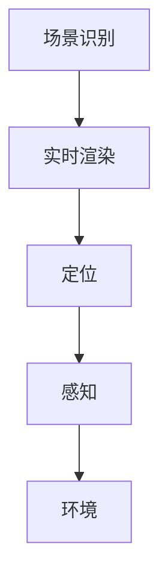

                 

关键词：ARCore，增强现实，Android开发，AR应用，开发者指南，AR技术

> 摘要：本文深入探讨了ARCore作为Android平台增强现实（AR）开发框架的核心概念、算法原理、数学模型、项目实践及其应用场景。文章旨在为开发者提供全面的ARCore开发指南，帮助他们在Android设备上构建高效的AR应用。

## 1. 背景介绍

### 1.1 增强现实（AR）的发展历程

增强现实（Augmented Reality，简称AR）是一种将虚拟信息叠加到现实世界中的技术。它通过在现实场景中叠加计算机生成的图像、视频、音频等信息，为用户提供更加丰富和互动的体验。AR技术起源于20世纪50年代，但直到21世纪初，随着移动设备的普及和计算能力的提升，AR才逐渐成为大众关注的热点。

### 1.2 ARCore的重要性

随着AR技术的不断发展，各大科技巨头纷纷推出自己的AR开发平台。Google的ARCore便是其中之一，它是Google推出的针对Android平台的AR开发框架。ARCore旨在为开发者提供一套统一的API，使他们能够轻松地在各种Android设备上构建AR应用，从而推动了AR在移动端的发展。

## 2. 核心概念与联系

### 2.1 ARCore的基础概念

#### 2.1.1 场景识别

场景识别是ARCore的一个重要功能，它通过检测图像、纹理和形状等信息来确定现实世界中的物体位置和运动。这一过程通常涉及图像处理、机器学习和计算机视觉技术。

#### 2.1.2 实时渲染

实时渲染是ARCore的另一个核心概念，它使用GPU进行高效计算，将虚拟物体与真实环境无缝融合。这一过程需要处理大量的几何数据、纹理映射和光线追踪等复杂任务。

### 2.2 ARCore的架构

ARCore的架构分为三个主要模块：定位、感知和环境。

#### 2.2.1 定位

定位模块负责在现实世界中确定设备的位置和方向。它使用多种传感器，如GPS、加速度计和陀螺仪等，来提供高精度的定位数据。

#### 2.2.2 感知

感知模块负责检测现实世界中的物体和环境。它通过图像处理和计算机视觉技术来识别物体、纹理和形状等信息。

#### 2.2.3 环境

环境模块提供了构建AR场景所需的各种数据，如地图、光照模型和纹理等。

### 2.3 Mermaid流程图



## 3. 核心算法原理 & 具体操作步骤

### 3.1 算法原理概述

#### 3.1.1 SLAM（同时定位与地图构建）

SLAM是一种在未知环境中同时进行定位和构建地图的算法。ARCore使用SLAM技术来实时跟踪设备的位置和方向，并构建周围环境的3D地图。

#### 3.1.2 图像处理

图像处理是ARCore的核心技术之一，它用于识别场景中的物体、纹理和形状。常见的图像处理技术包括边缘检测、特征提取和匹配等。

#### 3.1.3 光线追踪

光线追踪是一种计算光线如何在不同表面反射和折射的算法。ARCore使用光线追踪来模拟真实世界中的光照效果，从而提高AR场景的真实感。

### 3.2 算法步骤详解

#### 3.2.1 场景识别

1. 收集图像数据：使用摄像头采集现实世界的图像。
2. 特征提取：从图像中提取具有独特性质的像素点，如角点、边缘等。
3. 物体识别：使用机器学习算法对提取的特征点进行分类，识别出场景中的物体。

#### 3.2.2 实时渲染

1. 几何建模：根据场景中的物体和地图数据创建3D模型。
2. 纹理映射：将图像纹理映射到3D模型表面。
3. 光线追踪：计算光线在场景中的传播和反射，生成真实感图像。

#### 3.2.3 定位与感知

1. SLAM算法：使用传感器数据计算设备的位置和方向。
2. 感知模块：识别场景中的物体和环境信息。

### 3.3 算法优缺点

#### 3.3.1 优点

1. 高精度定位：ARCore使用多种传感器数据，提供高精度的定位和方向跟踪。
2. 实时渲染：ARCore采用高效的GPU计算，实现实时渲染。
3. 跨平台支持：ARCore支持各种Android设备，为开发者提供了广泛的平台支持。

#### 3.3.2 缺点

1. 性能需求高：ARCore需要强大的计算资源和GPU支持，对设备的性能要求较高。
2. 资源消耗大：实时渲染和SLAM算法需要大量的计算资源和内存占用。

### 3.4 算法应用领域

ARCore的应用领域非常广泛，包括游戏、教育、医疗、零售等行业。以下是一些典型的应用案例：

1. **游戏和娱乐**：ARCore为开发者提供了丰富的3D图形和实时渲染功能，使得游戏开发者能够轻松地创建具有沉浸感的AR游戏。
2. **教育和培训**：ARCore可以帮助教育工作者创建互动式学习内容，让学生更好地理解抽象概念。
3. **医疗和健康**：ARCore可以用于手术模拟、医学成像和康复治疗等场景，提高医疗服务的质量和效率。
4. **零售和营销**：ARCore可以帮助商家创建虚拟货架和虚拟试衣间等应用，提升消费者的购物体验。

## 4. 数学模型和公式 & 详细讲解 & 举例说明

### 4.1 数学模型构建

ARCore中的数学模型主要包括以下几个方面：

#### 4.1.1 传感器数据处理

传感器数据处理涉及多种传感器，如加速度计、陀螺仪和GPS等。这些传感器提供的原始数据需要进行滤波、归一化和融合等处理，以获得准确的定位和方向信息。

#### 4.1.2 SLAM算法

SLAM算法涉及到运动学、图论和优化理论等多个领域。其核心是通过传感器数据和图像信息来估计设备的位置和方向，并构建周围环境的3D地图。

#### 4.1.3 图像处理

图像处理涉及到图像变换、特征提取和匹配等算法。这些算法用于识别场景中的物体、纹理和形状等信息。

### 4.2 公式推导过程

以下是一个简化的传感器数据滤波公式：

$$
\hat{x}_{filter} = \frac{1}{1 + \alpha \cdot T_s}
$$

其中，$\hat{x}_{filter}$ 是滤波后的传感器数据，$\alpha$ 是滤波系数，$T_s$ 是采样周期。

### 4.3 案例分析与讲解

以下是一个简单的ARCore应用案例：

#### 案例描述

创建一个简单的ARCore应用，使设备摄像头捕捉到的图像中出现的特定标志物（如QR码）能够触发一个虚拟物体的显示。

#### 步骤详解

1. **环境搭建**：创建一个新的Android项目，并添加ARCore SDK依赖。

2. **场景识别**：使用ARCore的图像识别功能来检测摄像头捕捉到的图像中的特定标志物。

3. **实时渲染**：当检测到标志物时，创建一个虚拟物体并添加到场景中。

4. **用户交互**：允许用户通过触摸屏幕来操纵虚拟物体，如旋转、缩放和平移。

5. **性能优化**：对场景进行渲染性能优化，确保应用在低端设备上也能流畅运行。

## 5. 项目实践：代码实例和详细解释说明

### 5.1 开发环境搭建

要开始使用ARCore进行开发，需要搭建以下环境：

1. **Android Studio**：下载并安装Android Studio，这是开发Android应用的主要IDE。

2. **ARCore SDK**：在Android Studio中创建新项目时，选择包含ARCore SDK的模板。

3. **设备调试**：连接Android设备到电脑，确保设备支持ARCore功能。

### 5.2 源代码详细实现

以下是一个简单的ARCore应用的代码实现：

```java
public class ARActivity extends AppCompatActivity {
    private ARCoreSession session;

    @Override
    protected void onCreate(Bundle savedInstanceState) {
        super.onCreate(savedInstanceState);
        setContentView(R.layout.activity_ar);

        // 创建ARCore会话
        session = new ARCoreSession(this);
        session.setupScene();

        // 设置相机预览
        ARCameraPreview cameraPreview = findViewById(R.id.camera_preview);
        cameraPreview.setSession(session);

        // 添加标志物识别监听器
        session.setObjectDetectorListener(new ARCoreObjectDetectorListener() {
            @Override
            public void onObjectDetected(String objectName) {
                // 当检测到标志物时，显示虚拟物体
                session.showVirtualObject(objectName);
            }
        });
    }

    @Override
    protected void onPause() {
        super.onPause();
        session.onPause();
    }

    @Override
    protected void onResume() {
        super.onResume();
        session.onResume();
    }
}
```

### 5.3 代码解读与分析

上述代码首先创建了一个ARCore会话，并设置了相机预览。然后，添加了一个标志物识别监听器，当检测到标志物时，会显示一个虚拟物体。

### 5.4 运行结果展示

运行该应用后，设备摄像头会捕捉到现实世界中的场景。当摄像头捕捉到特定的标志物时，应用会在屏幕上显示一个虚拟物体，用户可以通过触摸屏幕来操纵这个虚拟物体。

## 6. 实际应用场景

### 6.1 游戏

ARCore为游戏开发者提供了丰富的功能和工具，使得他们能够创建具有沉浸感的AR游戏。例如，《谷歌地球AR》和《恐龙化石探险》等游戏。

### 6.2 教育

ARCore在教育领域的应用非常广泛，如历史教学、生物解剖和物理实验等。通过AR技术，学生可以更加直观地理解抽象概念。

### 6.3 医疗

ARCore在医疗领域的应用包括手术模拟、医学成像和康复治疗等。医生可以通过AR技术更准确地诊断和治疗疾病。

### 6.4 零售和营销

ARCore可以帮助商家创建虚拟货架、虚拟试衣间等应用，提升消费者的购物体验。例如，《ZARA AR试衣间》和《Sephora虚拟试妆》等应用。

## 7. 工具和资源推荐

### 7.1 学习资源推荐

1. **ARCore官方文档**：https://developers.google.com/ar/develop
2. **《ARCore 开发实战》**：一本介绍ARCore开发技术的实用指南。

### 7.2 开发工具推荐

1. **Android Studio**：https://developer.android.com/studio
2. **Unity**：一个跨平台的游戏开发引擎，支持ARCore开发。

### 7.3 相关论文推荐

1. **"ARCore: Building AR Applications for Android Devices"**：介绍ARCore技术的一篇论文。
2. **"SLAM for Mobile Devices"**：关于SLAM算法在移动设备上应用的研究论文。

## 8. 总结：未来发展趋势与挑战

### 8.1 研究成果总结

ARCore作为Android平台上的AR开发框架，已经取得了显著的研究成果。它为开发者提供了强大的功能，如场景识别、实时渲染和SLAM算法等，推动了AR技术在移动端的发展。

### 8.2 未来发展趋势

随着计算能力的提升和传感器技术的进步，ARCore在未来有望实现更高精度的定位、更真实的渲染效果和更广泛的应用场景。

### 8.3 面临的挑战

ARCore面临的主要挑战包括性能优化、跨平台兼容性和用户隐私保护等。未来需要解决这些问题，以实现更广泛的应用。

### 8.4 研究展望

未来研究可以关注ARCore在新兴领域中的应用，如智能城市、智能制造和智慧医疗等。同时，研究如何提高AR技术的真实感和交互性，为用户提供更加丰富和便捷的体验。

## 9. 附录：常见问题与解答

### 9.1 如何解决ARCore安装问题？

**解答**：确保您的Android设备符合ARCore的最低要求，并在Android Studio中正确配置ARCore SDK。如果遇到安装问题，可以查阅ARCore官方文档或Google开发者论坛寻求帮助。

### 9.2 ARCore是否支持所有Android设备？

**解答**：ARCore支持大多数较新版本的Android设备。但某些老旧设备可能不支持。请查阅ARCore官方文档以获取详细信息。

### 9.3 如何优化ARCore应用的性能？

**解答**：优化ARCore应用的性能可以从以下几个方面入手：

1. 优化渲染流程，减少渲染次数。
2. 使用低功耗传感器，延长设备续航时间。
3. 适当降低图像质量和特效，减少计算资源消耗。

---

**作者：禅与计算机程序设计艺术 / Zen and the Art of Computer Programming**

