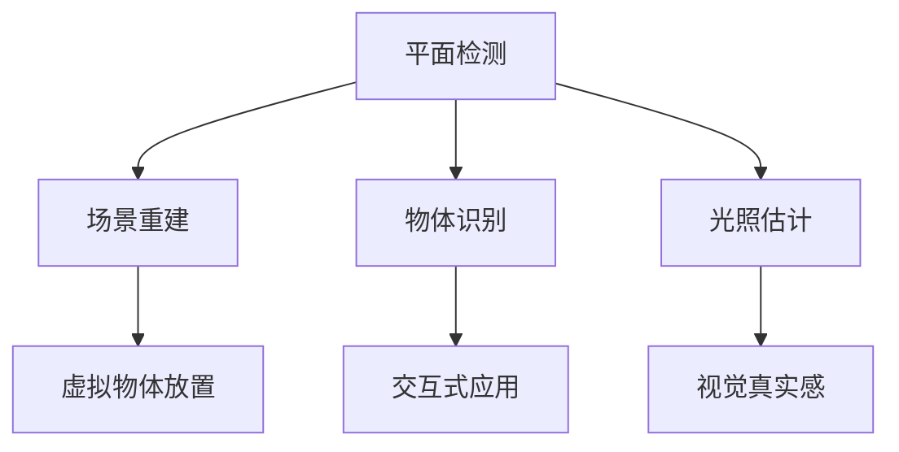

                 

关键词：ARKit、增强现实、iOS应用开发、AR应用开发、AR体验设计

> 摘要：本文将详细介绍如何在 iOS 上使用 ARKit 框架进行应用开发，从而创建令人印象深刻的增强现实体验。我们将从 ARKit 的核心概念、算法原理，到实际项目实践，提供全面的指导，旨在帮助开发者更好地理解和掌握 AR 技术在 iOS 中的应用。

## 1. 背景介绍

增强现实（Augmented Reality，简称 AR）是一种将虚拟信息叠加到真实世界中的技术，它通过摄像头捕捉现实世界的图像，并在其上实时叠加计算机生成的图像、文本或3D模型。随着智能手机和移动设备的普及，AR技术已经逐渐成为移动应用开发的一个重要领域。

苹果公司在2017年首次推出了 ARKit，这是一个专为 iOS 开发者设计的增强现实开发框架。ARKit 利用 iPhone 和 iPad 的内置传感器，如相机、加速度计和陀螺仪，为开发者提供了一个简单而强大的工具集，用于创建高质量的 AR 应用。

ARKit 的发布标志着苹果在 AR 技术领域的重要一步，它使得即使是初学者也能轻松地创建出令人印象深刻的 AR 应用。ARKit 的核心功能包括平面检测、场景重建、物体识别和光照估计等，这些功能使得开发者能够创造出沉浸式的 AR 体验。

## 2. 核心概念与联系

在深入探讨 ARKit 的核心功能之前，我们首先需要了解一些基本的概念和原理。以下是 ARKit 中一些关键概念的简要介绍：

### 2.1. 平面检测（Plane Detection）

平面检测是 ARKit 的一个重要功能，它能够识别出摄像头视野中的水平面或垂直面。这对于在现实世界中放置虚拟物体至关重要。通过平面检测，开发者可以确保虚拟物体始终放置在正确的位置。

### 2.2. 场景重建（Scene Reconstruction）

场景重建是指将现实世界的图像转换为三维模型的过程。ARKit 使用了一种称为结构光的方法，通过分析摄像头捕获的图像来重建场景的深度信息。

### 2.3. 物体识别（Object Recognition）

物体识别功能允许 ARKit 识别并跟踪现实世界中的特定物体。这对于创建交互式 AR 应用非常有用，例如在零售环境中，可以用来展示产品信息。

### 2.4. 光照估计（Light Estimation）

光照估计功能可以计算场景中的光照水平，从而确保虚拟物体在现实世界中的外观自然。这对于创建逼真的 AR 体验至关重要。

下面是一个使用 Mermaid 画的流程图，展示了 ARKit 的核心概念和它们之间的关系：



## 3. 核心算法原理 & 具体操作步骤

### 3.1. 算法原理概述

ARKit 的核心算法基于机器学习和计算机视觉技术。以下是其主要原理：

- **深度学习**：ARKit 使用深度学习模型来识别和跟踪平面、物体等。
- **光流法**：通过分析图像序列来估计场景的深度。
- **结构光**：使用特殊的光源照射场景，从而捕获深度信息。

### 3.2. 算法步骤详解

以下是 ARKit 算法的详细步骤：

1. **启动摄像头**：首先，应用程序需要启动摄像头以捕获实时图像。
2. **平面检测**：接下来，ARKit 会分析图像以检测平面。这个过程涉及到图像处理和深度学习算法。
3. **场景重建**：一旦平面被检测到，ARKit 会使用光流法和结构光技术来重建场景的深度信息。
4. **物体识别**：ARKit 还可以识别并跟踪特定的物体，这同样依赖于深度学习和图像处理技术。
5. **光照估计**：在将虚拟物体放置到场景中时，ARKit 会计算场景中的光照水平，以确保虚拟物体在现实世界中的外观自然。
6. **虚拟物体放置**：最后，开发者可以将虚拟物体放置到平面或物体上。

### 3.3. 算法优缺点

#### 优点：

- **易用性**：ARKit 提供了一套简单而强大的 API，使得开发者可以轻松地创建 AR 应用。
- **性能强大**：ARKit 能够在 iPhone 和 iPad 上实现高质量的 AR 体验，而无需大量计算资源。
- **平台兼容性**：ARKit 支持多种 iOS 设备，包括 iPhone 和 iPad。

#### 缺点：

- **硬件限制**：虽然 ARKit 性能强大，但仍然受到硬件的限制，例如摄像头分辨率和传感器性能。
- **隐私问题**：ARKit 的使用涉及到对摄像头和传感器的访问，可能会引发隐私担忧。

### 3.4. 算法应用领域

ARKit 在多个领域有广泛的应用，包括但不限于：

- **教育**：使用 AR 技术增强教学内容，提供互动和沉浸式的学习体验。
- **娱乐**：开发游戏和虚拟现实体验，吸引玩家。
- **零售**：在购物过程中提供产品信息、展示虚拟试穿等功能。
- **医疗**：使用 AR 技术进行远程手术指导、患者教育等。

## 4. 数学模型和公式 & 详细讲解 & 举例说明

### 4.1. 数学模型构建

ARKit 的数学模型涉及多个方面，包括图像处理、深度学习和计算机视觉等。以下是几个关键数学模型：

#### 4.1.1. 深度学习模型

深度学习模型用于平面检测、物体识别等任务。一个常见的模型是卷积神经网络（CNN），它通过多层卷积和池化操作提取图像特征。

#### 4.1.2. 光流法

光流法用于估计场景的深度信息。一个常用的模型是 Lucas-Kanade 算法，它通过分析连续图像帧中的像素运动来估计深度。

#### 4.1.3. 光照模型

光照模型用于计算场景中的光照水平。一个常用的模型是 Phong 反射模型，它考虑了环境光、漫反射光和镜面反射光。

### 4.2. 公式推导过程

以下是几个关键公式的推导过程：

#### 4.2.1. 卷积神经网络（CNN）模型

$$
\text{激活函数} = \max(0, x)
$$

$$
\text{卷积操作} = \sum_{i=1}^{n} w_i * x_i
$$

其中，$x_i$ 是输入特征，$w_i$ 是权重，$*$ 表示卷积操作。

#### 4.2.2. 光流法

$$
\text{光流公式} = \frac{I_t(x, y) - I_{t-1}(x, y)}{I_{t-1}(x, y)}
$$

其中，$I_t(x, y)$ 和 $I_{t-1}(x, y)$ 分别是连续两帧图像中的像素值。

#### 4.2.3. Phong 反射模型

$$
L_p = k_a \cdot I_a + k_d \cdot \max(0, \frac{n \cdot L_d}{d}) + k_s \cdot \max(0, \frac{R \cdot L_d}{d})^s
$$

其中，$L_p$ 是光照强度，$k_a$、$k_d$ 和 $k_s$ 分别是环境光、漫反射光和镜面反射光的系数，$I_a$、$L_d$ 和 $L_s$ 分别是环境光、漫反射光和镜面反射光的强度，$n$ 是法线向量，$R$ 是反射向量，$d$ 是光源到表面的距离，$s$ 是镜面反射的指数。

### 4.3. 案例分析与讲解

以下是一个使用 ARKit 开发的实际案例：一个简单的 AR 应用，用于在现实世界中放置一个虚拟的3D模型。

#### 4.3.1. 应用需求

开发一个 AR 应用，用户可以在现实世界中放置一个虚拟的3D汽车模型，并可以旋转、缩放和删除。

#### 4.3.2. 技术实现

1. **平面检测**：使用 ARKit 的平面检测功能找到地面作为放置虚拟物体的基础。
2. **3D模型加载**：使用 SceneKit 加载3D汽车模型。
3. **虚拟物体放置**：将3D模型放置到平面中心。
4. **交互控制**：使用触摸事件监听器实现旋转、缩放和删除功能。

## 5. 项目实践：代码实例和详细解释说明

### 5.1. 开发环境搭建

在开始编写代码之前，我们需要搭建一个适合 ARKit 开发的环境。

1. **安装 Xcode**：下载并安装 Xcode，这是 iOS 开发的官方工具。
2. **创建一个新的 ARKit 项目**：在 Xcode 中，选择 "Create a new Xcode project"，选择 "ARKit App" 模板，然后点击 "Next"。
3. **配置项目**：在项目的 "General" 中，确保设备选择 "iPhone" 或 "iPad"，并在 "Capabilities" 中开启 "ARKit"。

### 5.2. 源代码详细实现

以下是创建 AR 应用所需的主要代码实现：

```swift
import UIKit
import SceneKit
import ARKit

class ViewController: UIViewController, ARSCNViewDelegate {

    var sceneView: ARSCNView!
    var carScene: SCNScene!

    override func viewDidLoad() {
        super.viewDidLoad()
        
        // 初始化场景视图
        sceneView = ARSCNView(frame: view.bounds)
        sceneView.delegate = self
        sceneView.autoresizingMask = [.flexibleWidth, .flexibleHeight]
        view.addSubview(sceneView)
        
        // 加载汽车场景
        carScene = SCNScene(named: "car.scn")!
        sceneView.scene = carScene
    }

    override func viewWillAppear(_ animated: Bool) {
        super.viewWillAppear(animated)
        
        // 创建一个 AR 配置
        let configuration = ARWorldTrackingConfiguration()
        configuration.planeDetection = .horizontal
        sceneView.session.run(configuration)
    }

    override func viewWillDisappear(_ animated: Bool) {
        super.viewWillDisappear(animated)
        
        sceneView.session.pause()
    }

    func renderer(_ renderer: SCNSceneRenderer, didAdd node: SCNNode, for anchor: ARAnchor) {
        // 当平面被检测到时，将汽车场景添加到节点
        if let planeAnchor = anchor as? ARPlaneAnchor {
            let carNode = SCNNode(geometry: carScene.rootNode.geometry!)
            carNode.position = SCNVector3(planeAnchor.center.x, planeAnchor.center.y, planeAnchor.center.z - 0.5)
            node.addChildNode(carNode)
        }
    }

    func touchControl(node: SCNNode) {
        // 实现旋转、缩放和删除功能
        let tapGestureRecognizer = UITapGestureRecognizer(target: self, action: #selector(handleTap(_:)))
        sceneView.addGestureRecognizer(tapGestureRecognizer)
    }

    @objc func handleTap(_ gestureRecognizer: UITapGestureRecognizer) {
        let tapLocation = gestureRecognizer.location(in: sceneView)
        let hitResults = sceneView.hitTest(tapLocation, types: .existingNode)

        if let hitResult = hitResults.first {
            let node = hitResult.node
            if node.name == "deleteNode" {
                node.removeFromParentNode()
            }
        }
    }
}
```

### 5.3. 代码解读与分析

上述代码实现了一个简单的 AR 应用，用户可以在现实世界中放置一个虚拟的3D汽车模型，并进行旋转、缩放和删除操作。

1. **初始化 ARSCNView**：创建 ARSCNView 并设置其委托。
2. **加载汽车场景**：使用 SceneKit 加载3D汽车模型。
3. **运行 AR 会话**：创建 ARWorldTrackingConfiguration 并运行 AR 会话。
4. **渲染场景**：当检测到平面时，将汽车场景添加到节点。
5. **实现交互控制**：通过触摸事件监听器实现旋转、缩放和删除功能。

### 5.4. 运行结果展示

运行该应用后，用户可以在现实世界中看到放置的3D汽车模型，并可以通过触摸进行交互操作。


## 6. 实际应用场景

ARKit 在多个领域有广泛的应用，以下是一些实际应用场景：

- **零售**：通过 AR 技术提供虚拟试穿、产品展示等功能。
- **教育**：增强教学内容，提供互动和沉浸式的学习体验。
- **娱乐**：开发游戏和虚拟现实体验。
- **医疗**：使用 AR 技术进行远程手术指导、患者教育等。

### 6.1. 零售

在零售领域，ARKit 可以帮助商家提供虚拟试穿、产品展示等功能。例如，用户可以在试衣间中使用手机摄像头查看自己穿上衣服的效果，从而做出更明智的购买决定。

### 6.2. 教育

在教育领域，ARKit 可以增强教学内容，提供互动和沉浸式的学习体验。例如，学生可以通过 AR 应用参观历史遗址，或者在课堂中与虚拟动物互动，从而更好地理解课程内容。

### 6.3. 娱乐

在娱乐领域，ARKit 可以用于开发游戏和虚拟现实体验。开发者可以创建令人兴奋的虚拟世界，让用户沉浸在游戏或虚拟现实体验中。

### 6.4. 未来应用展望

随着 AR 技术的不断发展和普及，ARKit 的应用前景非常广阔。未来，ARKit 可能会在更多的领域中发挥作用，例如智能建筑、智慧城市、虚拟现实等。同时，随着硬件性能的提升和算法的优化，ARKit 的体验将更加逼真和流畅。

## 7. 工具和资源推荐

### 7.1. 学习资源推荐

- **官方文档**：ARKit 官方文档提供了详细的开发指南和 API 文档。
- **在线教程**：许多在线平台提供了 ARKit 开发的教程，例如 Udemy、Coursera 等。

### 7.2. 开发工具推荐

- **Xcode**：苹果官方的开发工具，用于编写和调试 iOS 应用。
- **ARKit Playground**：一个交互式的开发环境，用于快速尝试 ARKit 功能。

### 7.3. 相关论文推荐

- **"Augmented Reality Applications on Smartphones"**：该论文介绍了 AR 技术在智能手机中的应用。
- **"ARKit: A New Era of Augmented Reality on iOS"**：该论文详细介绍了 ARKit 的技术原理和应用。

## 8. 总结：未来发展趋势与挑战

ARKit 作为 iOS 平台的关键技术之一，为开发者提供了一个强大的工具集，用于创建高质量的 AR 应用。随着 AR 技术的不断发展和普及，ARKit 的应用前景非常广阔。未来，ARKit 可能会在更多的领域中发挥作用，例如智能建筑、智慧城市、虚拟现实等。

然而，ARKit 在发展中仍然面临一些挑战，包括硬件性能的提升、算法的优化和隐私保护等。为了应对这些挑战，开发者需要不断学习和探索，以充分发挥 ARKit 的潜力。

总之，ARKit 是一个具有巨大潜力的技术，它将为 iOS 应用开发带来新的机遇和挑战。我们期待在未来的发展中，看到更多令人惊叹的 AR 应用。

### 8.1. 研究成果总结

本文全面介绍了 ARKit 在 iOS 应用开发中的应用，包括核心概念、算法原理、实际项目实践等。通过对 ARKit 的深入探讨，我们发现 ARKit 为开发者提供了一个简单而强大的工具集，用于创建高质量的 AR 应用。

### 8.2. 未来发展趋势

随着 AR 技术的不断发展和普及，ARKit 的应用前景非常广阔。未来，ARKit 可能会在更多的领域中发挥作用，例如智能建筑、智慧城市、虚拟现实等。

### 8.3. 面临的挑战

虽然 ARKit 在发展中取得了显著成果，但仍然面临一些挑战，包括硬件性能的提升、算法的优化和隐私保护等。为了应对这些挑战，开发者需要不断学习和探索，以充分发挥 ARKit 的潜力。

### 8.4. 研究展望

未来，我们期待看到更多基于 ARKit 的新技术和新应用。同时，随着 AR 技术的不断发展，ARKit 也将在更多的领域中发挥作用，为人们的生活带来更多便利和创新。

## 9. 附录：常见问题与解答

### 9.1. 如何处理 ARKit 的隐私问题？

ARKit 的使用涉及到对摄像头和传感器的访问，可能会引发隐私担忧。为了保护用户隐私，开发者应该遵循以下最佳实践：

- **最小权限原则**：仅访问必要的传感器和权限。
- **透明度**：在应用中使用清晰的用户界面，向用户解释 ARKit 的功能和使用方式。
- **隐私政策**：在应用商店中提供详细的隐私政策。

### 9.2. 如何优化 ARKit 的性能？

优化 ARKit 的性能是确保高质量 AR 体验的关键。以下是一些优化策略：

- **硬件适配**：针对不同的 iOS 设备，调整 ARKit 的设置以充分利用硬件资源。
- **图像处理**：使用高效的图像处理算法，减少图像处理的时间。
- **模型简化**：简化 3D 模型，减少渲染复杂度。

### 9.3. 如何处理 ARKit 的平面检测不准确问题？

平面检测不准确是 ARKit 中的一个常见问题。以下是一些解决策略：

- **多次检测**：在检测到平面后，进行多次确认以增加准确性。
- **自适应阈值**：根据场景的亮度、对比度等参数，调整平面检测的阈值。
- **改进算法**：使用更先进的平面检测算法，例如基于深度学习的算法。

---

**作者：禅与计算机程序设计艺术 / Zen and the Art of Computer Programming**

