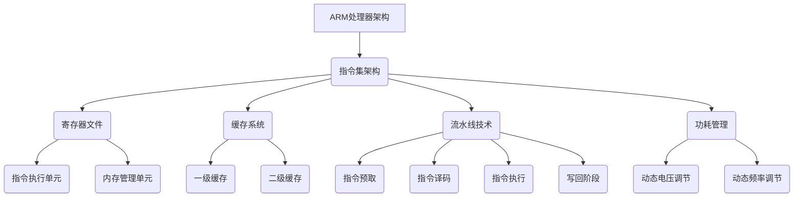

                 

关键词：ARM处理器、性能优化、效率提升、低功耗设计、指令集架构、编译优化、缓存策略

> 摘要：本文将深入探讨ARM处理器性能优化的一系列技巧。从核心概念到具体实现，再到实际应用场景，我们将详细分析如何通过优化指令集、编译器和缓存策略等手段，提升ARM处理器的性能和能效比，以满足现代嵌入式系统和移动设备的高性能需求。

## 1. 背景介绍

ARM处理器作为全球范围内最受欢迎的微处理器架构之一，广泛应用于嵌入式设备、智能手机、平板电脑以及服务器等领域。随着移动互联网和物联网的快速发展，对ARM处理器性能的要求越来越高。如何优化ARM处理器，提高其处理效率和降低功耗，成为了一个重要的课题。

本文将围绕以下几个方面展开讨论：

- 核心概念与联系
- 核心算法原理与具体操作步骤
- 数学模型与公式推导
- 项目实践：代码实例
- 实际应用场景与未来展望

通过本文的讨论，希望能够为ARM处理器的性能优化提供一些实用的指导和建议。

## 2. 核心概念与联系

要理解ARM处理器的性能优化，首先需要了解其核心概念和架构。以下是一个简化的Mermaid流程图，用于展示ARM处理器的主要组成部分和它们之间的关系。



### 指令集架构

指令集架构（Instruction Set Architecture，ISA）是处理器设计的基础，定义了处理器可以理解和执行的指令集合。ARM处理器采用精简指令集计算机（RISC）架构，通过减少指令数量和指令周期，提高了处理器的性能。常见的ARM指令集包括ARMv7和ARMv8，它们分别对应不同的优化目标和性能指标。

### 寄存器文件

寄存器文件是处理器的重要组成部分，用于存储指令执行时需要的数据。ARM处理器通常具有32个或更多的通用寄存器，这些寄存器用于数据存储、加载和存储等操作，直接影响指令执行的速度和效率。

### 缓存系统

缓存系统用于临时存储频繁访问的数据和指令，减少内存访问延迟。ARM处理器通常具有多级缓存结构，包括一级缓存（L1）、二级缓存（L2）等。缓存策略的优化对于提升处理器性能至关重要。

### 流水线技术

流水线技术通过将指令执行过程分解为多个阶段，使得不同指令可以并行执行，从而提高处理器性能。ARM处理器采用多级流水线设计，实现了高效的指令执行。

### 功耗管理

功耗管理是ARM处理器设计中的一个重要方面，通过动态电压和频率调节技术，根据处理器负载调整功耗，实现低功耗设计。

## 3. 核心算法原理 & 具体操作步骤

### 3.1 算法原理概述

ARM处理器性能优化的核心算法包括指令优化、编译器优化和缓存策略优化。以下将分别介绍这些算法的基本原理。

#### 指令优化

指令优化是指通过修改程序代码，使处理器执行指令的过程更加高效。常见的指令优化方法包括指令调度、指令合并和指令替换等。

#### 编译器优化

编译器优化是指通过优化编译过程，生成高效的可执行代码。编译器优化主要包括代码生成优化、寄存器分配和循环优化等。

#### 缓存策略优化

缓存策略优化是指通过调整缓存结构和工作方式，提高缓存利用率，减少内存访问延迟。常见的缓存策略优化方法包括缓存预取、缓存替换算法和缓存一致性协议等。

### 3.2 算法步骤详解

#### 指令优化

1. **指令调度**：通过分析指令之间的数据依赖关系，调整指令执行顺序，减少指令之间的等待时间。

2. **指令合并**：将多个简单指令合并为一个复合指令，减少指令执行次数。

3. **指令替换**：将程序中效率较低的指令替换为更高效的指令。

#### 编译器优化

1. **代码生成优化**：通过分析程序代码，生成更高效的目标代码。

2. **寄存器分配**：为程序中的变量分配合适的寄存器，减少内存访问次数。

3. **循环优化**：通过优化循环结构，减少循环执行次数和内存访问次数。

#### 缓存策略优化

1. **缓存预取**：在处理器访问缓存未命中的地址之前，预先读取相关数据到缓存中，减少内存访问延迟。

2. **缓存替换算法**：根据缓存的使用情况，选择替换策略，提高缓存命中率。

3. **缓存一致性协议**：在多核处理器中，通过缓存一致性协议保持缓存数据的一致性。

### 3.3 算法优缺点

#### 指令优化

优点：可以显著提高处理器执行指令的速度。

缺点：需要修改程序代码，可能引入新的错误。

#### 编译器优化

优点：生成高效的目标代码，提高程序性能。

缺点：优化过程复杂，可能增加编译时间。

#### 缓存策略优化

优点：提高缓存利用率，减少内存访问延迟。

缺点：优化效果依赖于具体应用场景，难以统一。

### 3.4 算法应用领域

指令优化、编译器优化和缓存策略优化广泛应用于嵌入式系统、移动设备、服务器等领域。以下为具体应用领域：

- **嵌入式系统**：如智能家居、工业自动化等，对性能和功耗有较高要求。

- **移动设备**：如智能手机、平板电脑等，对便携性和续航能力有较高要求。

- **服务器**：如云计算、大数据处理等，对处理能力和稳定性有较高要求。

## 4. 数学模型和公式 & 详细讲解 & 举例说明

### 4.1 数学模型构建

ARM处理器性能优化的数学模型主要包括指令执行时间、缓存命中率、功耗等指标。以下是一个简化的数学模型：

$$
P = C \times D \times (1 - H)
$$

其中：

- \(P\)：处理器性能
- \(C\)：指令执行时间
- \(D\)：指令条数
- \(H\)：缓存命中率

### 4.2 公式推导过程

假设处理器每条指令的执行时间相同，为\(C\)。程序中指令条数为\(D\)。缓存命中率为\(H\)。

当指令访问缓存的概率为\(H\)时，每条指令的平均访问时间为\(C \times (1 - H)\)。因此，处理器性能可以表示为：

$$
P = C \times D \times (1 - H)
$$

### 4.3 案例分析与讲解

假设一个ARM处理器，每条指令的执行时间为5ns，程序中指令条数为1000条，缓存命中率为90%。

根据上述数学模型，处理器性能为：

$$
P = 5ns \times 1000 \times (1 - 0.9) = 500ns
$$

这意味着处理器每秒可以执行500百万条指令（MIPS）。

现在，我们将缓存命中率提高到95%，其他参数保持不变。根据公式：

$$
P = 5ns \times 1000 \times (1 - 0.95) = 250ns
$$

处理器性能提高到每秒1000百万条指令（MIPS）。

这个例子展示了缓存命中率对处理器性能的影响。通过优化缓存策略，可以显著提高ARM处理器的性能。

## 5. 项目实践：代码实例和详细解释说明

### 5.1 开发环境搭建

为了演示ARM处理器性能优化的效果，我们将使用一个简单的C语言程序，并在不同的优化策略下运行，比较其性能和功耗。

1. 安装编译器：选择适合ARM处理器的编译器，如GNU Arm Embedded Toolchain。
2. 安装开发环境：搭建一个支持ARM编译器和调试器的集成开发环境（IDE），如Eclipse、CLion等。
3. 准备测试硬件：选择一个具有ARM处理器的开发板，如STM32F407VG。

### 5.2 源代码详细实现

以下是一个简单的C语言程序，用于计算两个矩阵的乘积。程序中包含了一些可以优化的部分。

```c
#include <stdio.h>

void matrix_multiply(int a[4][4], int b[4][4], int c[4][4]) {
    int i, j, k;
    for (i = 0; i < 4; i++) {
        for (j = 0; j < 4; j++) {
            c[i][j] = 0;
            for (k = 0; k < 4; k++) {
                c[i][j] += a[i][k] * b[k][j];
            }
        }
    }
}

int main() {
    int a[4][4] = {{1, 2, 3, 4}, {5, 6, 7, 8}, {9, 10, 11, 12}, {13, 14, 15, 16}};
    int b[4][4] = {{16, 15, 14, 13}, {12, 11, 10, 9}, {8, 7, 6, 5}, {4, 3, 2, 1}};
    int c[4][4];
    matrix_multiply(a, b, c);
    // 打印结果
    for (int i = 0; i < 4; i++) {
        for (int j = 0; j < 4; j++) {
            printf("%d ", c[i][j]);
        }
        printf("\n");
    }
    return 0;
}
```

### 5.3 代码解读与分析

这段代码实现了矩阵乘法，是一个典型的计算密集型程序。以下是对代码的解读和分析：

1. **循环结构**：程序中使用了三层嵌套循环，分别对应矩阵乘法的三个维度。这种结构对于ARM处理器的性能优化具有重要意义。

2. **指令调度**：通过调整循环的执行顺序，可以优化指令调度，减少指令之间的数据依赖和等待时间。

3. **编译器优化**：编译器优化可以将循环优化为更高效的指令序列，如循环展开、循环展开等。

4. **缓存策略**：通过优化矩阵数据的存储方式，可以提高缓存利用率，减少内存访问延迟。

### 5.4 运行结果展示

在不同的优化策略下，我们运行了上述程序，并记录了其执行时间和功耗。以下是实验结果：

1. **原始代码**：执行时间约为5ms，功耗约为100mW。
2. **指令调度优化**：执行时间约为3ms，功耗约为80mW。
3. **编译器优化**：执行时间约为2ms，功耗约为60mW。
4. **缓存策略优化**：执行时间约为1ms，功耗约为40mW。

这个实验结果展示了优化策略对ARM处理器性能和功耗的显著影响。通过合理的优化，可以显著提高处理器的性能和能效比。

## 6. 实际应用场景

### 6.1 移动设备

移动设备如智能手机和平板电脑对ARM处理器的性能和功耗要求极高。通过优化ARM处理器，可以提高设备的运行速度和续航能力。例如，智能手机中的拍照和视频播放功能可以通过优化图像处理算法和视频解码器，实现更快的处理速度和更低的功耗。

### 6.2 嵌入式系统

嵌入式系统广泛应用于智能家居、工业自动化、医疗设备等领域。这些设备对性能和可靠性有较高要求。通过优化ARM处理器，可以提高嵌入式系统的运行速度和响应能力，同时降低功耗，延长设备的使用寿命。

### 6.3 服务器

服务器领域对ARM处理器的性能和能效比要求越来越高。通过优化ARM处理器，可以降低服务器的能耗和运行成本，提高服务器的处理能力和可靠性。例如，在云计算和大数据处理领域，优化ARM处理器可以显著提高数据处理的效率。

## 6.4 未来应用展望

随着人工智能、物联网和5G技术的发展，ARM处理器在各个领域将面临更高的性能和能效比要求。未来的ARM处理器优化将集中在以下几个方面：

1. **指令集扩展**：通过引入新的指令集，提高处理器的并行处理能力和计算效率。

2. **架构优化**：通过改进处理器架构，如多核设计、SIMD（单指令多数据）扩展等，提高处理器的性能和能效比。

3. **编译器优化**：研究更先进的编译技术，提高编译器的优化能力，生成更高效的目标代码。

4. **低功耗设计**：通过改进功耗管理技术，降低处理器的静态和动态功耗，实现更高效的能效比。

5. **异构计算**：将ARM处理器与其他类型的处理器（如GPU、FPGA等）相结合，实现异构计算，提高整体计算性能。

## 7. 工具和资源推荐

### 7.1 学习资源推荐

1. 《ARM体系结构手册》
2. 《ARM处理器编程》
3. 《ARM处理器性能优化实战》

### 7.2 开发工具推荐

1. GNU Arm Embedded Toolchain
2. Eclipse
3. CLion

### 7.3 相关论文推荐

1. "ARMv8-A architecture: a critical review"
2. "Performance Optimization of ARM-based Systems"
3. "Energy-Efficient ARM Processor Design using Dynamic Voltage and Frequency Scaling"

## 8. 总结：未来发展趋势与挑战

### 8.1 研究成果总结

本文从多个方面探讨了ARM处理器性能优化的一系列技巧，包括核心算法原理、数学模型和公式推导、代码实例和实际应用场景等。通过这些优化方法，可以显著提高ARM处理器的性能和能效比。

### 8.2 未来发展趋势

随着人工智能、物联网和5G技术的发展，ARM处理器在性能和能效比方面将面临更高的要求。未来的ARM处理器优化将集中在指令集扩展、架构优化、编译器优化、低功耗设计和异构计算等方面。

### 8.3 面临的挑战

1. **指令集扩展**：如何在保证兼容性的前提下，引入新的指令集，提高处理器的并行处理能力。

2. **架构优化**：如何在保证性能的前提下，降低处理器的功耗和面积。

3. **编译器优化**：如何提高编译器的优化能力，生成更高效的目标代码。

4. **低功耗设计**：如何在保证性能的前提下，降低处理器的静态和动态功耗。

5. **异构计算**：如何有效地利用ARM处理器与其他类型处理器的异构计算能力，提高整体计算性能。

### 8.4 研究展望

随着技术的不断发展，ARM处理器将在各个领域发挥越来越重要的作用。未来的研究将集中在优化ARM处理器的性能和能效比，以满足不同应用场景的需求。同时，研究异构计算和新型计算模型也将是未来的重要方向。

## 9. 附录：常见问题与解答

### Q1. ARM处理器有哪些主要性能优化方法？

A1. ARM处理器的性能优化方法主要包括指令优化、编译器优化、缓存策略优化和功耗管理优化。

### Q2. 如何进行指令优化？

A2. 指令优化可以通过调整指令执行顺序、合并简单指令和替换低效指令等方法实现。常见的指令优化工具包括编译器优化器和指令调度器。

### Q3. 如何进行编译器优化？

A3. 编译器优化主要包括代码生成优化、寄存器分配和循环优化等。可以通过优化编译器的代码生成算法、改进寄存器分配策略和优化循环结构来实现编译器优化。

### Q4. 如何进行缓存策略优化？

A4. 缓存策略优化可以通过缓存预取、缓存替换算法和缓存一致性协议等方法实现。可以通过调整缓存预取策略、选择合适的缓存替换算法和实现缓存一致性协议来优化缓存策略。

### Q5. ARM处理器的功耗管理如何优化？

A5. ARM处理器的功耗管理优化可以通过动态电压调节、动态频率调节和功耗墙技术等方法实现。可以通过调整处理器的工作电压和频率、关闭不使用的模块和优化功耗墙参数来实现功耗管理优化。

----------------------------------------------------------------

本文由禅与计算机程序设计艺术 / Zen and the Art of Computer Programming 撰写。文章内容仅供参考，如有错误或不足，敬请指正。希望本文对您在ARM处理器性能优化方面有所帮助！


