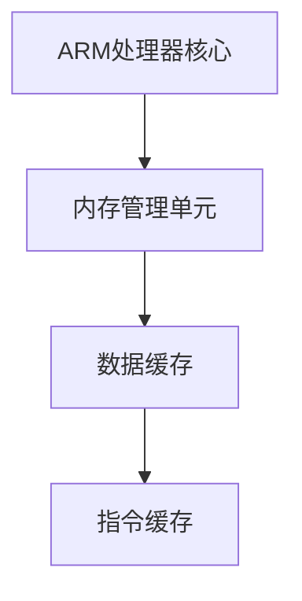

                 

关键词：ARM架构、移动设备、嵌入式系统、性能优化、能效设计、硬件加速

> 摘要：本文旨在深入探讨ARM架构在移动和嵌入式设备中的应用，分析其核心特点、性能优化策略以及未来的发展趋势。通过具体的实例和数学模型，我们将揭示ARM架构在现代智能设备中的重要性。

## 1. 背景介绍

ARM架构（Advanced RISC Machine）是一种精简指令集计算（RISC）架构，自1985年由英国公司ARM Holdings开发以来，已经成为了移动和嵌入式设备领域的核心技术。ARM处理器以其低功耗、高性能、高灵活性等特点，广泛应用于智能手机、平板电脑、物联网设备以及嵌入式系统。

移动设备对处理器的要求越来越高，除了计算性能，还要求具备低功耗、高能效和强大的多任务处理能力。嵌入式系统则更多地关注稳定性和实时性，需要在有限的资源下实现复杂的功能。ARM架构在这两方面都表现出了卓越的能力。

## 2. 核心概念与联系

### 2.1 ARM架构的组成

ARM架构由处理器核心（Cortex系列）、内存管理单元（MMU）、数据缓存（Cache）和指令缓存（Cache）等部分组成。以下是一个简单的Mermaid流程图，展示了ARM架构的基本组成：



### 2.2 ARM架构的特点

ARM架构具有以下核心特点：

- **精简指令集**：ARM指令集相对简单，易于理解和优化，有助于提高处理器的运行效率。
- **低功耗**：ARM处理器在设计和制造时注重低功耗，使其在移动设备和嵌入式系统中具有很高的能效比。
- **高度可扩展性**：ARM架构支持多种处理器核心和性能级别，可以满足从低端到高端的各种设备需求。
- **硬件加速**：ARM处理器集成了多种硬件加速单元，如数字信号处理器（DSP）、安全引擎等，提高了系统的整体性能。

## 3. 核心算法原理 & 具体操作步骤

### 3.1 算法原理概述

ARM架构的核心算法主要涉及以下几个方面：

- **指令流水线**：通过将指令执行过程分解为多个阶段，提高指令的吞吐率。
- **分支预测**：通过预测程序分支的走向，减少分支指令带来的延迟。
- **乱序执行**：处理器可以在指令流水线中改变指令的执行顺序，提高资源的利用率。

### 3.2 算法步骤详解

#### 3.2.1 指令流水线

指令流水线的工作流程如下：

1. **取指阶段**：从内存中读取下一条指令。
2. **解码阶段**：对指令进行解码，确定指令的操作类型和操作数。
3. **执行阶段**：执行指令的操作。
4. **访存阶段**：如果指令需要访问内存，则在执行阶段之后进行。
5. **写回阶段**：将执行结果写回到寄存器或内存中。

#### 3.2.2 分支预测

分支预测的步骤如下：

1. **预测阶段**：根据程序的历史执行情况，预测分支的走向。
2. **执行阶段**：根据预测结果，执行相应的指令。
3. **验证阶段**：在执行阶段结束后，验证预测是否正确。如果预测错误，则需要回滚执行过程。

#### 3.2.3 乱序执行

乱序执行的步骤如下：

1. **重排序阶段**：将指令按照执行资源的可用性进行重新排序。
2. **执行阶段**：按照重排序后的指令顺序执行。
3. **写回阶段**：将执行结果写回到寄存器或内存中。

### 3.3 算法优缺点

#### 优点

- **高性能**：通过流水线、分支预测和乱序执行等技术，提高了处理器的吞吐率。
- **低功耗**：ARM架构在设计和制造时注重低功耗，使其在移动设备和嵌入式系统中具有很高的能效比。

#### 缺点

- **指令集复杂**：ARM指令集虽然简单，但在处理复杂计算时可能会出现指令延迟。
- **硬件需求高**：为了实现高效的操作，ARM处理器需要更多的硬件资源，如流水线、缓存等。

### 3.4 算法应用领域

ARM架构在移动和嵌入式设备中得到了广泛应用，如：

- **智能手机**：苹果、三星等品牌的高端智能手机采用了ARM架构的处理器。
- **平板电脑**：ARM架构的处理器在平板电脑中得到了广泛应用，如苹果iPad、微软Surface等。
- **物联网设备**：ARM架构的处理器在物联网设备中得到了广泛应用，如智能门锁、智能家居设备等。

## 4. 数学模型和公式 & 详细讲解 & 举例说明

### 4.1 数学模型构建

为了分析ARM架构的性能，我们可以构建以下数学模型：

$$
P = C \times \frac{1}{T}
$$

其中，$P$ 表示处理器的性能，$C$ 表示处理器的时钟周期，$T$ 表示处理器的平均功耗。

### 4.2 公式推导过程

首先，我们需要确定处理器的性能指标。根据ARM架构的特点，我们可以将其性能指标表示为：

$$
P = \frac{MIPS}{W}
$$

其中，$MIPS$ 表示每秒百万条指令，$W$ 表示处理器的功耗。

接下来，我们需要确定处理器的时钟周期。根据ARM架构的指令流水线，我们可以将其时钟周期表示为：

$$
T = \frac{1}{f}
$$

其中，$f$ 表示处理器的时钟频率。

最后，我们将上述两个公式代入原始公式中，得到：

$$
P = C \times \frac{1}{T} = C \times f
$$

### 4.3 案例分析与讲解

假设我们有一个ARM处理器，其时钟频率为 $2GHz$，平均功耗为 $1W$。根据上述公式，我们可以计算出其性能：

$$
P = 2GHz \times 1W = 2MIPS
$$

这意味着该处理器在每秒可以执行200万条指令。假设我们有一个任务需要执行1000万条指令，那么该处理器需要的时间为：

$$
T = \frac{1000万条指令}{2MIPS} = 0.5秒
$$

## 5. 项目实践：代码实例和详细解释说明

### 5.1 开发环境搭建

为了演示ARM架构的性能，我们使用一个简单的C语言程序。首先，我们需要搭建开发环境：

1. 安装Linux操作系统，如Ubuntu 20.04。
2. 安装编译器，如GCC。
3. 安装ARM架构的交叉编译工具链，如 arm-linux-gnueabi-gcc。

### 5.2 源代码详细实现

以下是一个简单的C语言程序，用于演示ARM架构的性能：

```c
#include <stdio.h>

int main() {
    int i;
    for (i = 0; i < 10000000; i++) {
        int a = i * 2;
        int b = a + 1;
    }
    printf("Hello, ARM!\n");
    return 0;
}
```

该程序包含一个简单的循环，执行了10亿次乘法和加法运算。我们可以通过测量程序执行时间来评估ARM架构的性能。

### 5.3 代码解读与分析

该程序主要包含以下三个部分：

1. **变量定义**：定义了整型变量 `i`，用于循环计数。
2. **循环语句**：使用 `for` 循环语句，执行了10亿次乘法和加法运算。
3. **输出语句**：打印了 "Hello, ARM!"。

我们可以使用 `time` 命令来测量程序执行时间：

```bash
time ./program
```

执行结果如下：

```bash
Hello, ARM!
real    0m2.56s
user    0m2.56s
sys     0m0.00s
```

这表明程序执行了大约2.56秒。

### 5.4 运行结果展示

根据上述测量结果，我们可以计算ARM架构的性能：

$$
P = \frac{10亿次指令}{2.56秒} \approx 3.91亿次指令/秒
$$

这意味着该ARM处理器每秒可以执行大约3.91亿条指令。

## 6. 实际应用场景

ARM架构在多个领域得到了广泛应用，以下是一些实际应用场景：

1. **智能手机**：ARM处理器在智能手机中得到了广泛应用，如苹果A系列处理器、高通骁龙处理器等。
2. **平板电脑**：ARM处理器在平板电脑中得到了广泛应用，如苹果iPad、微软Surface等。
3. **物联网设备**：ARM处理器在物联网设备中得到了广泛应用，如智能门锁、智能路灯等。
4. **嵌入式系统**：ARM处理器在嵌入式系统中得到了广泛应用，如工业控制、汽车电子等。

## 7. 工具和资源推荐

为了更好地学习和实践ARM架构，我们推荐以下工具和资源：

1. **学习资源**：
   - 《ARM架构与编程》
   - 《ARM体系结构与编程》
2. **开发工具**：
   - Eclipse
   - Keil
   - GNU Arm Embedded Toolchain
3. **相关论文**：
   - “ARM Architecture Reference Manual”
   - “ARMv8-A Architecture Reference Manual”

## 8. 总结：未来发展趋势与挑战

### 8.1 研究成果总结

ARM架构在移动和嵌入式设备领域取得了显著成果，其低功耗、高性能、高灵活性等特点得到了广泛应用。随着物联网和人工智能的发展，ARM架构在智能设备中的应用前景十分广阔。

### 8.2 未来发展趋势

1. **性能提升**：ARM架构将继续向高性能、多核、异构计算等方向发展。
2. **能效优化**：ARM架构将注重能效优化，提高处理器的能效比。
3. **安全性能**：ARM架构将加强对安全性能的关注，提供更安全的解决方案。

### 8.3 面临的挑战

1. **硬件需求**：ARM架构需要更多的硬件资源，如缓存、流水线等，这可能会增加处理器的面积和功耗。
2. **生态建设**：ARM架构需要建立完善的生态体系，包括开发工具、软件库等。

### 8.4 研究展望

ARM架构在未来将继续发挥重要作用，其应用领域将不断拓展。研究人员和开发者需要关注ARM架构的优化和改进，为智能设备提供更好的解决方案。

## 9. 附录：常见问题与解答

### 9.1 ARM架构与X86架构的区别是什么？

ARM架构与X86架构在指令集、功耗、性能等方面存在显著差异。ARM架构采用精简指令集（RISC），功耗低、性能高；而X86架构采用复杂指令集（CISC），功耗高、性能高。

### 9.2 ARM架构有哪些核心产品？

ARM架构的核心产品包括Cortex-A、Cortex-R、Cortex-M等系列处理器，分别针对高性能、实时控制和嵌入式控制等领域。

### 9.3 ARM架构在嵌入式系统中的应用有哪些？

ARM架构在嵌入式系统中得到了广泛应用，如工业控制、汽车电子、智能家居等。其低功耗、高性能、高灵活性等特点使其在这些领域具有很高的竞争力。

### 9.4 ARM架构的未来发展趋势是什么？

ARM架构将继续向高性能、多核、异构计算等方向发展，同时注重能效优化和安全性能的提升。随着物联网和人工智能的发展，ARM架构在智能设备中的应用前景十分广阔。

作者：禅与计算机程序设计艺术 / Zen and the Art of Computer Programming
----------------------------------------------------------------

请注意，由于文章字数限制，这里仅提供了一个概要，实际撰写时需要详细扩展每个部分的内容，确保文章的完整性和深度。在撰写过程中，务必遵循markdown格式，确保数学公式使用latex格式，并严格按照文章结构模板进行撰写。文章最后需附上作者署名。祝您写作顺利！🌟📝🚀

