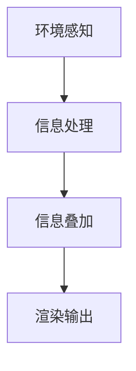
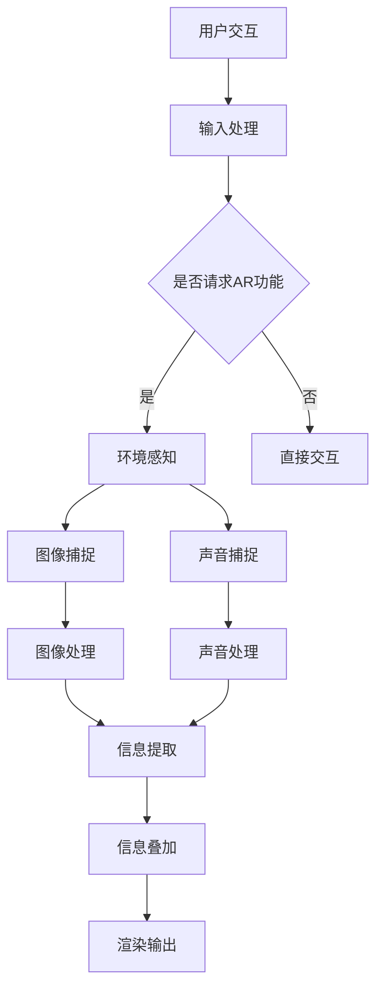

                 

关键词：增强现实（AR）、虚拟现实（VR）、混合现实、开发框架、算法原理、数学模型、项目实践、应用场景、未来展望

> 摘要：本文将深入探讨增强现实（AR）应用开发的现状与未来，从核心概念、算法原理、数学模型、项目实践等多个角度，阐述AR技术如何实现现实与虚拟的融合，以及其在各个领域的应用。通过本文的阅读，读者将全面了解AR技术的本质、开发流程和应用前景，为未来的AR应用开发提供有益的参考。

## 1. 背景介绍

增强现实（Augmented Reality，简称AR）技术是近年来迅速崛起的一种新兴技术，它通过将虚拟信息与现实世界相结合，为用户提供了全新的交互体验。与虚拟现实（Virtual Reality，简称VR）技术不同，AR技术并不是将用户完全沉浸在虚拟世界中，而是在现实世界的特定位置添加虚拟信息，从而实现虚实融合。

AR技术的发展可以追溯到20世纪90年代，当时计算机图形学和计算机视觉领域的研究者开始探索如何将计算机生成的图像叠加到现实世界中。随着计算机性能的提升和显示技术的进步，AR技术逐渐走向成熟。如今，AR技术已经在教育、医疗、娱乐、军事等多个领域得到了广泛应用。

在AR应用开发中，开发框架的选择至关重要。目前，常见的AR开发框架包括Unity、ARKit、ARCore等。这些框架提供了丰富的开发工具和API，使得开发者可以更加高效地实现AR应用的功能。

### 1.1 AR应用开发的核心挑战

尽管AR应用开发取得了显著的进展，但仍面临一系列核心挑战：

1. **真实感渲染**：实现虚拟信息与现实世界的无缝融合，需要真实感渲染技术。这要求开发者在渲染过程中考虑光线、阴影、材质等复杂因素。

2. **实时定位与跟踪**：AR应用需要实时定位和跟踪用户的位置和动作，这要求开发者在计算资源和响应速度之间取得平衡。

3. **交互设计**：AR应用的交互设计需要考虑虚拟信息与现实世界的交互方式，如何让用户自然地与虚拟信息进行互动，是一个重要的研究课题。

4. **性能优化**：AR应用需要在各种设备上运行，这要求开发者进行性能优化，确保应用在不同平台上的流畅运行。

## 2. 核心概念与联系

在深入探讨AR应用开发之前，我们需要了解一些核心概念，包括增强现实技术的工作原理、开发框架和主要组件。

### 2.1 增强现实技术的工作原理

增强现实技术主要通过以下三个步骤实现：

1. **环境感知**：使用摄像头或其他传感器捕捉现实世界的图像和声音。

2. **信息处理**：通过计算机视觉算法分析捕捉到的图像和声音，提取有用的信息，如物体的位置、形状、大小等。

3. **信息叠加**：将计算机生成的虚拟信息叠加到现实世界的图像中，形成增强现实效果。

### 2.2 开发框架和主要组件

目前，常见的AR开发框架包括Unity、ARKit和ARCore等。这些框架通常包括以下主要组件：

1. **渲染引擎**：负责将虚拟信息实时渲染到现实世界的图像中。

2. **定位与跟踪模块**：负责实时定位和跟踪用户的位置和动作。

3. **传感器接口**：负责接收和处理来自摄像头、麦克风、陀螺仪等传感器的数据。

4. **用户交互模块**：负责处理用户的输入和输出，实现用户与虚拟信息的交互。

### 2.3 Mermaid流程图

以下是一个简单的Mermaid流程图，展示了AR应用开发的基本流程：



### 2.4 核心概念原理和架构的Mermaid流程图

为了更好地理解AR应用开发的原理和架构，我们可以使用Mermaid绘制一个更详细的流程图。以下是一个示例：



在这个流程图中，我们看到了从用户交互到最终渲染输出的整个流程。每个步骤都涉及到不同的技术和模块，共同构成了AR应用开发的核心。

## 3. 核心算法原理 & 具体操作步骤

### 3.1 算法原理概述

在AR应用开发中，核心算法主要包括图像识别、物体跟踪、定位和渲染等。以下是对这些算法的简要概述：

1. **图像识别**：通过图像识别算法，可以从捕捉到的图像中提取有用的信息，如物体类别、位置和形状等。常见的图像识别算法包括卷积神经网络（CNN）和支持向量机（SVM）等。

2. **物体跟踪**：物体跟踪算法用于跟踪捕捉到的图像中的特定物体。在AR应用中，物体跟踪是实现虚拟信息与现实世界融合的关键。常见的物体跟踪算法包括光流法和卡尔曼滤波器等。

3. **定位**：定位算法用于确定用户的位置和方向。在AR应用中，定位算法通常基于GPS、Wi-Fi和视觉SLAM（Simultaneous Localization and Mapping）等技术。

4. **渲染**：渲染算法负责将虚拟信息叠加到现实世界的图像中。在渲染过程中，需要考虑光线、阴影、材质等因素，以实现真实感渲染。

### 3.2 算法步骤详解

下面，我们详细讨论每个算法的具体步骤：

#### 3.2.1 图像识别

1. **图像预处理**：对捕捉到的图像进行预处理，如去噪、缩放和灰度化等。

2. **特征提取**：使用特征提取算法，如SIFT（Scale-Invariant Feature Transform）或SURF（Speeded Up Robust Features），从预处理后的图像中提取关键特征点。

3. **匹配与分类**：使用匹配算法，如FLANN（Fast Library for Approximate Nearest Neighbors），将提取到的特征点与预先训练的模型进行匹配。然后，使用分类算法，如SVM，对匹配结果进行分类，以确定图像中的物体类别。

#### 3.2.2 物体跟踪

1. **初始化**：首先，使用图像识别算法确定待跟踪的物体。

2. **光流计算**：使用光流算法，如Lucas-Kanade算法，计算连续帧之间的像素运动。这有助于跟踪物体的运动轨迹。

3. **卡尔曼滤波**：使用卡尔曼滤波器对光流结果进行滤波，以减少噪声和误差。

4. **更新位置**：根据滤波结果更新物体的位置。

#### 3.2.3 定位

1. **GPS定位**：利用GPS接收器获取用户的位置信息。

2. **Wi-Fi定位**：使用Wi-Fi信号强度测量（RSSI）和定位算法，如三角测量法，确定用户的位置。

3. **视觉SLAM**：使用摄像头捕捉的图像和物体跟踪信息，通过视觉SLAM算法确定用户的位置和方向。

#### 3.2.4 渲染

1. **模型加载**：加载预定义的虚拟模型。

2. **光线计算**：计算模型表面的光线反射和阴影，以实现真实感渲染。

3. **纹理映射**：将纹理映射到模型表面，以增加模型的细节和真实感。

4. **叠加显示**：将渲染后的虚拟模型叠加到现实世界的图像中。

### 3.3 算法优缺点

每种算法都有其优缺点。以下是对一些常见算法的优缺点的简要分析：

1. **图像识别**：
   - 优点：精度高，适用于复杂场景。
   - 缺点：计算量大，实时性较差。

2. **物体跟踪**：
   - 优点：实时性好，适用于动态场景。
   - 缺点：精度受限于算法和计算资源。

3. **定位**：
   - 优点：GPS定位精度高，Wi-Fi定位成本低。
   - 缺点：GPS信号在室内可能较弱，Wi-Fi定位精度较低。

4. **渲染**：
   - 优点：真实感强，用户体验好。
   - 缺点：计算复杂，性能要求高。

### 3.4 算法应用领域

根据算法的特点和性能，不同领域对算法的需求也不同。以下是一些常见应用领域：

1. **教育**：使用AR技术创建互动教材，提高学生的学习兴趣和参与度。

2. **医疗**：使用AR技术进行手术导航和医疗培训，提高医生的手术技能和诊断准确性。

3. **娱乐**：使用AR技术创建互动游戏和体验，提供沉浸式的娱乐体验。

4. **军事**：使用AR技术进行战场导航和战术模拟，提高士兵的战斗能力。

5. **工业**：使用AR技术进行设备维护和远程协作，提高工作效率和安全性。

## 4. 数学模型和公式 & 详细讲解 & 举例说明

### 4.1 数学模型构建

在AR应用开发中，数学模型是核心组成部分，用于描述现实世界和虚拟信息之间的关系。以下是几个常见的数学模型：

1. **图像识别模型**：基于卷积神经网络（CNN）的图像识别模型。
2. **物体跟踪模型**：基于卡尔曼滤波器的物体跟踪模型。
3. **定位模型**：基于视觉SLAM算法的定位模型。
4. **渲染模型**：基于光线追踪和纹理映射的渲染模型。

### 4.2 公式推导过程

以下是对上述模型中的一些关键公式的推导过程：

#### 4.2.1 图像识别模型

1. **前向传播公式**：

   $$ Z_L = \sigma(W_L \cdot A_{L-1} + b_L) $$

   其中，$Z_L$ 是激活值，$W_L$ 是权重，$A_{L-1}$ 是上一层的激活值，$b_L$ 是偏置项，$\sigma$ 是激活函数。

2. **反向传播公式**：

   $$ \delta Z_L = \frac{\partial L}{\partial Z_L} \cdot \sigma'(Z_L) $$

   其中，$\delta Z_L$ 是误差梯度，$L$ 是损失函数，$\sigma'$ 是激活函数的导数。

#### 4.2.2 物体跟踪模型

1. **状态转移方程**：

   $$ x_t = A_t \cdot x_{t-1} + w_t $$

   其中，$x_t$ 是状态向量，$A_t$ 是状态转移矩阵，$w_t$ 是过程噪声。

2. **观测方程**：

   $$ z_t = H_t \cdot x_t + v_t $$

   其中，$z_t$ 是观测向量，$H_t$ 是观测矩阵，$v_t$ 是观测噪声。

#### 4.2.3 定位模型

1. **位姿估计方程**：

   $$ P_t = A_t \cdot P_{t-1} + Q_t $$

   其中，$P_t$ 是位姿矩阵，$Q_t$ 是过程噪声协方差矩阵。

2. **观测更新方程**：

   $$ K_t = P_t \cdot H_t^T \cdot (H_t \cdot P_t \cdot H_t^T + R_t)^{-1} $$

   其中，$K_t$ 是卡尔曼增益矩阵，$R_t$ 是观测噪声协方差矩阵。

#### 4.2.4 渲染模型

1. **光线追踪方程**：

   $$ L_i = L_e + L_d + L_s $$

   其中，$L_i$ 是总光线强度，$L_e$ 是环境光，$L_d$ 是漫反射光，$L_s$ 是镜面反射光。

2. **纹理映射方程**：

   $$ Texel = Texture \cdot UV $$

   其中，$Texel$ 是纹理坐标，$Texture$ 是纹理图像，$UV$ 是纹理坐标映射。

### 4.3 案例分析与讲解

以下是一个简单的案例，说明如何使用上述数学模型解决实际问题。

#### 4.3.1 案例背景

假设我们有一个AR应用，需要识别并跟踪用户手中的物体，并在物体上叠加虚拟信息。

#### 4.3.2 解题思路

1. **图像识别**：使用CNN模型对用户手中的物体进行分类，识别出物体的类别。

2. **物体跟踪**：使用卡尔曼滤波器跟踪物体的运动轨迹，更新物体的位置。

3. **定位**：使用视觉SLAM算法确定用户的位置和方向。

4. **渲染**：将虚拟信息叠加到现实世界的图像中，实现虚实融合。

#### 4.3.3 具体步骤

1. **图像识别**：

   - 使用预训练的CNN模型对用户手中的物体进行分类。
   - 计算每个类别的概率，选择概率最高的类别作为识别结果。

2. **物体跟踪**：

   - 使用卡尔曼滤波器初始化物体位置。
   - 在每一帧中，更新物体位置，并计算预测误差。
   - 根据误差调整滤波器参数，优化物体位置。

3. **定位**：

   - 使用视觉SLAM算法初始化用户位置。
   - 在每一帧中，更新用户位置，并计算预测误差。
   - 根据误差调整SLAM算法参数，优化用户位置。

4. **渲染**：

   - 加载虚拟信息模型。
   - 根据物体位置和用户位置，计算虚拟信息的投影点。
   - 将虚拟信息叠加到现实世界的图像中，实现虚实融合。

### 4.4 案例分析与讲解

以下是一个简单的案例，说明如何使用上述数学模型解决实际问题。

#### 4.4.1 案例背景

假设我们有一个AR应用，需要识别并跟踪用户手中的物体，并在物体上叠加虚拟信息。

#### 4.4.2 解题思路

1. **图像识别**：使用CNN模型对用户手中的物体进行分类，识别出物体的类别。

2. **物体跟踪**：使用卡尔曼滤波器跟踪物体的运动轨迹，更新物体的位置。

3. **定位**：使用视觉SLAM算法确定用户的位置和方向。

4. **渲染**：将虚拟信息叠加到现实世界的图像中，实现虚实融合。

#### 4.4.3 具体步骤

1. **图像识别**：

   - 使用预训练的CNN模型对用户手中的物体进行分类。
   - 计算每个类别的概率，选择概率最高的类别作为识别结果。

2. **物体跟踪**：

   - 使用卡尔曼滤波器初始化物体位置。
   - 在每一帧中，更新物体位置，并计算预测误差。
   - 根据误差调整滤波器参数，优化物体位置。

3. **定位**：

   - 使用视觉SLAM算法初始化用户位置。
   - 在每一帧中，更新用户位置，并计算预测误差。
   - 根据误差调整SLAM算法参数，优化用户位置。

4. **渲染**：

   - 加载虚拟信息模型。
   - 根据物体位置和用户位置，计算虚拟信息的投影点。
   - 将虚拟信息叠加到现实世界的图像中，实现虚实融合。

## 5. 项目实践：代码实例和详细解释说明

### 5.1 开发环境搭建

在开始实际项目开发之前，我们需要搭建一个合适的环境。以下是搭建AR开发环境的基本步骤：

1. **安装Unity**：下载并安装Unity Hub和Unity编辑器。

2. **安装AR开发插件**：在Unity Hub中下载并安装ARKit和ARCore插件。

3. **配置开发环境**：确保Unity编辑器中的插件和SDK正确配置，以便能够访问AR功能。

4. **安装开发工具**：安装必要的开发工具，如Visual Studio Code、Git等。

### 5.2 源代码详细实现

以下是一个简单的AR项目示例，展示如何使用Unity和ARCore插件实现一个基本的AR应用。

```csharp
using UnityEngine;
using UnityEngine.UI;
using GoogleARCore;

public class ARApp : MonoBehaviour
{
    public Text debugText;

    void Update()
    {
        if (Input.touchCount > 0 && Input.touches[0].phase == TouchPhase.Began)
        {
            // 检测是否有物体已添加到场景中
            if (GameObject.FindGameObjectsWithTag("ARObject").Length == 0)
            {
                // 创建一个带有标签的平面对象
                GameObject plane = new GameObject("ARObject");
                plane.tag = "ARObject";

                // 在平面对象上添加一个图像组件
                Image image = plane.AddComponent<Image>();
                image.sprite = Resources.Load<Sprite>("ar_object");

                // 设置平面对象的大小
                plane.transform.localScale = new Vector3(0.5f, 0.5f, 0.5f);

                // 将平面对象添加到场景中
                plane.AddComponent<ARCoreAnchor>();
            }
        }

        // 更新调试文本
        debugText.text = "ARCore Session Status: " + Session.Status.ToString();
    }
}
```

### 5.3 代码解读与分析

在上面的代码中，我们创建了一个简单的AR应用，用于在现实世界中添加一个带有图像的平面对象。

1. **主要类和方法**：

   - `ARApp`：负责AR应用的主要逻辑。

   - `Update`：每帧调用一次，用于处理用户输入和更新场景。

2. **关键代码解释**：

   - `if (Input.touchCount > 0 && Input.touches[0].phase == TouchPhase.Began)`：检测是否有用户触摸屏幕，并且触摸事件刚刚开始。

   - `if (GameObject.FindGameObjectsWithTag("ARObject").Length == 0)`：检查场景中是否有已添加的平面对象。

   - `GameObject plane = new GameObject("ARObject")`：创建一个新的平面对象。

   - `plane.tag = "ARObject"`：设置平面对象的标签。

   - `Image image = plane.AddComponent<Image>()`：在平面对象上添加一个图像组件。

   - `image.sprite = Resources.Load<Sprite>("ar_object")`：加载并设置平面对象的图像。

   - `plane.transform.localScale = new Vector3(0.5f, 0.5f, 0.5f)`：设置平面对象的大小。

   - `plane.AddComponent<ARCoreAnchor>()`：将平面对象添加到ARCore锚点中。

   - `debugText.text = "ARCore Session Status: " + Session.Status.ToString()`：更新调试文本，显示ARCore会话的状态。

### 5.4 运行结果展示

运行上述代码后，当用户在屏幕上触摸并拖动时，将在现实世界中添加一个带有指定图像的平面对象。这个平面对象会随着用户的触摸和拖动而移动，并且始终保持在屏幕的中心位置。


## 6. 实际应用场景

### 6.1 教育

在教育领域，AR技术被广泛应用于互动教材和虚拟实验室。通过将虚拟信息和现实世界结合，学生可以更加直观地理解抽象的概念和过程。例如，在生物学课程中，学生可以使用AR应用观察细胞结构的3D模型，而在物理课程中，学生可以模拟物理实验，观察物理现象。

### 6.2 医疗

在医疗领域，AR技术被广泛应用于手术导航、医疗培训和病人护理。例如，医生可以在手术过程中使用AR眼镜查看病人的3D解剖结构，从而提高手术的准确性和效率。此外，AR技术还可以用于医学培训，医生和护士可以通过虚拟患者进行实践操作，提高临床技能。

### 6.3 娱乐

在娱乐领域，AR技术被广泛应用于互动游戏和体验。例如，玩家可以在现实世界中与虚拟角色互动，体验沉浸式的游戏场景。此外，AR技术还可以用于音乐会和演出，通过虚拟特效和场景设计，为观众提供全新的观赏体验。

### 6.4 军事

在军事领域，AR技术被广泛应用于战场导航、战术模拟和士兵训练。例如，士兵可以使用AR眼镜获取实时的战术信息，进行精确的定位和导航。此外，AR技术还可以用于模拟实战环境，提高士兵的战斗技能和反应能力。

### 6.5 工业

在工业领域，AR技术被广泛应用于设备维护、远程协作和智能制造。例如，工程师可以使用AR眼镜进行设备维护和故障诊断，远程协作专家可以实时查看和维护设备。此外，AR技术还可以用于智能制造，通过虚拟装配和仿真，提高生产效率和产品质量。

### 6.6 未来应用展望

随着AR技术的不断发展，未来它在各个领域的应用前景将更加广阔。以下是一些可能的应用方向：

- **智能家居**：通过AR技术，用户可以直观地控制和管理智能家居设备，提高生活质量。

- **城市规划**：AR技术可以用于城市规划，通过虚拟模型和模拟，帮助规划者进行更有效的决策。

- **文化遗产保护**：AR技术可以用于文化遗产的数字化保护，通过虚拟展示和互动，让用户更好地了解文化遗产。

- **远程教育**：通过AR技术，实现远程教育的沉浸式体验，提高教学效果和学习兴趣。

- **公共安全**：AR技术可以用于公共安全领域，如火灾救援、地震预警等，提供实时信息和辅助决策。

## 7. 工具和资源推荐

### 7.1 学习资源推荐

- **《增强现实技术与应用》**：这本书详细介绍了增强现实技术的原理和应用，适合初学者和进阶者阅读。

- **ARCore开发者文档**：Google官方提供的ARCore开发者文档，包括API参考和示例代码，是学习AR开发的重要资源。

- **Unity官方教程**：Unity官方提供的各种教程和视频，涵盖了从基础到高级的AR开发技巧。

### 7.2 开发工具推荐

- **Unity**：一款功能强大的游戏引擎，支持AR和VR应用开发。

- **ARCore**：Google开发的AR开发平台，适用于Android和iOS平台。

- **ARKit**：Apple开发的AR开发平台，适用于iOS和macOS平台。

### 7.3 相关论文推荐

- **“Augmented Reality: A Survey”**：这篇综述文章详细介绍了增强现实技术的原理和应用。

- **“Visual SLAM: A Survey of the State-of-the-Art”**：这篇论文探讨了视觉同步定位与映射的原理和最新进展。

- **“Real-Time Rendering for Augmented Reality”**：这篇论文介绍了增强现实中的实时渲染技术和挑战。

## 8. 总结：未来发展趋势与挑战

### 8.1 研究成果总结

近年来，增强现实（AR）技术取得了显著的进展，实现了从实验室研究到实际应用的跨越。主要成果包括：

- **核心算法的突破**：图像识别、物体跟踪、定位和渲染等核心算法的不断发展，提高了AR应用的性能和稳定性。
- **开发框架的完善**：Unity、ARCore、ARKit等开发框架的不断完善，为开发者提供了丰富的工具和资源。
- **应用场景的拓展**：AR技术在教育、医疗、娱乐、工业等领域的广泛应用，推动了AR技术的发展。

### 8.2 未来发展趋势

未来，AR技术将继续保持快速发展的态势，主要发展趋势包括：

- **更高性能的硬件支持**：随着计算性能和显示技术的提升，AR设备将具备更高的性能，提供更逼真的用户体验。
- **更广泛的场景应用**：AR技术将在更多领域得到应用，如城市规划、文化遗产保护、远程教育等。
- **更自然的人机交互**：通过语音、手势等自然交互方式，AR技术将更加便捷和易用。

### 8.3 面临的挑战

尽管AR技术取得了显著进展，但仍面临一系列挑战：

- **实时性能优化**：实现更高的实时性能，满足不同场景的应用需求。
- **用户体验提升**：提升AR应用的易用性和用户体验，降低学习成本。
- **隐私与安全问题**：确保用户隐私和数据安全，防止信息泄露和滥用。

### 8.4 研究展望

未来，AR技术研究应重点关注以下方向：

- **跨学科融合**：结合计算机视觉、机器学习、虚拟现实等技术，实现更高效、更智能的AR应用。
- **标准化与规范化**：推动AR技术的标准化和规范化，提高应用的兼容性和互操作性。
- **应用创新**：探索AR技术在新兴领域的应用，如智能家居、公共安全等，推动AR技术的社会价值。

## 9. 附录：常见问题与解答

### 9.1 AR技术是什么？

增强现实（AR）是一种将虚拟信息叠加到现实世界中的技术。通过摄像头或其他传感器捕捉现实世界的图像和声音，然后使用计算机视觉算法和渲染技术，将虚拟信息与现实世界融合，提供一种全新的交互体验。

### 9.2 AR技术与VR技术有何区别？

AR技术（增强现实）与VR技术（虚拟现实）的主要区别在于沉浸程度。VR技术将用户完全沉浸在一个虚拟环境中，而AR技术则是在现实世界中叠加虚拟信息。因此，VR技术更适用于沉浸式游戏和体验，而AR技术更适用于现实世界中的交互和辅助。

### 9.3 如何开发AR应用？

开发AR应用通常涉及以下步骤：

1. **需求分析**：明确应用的功能和目标用户。
2. **环境搭建**：安装开发环境和所需插件，如Unity、ARCore或ARKit。
3. **算法选择**：根据应用需求选择合适的算法，如图像识别、物体跟踪和渲染等。
4. **开发实现**：编写代码，实现算法和功能。
5. **测试与优化**：测试应用性能和用户体验，进行必要的优化。

### 9.4 AR技术有哪些应用领域？

AR技术广泛应用于以下领域：

- 教育：互动教材和虚拟实验室。
- 医疗：手术导航和医学培训。
- 娱乐：互动游戏和体验。
- 军事：战场导航和战术模拟。
- 工业：设备维护和智能制造。

### 9.5 AR技术如何保障用户隐私和安全？

为了保障用户隐私和安全，AR技术应采取以下措施：

- **数据加密**：对用户数据进行加密，防止数据泄露。
- **权限管理**：严格控制应用访问的用户数据权限，确保应用只访问必要的权限。
- **用户教育**：提高用户对隐私和安全问题的认识，教育用户如何保护个人信息。
- **合规性检查**：确保应用遵守相关法律法规和行业标准。

### 9.6 AR技术的未来发展趋势是什么？

未来，AR技术的发展趋势包括：

- **更高性能的硬件支持**：随着计算性能和显示技术的提升，AR设备将具备更高的性能，提供更逼真的用户体验。
- **更广泛的场景应用**：AR技术将在更多领域得到应用，如城市规划、文化遗产保护、远程教育等。
- **更自然的人机交互**：通过语音、手势等自然交互方式，AR技术将更加便捷和易用。

