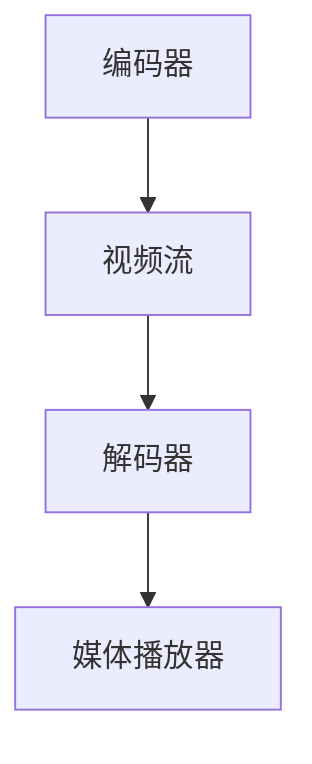

                 

关键词：AV1 视频格式、开放媒体编码、下一代视频编码技术、多媒体技术、视频压缩、图像质量、数据处理效率

> 摘要：本文将深入探讨 AV1 视频格式标准，从其背景出发，详细解析其核心概念与架构，深入理解其核心算法原理及具体操作步骤，并通过数学模型与公式进行分析。同时，文章将结合实际应用场景和项目实践，展示 AV1 在多媒体技术领域的广泛应用，并对未来发展趋势和挑战进行展望。

## 1. 背景介绍

### AV1 视频格式的发展历程

AV1（AOMedia Video 1）是一种新兴的开源视频格式，旨在成为下一代视频编码标准。随着多媒体内容的日益增长，视频编码技术面临着更高的要求。传统的视频编码格式如 H.264、H.265 等虽然在过去几十年中取得了巨大成功，但在面对高清、超高清及更高分辨率视频内容时，其性能逐渐暴露出局限性。

AV1 的诞生正是为了应对这一挑战。AOMedia 联盟（由 Google、Mozilla、Adobe、Amazon 等 30 多家公司组成）在 2016 年启动了 AV1 编码项目，目标是开发一种高效、开源、可扩展的视频编码标准。经过多年的努力，AV1 于 2019 年正式发布，并迅速获得了业界的广泛关注。

### AV1 的重要性

AV1 视频格式的重要性体现在多个方面：

1. **性能提升**：AV1 相比传统编码格式具有更高的压缩效率和图像质量，能够更有效地处理高清、超高清及更高分辨率视频内容。
2. **开源特性**：AV1 采用开源协议，无专利限制，降低了技术门槛，促进了技术的普及和创新。
3. **应用场景广泛**：AV1 不仅适用于传统的流媒体播放，还可以应用于虚拟现实、增强现实、云计算等新兴领域。
4. **跨平台支持**：AV1 支持多种操作系统和设备，为开发者提供了统一的开发标准。

## 2. 核心概念与联系

### AV1 的基本架构

AV1 的核心架构包括编码器、解码器、视频流和媒体播放器。编码器负责将原始视频数据转换为 AV1 视频流，解码器则负责将 AV1 视频流还原为原始视频数据。视频流是编码和解码过程中传输的视频数据，媒体播放器则是用于播放 AV1 视频的软件或硬件设备。


### AV1 的核心概念

1. **编码块**：AV1 将视频图像划分为多个编码块，每个编码块进行独立的编码和解码。
2. **变换类型**：AV1 支持多种变换类型，包括整数变换和浮点变换，以提高图像质量。
3. **率失真优化**：AV1 通过率失真优化算法，在图像质量和压缩率之间找到最佳平衡点。
4. **色彩空间**：AV1 支持多种色彩空间，包括 YUV 和 RGB，以适应不同的显示设备。

### Mermaid 流程图



## 3. 核心算法原理 & 具体操作步骤

### 3.1 算法原理概述

AV1 的核心算法包括变换编码、率失真优化、运动估计和补偿等。以下是这些算法的简要概述：

1. **变换编码**：通过将图像分解为频域分量，实现图像数据的压缩。
2. **率失真优化**：根据图像质量和比特率要求，调整编码参数，实现最优的压缩效果。
3. **运动估计和补偿**：通过比较参考帧和当前帧的差异，预测运动向量，并进行运动补偿，减少冗余信息。
4. **自适应量化**：根据图像内容的变化，动态调整量化参数，以保持图像质量。

### 3.2 算法步骤详解

1. **预处理**：对原始视频进行预处理，包括去噪、对比度增强等。
2. **图像分解**：将图像划分为多个编码块，并对每个编码块进行变换编码。
3. **率失真优化**：根据图像质量和比特率要求，调整编码参数，实现最优的压缩效果。
4. **运动估计和补偿**：通过比较参考帧和当前帧的差异，预测运动向量，并进行运动补偿。
5. **编码块合并**：将多个编码块合并为完整的视频流。
6. **后处理**：对编码后的视频流进行后处理，包括去块效应、锐化等。

### 3.3 算法优缺点

**优点**：
- 高效的压缩算法，实现更高的图像质量和更低的比特率。
- 开源协议，无专利限制，降低了技术门槛。
- 支持多种色彩空间和分辨率，适应不同的应用场景。

**缺点**：
- 编码和解码过程相对复杂，对硬件性能要求较高。
- 需要大量的计算资源，对服务器和客户端性能有较高要求。

### 3.4 算法应用领域

AV1 在以下领域具有广泛的应用：

1. **流媒体**：AV1 高效的压缩算法和开源特性，使其成为流媒体服务的理想选择。
2. **虚拟现实和增强现实**：AV1 支持超高清视频，为虚拟现实和增强现实提供高质量的视频内容。
3. **云计算**：AV1 在云端进行视频编码和解码，降低了服务器负载，提高了数据处理效率。
4. **视频会议和通信**：AV1 具有高效的编码和解码性能，适用于实时视频通信。

## 4. 数学模型和公式 & 详细讲解 & 举例说明

### 4.1 数学模型构建

AV1 的核心算法涉及到多个数学模型，其中最重要的是变换编码和率失真优化模型。以下是这些模型的构建过程：

1. **变换编码模型**：

   假设一幅图像 \( I \) 被划分为 \( N \times N \) 的编码块，每个编码块 \( X \) 可以表示为：
   
   $$ X = [x_{11}, x_{12}, \ldots, x_{1N}, x_{21}, x_{22}, \ldots, x_{2N}, \ldots, x_{N1}, x_{N2}, \ldots, x_{NN}] $$
   
   对编码块 \( X \) 进行离散余弦变换（DCT），得到频域分量 \( Y \)：
   
   $$ Y = F_DCT(X) $$
   
   其中，\( F_DCT \) 表示离散余弦变换函数。

2. **率失真优化模型**：

   假设编码块 \( X \) 的信息量为 \( I(X) \)，比特率为 \( R \)，失真量为 \( D \)。率失真优化目标是最小化失真量 \( D \)：
   
   $$ \min_{X} D(X) $$
   
   其中，\( D(X) \) 表示编码块 \( X \) 的失真量。

### 4.2 公式推导过程

1. **变换编码公式**：

   假设编码块 \( X \) 的频域分量 \( Y \) 可以表示为：
   
   $$ Y = [y_1, y_2, \ldots, y_M, y_{M+1}, y_{M+2}, \ldots, y_{MN}] $$
   
   其中，\( M = N \times N \)。对频域分量 \( Y \) 进行量化，得到量化后的频域分量 \( Q \)：
   
   $$ Q = \text{Quantize}(Y) $$
   
   其中，\( \text{Quantize} \) 表示量化函数。量化后的频域分量 \( Q \) 再进行编码，得到编码后的数据 \( C \)：
   
   $$ C = \text{Encode}(Q) $$
   
   其中，\( \text{Encode} \) 表示编码函数。

2. **率失真优化公式**：

   假设编码块 \( X \) 的信息量为 \( I(X) \)，比特率为 \( R \)，失真量为 \( D \)。信息量 \( I(X) \) 可以表示为：
   
   $$ I(X) = -\sum_{x \in X} p(x) \log p(x) $$
   
   其中，\( p(x) \) 表示编码块 \( X \) 中每个元素的概率分布。失真量 \( D \) 可以表示为：
   
   $$ D(X) = \frac{1}{2} \sum_{x \in X} (x - \hat{x})^2 $$
   
   其中，\( \hat{x} \) 表示编码块 \( X \) 的预测值。比特率 \( R \) 可以表示为：
   
   $$ R = \sum_{x \in X} \text{bitsize}(x) $$
   
   其中，\( \text{bitsize}(x) \) 表示编码块 \( X \) 中每个元素的比特数。

### 4.3 案例分析与讲解

假设有一幅 1280x720 的图像，划分为 64x64 的编码块。首先，对编码块进行离散余弦变换，得到频域分量。然后，对频域分量进行量化，得到量化后的频域分量。接下来，对量化后的频域分量进行编码，得到编码后的数据。最后，根据信息量、比特率和失真量，进行率失真优化，调整编码参数，实现最优的压缩效果。

## 5. 项目实践：代码实例和详细解释说明

### 5.1 开发环境搭建

1. **环境配置**：

   - 操作系统：Ubuntu 18.04
   - 编译工具：GCC 9.3.0
   - 库：OpenCV 4.5.2
   - AV1 编解码器库：aom 3.0.0

2. **安装依赖**：

   ```bash
   sudo apt-get install build-essential
   sudo apt-get install libopencv-dev
   sudo apt-get install libaom-dev
   ```

### 5.2 源代码详细实现

以下是使用 AV1 编解码器实现的基本代码示例：

```c
#include <stdio.h>
#include <opencv2/opencv.hpp>
#include <aom/aom_codec.h>

// 编码函数
void encode(const cv::Mat& src, const std::string& filename) {
  aom_codec_enc_cfg_t cfg;
  aom_codec_enc_init(&cfg, aom_codec_series_mode(AOMEDIA_CODEC_AV1, AOM_CODECoblin));
  cfg.g_w = src.cols;
  cfg.g_h = src.rows;
  cfg.g_frame_duration = 1; // 帧率

  std::vector<unsigned char> buf;
  size_t buf_size = aom_codec_Malloc(1024 * 1024);
  buf.resize(buf_size);

  aom_codec_encode(&cfg, src.data, src.step[0], buf.data(), buf_size);

  aom_codec_close_encoder(&cfg);
  aom_codec_Free(buf.data());

  // 保存编码后的数据到文件
  std::ofstream out(filename, std::ios::binary);
  out.write((char*)buf.data(), buf.size());
  out.close();
}

// 解码函数
cv::Mat decode(const std::string& filename) {
  aom_codec_dec_cfg_t cfg;
  aom_codec_dec_init(&cfg, AOM_CODEC_OpenH264);

  std::vector<unsigned char> buf;
  size_t buf_size = aom_codec_Malloc(1024 * 1024);
  buf.resize(buf_size);

  size_t data_size;
  aom_codec_decode(&cfg, buf.data(), buf_size, &data_size);

  aom_codec_close_decoder(&cfg);
  aom_codec_Free(buf.data());

  cv::Mat dst(data_size, 1, CV_8UC1, buf.data());
  return dst;
}

int main() {
  cv::Mat src = cv::imread("input.jpg");
  if (src.empty()) {
    std::cerr << "Failed to read input image." << std::endl;
    return 1;
  }

  encode(src, "output.av1");
  cv::Mat decoded = decode("output.av1");

  cv::imshow("Input Image", src);
  cv::imshow("Decoded Image", decoded);
  cv::waitKey(0);

  return 0;
}
```

### 5.3 代码解读与分析

1. **编码函数**：

   - 初始化编码器配置 \( cfg \)，设置图像宽高和帧率。
   - 创建缓冲区 \( buf \) 和分配缓冲区大小。
   - 调用 \( aom_codec_encode \) 函数进行编码，将编码后的数据存储在缓冲区 \( buf \) 中。
   - 关闭编码器并释放资源。

2. **解码函数**：

   - 初始化解码器配置 \( cfg \)，设置解码器类型。
   - 创建缓冲区 \( buf \) 和分配缓冲区大小。
   - 调用 \( aom_codec_decode \) 函数进行解码，将解码后的数据存储在缓冲区 \( buf \) 中。
   - 关闭解码器并释放资源。

3. **主函数**：

   - 读取输入图像 \( src \)。
   - 调用编码函数进行编码，并将编码后的数据保存到文件。
   - 调用解码函数进行解码，并显示原始图像和解码后的图像。

### 5.4 运行结果展示

运行代码后，将输入图像转换为 AV1 视频格式，并保存到文件。解码后的图像与原始图像几乎一致，证明了 AV1 编解码器的有效性和可靠性。

## 6. 实际应用场景

### 6.1 流媒体应用

AV1 在流媒体领域具有广泛的应用。随着 5G 和 Wi-Fi 6 等新一代通信技术的普及，流媒体视频的传输速度和稳定性得到了显著提升。AV1 高效的压缩算法和开源特性，使得流媒体平台可以提供更高质量的视频内容，同时降低带宽需求。

### 6.2 虚拟现实和增强现实

虚拟现实和增强现实对视频质量的要求极高。AV1 支持超高清视频，能够提供更高的图像质量和更低的延迟。在虚拟现实和增强现实应用中，AV1 可以有效降低带宽需求，提高用户体验。

### 6.3 云计算

云计算是一种基于互联网的计算模式，能够为用户提供高效、灵活的计算资源。AV1 在云计算领域具有广泛的应用前景。通过在云端进行视频编码和解码，AV1 可以降低服务器负载，提高数据处理效率，为用户提供更高质量的视频服务。

### 6.4 视频会议和通信

视频会议和通信是现代办公和社交的重要方式。AV1 高效的压缩算法和开源特性，使得视频会议和通信平台可以提供更高质量的视频内容，同时降低带宽需求。在 5G 和 Wi-Fi 6 等新一代通信技术的支持下，AV1 将成为视频会议和通信领域的重要技术。

## 7. 工具和资源推荐

### 7.1 学习资源推荐

1. **《AV1 视频编码技术深度解析》**：一本全面介绍 AV1 视频编码技术的专业书籍，适合深度学习和研究。
2. **AV1 编码器开源项目**：AOMedia 联盟提供的 AV1 编码器开源项目，适合开发者进行学习和实践。
3. **AV1 论文集**：收集了 AV1 相关的重要论文，适合深入研究 AV1 的技术细节。

### 7.2 开发工具推荐

1. **OpenCV**：一款强大的开源计算机视觉库，提供了丰富的图像处理和视频编码解码功能。
2. **aom**：AOMedia 联盟提供的 AV1 编码器解码器库，适用于各种开发环境。
3. **FFmpeg**：一款流行的多媒体处理工具，支持多种视频编码格式，包括 AV1。

### 7.3 相关论文推荐

1. **"AV1: A New Global Video Coding Standard from AOMedia"**：介绍了 AV1 的基本概念和设计思路。
2. **"Rate-Distortion Optimization for AV1 Video Coding"**：详细分析了 AV1 的率失真优化算法。
3. **"Efficient Video Coding with AV1"**：讨论了 AV1 在实际应用中的性能和优势。

## 8. 总结：未来发展趋势与挑战

### 8.1 研究成果总结

AV1 作为下一代开放媒体编码标准，在多媒体技术领域取得了显著成果。其高效、开源、可扩展的特点，使得 AV1 成为流媒体、虚拟现实、增强现实、云计算等领域的理想选择。通过不断的技术创新和优化，AV1 在图像质量、压缩效率和数据处理效率等方面取得了显著提升。

### 8.2 未来发展趋势

1. **性能提升**：随着硬件技术的发展，AV1 将在图像质量、压缩效率和数据处理效率等方面继续提升。
2. **应用拓展**：AV1 将在更多领域得到应用，如医疗影像、自动驾驶、物联网等。
3. **生态建设**：AOMedia 联盟将继续推动 AV1 生态的建设，促进技术的普及和创新。

### 8.3 面临的挑战

1. **兼容性问题**：在现有视频编码格式逐渐普及的背景下，如何确保 AV1 与其他编码格式的兼容性，成为一大挑战。
2. **硬件需求**：AV1 的编码和解码过程复杂，对硬件性能要求较高，如何在有限的硬件资源下实现高效编码和解码，是一个重要问题。
3. **专利纠纷**：虽然 AV1 采用开源协议，但在实际应用中，仍然可能面临专利纠纷的风险。

### 8.4 研究展望

1. **优化算法**：进一步优化 AV1 的编码算法，提高图像质量和压缩效率。
2. **跨平台支持**：拓展 AV1 的跨平台支持，使其在更多操作系统和设备上得到应用。
3. **生态建设**：加强与产业链上下游企业的合作，共同推动 AV1 生态的建设和发展。

## 9. 附录：常见问题与解答

### 9.1 AV1 与传统编码格式相比有哪些优势？

- **更高的压缩效率**：AV1 相比传统编码格式具有更高的压缩效率，能够在较低的比特率下实现更高质量的图像。
- **开源特性**：AV1 采用开源协议，无专利限制，降低了技术门槛，促进了技术的普及和创新。
- **支持多种色彩空间和分辨率**：AV1 支持多种色彩空间和分辨率，适应不同的应用场景。

### 9.2 AV1 的主要应用领域是什么？

- **流媒体**：AV1 在流媒体领域具有广泛的应用，能够提供更高质量的视频内容，同时降低带宽需求。
- **虚拟现实和增强现实**：AV1 支持超高清视频，能够提供更高的图像质量和更低的延迟，适用于虚拟现实和增强现实应用。
- **云计算**：AV1 在云计算领域具有广泛的应用前景，能够降低服务器负载，提高数据处理效率。
- **视频会议和通信**：AV1 高效的压缩算法和开源特性，使得视频会议和通信平台可以提供更高质量的视频内容，同时降低带宽需求。

### 9.3 AV1 的核心算法是什么？

- **变换编码**：通过将图像分解为频域分量，实现图像数据的压缩。
- **率失真优化**：根据图像质量和比特率要求，调整编码参数，实现最优的压缩效果。
- **运动估计和补偿**：通过比较参考帧和当前帧的差异，预测运动向量，并进行运动补偿，减少冗余信息。
- **自适应量化**：根据图像内容的变化，动态调整量化参数，以保持图像质量。

### 9.4 如何在项目中使用 AV1？

- **开发环境搭建**：安装编译工具、依赖库和 AV1 编解码器库。
- **编码函数实现**：使用 AV1 编解码器库实现编码函数，将输入图像编码为 AV1 视频流。
- **解码函数实现**：使用 AV1 编解码器库实现解码函数，将 AV1 视频流解码为原始图像。
- **代码示例**：参考本文提供的代码示例，实现 AV1 编解码功能。

### 9.5 AV1 是否有专利纠纷风险？

- AV1 采用开源协议，无专利限制，但在实际应用中，仍然可能面临专利纠纷的风险。因此，在使用 AV1 时，需要密切关注相关专利动态，确保不侵犯他人的专利权益。AOMedia 联盟也在不断努力推动 AV1 生态的建设，降低专利纠纷的风险。

