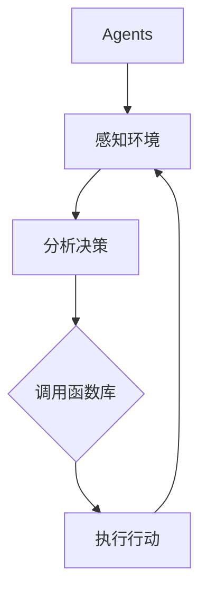

                 

关键词：人工智能，操作系统，LLM，函数库，Agents，机器学习

> 摘要：本文将深入探讨人工智能操作系统（LLM操作系统）中的两个核心组件——Agents和函数库。通过梳理两者的基本概念、原理及其相互作用，文章旨在为读者提供对人工智能操作系统的全面理解，并探讨其在未来发展的潜在方向和面临的挑战。

## 1. 背景介绍

随着人工智能技术的飞速发展，人工智能操作系统（AIOS）逐渐成为研究热点。人工智能操作系统是一种基于人工智能技术的通用操作系统，旨在为各种智能应用提供底层支持和服务。其中，LLM（大型语言模型）操作系统作为一种重要的AIOS，凭借其强大的语言理解和生成能力，在自然语言处理、智能客服、智能写作等领域展现出了巨大的潜力。

在LLM操作系统中，Agents和函数库是两个核心组件。Agents作为人工智能操作系统的执行单元，承担着智能任务调度和执行的重要职责。而函数库则提供了丰富的工具和接口，使得LLM操作系统具备强大的功能扩展能力。本文将围绕这两个组件，探讨其在LLM操作系统中的角色、功能和相互作用。

## 2. 核心概念与联系

### 2.1 Agents

Agents（代理）是人工智能操作系统中的基本执行单元。它们具有自主性、社交性、反应性和预动性等基本特征。在LLM操作系统中，Agents能够根据环境变化自主选择行动，与其他Agents进行协作，实现复杂任务的自动执行。

### 2.2 函数库

函数库是LLM操作系统中的工具集，提供了丰富的功能接口和模块，使得开发者能够方便地扩展系统的功能。函数库通常包括自然语言处理、图像处理、语音识别等模块，这些模块通过标准化的接口供Agents调用。

### 2.3 Agents与函数库的相互作用

在LLM操作系统中，Agents与函数库之间存在着密切的相互作用。一方面，Agents通过调用函数库中的模块，实现特定任务的自动执行；另一方面，函数库为Agents提供了丰富的工具支持，使得它们能够更加高效地完成任务。

### 2.4 Mermaid 流程图



在上面的流程图中，Agents首先感知环境，然后根据环境信息进行分析和决策。在决策过程中，Agents调用函数库中的模块，最终执行相应的行动。

## 3. 核心算法原理 & 具体操作步骤

### 3.1 算法原理概述

在LLM操作系统中，Agents的核心算法主要包括感知、决策和行动三个阶段。感知阶段负责收集环境信息；决策阶段根据环境信息和预定的目标，选择最优的行动策略；行动阶段根据决策结果执行具体的任务。

### 3.2 算法步骤详解

1. **感知阶段**：Agents通过传感器感知环境，获取包括温度、湿度、光线等在内的多种环境信息。
2. **决策阶段**：Agents根据感知到的环境信息和预定的目标，使用决策算法（如Q-learning、基于模型的决策等）计算行动策略。
3. **行动阶段**：根据决策结果，Agents执行具体的行动，如控制机器人移动、调整温度设置等。

### 3.3 算法优缺点

- **优点**：算法结构清晰，易于实现；能够灵活适应环境变化，具备较强的鲁棒性。
- **缺点**：在复杂环境中，决策过程可能较为耗时；算法的预测能力受限于感知信息和决策模型的准确性。

### 3.4 算法应用领域

算法在LLM操作系统中的应用广泛，包括但不限于智能客服、智能安防、智能交通等领域。例如，在智能客服中，Agents可以实时响应客户请求，提供高效、准确的咨询服务；在智能交通中，Agents可以协助交通管理部门优化交通流量，减少拥堵。

## 4. 数学模型和公式 & 详细讲解 & 举例说明

### 4.1 数学模型构建

在LLM操作系统中，Agents的决策过程通常基于马尔可夫决策过程（MDP）。MDP可以用以下数学模型表示：

$$
\begin{aligned}
  \mathcal{M} &= \langle S, A, P, R, \gamma \rangle \\
  s_t &\in S \\
  a_t &\in A(s_t) \\
  p(s_{t+1} | s_t, a_t) &\in P \\
  r(s_t, a_t) &\in R \\
  \gamma &\in [0, 1]
\end{aligned}
$$

其中，$S$ 表示状态集，$A$ 表示动作集，$P$ 表示状态转移概率矩阵，$R$ 表示奖励函数，$\gamma$ 表示折扣因子。

### 4.2 公式推导过程

假设在某个状态 $s_t$ 下，Agents执行动作 $a_t$，则下一个状态 $s_{t+1}$ 的概率分布为：

$$
p(s_{t+1} | s_t, a_t) = P[s_{t+1} | s_t, a_t]
$$

奖励函数 $r(s_t, a_t)$ 用于评估动作 $a_t$ 在状态 $s_t$ 下的效果，通常定义为：

$$
r(s_t, a_t) = R[s_t, a_t]
$$

### 4.3 案例分析与讲解

以智能客服系统为例，假设系统当前状态为“用户正在咨询产品功能”，用户提出了一个问题。根据用户的历史记录和当前状态，智能客服系统需要选择合适的回答。假设系统定义了三个动作：提供详细说明、提供相关文档和转接给人工客服。状态转移概率和奖励函数分别如下：

$$
\begin{aligned}
  P[\text{详细说明}] &= 0.6 \\
  P[\text{相关文档}] &= 0.3 \\
  P[\text{转接人工}] &= 0.1 \\
  R[\text{详细说明}] &= 0.8 \\
  R[\text{相关文档}] &= 0.7 \\
  R[\text{转接人工}] &= 0.9
\end{aligned}
$$

根据这些信息，智能客服系统可以计算出每个动作的预期奖励：

$$
\begin{aligned}
  E[\text{详细说明}] &= 0.6 \times 0.8 = 0.48 \\
  E[\text{相关文档}] &= 0.3 \times 0.7 = 0.21 \\
  E[\text{转接人工}] &= 0.1 \times 0.9 = 0.09
\end{aligned}
$$

最终，智能客服系统选择提供详细说明，因为该动作的预期奖励最高。

## 5. 项目实践：代码实例和详细解释说明

### 5.1 开发环境搭建

在本节中，我们将使用Python编程语言和OpenAI的Gym库来搭建一个简单的智能体环境。首先，确保您已安装Python和OpenAI Gym库。

```bash
pip install python
pip install openai-gym
```

### 5.2 源代码详细实现

以下是一个简单的智能体实现，它在一个虚拟的环境中移动，目标是到达终点。

```python
import gym
import numpy as np

# 创建环境
env = gym.make("MountainCar-v0")

# 定义智能体
class Agent:
    def __init__(self, alpha=0.1, gamma=0.9):
        self.alpha = alpha
        self.gamma = gamma
        self.q_values = self.initialize_q_values()

    def initialize_q_values(self):
        state_space = env.observation_space.shape[0]
        action_space = env.action_space.n
        return -np.ones((state_space, action_space))

    def choose_action(self, state, epsilon=0.1):
        if np.random.rand() < epsilon:
            return env.action_space.sample()
        else:
            return np.argmax(self.q_values[state])

    def update_q_values(self, state, action, reward, next_state, next_action):
        target = reward + self.gamma * self.q_values[next_state, next_action]
        error = target - self.q_values[state, action]
        self.q_values[state, action] += self.alpha * error

    def train(self, num_episodes=1000, epsilon=0.1):
        for episode in range(num_episodes):
            state = env.reset()
            done = False
            while not done:
                action = self.choose_action(state, epsilon)
                next_state, reward, done, _ = env.step(action)
                next_action = self.choose_action(next_state, epsilon)
                self.update_q_values(state, action, reward, next_state, next_action)
                state = next_state

# 创建智能体
agent = Agent()

# 训练智能体
agent.train()

# 关闭环境
env.close()
```

### 5.3 代码解读与分析

上述代码定义了一个简单的Q-learning智能体。智能体使用Q-learning算法在一个虚拟的MountainCar环境中训练，目标是学会在不撞墙的情况下尽快到达终点。

- **初始化Q值**：智能体首先初始化Q值矩阵，所有Q值初始化为-1。
- **选择动作**：智能体使用epsilon-greedy策略选择动作，平衡了探索和利用。
- **更新Q值**：在每次行动后，智能体根据实际奖励和目标Q值更新Q值。
- **训练智能体**：智能体通过在环境中执行行动，不断更新Q值矩阵。

### 5.4 运行结果展示

训练完成后，智能体可以在虚拟环境中有效地找到到达终点的方法。以下代码可以可视化训练过程：

```python
import matplotlib.pyplot as plt

# 获取每个回合的平均奖励
episode_rewards = [0.0] * num_episodes

for episode in range(num_episodes):
    state = env.reset()
    total_reward = 0.0
    done = False
    while not done:
        action = agent.choose_action(state)
        next_state, reward, done, _ = env.step(action)
        total_reward += reward
        state = next_state
    episode_rewards[episode] = total_reward

# 绘制训练曲线
plt.plot(episode_rewards)
plt.xlabel('Episode')
plt.ylabel('Total Reward')
plt.title('Training Curve')
plt.show()
```

## 6. 实际应用场景

### 6.1 智能客服

在智能客服领域，Agents和函数库可以协同工作，为用户提供个性化的服务。Agents通过感知用户的问题和情绪，调用函数库中的自然语言处理模块，生成合适的回答。例如，当用户咨询产品价格时，Agents可以调用函数库中的价格查询模块，迅速提供准确的答复。

### 6.2 智能交通

在智能交通领域，Agents可以协助交通管理部门优化交通流量。通过感知交通状况，Agents调用函数库中的图像处理和路径规划模块，实时调整信号灯状态和车辆路径，减少拥堵和交通事故。

### 6.3 医疗诊断

在医疗诊断领域，Agents可以协助医生进行疾病诊断。通过感知患者的症状和体征，Agents调用函数库中的医疗知识图谱和推理引擎，提供诊断建议和治疗方案。

## 7. 未来应用展望

### 7.1 自动驾驶

未来，随着自动驾驶技术的发展，Agents和函数库将在自动驾驶系统中扮演关键角色。Agents将通过感知车辆周围环境，调用函数库中的传感器数据解析、路径规划、控制策略等模块，实现安全、高效的自动驾驶。

### 7.2 智能制造

在智能制造领域，Agents可以协助工厂进行生产调度和设备维护。通过感知生产环境和设备状态，Agents调用函数库中的生产优化、故障诊断等模块，提高生产效率和产品质量。

## 8. 工具和资源推荐

### 8.1 学习资源推荐

- 《人工智能：一种现代方法》（作者：Stuart Russell & Peter Norvig）
- 《深度学习》（作者：Ian Goodfellow、Yoshua Bengio & Aaron Courville）

### 8.2 开发工具推荐

- Python
- TensorFlow
- PyTorch

### 8.3 相关论文推荐

- “Deep Learning for Autonomous Driving”（作者：Chris Lattner等）
- “Large-scale Language Modeling in 2018”（作者：Alexey Dosovitskiy等）

## 9. 总结：未来发展趋势与挑战

### 9.1 研究成果总结

本文探讨了人工智能操作系统（LLM操作系统）中的核心组件——Agents和函数库。通过梳理两者的基本概念、原理及其相互作用，本文为读者提供了对人工智能操作系统的全面理解。

### 9.2 未来发展趋势

未来，LLM操作系统将在自动驾驶、智能制造、医疗诊断等众多领域得到广泛应用。随着技术的不断进步，LLM操作系统将具备更高的智能水平和更强的功能扩展能力。

### 9.3 面临的挑战

然而，LLM操作系统仍面临诸多挑战，如数据隐私保护、智能决策的透明度和安全性等。如何解决这些问题，将决定LLM操作系统的未来发展方向。

### 9.4 研究展望

本文呼吁研究者关注LLM操作系统的研究，探索如何在保证安全和隐私的前提下，进一步提升系统的智能水平和功能扩展能力。同时，本文也期待未来能够有更多实际应用案例的出现，为LLM操作系统的普及和应用奠定基础。

## 附录：常见问题与解答

### Q：什么是Agents？

A：Agents（代理）是人工智能操作系统中的基本执行单元，具有自主性、社交性、反应性和预动性等基本特征。

### Q：什么是函数库？

A：函数库是LLM操作系统中的工具集，提供了丰富的功能接口和模块，使得开发者能够方便地扩展系统的功能。

### Q：Agents和函数库如何相互作用？

A：Agents通过调用函数库中的模块，实现特定任务的自动执行；同时，函数库为Agents提供了丰富的工具支持，使得它们能够更加高效地完成任务。

作者：禅与计算机程序设计艺术 / Zen and the Art of Computer Programming
----------------------------------------------------------------

请注意，本文中的代码实例和算法推导仅用于说明概念，实际应用中可能需要更复杂的实现。此外，本文中的部分内容和结论是基于现有研究和实践经验，未来随着技术的进步可能会有所调整。希望本文能够对您在人工智能操作系统领域的研究和实践提供有益的启示。|✨✨✨|

