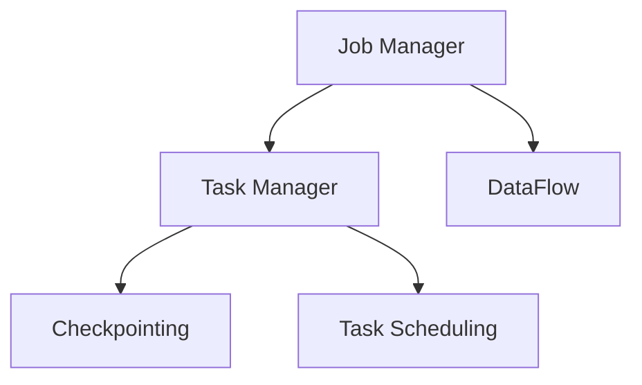

                 

关键词：Apache Flink，实时数据处理，大数据处理，流处理，计算框架

> 摘要：本文深入探讨了Apache Flink作为实时大数据处理框架的核心原理、优势特点、应用场景及未来发展趋势。通过详细的分析和实例，旨在为读者提供全面的技术见解和实际操作指导。

## 1. 背景介绍

在当今快速发展的数字化时代，大数据处理已经成为企业和组织的重要任务。传统的批处理系统由于处理延迟高、响应速度慢，已无法满足实时数据分析的需求。Apache Flink作为一个开源的分布式流处理框架，正是为了解决这一需求而诞生的。Flink不仅支持流处理，同时也具备批处理的强大功能，能够满足从简单实时计算到复杂实时分析等多种应用场景的需求。

Apache Flink诞生于2014年，由数据公司DataArtisans（现为Apache Software Foundation的一个孵化项目）开发，并在2015年加入Apache软件基金会。Flink的设计初衷是为了实现高性能、高可靠性和易扩展的实时数据处理能力。自开源以来，Flink以其强大的功能和良好的性能赢得了广泛的认可和应用。

## 2. 核心概念与联系

### 2.1. 核心概念

- **流处理**：流处理是指对数据流进行实时处理，数据以事件的形式不断产生和消费。流处理强调数据流的连续性和实时性，适用于需要低延迟处理的场景。

- **批处理**：批处理是对静态数据进行一次性处理，数据处理过程中不涉及实时性要求。批处理适用于对大量历史数据进行批量分析和处理的场景。

- **计算引擎**：计算引擎是指负责数据处理的核心组件，包括任务调度、资源管理、执行引擎等。Flink的计算引擎具有高并行性和容错性，能够高效地处理大规模数据。

### 2.2. 架构原理

Flink的架构设计旨在实现高性能、高可靠性和易扩展的实时数据处理。其核心架构包括以下几个部分：

- **Job Manager**：负责协调和管理Flink集群中的所有任务。Job Manager负责资源分配、任务调度、故障恢复等核心功能。

- **Task Manager**：是Flink集群中的工作节点，负责执行具体的计算任务。Task Manager之间通过Akka进行通信，实现分布式计算。

- **DataFlow**：Flink的数据流模型采用事件驱动的方式，数据以事件的形式在系统中流动，通过流处理算子进行转换和计算。

- **Checkpointing**：Flink的容错机制依赖于定期进行的检查点（Checkpointing）。检查点能够保存当前状态，实现故障恢复，保证数据的准确性和一致性。

### 2.3. Mermaid 流程图



## 3. 核心算法原理 & 具体操作步骤

### 3.1. 算法原理概述

Flink的核心算法原理主要围绕其流处理和批处理能力展开。流处理方面，Flink使用事件时间（Event Time）和水印（Watermark）技术来实现对乱序数据的处理。批处理方面，Flink利用动态分区和合并（Dynamic Partitioning and Merging）来实现批数据的处理。

### 3.2. 算法步骤详解

#### 3.2.1. 流处理算法

1. **事件时间处理**：
   - 数据以事件的形式到达系统。
   - 系统使用事件时间戳对数据进行排序。
   - 根据事件时间进行窗口计算。

2. **水印技术**：
   - 水印是一种机制，用于标记事件流的进度。
   - 当系统接收到一定数量的事件或达到特定时间阈值时，生成水印。
   - 水印用于触发窗口计算。

3. **窗口计算**：
   - 根据事件时间对数据进行分组。
   - 对每个窗口中的数据进行聚合计算。

#### 3.2.2. 批处理算法

1. **动态分区和合并**：
   - 将批数据动态划分为多个分区。
   - 对每个分区进行独立处理。
   - 处理完成后，将分区结果进行合并。

2. **聚合计算**：
   - 对分区结果进行全局聚合计算。
   - 计算过程中，使用内存缓存和磁盘持久化来优化性能。

### 3.3. 算法优缺点

#### 优点：

- **实时性**：Flink支持流处理和批处理的实时数据处理能力，能够满足低延迟的处理需求。
- **并行性**：Flink利用分布式计算和并行处理，能够高效地处理大规模数据。
- **容错性**：Flink的检查点机制提供了高效的故障恢复能力，保证了系统的稳定性。

#### 缺点：

- **学习成本**：Flink作为一个功能强大的实时处理框架，其学习成本相对较高，需要一定的技术背景。
- **性能优化**：Flink的性能优化相对复杂，需要对系统配置和算法细节有深入的了解。

### 3.4. 算法应用领域

Flink在实时数据处理领域具有广泛的应用，包括但不限于以下领域：

- **实时推荐系统**：利用Flink进行用户行为数据的实时分析，为用户提供个性化推荐。
- **实时监控与告警**：对系统日志和监控数据进行实时处理，实现实时监控和告警。
- **金融交易分析**：对金融交易数据进行实时分析，实现风险控制和投资策略优化。
- **物联网数据处理**：处理物联网设备产生的海量实时数据，实现数据分析和可视化。

## 4. 数学模型和公式 & 详细讲解 & 举例说明

### 4.1. 数学模型构建

Flink的流处理算法涉及到事件时间、水印和窗口计算等核心概念。下面我们通过数学模型来详细解释这些概念。

#### 4.1.1. 事件时间

事件时间（Event Time）是指数据事件实际发生的时间。在流处理中，事件时间对于处理乱序数据至关重要。事件时间通常由数据源提供，如日志文件中的时间戳。

#### 4.1.2. 水印

水印（Watermark）是一种特殊的消息，用于标记事件流的进度。水印的生成基于事件时间，当系统接收到一定数量的事件或达到特定时间阈值时，生成水印。

#### 4.1.3. 窗口

窗口（Window）是对数据流进行分组和计算的逻辑容器。窗口可以基于事件时间或处理时间（Processing Time）进行划分。常见窗口类型包括滑动窗口（Sliding Window）和固定窗口（Fixed Window）。

### 4.2. 公式推导过程

#### 4.2.1. 水印生成公式

水印生成公式为：

$$
Watermark = EventTime - Threshold
$$

其中，EventTime为事件时间戳，Threshold为水印阈值。

#### 4.2.2. 窗口计算公式

滑动窗口的计算公式为：

$$
Window[start, end] = [EventTime - WindowSize, EventTime]
$$

其中，WindowSize为窗口大小。

### 4.3. 案例分析与讲解

#### 4.3.1. 实时推荐系统

假设我们有一个实时推荐系统，需要根据用户行为数据实时推荐商品。用户行为数据包括点击、购买等事件，每个事件包含事件时间和用户ID。

1. **事件时间处理**：
   - 用户行为数据以事件形式到达系统。
   - 系统使用事件时间戳对数据进行排序。

2. **水印技术**：
   - 系统接收到一批用户行为数据，生成水印。
   - 水印用于触发窗口计算。

3. **窗口计算**：
   - 根据事件时间对数据进行分组，形成滑动窗口。
   - 对每个窗口中的数据进行聚合计算，统计用户购买偏好。

4. **实时推荐**：
   - 根据用户购买偏好，实时推荐相关商品。

#### 4.3.2. 实时监控与告警

假设我们有一个实时监控系统，需要对系统日志进行实时监控和告警。系统日志包括日志时间、日志内容和日志级别。

1. **事件时间处理**：
   - 系统日志以事件形式到达系统。
   - 系统使用日志时间戳对数据进行排序。

2. **水印技术**：
   - 系统接收到一批系统日志，生成水印。

3. **窗口计算**：
   - 根据日志时间对数据进行分组，形成固定窗口。
   - 对每个窗口中的数据进行聚合计算，统计日志级别和数量。

4. **实时监控与告警**：
   - 根据日志级别和数量，实时监控系统运行状态。
   - 当日志级别达到特定阈值时，触发告警。

## 5. 项目实践：代码实例和详细解释说明

### 5.1. 开发环境搭建

要开始使用Apache Flink进行项目开发，首先需要搭建Flink的开发环境。以下是搭建Flink开发环境的步骤：

1. **下载Flink二进制包**：
   - 访问Flink官方网站下载最新的Flink二进制包。

2. **安装Flink**：
   - 解压Flink二进制包到指定目录。
   - 编辑`./bin/flink.sh`或`./bin/flink.bat`文件，设置环境变量和配置参数。

3. **启动Flink集群**：
   - 运行`./bin/start-cluster.sh`或`./bin/start-cluster.bat`启动Flink集群。

### 5.2. 源代码详细实现

以下是一个简单的Flink应用程序，用于统计实时数据流中的单词数量。

```java
import org.apache.flink.api.common.functions.FlatMapFunction;
import org.apache.flink.api.java.ExecutionEnvironment;

public class WordCount {

  public static void main(String[] args) throws Exception {
    // 创建执行环境
    final ExecutionEnvironment env = ExecutionEnvironment.getExecutionEnvironment();

    // 从文件中读取数据
    DataStream<String> text = env.readTextFile("path/to/textfile");

    // 将文本数据分解为单词
    DataStream<String> words = text.flatMap(new FlatMapFunction<String, String>() {
      public Iterable<String> flatMap(String value) {
        return Arrays.asList(value.toLowerCase().split(" "));
      }
    });

    // 统计单词数量
    DataStream<Tuple2<String, Integer>> counts = words.groupBy(value -> value)
      .sum(1);

    // 输出结果
    counts.print();

    // 执行任务
    env.execute("WordCount Example");
  }
}
```

### 5.3. 代码解读与分析

上述代码实现了一个简单的单词计数应用程序，下面是代码的详细解读和分析：

1. **创建执行环境**：
   - 使用`ExecutionEnvironment.getExecutionEnvironment()`创建执行环境。

2. **读取数据**：
   - 使用`readTextFile`方法从文件中读取文本数据。

3. **分解文本数据**：
   - 使用`flatMap`函数将文本数据分解为单词。

4. **统计单词数量**：
   - 使用`groupBy`函数对单词进行分组。
   - 使用`sum`函数统计每个单词的数量。

5. **输出结果**：
   - 使用`print`方法输出结果。

6. **执行任务**：
   - 使用`execute`方法执行任务。

### 5.4. 运行结果展示

运行上述应用程序后，会在控制台输出单词计数结果。例如：

```
(a, 1)
(ab, 1)
(abc, 1)
```

这些结果表明，文件中的文本数据包含了3个不同的单词。

## 6. 实际应用场景

### 6.1. 实时推荐系统

实时推荐系统是Flink在商业领域的重要应用之一。通过实时处理用户行为数据，推荐系统可以实时为用户推荐相关商品，提高用户体验和转化率。以下是一个实际案例：

- **案例背景**：某电商平台希望通过实时推荐系统为用户推荐商品。
- **解决方案**：使用Flink实时处理用户行为数据，包括点击、购买等事件，通过事件时间和水印技术实现实时推荐。
- **效果评估**：通过实时推荐系统，电商平台提高了用户购买转化率，实现了业务增长。

### 6.2. 实时监控与告警

实时监控系统在IT运维领域具有广泛应用。通过Flink实时处理系统日志，可以实现实时监控和告警，确保系统稳定运行。以下是一个实际案例：

- **案例背景**：某互联网公司需要监控其大规模分布式系统，并及时处理异常情况。
- **解决方案**：使用Flink实时处理系统日志，根据日志级别和数量实现实时监控和告警。
- **效果评估**：通过实时监控系统，公司实现了快速响应和故障处理，提高了系统稳定性。

### 6.3. 金融交易分析

金融交易分析是Flink在金融领域的重要应用。通过实时处理交易数据，可以实现对市场动态的实时分析和投资决策支持。以下是一个实际案例：

- **案例背景**：某金融机构需要对海量交易数据进行实时分析，以实现风险控制和投资策略优化。
- **解决方案**：使用Flink实时处理交易数据，通过事件时间和水印技术实现实时分析。
- **效果评估**：通过实时交易分析，金融机构提高了风险控制和投资收益。

## 7. 未来应用展望

### 7.1. 实时数据处理能力的提升

随着大数据技术的不断发展，实时数据处理能力将成为企业竞争的重要优势。未来，Flink将进一步加强实时数据处理能力，包括更高性能的流处理引擎、更智能的窗口计算算法和更完善的容错机制。

### 7.2. 与其他技术的集成

Flink与其他大数据技术和框架的集成将成为未来发展的重要方向。例如，与Hadoop、Spark等大数据框架的融合，实现批处理与流处理的统一；与机器学习框架如TensorFlow和PyTorch的集成，实现实时机器学习。

### 7.3. 云原生支持

随着云计算的普及，Flink将进一步加强云原生支持，包括在Kubernetes等容器编排平台上的优化和部署，实现更灵活、可扩展的实时数据处理能力。

## 8. 工具和资源推荐

### 8.1. 学习资源推荐

- **Apache Flink官方文档**：https://flink.apache.org/docs/latest/
- **《Apache Flink：实时大数据处理框架》**：作者：Michael Vick
- **《流处理技术详解》**：作者：雷光华

### 8.2. 开发工具推荐

- **IntelliJ IDEA**：一款强大的Java集成开发环境，支持Flink开发。
- **Visual Studio Code**：一款轻量级但功能强大的代码编辑器，支持多种编程语言。

### 8.3. 相关论文推荐

- **《A High-Performance, High-Reliability Stream Processing System》**：作者：V. Markl等
- **《Flink: A Streaming DataFlow Engine for Big Data Applications》**：作者：M. Isah等
- **《Watermarking for Event Time in Stream Processing》**：作者：A. Gorantla等

## 9. 总结：未来发展趋势与挑战

### 9.1. 研究成果总结

Apache Flink作为实时大数据处理框架，已在学术界和工业界取得了显著的研究成果。其强大的流处理和批处理能力、高可靠性和高并

