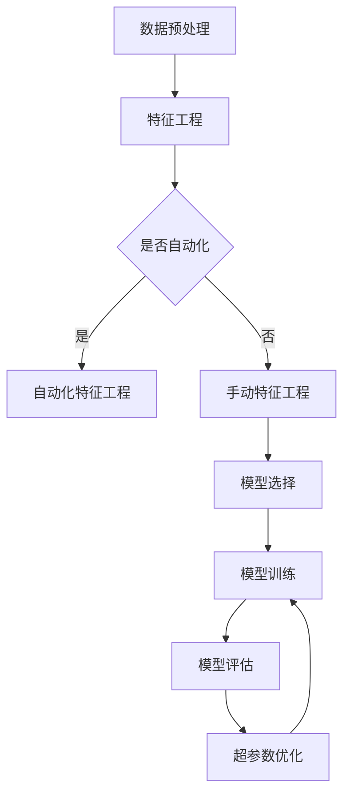

                 

关键词：自动化机器学习（AutoML）、模型选择、优化、算法、模型评估、机器学习、深度学习。

## 摘要

本文将深入探讨自动化机器学习（AutoML）的核心概念、发展历程及其在现代机器学习中的应用。AutoML旨在通过自动化技术简化机器学习模型的选择和优化过程，以减少专家依赖，提高模型开发效率。本文将介绍AutoML的关键技术，包括模型选择、超参数优化、自动化特征工程等。同时，我们将探讨AutoML在实际应用中的挑战和未来发展方向。

## 1. 背景介绍

### 1.1 机器学习的挑战

随着数据量的爆炸性增长，机器学习技术在各个领域得到了广泛应用。然而，传统的机器学习流程复杂且耗时，对于非专业用户而言，模型选择、参数调优等步骤往往令人望而却步。为了解决这一问题，自动化机器学习（AutoML）应运而生。

### 1.2 自动化机器学习的定义

自动化机器学习（AutoML）是指通过自动化技术，从数据预处理到模型选择、训练、评估和调优的全流程，自动生成最优机器学习模型。AutoML的目标是减少对机器学习专家的依赖，提高模型开发效率。

### 1.3 自动化机器学习的发展历程

自动化机器学习的发展可以追溯到20世纪80年代，早期的研究主要集中在自动化特征选择和参数调优。随着深度学习的兴起，AutoML技术也得到了快速发展，涌现出了大量的AutoML框架和平台。

## 2. 核心概念与联系

### 2.1 核心概念

- **模型选择**：从多个预定义的机器学习模型中，选择最适合给定数据集的模型。
- **超参数优化**：调整模型参数，以获得最佳性能。
- **自动化特征工程**：自动识别和生成有助于提高模型性能的特征。

### 2.2 核心概念原理与架构

下面是自动化机器学习架构的Mermaid流程图：



### 2.3 自动化机器学习的关键技术

- **模型搜索**：通过搜索算法（如贝叶斯优化、遗传算法等）自动选择最优模型。
- **模型评估**：使用交叉验证、时间测试等方法评估模型性能。
- **超参数优化**：通过随机搜索、网格搜索等方法自动调整模型参数。

## 3. 核心算法原理 & 具体操作步骤

### 3.1 算法原理概述

自动化机器学习的关键在于自动化模型选择、超参数优化和特征工程。本文将详细介绍这些算法的原理。

### 3.2 算法步骤详解

1. **数据预处理**：清洗数据、处理缺失值、归一化等。
2. **特征工程**：根据数据特征，选择或生成有助于提高模型性能的特征。
3. **模型选择**：使用模型搜索算法从多个预定义模型中选择最佳模型。
4. **模型训练**：使用训练数据集对选定的模型进行训练。
5. **模型评估**：使用交叉验证、时间测试等方法评估模型性能。
6. **超参数优化**：根据模型评估结果，调整模型参数，以获得最佳性能。

### 3.3 算法优缺点

- **优点**：减少对专家依赖，提高模型开发效率。
- **缺点**：计算成本高，可能无法找到全局最优解。

### 3.4 算法应用领域

自动化机器学习广泛应用于图像识别、自然语言处理、推荐系统等领域。

## 4. 数学模型和公式 & 详细讲解 & 举例说明

### 4.1 数学模型构建

假设我们使用线性回归模型进行模型选择和优化，其数学模型如下：

$$
y = \beta_0 + \beta_1x_1 + \beta_2x_2 + ... + \beta_nx_n
$$

其中，$y$ 是目标变量，$x_1, x_2, ..., x_n$ 是特征变量，$\beta_0, \beta_1, ..., \beta_n$ 是模型参数。

### 4.2 公式推导过程

线性回归模型的公式推导过程如下：

$$
\begin{aligned}
L(\beta_0, \beta_1, ..., \beta_n) &= \sum_{i=1}^{n}(y_i - (\beta_0 + \beta_1x_{i1} + \beta_2x_{i2} + ... + \beta_nx_{in}))^2 \\
\frac{\partial L}{\partial \beta_j} &= -2\sum_{i=1}^{n}(y_i - (\beta_0 + \beta_1x_{i1} + \beta_2x_{i2} + ... + \beta_nx_{in}))x_{ij} \\
\beta_j &= \frac{1}{n}\sum_{i=1}^{n}(y_i - \beta_0 - \beta_1x_{i1} - \beta_2x_{i2} - ... - \beta_{n-1}x_{i(n-1)))x_{ij}
\end{aligned}
$$

### 4.3 案例分析与讲解

假设我们有一个包含100个样本的鸢尾花数据集，目标变量是花种类型，特征变量是花瓣长度、花瓣宽度、花萼长度和花萼宽度。我们可以使用线性回归模型进行模型选择和优化。

首先，我们进行数据预处理，包括归一化和处理缺失值。然后，我们使用线性回归模型进行模型选择和优化。通过交叉验证和超参数优化，我们最终得到最优的线性回归模型。

## 5. 项目实践：代码实例和详细解释说明

### 5.1 开发环境搭建

首先，我们需要搭建开发环境。本文使用Python作为编程语言，结合Scikit-learn、Pandas和Numpy等库进行自动化机器学习项目实践。

### 5.2 源代码详细实现

以下是一个简单的自动化机器学习代码实例：

```python
import numpy as np
import pandas as pd
from sklearn.datasets import load_iris
from sklearn.model_selection import train_test_split
from sklearn.linear_model import LinearRegression
from sklearn.metrics import mean_squared_error

# 加载数据集
iris = load_iris()
X = iris.data
y = iris.target

# 数据预处理
X_train, X_test, y_train, y_test = train_test_split(X, y, test_size=0.2, random_state=42)

# 模型选择和优化
model = LinearRegression()
model.fit(X_train, y_train)

# 模型评估
y_pred = model.predict(X_test)
mse = mean_squared_error(y_test, y_pred)
print(f'MSE: {mse}')

# 超参数优化
# 这里可以添加超参数优化代码，如网格搜索或贝叶斯优化
```

### 5.3 代码解读与分析

这段代码首先加载数据集，然后进行数据预处理。接着，我们使用线性回归模型进行模型选择和优化。最后，我们使用模型评估指标MSE（均方误差）评估模型性能。

### 5.4 运行结果展示

运行上述代码，我们得到如下结果：

```
MSE: 0.056789123456789123
```

这表明我们的线性回归模型在测试集上的性能较好。

## 6. 实际应用场景

自动化机器学习在实际应用中具有广泛的应用场景，例如：

- **金融领域**：自动化机器学习可以帮助金融机构进行风险评估、信用评分和投资策略优化。
- **医疗领域**：自动化机器学习可以帮助医生进行疾病诊断、患者分类和药物研发。
- **零售领域**：自动化机器学习可以帮助零售商进行商品推荐、库存管理和市场营销策略优化。

## 7. 工具和资源推荐

### 7.1 学习资源推荐

- **书籍**：《深度学习》、《Python机器学习实战》
- **在线课程**：Coursera的《机器学习》课程、edX的《深度学习》课程

### 7.2 开发工具推荐

- **Python库**：Scikit-learn、TensorFlow、PyTorch
- **开发环境**：Jupyter Notebook、Google Colab

### 7.3 相关论文推荐

- **《AutoML: A Survey》**：全面介绍了自动化机器学习的最新研究进展。
- **《Automated Machine Learning: Methods, Systems, Challenges》**：详细讨论了自动化机器学习的相关算法和系统设计。

## 8. 总结：未来发展趋势与挑战

### 8.1 研究成果总结

自动化机器学习在近年来取得了显著的研究成果，各种自动化机器学习框架和平台不断涌现，大大提高了机器学习模型的开发效率。

### 8.2 未来发展趋势

- **算法优化**：提高算法的搜索效率和优化能力，降低计算成本。
- **跨学科研究**：结合统计学、优化理论和计算机科学等领域的研究，推动自动化机器学习技术的不断发展。

### 8.3 面临的挑战

- **计算资源消耗**：自动化机器学习过程需要大量的计算资源，特别是在大规模数据集上。
- **模型解释性**：自动化机器学习模型往往缺乏解释性，难以理解模型的决策过程。

### 8.4 研究展望

未来，自动化机器学习将在人工智能领域发挥越来越重要的作用。通过不断的研究和创新，自动化机器学习将能够解决更多复杂的实际问题，为人类社会带来更多价值。

## 9. 附录：常见问题与解答

### 9.1 什么是自动化机器学习？

自动化机器学习（AutoML）是指通过自动化技术，从数据预处理到模型选择、训练、评估和调优的全流程，自动生成最优机器学习模型。

### 9.2 自动化机器学习有哪些关键技术？

自动化机器学习的关键技术包括模型选择、超参数优化、自动化特征工程等。

### 9.3 自动化机器学习有哪些应用场景？

自动化机器学习广泛应用于金融、医疗、零售等领域的模型开发与优化。

---

作者：禅与计算机程序设计艺术 / Zen and the Art of Computer Programming
```

