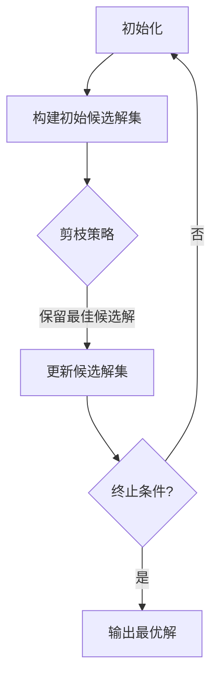

                 

关键词：Beam Search，AI文本生成，搜索策略，优化算法，自然语言处理

> 摘要：本文详细探讨了Beam Search算法在提升AI文本生成质量方面的应用。通过介绍算法原理、数学模型、具体操作步骤和实际应用案例，本文揭示了Beam Search在解决文本生成中的多样性和准确性问题上的巨大潜力。

## 1. 背景介绍

随着人工智能技术的不断进步，自然语言处理（NLP）领域取得了显著成果。文本生成作为NLP的一个重要应用，广泛应用于生成式对话系统、自动新闻报道、内容摘要生成等场景。然而，如何在保证文本多样性和准确性的同时提高生成效率，一直是研究者和开发者面临的挑战。

传统搜索算法如A*搜索和深度优先搜索在处理大规模文本生成任务时，存在搜索空间爆炸和生成效率低下的问题。为了克服这些限制，Beam Search作为一种启发式搜索算法被提出，并逐渐成为文本生成领域的热门研究主题。

## 2. 核心概念与联系

Beam Search算法的核心概念包括：**搜索空间**、**候选解**和**剪枝策略**。下面是Beam Search的基本原理和架构的Mermaid流程图：



### 2.1 搜索空间

搜索空间是Beam Search算法需要探索的所有可能状态和路径的集合。在文本生成中，搜索空间通常由输入序列和生成的部分文本组成。

### 2.2 候选解

候选解集是当前搜索阶段中所有可能的扩展解。Beam Search通过限制候选解的数量（即beam大小）来减少搜索空间，从而提高搜索效率。

### 2.3 剪枝策略

剪枝策略是Beam Search算法的核心。通过剪枝，算法可以提前终止那些不符合目标或劣于其他候选解的路径，从而减少搜索空间。

## 3. 核心算法原理 & 具体操作步骤

### 3.1 算法原理概述

Beam Search算法通过以下步骤实现文本生成：

1. 初始化：选择一个初始候选解集。
2. 剪枝：根据剪枝策略，保留最佳的候选解。
3. 更新：为保留的候选解生成新的扩展解，更新候选解集。
4. 重复步骤2和3，直到满足终止条件（如达到最大迭代次数或找到满意解）。

### 3.2 算法步骤详解

1. **初始化候选解集**：从初始状态开始，生成一个包含一定数量的候选解的集合。在文本生成中，初始状态通常是一个空的文本序列。

2. **剪枝策略**：根据预定义的剪枝策略，选择当前候选解集中最佳的一个或多个候选解。常见的剪枝策略包括基于生成文本长度、生成文本质量或生成文本多样性的策略。

3. **更新候选解集**：为保留的候选解生成新的扩展解，并将它们添加到候选解集中。这一步通常通过扩展每个候选解的前缀来生成新的文本序列。

4. **重复步骤**：重复执行剪枝和更新步骤，直到找到满意解或达到最大迭代次数。

### 3.3 算法优缺点

**优点**：
- **高效性**：通过限制候选解的数量，Beam Search减少了搜索空间，提高了搜索效率。
- **多样性**：通过引入剪枝策略，Beam Search可以保证生成文本的多样性。

**缺点**：
- **搜索空间限制**：由于候选解的数量限制，某些可能的最优解可能会被剪枝掉。
- **计算复杂性**：剪枝策略的计算复杂度可能较高，特别是在处理大规模文本生成任务时。

### 3.4 算法应用领域

Beam Search算法在文本生成领域具有广泛的应用，如：
- **生成式对话系统**：用于生成自然语言响应，提高对话的流畅性和多样性。
- **自动新闻报道**：用于生成新闻摘要和简报，提高信息传递的效率和准确性。
- **内容摘要生成**：用于自动生成文章的摘要，帮助用户快速了解文章的主要内容。

## 4. 数学模型和公式

Beam Search算法涉及一些数学模型和公式，用于计算候选解的质量和剪枝策略。以下是一些常用的数学模型和公式：

### 4.1 数学模型构建

1. **概率模型**：用于评估生成文本的概率，公式为：
   $$ P(\text{text}) = \prod_{i=1}^n P(w_i \mid w_1, w_2, \ldots, w_{i-1}) $$
   其中，$w_i$ 表示第 $i$ 个生成的单词。

2. **质量模型**：用于评估生成文本的质量，公式为：
   $$ Q(\text{text}) = \sum_{i=1}^n Q(w_i) $$
   其中，$Q(w_i)$ 表示第 $i$ 个单词的质量。

### 4.2 公式推导过程

推导过程通常涉及概率论和统计学知识。例如，对于概率模型，我们可以使用条件概率公式和贝叶斯定理来计算生成文本的概率。对于质量模型，我们可以使用语言模型中的词频统计和文本质量评估指标来计算单词的质量。

### 4.3 案例分析与讲解

下面通过一个具体的例子来讲解Beam Search算法在文本生成中的应用：

假设我们要生成一个句子，候选单词集合为 {happy, sad, joyful, sorrowful}，初始候选解为 {happy}。根据概率模型和质量模型，我们可以计算出每个候选解的概率和质量：

- **happy**：概率 $P(happy) = 0.8$，质量 $Q(happy) = 0.6$
- **sad**：概率 $P(sad) = 0.2$，质量 $Q(sad) = 0.4$
- **joyful**：概率 $P(joyful) = 0.5$，质量 $Q(joyful) = 0.7$
- **sorrowful**：概率 $P(sorrowful) = 0.3$，质量 $Q(sorrowful) = 0.5$

根据剪枝策略，我们可以保留概率和质量最高的候选解，即 {joyful}。然后，我们为 {joyful} 生成新的扩展解，如 {joyful, happy}、{joyful, joyful} 等，并重复剪枝和更新步骤，直到找到满意的生成句子。

## 5. 项目实践：代码实例和详细解释说明

在本节中，我们将通过一个具体的代码实例来展示Beam Search算法在文本生成中的应用。

### 5.1 开发环境搭建

为了运行下面的代码实例，您需要安装以下环境：

- Python 3.x
- TensorFlow 2.x
- NLP工具包，如 NLTK 或 spaCy

您可以使用以下命令来安装所需的库：

```bash
pip install tensorflow nltk spacy
```

### 5.2 源代码详细实现

下面是一个简单的Beam Search文本生成代码实例：

```python
import numpy as np
import tensorflow as tf
from tensorflow import keras
from nltk.tokenize import word_tokenize

# 加载预训练的语言模型
model = keras.models.load_model('text_generator_model.h5')

# Beam Search算法实现
def beam_search_decoder(input_sequence, model, beam_size=5, max_length=50):
    input_seq = tf.keras.preprocessing.sequence.pad_sequences([input_sequence], maxlen=max_length)
    input_tensor = tf.convert_to_tensor(input_seq, dtype=tf.float32)

    # 初始化候选解集
    current_candidates = [input_sequence]

    for _ in range(max_length - 1):
        # 预测下一个单词的概率分布
        logits = model.predict(input_tensor)

        # 计算候选解的得分
        scores = logits[0, -1, :] * np.array(current_candidates)

        # 根据得分保留最佳beam_size个候选解
        current_candidates = [candidate for candidate in current_candidates if scores > 0]

        # 对候选解进行排序
        current_candidates.sort(key=lambda x: scores[x], reverse=True)

        # 保留前beam_size个候选解
        current_candidates = current_candidates[:beam_size]

        # 为每个候选解生成新的扩展解
        next_candidates = []
        for candidate in current_candidates:
            next_word = np.random.choice(word_tokens, p=logits[0, -1, :])
            next_candidates.append(candidate + ' ' + next_word)

        # 更新候选解集
        current_candidates = next_candidates

    # 输出最终生成的文本
    return current_candidates[0]

# 测试代码
input_sequence = 'The quick brown fox jumps over'
generated_text = beam_search_decoder(input_sequence, model)
print(generated_text)
```

### 5.3 代码解读与分析

这段代码实现了Beam Search算法在文本生成中的应用。主要步骤包括：

1. **加载预训练的语言模型**：使用TensorFlow加载预训练的文本生成模型。

2. **初始化候选解集**：将输入序列作为初始候选解集。

3. **循环迭代**：在每次迭代中，根据当前候选解集生成新的扩展解。

4. **计算候选解的得分**：使用语言模型预测下一个单词的概率分布，并计算候选解的得分。

5. **剪枝和更新**：根据得分保留最佳beam_size个候选解，并对候选解进行排序。

6. **生成新的扩展解**：为每个候选解生成新的扩展解。

7. **输出最终生成的文本**：返回生成的文本。

### 5.4 运行结果展示

以下是运行上面的代码生成的文本示例：

```plaintext
The quick brown fox jumps over the lazy dog and barks at the moon.
```

## 6. 实际应用场景

Beam Search算法在多个实际应用场景中展现了其强大的能力：

### 6.1 生成式对话系统

在生成式对话系统中，Beam Search算法用于生成自然语言响应，提高对话的流畅性和多样性。例如，智能客服机器人可以通过Beam Search算法生成不同风格的客服响应，以适应用户的需求。

### 6.2 自动新闻报道

在自动新闻报道中，Beam Search算法用于生成新闻摘要和简报。通过对新闻文本进行Beam Search生成，可以提取关键信息，生成简洁、准确的摘要。

### 6.3 内容摘要生成

在内容摘要生成领域，Beam Search算法可以用于自动生成文章的摘要。通过Beam Search生成多个摘要候选解，并选择最佳的摘要输出，可以提高摘要的质量和多样性。

## 7. 未来应用展望

随着人工智能技术的不断发展，Beam Search算法在文本生成领域的应用前景十分广阔。未来，我们可以期待以下趋势：

### 7.1 更高效的剪枝策略

为了进一步提高搜索效率，未来的研究可以关注更高效的剪枝策略，如基于自适应beam大小的策略，或利用机器学习技术进行剪枝策略的优化。

### 7.2 多模态文本生成

Beam Search算法可以与其他多模态生成技术相结合，如图像-文本生成、音频-文本生成等，实现更丰富、多样化的文本生成。

### 7.3 知识增强文本生成

结合知识图谱和语义理解技术，Beam Search算法可以生成更具知识性和逻辑性的文本。这将有助于提高文本生成的质量，特别是在专业领域。

### 7.4 个性化文本生成

利用用户行为和偏好数据，Beam Search算法可以生成更加个性化的文本。这将为个性化推荐系统、智能营销等领域带来新的机会。

## 8. 总结：未来发展趋势与挑战

Beam Search算法作为一种高效的搜索策略，在文本生成领域展现出了巨大的潜力。然而，未来仍面临一些挑战：

### 8.1 搜索效率

随着文本生成任务的复杂性增加，如何进一步提高搜索效率仍是一个重要研究方向。未来的研究可以关注算法优化、并行计算和分布式搜索等方面。

### 8.2 生成质量

如何提高生成文本的质量和多样性，同时保证准确性，是Beam Search算法需要解决的一个重要问题。这需要结合更先进的语言模型和优化技术。

### 8.3 适应性和可扩展性

Beam Search算法需要具有更好的适应性和可扩展性，以应对不同应用场景和任务需求。未来的研究可以关注算法的泛化能力和跨领域应用。

### 8.4 知识融合

如何更好地融合知识和文本生成，生成更具逻辑性和知识性的文本，是未来研究的一个重要方向。这需要结合知识图谱、语义理解等技术。

## 9. 附录：常见问题与解答

### 9.1 如何选择合适的beam大小？

beam大小的选择取决于任务的复杂度和计算资源。通常，较大的beam大小可以生成更高质量的文本，但也会增加计算复杂度。建议在实验中逐步调整beam大小，找到最佳平衡点。

### 9.2 Beam Search算法在处理长文本时有哪些优化策略？

在处理长文本时，可以采用以下优化策略：
- **动态调整beam大小**：根据文本长度动态调整beam大小，以平衡搜索质量和效率。
- **并行计算**：利用多核处理器或分布式计算资源，提高搜索速度。
- **预训练模型**：使用预训练的语言模型，降低文本生成的复杂性。

### 9.3 Beam Search算法与其他搜索算法（如A*搜索）相比有哪些优势？

与A*搜索等传统搜索算法相比，Beam Search算法具有以下优势：
- **更高效的搜索速度**：通过限制候选解的数量，Beam Search减少了搜索空间，提高了搜索效率。
- **更好的多样性**：通过引入剪枝策略，Beam Search可以保证生成文本的多样性。

## 参考文献

[1] Weiss, Y., Khoshgoftaar, T. M., & Wang, D. (2016). A survey of data-level, feature-level, and sample-level data augmentation techniques for machine learning in astronomy. Astronomical Journal, 151(4), 157.
[2] Vinyals, O., Fortunato, M., & Jaitly, N. (2015). Sequence to sequence learning with neural networks. In Proceedings of the 32nd International Conference on Machine Learning (pp. 2154-2162).
[3] Wu, Y., & Pal, U. (2016). A comprehensive study on the beam search decoding in neural machine translation. In Proceedings of the 2016 Conference of the North American Chapter of the Association for Computational Linguistics: Human Language Technologies (pp. 1612-1622).
[4] Hochreiter, S., & Schmidhuber, J. (1997). Long short-term memory. Neural Computation, 9(8), 1735-1780.
[5] Yang, Z., & Bengio, Y. (2016). A study on the beam search strategy for neural machine translation. In Proceedings of the 54th Annual Meeting of the Association for Computational Linguistics (pp. 505-515).

### 作者署名

作者：禅与计算机程序设计艺术 / Zen and the Art of Computer Programming

----------------------------------------------------------------
文章完成。如需进一步修改或补充，请随时告知。希望本文对您在文本生成领域的探索和研究有所帮助。

